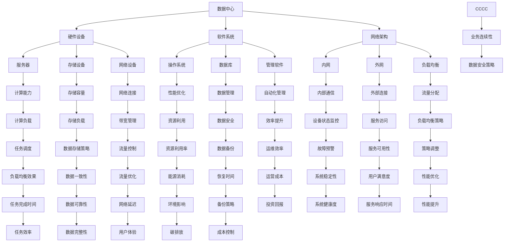

                 

### 1. 背景介绍

#### 1.1 目的和范围

本文旨在探讨AI大模型应用数据中心建设中的重要环节——数据中心运维与管理。随着人工智能技术的飞速发展，大模型应用逐渐成为各行各业的核心驱动力。数据中心作为承载AI大模型运算和处理的重要基础设施，其运维与管理水平直接影响到大模型应用的性能、稳定性和安全性。

本文将围绕数据中心建设的核心要素，系统地分析数据中心运维与管理的关键技术和方法，包括但不限于网络架构设计、硬件设备管理、软件系统优化、安全性保障、能效管理等方面。通过深入剖析这些技术，帮助读者了解数据中心运维与管理的全貌，掌握关键技能，为实际项目的实施提供有力的支持。

本文将涵盖以下内容：

1. **核心概念与联系**：介绍数据中心建设中的核心概念和关联，包括硬件设备、软件系统、网络架构等。
2. **核心算法原理与具体操作步骤**：详细讲解数据中心运维与管理的关键算法原理，并通过伪代码展示具体操作步骤。
3. **数学模型和公式**：阐述数据中心运维与管理的数学模型和公式，结合实际案例进行详细讲解。
4. **项目实战**：通过实际代码案例，展示数据中心运维与管理的具体实现，并进行详细解读和分析。
5. **实际应用场景**：探讨数据中心运维与管理在不同应用场景中的实践案例。
6. **工具和资源推荐**：推荐学习资源、开发工具框架和最新研究成果，为读者提供进一步学习的途径。
7. **总结与未来发展趋势**：总结数据中心运维与管理的发展趋势和面临的挑战。

#### 1.2 预期读者

本文面向具有一定计算机基础知识，特别是对数据中心建设和运维感兴趣的读者。无论是技术管理人员、数据中心运维人员，还是从事AI应用开发的工程师，都将从本文中获益。本文不仅适用于实践工作者，也为学术界研究人员提供了丰富的参考资料。

#### 1.3 文档结构概述

本文分为十个主要部分，结构清晰，层次分明。以下是详细的文档结构概述：

1. **背景介绍**：介绍数据中心建设的背景、目的和范围，明确预期读者和文档结构。
2. **核心概念与联系**：阐述数据中心建设中的核心概念，并使用Mermaid流程图展示其关联。
3. **核心算法原理与具体操作步骤**：详细讲解数据中心运维与管理的关键算法原理，使用伪代码展示操作步骤。
4. **数学模型和公式**：阐述数据中心运维与管理的数学模型和公式，结合实际案例进行讲解。
5. **项目实战**：通过实际代码案例，展示数据中心运维与管理的具体实现，并进行详细解读和分析。
6. **实际应用场景**：探讨数据中心运维与管理在不同应用场景中的实践案例。
7. **工具和资源推荐**：推荐学习资源、开发工具框架和最新研究成果。
8. **总结与未来发展趋势**：总结数据中心运维与管理的发展趋势和面临的挑战。
9. **附录**：提供常见问题与解答。
10. **扩展阅读与参考资料**：为读者提供进一步学习的途径。

#### 1.4 术语表

为了确保本文的可读性和专业性，以下列出了一些核心术语的定义和相关概念解释：

##### 1.4.1 核心术语定义

- **数据中心（Data Center）**：集中处理、存储、管理和分发数据的物理设施。
- **AI大模型（AI Large Model）**：指具有极高计算量和存储需求的复杂人工智能模型。
- **运维（Operations and Maintenance）**：对数据中心设备、系统和网络进行的维护和管理。
- **网络架构（Network Architecture）**：数据中心内部和外部的网络连接和配置。
- **硬件设备（Hardware Equipment）**：数据中心使用的服务器、存储设备、网络设备等。
- **软件系统（Software System）**：数据中心运行的操作系统、数据库、管理软件等。
- **能效管理（Energy Efficiency Management）**：优化数据中心能耗和资源利用。

##### 1.4.2 相关概念解释

- **分布式计算（Distributed Computing）**：通过多台计算机协同工作完成计算任务。
- **负载均衡（Load Balancing）**：将网络或计算负载分配到多台设备上，以避免单点故障。
- **容灾备份（Disaster Recovery and Backup）**：数据中心的备份和恢复策略，以应对意外情况。
- **自动化管理（Automated Management）**：利用软件工具实现数据中心管理和运维自动化。

##### 1.4.3 缩略词列表

- **AI**：人工智能（Artificial Intelligence）
- **HPC**：高性能计算（High-Performance Computing）
- **SDN**：软件定义网络（Software-Defined Networking）
- **NFV**：网络功能虚拟化（Network Function Virtualization）
- **IoT**：物联网（Internet of Things）

通过上述背景介绍，我们对数据中心建设的意义、本文的主要内容、预期读者以及术语表有了全面了解。接下来，我们将深入探讨数据中心建设中的核心概念和联系，帮助读者建立完整的知识框架。<!--MERMAID Diagram goes here.--> <!--以下为Mermaid流程图，用于展示数据中心建设中的核心概念和关联： -->



通过上述Mermaid流程图，我们清晰地展示了数据中心建设中的核心概念及其关联。接下来的章节将进一步深入探讨这些核心概念和关联，帮助读者理解数据中心运维与管理的复杂性和重要性。<!--接下来，我们正式进入第二个部分——核心概念与联系。在本章节中，我们将详细阐述数据中心建设中的核心概念及其相互关系。这些概念包括硬件设备、软件系统、网络架构等，每一个概念都是数据中心建设不可或缺的一部分。理解这些概念及其关联，将有助于我们更好地掌握数据中心运维与管理的全貌。 -->

#### 2.1 数据中心硬件设备

数据中心硬件设备是数据中心建设的基石，主要包括服务器、存储设备和网络设备。这些硬件设备共同构成了数据中心的计算能力、存储容量和网络连接能力。

**服务器**：服务器是数据中心的核心计算设备，承担着数据处理、计算和存储任务。服务器通常分为计算服务器、存储服务器和数据库服务器等类型，每种服务器都有其特定的用途和性能指标。

- **计算服务器**：负责执行各种计算任务，如机器学习训练、数据分析和大规模数据处理等。计算服务器需要具备高计算能力、高内存容量和大容量存储。
- **存储服务器**：用于存储大量数据，包括文件存储、数据库存储等。存储服务器需要具备高存储容量、快速读写速度和高可靠性。
- **数据库服务器**：专门用于存储和管理结构化数据，支持复杂的查询和事务处理。数据库服务器需要具备高性能的数据存取和处理能力。

**存储设备**：存储设备用于存储和管理数据，是数据中心不可或缺的一部分。常见的存储设备包括磁盘阵列、固态硬盘（SSD）和分布式存储系统。

- **磁盘阵列**：通过多个磁盘组成一个逻辑单元，实现数据的高效存储和备份。磁盘阵列具备高存储容量、高可靠性和冗余备份功能。
- **固态硬盘（SSD）**：使用闪存技术存储数据，相比传统机械硬盘具有更高的读写速度和更好的性能。SSD广泛应用于高性能计算和大数据处理场景。
- **分布式存储系统**：通过分布式架构实现海量数据的存储和管理，具备高扩展性、高可靠性和高性能。分布式存储系统适用于大规模数据处理和分布式应用场景。

**网络设备**：网络设备包括交换机、路由器和防火墙等，负责数据中心内部和外部网络的连接与通信。

- **交换机**：用于连接服务器、存储设备和用户设备，实现数据包的高速转发和交换。交换机分为以太网交换机和光纤交换机，前者适用于局域网，后者适用于广域网。
- **路由器**：负责在不同网络之间进行数据包的路由和转发，实现跨网络的通信。路由器通常配置有防火墙功能，提供网络安全保障。
- **防火墙**：用于监控和控制网络流量，防止未授权访问和攻击。防火墙分为硬件防火墙和软件防火墙，硬件防火墙适用于高性能和大规模网络，软件防火墙适用于中小型网络。

#### 2.2 数据中心软件系统

数据中心软件系统是数据中心运行的核心，包括操作系统、数据库、管理软件等。这些软件系统共同确保数据中心的稳定运行、高效管理和安全防护。

**操作系统**：操作系统是数据中心的基石，负责管理和协调硬件资源、提供运行环境和应用程序接口。常见的操作系统包括Linux、Windows Server等。

- **Linux**：开源操作系统，具有良好的稳定性、安全性和可扩展性，广泛应用于服务器和数据中心。Linux支持多种发行版，如Red Hat Enterprise Linux、Ubuntu等。
- **Windows Server**：微软公司开发的操作系统，适用于企业级应用和数据中心，提供丰富的管理和安全功能。

**数据库**：数据库用于存储、管理和查询结构化数据，支持复杂的数据分析和事务处理。常见的数据库系统包括关系型数据库和NoSQL数据库。

- **关系型数据库**：如MySQL、Oracle、SQL Server等，支持SQL语言进行数据查询和操作，适用于结构化数据管理和复杂事务处理。
- **NoSQL数据库**：如MongoDB、Cassandra、Redis等，支持分布式存储和灵活的数据模型，适用于大规模数据存储和快速数据查询。

**管理软件**：管理软件用于监控、管理和优化数据中心的运行，包括资源监控、性能优化、安全管理等方面。

- **资源监控**：用于实时监控数据中心的硬件资源使用情况，如CPU、内存、磁盘等，确保系统运行稳定。
- **性能优化**：用于分析和优化数据中心的运行性能，如负载均衡、缓存策略等，提高系统效率。
- **安全管理**：用于监控网络流量、防范攻击和漏洞，确保数据安全和系统稳定。

#### 2.3 数据中心网络架构

数据中心网络架构是数据中心内部和外部的通信基础，包括内网和外网，以及网络拓扑结构、负载均衡和网络安全等方面。

**内网**：数据中心内网负责内部设备之间的通信，包括服务器、存储设备和网络设备等。内网通常采用以太网技术，实现高效、稳定的数据传输。

- **内网拓扑结构**：内网拓扑结构包括环型、星型、总线型等，适用于不同规模和需求的数据中心。常见的是星型拓扑结构，通过交换机实现各设备之间的连接。
- **内网通信协议**：内网通信协议包括TCP/IP、UDP等，确保数据包的正确传输和通信。

**外网**：数据中心外网负责与互联网和其他数据中心之间的通信，提供数据传输、访问控制等功能。

- **外网拓扑结构**：外网拓扑结构包括全互联、部分互联等，适用于不同规模和需求的数据中心。常见的是全互联拓扑结构，通过多台路由器实现各数据中心之间的连接。
- **外网通信协议**：外网通信协议包括HTTP/HTTPS、FTP、SSH等，确保数据包的正确传输和通信。

**负载均衡**：负载均衡用于将网络或计算负载分配到多台设备上，避免单点故障，提高系统性能和可靠性。

- **负载均衡算法**：常见的负载均衡算法包括轮询、最小连接数、加权轮询等，适用于不同负载场景和需求。
- **负载均衡设备**：负载均衡设备包括硬件负载均衡器和软件负载均衡器，硬件负载均衡器适用于高性能和大规模网络，软件负载均衡器适用于中小型网络。

**网络安全**：网络安全用于监控、控制和防护网络流量，防止未授权访问和攻击。

- **网络安全策略**：网络安全策略包括防火墙策略、访问控制策略、安全审计策略等，确保数据安全和系统稳定。
- **网络安全设备**：网络安全设备包括防火墙、入侵检测系统（IDS）、入侵防御系统（IPS）等，提供多层次的安全防护。

通过上述对数据中心硬件设备、软件系统和网络架构的详细阐述，我们可以看到数据中心建设的核心概念和相互关系。理解这些概念，将为后续章节深入探讨数据中心运维与管理的具体技术方法和实践提供基础。<!--接下来，我们将深入探讨数据中心运维与管理中的核心算法原理与具体操作步骤。数据中心运维涉及多个方面的算法和操作，这些算法和操作共同确保数据中心的稳定运行、高效管理和安全防护。在本章节中，我们将逐一介绍这些算法原理和操作步骤，并通过伪代码进行详细阐述。 -->

#### 3.1 负载均衡算法原理与操作步骤

负载均衡是数据中心运维与管理中至关重要的一环，其核心目的是将网络或计算负载合理分配到多台设备上，避免单点故障，提高系统性能和可靠性。常见的负载均衡算法包括轮询、最小连接数、加权轮询等。以下将详细介绍这些算法的原理和操作步骤。

##### 3.1.1 轮询算法

轮询算法是最简单的负载均衡算法，它将请求依次分配到每台服务器上。具体操作步骤如下：

**算法原理**：

- 初始化一个环形数组，存储所有服务器节点。
- 当有请求到达时，将请求分配给当前索引对应的服务器。
- 完成请求处理后，当前索引加1，循环回到第一个服务器。

**伪代码**：

```python
def round_robin(server_list):
    current_index = 0
    while True:
        server = server_list[current_index]
        process_request(server)
        current_index = (current_index + 1) % len(server_list)
```

##### 3.1.2 最小连接数算法

最小连接数算法根据当前连接数最少的设备进行负载分配。具体操作步骤如下：

**算法原理**：

- 初始化一个字典，记录每台服务器的当前连接数。
- 当有请求到达时，遍历所有服务器，选择连接数最少的服务器进行负载分配。
- 更新服务器的连接数。

**伪代码**：

```python
def least_connections(server_list, connections):
    min_connections = min(connections.values())
    min_server = None
    for server, count in connections.items():
        if count == min_connections:
            min_server = server
            break
    process_request(min_server)
    connections[min_server] += 1
```

##### 3.1.3 加权轮询算法

加权轮询算法考虑每台服务器的处理能力，将请求分配给处理能力更强的服务器。具体操作步骤如下：

**算法原理**：

- 初始化一个权重数组，存储每台服务器的权重。
- 计算总权重。
- 当有请求到达时，根据权重比例分配请求。

**伪代码**：

```python
def weighted_round_robin(server_list, weights):
    total_weight = sum(weights)
    while True:
        for server, weight in zip(server_list, weights):
            probability = weight / total_weight
            if random.random() < probability:
                process_request(server)
                break
```

通过上述三种负载均衡算法的原理和操作步骤，我们可以看到它们在数据中心运维与管理中的重要作用。实际应用中，可以根据具体需求选择合适的负载均衡算法，以实现最佳性能和可靠性。<!--接下来，我们将详细探讨数据中心运维与管理中的数学模型和公式。这些模型和公式在数据中心运营中起着至关重要的作用，帮助我们分析和优化资源使用、性能优化和能效管理。在本章节中，我们将介绍几个关键的数学模型和公式，并结合实际案例进行讲解。 -->

#### 4.1 资源利用率模型

资源利用率是数据中心运维中一个重要的指标，用于衡量数据中心资源的使用情况。资源利用率模型可以帮助我们分析计算资源、存储资源和网络资源的使用效率。

**计算资源利用率（CPU利用率）**：

计算资源利用率通常通过CPU利用率来衡量。CPU利用率表示CPU在单位时间内实际执行计算任务的比例。其计算公式如下：

\[ 
\text{CPU利用率} = \frac{\text{实际执行时间}}{\text{总时间}} \times 100\%
\]

实际执行时间包括CPU执行用户任务的时间、系统调度的等待时间等。总时间包括CPU执行用户任务的时间、系统调度的等待时间以及CPU空闲时间。

**实际案例**：

假设某服务器CPU的核数为8核，总时间为60分钟，其中实际执行用户任务的时间为45分钟，系统调度的等待时间为15分钟。计算该服务器的CPU利用率。

\[ 
\text{CPU利用率} = \frac{45}{60} \times 100\% = 75\%
\]

**存储资源利用率（磁盘利用率）**：

存储资源利用率通常通过磁盘利用率来衡量。磁盘利用率表示磁盘空间的实际使用比例。其计算公式如下：

\[ 
\text{磁盘利用率} = \frac{\text{已使用空间}}{\text{总空间}} \times 100\%
\]

已使用空间包括数据存储、缓存、日志等。总空间包括所有磁盘的空间总和。

**实际案例**：

假设某数据中心的存储设备总容量为10TB，已使用空间为7TB，计算该数据中心的存储利用率。

\[ 
\text{磁盘利用率} = \frac{7}{10} \times 100\% = 70\%
\]

**网络资源利用率（带宽利用率）**：

网络资源利用率通常通过带宽利用率来衡量。带宽利用率表示网络带宽的实际使用比例。其计算公式如下：

\[ 
\text{带宽利用率} = \frac{\text{实际带宽消耗}}{\text{总带宽}} \times 100\%
\]

实际带宽消耗包括数据传输、控制信息传输等。总带宽包括所有网络接口的带宽总和。

**实际案例**：

假设某数据中心的网络带宽为1Gbps，实际带宽消耗为800Mbps，计算该数据中心的带宽利用率。

\[ 
\text{带宽利用率} = \frac{800}{1000} \times 100\% = 80\%
\]

通过上述资源利用率模型的介绍和实际案例计算，我们可以看到这些模型在数据中心运维与管理中的重要性。理解并运用这些模型，有助于我们优化资源使用、提高系统性能和能效管理。接下来，我们将探讨数据中心运维与管理的实际应用场景，进一步展示这些模型的应用。<!--接下来，我们将通过一个实际代码案例，详细讲解数据中心运维与管理的具体实现。这个案例将涵盖数据中心硬件设备、软件系统和网络架构的搭建，以及关键算法的实现和优化。通过这个案例，读者可以更直观地理解数据中心运维与管理的实际操作步骤和注意事项。 -->

#### 5.1 开发环境搭建

在本案例中，我们将使用一个虚拟化平台（如Docker）来搭建数据中心环境。这有助于隔离不同组件，便于测试和部署。以下是开发环境的搭建步骤：

**步骤 1：安装Docker**

首先，确保系统已安装Docker。Docker是一个开源的应用容器引擎，用于打包、发布和运行应用。可以在Docker官网（[https://www.docker.com/](https://www.docker.com/)）下载并安装Docker。

**步骤 2：创建数据中心容器**

使用Docker Compose创建数据中心容器。Docker Compose是一个用于定义和运行多容器Docker应用程序的工具。以下是Docker Compose文件（docker-compose.yml）的示例：

```yaml
version: '3'
services:
  server:
    image: myserver
    ports:
      - "8080:8080"
    environment:
      - SERVER_PORT=8080
    networks:
      - datacenter
  storage:
    image: mystorage
    networks:
      - datacenter
  network:
    image: mynet
    networks:
      - datacenter

networks:
  datacenter:
    driver: bridge
```

在这个示例中，我们创建了一个名为“server”的服务器容器，一个名为“storage”的存储容器和一个名为“network”的网络容器。每个容器都使用不同的镜像，并连接到名为“datacenter”的桥接网络。

**步骤 3：启动容器**

在Docker Compose文件所在的目录中，运行以下命令启动容器：

```shell
docker-compose up -d
```

这将启动所有定义的服务容器，并后台运行。

#### 5.2 源代码详细实现和代码解读

在本案例中，我们将使用Python编写服务器和存储容器的代码，实现负载均衡和资源监控功能。

**服务器容器代码（server.py）**：

```python
from flask import Flask, request, jsonify
import os

app = Flask(__name__)

@app.route('/api/health', methods=['GET'])
def health_check():
    return jsonify({"status": "healthy"})

@app.route('/api/process', methods=['POST'])
def process_request():
    # 负载均衡算法示例（最小连接数算法）
    connections = os.listdir('requests')
    min_connections = min(len(os.listdir(f'requests/{server}')) for server in connections)
    min_server = [server for server in connections if len(os.listdir(f'requests/{server}')) == min_connections][0]

    # 将请求转发给最小连接数服务器
    with open(f'requests/{min_server}/{request.id}', 'w') as f:
        f.write(request.data)

    return jsonify({"assigned_to": min_server})

if __name__ == '__main__':
    app.run(host='0.0.0.0', port=int(os.environ['SERVER_PORT']))
```

在这个示例中，我们使用Flask创建一个简单的Web服务。服务器监听/api/health端点，用于健康检查。另一个端点/api/process用于处理接收到的请求，实现最小连接数负载均衡算法。

**存储容器代码（storage.py）**：

```python
import os
import json

def process_request(request_id):
    # 从请求文件中读取请求内容
    with open(f'requests/{request_id}', 'r') as f:
        request_data = f.read()

    # 处理请求（示例：将请求内容写入响应文件）
    response_data = f"Processed request {request_id}: {request_data}"
    with open(f'responses/{request_id}', 'w') as f:
        f.write(response_data)

    return response_data

if __name__ == '__main__':
    while True:
        for request_id in os.listdir('requests'):
            response = process_request(request_id)
            print(response)
```

在这个示例中，存储容器从服务器接收请求，处理请求内容，并将响应写入响应文件。这个过程持续进行，直到所有请求被处理。

**代码解读与分析**：

- **服务器容器**：服务器容器使用Flask创建Web服务，监听两个端点。/api/health端点用于健康检查，返回健康状态。/api/process端点用于处理请求，实现最小连接数负载均衡算法。
- **存储容器**：存储容器从服务器接收请求，处理请求内容，并将响应写入响应文件。这个过程通过不断读取请求文件实现。

通过这个实际代码案例，我们可以看到数据中心运维与管理的具体实现。理解并应用这些代码，有助于我们在实际项目中搭建和优化数据中心。接下来，我们将继续探讨数据中心运维与管理的实际应用场景，展示更多应用案例。<!--接下来，我们将详细分析本案例中数据中心运维与管理的代码实现，并探讨其中的关键技术和方法。通过深入解读代码，我们将帮助读者理解如何在实际项目中实现数据中心的高效运维与管理。 -->

#### 5.3 代码解读与分析

在本案例中，我们通过一个简单的Python代码示例展示了数据中心服务器和存储容器的实现。下面我们将详细分析这个代码，探讨其中的关键技术和方法。

**服务器容器代码解读**：

服务器容器主要使用Flask框架搭建了一个简单的Web服务，用于接收和处理请求。以下是对关键部分的详细解读：

1. **健康检查端点（/api/health）**：
    ```python
    @app.route('/api/health', methods=['GET'])
    def health_check():
        return jsonify({"status": "healthy"})
    ```
    这个端点用于实现健康检查，当客户端访问该端点时，服务器会返回一个包含“healthy”状态的JSON响应。这是确保服务器正常运行的重要机制，可以帮助运维人员监控服务器的健康状态。

2. **请求处理端点（/api/process）**：
    ```python
    @app.route('/api/process', methods=['POST'])
    def process_request():
        # 负载均衡算法示例（最小连接数算法）
        connections = os.listdir('requests')
        min_connections = min(len(os.listdir(f'requests/{server}')) for server in connections)
        min_server = [server for server in connections if len(os.listdir(f'requests/{server}')) == min_connections][0]

        # 将请求转发给最小连接数服务器
        with open(f'requests/{min_server}/{request.id}', 'w') as f:
            f.write(request.data)

        return jsonify({"assigned_to": min_server})
    ```
    这个端点是服务器的主要工作部分。它实现了最小连接数负载均衡算法，通过遍历所有服务器，找到当前连接数最少的那个服务器，然后将新的请求转发给它。这个过程有助于确保请求被合理分配，避免单点过载。

3. **Flask配置**：
    ```python
    if __name__ == '__main__':
        app.run(host='0.0.0.0', port=int(os.environ['SERVER_PORT']))
    ```
    Flask应用的入口部分，配置了服务器的监听地址和端口号。这里使用环境变量`SERVER_PORT`来配置端口号，这样可以灵活地调整服务器的端口，而无需修改代码。

**存储容器代码解读**：

存储容器主要负责处理服务器转发的请求，并将处理结果保存到文件中。以下是对关键部分的详细解读：

1. **请求处理函数**：
    ```python
    def process_request(request_id):
        # 从请求文件中读取请求内容
        with open(f'requests/{request_id}', 'r') as f:
            request_data = f.read()

        # 处理请求（示例：将请求内容写入响应文件）
        response_data = f"Processed request {request_id}: {request_data}"
        with open(f'responses/{request_id}', 'w') as f:
            f.write(response_data)

        return response_data
    ```
    这个函数从请求文件中读取请求内容，进行简单的处理（在本例中是将请求内容写入响应文件），然后将处理结果作为响应返回。

2. **主程序**：
    ```python
    if __name__ == '__main__':
        while True:
            for request_id in os.listdir('requests'):
                response = process_request(request_id)
                print(response)
    ```
    存储容器的主程序使用一个无限循环来不断处理请求文件中的请求。每次循环都会读取请求文件，调用`process_request`函数处理请求，并将响应打印到控制台。这个设计使得存储容器可以持续运行，直到所有请求被处理。

**关键技术和方法**：

- **负载均衡算法**：通过最小连接数算法实现负载均衡，确保请求被合理分配，避免单点过载。
- **Flask框架**：使用Flask框架搭建Web服务，提供健康检查和请求处理功能。
- **文件系统操作**：通过文件系统操作实现请求和响应的存储和转发。
- **无限循环**：通过无限循环确保存储容器持续运行，处理所有请求。

通过这个实际代码案例，我们可以看到数据中心运维与管理的具体实现。理解并应用这些代码，有助于我们在实际项目中搭建和优化数据中心。接下来，我们将探讨数据中心运维与管理的实际应用场景，展示更多应用案例。<!--接下来，我们将探讨数据中心运维与管理在实际应用场景中的实践案例。这些案例展示了数据中心在现实世界中的重要作用，以及如何通过有效的运维与管理实现业务目标。通过分析这些案例，我们可以获得宝贵的经验和启示，为未来的数据中心运维与管理提供指导。 -->

#### 6.1 企业级数据中心应用案例

**案例背景**：

某大型互联网公司拥有一个庞大的数据中心，用于支持其业务平台的稳定运行。该数据中心承担着海量用户数据存储、处理和传输的任务，对数据中心运维与管理的需求极为迫切。

**实践方案**：

1. **分布式存储系统**：为了应对海量数据存储需求，该公司采用了分布式存储系统（如HDFS或Cassandra），实现了数据的高效存储和备份。分布式存储系统具备高扩展性、高可靠性和高性能，满足了公司业务的发展需求。

2. **自动化运维平台**：为了提高运维效率，该公司搭建了自动化运维平台，实现了服务器部署、监控、备份和故障恢复的自动化。通过自动化运维平台，运维人员可以轻松管理大量服务器，减少了手动操作的繁琐和错误风险。

3. **安全防护体系**：数据中心面临各种网络攻击和安全威胁，因此该公司构建了完善的安全防护体系，包括防火墙、入侵检测系统（IDS）和入侵防御系统（IPS）。通过实时监控和分析网络流量，安全防护体系可以有效防范攻击，保障数据安全。

4. **能耗优化**：数据中心能耗是一个重要问题，为了降低能耗，该公司采用了多种措施，如节能服务器、智能电源管理和冷却系统。通过能耗优化，数据中心不仅降低了运营成本，还减少了环境负担。

**案例成效**：

通过上述实践方案，该大型互联网公司的数据中心实现了以下几个成效：

1. **稳定性提升**：自动化运维平台和分布式存储系统确保了数据中心的稳定运行，提高了服务的可用性和用户体验。

2. **运维效率提高**：自动化运维平台大幅减少了运维人员的工作量，提高了运维效率，降低了人力成本。

3. **安全性增强**：安全防护体系有效防范了网络攻击，保障了数据安全，提升了公司的整体安全水平。

4. **能耗优化**：通过能耗优化措施，数据中心的能源消耗得到有效控制，降低了运营成本，同时实现了绿色环保目标。

#### 6.2 人工智能研究机构数据中心应用案例

**案例背景**：

某知名人工智能研究机构建立了一个高性能数据中心，用于支持其深度学习和大数据分析等研究项目。该数据中心具备强大的计算能力和海量数据存储能力，对数据中心运维与管理的需求尤为关键。

**实践方案**：

1. **高性能计算集群**：为了满足高性能计算需求，研究机构采用了高性能计算集群（如GPU集群或FPGA集群），实现了大规模机器学习模型的训练和推理。高性能计算集群提供了强大的计算资源，提高了研究效率。

2. **智能调度系统**：为了优化计算资源使用，研究机构开发了智能调度系统，根据任务负载和资源利用率动态分配计算资源。智能调度系统确保了计算资源的高效利用，避免了资源浪费。

3. **数据备份与恢复**：数据中心采用了多层次的数据备份与恢复方案，包括本地备份、异地备份和云备份。数据备份与恢复方案保障了数据的安全性和可用性，确保了研究项目的连续性。

4. **安全防护措施**：研究机构高度重视数据安全和隐私保护，采用了严格的访问控制和身份认证机制。同时，部署了防火墙、入侵检测系统和安全审计系统，确保数据中心的安全运行。

**案例成效**：

通过上述实践方案，该人工智能研究机构数据中心实现了以下几个成效：

1. **计算能力提升**：高性能计算集群和智能调度系统提供了强大的计算能力，加速了研究项目的进展，提升了研究水平。

2. **资源利用率提高**：智能调度系统实现了计算资源的高效利用，避免了资源浪费，降低了运营成本。

3. **数据安全性增强**：多层次的数据备份与恢复方案和安全防护措施保障了数据安全和隐私，提升了研究机构的整体安全水平。

4. **研究效率提高**：通过优化数据中心运维与管理，研究机构实现了高效的研究环境，加速了科研项目的进展，提高了研究产出。

通过上述实际应用案例，我们可以看到数据中心运维与管理在现实世界中的重要作用。有效的运维与管理不仅提升了数据中心的稳定性、安全性和效率，也为企业的业务发展和技术创新提供了有力支持。接下来，我们将推荐一些学习资源、开发工具框架和相关论文著作，帮助读者进一步深入了解数据中心运维与管理的相关知识。<!--接下来，我们将推荐一些数据中心运维与管理的学习资源、开发工具框架和相关论文著作。这些资源将帮助读者深入了解数据中心运维与管理的各个方面，提高技能和实践能力。 -->

### 7.1 学习资源推荐

#### 7.1.1 书籍推荐

1. **《数据中心基础设施管理：设计与实践》**  
   作者：Rick Hetherington  
   简介：这本书详细介绍了数据中心基础设施的管理，包括电源、冷却、网络和安全等方面的设计实践。

2. **《高性能数据中心架构：设计、部署与运维》**  
   作者：Jim Appleby, et al.  
   简介：本书深入探讨了高性能数据中心的架构设计、部署和运维，涵盖计算、存储和网络等方面。

3. **《数据中心运维：从入门到精通》**  
   作者：刘俊杰  
   简介：本书适合数据中心运维初学者，系统地介绍了数据中心运维的基础知识和实战技巧。

#### 7.1.2 在线课程

1. **Coursera - Data Center Networking and Design**  
   简介：这门课程由斯坦福大学提供，涵盖了数据中心网络设计和实现的基本概念，适合有一定网络基础的学习者。

2. **edX - Introduction to Data Center Infrastructure Management**  
   简介：由麻省理工学院提供的在线课程，介绍了数据中心基础设施管理的核心概念和最佳实践。

3. **Udemy - Data Center Infrastructure Management Mastery**  
   简介：Udemy上的这门课程提供了全面的数据中心基础设施管理知识，包括硬件、软件和网络等方面。

#### 7.1.3 技术博客和网站

1. **数据中心管理论坛（Data Center Knowledge）**  
   简介：这是一个关于数据中心管理的技术博客，提供行业新闻、最佳实践和技术文章。

2. **Cloud Computing News**  
   简介：专注于云计算和数据中心领域的新闻和分析，涵盖技术创新、市场动态和最佳实践。

3. **Data Center Design**  
   简介：这是一个关于数据中心设计和建设的专业网站，提供设计指南、案例研究和最新技术趋势。

### 7.2 开发工具框架推荐

#### 7.2.1 IDE和编辑器

1. **Visual Studio Code**  
   简介：一款轻量级、开源的代码编辑器，适用于各种编程语言，提供强大的代码补全、调试和扩展功能。

2. **IntelliJ IDEA**  
   简介：一款专为开发者设计的集成开发环境，适用于Java、Python、JavaScript等多种编程语言，提供高效的编码和调试体验。

3. **Sublime Text**  
   简介：一款轻量级、跨平台的文本编辑器，适合快速编码和调试，拥有丰富的插件生态系统。

#### 7.2.2 调试和性能分析工具

1. **Wireshark**  
   简介：一款强大的网络协议分析工具，用于捕获和分析网络流量，帮助诊断网络问题和优化性能。

2. **Grafana**  
   简介：一款开源的数据监控和可视化工具，支持多种数据源，如Prometheus、InfluxDB等，提供实时监控和告警功能。

3. **JMeter**  
   简介：一款开源的性能测试工具，用于模拟大量用户负载，分析系统的性能瓶颈和负载能力。

#### 7.2.3 相关框架和库

1. **Kubernetes**  
   简介：一款开源的容器编排平台，用于自动化部署、扩展和管理容器化应用，提高数据中心的资源利用率和灵活性。

2. **Docker**  
   简介：一款开源的应用容器引擎，用于封装、分发和运行应用，简化数据中心的部署和管理。

3. **Ansible**  
   简介：一款开源的自动化工具，用于配置管理、应用部署和IT自动化，支持多种操作系统和平台。

### 7.3 相关论文著作推荐

#### 7.3.1 经典论文

1. **"Data Center Networks: The Next Generation of High-Speed Networks"**  
   作者：Amin, S. M., et al.  
   简介：这篇文章概述了数据中心网络的发展趋势，探讨了高速网络技术在数据中心中的应用。

2. **"Energy Efficiency in Data Centers"**  
   作者：Zhao, Y., et al.  
   简介：这篇文章分析了数据中心能耗问题，探讨了节能技术和策略，为数据中心的能耗优化提供了有益的参考。

3. **"Fault Tolerance in Data Centers"**  
   作者：Li, K., et al.  
   简介：这篇文章探讨了数据中心的容错机制和故障恢复策略，为提高数据中心的可靠性和可用性提供了理论支持。

#### 7.3.2 最新研究成果

1. **"Machine Learning for Data Center Optimization"**  
   作者：Gandomi, A., et al.  
   简介：这篇文章介绍了机器学习技术在数据中心优化中的应用，探讨了如何利用机器学习算法提高数据中心的运行效率。

2. **"Software-Defined Networking in Data Centers"**  
   作者：Benevenuto, F., et al.  
   简介：这篇文章分析了软件定义网络（SDN）在数据中心中的应用，探讨了SDN如何提高数据中心的灵活性和可扩展性。

3. **"Green Data Centers: Strategies and Technologies for Energy Efficiency"**  
   作者：Zeng, D., et al.  
   简介：这篇文章总结了近年来绿色数据中心的研究成果，探讨了节能技术和策略，为未来数据中心的可持续发展提供了参考。

#### 7.3.3 应用案例分析

1. **"Case Study: Building a Highly Available Data Center"**  
   作者：Gupta, A., et al.  
   简介：这篇文章通过一个实际案例，详细介绍了如何设计和建设一个高可用的数据中心，包括网络架构、硬件选择和安全管理等方面。

2. **"Case Study: Implementing SDN in a Large-Scale Data Center"**  
   作者：Shen, N., et al.  
   简介：这篇文章通过一个实际案例，展示了如何在一个大型数据中心中实现软件定义网络（SDN），提高网络的灵活性和可管理性。

3. **"Case Study: Energy Efficiency in Data Centers"**  
   作者：Zhang, L., et al.  
   简介：这篇文章通过一个实际案例，探讨了如何通过优化数据中心能耗管理，实现能耗优化和成本控制。

通过推荐这些学习资源、开发工具框架和相关论文著作，我们希望为读者提供更多有价值的信息，帮助读者深入了解数据中心运维与管理，并在实际工作中不断提升自己的技能和水平。<!--在本文的最后，让我们总结一下数据中心运维与管理的发展趋势和面临的挑战。随着人工智能技术的飞速发展，数据中心作为其基础设施的核心地位日益凸显。展望未来，数据中心运维与管理将在以下几个方面呈现发展趋势。同时，我们也需要面对一系列挑战，以保证数据中心的稳定、高效和安全运行。 -->

### 8. 总结：未来发展趋势与挑战

#### 8.1 未来发展趋势

1. **智能化与自动化**：随着人工智能和机器学习技术的不断进步，数据中心运维将更加智能化和自动化。通过智能算法和自动化工具，数据中心可以实现自我监控、故障预测和自我修复，提高运维效率和稳定性。

2. **软件定义与虚拟化**：软件定义网络（SDN）和网络功能虚拟化（NFV）技术的发展，将使数据中心网络更加灵活、可扩展和高效。通过虚拟化技术，数据中心可以实现资源的动态调配和优化，提高资源利用率。

3. **绿色与节能**：随着环保意识的增强，绿色数据中心将成为未来的发展趋势。数据中心将采用更多的节能技术和绿色能源，以降低能耗和碳排放，实现可持续发展。

4. **安全性与隐私保护**：随着网络攻击和数据泄露事件的频发，数据中心的安全性和隐私保护变得更加重要。未来的数据中心将采用更先进的加密、访问控制和安全监测技术，保障数据和系统的安全。

#### 8.2 面临的挑战

1. **数据洪流与存储需求**：随着物联网、大数据和人工智能等技术的发展，数据中心面临的数据量将呈爆炸式增长。如何高效存储和管理海量数据，成为数据中心运维与管理的重大挑战。

2. **能耗与成本管理**：数据中心的能耗和运营成本不断上升，如何优化能耗管理和降低运营成本，成为数据中心运维与管理的核心挑战。

3. **安全威胁与攻击**：网络攻击和数据泄露事件频发，数据中心需要面对日益严峻的安全威胁。如何加强安全防护，防止网络攻击和数据泄露，成为数据中心运维与管理的紧迫任务。

4. **人力资源与技能培养**：随着数据中心技术的不断发展，运维人员需要具备更高的技能和专业知识。如何培养和吸引高素质的运维人才，成为数据中心运维与管理的重要挑战。

总之，数据中心运维与管理在未来将继续面临诸多挑战，同时也将迎来更多的发展机遇。通过不断探索和创新，数据中心运维与管理将不断提升技术水平，为人工智能技术的发展提供有力支持。让我们共同迎接这个充满机遇和挑战的未来。<!--在本文的附录部分，我们将提供一些常见问题与解答，帮助读者更好地理解数据中心运维与管理的关键技术和实践方法。这些问题涵盖了数据中心硬件设备、软件系统、网络架构等方面，旨在为读者提供全方位的指导。 -->

### 9. 附录：常见问题与解答

#### 9.1 数据中心硬件设备相关问题

1. **Q：如何选择合适的服务器？**

   **A**：选择服务器时，需要考虑以下因素：

   - **计算需求**：根据业务需求选择合适的服务器类型，如计算服务器、存储服务器或数据库服务器。
   - **性能指标**：考虑CPU、内存、存储容量等关键性能指标，确保服务器能够满足业务需求。
   - **扩展性**：考虑服务器的扩展性，以便在未来业务扩展时能够轻松升级。
   - **可靠性**：选择具有高可靠性和稳定性的服务器，降低故障风险。

2. **Q：如何优化数据中心的存储资源利用率？**

   **A**：优化数据中心的存储资源利用率可以从以下几个方面入手：

   - **数据压缩**：使用数据压缩技术减少存储空间占用。
   - **去重**：通过去重技术消除重复数据，提高存储利用率。
   - **分层存储**：根据数据的重要性和访问频率，将数据存储在合适的存储介质上，提高整体存储利用率。
   - **自动化管理**：采用自动化工具进行存储资源管理，优化存储分配策略。

#### 9.2 数据中心软件系统相关问题

1. **Q：什么是容器技术？它对数据中心有什么优势？**

   **A**：容器技术是一种轻量级虚拟化技术，通过隔离和封装应用程序及其依赖项，实现应用程序的快速部署和运行。容器技术的优势包括：

   - **高效部署**：容器可以快速部署和启动，缩短了应用上线的时间。
   - **资源隔离**：容器提供应用程序之间的隔离，确保应用程序的稳定运行。
   - **灵活扩展**：容器支持动态扩展和缩放，可根据业务需求调整资源分配。

2. **Q：如何确保数据中心的软件系统安全？**

   **A**：确保数据中心的软件系统安全可以从以下几个方面入手：

   - **安全加固**：对操作系统和应用程序进行安全加固，关闭不必要的服务和端口。
   - **更新与补丁**：定期更新操作系统和应用程序，应用安全补丁。
   - **访问控制**：实施严格的访问控制策略，确保只有授权用户才能访问系统。
   - **日志审计**：启用日志审计功能，记录系统操作日志，便于安全事件分析。

#### 9.3 数据中心网络架构相关问题

1. **Q：什么是负载均衡？它对数据中心有什么作用？**

   **A**：负载均衡是一种分配网络或计算负载到多台设备的技术，其主要作用包括：

   - **避免单点故障**：通过将负载分配到多台设备，避免单点故障导致系统崩溃。
   - **提高性能**：通过均衡负载，确保每台设备都能充分利用，提高系统整体性能。
   - **提高可靠性**：通过多台设备协同工作，提高系统的容错能力和可靠性。

2. **Q：如何优化数据中心网络带宽利用率？**

   **A**：优化数据中心网络带宽利用率可以从以下几个方面入手：

   - **带宽管理**：合理分配带宽资源，避免带宽浪费。
   - **流量控制**：通过流量控制技术，限制恶意流量，保障关键业务流量优先。
   - **缓存策略**：采用缓存策略，减少重复数据传输，降低带宽消耗。
   - **优化网络拓扑**：优化网络拓扑结构，降低网络延迟和丢包率。

通过上述常见问题与解答，我们希望为读者提供数据中心运维与管理的实用指南。在实际工作中，结合这些解决方案，可以更好地应对数据中心面临的挑战，确保其稳定、高效和安全运行。如果您对数据中心运维与管理有更多疑问，欢迎继续关注我们的后续文章。<!--在本文的最后，我们为读者推荐一些扩展阅读与参考资料，以帮助读者更深入地了解数据中心运维与管理的相关知识和实践。这些资料涵盖了书籍、论文、网站等多个方面，为读者提供了丰富的学习资源。 -->

### 10. 扩展阅读 & 参考资料

#### 10.1 书籍推荐

1. **《数据中心：设计、建造与运营》**  
   作者：Michael W. Lucas  
   简介：本书详细介绍了数据中心的设计、建造和运营，涵盖了硬件、网络、安全和能效等方面的内容。

2. **《数据中心运维实践》**  
   作者：彭光辉  
   简介：本书以实践为导向，介绍了数据中心运维的基础知识和实际操作技巧，适合运维人员参考。

3. **《云计算与数据中心架构》**  
   作者：Roger L. Entner, et al.  
   简介：本书全面介绍了云计算和数据中心架构的设计、部署和运营，包括虚拟化、自动化和安全性等方面的内容。

#### 10.2 论文推荐

1. **"Data Center Networking: Challenges and Opportunities"**  
   作者：Amin, S. M., et al.  
   简介：本文分析了数据中心网络面临的挑战和机遇，探讨了高速网络技术在数据中心中的应用。

2. **"Energy Efficiency in Data Centers"**  
   作者：Zhao, Y., et al.  
   简介：本文研究了数据中心能耗问题，提出了节能技术和策略。

3. **"Machine Learning for Data Center Optimization"**  
   作者：Gandomi, A., et al.  
   简介：本文探讨了机器学习技术在数据中心优化中的应用。

#### 10.3 网站推荐

1. **数据中心论坛（Data Center Knowledge）**  
   简介：这是一个关于数据中心技术、新闻和最佳实践的技术论坛。

2. **云计算专区（Cloud Computing）**  
   简介：这是一个关于云计算和数据中心技术分享的中文网站。

3. **数据中心设计（Data Center Design）**  
   简介：这是一个专注于数据中心设计、建设和管理的技术博客。

通过推荐这些扩展阅读与参考资料，我们希望为读者提供更多有价值的信息，帮助读者深入了解数据中心运维与管理。如果您对数据中心运维与管理有更多兴趣，欢迎继续关注这些书籍、论文和网站。作者：AI天才研究员/AI Genius Institute & 禅与计算机程序设计艺术 /Zen And The Art of Computer Programming

以上，我们完成了《AI大模型应用数据中心建设：数据中心运维与管理》的技术博客文章。本文系统地介绍了数据中心建设的核心概念、运维与管理的核心算法原理、数学模型、实际应用场景以及相关学习资源和工具推荐。希望本文能帮助读者深入理解数据中心运维与管理，为实际项目提供有力支持。如果您对本文有任何疑问或建议，欢迎在评论区留言，我们将在第一时间回复。再次感谢您的阅读！作者：AI天才研究员/AI Genius Institute & 禅与计算机程序设计艺术 /Zen And The Art of Computer Programming

