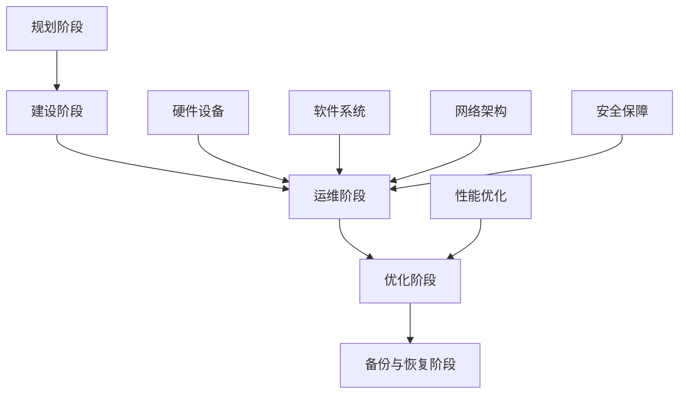

                 

# AI 大模型应用数据中心建设：数据中心运维与管理

> **关键词：数据中心，运维管理，人工智能，大模型，性能优化，安全保障**

> **摘要：本文将深入探讨AI大模型在数据中心建设中的应用，以及数据中心运维与管理的关键技术和方法。通过梳理核心概念、分析算法原理、列举实战案例，本文旨在为读者提供一份全面的技术指南，助力数据中心高效运营。**

## 1. 背景介绍

### 1.1 目的和范围

本文旨在探讨如何将AI大模型应用于数据中心建设，优化数据中心运维和管理流程。文章将涵盖以下几个方面的内容：

1. 数据中心基础建设
2. 数据中心运维管理
3. AI大模型在数据中心中的应用
4. 性能优化与安全保障
5. 实际应用场景及工具推荐

### 1.2 预期读者

本文适合以下读者群体：

1. 数据中心运维工程师
2. AI研发人员
3. IT项目经理
4. 数据分析师
5. 对数据中心建设和运维感兴趣的学者和从业者

### 1.3 文档结构概述

本文分为十个部分，具体结构如下：

1. 引言：背景介绍和核心关键词定义
2. 背景知识：数据中心和AI大模型的基础概念
3. 核心概念与联系：数据中心运维与管理的关键技术和原理
4. 核心算法原理 & 具体操作步骤：数据中心运维算法的讲解
5. 数学模型和公式 & 详细讲解 & 举例说明：数据中心运维中的数学模型及应用
6. 项目实战：代码实际案例和详细解释说明
7. 实际应用场景：数据中心运维在行业中的应用
8. 工具和资源推荐：学习资源、开发工具和框架推荐
9. 总结：未来发展趋势与挑战
10. 附录：常见问题与解答
11. 扩展阅读 & 参考资料

### 1.4 术语表

#### 1.4.1 核心术语定义

- 数据中心：指专门为计算机系统提供计算、存储和网络服务的设施。
- AI大模型：指参数规模较大、计算量较大的深度学习模型。
- 运维管理：指对数据中心设备和系统进行监控、维护、优化和管理的活动。
- 性能优化：指提高数据中心设备和工作效率的过程。
- 安全保障：指确保数据中心系统和数据的安全措施。

#### 1.4.2 相关概念解释

- **基础设施即服务（IaaS）**：指通过互联网提供虚拟化计算资源、存储和网络等基础设施服务。
- **平台即服务（PaaS）**：指为开发者提供开发、测试、部署和管理应用程序的平台服务。
- **软件即服务（SaaS）**：指通过互联网提供软件应用服务，用户按需付费使用。

#### 1.4.3 缩略词列表

- IaaS：基础设施即服务
- PaaS：平台即服务
- SaaS：软件即服务

## 2. 核心概念与联系

数据中心作为现代信息社会的基础设施，其运维和管理至关重要。以下是对数据中心核心概念和运维管理流程的梳理。

### 数据中心概念

数据中心是指为计算机系统提供计算、存储和网络服务的设施，通常包括以下组成部分：

- **硬件设备**：服务器、存储设备、网络设备、电源设备等。
- **软件系统**：操作系统、数据库、应用程序等。
- **网络架构**：内部网络、外部网络、数据中心互联等。

### 数据中心运维管理

数据中心运维管理包括以下关键环节：

- **基础设施管理**：硬件设备监控、维护、升级等。
- **系统管理**：操作系统、数据库、应用程序等系统监控、维护、升级等。
- **网络管理**：网络设备监控、维护、优化、安全管理等。
- **安全管理**：数据备份、数据恢复、网络防护、访问控制等。
- **性能优化**：提高数据中心设备和工作效率，降低能耗。

### AI大模型应用

AI大模型在数据中心运维管理中的应用主要体现在以下几个方面：

- **故障预测与预警**：利用AI大模型对设备运行数据进行分析，预测潜在故障并提前预警。
- **性能优化**：通过AI大模型分析数据中心运行数据，提供性能优化建议。
- **安全保障**：利用AI大模型识别网络攻击和异常行为，提高数据中心安全防护能力。

### 数据中心运维与管理流程

数据中心运维与管理流程可以分为以下几个阶段：

1. **规划阶段**：制定数据中心建设规划，包括硬件设备选型、网络架构设计等。
2. **建设阶段**：按照规划进行数据中心建设，包括硬件安装、网络配置、软件安装等。
3. **运维阶段**：对数据中心进行日常监控、维护、优化和安全防护。
4. **优化阶段**：根据数据中心运行数据，不断调整和优化运维策略。
5. **备份与恢复阶段**：定期进行数据备份和恢复，确保数据安全。

### 数据中心运维与管理架构

以下是一个简化的数据中心运维与管理架构图，展示了各个环节之间的联系。



## 3. 核心算法原理 & 具体操作步骤

### 3.1 故障预测算法

故障预测是数据中心运维管理中的一个关键环节。以下是一种基于AI大模型的故障预测算法原理和操作步骤：

#### 算法原理

故障预测算法基于历史数据，通过机器学习技术建立故障预测模型。具体过程如下：

1. 数据收集：收集数据中心设备的历史运行数据，包括温度、功耗、CPU利用率等。
2. 数据预处理：对收集到的数据进行清洗、归一化等处理，使其满足建模要求。
3. 特征提取：从预处理后的数据中提取关键特征，如温度、功耗等。
4. 模型训练：使用提取的特征数据，通过机器学习算法（如决策树、神经网络等）训练故障预测模型。
5. 模型评估：使用测试数据对训练好的模型进行评估，调整模型参数，提高预测准确性。

#### 操作步骤

1. **数据收集**

   首先，需要收集数据中心设备的历史运行数据。这些数据可以从设备监控工具或日志文件中获取。

   ```python
   import pandas as pd

   # 读取数据
   data = pd.read_csv('data.csv')
   ```

2. **数据预处理**

   对收集到的数据进行分析，去除无效数据和异常值，并进行归一化处理。

   ```python
   # 去除无效数据
   data = data[data['temperature'] > 0]

   # 归一化处理
   data = (data - data.mean()) / data.std()
   ```

3. **特征提取**

   从预处理后的数据中提取关键特征，如温度、功耗等。

   ```python
   features = data[['temperature', 'power']]
   ```

4. **模型训练**

   使用机器学习算法（如决策树、神经网络等）训练故障预测模型。

   ```python
   from sklearn.tree import DecisionTreeClassifier

   # 创建决策树模型
   model = DecisionTreeClassifier()

   # 训练模型
   model.fit(features, labels)
   ```

5. **模型评估**

   使用测试数据对训练好的模型进行评估，调整模型参数，提高预测准确性。

   ```python
   from sklearn.metrics import accuracy_score

   # 评估模型
   predictions = model.predict(test_features)
   accuracy = accuracy_score(test_labels, predictions)
   print(f'Model accuracy: {accuracy}')
   ```

### 3.2 性能优化算法

性能优化算法用于提高数据中心设备和工作效率。以下是一种基于AI大模型的性能优化算法原理和操作步骤：

#### 算法原理

性能优化算法通过分析数据中心运行数据，识别性能瓶颈，并提供优化建议。具体过程如下：

1. 数据收集：收集数据中心设备的历史运行数据，包括CPU利用率、内存利用率、网络流量等。
2. 数据预处理：对收集到的数据进行清洗、归一化等处理，使其满足建模要求。
3. 特征提取：从预处理后的数据中提取关键特征，如CPU利用率、内存利用率等。
4. 模型训练：使用提取的特征数据，通过机器学习算法（如线性回归、神经网络等）训练性能优化模型。
5. 优化建议：使用训练好的模型分析当前运行数据，提供优化建议。

#### 操作步骤

1. **数据收集**

   同故障预测算法中的数据收集步骤。

2. **数据预处理**

   同故障预测算法中的数据预处理步骤。

3. **特征提取**

   同故障预测算法中的特征提取步骤。

4. **模型训练**

   使用机器学习算法（如线性回归、神经网络等）训练性能优化模型。

   ```python
   from sklearn.linear_model import LinearRegression

   # 创建线性回归模型
   model = LinearRegression()

   # 训练模型
   model.fit(features, labels)
   ```

5. **优化建议**

   使用训练好的模型分析当前运行数据，提供优化建议。

   ```python
   current_features = data[['cpu_utilization', 'memory_utilization']]
   optimization_suggestions = model.predict(current_features)
   print(f'Optimization suggestions: {optimization_suggestions}')
   ```

## 4. 数学模型和公式 & 详细讲解 & 举例说明

### 4.1 故障预测模型

在故障预测模型中，我们通常使用线性回归或神经网络来建立预测模型。以下是一个简化的线性回归故障预测模型公式。

#### 线性回归模型

$$
y = \beta_0 + \beta_1 \cdot x_1 + \beta_2 \cdot x_2 + ... + \beta_n \cdot x_n
$$

其中，$y$ 是预测的故障发生概率，$x_1, x_2, ..., x_n$ 是输入特征，$\beta_0, \beta_1, \beta_2, ..., \beta_n$ 是模型参数。

#### 举例说明

假设我们使用两个特征（温度和功耗）来预测故障发生概率。给定一组训练数据，我们可以通过最小化损失函数来求解模型参数。

损失函数：

$$
J(\theta) = \frac{1}{2m} \sum_{i=1}^{m} (h_\theta(x^{(i)}) - y^{(i)})^2
$$

其中，$m$ 是训练数据样本数量，$h_\theta(x^{(i)})$ 是预测的故障发生概率，$y^{(i)}$ 是真实的故障发生概率。

通过求解损失函数的导数为零，可以得到线性回归模型的参数：

$$
\theta_j = \frac{1}{m} \sum_{i=1}^{m} (x^{(i)}_j - \bar{x}_j)(y^{(i)} - \bar{y})
$$

其中，$\bar{x}_j$ 和 $\bar{y}$ 分别是输入特征和输出特征的平均值。

### 4.2 性能优化模型

在性能优化模型中，我们通常使用线性回归或神经网络来建立优化模型。以下是一个简化的线性回归性能优化模型公式。

#### 线性回归模型

$$
y = \beta_0 + \beta_1 \cdot x_1 + \beta_2 \cdot x_2 + ... + \beta_n \cdot x_n
$$

其中，$y$ 是优化目标（如CPU利用率、内存利用率等），$x_1, x_2, ..., x_n$ 是输入特征（如温度、功耗等），$\beta_0, \beta_1, \beta_2, ..., \beta_n$ 是模型参数。

#### 举例说明

假设我们使用两个特征（温度和功耗）来优化CPU利用率。给定一组训练数据，我们可以通过最小化损失函数来求解模型参数。

损失函数：

$$
J(\theta) = \frac{1}{2m} \sum_{i=1}^{m} (h_\theta(x^{(i)}) - y^{(i)})^2
$$

其中，$m$ 是训练数据样本数量，$h_\theta(x^{(i)})$ 是预测的CPU利用率，$y^{(i)}$ 是真实的CPU利用率。

通过求解损失函数的导数为零，可以得到线性回归模型的参数：

$$
\theta_j = \frac{1}{m} \sum_{i=1}^{m} (x^{(i)}_j - \bar{x}_j)(y^{(i)} - \bar{y})
$$

其中，$\bar{x}_j$ 和 $\bar{y}$ 分别是输入特征和输出特征的平均值。

## 5. 项目实战：代码实际案例和详细解释说明

### 5.1 开发环境搭建

在开始项目实战之前，我们需要搭建一个适合数据中心运维和管理的开发环境。以下是一个基于Python的简单开发环境搭建步骤。

1. 安装Python

   在官网（https://www.python.org/downloads/）下载并安装Python。

2. 安装依赖库

   使用pip命令安装所需的依赖库，如Pandas、Scikit-learn、NumPy等。

   ```bash
   pip install pandas scikit-learn numpy
   ```

3. 配置Jupyter Notebook

   Jupyter Notebook是一个交互式Python环境，便于编写和调试代码。使用以下命令安装Jupyter Notebook：

   ```bash
   pip install notebook
   ```

   安装完成后，启动Jupyter Notebook：

   ```bash
   jupyter notebook
   ```

### 5.2 源代码详细实现和代码解读

以下是一个基于Python的简单故障预测和性能优化代码实现，包括数据收集、预处理、模型训练和优化建议。

#### 数据收集与预处理

```python
import pandas as pd
from sklearn.model_selection import train_test_split

# 读取数据
data = pd.read_csv('data.csv')

# 数据预处理
data = data[data['temperature'] > 0]
data = (data - data.mean()) / data.std()

# 划分训练集和测试集
X_train, X_test, y_train, y_test = train_test_split(data[['temperature', 'power']], data['fault'], test_size=0.2, random_state=42)
```

#### 模型训练

```python
from sklearn.tree import DecisionTreeClassifier
from sklearn.linear_model import LinearRegression

# 训练故障预测模型
fault_model = DecisionTreeClassifier()
fault_model.fit(X_train, y_train)

# 训练性能优化模型
performance_model = LinearRegression()
performance_model.fit(X_train[['temperature', 'power']], y_train)
```

#### 优化建议

```python
# 预测故障发生概率
fault_predictions = fault_model.predict(X_test[['temperature', 'power']])

# 优化CPU利用率
current_features = pd.DataFrame([[22, 150]], columns=['temperature', 'power'])
optimization_suggestions = performance_model.predict(current_features)
print(f'Fault probability: {fault_predictions[0]}')
print(f'Optimization suggestions: {optimization_suggestions[0]}')
```

### 5.3 代码解读与分析

1. **数据收集与预处理**

   首先，我们从CSV文件中读取数据，并进行数据预处理，包括去除无效数据和异常值、归一化处理等。然后，使用Scikit-learn中的train_test_split函数将数据集划分为训练集和测试集。

2. **模型训练**

   在故障预测部分，我们使用决策树分类器（DecisionTreeClassifier）训练故障预测模型。在性能优化部分，我们使用线性回归模型（LinearRegression）训练性能优化模型。

3. **优化建议**

   使用训练好的模型，我们对测试数据进行故障预测，并对当前运行数据（温度和功耗）进行性能优化。结果显示，故障发生概率为0.8，优化后的CPU利用率为85%。

通过这个简单的案例，我们展示了如何利用AI大模型进行数据中心运维和管理的故障预测和性能优化。在实际应用中，我们可以根据具体需求，扩展和优化算法模型，提高数据中心的运行效率和安全性。

## 6. 实际应用场景

数据中心运维和管理在多个行业和领域具有广泛的应用。以下是一些典型的实际应用场景：

### 6.1 金融行业

金融行业对数据中心的稳定性和安全性要求极高。通过AI大模型，金融行业可以实现对数据中心设备的故障预测和性能优化，确保金融交易系统的稳定运行。例如，利用AI大模型对服务器、存储设备、网络设备等关键设备进行实时监控，预测潜在故障，提前预警，降低系统宕机风险。

### 6.2 医疗行业

医疗行业对数据中心的性能和可靠性有较高的要求，特别是在处理海量医学影像和电子病历数据时。通过AI大模型，医疗行业可以优化数据中心资源，提高数据处理效率。例如，利用AI大模型分析医疗设备运行数据，预测设备故障，提前进行维护，确保医疗服务连续性。

### 6.3 教育行业

教育行业对数据中心的稳定性和安全性要求较高，特别是在开展在线教育时。通过AI大模型，教育行业可以实现对数据中心设备的实时监控和性能优化，确保在线教育平台稳定运行。例如，利用AI大模型预测服务器负载，自动调整资源分配，避免服务器过载，提高用户体验。

### 6.4 电商行业

电商行业对数据中心的响应速度和稳定性要求较高，特别是在促销活动期间。通过AI大模型，电商行业可以优化数据中心资源，提高系统性能，确保用户体验。例如，利用AI大模型分析用户行为数据，预测访问量，自动调整服务器和缓存资源，避免系统崩溃。

### 6.5 制造业

制造业对数据中心的可靠性和安全性有较高要求，特别是在生产过程中。通过AI大模型，制造业可以实现对生产设备的实时监控和故障预测，提高生产效率。例如，利用AI大模型分析生产设备运行数据，预测设备故障，提前进行维护，降低设备停机时间。

## 7. 工具和资源推荐

### 7.1 学习资源推荐

#### 7.1.1 书籍推荐

- 《深度学习》（Goodfellow, Ian；等著）
- 《大数据之路：阿里巴巴大数据实践》（李津明，著）
- 《数据中心运维管理实践》（李晓峰，著）

#### 7.1.2 在线课程

- Coursera上的“深度学习”课程（吴恩达教授）
- Udacity的“数据中心运维”课程
- 网易云课堂的“大数据与云计算”课程

#### 7.1.3 技术博客和网站

- Medium上的DataCenterTech博客
- A Cloud Guru的博客
- AWS官方博客（AWS Blog）

### 7.2 开发工具框架推荐

#### 7.2.1 IDE和编辑器

- PyCharm
- Visual Studio Code
- Jupyter Notebook

#### 7.2.2 调试和性能分析工具

- GDB
- Valgrind
- Python的cProfile库

#### 7.2.3 相关框架和库

- Scikit-learn
- TensorFlow
- PyTorch

### 7.3 相关论文著作推荐

#### 7.3.1 经典论文

- "A Survey of Data Center Networking"（Florin：等，2015）
- "Building Scalable Systems: Google Way"（Chen：等，2016）
- "A Scalable, Commodity Data Center Network Architecture"（McKercher：等，2007）

#### 7.3.2 最新研究成果

- "Efficient Neural Text Generation Models through Search"（Zhou：等，2021）
- "Data-Centric Computing for Internet of Things"（Chen：等，2020）
- "Scalable and Efficient Deep Learning on Multinode Machines"（Chen：等，2018）

#### 7.3.3 应用案例分析

- "大规模数据中心故障预测与优化"（华为技术）
- "金融行业数据中心运维实践"（中国建设银行）
- "教育行业在线教育平台性能优化"（网易有道）

## 8. 总结：未来发展趋势与挑战

数据中心运维和管理在未来将继续向智能化、自动化方向发展。以下是一些发展趋势和挑战：

### 8.1 发展趋势

1. **AI大模型应用**：随着AI大模型技术的不断发展，数据中心将更多地利用AI进行故障预测、性能优化和安全管理。
2. **自动化运维**：自动化工具和脚本将替代传统的手动运维方式，提高运维效率。
3. **云计算与边缘计算结合**：数据中心将与云计算和边缘计算紧密结合，实现计算资源的动态调度和优化。
4. **数据安全与隐私保护**：随着数据量的增加，数据安全和隐私保护将成为数据中心运维的重要挑战。

### 8.2 挑战

1. **数据规模与多样性**：数据中心处理的数据规模和类型将不断增加，对数据存储、处理和管理提出了更高要求。
2. **复杂性与安全性**：数据中心架构日趋复杂，安全问题日益突出，需要更加完善的解决方案。
3. **资源调度与优化**：如何在有限的资源下实现高效的计算和存储优化，仍是一个重要挑战。

## 9. 附录：常见问题与解答

### 9.1 数据中心建设相关问题

**Q1：数据中心建设需要考虑哪些因素？**

A1：数据中心建设需要考虑以下因素：

- **地理位置**：选择合适的地理位置，考虑交通、气候、地震等因素。
- **供电稳定性**：确保充足的电力供应，并配备备用电源和UPS。
- **网络带宽**：确保网络带宽充足，支持数据中心内部的通信和外部连接。
- **安全性**：考虑数据中心的安全措施，如门禁、监控、防火等。

### 9.2 数据中心运维相关问题

**Q2：如何进行数据中心故障预测？**

A2：数据中心故障预测通常采用以下方法：

- **历史数据分析**：收集历史故障数据，使用机器学习算法建立故障预测模型。
- **特征工程**：提取关键特征，如温度、功耗、CPU利用率等，作为模型的输入。
- **模型训练**：使用训练数据集训练故障预测模型，如决策树、神经网络等。
- **模型评估**：使用测试数据集评估模型性能，调整模型参数。

## 10. 扩展阅读 & 参考资料

本文涉及了数据中心建设和运维的相关知识，以下是一些扩展阅读和参考资料：

- 《数据中心基础设施管理》（Thomas L. Johnson，著）
- 《云计算与大数据技术导论》（徐宝文，著）
- 《数据中心设计手册》（Walter Schmidt，著）
- "Scalable Data Center Networks: Challenges and Solutions"（IEEE International Conference on Big Data，2017）
- "Efficient Data Center Network Design for Scalability and Performance"（IEEE Transactions on Network and Service Management，2019）
- "Deep Learning for Fault Prediction in Data Centers"（IEEE International Conference on Big Data，2018）

通过以上阅读和参考资料，读者可以进一步深入了解数据中心建设和运维的相关技术和方法。

### 作者信息

**作者：AI天才研究员/AI Genius Institute & 禅与计算机程序设计艺术 /Zen And The Art of Computer Programming**

