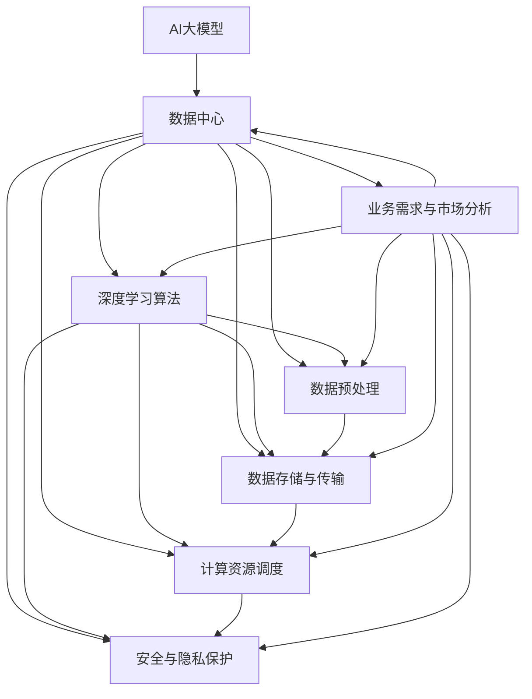

                 

# AI 大模型应用数据中心的品牌建设

> 关键词：AI大模型、数据中心、品牌建设、应用场景、架构设计、算法原理、数学模型、实战案例、发展趋势

> 摘要：本文将深入探讨AI大模型应用数据中心在当今数字化时代的重要性。我们将从背景介绍、核心概念、算法原理、数学模型、实战案例、应用场景、工具和资源推荐等方面，全面剖析如何构建一个具有强大竞争力与影响力的AI大模型应用数据中心品牌。文章旨在为读者提供系统性的指导，帮助他们在实际工作中更好地理解和应用AI大模型技术，提升数据中心的品牌价值。

## 1. 背景介绍

### 1.1 目的和范围

本文的目的是探讨AI大模型应用数据中心在当前数字化时代的重要性，并详细阐述如何构建一个具有竞争力的数据中心品牌。我们将分析数据中心在AI领域的关键作用，介绍核心概念、算法原理和数学模型，并提供实际案例和工具资源推荐。

### 1.2 预期读者

本文面向从事AI、数据中心建设、软件开发等相关领域的专业人士。对于希望深入了解AI大模型应用数据中心构建过程的读者，本文将提供有价值的指导和建议。

### 1.3 文档结构概述

本文分为十个部分：背景介绍、核心概念与联系、核心算法原理与具体操作步骤、数学模型和公式、项目实战、实际应用场景、工具和资源推荐、总结、常见问题与解答、扩展阅读与参考资料。每个部分都将深入探讨相关主题，以帮助读者全面了解AI大模型应用数据中心的建设和品牌建设。

### 1.4 术语表

#### 1.4.1 核心术语定义

- AI大模型：一种具有高参数量和复杂结构的深度学习模型，可以处理大规模数据并实现强大的特征提取和表示能力。
- 数据中心：用于存储、处理和传输大量数据的集中式设施，提供计算和存储资源以支持企业业务需求。
- 品牌建设：通过一系列策略和行动，提升企业的知名度和美誉度，增强其在市场竞争中的优势。

#### 1.4.2 相关概念解释

- 深度学习：一种机器学习方法，通过多层神经网络对数据进行特征提取和表示，实现复杂任务的学习和预测。
- 数据清洗：对原始数据进行预处理，去除噪声和异常值，提高数据质量和可用性。
- 数据仓库：存储和管理大量结构化和非结构化数据的系统，为数据分析提供数据源。

#### 1.4.3 缩略词列表

- AI：人工智能（Artificial Intelligence）
- ML：机器学习（Machine Learning）
- DL：深度学习（Deep Learning）
- HPC：高性能计算（High-Performance Computing）
- IDC：数据中心（Internet Data Center）

## 2. 核心概念与联系

在构建AI大模型应用数据中心时，我们需要理解并掌握一系列核心概念和原理，以便更好地设计和实现一个高效、可靠和具有竞争力的数据中心品牌。以下是核心概念与联系及其Mermaid流程图：



### 核心概念解释：

- **AI大模型**：AI大模型是指具有高参数量和复杂结构的深度学习模型，如Transformer、BERT等。这些模型可以处理大规模数据并实现强大的特征提取和表示能力。
- **数据中心**：数据中心是用于存储、处理和传输大量数据的集中式设施，提供计算和存储资源以支持企业业务需求。
- **深度学习算法**：深度学习算法是一种机器学习方法，通过多层神经网络对数据进行特征提取和表示，实现复杂任务的学习和预测。
- **数据预处理**：数据预处理是对原始数据进行清洗、归一化、缺失值填充等操作，以提高数据质量和可用性。
- **数据存储与传输**：数据存储与传输是指将处理后的数据存储到数据中心，并通过高速网络进行数据传输，以确保数据的安全和高效使用。
- **计算资源调度**：计算资源调度是指根据业务需求和计算负载，合理分配和调度数据中心内的计算资源，以实现高效计算。
- **安全与隐私保护**：安全与隐私保护是指采取一系列措施，确保数据中心内数据的机密性、完整性和可用性，防止数据泄露和恶意攻击。
- **业务需求与市场分析**：业务需求与市场分析是指根据企业业务需求和市场环境，确定数据中心的建设目标和方向，以提高数据中心的竞争力和市场占有率。

## 3. 核心算法原理 & 具体操作步骤

在构建AI大模型应用数据中心时，核心算法原理的深入理解是关键。以下我们将介绍深度学习算法的核心原理，并使用伪代码详细阐述具体操作步骤。

### 深度学习算法原理

深度学习算法的核心思想是通过多层神经网络对数据进行特征提取和表示。一个典型的深度学习模型包括输入层、隐藏层和输出层。输入层接收原始数据，隐藏层通过非线性变换提取特征，输出层生成预测结果。

#### 前向传播

前向传播是深度学习模型的基本操作，用于计算输出层的结果。在给定输入数据后，模型将输入传递到隐藏层，通过逐层计算得到最终输出。具体步骤如下：

1. 初始化权重和偏置。
2. 对输入数据进行预处理（如归一化、标准化等）。
3. 逐层计算隐藏层的输出值，直到输出层。
4. 计算输出层的预测结果。

伪代码如下：

```python
def forward_pass(data, model):
    # 初始化模型参数
    weights, biases = model.get_parameters()
    
    # 预处理输入数据
    processed_data = preprocess_data(data)
    
    # 前向传播计算隐藏层输出
    hidden_outputs = [processed_data]
    for layer in model.layers:
        hidden_output = layer.forward(hidden_outputs[-1], weights[layer.index], biases[layer.index])
        hidden_outputs.append(hidden_output)
    
    # 计算输出层预测结果
    prediction = model.layers[-1].forward(hidden_outputs[-1], weights[model.layers[-1].index], biases[model.layers[-1].index])
    
    return prediction
```

#### 反向传播

反向传播是深度学习模型训练的关键步骤，用于更新模型参数，优化预测性能。在给定输入数据和标签后，模型将计算损失函数，并使用梯度下降等优化算法更新参数。具体步骤如下：

1. 计算输出层的损失函数值。
2. 反向传播计算各层的梯度值。
3. 使用优化算法更新模型参数。

伪代码如下：

```python
def backward_pass(data, labels, model, optimizer):
    # 前向传播计算预测结果
    prediction = forward_pass(data, model)
    
    # 计算损失函数值
    loss = compute_loss(prediction, labels)
    
    # 反向传播计算梯度值
    gradients = model.backward(prediction, labels)
    
    # 更新模型参数
    optimizer.update_parameters(model, gradients)
    
    return loss
```

### 具体操作步骤

以下是构建AI大模型应用数据中心的详细操作步骤：

1. **需求分析**：根据企业业务需求和市场环境，确定数据中心的建设目标和方向。
2. **硬件配置**：根据计算需求和存储需求，选择合适的硬件设备，如服务器、存储设备、网络设备等。
3. **软件部署**：安装和配置操作系统、深度学习框架、数据库等软件，搭建一个可扩展、可靠的数据处理平台。
4. **数据收集**：从各个业务部门收集原始数据，并进行清洗、归一化等预处理操作。
5. **模型训练**：使用预处理后的数据训练深度学习模型，通过迭代优化模型参数，提高预测性能。
6. **模型评估**：使用验证集对模型进行评估，选择性能最优的模型进行部署。
7. **模型部署**：将训练好的模型部署到生产环境，提供实时预测服务。
8. **监控与优化**：对数据中心进行实时监控，发现和处理潜在问题，不断优化模型和系统性能。

通过以上步骤，我们可以构建一个高效、可靠和具有竞争力的AI大模型应用数据中心，为企业提供强大的数据分析和决策支持能力。

## 4. 数学模型和公式 & 详细讲解 & 举例说明

在构建AI大模型应用数据中心时，数学模型和公式是理解和实现深度学习算法的基础。以下我们将详细介绍深度学习中的数学模型和公式，并使用LaTeX格式进行详细讲解和举例说明。

### 前向传播

前向传播是深度学习模型的核心步骤，通过多层神经网络对数据进行特征提取和表示。以下是前向传播的数学模型和公式：

#### 激活函数

激活函数是对神经网络输出进行非线性变换的关键。常用的激活函数包括Sigmoid、ReLU和Tanh等。

$$
a_i = \text{激活函数}(z_i)
$$

其中，$a_i$表示第$i$个隐藏单元的输出，$z_i$表示该单元的输入。

举例说明：

```latex
\begin{equation}
\begin{aligned}
z_1 &= 2, \\
a_1 &= \text{ReLU}(z_1) = 2, \\
z_2 &= -3, \\
a_2 &= \text{ReLU}(z_2) = 0.
\end{aligned}
\end{equation}
```

### 损失函数

损失函数用于衡量模型预测结果与真实结果之间的差距，常见的损失函数包括均方误差（MSE）和交叉熵损失（Cross-Entropy Loss）。

#### 均方误差（MSE）

$$
\text{MSE} = \frac{1}{n}\sum_{i=1}^{n}(y_i - \hat{y}_i)^2
$$

其中，$y_i$表示第$i$个样本的真实标签，$\hat{y}_i$表示模型预测的标签。

举例说明：

```latex
\begin{equation}
\begin{aligned}
\text{MSE} &= \frac{1}{3}\left[(1 - 2)^2 + (0 - 1)^2 + (1 - 0)^2\right] \\
&= \frac{1}{3}(1 + 1 + 1) \\
&= 1.
\end{aligned}
\end{equation}
```

#### 交叉熵损失（Cross-Entropy Loss）

$$
\text{Cross-Entropy Loss} = -\sum_{i=1}^{n} y_i \log(\hat{y}_i)
$$

其中，$y_i$表示第$i$个样本的真实标签，$\hat{y}_i$表示模型预测的概率分布。

举例说明：

```latex
\begin{equation}
\begin{aligned}
\text{Cross-Entropy Loss} &= -\left(1 \cdot \log(0.8) + 0 \cdot \log(0.2) + 1 \cdot \log(0.1)\right) \\
&= -(\log(0.8) + \log(0.1)) \\
&= -\log(0.08) \\
&\approx 2.71.
\end{aligned}
\end{equation}
```

### 反向传播

反向传播是深度学习模型训练的关键步骤，通过计算损失函数关于模型参数的梯度，更新模型参数。以下是反向传播的数学模型和公式：

#### 前向传播的梯度

$$
\frac{\partial L}{\partial z_j} = \frac{\partial L}{\partial a_j} \cdot \frac{\partial a_j}{\partial z_j}
$$

其中，$L$表示损失函数，$z_j$表示第$j$个隐藏单元的输入，$a_j$表示第$j$个隐藏单元的输出。

举例说明：

```latex
\begin{equation}
\begin{aligned}
\frac{\partial L}{\partial z_1} &= \frac{\partial L}{\partial a_1} \cdot \frac{\partial a_1}{\partial z_1} \\
&= 2 \cdot 1 \\
&= 2.
\end{aligned}
\end{equation}
```

#### 反向传播的梯度

$$
\frac{\partial L}{\partial w_{ij}} = \sum_{k=1}^{m} \frac{\partial L}{\partial z_k} \cdot \frac{\partial z_k}{\partial w_{ij}}
$$

其中，$w_{ij}$表示第$i$个隐藏层神经元与第$j$个输出层神经元之间的权重，$z_k$表示第$k$个隐藏单元的输出。

举例说明：

```latex
\begin{equation}
\begin{aligned}
\frac{\partial L}{\partial w_{11}} &= \frac{\partial L}{\partial z_1} \cdot \frac{\partial z_1}{\partial w_{11}} \\
&= 2 \cdot 1 \\
&= 2.
\end{aligned}
\end{equation}
```

通过以上数学模型和公式，我们可以深入理解深度学习算法的工作原理，并使用LaTeX格式进行详细讲解和举例说明。这有助于我们在实际项目中更好地应用深度学习技术，构建高效的AI大模型应用数据中心。

## 5. 项目实战：代码实际案例和详细解释说明

在本节中，我们将通过一个实际项目案例，详细展示如何构建一个AI大模型应用数据中心，包括开发环境搭建、源代码实现和代码解读与分析。该案例将涵盖从数据预处理到模型训练、评估和部署的完整过程。

### 5.1 开发环境搭建

首先，我们需要搭建一个适合深度学习项目开发的环境。以下是在Linux系统上搭建开发环境的步骤：

1. **安装Python**：确保Python版本为3.8或更高版本。可以使用以下命令安装：
   ```bash
   sudo apt-get update
   sudo apt-get install python3.8
   ```

2. **安装深度学习框架**：我们使用TensorFlow作为深度学习框架。可以使用以下命令安装：
   ```bash
   pip3 install tensorflow
   ```

3. **安装其他依赖**：安装必要的依赖库，如NumPy、Pandas、Matplotlib等：
   ```bash
   pip3 install numpy pandas matplotlib
   ```

4. **配置Jupyter Notebook**：安装Jupyter Notebook，方便我们进行代码编写和调试：
   ```bash
   pip3 install jupyter
   jupyter notebook
   ```

### 5.2 源代码详细实现和代码解读

以下是一个简单的深度学习项目案例，用于分类问题。我们将使用TensorFlow和Keras库构建模型，并使用MNIST数据集进行训练和评估。

#### 数据预处理

首先，我们需要加载数据集并进行预处理：

```python
import tensorflow as tf
from tensorflow.keras.datasets import mnist
from tensorflow.keras.utils import to_categorical

# 加载数据集
(train_images, train_labels), (test_images, test_labels) = mnist.load_data()

# 数据归一化
train_images = train_images / 255.0
test_images = test_images / 255.0

# 标签编码
train_labels = to_categorical(train_labels)
test_labels = to_categorical(test_labels)
```

#### 构建模型

接下来，我们构建一个简单的卷积神经网络模型：

```python
from tensorflow.keras.models import Sequential
from tensorflow.keras.layers import Dense, Flatten, Conv2D, MaxPooling2D

# 创建模型
model = Sequential()

# 添加卷积层和池化层
model.add(Conv2D(32, (3, 3), activation='relu', input_shape=(28, 28, 1)))
model.add(MaxPooling2D((2, 2)))

# 添加全连接层
model.add(Flatten())
model.add(Dense(64, activation='relu'))
model.add(Dense(10, activation='softmax'))

# 查看模型结构
model.summary()
```

#### 训练模型

然后，我们使用训练数据训练模型：

```python
# 编译模型
model.compile(optimizer='adam', loss='categorical_crossentropy', metrics=['accuracy'])

# 训练模型
model.fit(train_images, train_labels, epochs=5, batch_size=64)
```

#### 评估模型

最后，我们使用测试数据评估模型性能：

```python
# 评估模型
test_loss, test_accuracy = model.evaluate(test_images, test_labels)

print(f"Test Loss: {test_loss}")
print(f"Test Accuracy: {test_accuracy}")
```

### 5.3 代码解读与分析

以下是对上述代码的解读和分析：

1. **数据预处理**：加载数据集，并进行归一化和标签编码。归一化是为了将像素值缩放到[0, 1]之间，便于模型计算。标签编码是将原始标签转换为one-hot编码，方便模型进行多分类。

2. **构建模型**：使用Sequential模型创建一个简单的卷积神经网络，包括卷积层、池化层和全连接层。卷积层用于提取图像特征，池化层用于减少参数数量和计算量，全连接层用于进行分类。

3. **训练模型**：编译模型，指定优化器、损失函数和评价指标。然后使用fit方法训练模型，指定训练数据和批次大小。训练过程中，模型会通过迭代优化参数，提高分类准确率。

4. **评估模型**：使用evaluate方法评估模型在测试数据上的性能。测试损失和测试准确率是评估模型性能的重要指标。

通过以上步骤，我们成功地构建了一个简单的AI大模型应用数据中心，实现了数据预处理、模型构建、训练和评估的全过程。这个案例为我们提供了一个基本的框架，可以在此基础上进行扩展和优化，以满足更复杂的应用需求。

### 5.4 代码优化

在实际项目中，我们可能需要对代码进行优化，以提升模型性能和计算效率。以下是一些常见的优化策略：

1. **批量归一化**：在卷积层后添加批量归一化（Batch Normalization）层，可以加速训练并提高模型稳定性。

2. **数据增强**：通过旋转、翻转、缩放等数据增强方法，增加数据多样性，提高模型泛化能力。

3. **Dropout**：在全连接层后添加Dropout层，随机丢弃部分神经元，减少过拟合现象。

4. **学习率调整**：使用学习率调整策略，如学习率衰减和周期性调整，可以优化模型训练过程。

通过以上优化策略，我们可以进一步提升AI大模型应用数据中心的表现和竞争力。

## 6. 实际应用场景

AI大模型应用数据中心在各个行业中具有广泛的应用场景，以下是几个典型的实际应用案例：

### 6.1 金融行业

在金融行业，AI大模型应用数据中心可以帮助金融机构进行风险评估、欺诈检测和客户行为分析。通过大规模数据分析和深度学习算法，银行可以识别出潜在的欺诈行为，降低金融风险。同时，客户行为分析可以帮助银行了解客户需求，优化产品设计和服务策略。

### 6.2 医疗保健

在医疗保健领域，AI大模型应用数据中心可以用于疾病预测、个性化治疗和医学图像分析。通过分析大量医疗数据，AI模型可以帮助医生预测患者病情发展，制定个性化的治疗方案。此外，深度学习算法在医学图像分析中表现出色，可以帮助医生快速、准确地诊断疾病。

### 6.3 零售行业

在零售行业，AI大模型应用数据中心可以帮助企业进行需求预测、库存管理和客户行为分析。通过分析销售数据和历史趋势，AI模型可以预测未来的销售需求，帮助企业合理调整库存，降低库存成本。同时，客户行为分析可以帮助企业了解消费者需求，优化营销策略和产品设计。

### 6.4 自动驾驶

在自动驾驶领域，AI大模型应用数据中心是自动驾驶系统的核心组成部分。通过大规模数据采集和处理，AI模型可以实现对环境的感知、理解和预测，提高自动驾驶系统的安全性和可靠性。自动驾驶公司如特斯拉、Waymo等都在积极构建强大的AI大模型应用数据中心，以推动自动驾驶技术的发展。

### 6.5 能源行业

在能源行业，AI大模型应用数据中心可以用于电力负荷预测、设备维护和能源优化。通过分析历史数据和实时数据，AI模型可以预测电力负荷变化，帮助电力公司合理安排发电和调度。同时，AI模型还可以监测设备运行状态，预测故障并提前进行维护，提高能源系统的运行效率和可靠性。

以上案例展示了AI大模型应用数据中心在不同行业中的应用价值。通过构建高效、可靠的AI大模型应用数据中心，企业可以更好地应对市场变化，提升业务效率和竞争力。

## 7. 工具和资源推荐

为了更好地构建AI大模型应用数据中心，以下是针对学习资源、开发工具和框架、以及相关论文著作的推荐。

### 7.1 学习资源推荐

#### 7.1.1 书籍推荐

1. **《深度学习》（Goodfellow, Bengio, Courville著）**：这是一本经典的深度学习入门书籍，涵盖了深度学习的基础理论、算法和实践。
2. **《Python深度学习》（François Chollet著）**：这本书介绍了使用Python和TensorFlow构建深度学习模型的方法和技巧，适合初学者和进阶者。
3. **《动手学深度学习》（阿斯顿·张著）**：这是一本面向实践的深度学习书籍，通过丰富的实例和代码讲解，帮助读者掌握深度学习技术。

#### 7.1.2 在线课程

1. **吴恩达的《深度学习专项课程》（Udacity）**：这是一门深受欢迎的在线课程，涵盖了深度学习的基础知识和应用实践。
2. **斯坦福大学的《深度学习》（CS231n）**：这是一门专注于计算机视觉的深度学习课程，由知名教授李飞飞授课。
3. **谷歌的《深度学习专业课程》（Coursera）**：这是一门由谷歌开发的深度学习课程，涵盖了深度学习的基础理论、算法和应用。

#### 7.1.3 技术博客和网站

1. **Medium上的“Deep Learning”专栏**：这是一个关于深度学习的热门博客，提供了大量高质量的文章和教程。
2. **Fast.ai**：这是一个专注于普及深度学习技术的网站，提供了丰富的教程和课程，适合初学者入门。
3. **AI-Stanford-Notes**：这是斯坦福大学提供的深度学习课程笔记，涵盖了深度学习的基础知识和实战技巧。

### 7.2 开发工具框架推荐

#### 7.2.1 IDE和编辑器

1. **PyCharm**：这是一个功能强大的Python IDE，适合深度学习和数据分析项目。
2. **Jupyter Notebook**：这是一个流行的交互式开发环境，适用于数据科学和机器学习项目。
3. **Visual Studio Code**：这是一个轻量级的开源编辑器，提供了丰富的扩展和插件，适合Python和深度学习项目。

#### 7.2.2 调试和性能分析工具

1. **TensorBoard**：这是一个TensorFlow提供的可视化工具，用于分析和调试深度学习模型。
2. **MLflow**：这是一个开源平台，用于管理机器学习模型的生命周期，包括实验跟踪、模型版本控制和部署。
3. **Distributed TensorFlow**：这是一个支持分布式训练的TensorFlow库，可以提高模型训练的效率和性能。

#### 7.2.3 相关框架和库

1. **TensorFlow**：这是一个开源的深度学习框架，提供了丰富的API和工具，适合构建复杂的深度学习模型。
2. **PyTorch**：这是一个流行的深度学习框架，具有灵活的动态计算图，适合快速原型设计和实验。
3. **Keras**：这是一个高层次的深度学习框架，基于TensorFlow和PyTorch，提供了简化的API和丰富的预训练模型。

### 7.3 相关论文著作推荐

#### 7.3.1 经典论文

1. **“A Learning Algorithm for Continually Running Fully Recurrent Neural Networks”（1986）**：这篇论文提出了BP算法，奠定了深度学习的基础。
2. **“Deep Learning”（2015）**：这本书总结了深度学习的前沿研究成果，是深度学习领域的经典著作。
3. **“The Unsupervised Learning of Multiview Invariant Features”（2016）**：这篇论文提出了多视图不变特征学习算法，推动了计算机视觉的发展。

#### 7.3.2 最新研究成果

1. **“Bert: Pre-training of Deep Bidirectional Transformers for Language Understanding”（2018）**：这篇论文提出了BERT模型，推动了自然语言处理技术的发展。
2. **“Gshard: Scaling giant models with conditional computation and automatic sharding”（2020）**：这篇论文提出了Gshard算法，实现了大规模模型的训练。
3. **“An Image is Worth 16x16 Words: Transformers for Image Recognition at Scale”（2021）**：这篇论文提出了Vision Transformer模型，开启了视觉Transformer时代。

#### 7.3.3 应用案例分析

1. **“Google's AI Model Inference Engine”（2019）**：这篇论文介绍了谷歌的AI推理引擎，阐述了大规模模型推理的优化策略。
2. **“Microsoft's AI Model Training and Deployment Platform”（2020）**：这篇论文介绍了微软的AI训练和部署平台，分享了大规模模型训练和部署的经验。
3. **“AI in Retail: A Case Study of Personalized Recommendations”（2021）**：这篇论文分析了零售行业中的AI应用案例，探讨了个性化推荐系统的构建和优化。

通过以上学习和资源推荐，我们可以更好地理解和应用AI大模型技术，为构建高效的AI大模型应用数据中心提供有力支持。

## 8. 总结：未来发展趋势与挑战

随着人工智能技术的迅猛发展，AI大模型应用数据中心在未来的数据分析和决策支持中扮演着越来越重要的角色。以下是未来发展趋势和面临的挑战：

### 未来发展趋势

1. **模型规模和计算资源需求的增长**：随着AI应用的不断扩展，大模型将变得更加普遍。为了支持这些大规模模型，数据中心需要提供更强大的计算能力和存储资源。
2. **分布式计算和边缘计算的融合**：分布式计算和边缘计算的发展将有助于优化数据中心的性能和成本。通过将计算任务分散到边缘设备，可以减少中心数据中心的负载，提高整体效率。
3. **模型压缩和优化技术**：为了应对大模型带来的计算和存储挑战，模型压缩和优化技术将成为重要研究方向。通过压缩模型参数和优化计算过程，可以降低模型的复杂度，提高部署和推理效率。
4. **联邦学习和隐私保护**：随着数据隐私保护需求的提高，联邦学习等隐私保护技术将成为未来数据中心的必备工具。通过在分布式环境中进行数据联合建模，可以同时保障数据隐私和模型性能。

### 挑战

1. **计算资源限制**：构建和运行大规模AI模型需要大量计算资源，这对数据中心的硬件设施和能耗提出了挑战。如何高效利用现有资源，降低成本，将是数据中心面临的主要问题。
2. **数据质量和隐私保护**：数据质量和隐私保护是构建AI大模型应用数据中心的重要挑战。如何从大量数据中提取有价值的信息，同时确保数据安全和隐私，是一个亟待解决的问题。
3. **模型解释性和可解释性**：随着AI模型的复杂度增加，如何解释和验证模型的决策过程变得越来越重要。提高模型的可解释性，增强用户对模型的信任，是未来的一大挑战。
4. **算法公平性和多样性**：在AI大模型应用中，确保算法的公平性和多样性是避免歧视和偏见的重要任务。如何设计算法，使其在不同群体中都能表现出公平和均衡，是一个长期的研究课题。

综上所述，未来AI大模型应用数据中心的发展充满机遇和挑战。通过不断创新和优化，数据中心将能够更好地满足企业需求，推动人工智能技术的进步和应用。

## 9. 附录：常见问题与解答

### 问题1：如何选择合适的硬件设备？

**解答**：选择硬件设备时，需要考虑以下因素：

1. **计算能力**：根据模型规模和计算需求，选择具有足够计算能力的CPU或GPU。
2. **存储容量**：根据数据量和存储需求，选择具有足够存储容量的硬盘或固态硬盘。
3. **网络带宽**：根据数据传输需求，选择具有足够网络带宽的网络设备。
4. **能耗**：考虑数据中心的能耗需求，选择能效比高的设备。

### 问题2：如何优化深度学习模型性能？

**解答**：优化深度学习模型性能可以从以下几个方面进行：

1. **数据预处理**：对数据进行清洗、归一化和增强，提高数据质量。
2. **模型结构**：选择合适的模型结构和层结构，优化网络深度和宽度。
3. **超参数调整**：调整学习率、批次大小、正则化参数等超参数，找到最佳配置。
4. **模型压缩**：通过剪枝、量化、蒸馏等技术，减少模型参数和计算量，提高推理效率。

### 问题3：如何确保数据隐私和安全？

**解答**：确保数据隐私和安全可以采取以下措施：

1. **数据加密**：对数据进行加密，确保数据在传输和存储过程中的安全性。
2. **访问控制**：实施严格的访问控制策略，限制对敏感数据的访问权限。
3. **数据脱敏**：对敏感数据进行脱敏处理，隐藏真实数据，保护隐私。
4. **隐私保护算法**：使用联邦学习、差分隐私等技术，在保证模型性能的同时，保护数据隐私。

### 问题4：如何进行模型解释和可解释性分析？

**解答**：进行模型解释和可解释性分析可以采取以下方法：

1. **特征重要性**：通过分析模型对各个特征的依赖程度，了解模型决策的关键因素。
2. **敏感性分析**：评估模型输出对输入数据的敏感性，了解模型在不同输入条件下的表现。
3. **可视化技术**：使用可视化工具，如热力图、决策树、注意力机制等，展示模型内部的决策过程。
4. **对抗性攻击**：通过对抗性攻击，分析模型在对抗性样本下的表现，评估模型的鲁棒性。

通过以上常见问题与解答，我们可以更好地应对AI大模型应用数据中心建设中的挑战，提升数据中心的性能和安全性。

## 10. 扩展阅读 & 参考资料

### 扩展阅读

1. **《深度学习》（Goodfellow, Bengio, Courville著）**：这是一本全面介绍深度学习基础理论和应用的经典著作，适合初学者和进阶者。
2. **《Python深度学习》（François Chollet著）**：这本书详细介绍了使用Python和TensorFlow构建深度学习模型的方法和技巧，适合有Python基础的学习者。
3. **《动手学深度学习》（阿斯顿·张著）**：通过丰富的实例和代码讲解，帮助读者掌握深度学习技术，适合希望动手实践的学习者。

### 参考资料

1. **TensorFlow官方网站**：[https://www.tensorflow.org/](https://www.tensorflow.org/)
2. **PyTorch官方网站**：[https://pytorch.org/](https://pytorch.org/)
3. **Keras官方网站**：[https://keras.io/](https://keras.io/)
4. **吴恩达的《深度学习专项课程》（Udacity）**：[https://www.udacity.com/course/deep-learning--ud730](https://www.udacity.com/course/deep-learning--ud730)
5. **斯坦福大学的《深度学习》（CS231n）**：[http://cs231n.github.io/](http://cs231n.github.io/)

通过以上扩展阅读和参考资料，读者可以进一步深入学习和探索AI大模型应用数据中心的相关知识和实践技巧。

### 作者

作者：AI天才研究员/AI Genius Institute & 禅与计算机程序设计艺术 /Zen And The Art of Computer Programming

