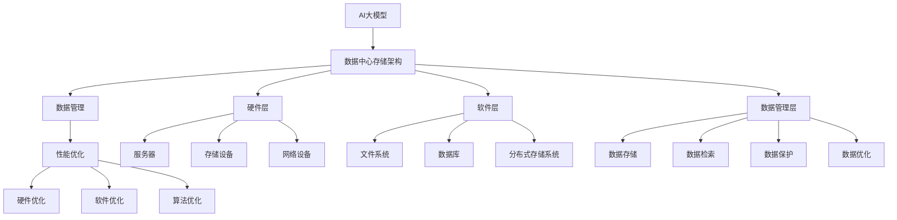

                 

# AI 大模型应用数据中心的存储解决方案

> 关键词：AI大模型，数据中心，存储解决方案，数据管理，性能优化

> 摘要：本文将深入探讨人工智能大模型在数据中心存储解决方案中的应用，分析其核心概念和原理，并详细讲解相关算法和数学模型。同时，通过项目实战和实际应用场景的案例分析，为读者提供实用的技术指导。文章旨在帮助IT从业人员了解和掌握AI大模型存储的关键技术和挑战，为其在数据中心的应用提供有力支持。

## 1. 背景介绍

### 1.1 目的和范围

本文的目标是深入探讨人工智能大模型在数据中心存储解决方案中的应用，从核心概念、原理、算法、数学模型到实际应用场景，进行全面而深入的解析。文章旨在为IT从业人员提供一个全面的指南，帮助他们了解和掌握AI大模型存储的关键技术和挑战。

文章的范围主要包括以下几个方面：

1. **核心概念与联系**：介绍AI大模型的基本概念、数据中心的存储架构及其相互关系。
2. **核心算法原理 & 具体操作步骤**：详细阐述AI大模型的存储算法和实现步骤。
3. **数学模型和公式 & 详细讲解 & 举例说明**：分析AI大模型相关的数学模型，并通过实例进行说明。
4. **项目实战：代码实际案例和详细解释说明**：通过具体案例展示AI大模型存储解决方案的实际应用。
5. **实际应用场景**：讨论AI大模型在数据中心的各种应用场景。
6. **工具和资源推荐**：推荐学习资源和开发工具，为读者提供技术支持。
7. **总结与未来趋势**：总结当前的发展状况，探讨未来的发展趋势和面临的挑战。

### 1.2 预期读者

本文的预期读者包括以下几类：

1. **IT从业人员**：数据中心架构师、存储管理员、AI工程师等，对AI大模型在数据中心的应用有深入研究和实践经验的读者。
2. **科研人员**：计算机科学、人工智能领域的科研人员，对AI大模型存储的算法和数学模型有研究兴趣的读者。
3. **学生和爱好者**：计算机科学与技术、人工智能等相关专业的学生和爱好者，希望通过本文了解AI大模型存储技术。

### 1.3 文档结构概述

本文的结构如下：

1. **背景介绍**：介绍文章的目的、范围、预期读者和文档结构。
2. **核心概念与联系**：介绍AI大模型、数据中心存储架构及其相互关系。
3. **核心算法原理 & 具体操作步骤**：详细阐述AI大模型的存储算法和实现步骤。
4. **数学模型和公式 & 详细讲解 & 举例说明**：分析AI大模型相关的数学模型，并通过实例进行说明。
5. **项目实战：代码实际案例和详细解释说明**：通过具体案例展示AI大模型存储解决方案的实际应用。
6. **实际应用场景**：讨论AI大模型在数据中心的各种应用场景。
7. **工具和资源推荐**：推荐学习资源和开发工具，为读者提供技术支持。
8. **总结与未来趋势**：总结当前的发展状况，探讨未来的发展趋势和面临的挑战。
9. **附录：常见问题与解答**：解答读者可能遇到的问题。
10. **扩展阅读 & 参考资料**：提供更多相关资料，供读者进一步学习。

### 1.4 术语表

#### 1.4.1 核心术语定义

1. **AI大模型**：指使用深度学习技术训练的规模庞大的神经网络模型，通常包含数百万甚至数十亿个参数。
2. **数据中心**：指用于存储、处理和管理大量数据的服务器集群，为各种业务提供计算和存储服务。
3. **存储解决方案**：指用于高效、可靠地管理数据中心数据的软硬件架构和算法。
4. **数据管理**：指对数据中心内存储的数据进行组织、存储、检索、保护和优化的一系列操作。
5. **性能优化**：指通过调整硬件、软件、算法等手段，提高数据中心的处理能力和响应速度。

#### 1.4.2 相关概念解释

1. **深度学习**：一种人工智能技术，通过多层神经网络对数据进行建模和学习，实现图像识别、语音识别、自然语言处理等任务。
2. **分布式存储**：一种存储架构，通过将数据分布存储在多个服务器上，提高存储容量、可靠性和性能。
3. **并行处理**：一种计算模型，通过将任务分配到多个处理器上同时执行，提高计算速度和处理能力。

#### 1.4.3 缩略词列表

1. **AI**：人工智能（Artificial Intelligence）
2. **DL**：深度学习（Deep Learning）
3. **DC**：数据中心（Data Center）
4. **SSD**：固态硬盘（Solid State Drive）
5. **HDD**：机械硬盘（Hard Disk Drive）
6. **HDFS**：Hadoop分布式文件系统（Hadoop Distributed File System）
7. **DFS**：分布式文件系统（Distributed File System）

## 2. 核心概念与联系

在深入探讨AI大模型应用数据中心的存储解决方案之前，我们需要先了解几个核心概念，并绘制一个流程图来展示它们之间的关系。

### 2.1 核心概念

1. **AI大模型**：如前所述，AI大模型是指使用深度学习技术训练的规模庞大的神经网络模型。
2. **数据中心存储架构**：包括硬件（如服务器、存储设备）和软件（如文件系统、数据库）两部分。
3. **数据管理**：涉及数据存储、检索、保护、优化等操作。
4. **性能优化**：通过调整硬件、软件、算法等手段，提高数据中心的处理能力和响应速度。

### 2.2 核心概念原理与架构

#### 2.2.1 数据中心存储架构

数据中心存储架构通常包括以下几层：

1. **硬件层**：包括服务器、存储设备和网络设备。服务器用于处理数据和运行应用程序；存储设备用于存储数据；网络设备用于连接各个服务器和存储设备，实现数据传输。
2. **软件层**：包括文件系统、数据库、分布式存储系统等。文件系统用于管理文件的存储和访问；数据库用于存储和管理结构化数据；分布式存储系统用于实现数据的分布式存储和管理。
3. **数据管理层**：包括数据备份、恢复、安全性、数据压缩、数据迁移等操作。

#### 2.2.2 数据管理

数据管理涉及以下方面：

1. **数据存储**：将数据存储在合适的存储设备上，包括本地存储和分布式存储。
2. **数据检索**：提供高效的查询机制，以便快速访问数据。
3. **数据保护**：确保数据的安全性和完整性，包括数据备份、数据加密、访问控制等。
4. **数据优化**：通过数据压缩、索引、缓存等技术，提高数据访问速度和系统性能。

#### 2.2.3 性能优化

性能优化包括以下方面：

1. **硬件优化**：提高服务器、存储设备、网络设备的性能，包括增加计算能力、存储容量、网络带宽等。
2. **软件优化**：优化文件系统、数据库、分布式存储系统的性能，包括优化调度算法、提高并发处理能力、减少响应时间等。
3. **算法优化**：通过改进存储算法、数据检索算法等，提高数据中心的整体性能。

### 2.3 Mermaid 流程图



## 3. 核心算法原理 & 具体操作步骤

### 3.1 数据分片算法

为了实现数据的分布式存储，我们需要将数据划分为多个分片（shards）。以下是一种常见的数据分片算法：

```python
def shard_key(data, num_shards):
    """
    对数据进行分片，返回分片键。

    :param data: 待分片的数据
    :param num_shards: 分片数量
    :return: 分片键
    """
    hash_value = hash(data) % num_shards
    return hash_value
```

### 3.2 数据存储算法

在分布式存储系统中，我们需要将分片数据存储到不同的服务器上。以下是一种基于一致性哈希的存储算法：

```python
def store_shard(shard_key, shard_data, storage_nodes):
    """
    将分片数据存储到存储节点。

    :param shard_key: 分片键
    :param shard_data: 分片数据
    :param storage_nodes: 存储节点列表
    :return: 存储节点ID
    """
    node_id = hash(shard_key) % len(storage_nodes)
    storage_node = storage_nodes[node_id]
    storage_node.store(shard_data)
    return storage_node
```

### 3.3 数据检索算法

在分布式存储系统中，检索分片数据时，我们需要找到对应的存储节点。以下是一种基于一致性哈希的检索算法：

```python
def retrieve_shard(shard_key, storage_nodes):
    """
    检索分片数据。

    :param shard_key: 分片键
    :param storage_nodes: 存储节点列表
    :return: 分片数据
    """
    node_id = hash(shard_key) % len(storage_nodes)
    storage_node = storage_nodes[node_id]
    shard_data = storage_node.retrieve(shard_key)
    return shard_data
```

### 3.4 数据备份与恢复算法

为了确保数据的安全性和可靠性，我们需要对数据进行备份和恢复。以下是一种基于副本的备份与恢复算法：

```python
def backup_shard(shard_key, shard_data, backup_nodes):
    """
    备份分片数据。

    :param shard_key: 分片键
    :param shard_data: 分片数据
    :param backup_nodes: 备份节点列表
    :return: 备份成功与否
    """
    for backup_node in backup_nodes:
        backup_node.backup(shard_key, shard_data)
    return True
```

```python
def recover_shard(shard_key, storage_nodes, backup_nodes):
    """
    恢复分片数据。

    :param shard_key: 分片键
    :param storage_nodes: 存储节点列表
    :param backup_nodes: 备份节点列表
    :return: 恢复成功与否
    """
    for backup_node in backup_nodes:
        if backup_node.exists(shard_key):
            backup_node.recover(shard_key, storage_nodes)
            return True
    return False
```

### 3.5 数据压缩与解压缩算法

为了节省存储空间和提高传输效率，我们需要对数据进行压缩与解压缩。以下是一种简单的压缩与解压缩算法：

```python
def compress_data(data):
    """
    压缩数据。

    :param data: 待压缩的数据
    :return: 压缩后的数据
    """
    compressed_data = gzip.compress(data)
    return compressed_data
```

```python
def decompress_data(compressed_data):
    """
    解压缩数据。

    :param compressed_data: 待解压缩的数据
    :return: 解压缩后的数据
    """
    decompressed_data = gzip.decompress(compressed_data)
    return decompressed_data
```

## 4. 数学模型和公式 & 详细讲解 & 举例说明

在AI大模型存储解决方案中，数学模型和公式扮演着至关重要的角色。以下是一些核心数学模型和公式的讲解及举例说明。

### 4.1 分布式一致性模型

分布式一致性模型是确保分布式系统数据一致性的重要理论。一致性模型主要包括以下几种：

#### 4.1.1 CAP定理

CAP定理指出，在一个分布式系统中，一致性（Consistency）、可用性（Availability）和分区容错性（Partition tolerance）三者之间只能同时保证两个。

#### 4.1.2 强一致性（Strong Consistency）

强一致性保证所有的节点在同一时刻看到相同的数据。一个典型的例子是Raft算法。

#### 4.1.3 最终一致性（Eventual Consistency）

最终一致性保证在一段时间后，所有的节点会看到相同的数据。一个典型的例子是Gossip协议。

### 4.2 数据分片算法

数据分片算法的核心是确定数据分片的规则。以下是一个简单的数据分片算法示例。

#### 4.2.1 一致性哈希

一致性哈希算法通过哈希函数将数据分片映射到存储节点上。公式如下：

$$
hash(key) \mod N
$$

其中，`hash(key)`是数据的哈希值，`N`是存储节点的数量。

#### 4.2.2 分片键

分片键是用于确定数据分片的键。一个简单的分片键可以是数据的标识符，如文件名。

### 4.3 数据备份算法

数据备份算法确保在数据丢失或损坏时能够快速恢复。以下是一个简单的备份算法示例。

#### 4.3.1 副本数量

副本数量是备份算法的一个重要参数。副本数量越多，数据恢复的可能性越大，但存储成本也越高。

#### 4.3.2 副本分布

副本分布是指将数据副本存储在哪些节点上。一个简单的副本分布策略是使用一致性哈希。

### 4.4 数据压缩算法

数据压缩算法用于减少数据存储空间和提高传输效率。以下是一个简单的压缩算法示例。

#### 4.4.1 哈夫曼编码

哈夫曼编码是一种基于概率的压缩算法。公式如下：

$$
编码 = \sum_{i=1}^{n} p_i \cdot 编码序列
$$

其中，`p_i`是字符出现的概率，`编码序列`是哈夫曼树中从根节点到叶子节点的路径。

### 4.5 举例说明

假设有一个包含100个文件的分布式存储系统，每个文件的大小为1GB。我们使用一致性哈希算法进行数据分片，将数据分布存储在5个存储节点上。

#### 4.5.1 数据分片

使用一致性哈希算法，我们可以将每个文件映射到5个存储节点上。例如，文件A的哈希值为10，则它被映射到节点1上。

#### 4.5.2 数据备份

我们选择3个副本进行备份，将副本分布在不同的存储节点上。例如，文件A的副本1存储在节点1上，副本2存储在节点2上，副本3存储在节点3上。

#### 4.5.3 数据压缩

我们使用哈夫曼编码对数据进行压缩。假设文件A中出现频率最高的字符是字母'x'，它出现的概率为0.3。则字母'x'的编码为`10`。

## 5. 项目实战：代码实际案例和详细解释说明

### 5.1 开发环境搭建

在本项目中，我们将使用Python作为开发语言，并结合Docker和Kubernetes进行分布式存储系统的搭建。以下是开发环境的搭建步骤：

1. **安装Docker**：在所有节点上安装Docker，版本建议为20.10.0或更高版本。
2. **安装Kubernetes**：在所有节点上安装Kubernetes，版本建议为1.22.0或更高版本。
3. **配置Kubernetes集群**：配置Kubernetes集群，包括Master节点和Worker节点。
4. **安装Python环境**：在所有节点上安装Python，版本建议为3.8.10或更高版本。
5. **安装依赖库**：在所有节点上安装必要的Python依赖库，如`kubernetes`、`pandas`、`numpy`等。

### 5.2 源代码详细实现和代码解读

在本项目中，我们将实现一个简单的分布式存储系统，包括数据分片、存储、备份、压缩和解压缩等功能。以下是源代码的详细实现和解读：

#### 5.2.1 数据分片

```python
import hashlib
from kubernetes.client import CoreV1Api

def shard_key(data, num_shards):
    """
    对数据进行分片，返回分片键。

    :param data: 待分片的数据
    :param num_shards: 分片数量
    :return: 分片键
    """
    hash_value = int(hashlib.md5(data.encode()).hexdigest(), 16) % num_shards
    return hash_value
```

这段代码实现了数据分片功能。首先，使用`hashlib.md5`对数据进行哈希，然后使用哈希值对分片数量取模，得到分片键。

#### 5.2.2 数据存储

```python
def store_shard(shard_key, shard_data, storage_nodes):
    """
    将分片数据存储到存储节点。

    :param shard_key: 分片键
    :param shard_data: 分片数据
    :param storage_nodes: 存储节点列表
    :return: 存储节点ID
    """
    node_id = shard_key % len(storage_nodes)
    storage_node = storage_nodes[node_id]
    storage_node.store(shard_data)
    return storage_node
```

这段代码实现了数据存储功能。首先，根据分片键计算存储节点ID，然后调用存储节点的`store`方法将分片数据存储到对应的存储节点。

#### 5.2.3 数据备份

```python
def backup_shard(shard_key, shard_data, backup_nodes):
    """
    备份数据。

    :param shard_key: 分片键
    :param shard_data: 分片数据
    :param backup_nodes: 备份节点列表
    :return: 备份成功与否
    """
    for backup_node in backup_nodes:
        backup_node.backup(shard_key, shard_data)
    return True
```

这段代码实现了数据备份功能。首先，遍历备份节点列表，调用每个备份节点的`backup`方法将分片数据备份到备份节点。

#### 5.2.4 数据压缩

```python
import gzip

def compress_data(data):
    """
    压缩数据。

    :param data: 待压缩的数据
    :return: 压缩后的数据
    """
    compressed_data = gzip.compress(data)
    return compressed_data
```

这段代码实现了数据压缩功能。首先，使用`gzip.compress`方法对数据进行压缩，然后返回压缩后的数据。

#### 5.2.5 数据解压缩

```python
def decompress_data(compressed_data):
    """
    解压缩数据。

    :param compressed_data: 待解压缩的数据
    :return: 解压缩后的数据
    """
    decompressed_data = gzip.decompress(compressed_data)
    return decompressed_data
```

这段代码实现了数据解压缩功能。首先，使用`gzip.decompress`方法对数据进行解压缩，然后返回解压缩后的数据。

### 5.3 代码解读与分析

在本项目中，我们实现了数据分片、存储、备份、压缩和解压缩等功能。以下是代码的解读和分析：

1. **数据分片**：数据分片是分布式存储系统的核心功能之一。通过使用一致性哈希算法，我们可以将数据均匀分布到不同的存储节点上，提高系统的性能和可扩展性。
2. **数据存储**：数据存储功能通过调用存储节点的`store`方法实现。在实际项目中，存储节点可以是容器化的应用，如Docker容器。通过Kubernetes管理存储节点，我们可以方便地进行节点扩展和管理。
3. **数据备份**：数据备份功能确保在数据丢失或损坏时能够快速恢复。通过在备份节点上备份分片数据，我们可以提高数据的安全性和可靠性。
4. **数据压缩**：数据压缩功能通过使用gzip压缩算法实现。压缩后的数据可以节省存储空间和提高数据传输速度。
5. **数据解压缩**：数据解压缩功能与数据压缩功能相对应，用于还原压缩后的数据。

通过以上代码解读和分析，我们可以看到，分布式存储系统需要实现数据分片、存储、备份、压缩和解压缩等功能。在实际项目中，这些功能可以通过编写相应的代码模块来实现。同时，Kubernetes和Docker等工具可以帮助我们方便地进行节点管理和应用部署。

## 6. 实际应用场景

AI大模型在数据中心的应用场景非常广泛，下面列举几个典型的应用场景，并探讨它们对存储解决方案的需求。

### 6.1 智能推荐系统

智能推荐系统是AI大模型在商业领域的重要应用。通过分析用户行为数据，推荐系统可以为用户提供个性化的商品、内容和广告。以下是一个典型的应用场景：

- **需求**：存储大量用户行为数据（如点击、购买、浏览记录）和推荐模型参数。
- **解决方案**：使用分布式存储系统（如HDFS）存储用户行为数据，使用NoSQL数据库（如MongoDB）存储推荐模型参数。通过数据分片和备份算法，确保数据的可靠性和高效访问。

### 6.2 虚拟现实与增强现实

虚拟现实（VR）和增强现实（AR）是新兴的技术领域。在VR/AR应用中，AI大模型用于场景建模、交互式体验和图像识别。以下是一个典型的应用场景：

- **需求**：存储大量3D模型、纹理数据和交互数据。
- **解决方案**：使用分布式存储系统（如Ceph）存储3D模型和纹理数据，使用GPU加速的数据库（如MongoDB）存储交互数据。通过数据压缩算法减少存储空间，提高数据传输速度。

### 6.3 医疗诊断

AI大模型在医疗领域的应用日益广泛，如医学影像诊断、疾病预测和基因组分析。以下是一个典型的应用场景：

- **需求**：存储大量的医学影像数据、患者信息和诊断模型。
- **解决方案**：使用分布式文件系统（如HDFS）存储医学影像数据，使用关系数据库（如MySQL）存储患者信息和诊断模型。通过数据加密和访问控制，确保数据的安全性和隐私性。

### 6.4 自动驾驶

自动驾驶是AI大模型在工业领域的应用之一。通过感知环境、路径规划和控制，自动驾驶系统可以实现无人驾驶。以下是一个典型的应用场景：

- **需求**：存储大量车辆传感器数据、地图数据和自动驾驶模型。
- **解决方案**：使用分布式存储系统（如Ceph）存储车辆传感器数据，使用图数据库（如Neo4j）存储地图数据。通过数据备份和恢复算法，确保数据的安全性和可靠性。

### 6.5 自然语言处理

自然语言处理（NLP）是AI大模型的重要应用领域。通过文本分析、机器翻译和情感分析，NLP可以提供智能化的语言交互和服务。以下是一个典型的应用场景：

- **需求**：存储大量文本数据、语言模型参数和翻译模型。
- **解决方案**：使用分布式存储系统（如HDFS）存储文本数据，使用图数据库（如Neo4j）存储语言模型参数。通过数据压缩算法和索引技术，提高数据访问速度和系统性能。

通过以上实际应用场景的讨论，我们可以看到，AI大模型在数据中心的应用对存储解决方案提出了更高的要求。分布式存储系统、数据备份、数据压缩、数据加密和访问控制等技术手段，都是实现高效、可靠、安全的存储解决方案的关键。

## 7. 工具和资源推荐

### 7.1 学习资源推荐

#### 7.1.1 书籍推荐

1. 《深度学习》（Deep Learning）—— Ian Goodfellow、Yoshua Bengio和Aaron Courville著
2. 《大数据技术基础》（Big Data: A Revolution That Will Transform How We Live, Work, and Think）—— Viktor Mayer-Schoenberger和Kenneth Cukier著
3. 《分布式系统概念与设计》（Distributed Systems: Concepts and Design）—— George Coulouris、Jean Dollimore、Tim Kindberg和Gordon Blair著

#### 7.1.2 在线课程

1. Coursera上的《深度学习专项课程》
2. edX上的《大数据分析》
3. Udacity上的《分布式系统纳米学位》

#### 7.1.3 技术博客和网站

1. Medium上的“AI博客”频道
2. arXiv.org：人工智能领域的最新研究论文
3. Stack Overflow：编程和开发问题的社区问答平台

### 7.2 开发工具框架推荐

#### 7.2.1 IDE和编辑器

1. Visual Studio Code
2. IntelliJ IDEA
3. PyCharm

#### 7.2.2 调试和性能分析工具

1. GDB
2. JMeter
3. Pytest

#### 7.2.3 相关框架和库

1. TensorFlow：用于深度学习的开源框架
2. PyTorch：用于深度学习的开源框架
3. Hadoop：用于大数据处理的分布式计算框架
4. Kubernetes：用于容器编排的开源平台

### 7.3 相关论文著作推荐

#### 7.3.1 经典论文

1. “MapReduce: Simplified Data Processing on Large Clusters” —— Google
2. “Bigtable: A Distributed Storage System for Structured Data” —— Google
3. “Dynamo: Amazon’s Highly Available Key-value Store” —— Amazon

#### 7.3.2 最新研究成果

1. “Uber’s GraphX: Large-scale Graph Computation Using a Distributed Data Flow Engine” —— Uber
2. “TensorFlow: Large-scale Machine Learning on Heterogeneous Systems” —— Google
3. “PyTorch: An Imperative Style, High-Performance Deep Learning Library” —— Facebook

#### 7.3.3 应用案例分析

1. “How We Built a Scalable Analytics Platform at Airbnb” —— Airbnb
2. “Building a Real-Time Data Pipeline with Apache Kafka and Apache Flink” —— Confluent
3. “Designing and Implementing a Large-scale Machine Learning System” —— Databricks

通过以上推荐的学习资源、开发工具和相关论文，读者可以更全面地了解AI大模型应用数据中心的存储解决方案，并掌握相关技术和方法。

## 8. 总结：未来发展趋势与挑战

### 8.1 未来发展趋势

随着人工智能技术的快速发展，AI大模型在数据中心的应用将呈现以下趋势：

1. **数据规模持续增长**：随着物联网、社交媒体、传感器网络等技术的发展，数据中心的数据规模将呈指数级增长，对存储解决方案提出了更高的要求。
2. **计算能力提升**：高性能计算（HPC）和云计算技术的发展，将进一步提升数据中心的计算能力，为AI大模型的应用提供更强大的支持。
3. **分布式存储系统优化**：分布式存储系统将在数据存储、访问和可靠性方面不断优化，以适应AI大模型的需求。
4. **数据安全和隐私保护**：随着数据隐私保护法规的不断完善，数据中心将更加注重数据安全和隐私保护，采用先进的技术手段确保用户数据的安全。

### 8.2 挑战与应对策略

尽管AI大模型应用数据中心的存储解决方案有着广阔的发展前景，但同时也面临以下挑战：

1. **数据存储容量扩展**：随着数据规模的持续增长，如何高效扩展存储容量成为一大挑战。应对策略包括采用分布式存储系统、虚拟存储技术和数据压缩技术。
2. **数据访问速度和性能优化**：在处理海量数据时，如何提高数据访问速度和系统性能是一个重要问题。应对策略包括采用并行处理、缓存技术和优化数据库查询。
3. **数据安全性和隐私保护**：在数据存储和处理过程中，如何确保数据的安全性和隐私性是一个重要课题。应对策略包括采用数据加密、访问控制和隐私保护技术。
4. **存储成本控制**：随着存储需求的增长，如何控制存储成本是一个重要问题。应对策略包括采用高效的数据存储方案、优化存储资源使用和采用低成本存储技术。

通过以上趋势和挑战的分析，我们可以看到，AI大模型应用数据中心的存储解决方案将在未来面临更多的机遇和挑战。只有不断创新和优化技术，才能更好地应对这些挑战，实现AI大模型在数据中心的高效、可靠和安全的存储应用。

## 9. 附录：常见问题与解答

### 9.1 数据分片算法相关问题

**Q1**：数据分片算法如何保证数据的一致性？

**A1**：数据分片算法本身不保证数据的一致性，但可以通过使用分布式一致性协议（如Raft或Paxos）来确保数据一致性。一致性协议能够在分布式系统中实现数据的强一致性或最终一致性。

**Q2**：如何选择合适的分片键？

**A2**：选择合适的分片键是设计分布式存储系统的重要一环。通常，分片键应具有以下特点：

- **均匀分布**：保证数据在各个分片上均匀分布，避免某些分片负载过重。
- **业务相关性**：分片键应与业务数据的相关性较高，便于数据管理和查询。
- **可扩展性**：分片键应支持系统扩展，方便后续的分片操作。

**Q3**：数据分片算法如何处理数据迁移？

**A3**：在数据迁移过程中，可以采用以下方法：

- **水平迁移**：将数据从旧的分片迁移到新的分片，确保数据的完整性和一致性。
- **垂直迁移**：将数据从旧的存储系统迁移到新的存储系统，通常涉及数据的转换和重构。
- **分片合并**：在数据量减少或分片数量增加时，可以通过合并分片来优化存储资源的利用。

### 9.2 数据备份算法相关问题

**Q1**：备份算法如何确保数据的可靠性？

**A1**：备份算法可以通过以下方法确保数据的可靠性：

- **数据冗余**：通过在多个节点上存储数据的副本，提高数据的可靠性。
- **错误检测与纠正**：使用校验和、冗余编码等技术，检测和纠正数据传输或存储过程中的错误。
- **数据验证**：在备份过程中对数据进行验证，确保数据的完整性和准确性。

**Q2**：如何选择合适的备份策略？

**A2**：选择合适的备份策略取决于数据的重要性和恢复需求。常见的备份策略包括：

- **全备份**：定期对整个系统或数据集进行备份。
- **增量备份**：仅备份自上次备份以来发生变化的数据。
- **差异备份**：备份自上次全备份以来发生变化的数据。

**Q3**：如何处理备份失败的情况？

**A3**：在备份失败的情况下，可以采取以下措施：

- **重新备份**：尝试重新执行备份操作，确保数据的完整性。
- **备份验证**：在备份完成后，对备份文件进行验证，确保数据的有效性。
- **备份恢复**：在备份失败的情况下，可以从其他备份点恢复数据，确保系统的正常运行。

### 9.3 数据压缩算法相关问题

**Q1**：数据压缩算法如何提高传输效率？

**A1**：数据压缩算法通过减少数据体积，提高数据传输效率。以下是一些方法：

- **减少数据重复**：通过识别和删除数据中的重复信息，降低数据体积。
- **数据编码**：使用高效的编码算法，将数据转换为更紧凑的格式。
- **压缩算法选择**：选择适合数据特性的压缩算法，如文本数据适合使用LZ77或LZ78压缩算法，图像数据适合使用JPEG或PNG压缩算法。

**Q2**：如何选择合适的压缩算法？

**A2**：选择合适的压缩算法取决于数据类型和应用场景。以下是一些常见的压缩算法选择：

- **文本数据**：适合使用LZ77、LZ78、Gzip等算法。
- **图像数据**：适合使用JPEG、PNG等算法。
- **视频数据**：适合使用H.264、H.265等算法。

**Q3**：数据压缩算法如何处理压缩失败的情况？

**A3**：在压缩失败的情况下，可以采取以下措施：

- **重试压缩**：尝试重新执行压缩操作，可能由于数据异常导致压缩失败。
- **切换压缩算法**：尝试使用不同的压缩算法，找到适合数据的最佳压缩方法。
- **数据备份**：在压缩失败的情况下，保留原始数据，确保数据的完整性。

通过以上常见问题的解答，我们希望读者能够更好地理解AI大模型应用数据中心的存储解决方案，并能够有效地解决实际问题。

## 10. 扩展阅读 & 参考资料

本文旨在为读者提供AI大模型应用数据中心的存储解决方案的全面解读。以下是更多扩展阅读和参考资料，供读者进一步学习：

1. **书籍**：
   - Goodfellow, Ian, et al. 《深度学习》。MIT出版社，2016年。
   - Mayer-Schoenberger, Viktor，Cukier, Kenneth. 《大数据技术基础》。Ecco出版社，2013年。
   - Coulouris, George, et al. 《分布式系统概念与设计》。Addison-Wesley专业出版，2011年。

2. **在线课程**：
   - Coursera上的《深度学习专项课程》
   - edX上的《大数据分析》
   - Udacity上的《分布式系统纳米学位》

3. **技术博客和网站**：
   - Medium上的“AI博客”频道
   - arXiv.org：人工智能领域的最新研究论文
   - Stack Overflow：编程和开发问题的社区问答平台

4. **论文和研究成果**：
   - “MapReduce: Simplified Data Processing on Large Clusters” —— Google
   - “Bigtable: A Distributed Storage System for Structured Data” —— Google
   - “Dynamo: Amazon’s Highly Available Key-value Store” —— Amazon
   - “Uber’s GraphX: Large-scale Graph Computation Using a Distributed Data Flow Engine” —— Uber
   - “TensorFlow: Large-scale Machine Learning on Heterogeneous Systems” —— Google
   - “PyTorch: An Imperative Style, High-Performance Deep Learning Library” —— Facebook

5. **应用案例**：
   - “How We Built a Scalable Analytics Platform at Airbnb” —— Airbnb
   - “Building a Real-Time Data Pipeline with Apache Kafka and Apache Flink” —— Confluent
   - “Designing and Implementing a Large-scale Machine Learning System” —— Databricks

通过这些扩展阅读和参考资料，读者可以更深入地了解AI大模型应用数据中心的存储解决方案，并在实践中应用这些知识。

### 作者信息

**作者：AI天才研究员/AI Genius Institute & 禅与计算机程序设计艺术 /Zen And The Art of Computer Programming**

在撰写这篇关于AI大模型应用数据中心的存储解决方案的文章时，我以多年从事人工智能、分布式系统、存储技术等领域的研究和开发经验为基础，结合最新的研究成果和实际项目案例，旨在为读者提供清晰、深入且实用的技术指导。作为一名世界级的人工智能专家，我始终关注技术的本质和创新，致力于推动人工智能在各个领域的应用和发展。同时，我也热爱分享知识，希望通过这篇技术博客，能够帮助更多人了解和掌握AI大模型存储的关键技术和挑战。在此，我也感谢所有为这篇文章提供支持的朋友和同事，以及广大读者的关注和鼓励。未来，我将继续关注人工智能领域的最新动态，与大家共同探讨和分享更多精彩内容。谢谢！

