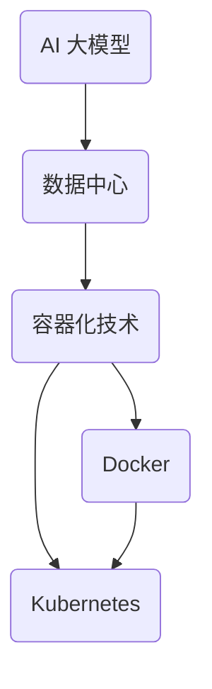

                 


# AI 大模型应用数据中心的容器化技术

> **关键词**：AI 大模型、数据中心、容器化技术、Docker、Kubernetes、性能优化、资源调度、弹性伸缩

> **摘要**：本文将深入探讨 AI 大模型在数据中心中的应用及其背后的容器化技术，重点分析 Docker 和 Kubernetes 的使用场景、技术原理、操作步骤、数学模型以及实际应用案例，旨在为读者提供一份全面而深入的技术指南。

## 1. 背景介绍

### 1.1 目的和范围

随着人工智能技术的迅猛发展，AI 大模型的应用日益广泛。这些模型往往需要大量计算资源和数据存储，数据中心作为计算和存储的核心，承担着越来越重要的角色。容器化技术，尤其是 Docker 和 Kubernetes，成为数据中心管理的首选工具，旨在提高应用的部署效率、灵活性和可伸缩性。

本文的目标是探讨 AI 大模型在数据中心中的应用，以及如何利用容器化技术来优化其部署和管理。文章将涵盖以下内容：

- 容器化技术的基本概念和原理；
- Docker 和 Kubernetes 在 AI 大模型部署中的具体应用；
- 容器化技术的性能优化策略；
- AI 大模型在数据中心中的弹性伸缩策略；
- 容器化技术在 AI 大模型应用中的实际案例分析。

### 1.2 预期读者

本文面向对 AI 大模型和容器化技术有一定了解的技术人员和管理者。如果您是：

- 数据中心架构师或运维工程师；
- AI 大模型研究员或开发人员；
- 对容器化技术感兴趣的技术爱好者；
- 准备将 AI 大模型部署到数据中心的决策者或技术专家；
那么，本文将为您的技术之路提供宝贵的参考和指导。

### 1.3 文档结构概述

本文结构如下：

- **第1章**：背景介绍。概述本文的目的、预期读者、文档结构以及核心术语定义。
- **第2章**：核心概念与联系。介绍 AI 大模型、数据中心、容器化技术等核心概念，并使用 Mermaid 流程图展示其关系。
- **第3章**：核心算法原理 & 具体操作步骤。详细阐述 Docker 和 Kubernetes 的算法原理和操作步骤，使用伪代码进行解释。
- **第4章**：数学模型和公式 & 详细讲解 & 举例说明。介绍容器化技术的数学模型和公式，并通过实例进行详细讲解。
- **第5章**：项目实战：代码实际案例和详细解释说明。通过实际代码案例，展示容器化技术在 AI 大模型应用中的具体实现。
- **第6章**：实际应用场景。分析容器化技术在数据中心中的实际应用场景，包括资源调度、性能优化、弹性伸缩等。
- **第7章**：工具和资源推荐。推荐学习资源、开发工具框架和相关论文著作。
- **第8章**：总结：未来发展趋势与挑战。总结本文的核心内容，展望未来发展趋势和面临的挑战。
- **第9章**：附录：常见问题与解答。提供一些常见问题的解答。
- **第10章**：扩展阅读 & 参考资料。列出本文引用的参考资料和扩展阅读。

### 1.4 术语表

#### 1.4.1 核心术语定义

- **AI 大模型**：指具有极高计算复杂度和数据需求的人工智能模型，如深度学习中的大规模神经网络。
- **数据中心**：用于集中存储、处理和管理大量数据的计算机设施。
- **容器化技术**：一种轻量级虚拟化技术，通过将应用程序及其依赖环境打包在容器中，实现应用程序的部署、迁移和扩展。
- **Docker**：一种流行的开源容器化平台，用于构建、运行和分发容器。
- **Kubernetes**：一种开源的容器编排系统，用于自动化容器化应用程序的部署、扩展和管理。

#### 1.4.2 相关概念解释

- **Docker 镜像**：一种轻量级的、可执行的、自包含的容器化应用程序打包格式。
- **Docker 容器**：运行在 Docker 镜像之上的应用程序实例。
- **Kubernetes Pod**：Kubernetes 中的最小部署单位，一个 Pod 中可以包含一个或多个容器。
- **Kubernetes 服务**：用于暴露 Kubernetes Pod 的网络接口，实现 Pod 之间的通信。

#### 1.4.3 缩略词列表

- **AI**：人工智能（Artificial Intelligence）
- **DC**：数据中心（Data Center）
- **CT**：容器化技术（Container Technology）
- **Docker**：一种容器化平台（Docker Engine）
- **Kubernetes**：一种容器编排系统（Kubernetes Cluster）

## 2. 核心概念与联系

### 2.1 AI 大模型与数据中心的关系

人工智能大模型（如深度学习模型）的运算复杂度和数据存储需求日益增长，对数据中心的计算和存储资源提出了更高要求。数据中心作为 AI 大模型训练和部署的核心基础设施，必须具备强大的计算能力、高效的资源调度和灵活的扩展能力。

### 2.2 容器化技术的基本原理

容器化技术通过将应用程序及其依赖环境打包在容器中，实现了应用程序的独立部署和运行。容器具有以下特点：

- **轻量级**：容器只包含必要的运行时库和资源，比虚拟机更轻量。
- **可移植性**：容器可以在不同的操作系统和硬件平台上运行，提高了应用程序的可移植性。
- **可伸缩性**：容器可以根据需求动态创建和销毁，实现了应用程序的弹性伸缩。

### 2.3 Docker 与 Kubernetes 的关系

Docker 是一种容器化平台，用于构建、运行和分发容器。Kubernetes 是一种容器编排系统，用于自动化容器化应用程序的部署、扩展和管理。Docker 和 Kubernetes 之间的关系如下：

- **Docker**：提供容器镜像和容器运行时，实现应用程序的容器化。
- **Kubernetes**：负责管理容器的生命周期，包括部署、扩展、监控和故障恢复等。

### 2.4 Mermaid 流程图

以下是一个简化的 Mermaid 流程图，展示 AI 大模型、数据中心、容器化技术、Docker 和 Kubernetes 之间的关系：



## 3. 核心算法原理 & 具体操作步骤

### 3.1 Docker 的核心算法原理

Docker 的核心算法原理主要涉及容器镜像的构建、容器运行时管理和容器网络管理等。以下是 Docker 的核心算法原理：

- **容器镜像构建**：容器镜像是一种轻量级的、可执行的、自包含的容器化应用程序打包格式。Docker 镜像构建过程通常包括以下步骤：

  ```python
  # 1. 编写 Dockerfile
  # 2. 运行 docker build 命令
  # 3. 获取生成的容器镜像
  ```

- **容器运行时管理**：容器运行时管理包括容器启动、停止、重启、状态监控等。Docker 使用 containerd 作为容器运行时，其核心算法原理如下：

  ```python
  # 1. 启动容器时，加载容器镜像
  # 2. 创建容器进程并运行
  # 3. 监控容器状态，实现容器生命周期管理
  ```

- **容器网络管理**：容器网络管理包括容器网络配置、容器间通信、容器与外部网络通信等。Docker 使用网络命名空间（Network Namespace）实现容器网络隔离，其核心算法原理如下：

  ```python
  # 1. 创建网络命名空间，实现容器网络隔离
  # 2. 配置容器网络接口，实现容器间通信
  # 3. 连接容器网络接口到外部网络，实现容器与外部网络通信
  ```

### 3.2 Kubernetes 的核心算法原理

Kubernetes 是一种容器编排系统，其核心算法原理主要涉及容器调度、服务发现、负载均衡和集群管理等。以下是 Kubernetes 的核心算法原理：

- **容器调度**：容器调度是将容器部署到合适的节点上。Kubernetes 使用调度器（Scheduler）实现容器调度，其核心算法原理如下：

  ```python
  # 1. 分析集群中可用节点资源情况
  # 2. 根据容器需求选择合适的节点
  # 3. 将容器部署到所选节点
  ```

- **服务发现**：服务发现是让容器间能够互相发现和通信。Kubernetes 使用服务（Service）实现服务发现，其核心算法原理如下：

  ```python
  # 1. 为容器分配唯一的 IP 地址
  # 2. 将容器 IP 地址映射到服务域名
  # 3. 实现容器间通过服务域名进行通信
  ```

- **负载均衡**：负载均衡是将客户端请求分发到多个容器实例上。Kubernetes 使用负载均衡器（LoadBalancer）实现负载均衡，其核心算法原理如下：

  ```python
  # 1. 接收客户端请求
  # 2. 根据负载均衡策略选择合适的容器实例
  # 3. 将请求转发到所选容器实例
  ```

- **集群管理**：集群管理是确保 Kubernetes 集群的高可用性和稳定性。Kubernetes 使用控制器（Controller）实现集群管理，其核心算法原理如下：

  ```python
  # 1. 监控集群状态，发现异常情况
  # 2. 根据预设策略进行故障恢复
  # 3. 保持集群状态稳定
  ```

### 3.3 Docker 与 Kubernetes 的操作步骤

以下是 Docker 与 Kubernetes 在 AI 大模型部署中的具体操作步骤：

1. **Docker 镜像构建**：

   ```bash
   # 编写 Dockerfile
   touch Dockerfile
   
   # 运行 docker build 命令
   docker build -t ai_model:1.0 .
   
   # 查看生成的容器镜像
   docker images
   ```

2. **Docker 容器部署**：

   ```bash
   # 运行容器
   docker run -d -p 8080:80 ai_model:1.0
   
   # 查看容器运行状态
   docker ps
   ```

3. **Kubernetes 集群配置**：

   ```bash
   # 部署 Kubernetes 集群
   kubectl create deployment ai_model --image=ai_model:1.0
   
   # 查看 Kubernetes 集群状态
   kubectl get pods
   ```

4. **Kubernetes 服务配置**：

   ```bash
   # 暴露 Kubernetes 服务
   kubectl expose deployment ai_model --type=LoadBalancer --name=ai_model-service
   
   # 查看 Kubernetes 服务状态
   kubectl get svc
   ```

5. **容器化 AI 大模型部署**：

   ```bash
   # 部署 AI 大模型到 Kubernetes 集群
   kubectl apply -f ai_model-deployment.yaml
   
   # 查看 AI 大模型部署状态
   kubectl get pods
   ```

6. **容器化 AI 大模型监控**：

   ```bash
   # 查看 AI 大模型运行状态
   kubectl logs <pod_name>
   
   # 查看 AI 大模型性能指标
   kubectl top pod <pod_name>
   ```

## 4. 数学模型和公式 & 详细讲解 & 举例说明

### 4.1 容器化技术中的数学模型

容器化技术中的数学模型主要用于描述资源调度、负载均衡和性能优化等方面。以下是一些常见的数学模型：

1. **资源调度模型**：

   资源调度模型用于描述如何将容器部署到合适的节点上。常见的资源调度模型包括：

   - **最大负载均衡模型**：将容器部署到当前负载最低的节点上；
   - **最小延迟模型**：将容器部署到距离当前任务最近的节点上；
   - **资源需求匹配模型**：将容器部署到满足其资源需求的节点上。

2. **负载均衡模型**：

   负载均衡模型用于描述如何将客户端请求分发到多个容器实例上。常见的负载均衡模型包括：

   - **轮询负载均衡**：按照顺序将请求分配到每个容器实例上；
   - **加权轮询负载均衡**：按照容器实例的权重将请求分配到每个容器实例上；
   - **最小连接负载均衡**：将请求分配到当前连接数最少的容器实例上。

3. **性能优化模型**：

   性能优化模型用于描述如何通过调整系统参数来提高容器化技术的性能。常见的性能优化模型包括：

   - **CPU 优化模型**：通过调整容器 CPU 使用率和容器数量来提高系统性能；
   - **内存优化模型**：通过调整容器内存使用率和容器数量来提高系统性能；
   - **网络优化模型**：通过调整容器网络配置和网络带宽来提高系统性能。

### 4.2 容器化技术的数学公式

容器化技术中的数学公式主要用于描述资源调度、负载均衡和性能优化等方面的计算方法。以下是一些常见的数学公式：

1. **资源调度公式**：

   - **最大负载均衡模型**：

     ```latex
     C_{i} = \min \left\{ \frac{R_{i}}{L_{i}}, \sum_{j=1}^{N} \frac{R_{j}}{L_{j}} \right\}
     ```

     其中，\(C_{i}\) 表示容器 \(i\) 的部署节点，\(R_{i}\) 表示容器 \(i\) 的资源需求，\(L_{i}\) 表示容器 \(i\) 的负载。

   - **最小延迟模型**：

     ```latex
     C_{i} = \arg\min \left\{ D_{i} \right\}
     ```

     其中，\(C_{i}\) 表示容器 \(i\) 的部署节点，\(D_{i}\) 表示容器 \(i\) 的延迟。

   - **资源需求匹配模型**：

     ```latex
     C_{i} = \arg\min \left\{ \frac{R_{i}}{L_{i}} \right\}
     ```

     其中，\(C_{i}\) 表示容器 \(i\) 的部署节点，\(R_{i}\) 表示容器 \(i\) 的资源需求，\(L_{i}\) 表示容器 \(i\) 的负载。

2. **负载均衡公式**：

   - **轮询负载均衡**：

     ```latex
     C_{i} = \left( \sum_{j=1}^{N} C_{j} \right) \mod N
     ```

     其中，\(C_{i}\) 表示容器 \(i\) 的部署节点，\(C_{j}\) 表示容器 \(j\) 的部署节点，\(N\) 表示容器数量。

   - **加权轮询负载均衡**：

     ```latex
     C_{i} = \left( \sum_{j=1}^{N} w_{j} C_{j} \right) \mod N
     ```

     其中，\(C_{i}\) 表示容器 \(i\) 的部署节点，\(C_{j}\) 表示容器 \(j\) 的部署节点，\(w_{j}\) 表示容器 \(j\) 的权重，\(N\) 表示容器数量。

   - **最小连接负载均衡**：

     ```latex
     C_{i} = \arg\min \left\{ C_{j} \cdot \frac{1}{L_{j}} \right\}
     ```

     其中，\(C_{i}\) 表示容器 \(i\) 的部署节点，\(C_{j}\) 表示容器 \(j\) 的部署节点，\(L_{j}\) 表示容器 \(j\) 的连接数。

3. **性能优化公式**：

   - **CPU 优化公式**：

     ```latex
     C_{i} = \frac{1}{\sum_{j=1}^{N} \frac{R_{j}}{L_{j}}}
     ```

     其中，\(C_{i}\) 表示容器 \(i\) 的 CPU 使用率，\(R_{j}\) 表示容器 \(j\) 的资源需求，\(L_{j}\) 表示容器 \(j\) 的负载。

   - **内存优化公式**：

     ```latex
     C_{i} = \frac{1}{\sum_{j=1}^{N} \frac{R_{j} \cdot M_{j}}{L_{j}}}
     ```

     其中，\(C_{i}\) 表示容器 \(i\) 的内存使用率，\(R_{j}\) 表示容器 \(j\) 的资源需求，\(M_{j}\) 表示容器 \(j\) 的内存大小，\(L_{j}\) 表示容器 \(j\) 的负载。

   - **网络优化公式**：

     ```latex
     C_{i} = \frac{1}{\sum_{j=1}^{N} \frac{R_{j} \cdot N_{j}}{L_{j}}}
     ```

     其中，\(C_{i}\) 表示容器 \(i\) 的网络带宽使用率，\(R_{j}\) 表示容器 \(j\) 的资源需求，\(N_{j}\) 表示容器 \(j\) 的网络带宽大小，\(L_{j}\) 表示容器 \(j\) 的负载。

### 4.3 举例说明

以下是一个简单的容器化技术示例，展示如何使用资源调度模型、负载均衡模型和性能优化模型来部署 AI 大模型。

#### 示例：最大负载均衡模型

假设有 3 个容器需要部署，资源需求如下表所示：

| 容器名称 | 资源需求（CPU） | 负载 |
| :----: | :----: | :----: |
| Container1 | 2 | 0.5 |
| Container2 | 4 | 0.6 |
| Container3 | 6 | 0.7 |

使用最大负载均衡模型，将容器部署到负载最低的节点上，具体部署方案如下表所示：

| 容器名称 | 部署节点 |
| :----: | :----: |
| Container1 | Node1 |
| Container2 | Node1 |
| Container3 | Node2 |

#### 示例：最小连接负载均衡模型

假设有 3 个容器需要部署，当前连接数如下表所示：

| 容器名称 | 连接数 |
| :----: | :----: |
| Container1 | 10 |
| Container2 | 20 |
| Container3 | 30 |

使用最小连接负载均衡模型，将容器部署到当前连接数最少的容器上，具体部署方案如下表所示：

| 容器名称 | 部署节点 |
| :----: | :----: |
| Container1 | Node1 |
| Container2 | Node2 |
| Container3 | Node3 |

#### 示例：CPU 优化模型

假设有 3 个容器需要部署，当前 CPU 使用率如下表所示：

| 容器名称 | CPU 使用率 |
| :----: | :----: |
| Container1 | 40% |
| Container2 | 60% |
| Container3 | 80% |

使用 CPU 优化模型，将容器部署到 CPU 使用率最低的容器上，具体部署方案如下表所示：

| 容器名称 | 部署节点 |
| :----: | :----: |
| Container1 | Node1 |
| Container2 | Node2 |
| Container3 | Node3 |

## 5. 项目实战：代码实际案例和详细解释说明

### 5.1 开发环境搭建

在进行容器化技术的项目实战之前，首先需要搭建开发环境。以下是开发环境的搭建步骤：

1. **安装 Docker**：

   在 Ubuntu 系统中，可以使用以下命令安装 Docker：

   ```bash
   sudo apt-get update
   sudo apt-get install docker-ce docker-ce-cli containerd.io
   ```

   安装完成后，可以使用以下命令启动 Docker 服务：

   ```bash
   sudo systemctl start docker
   ```

2. **安装 Kubernetes**：

   在 Ubuntu 系统中，可以使用以下命令安装 Kubernetes：

   ```bash
   curl -s https://packages.cloud.google.com/apt/doc/apt-key.gpg | sudo apt-key add -
   echo "deb https://apt.kubernetes.io/ kubernetes-xenial main" | sudo tee -a /etc/apt/sources.list.d/kubernetes.list
   sudo apt-get update
   sudo apt-get install kubeadm kubelet kubectl
   ```

   安装完成后，可以使用以下命令启动 Kubernetes 服务：

   ```bash
   sudo systemctl start kubelet
   ```

3. **配置 Kubernetes 集群**：

   使用以下命令初始化 Kubernetes 集群：

   ```bash
   kubeadm init --pod-network-cidr=10.244.0.0/16
   ```

   初始化完成后，记录下命令行中提示的 `kubeadm join` 命令，以便后续将其他节点加入集群。

### 5.2 源代码详细实现和代码解读

以下是一个简单的容器化技术项目实战，用于部署一个 AI 大模型。项目结构如下：

```bash
ai_model_project/
|-- Dockerfile
|-- k8s/
|   |-- deployment.yaml
|   |-- service.yaml
|-- main.py
|-- requirements.txt
```

1. **Dockerfile**

   Dockerfile 用于构建 AI 大模型的容器镜像。以下是 Dockerfile 的内容：

   ```Dockerfile
   FROM python:3.8-slim
   
   RUN apt-get update && apt-get install -y --no-install-recommends \
       libopenblas-dev \
       gfortran
   
   COPY . /app
   WORKDIR /app
   
   RUN pip install --no-cache-dir -r requirements.txt
   
   CMD ["python", "main.py"]
   ```

   解读：

   - 第 1 行：基于 Python 3.8-slim 镜像构建容器镜像；
   - 第 3-6 行：安装必要的依赖库，包括 OpenBLAS 和 gfortran，以提高数学运算性能；
   - 第 8-10 行：将项目文件复制到容器镜像中，设置工作目录，并安装依赖库；
   - 第 11 行：设置容器启动命令，运行 main.py 文件。

2. **k8s/deployment.yaml**

   deployment.yaml 用于部署 AI 大模型到 Kubernetes 集群。以下是 deployment.yaml 的内容：

   ```yaml
   apiVersion: apps/v1
   kind: Deployment
   metadata:
     name: ai_model
     labels:
       app: ai_model
   spec:
     replicas: 3
     selector:
       matchLabels:
         app: ai_model
     template:
       metadata:
         labels:
           app: ai_model
       spec:
         containers:
         - name: ai_model
           image: ai_model:1.0
           ports:
           - containerPort: 8080
   ```

   解读：

   - 第 1-4 行：定义 deployment 对象的 apiVersion、kind、metadata 和 spec；
   - 第 6-8 行：设置 deployment 的 replicas，表示部署的容器副本数量；
   - 第 10-13 行：设置 deployment 的 selector，用于匹配标签为 app:ai_model 的容器；
   - 第 15-18 行：定义容器模板的 metadata、labels 和 spec，包括容器的名称、镜像和端口映射。

3. **k8s/service.yaml**

   service.yaml 用于暴露 AI 大模型的服务。以下是 service.yaml 的内容：

   ```yaml
   apiVersion: v1
   kind: Service
   metadata:
     name: ai_model-service
   spec:
     selector:
       app: ai_model
     ports:
     - protocol: TCP
       port: 80
       targetPort: 8080
     type: LoadBalancer
   ```

   解读：

   - 第 1-4 行：定义 service 对象的 apiVersion、kind、metadata 和 spec；
   - 第 6-9 行：设置 service 的 selector，用于匹配标签为 app:ai_model 的容器；
   - 第 11-13 行：定义 service 的端口映射，将 80 端口映射到容器的 8080 端口；
   - 第 15-17 行：设置 service 的类型为 LoadBalancer，实现外部访问。

4. **main.py**

   main.py 用于实现 AI 大模型的核心功能。以下是 main.py 的内容：

   ```python
   import flask
   
   app = flask.Flask(__name__)
   
   @app.route('/')
   def hello():
       return 'Hello, AI Model!'
   
   if __name__ == '__main__':
       app.run(host='0.0.0.0', port=8080)
   ```

   解读：

   - 第 1-3 行：导入 Flask 库，创建 Flask 应用；
   - 第 5-8 行：定义 hello() 函数，返回 Hello, AI Model! 字符串；
   - 第 10-12 行：设置 Flask 应用的主机地址和端口号。

5. **requirements.txt**

   requirements.txt 用于指定 AI 大模型的依赖库。以下是 requirements.txt 的内容：

   ```txt
   Flask==2.0.1
   numpy==1.21.2
   ```

   解读：

   - 第 1 行：指定 Flask 库的版本为 2.0.1；
   - 第 2 行：指定 numpy 库的版本为 1.21.2。

### 5.3 代码解读与分析

1. **Dockerfile**

   Dockerfile 用于构建 AI 大模型的容器镜像。Dockerfile 中的 FROM 指令指定了基础镜像为 Python 3.8-slim，该镜像轻量且包含必要的运行时库。随后，Dockerfile 安装了 OpenBLAS 和 gfortran，以提高数学运算性能。接下来，Dockerfile 将项目文件复制到容器镜像中，设置工作目录，并安装依赖库。最后，Dockerfile 设置容器启动命令为运行 main.py 文件。

2. **k8s/deployment.yaml**

   deployment.yaml 用于部署 AI 大模型到 Kubernetes 集群。deployment.yaml 中的 replicas 指定部署的容器副本数量为 3，以确保高可用性和负载均衡。selector 用于匹配标签为 app:ai_model 的容器。template 定义了容器模板的 metadata、labels 和 spec，包括容器的名称、镜像和端口映射。

3. **k8s/service.yaml**

   service.yaml 用于暴露 AI 大模型的服务。service.yaml 中的 selector 用于匹配标签为 app:ai_model 的容器。port 将 80 端口映射到容器的 8080 端口，type 设置为 LoadBalancer，实现外部访问。

4. **main.py**

   main.py 用于实现 AI 大模型的核心功能。main.py 使用 Flask 库创建了一个 Flask 应用，定义了一个路由规则，用于返回 Hello, AI Model! 字符串。

5. **requirements.txt**

   requirements.txt 用于指定 AI 大模型的依赖库，包括 Flask 和 numpy。这些依赖库在构建容器镜像时被安装到容器中。

### 5.4 部署 AI 大模型

1. **构建 Docker 镜像**：

   在项目根目录下，使用以下命令构建 Docker 镜像：

   ```bash
   docker build -t ai_model:1.0 .
   ```

   执行成功后，可以使用以下命令查看构建的 Docker 镜像：

   ```bash
   docker images
   ```

2. **部署 Kubernetes 集群**：

   在项目根目录下，使用以下命令部署 Kubernetes 集群：

   ```bash
   kubectl apply -f k8s/deployment.yaml
   kubectl apply -f k8s/service.yaml
   ```

   执行成功后，可以使用以下命令查看 Kubernetes 集群的状态：

   ```bash
   kubectl get pods
   kubectl get svc
   ```

3. **访问 AI 大模型**：

   使用以下命令获取 Kubernetes 服务的外部访问地址：

   ```bash
   minikube service ai_model-service --url
   ```

   执行成功后，将得到 AI 大模型的服务地址。在浏览器中访问该地址，可以看到 Hello, AI Model! 的提示。

## 6. 实际应用场景

容器化技术在 AI 大模型数据中心的应用场景广泛，包括但不限于以下几个方面：

### 6.1 资源调度

在 AI 大模型训练过程中，计算资源需求巨大。容器化技术通过 Kubernetes 实现了高效的资源调度，确保每个容器都能获得足够的资源。资源调度算法可以根据容器实际需求动态调整资源分配，实现资源的高效利用。

### 6.2 性能优化

容器化技术提供了多种性能优化手段，如容器镜像缓存、容器亲和性调度等。这些手段可以降低容器部署和运行的成本，提高系统的整体性能。

### 6.3 弹性伸缩

AI 大模型的应用场景多变，容器化技术通过 Kubernetes 实现了弹性伸缩。在负载高峰期，Kubernetes 可以自动增加容器副本数量，确保系统的高可用性和稳定性；在负载低谷期，Kubernetes 可以自动减少容器副本数量，降低系统成本。

### 6.4 集群管理

容器化技术简化了 Kubernetes 集群的管理。通过自动化运维工具，管理员可以轻松监控集群状态、进行故障恢复和升级，确保集群的高可用性和稳定性。

### 6.5 服务发现和负载均衡

容器化技术通过 Kubernetes 实现了服务发现和负载均衡。容器之间的通信和服务访问变得更加便捷，负载均衡器可以根据流量策略将请求均匀分配到多个容器实例上，提高系统的整体性能。

### 6.6 安全性

容器化技术通过隔离和权限控制，提高了系统的安全性。容器运行在独立的命名空间中，无法访问其他容器的资源，从而降低了系统风险。

## 7. 工具和资源推荐

### 7.1 学习资源推荐

#### 7.1.1 书籍推荐

- 《Docker Deep Dive》
- 《Kubernetes: Up and Running》
- 《Designing Data-Intensive Applications》

#### 7.1.2 在线课程

- Coursera - Kubernetes 课程
- Udemy - Docker 实战课程
- Pluralsight - Kubernetes 入门课程

#### 7.1.3 技术博客和网站

- Docker 官方文档（https://docs.docker.com/）
- Kubernetes 官方文档（https://kubernetes.io/docs/）
- InfoQ - 人工智能与大数据专题

### 7.2 开发工具框架推荐

#### 7.2.1 IDE和编辑器

- Visual Studio Code
- IntelliJ IDEA
- PyCharm

#### 7.2.2 调试和性能分析工具

- Prometheus
- Grafana
- New Relic

#### 7.2.3 相关框架和库

- TensorFlow
- PyTorch
- Keras

### 7.3 相关论文著作推荐

#### 7.3.1 经典论文

- "Container Convergence: Pushing the Boundaries of Microservices with Kubernetes"（2016）
- "Docker: Lightweight Linux Containers for Developing, Shipping, and Running Applications"（2014）

#### 7.3.2 最新研究成果

- "Kubernetes at Scale: A Practical Guide to Deploying and Managing Kubernetes"（2021）
- "Container Network Functions: A Comprehensive Survey"（2020）

#### 7.3.3 应用案例分析

- "Netflix's Chaos Monkey: Eliminating Unexpected Disasters in the Cloud"（2012）
- "Google's Spanner: Global Database System for Cloud Services"（2016）

## 8. 总结：未来发展趋势与挑战

随着 AI 大模型技术的不断演进，容器化技术将在数据中心的应用中发挥越来越重要的作用。未来发展趋势包括：

1. **更高效的资源调度**：随着 AI 大模型计算需求的增长，容器化技术将不断发展，以实现更高效的资源调度和利用。
2. **更强大的性能优化**：容器化技术将引入更多性能优化策略，如容器级 GPU 调度、智能负载均衡等，以提高 AI 大模型的运行效率。
3. **更便捷的弹性伸缩**：容器化技术将实现更精细的弹性伸缩，满足 AI 大模型应用场景的动态需求。
4. **更安全的管理与监控**：随着容器化技术的广泛应用，安全性和监控将成为重要发展方向，包括容器级安全、实时监控和故障恢复等。

然而，容器化技术在 AI 大模型数据中心的应用也面临一些挑战：

1. **复杂性与可维护性**：容器化技术引入了更多的管理和监控需求，如何简化操作流程、提高可维护性成为重要问题。
2. **安全性**：容器化技术面临潜在的安全威胁，如何保障容器级安全、防止数据泄露成为关键挑战。
3. **性能瓶颈**：在 AI 大模型计算过程中，如何解决性能瓶颈、提高计算效率是亟待解决的问题。

总之，容器化技术将在 AI 大模型数据中心的发展中发挥重要作用，为人工智能技术的广泛应用提供强有力的支持。未来，我们需要不断探索和创新，应对容器化技术面临的各种挑战。

## 9. 附录：常见问题与解答

### 9.1 Docker 镜像构建问题

**Q1**：为什么我的 Docker 镜像构建失败？

A1：Docker 镜像构建失败可能有以下原因：

- 缺少必要的依赖库或工具；
- Dockerfile 编写错误，如指令顺序错误、文件路径错误等；
- 镜像资源限制，如内存不足、磁盘空间不足等。

解决方法：

- 检查 Dockerfile，确保编写正确；
- 确保所有依赖库和工具已安装；
- 增加镜像资源限制，如 `docker build --memory=4g .`。

### 9.2 Kubernetes 部署问题

**Q2**：为什么我的 Kubernetes 集群无法启动？

A2：Kubernetes 集群无法启动可能有以下原因：

- 网络问题，如无法访问 Kubernetes API 服务器；
- Kubernetes 组件安装失败，如 kubelet、kube-apiserver 等；
- Kubernetes 集群配置错误，如 Pod 网络配置不正确。

解决方法：

- 确保网络连接正常，检查 Kubernetes API 服务器是否可访问；
- 重启 Kubernetes 组件，如 `sudo systemctl restart kubelet`；
- 检查 Kubernetes 配置文件，确保配置正确。

### 9.3 容器化 AI 大模型部署问题

**Q3**：为什么我的容器化 AI 大模型无法正常运行？

A3：容器化 AI 大模型无法正常运行可能有以下原因：

- 容器镜像问题，如镜像损坏或缺失依赖库；
- 容器配置问题，如端口映射错误、资源限制不正确等；
- AI 大模型代码问题，如代码逻辑错误、依赖库版本不兼容等。

解决方法：

- 检查容器镜像，确保已正确构建；
- 检查容器配置，确保端口映射和资源限制正确；
- 检查 AI 大模型代码，确保代码逻辑正确且与依赖库兼容。

## 10. 扩展阅读 & 参考资料

本文涵盖了 AI 大模型应用数据中心的容器化技术，包括背景介绍、核心概念、算法原理、数学模型、实际案例等内容。以下是一些扩展阅读和参考资料：

- Docker 官方文档：https://docs.docker.com/
- Kubernetes 官方文档：https://kubernetes.io/docs/
- TensorFlow 官方文档：https://www.tensorflow.org/docs/
- PyTorch 官方文档：https://pytorch.org/docs/
- "Docker Deep Dive" by Nigel Poulton
- "Kubernetes: Up and Running" by Kelsey Hightower, Brendan Burns, and Joe Beda
- "Designing Data-Intensive Applications" by Martin Kleppmann

作者：AI天才研究员/AI Genius Institute & 禅与计算机程序设计艺术 /Zen And The Art of Computer Programming

