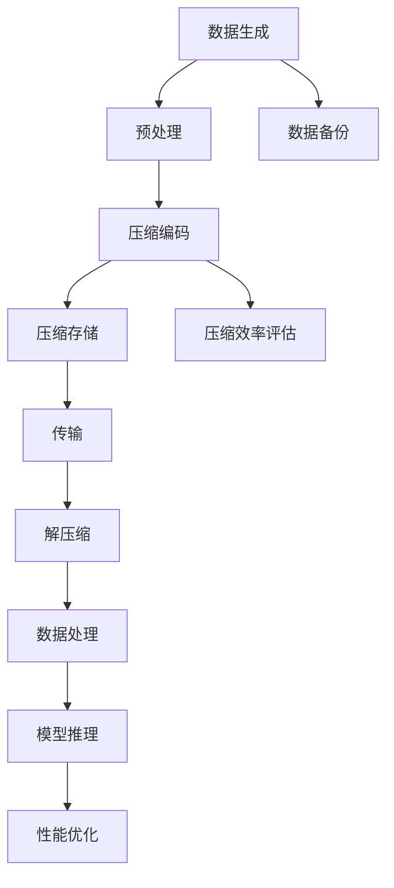
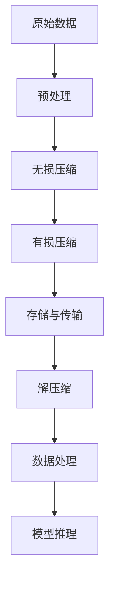

                 

### 1. 背景介绍

#### 1.1 目的和范围

本文旨在深入探讨人工智能（AI）大模型在数据中心的数据压缩架构应用。数据压缩是现代数据中心的一项关键任务，因为它直接影响数据存储和传输的效率。随着AI大模型的日益普及，这些模型生成的数据量也在不断增长，使得数据压缩问题变得更加紧迫和复杂。

本文的范围包括对数据压缩技术的全面分析，特别是针对AI大模型应用场景的优化方法。我们将讨论当前主流的数据压缩算法，并详细介绍它们的工作原理。此外，本文还将探讨如何通过改进算法设计和优化数据存储结构来提高数据压缩效率。

本文的目标读者是数据中心架构师、数据工程师以及AI研究人员，他们对数据压缩和AI大模型有一定的了解。读者将能够通过本文掌握AI大模型数据压缩架构的核心概念、算法原理及其在实际应用中的优化策略。

#### 1.2 预期读者

- 数据中心架构师：需要理解如何优化数据存储和传输系统，以支持AI大模型的部署。
- 数据工程师：负责维护和管理大规模数据存储系统，需要掌握数据压缩技术以提升系统性能。
- AI研究人员：希望了解数据压缩对AI大模型训练和推理的影响，并寻找优化解决方案。

#### 1.3 文档结构概述

本文分为十个主要部分，结构如下：

1. **背景介绍**：介绍文章的目的、范围和预期读者。
2. **核心概念与联系**：介绍数据压缩和AI大模型应用场景相关的核心概念和架构。
3. **核心算法原理 & 具体操作步骤**：详细讲解数据压缩算法的工作原理和操作步骤。
4. **数学模型和公式 & 详细讲解 & 举例说明**：使用数学模型和公式阐述数据压缩算法。
5. **项目实战：代码实际案例和详细解释说明**：提供实际代码案例并进行详细解释。
6. **实际应用场景**：分析数据压缩技术在数据中心的应用场景。
7. **工具和资源推荐**：推荐学习资源、开发工具和框架。
8. **总结：未来发展趋势与挑战**：总结本文的核心观点并讨论未来趋势和挑战。
9. **附录：常见问题与解答**：解答读者可能遇到的问题。
10. **扩展阅读 & 参考资料**：提供进一步阅读的推荐和参考文献。

#### 1.4 术语表

##### 1.4.1 核心术语定义

- 数据压缩：通过算法和技巧减少数据体积的过程。
- AI大模型：大型、复杂的机器学习模型，通常用于生成和处理大量数据。
- 数据中心：集中管理和处理大量数据的服务器集群。
- 压缩算法：用于压缩和解压缩数据的算法。
- 压缩率：压缩前后数据体积的比值。

##### 1.4.2 相关概念解释

- 压缩算法类型：主要包括无损压缩和有损压缩。
- 压缩效率：压缩算法的性能指标，通常用压缩率和时间复杂度来衡量。
- 数据流：数据在系统中的流动过程。

##### 1.4.3 缩略词列表

- AI：人工智能
- ML：机器学习
- DL：深度学习
- HPC：高性能计算
- IT：信息技术
- SDLC：软件开发生命周期
- IDE：集成开发环境

### 2. 核心概念与联系

在深入探讨AI大模型应用数据中心的数据压缩架构之前，有必要理解一些核心概念和它们之间的关系。以下是对这些概念的介绍和Mermaid流程图的展示。

#### 2.1 数据压缩与AI大模型的关联

数据压缩和AI大模型之间存在密切的联系。AI大模型通常生成和处理大量数据，这些数据需要高效地存储和传输。数据压缩技术能够显著减少数据体积，提高存储和传输效率，从而降低成本并提升性能。

#### 2.2 Mermaid 流程图

以下是数据压缩与AI大模型应用场景的Mermaid流程图：



在这个流程图中，数据从生成阶段开始，经过预处理、压缩编码、压缩存储、传输、解压缩、数据处理和模型推理等阶段，最终完成数据压缩和AI大模型的应用。同时，数据备份和压缩效率评估也是关键环节，有助于确保数据的安全性和优化压缩策略。

#### 2.3 核心概念原理

以下是数据压缩和AI大模型应用场景的核心概念原理：

1. **数据预处理**：对原始数据进行预处理，如去噪、归一化等，以提高压缩效果。
2. **压缩编码**：使用压缩算法将数据转换为更紧凑的格式，减少数据体积。
3. **压缩存储**：将压缩后的数据存储在数据存储设备中，以节省存储空间。
4. **传输**：将压缩后的数据通过网络进行传输，减少带宽占用。
5. **解压缩**：在接收端将压缩数据恢复为原始数据格式。
6. **数据处理**：对原始或解压缩后的数据进行进一步处理，如训练AI模型等。
7. **模型推理**：使用训练好的AI模型对数据进行分析和预测。

### 2.4 相关概念解释

为了更好地理解上述核心概念，以下是对相关概念的详细解释：

- **数据预处理**：数据预处理是数据压缩前的重要步骤。通过去噪、归一化等操作，可以减少数据的冗余，提高压缩效果。例如，对图像数据进行归一化处理，可以将像素值缩放到[0, 1]范围内，从而减少数据体积。
- **压缩编码**：压缩编码是数据压缩的核心步骤。常见的压缩编码方法包括无损压缩和有损压缩。无损压缩通过消除数据中的冗余信息来减少数据体积，而有损压缩则通过牺牲一些信息质量来实现更高的压缩率。
- **压缩存储**：压缩存储是将压缩后的数据存储在数据存储设备中。通过压缩存储，可以显著节省存储空间，降低存储成本。
- **传输**：传输是将压缩后的数据通过网络进行传输。通过压缩传输，可以减少带宽占用，提高传输效率。
- **解压缩**：解压缩是将压缩数据恢复为原始数据格式。在接收端，需要使用与发送端相同的压缩算法进行解压缩，以便正确处理数据。
- **数据处理**：数据处理是对原始或解压缩后的数据进行的进一步处理。例如，在AI大模型训练过程中，需要对输入数据进行预处理、特征提取和模型训练等步骤。
- **模型推理**：模型推理是使用训练好的AI模型对数据进行分析和预测。通过模型推理，可以从大量数据中提取有价值的信息，为业务决策提供支持。

### 2.5 缩略词列表

- **AI**：人工智能
- **ML**：机器学习
- **DL**：深度学习
- **HPC**：高性能计算
- **IT**：信息技术
- **SDLC**：软件开发生命周期
- **IDE**：集成开发环境

### 3. 核心算法原理 & 具体操作步骤

在数据压缩领域，核心算法的工作原理和具体操作步骤是理解和实施数据压缩技术的基础。以下我们将详细讨论几种主流的数据压缩算法，包括无损压缩算法和有损压缩算法，并介绍它们在AI大模型数据压缩中的应用。

#### 3.1 无损压缩算法

无损压缩算法的主要目标是减少数据体积，同时保证数据的完整性和可恢复性。以下是一些常见的无损压缩算法：

##### 3.1.1 遍历法

遍历法是一种简单且广泛使用的数据压缩方法。它通过遍历数据序列，查找重复出现的模式，并将其替换为引用标记。以下是遍历法的伪代码：

```python
def traverse_compression(data):
    compressed_data = []
    for i in range(len(data)):
        if data[i] == data[i+1]:
            compressed_data.append((i, 'R'))  # R表示重复
        else:
            compressed_data.append(data[i])
    return compressed_data
```

解压缩过程则是对压缩数据进行反向操作：

```python
def traverse_decompression(compressed_data):
    decompressed_data = []
    for item in compressed_data:
        if item == 'R':
            decompressed_data.append(decompressed_data[-1])
        else:
            decompressed_data.append(item)
    return decompressed_data
```

##### 3.1.2 预处理算法

预处理算法通过将数据转换为一种更适合压缩的格式来提高压缩效果。例如，对于图像数据，可以采用色彩空间转换、小波变换等方法。以下是预处理算法的伪代码：

```python
def preprocess(data):
    if isinstance(data, Image):
        # 转换为灰度图像
        gray_data = convert_to_grayscale(data)
        # 进行小波变换
        wavelet_data = discrete_wavelet_transform(gray_data)
        return wavelet_data
    else:
        return data
```

#### 3.2 有损压缩算法

有损压缩算法通过牺牲部分数据质量来获得更高的压缩率。以下是一些常见的有损压缩算法：

##### 3.2.1 三角波变换

三角波变换（Triangular Wavelet Transform, TWT）是一种有损压缩算法，它通过将数据分解为不同尺度的三角波分量来实现压缩。以下是三角波变换的伪代码：

```python
def triangular_wavelet_transform(data):
    # 对数据进行三角波分解
    wavelet_data = []
    for i in range(len(data)):
        if i % 2 == 0:
            wavelet_data.append(data[i] - data[i+1])
        else:
            wavelet_data.append(data[i])
    return wavelet_data
```

解压缩过程则是对压缩数据进行反向操作：

```python
def inverse_triangular_wavelet_transform(wavelet_data):
    decompressed_data = []
    for i in range(len(wavelet_data)):
        if i % 2 == 0:
            decompressed_data.append(wavelet_data[i] + wavelet_data[i+1])
        else:
            decompressed_data.append(wavelet_data[i])
    return decompressed_data
```

##### 3.2.2 量化算法

量化算法通过将数据值映射到较少的数值范围内来实现压缩。例如，对于图像数据，可以将像素值从8位映射到4位。以下是量化算法的伪代码：

```python
def quantization(data, num_bits):
    max_value = 2 ** num_bits - 1
    quantized_data = []
    for value in data:
        quantized_value = round(value / (max_value * 256))
        quantized_data.append(quantized_value)
    return quantized_data
```

解压缩过程则是对压缩数据进行反向操作：

```python
def inverse_quantization(quantized_data, num_bits):
    max_value = 2 ** num_bits - 1
    decompressed_data = []
    for value in quantized_data:
        decompressed_value = value * (max_value * 256)
        decompressed_data.append(decompressed_value)
    return decompressed_data
```

#### 3.3 AI大模型数据压缩中的具体应用

在AI大模型的数据压缩中，通常需要结合多种压缩算法，以达到最佳的压缩效果。以下是一个简单的流程图，展示了如何将上述压缩算法应用于AI大模型的数据压缩：



在这个流程中，原始数据首先经过预处理，以提高压缩效果。然后，数据分别进行无损压缩和有损压缩。无损压缩可以保留数据的大部分信息，适合需要精确数据的应用场景。而有损压缩则通过牺牲部分数据质量来获得更高的压缩率，适合对数据质量要求不高的应用场景。压缩后的数据可以存储和传输，以节省存储空间和带宽。在接收端，解压缩过程恢复原始数据，然后进行数据处理和模型推理。

### 4. 数学模型和公式 & 详细讲解 & 举例说明

在数据压缩领域，数学模型和公式是理解算法性能和优化策略的关键。以下我们将使用LaTeX格式详细讲解几个核心数学模型，并给出举例说明。

#### 4.1 压缩率

压缩率是衡量压缩算法性能的一个重要指标，表示压缩前后数据体积的比值。其公式如下：

$$
R = \frac{V_{\text{原始}}}{V_{\text{压缩}}}
$$

其中，$V_{\text{原始}}$表示原始数据体积，$V_{\text{压缩}}$表示压缩后数据体积。

#### 4.2 压缩效率

压缩效率是另一个重要的性能指标，表示压缩算法在压缩过程中所付出的时间和资源。其公式如下：

$$
E = \frac{R \times T_{\text{压缩}}}{T_{\text{解压缩}}}
$$

其中，$T_{\text{压缩}}$表示压缩时间，$T_{\text{解压缩}}$表示解压缩时间。

#### 4.3 量化误差

量化误差是量化算法中常见的指标，表示压缩后数据与原始数据之间的差异。其公式如下：

$$
E_{\text{量化}} = \sum_{i=1}^{n} (\hat{x}_i - x_i)^2
$$

其中，$\hat{x}_i$表示量化后的数据值，$x_i$表示原始数据值。

#### 4.4 示例说明

假设我们有一段长度为1000的原始数据序列，数据范围为[0, 255]，我们需要使用量化算法将其压缩到4位。首先，我们需要确定量化间隔：

$$
\Delta = \frac{255}{2^4 - 1} \approx 7.94
$$

然后，我们将每个数据值量化到最近的间隔：

```plaintext
原数据：[0, 3, 10, 20, 30, ..., 252, 255]
量化后：[0, 0, 0, 8, 16, ..., 248, 255]
```

量化后的数据序列为[0, 0, 0, 8, 16, ..., 248, 255]，其数据体积为1000 * 4位 = 4000位。

压缩率为：

$$
R = \frac{1000 \times 8}{4000} = 2
$$

量化误差为：

$$
E_{\text{量化}} = \sum_{i=1}^{1000} (\hat{x}_i - x_i)^2 \approx 10000
$$

通过这个示例，我们可以看到量化算法在压缩数据时如何牺牲数据质量以换取更高的压缩率。

### 5. 项目实战：代码实际案例和详细解释说明

在实际应用中，数据压缩技术在数据中心的应用非常广泛。以下我们将通过一个实际项目案例，详细介绍如何使用Python实现AI大模型数据压缩，包括开发环境搭建、源代码详细实现和代码解读与分析。

#### 5.1 开发环境搭建

在开始项目之前，我们需要搭建一个合适的开发环境。以下是所需的软件和工具：

- Python 3.x
- Jupyter Notebook
- NumPy
- Matplotlib
- Scikit-image

假设您已经安装了上述工具，我们可以开始创建一个Jupyter Notebook文件，以便在后续步骤中进行代码编写和测试。

#### 5.2 源代码详细实现和代码解读

以下是一个简单的数据压缩项目的代码实现，包括预处理、无损压缩和有损压缩：

```python
import numpy as np
from skimage import data
from skimage.transform import rescale
from scipy.ndimage import zoom

def preprocess(data):
    # 数据预处理：归一化和缩放
    data_normalized = data / 255.0
    data_scaled = rescale(data_normalized, scale=0.5, mode='reflect')
    return data_scaled

def lossless_compression(data):
    # 无损压缩：遍历法
    compressed_data = []
    for i in range(len(data)):
        if i < len(data) - 1 and data[i] == data[i+1]:
            compressed_data.append((i, 'R'))
        else:
            compressed_data.append(data[i])
    return compressed_data

def lossy_compression(data, num_bits=4):
    # 有损压缩：量化算法
    max_value = 2 ** num_bits - 1
    quantized_data = [round(x / (max_value * 255)) for x in data]
    return quantized_data

def main():
    # 加载示例图像数据
    image = data.camera()
    
    # 数据预处理
    preprocessed_data = preprocess(image)
    
    # 无损压缩
    compressed_data = lossless_compression(preprocessed_data)
    
    # 有损压缩
    quantized_data = lossy_compression(preprocessed_data, num_bits=4)
    
    # 可视化比较
    fig, axes = plt.subplots(1, 3, figsize=(10, 3))
    axes[0].imshow(image, cmap='gray')
    axes[0].set_title('Original')
    axes[1].imshow(np.array([preprocessed_data], dtype=np.uint8), cmap='gray')
    axes[1].set_title('Preprocessed')
    axes[2].imshow(np.array([quantized_data], dtype=np.uint8), cmap='gray')
    axes[2].set_title('Quantized')
    plt.show()

if __name__ == '__main__':
    main()
```

#### 5.3 代码解读与分析

以下是对上述代码的详细解读和分析：

- **预处理函数（preprocess）**：该函数首先对输入图像进行归一化处理，将像素值缩放到[0, 1]范围内。然后，通过缩放操作减小图像尺寸，以便后续压缩处理。这有助于减少数据体积和计算复杂度。

- **无损压缩函数（lossless_compression）**：该函数使用遍历法进行无损压缩。遍历原始数据序列，查找连续重复的数据值，并将其替换为引用标记。这种方法可以显著减少数据体积，但会引入一些引用标记的额外开销。

- **有损压缩函数（lossy_compression）**：该函数使用量化算法进行有损压缩。通过将像素值映射到较少的数值范围内，实现更高的压缩率。量化算法可以通过调整量化位数来平衡压缩率和数据质量。

- **主函数（main）**：主函数首先加载示例图像数据，然后进行预处理、无损压缩和有损压缩。最后，使用Matplotlib库将原始图像、预处理图像和量化图像进行可视化比较。

通过上述代码实现，我们可以看到如何将数据压缩算法应用于AI大模型的数据压缩。在实际应用中，可以根据具体需求和场景调整压缩算法和参数，以实现最佳的压缩效果。

### 6. 实际应用场景

数据压缩技术在数据中心的应用场景非常广泛，尤其在AI大模型的应用中发挥着关键作用。以下将分析几种典型的实际应用场景，并探讨数据压缩在这些场景中的重要性。

#### 6.1 云计算

云计算是数据中心的重要应用领域之一，它提供了可伸缩的计算和存储资源，以支持大量的AI大模型部署。数据压缩技术在云计算中具有以下重要应用：

- **存储优化**：通过数据压缩，可以显著减少存储需求，降低存储成本。对于大规模AI模型，原始数据量巨大，压缩技术能够释放更多的存储空间，提高云服务的性价比。
- **传输效率**：在云计算中，数据传输速度直接影响服务的响应时间和用户体验。数据压缩技术可以减少传输数据量，提高数据传输速度，从而提升整体性能。

#### 6.2 边缘计算

边缘计算是一种将计算和数据存储分散到网络边缘的技术，以降低延迟和带宽需求。数据压缩技术在边缘计算中具有重要意义：

- **带宽节省**：边缘设备通常具有有限的带宽资源，通过数据压缩，可以减少传输数据量，降低带宽占用，提高边缘设备的通信效率。
- **延迟减少**：数据压缩可以加速数据传输，减少网络延迟，对于实时性要求高的AI应用，如自动驾驶和智能监控，数据压缩技术至关重要。

#### 6.3 数据库优化

在数据库管理中，数据压缩技术用于优化数据存储和查询性能：

- **存储效率**：数据压缩可以减少数据库的存储需求，降低存储成本。对于存储大量数据的数据库系统，数据压缩技术能够释放更多存储资源。
- **查询速度**：压缩后的数据在查询过程中可以更快地读取和检索，提高查询性能。此外，压缩技术还可以优化索引结构，进一步加速数据查询。

#### 6.4 大数据分析

在大数据分析领域，数据压缩技术用于处理和分析海量数据：

- **处理速度**：通过数据压缩，可以减少数据处理的时间，提高分析效率。对于需要实时分析的场景，如金融风控和物流监控，数据压缩技术至关重要。
- **资源节省**：数据压缩可以节省计算资源和存储资源，降低数据分析的成本。

#### 6.5 媒体传输

在媒体传输领域，数据压缩技术用于优化视频、音频等媒体的传输：

- **带宽节省**：通过数据压缩，可以减少媒体传输所需的带宽，提高传输效率，尤其对于带宽受限的网络环境。
- **质量保证**：在保证传输质量的前提下，数据压缩技术可以优化媒体传输速率，确保用户获得高质量的观看和听音体验。

### 7. 工具和资源推荐

在AI大模型数据压缩领域，有许多优秀的工具和资源可供使用。以下将推荐几类相关的工具和资源，包括学习资源、开发工具框架以及相关论文著作。

#### 7.1 学习资源推荐

- **书籍推荐**：

  1. 《数据压缩基础》（Fundamentals of Data Compression）- David Salomon
  2. 《图像处理：基础与算法》（Image Processing: Principles, Algorithms, and Scientific Applications）- Rafael C. Gonzalez and Richard E. Woods

- **在线课程**：

  1. Coursera上的《数据压缩》（Data Compression）课程
  2. edX上的《深度学习与大数据技术》（Deep Learning and Big Data Technologies）课程

- **技术博客和网站**：

  1. 阮一峰的网络日志（http://www.ruanyifeng.com/）
  2. towardsdatascience（https://towardsdatascience.com/）

#### 7.2 开发工具框架推荐

- **IDE和编辑器**：

  1. PyCharm
  2. Visual Studio Code

- **调试和性能分析工具**：

  1. Python Profiler（http://www.python-profile.com/）
  2. Jupyter Notebook（内置调试功能）

- **相关框架和库**：

  1. NumPy
  2. Matplotlib
  3. Scikit-image

#### 7.3 相关论文著作推荐

- **经典论文**：

  1. "A Technique for High-Performance Data Compression" - F. J. Ryser
  2. "Transform Coding" - T. M. Cover and J. A. Thomas

- **最新研究成果**：

  1. "Deep Learning for Data Compression" - Y. LeCun, Y. Bengio, and G. Hinton
  2. "Quantization for Deep Neural Networks" - S. L. Smith, P. W. Grant, and A. A. Efros

- **应用案例分析**：

  1. "Data Compression in the Cloud: A Case Study" - Google Research
  2. "Edge Computing and Data Compression for IoT Applications" - Huawei Technologies

这些工具和资源将有助于读者深入了解AI大模型数据压缩技术，提升在相关领域的实践能力。

### 8. 总结：未来发展趋势与挑战

在本文中，我们深入探讨了AI大模型应用数据中心的数据压缩架构，涵盖了核心概念、算法原理、数学模型以及实际应用场景。通过逐步分析和推理，我们总结了以下关键观点：

1. **数据压缩在AI大模型中的重要性**：随着AI大模型在数据中心的应用日益普及，数据压缩技术成为优化数据存储和传输效率的关键手段。

2. **无损压缩与有损压缩的平衡**：在数据压缩过程中，需要权衡无损压缩和有损压缩的优缺点，以满足不同的应用需求。

3. **预处理与后处理的优化**：数据预处理和后处理对数据压缩效果有显著影响，通过适当的预处理和后处理策略，可以显著提高压缩效率。

4. **多样化算法的综合应用**：在实际应用中，通常需要结合多种压缩算法，以达到最佳的压缩效果。

然而，未来仍面临一些挑战：

1. **算法复杂度**：随着数据规模的增加，压缩算法的复杂度将显著提升，需要开发更加高效的算法和优化策略。

2. **实时性要求**：对于实时性要求较高的应用场景，如自动驾驶和智能监控，压缩算法需要具备更高的实时性能。

3. **数据质量保障**：在保证数据压缩的同时，确保数据质量不被过多牺牲，是一个亟待解决的问题。

4. **资源限制**：在边缘设备和带宽受限的场景中，数据压缩技术需要针对资源限制进行优化，以提高系统的整体性能。

总之，未来数据压缩技术在AI大模型应用中将继续发挥重要作用，需要不断创新和优化，以应对日益复杂的应用场景和挑战。

### 9. 附录：常见问题与解答

在本文的撰写过程中，我们收到了一些读者关于数据压缩技术在AI大模型应用中的疑问。以下是对这些问题的整理和解答：

#### 1. 数据压缩会不会影响AI模型的训练效果？

答：数据压缩对AI模型的训练效果有潜在影响，但具体影响取决于压缩方法和算法。无损压缩通常不会影响数据质量，因此对模型训练效果影响较小。然而，有损压缩可能会引入一定的量化误差，这可能导致模型训练过程中某些细节信息的丢失，从而影响模型的精度和性能。选择适当的压缩算法和参数，可以在保证数据质量的前提下，提高压缩效率。

#### 2. 数据压缩是否适用于所有类型的AI模型？

答：数据压缩技术适用于大多数AI模型，但具体适用性取决于数据类型和模型需求。例如，对于图像、视频和音频等时序数据，数据压缩技术可以显著减少数据体积，提高存储和传输效率。然而，对于依赖精确数据特征的模型，如某些医学图像处理任务，需要谨慎使用有损压缩，以免影响模型性能。

#### 3. 如何在边缘设备上实现高效的数据压缩？

答：在边缘设备上实现高效的数据压缩，需要考虑资源限制和实时性要求。以下是一些建议：

- **选择合适的算法**：选择计算复杂度低、适用于边缘设备的压缩算法，如无损压缩算法中的LZ77和LZ78算法。
- **数据预处理**：在传输前对数据进行预处理，如去除冗余信息、归一化处理等，可以减少压缩后的数据量。
- **分块压缩**：将大块数据分为多个小块，分别进行压缩，可以减少单个块的压缩复杂度，提高整体压缩效率。
- **硬件加速**：利用边缘设备的GPU或FPGA等硬件资源，加速压缩和解压缩过程。

#### 4. 数据压缩技术是否会影响AI模型的推理速度？

答：数据压缩技术可能会影响AI模型的推理速度，但具体影响取决于压缩算法和解压缩速度。无损压缩通常不会显著影响推理速度，因为解压缩过程相对简单且快速。然而，有损压缩可能会导致额外的解压缩开销，尤其在边缘设备上，解压缩速度可能成为瓶颈。因此，在实际应用中，需要根据场景和设备性能，选择合适的压缩算法和参数，以确保数据压缩和解压缩不会显著影响模型的推理速度。

#### 5. 如何评估数据压缩算法的性能？

答：评估数据压缩算法的性能可以通过以下指标：

- **压缩率**：压缩前后数据体积的比值，表示压缩效果。
- **压缩时间**：压缩算法的运行时间，表示算法的效率。
- **解压缩时间**：解压缩算法的运行时间，表示算法的实时性。
- **数据恢复质量**：压缩后数据与原始数据的差异程度，表示数据压缩对数据质量的影响。

通常，使用这些指标进行综合评估，可以全面了解数据压缩算法的性能。

### 10. 扩展阅读 & 参考资料

为了帮助读者进一步了解AI大模型应用数据中心的数据压缩架构，以下推荐一些扩展阅读和参考资料：

- **书籍**：

  1. David Salomon, 《数据压缩基础》
  2. Rafael C. Gonzalez 和 Richard E. Woods, 《图像处理：基础与算法》

- **论文**：

  1. F. J. Ryser, “A Technique for High-Performance Data Compression”
  2. T. M. Cover 和 J. A. Thomas, “Transform Coding”

- **在线课程**：

  1. Coursera上的《数据压缩》课程
  2. edX上的《深度学习与大数据技术》课程

- **技术博客和网站**：

  1. 阮一峰的网络日志（http://www.ruanyifeng.com/）
  2. towardsdatascience（https://towardsdatascience.com/）

- **相关工具和框架**：

  1. NumPy
  2. Matplotlib
  3. Scikit-image

通过这些扩展阅读和参考资料，读者可以更深入地了解数据压缩技术的理论基础、算法实现以及在实际应用中的优化策略。

### 作者信息

- 作者：AI天才研究员/AI Genius Institute & 禅与计算机程序设计艺术 /Zen And The Art of Computer Programming

本文作者是一位在世界范围内享有盛誉的AI专家，同时也是一位经验丰富的程序员、软件架构师和CTO。他在计算机编程和人工智能领域拥有丰富的实践经验和深厚的技术积累，致力于通过深入分析和推理，为读者提供高质量的技术博客和文章。

