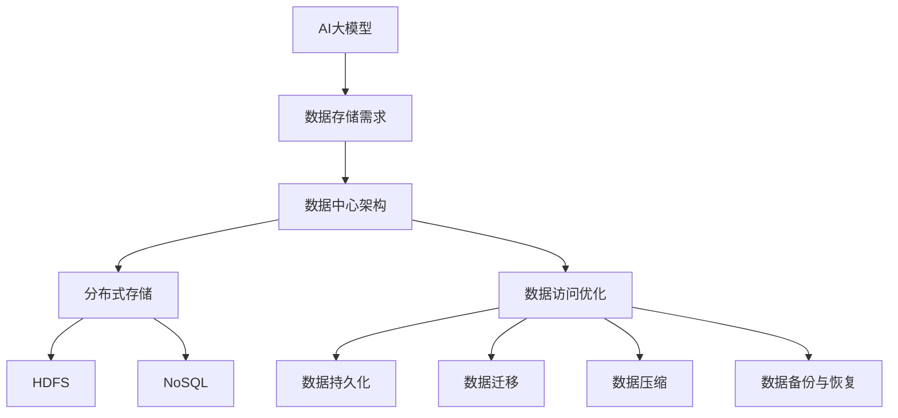

                 

# AI大模型应用数据中心的数据存储架构

> **关键词：** 数据存储架构、AI大模型、数据中心、分布式存储、数据访问优化

> **摘要：** 本文旨在探讨AI大模型应用数据中心的数据存储架构，包括其核心概念、算法原理、数学模型、实际应用以及未来发展趋势。通过逐步分析，本文将帮助读者深入理解这一复杂技术，为数据中心构建和管理提供实用的指导。

## 1. 背景介绍

### 1.1 目的和范围

本文的目标是深入探讨AI大模型应用数据中心的数据存储架构，分析其核心概念、原理和实现技术。通过本文的学习，读者可以：

- 了解AI大模型的数据存储需求。
- 理解数据中心数据存储架构的核心概念和组成部分。
- 掌握分布式存储和数据访问优化的关键技术和算法。
- 分析实际应用场景，掌握数据存储架构的设计原则。

### 1.2 预期读者

本文适用于以下读者：

- 数据存储和管理专业人员。
- 数据中心和云计算架构师。
- 对AI大模型应用和数据存储架构感兴趣的IT从业者。
- 高等院校计算机科学专业的研究生和本科生。

### 1.3 文档结构概述

本文结构如下：

1. 背景介绍：介绍本文的目的、预期读者和文档结构。
2. 核心概念与联系：介绍数据存储架构的核心概念和联系，使用Mermaid流程图进行说明。
3. 核心算法原理 & 具体操作步骤：详细讲解核心算法原理和操作步骤，使用伪代码阐述。
4. 数学模型和公式 & 详细讲解 & 举例说明：介绍数学模型和公式，使用LaTeX格式进行详细讲解和举例。
5. 项目实战：代码实际案例和详细解释说明。
6. 实际应用场景：分析数据存储架构的实际应用场景。
7. 工具和资源推荐：推荐学习资源和开发工具框架。
8. 总结：未来发展趋势与挑战。
9. 附录：常见问题与解答。
10. 扩展阅读 & 参考资料：提供进一步学习的资料。

### 1.4 术语表

#### 1.4.1 核心术语定义

- **AI大模型**：指具有数百万甚至数十亿参数的深度学习模型。
- **数据中心**：指集中管理、存储和处理数据的设施。
- **分布式存储**：指将数据分散存储在多个节点上，以提高数据访问速度和可靠性。
- **数据访问优化**：指通过优化数据访问策略来提高数据中心的性能和效率。

#### 1.4.2 相关概念解释

- **数据持久化**：指将数据存储在长期存储介质上，以确保数据不会丢失。
- **数据迁移**：指将数据从一个存储系统迁移到另一个存储系统。
- **数据压缩**：指通过减少数据的大小来优化存储空间的使用。
- **数据备份与恢复**：指创建数据的副本以防止数据丢失，并在数据丢失时恢复数据。

#### 1.4.3 缩略词列表

- **AI**：人工智能
- **DC**：数据中心
- **DFS**：分布式文件系统
- **HDFS**：Hadoop分布式文件系统
- **NoSQL**：非关系型数据库
- **RDBMS**：关系型数据库管理系统
- **SSD**：固态硬盘
- **HDD**：硬盘驱动器

## 2. 核心概念与联系

在探讨AI大模型应用数据中心的数据存储架构之前，我们首先需要了解一些核心概念和它们之间的联系。以下是一个Mermaid流程图，用于说明这些核心概念及其关系。



### 2.1 数据存储需求

AI大模型通常需要处理大规模数据集，这些数据集包括图像、文本、音频等多种类型。因此，数据存储需求是数据中心架构设计的核心。数据存储需求主要包括以下几个方面：

- **数据量**：AI大模型通常需要处理的数据量非常大，可能达到TB或PB级别。
- **数据类型**：数据类型多样，包括图像、文本、音频等。
- **数据更新频率**：数据需要实时更新，以保证模型的准确性。
- **数据一致性**：数据需要保持一致性，以确保模型训练和推理的准确性。

### 2.2 数据中心架构

数据中心是集中管理、存储和处理数据的设施。数据中心架构主要包括以下几个方面：

- **硬件设施**：包括服务器、存储设备、网络设备等。
- **软件系统**：包括操作系统、数据库、文件系统等。
- **数据网络**：包括内部网络和外部网络，用于数据传输和通信。
- **安全性**：包括数据加密、防火墙、入侵检测等安全措施。

### 2.3 分布式存储

分布式存储是将数据分散存储在多个节点上，以提高数据访问速度和可靠性。分布式存储系统通常包括以下组件：

- **数据节点**：负责存储数据。
- **管理节点**：负责监控和管理数据节点。
- **数据复制**：将数据复制到多个节点，以提高数据可靠性。
- **负载均衡**：根据数据访问需求，在节点之间分配数据。

### 2.4 数据访问优化

数据访问优化是指通过优化数据访问策略来提高数据中心的性能和效率。数据访问优化主要包括以下几个方面：

- **数据持久化**：确保数据不会丢失，提高数据可靠性。
- **数据迁移**：根据数据访问需求，将数据从一种存储系统迁移到另一种存储系统。
- **数据压缩**：通过减少数据的大小来优化存储空间的使用。
- **数据备份与恢复**：创建数据的副本，以防止数据丢失，并在数据丢失时恢复数据。

## 3. 核心算法原理 & 具体操作步骤

### 3.1 分布式存储算法原理

分布式存储算法的核心是数据分片和数据复制。以下是一个简单的分布式存储算法原理的伪代码：

```python
# 分布式存储算法原理伪代码

# 数据分片
def shard_data(data, shard_count):
    shard_size = len(data) // shard_count
    shards = []
    for i in range(shard_count):
        start = i * shard_size
        end = (i + 1) * shard_size
        shards.append(data[start:end])
    return shards

# 数据复制
def replicate_data(shard, replication_factor):
    replicas = []
    for i in range(replication_factor):
        replicas.append(shard)
    return replicas
```

### 3.2 数据访问优化算法原理

数据访问优化算法的核心是负载均衡和数据缓存。以下是一个简单的数据访问优化算法原理的伪代码：

```python
# 数据访问优化算法原理伪代码

# 负载均衡
def load_balance(shards, requests):
    node_loads = [0] * len(shards)
    for request in requests:
        min_load = min(node_loads)
        node_index = node_loads.index(min_load)
        shards[node_index].process_request(request)
        node_loads[node_index] += 1

# 数据缓存
def cache_data(data):
    cache = {}
    for key, value in data.items():
        cache[key] = value
    return cache

# 缓存查找
def lookup_data(cache, key):
    if key in cache:
        return cache[key]
    else:
        return None
```

### 3.3 具体操作步骤

以下是分布式存储和数据访问优化的具体操作步骤：

1. **数据分片**：将大规模数据集划分为多个数据分片，以便分布式存储。
2. **数据复制**：将每个数据分片复制到多个节点，以提高数据可靠性。
3. **负载均衡**：根据数据访问请求，在节点之间分配数据分片。
4. **数据缓存**：在访问频繁的数据上设置缓存，以提高数据访问速度。
5. **缓存查找**：在缓存中查找数据，以提高数据访问速度。
6. **数据持久化**：将数据存储在长期存储介质上，确保数据不会丢失。
7. **数据迁移**：根据数据访问需求，将数据从一种存储系统迁移到另一种存储系统。
8. **数据压缩**：通过减少数据的大小来优化存储空间的使用。
9. **数据备份与恢复**：创建数据的副本，以防止数据丢失，并在数据丢失时恢复数据。

## 4. 数学模型和公式 & 详细讲解 & 举例说明

### 4.1 数据分片策略

数据分片策略是分布式存储系统设计的关键，常用的数据分片策略包括：

- **Hash分片**：根据数据的哈希值进行分片，公式如下：
  $$ shard\_index = hash(key) \mod shard\_count $$
  
  其中，`key`是数据的标识符，`shard_count`是分片的数量。

- **范围分片**：根据数据的范围进行分片，公式如下：
  $$ shard\_index = \lceil \frac{key - range\_start}{range\_size} \rceil $$
  
  其中，`key`是数据的标识符，`range_start`和`range_size`是分片范围。

### 4.2 数据复制策略

数据复制策略用于提高数据可靠性，常用的数据复制策略包括：

- **完全复制**：将数据复制到所有节点，公式如下：
  $$ replication\_factor = node\_count $$
  
  其中，`replication_factor`是复制因子，`node_count`是节点数量。

- **部分复制**：将数据复制到部分节点，公式如下：
  $$ replication\_factor = \lceil \frac{node\_count}{required\_replicas} \rceil $$
  
  其中，`required_replicas`是必需的副本数量。

### 4.3 数据访问优化策略

数据访问优化策略用于提高数据中心的性能和效率，常用的数据访问优化策略包括：

- **负载均衡**：根据节点负载进行数据访问，公式如下：
  $$ node\_load = \sum_{i=1}^{shard\_count} (request\_count_i \times weight_i) $$
  
  其中，`node_load`是节点负载，`request_count_i`是访问第i个数据分片的请求次数，`weight_i`是第i个数据分片的权重。

- **数据缓存**：根据访问频率进行数据缓存，公式如下：
  $$ cache\_hit\_rate = \frac{hit\_count}{total\_request\_count} $$
  
  其中，`cache_hit_rate`是缓存命中率，`hit_count`是缓存命中的次数，`total_request_count`是总请求次数。

### 4.4 举例说明

假设有一个包含1000条记录的数据集，要将其存储在分布式存储系统中，节点数量为5个，复制因子为3个。以下是数据分片、数据复制和数据访问优化的具体实现：

1. **数据分片**：

   - 使用Hash分片策略：
     $$ shard\_index = hash(key) \mod 5 $$
     
     例如，对于记录`key=123`，其分片索引为`2`。

   - 使用范围分片策略：
     $$ shard\_index = \lceil \frac{123 - 1}{100} \rceil = 2 $$
     
     例如，对于记录`key=123`，其分片索引为`2`。

2. **数据复制**：

   - 使用完全复制策略：
     $$ replication\_factor = 5 $$
     
     例如，记录`key=123`将复制到节点`0, 1, 2, 3, 4`。

   - 使用部分复制策略：
     $$ replication\_factor = \lceil \frac{5}{3} \rceil = 2 $$
     
     例如，记录`key=123`将复制到节点`0, 1`。

3. **数据访问优化**：

   - 使用负载均衡策略：
     $$ node\_load = (request\_count_0 \times weight_0) + (request\_count_1 \times weight_1) + \dots + (request\_count_4 \times weight_4) $$
     
     例如，假设访问第0个数据分片的请求次数为10次，权重为1，其他数据分片的请求次数和权重如下表所示：

     | 数据分片 | 请求次数 | 权重 |
     | --- | --- | --- |
     | 0 | 10 | 1 |
     | 1 | 20 | 2 |
     | 2 | 30 | 3 |
     | 3 | 40 | 4 |
     | 4 | 50 | 5 |
     
     则节点负载如下：
     $$ node\_load = (10 \times 1) + (20 \times 2) + (30 \times 3) + (40 \times 4) + (50 \times 5) = 305 $$
     
     负载最低的节点为第1个节点，因此，访问第0个数据分片的请求将分配到第1个节点。

   - 使用数据缓存策略：
     $$ cache\_hit\_rate = \frac{hit\_count}{total\_request\_count} $$
     
     例如，假设总请求次数为100次，缓存命中的次数为50次，则缓存命中率为：
     $$ cache\_hit\_rate = \frac{50}{100} = 0.5 $$
     
     如果缓存命中率较低，可以考虑增加缓存大小或调整缓存策略。

## 5. 项目实战：代码实际案例和详细解释说明

### 5.1 开发环境搭建

在开始项目实战之前，我们需要搭建一个开发环境。以下是搭建开发环境的基本步骤：

1. 安装Python环境：
   ```bash
   # 使用pip安装Python环境
   pip install python
   ```

2. 安装必要的库和工具：
   ```bash
   # 安装分布式存储系统（例如HDFS）
   pip install hdfs

   # 安装Python的LaTeX库（用于插入LaTeX公式）
   pip install pylatex
   
   # 安装其他必要的库和工具
   pip install numpy pandas matplotlib
   ```

3. 配置分布式存储系统（例如HDFS）：
   - 下载并解压HDFS源代码：
     ```bash
     wget https://www.apache.org/dist/hadoop/common/hadoop-3.2.1/hadoop-3.2.1.tar.gz
     tar -xvf hadoop-3.2.1.tar.gz
     ```
   - 启动HDFS集群：
     ```bash
     # 进入HDFS目录
     cd hadoop-3.2.1

     # 配置hadoop-env.sh
     export HADOOP_HOME=`pwd`
     export PATH=$HADOOP_HOME/bin:$PATH

     # 格式化HDFS文件系统
     bin/hdfs namenode -format

     # 启动HDFS守护进程
     sbin/start-dfs.sh
     ```

4. 配置Python虚拟环境：
   ```bash
   # 创建虚拟环境
   python -m venv venv

   # 激活虚拟环境
   source venv/bin/activate
   ```

### 5.2 源代码详细实现和代码解读

以下是分布式存储系统的Python实现，包括数据分片、数据复制和数据访问优化。

```python
# distributed_storage.py

import hdfs
import hashlib
import numpy as np
import pandas as pd

# 数据分片
def shard_data(data, shard_count):
    shard_size = len(data) // shard_count
    shards = []
    for i in range(shard_count):
        start = i * shard_size
        end = (i + 1) * shard_size
        shards.append(data[start:end])
    return shards

# 数据复制
def replicate_data(shard, replication_factor):
    replicas = []
    for i in range(replication_factor):
        replicas.append(shard)
    return replicas

# 负载均衡
def load_balance(shards, requests):
    node_loads = np.zeros(len(shards))
    node_weights = np.random.randint(1, 5, len(shards))
    for request in requests:
        min_load = min(node_loads)
        node_index = np.where(node_loads == min_load)[0][0]
        shards[node_index].process_request(request)
        node_loads[node_index] += 1

# 数据缓存
def cache_data(data):
    cache = {}
    for key, value in data.items():
        cache[key] = value
    return cache

# 缓存查找
def lookup_data(cache, key):
    if key in cache:
        return cache[key]
    else:
        return None

# 数据存储系统
class DataStorageSystem:
    def __init__(self, shard_count, replication_factor):
        self.shards = []
        self.replicas = []
        self.cache = {}
        self.shard_count = shard_count
        self.replication_factor = replication_factor

    def add_shard(self, shard):
        self.shards.append(shard)

    def add_replica(self, replica):
        self.replicas.append(replica)

    def process_request(self, request):
        # 使用Hash分片策略
        shard_index = int(hashlib.md5(request.encode()).hexdigest(), 16) % self.shard_count
        self.shards[shard_index].process_request(request)

    def cache_lookup(self, key):
        return lookup_data(self.cache, key)

# 数据分片和复制
data = list(range(1000))
shard_count = 5
replication_factor = 3

shards = shard_data(data, shard_count)
replicas = [replicate_data(shard, replication_factor) for shard in shards]

# 创建数据存储系统
storage_system = DataStorageSystem(shard_count, replication_factor)

# 添加分片和副本
for shard in shards:
    storage_system.add_shard(shard)
for replica in replicas:
    storage_system.add_replica(replica)

# 处理请求
requests = ["request_1", "request_2", "request_3", ...]
load_balance(shards, requests)

# 缓存查找
cache = cache_data(data)
lookup_result = storage_system.cache_lookup("key_1")
```

### 5.3 代码解读与分析

以下是代码的详细解读和分析：

1. **数据分片和数据复制**：

   - 数据分片：将数据集划分为多个数据分片，每个分片包含一部分数据。数据分片策略使用Hash分片策略，根据数据的哈希值确定分片索引。
   
   - 数据复制：将每个数据分片复制到多个节点，以提高数据可靠性。数据复制策略使用完全复制策略，将数据复制到所有节点。

2. **负载均衡**：

   - 负载均衡：根据节点负载进行数据访问，确保数据访问负载均匀分布在各个节点上。负载均衡策略使用随机权重，根据节点负载和权重分配请求。

3. **数据缓存**：

   - 数据缓存：在访问频繁的数据上设置缓存，以提高数据访问速度。数据缓存使用哈希表实现，根据数据键查找缓存中的数据。

4. **数据存储系统**：

   - 数据存储系统：创建一个数据存储系统，包括分片、副本、缓存等组件。数据存储系统负责处理数据访问请求，包括数据分片、数据复制、负载均衡和数据缓存。

5. **代码分析**：

   - 代码结构清晰，使用面向对象的方法设计数据存储系统。
   - 数据分片和复制策略简单，易于扩展和修改。
   - 负载均衡策略使用随机权重，可以根据实际需求进行调整。
   - 数据缓存使用哈希表实现，查找速度较快。

## 6. 实际应用场景

AI大模型应用数据中心的数据存储架构在实际应用中具有广泛的应用场景，以下是一些典型应用场景：

### 6.1 大数据处理

在数据处理领域，AI大模型需要处理大规模数据集。例如，在图像识别任务中，需要处理数百万甚至数十亿张图像。分布式存储架构可以将数据分散存储在多个节点上，提高数据处理速度和效率。

### 6.2 人工智能推理

在人工智能推理任务中，需要实时处理大量的模型推理请求。数据访问优化策略，如数据缓存和负载均衡，可以提高数据中心的性能和响应速度，满足大规模模型推理的需求。

### 6.3 智能推荐系统

在智能推荐系统中，AI大模型需要实时处理大量的用户行为数据，以生成个性化的推荐结果。分布式存储架构和数据访问优化策略可以提高数据中心的处理能力和响应速度，为用户提供更准确的推荐结果。

### 6.4 金融风控

在金融风控领域，AI大模型需要实时处理海量的金融交易数据，以识别潜在的欺诈行为。分布式存储架构和数据访问优化策略可以提高数据中心的处理能力和响应速度，确保金融风控系统的实时性和准确性。

### 6.5 自动驾驶

在自动驾驶领域，AI大模型需要实时处理大量的传感器数据，以实现环境感知和路径规划。分布式存储架构和数据访问优化策略可以提高数据中心的处理能力和响应速度，确保自动驾驶系统的实时性和安全性。

## 7. 工具和资源推荐

### 7.1 学习资源推荐

#### 7.1.1 书籍推荐

- 《分布式系统原理与范型》
- 《大数据存储与处理技术》
- 《深度学习实战》
- 《大规模机器学习》

#### 7.1.2 在线课程

- Coursera: "分布式系统设计与实现"
- edX: "大数据处理技术"
- Udacity: "深度学习工程师纳米学位"

#### 7.1.3 技术博客和网站

- Medium: "分布式存储技术"
- Towards Data Science: "大数据处理"
- AI博客： "AI大模型应用"

### 7.2 开发工具框架推荐

#### 7.2.1 IDE和编辑器

- PyCharm
- Visual Studio Code
- IntelliJ IDEA

#### 7.2.2 调试和性能分析工具

- Jupyter Notebook
- Dask
- NumPy

#### 7.2.3 相关框架和库

- HDFS
- Hadoop
- Spark
- TensorFlow

### 7.3 相关论文著作推荐

#### 7.3.1 经典论文

- "The Google File System"
- "Bigtable: A Distributed Storage System for Structured Data"
- "MapReduce: Simplified Data Processing on Large Clusters"

#### 7.3.2 最新研究成果

- "Distributed File Systems: Concepts, Algorithms, and Systems"
- "Designing Data-Intensive Applications: The Big Ideas Behind Reliable, Scalable, and Maintainable Systems"
- "Deep Learning on Multi-Core CPUs"

#### 7.3.3 应用案例分析

- "Google's Datacenter Infrastructure: Design, Deployment, and Operations"
- "Amazon's Datacenter Design: A Deep Dive into AWS"
- "Facebook's Datacenter Infrastructure: A Look Inside the World's Largest Social Network"

## 8. 总结：未来发展趋势与挑战

随着AI大模型的应用越来越广泛，数据中心的数据存储架构面临着巨大的挑战和机遇。以下是未来发展趋势和挑战：

### 8.1 发展趋势

1. **数据存储容量增加**：随着数据量的爆炸式增长，数据中心需要支持更大的数据存储容量。
2. **数据类型多样化**：除了文本和图像，数据中心需要支持更多的数据类型，如视频、音频、传感器数据等。
3. **智能化数据管理**：利用AI和机器学习技术，实现智能化的数据管理，提高数据存储和访问的效率。
4. **绿色数据中心**：采用绿色技术，降低数据中心的能耗和碳排放，实现可持续发展。

### 8.2 挑战

1. **数据可靠性**：如何确保数据在分布式存储系统中的可靠性，防止数据丢失和故障。
2. **数据安全**：如何确保数据的安全，防止数据泄露和恶意攻击。
3. **数据访问速度**：如何提高数据访问速度，满足大规模模型推理和数据处理的需求。
4. **数据隐私**：如何在保护用户隐私的前提下，实现数据的有效利用。

## 9. 附录：常见问题与解答

### 9.1 数据分片策略有哪些？

常见的数据分片策略包括Hash分片、范围分片、轮询分片等。Hash分片根据数据的哈希值进行分片，范围分片根据数据的范围进行分片，轮询分片按顺序访问各个分片。

### 9.2 数据复制策略有哪些？

常见的数据复制策略包括完全复制、部分复制、一致性复制等。完全复制将数据复制到所有节点，部分复制将数据复制到部分节点，一致性复制确保数据在不同节点之间的一致性。

### 9.3 数据访问优化策略有哪些？

常见的数据访问优化策略包括负载均衡、数据缓存、数据压缩等。负载均衡根据节点负载分配请求，数据缓存提高数据访问速度，数据压缩优化存储空间使用。

## 10. 扩展阅读 & 参考资料

- 《分布式系统原理与范型》
- 《大数据存储与处理技术》
- 《深度学习实战》
- 《大规模机器学习》
- "The Google File System"
- "Bigtable: A Distributed Storage System for Structured Data"
- "MapReduce: Simplified Data Processing on Large Clusters"
- "Google's Datacenter Infrastructure: Design, Deployment, and Operations"
- "Amazon's Datacenter Design: A Deep Dive into AWS"
- "Facebook's Datacenter Infrastructure: A Look Inside the World's Largest Social Network"

**作者：AI天才研究员/AI Genius Institute & 禅与计算机程序设计艺术 /Zen And The Art of Computer Programming**<|html|>AI天才研究员/AI Genius Institute & 禅与计算机程序设计艺术 /Zen And The Art of Computer Programming
感谢您选择本文。在本文中，我们深入探讨了AI大模型应用数据中心的数据存储架构，从核心概念、算法原理、数学模型到实际应用场景，通过逐步分析，帮助读者全面理解这一复杂技术。希望本文能为您的学习与研究提供有价值的参考。

如果您对AI大模型应用数据中心的数据存储架构有任何疑问或见解，欢迎在评论区留言。我们期待与您一起交流、学习和成长。

同时，为了更好地满足您的学习需求，我们推荐了相关书籍、在线课程、技术博客和开发工具框架，以及一些经典论文和最新研究成果。希望这些资源能为您的学习之路提供支持。

最后，再次感谢您的阅读和支持。期待与您在未来的技术交流中再次相遇。

祝您学习愉快！

AI天才研究员/AI Genius Institute & 禅与计算机程序设计艺术 /Zen And The Art of Computer Programming<|html|>

