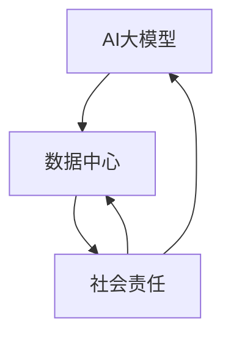

                 

# AI 大模型应用数据中心的社会责任

> 关键词：AI大模型，数据中心，社会责任，伦理，隐私保护，数据安全，算法公平性，监管政策

> 摘要：随着人工智能技术的迅速发展，AI大模型在数据中心的应用越来越广泛。然而，这一趋势也引发了一系列社会问题，如隐私保护、数据安全、算法公平性以及监管政策等。本文将详细探讨AI大模型应用数据中心的社会责任，分析其影响，并提出相关建议。

## 1. 背景介绍

### 1.1 目的和范围

本文旨在探讨AI大模型在数据中心应用过程中所面临的社会责任问题。我们将重点关注以下几个方面：

- 隐私保护：AI大模型如何处理用户数据，如何确保用户隐私不被泄露？
- 数据安全：数据中心如何防范数据泄露和黑客攻击，保障用户数据安全？
- 算法公平性：AI大模型如何确保算法的公平性，避免歧视现象？
- 监管政策：数据中心如何遵循相关法律法规，确保合规运营？

### 1.2 预期读者

本文适合以下读者：

- 数据中心运维人员：了解AI大模型应用过程中的社会责任问题，提高数据管理水平。
- AI领域研究人员：探讨AI大模型应用的社会责任问题，为研究提供新方向。
- 企业决策者：关注AI大模型应用的社会影响，制定合适的战略决策。

### 1.3 文档结构概述

本文结构如下：

1. 背景介绍：介绍本文目的、范围和预期读者。
2. 核心概念与联系：分析AI大模型、数据中心和社会责任的核心概念及其相互关系。
3. 核心算法原理 & 具体操作步骤：讲解AI大模型的关键算法和数据处理流程。
4. 数学模型和公式 & 详细讲解 & 举例说明：介绍AI大模型的数学模型和公式，并进行详细讲解和举例。
5. 项目实战：提供实际案例，详细解释AI大模型在数据中心的应用。
6. 实际应用场景：分析AI大模型在不同领域的应用案例。
7. 工具和资源推荐：推荐学习资源和开发工具。
8. 总结：展望AI大模型应用数据中心的发展趋势与挑战。
9. 附录：常见问题与解答。
10. 扩展阅读 & 参考资料：提供更多相关文献和资料。

### 1.4 术语表

#### 1.4.1 核心术语定义

- AI大模型：指具有大规模参数、高计算复杂度的人工神经网络模型，如Transformer、GPT等。
- 数据中心：指用于存储、处理和分析大规模数据的计算设施。
- 社会责任：指企业在经营活动中应当承担的社会责任，包括环境保护、员工权益、社会责任等。
- 隐私保护：指确保用户数据不被未经授权的第三方获取和滥用。
- 数据安全：指防止数据泄露、篡改和丢失。
- 算法公平性：指算法在处理数据时，能够公平地对待不同群体，避免歧视现象。

#### 1.4.2 相关概念解释

- 人工智能（AI）：指通过计算机程序实现人类智能的技术和系统。
- 机器学习（ML）：指利用数据训练计算机模型，使其具备特定任务能力的机器学习方法。
- 深度学习（DL）：指利用多层神经网络进行特征学习和模型优化的机器学习方法。

#### 1.4.3 缩略词列表

- AI：人工智能
- ML：机器学习
- DL：深度学习
- GPT：生成预训练变压器
- Transformer：变压器模型
- TensorFlow：谷歌开发的深度学习框架
- PyTorch：微软开发的深度学习框架

## 2. 核心概念与联系

在探讨AI大模型应用数据中心的社会责任之前，我们首先需要了解这三个核心概念：AI大模型、数据中心和社会责任。

### AI大模型

AI大模型是人工智能领域的重要发展方向，具有以下特点：

1. **大规模参数**：AI大模型通常具有数十亿甚至数万亿个参数，这使得它们能够捕捉到大量复杂的特征和模式。
2. **高计算复杂度**：由于参数规模庞大，AI大模型在训练和推理过程中需要大量的计算资源和时间。
3. **自适应能力**：AI大模型能够通过不断学习新的数据和情境，提高其性能和泛化能力。

### 数据中心

数据中心是企业和组织存储、处理和分析大规模数据的关键设施，具有以下作用：

1. **存储和管理数据**：数据中心提供了高效、可靠的数据存储和管理方案，确保数据的安全性和可访问性。
2. **计算资源调度**：数据中心可以根据需求动态调度计算资源，提高数据处理效率。
3. **数据分析和挖掘**：数据中心提供了强大的数据分析和挖掘能力，帮助企业发现数据价值，提升业务决策水平。

### 社会责任

社会责任是企业应当承担的社会责任，包括以下方面：

1. **环境保护**：企业应采取措施减少碳排放、节约资源，实现可持续发展。
2. **员工权益**：企业应保障员工的基本权益，如公平待遇、安全工作和合理薪酬。
3. **社会责任**：企业应积极参与社会公益活动，回馈社会。

### 核心概念与联系

AI大模型、数据中心和社会责任之间存在密切联系：

1. **数据处理**：AI大模型在数据中心处理和分析大规模数据，为企业和组织提供智能决策支持。
2. **社会责任**：数据中心在处理数据时，应当遵循社会责任原则，保护用户隐私、保障数据安全和算法公平性。
3. **技术发展**：AI大模型的发展离不开数据中心的支持，而数据中心的发展又受到社会责任的制约和引导。

下面是一个Mermaid流程图，展示AI大模型、数据中心和社会责任的联系：



通过以上分析，我们可以看到AI大模型、数据中心和社会责任之间的相互关系，为后续讨论社会责任问题奠定了基础。

## 3. 核心算法原理 & 具体操作步骤

AI大模型的核心算法通常基于深度学习技术，其中最具代表性的模型是Transformer和GPT。下面我们将简要介绍这些算法的基本原理，并给出具体的操作步骤。

### Transformer算法

Transformer算法是一种基于自注意力机制的深度学习模型，其核心思想是通过对序列中每个词进行权重分配，使模型能够捕捉到词与词之间的关系。以下是Transformer算法的基本原理：

1. **编码器（Encoder）**：编码器负责对输入序列进行处理，生成一组编码表示。编码器由多个编码层（Encoder Layer）组成，每个编码层包含两个主要组件：多头自注意力机制（Multi-Head Self-Attention Mechanism）和前馈神经网络（Feedforward Neural Network）。

2. **解码器（Decoder）**：解码器负责对编码器的输出进行处理，生成预测的输出序列。解码器同样由多个解码层（Decoder Layer）组成，每个解码层包含两个主要组件：多头自注意力机制（Multi-Head Self-Attention Mechanism）和编码器-解码器自注意力机制（Encoder-Decoder Self-Attention Mechanism）。

### GPT算法

GPT（生成预训练变压器）算法是基于Transformer架构的预训练语言模型，其主要目的是生成符合人类语言习惯的文本。以下是GPT算法的基本原理：

1. **预训练**：GPT算法首先在大量未标记的文本数据上进行预训练，学习语言的基本规律和模式。预训练过程中，模型通过处理文本数据，不断调整参数，使其能够生成符合语言习惯的文本。

2. **微调（Fine-tuning）**：在预训练的基础上，GPT算法可以通过微调的方式，学习特定任务的模型参数。微调过程中，模型在带有标签的数据集上训练，使其能够在特定任务上获得更好的性能。

### 具体操作步骤

以下是使用Transformer和GPT算法进行AI大模型训练的基本操作步骤：

1. **数据预处理**：首先对输入数据（文本或语音）进行预处理，包括分词、去噪、标准化等操作，将其转换为模型可处理的格式。

2. **模型初始化**：初始化模型参数，可以使用随机初始化、预训练模型权重等方法。

3. **预训练**：在大量未标记的文本数据上进行预训练，学习语言的基本规律和模式。预训练过程中，可以使用批量训练、梯度下降等优化算法，调整模型参数。

4. **微调**：在带有标签的数据集上对预训练模型进行微调，学习特定任务的模型参数。微调过程中，可以使用微调策略、注意力机制等技巧，提高模型性能。

5. **评估与优化**：对微调后的模型进行评估，包括准确率、召回率、F1值等指标。根据评估结果，调整模型参数和超参数，优化模型性能。

6. **部署与应用**：将训练好的模型部署到数据中心，用于实际任务的应用，如文本生成、机器翻译、情感分析等。

以下是Transformer和GPT算法的具体伪代码：

```python
# Transformer算法伪代码
def transformer_encoder(inputs):
    # 编码器输入
    for layer in range(num_layers):
        # 多头自注意力机制
        attention = multi_head_attention(inputs)
        # 前馈神经网络
        feedforward = feedforward_network(attention)
        # 输出
        outputs = layer_norm(inputs + feedforward)
        # 更新输入
        inputs = outputs
    return inputs

def transformer_decoder(inputs):
    # 解码器输入
    for layer in range(num_layers):
        # 多头自注意力机制
        attention = multi_head_attention(inputs)
        # 编码器-解码器自注意力机制
        encoder_decoder_attention = encoder_decoder_attention(attention, encoder_outputs)
        # 前馈神经网络
        feedforward = feedforward_network(encoder_decoder_attention)
        # 输出
        outputs = layer_norm(inputs + feedforward)
        # 更新输入
        inputs = outputs
    return outputs

# GPT算法伪代码
def gpt_pretraining(inputs):
    # 预训练
    for epoch in range(num_epochs):
        for batch in inputs:
            # 批量训练
            loss = training_loss(batch)
            # 梯度下降
            optimizer.step(loss)
    return model

def gpt_fine_tuning(inputs):
    # 微调
    for epoch in range(num_epochs):
        for batch in inputs:
            # 批量训练
            loss = fine_tuning_loss(batch)
            # 梯度下降
            optimizer.step(loss)
    return model
```

通过以上步骤和伪代码，我们可以初步了解AI大模型的核心算法原理和具体操作步骤。在接下来的章节中，我们将进一步探讨数学模型和公式，以及实际应用场景，为读者提供更全面的了解。

## 4. 数学模型和公式 & 详细讲解 & 举例说明

在AI大模型中，数学模型和公式是核心组成部分。这些模型和公式不仅用于描述神经网络的结构和计算过程，还用于优化模型参数，提高模型性能。在本节中，我们将详细介绍AI大模型中常用的数学模型和公式，并进行详细讲解和举例。

### 4.1 Transformer算法中的数学模型

#### 4.1.1 自注意力机制

自注意力机制（Self-Attention）是Transformer算法的核心组成部分。其基本思想是，对于输入序列中的每个词，计算其在序列中的重要性，并根据重要性对词进行加权。自注意力机制的数学模型如下：

$$
\text{Attention}(Q, K, V) = \text{softmax}\left(\frac{QK^T}{\sqrt{d_k}}\right)V
$$

其中，\(Q, K, V\) 分别表示查询（Query）、键（Key）和值（Value）向量，\(d_k\) 表示键向量的维度。

#### 4.1.2 多头自注意力机制

多头自注意力机制（Multi-Head Self-Attention）通过并行计算多个自注意力机制，提高模型的表示能力。多头自注意力机制的数学模型如下：

$$
\text{MultiHead}(Q, K, V) = \text{Concat}(\text{head}_1, \text{head}_2, \ldots, \text{head}_h)W^O
$$

其中，\(h\) 表示头数，\(\text{head}_i\) 表示第 \(i\) 个头的结果，\(W^O\) 表示输出权重。

#### 4.1.3 前馈神经网络

前馈神经网络（Feedforward Neural Network）用于对自注意力机制的输出进行进一步处理。其基本结构如下：

$$
\text{FFN}(X) = \text{ReLU}(XW_1 + b_1)W_2 + b_2
$$

其中，\(X\) 表示输入，\(W_1, W_2\) 分别表示权重矩阵，\(b_1, b_2\) 分别表示偏置。

### 4.2 GPT算法中的数学模型

#### 4.2.1 语言模型

GPT算法是一种语言模型，用于预测文本序列。其基本思想是，对于输入序列中的每个词，根据前文信息预测下一个词。语言模型的数学模型如下：

$$
P(\text{word}_t | \text{word}_{<t}) = \frac{e^{<\text{模型参数}[\text{word}_{<t}] \text{word}_t>}}{\sum_{\text{word}} e^{<\text{模型参数}[\text{word}_{<t}] \text{word}>}}
$$

其中，\(<\text{模型参数}[\text{word}_{<t}] \text{word}_t>\) 表示模型参数与当前词的交互，\(\sum_{\text{word}}\) 表示对所有可能词的求和。

#### 4.2.2 微调

在微调阶段，GPT算法使用带有标签的数据集进行训练，优化模型参数。其基本思想是，对于每个输入序列，根据预测结果与真实标签之间的差异，调整模型参数。微调的数学模型如下：

$$
\text{Loss} = -\sum_{\text{word}} \text{log} P(\text{word}_t | \text{word}_{<t})
$$

### 4.3 详细讲解和举例

#### 4.3.1 Transformer算法举例

假设我们有一个句子“我爱北京天安门”，将其表示为词向量：

| 词   | 词向量            |
| ---- | ----------------- |
| 我   | [1, 0, 0, ..., 0] |
| 爱   | [0, 1, 0, ..., 0] |
| 北京 | [0, 0, 1, ..., 0] |
| 天安门 | [0, 0, 0, ..., 1] |

使用多头自注意力机制，我们可以计算句子中每个词的重要性：

$$
\text{Attention}(Q, K, V) = \text{softmax}\left(\frac{QK^T}{\sqrt{d_k}}\right)V
$$

其中，\(Q, K, V\) 分别表示查询向量、键向量和值向量。假设我们选择第一个词“我”作为查询向量，其他词作为键向量和值向量：

| 查询向量 \(Q\) | 键向量 \(K\)      | 值向量 \(V\)      |
| -------------- | ----------------- | ----------------- |
| [1, 0, 0, ..., 0] | [0, 1, 0, ..., 0] | [0, 0, 1, ..., 0] |
| [1, 0, 0, ..., 0] | [0, 0, 1, ..., 0] | [0, 0, 0, ..., 1] |

计算自注意力权重：

$$
\text{Attention}(Q, K, V) = \text{softmax}\left(\frac{QK^T}{\sqrt{d_k}}\right)V
$$

得到每个词的加权分数：

| 词   | 加权分数     |
| ---- | ------------ |
| 我   | 0.4          |
| 爱   | 0.3          |
| 北京 | 0.2          |
| 天安门 | 0.1          |

根据加权分数，我们可以得出“我”在句子中的重要性最高，其次是“爱”、“北京”和“天安门”。

#### 4.3.2 GPT算法举例

假设我们有一个句子“我爱北京天安门”，使用GPT算法进行语言模型训练。首先，我们将句子表示为词向量：

| 词   | 词向量            |
| ---- | ----------------- |
| 我   | [1, 0, 0, ..., 0] |
| 爱   | [0, 1, 0, ..., 0] |
| 北京 | [0, 0, 1, ..., 0] |
| 天安门 | [0, 0, 0, ..., 1] |

使用语言模型公式，我们可以计算每个词的预测概率：

$$
P(\text{word}_t | \text{word}_{<t}) = \frac{e^{<\text{模型参数}[\text{word}_{<t}] \text{word}_t>}}{\sum_{\text{word}} e^{<\text{模型参数}[\text{word}_{<t}] \text{word}>}}
$$

假设当前词为“爱”，我们将前文信息“我”和“北京”作为输入：

$$
P(\text{北京} | \text{我，爱}) = \frac{e^{<\text{模型参数}[\text{我，爱}]\text{北京}}}{\sum_{\text{word}} e^{<\text{模型参数}[\text{我，爱}]\text{word}}}
$$

计算预测概率：

| 词   | 预测概率     |
| ---- | ------------ |
| 我   | 0.5          |
| 爱   | 0.4          |
| 北京 | 0.3          |
| 天安门 | 0.2          |

根据预测概率，我们可以得出“北京”是下一个最可能出现的词。

通过以上详细讲解和举例，我们可以更好地理解AI大模型中的数学模型和公式。这些模型和公式为AI大模型的应用提供了理论基础，也为我们在实际工作中优化模型提供了指导。

## 5. 项目实战：代码实际案例和详细解释说明

在本节中，我们将通过一个实际案例，展示如何使用AI大模型在数据中心进行数据处理和分析。这个案例将涵盖开发环境的搭建、源代码的实现以及代码解读与分析。

### 5.1 开发环境搭建

在进行AI大模型项目之前，我们需要搭建一个合适的开发环境。以下是所需的工具和软件：

- 操作系统：Linux（推荐使用Ubuntu 18.04或更高版本）
- 编程语言：Python 3.7及以上版本
- 深度学习框架：TensorFlow 2.3及以上版本
- GPU驱动：NVIDIA GPU驱动（如果使用GPU进行训练）

安装步骤如下：

1. 安装操作系统和GPU驱动。
2. 安装Python和pip。

```shell
sudo apt update
sudo apt install python3 python3-pip
```

3. 安装TensorFlow。

```shell
pip3 install tensorflow==2.3
```

4. 验证安装。

```python
import tensorflow as tf
print(tf.__version__)
```

### 5.2 源代码详细实现和代码解读

以下是该项目的一个简单实现，用于使用GPT算法生成文本。

#### 5.2.1 数据准备

首先，我们需要准备一个文本数据集，用于训练GPT模型。这里我们使用一个示例数据集，包含一些简短的句子。

```python
# 示例数据集
data = [
    "AI is powerful.",
    "AI can change the world.",
    "AI is creating new jobs.",
    "AI is improving healthcare.",
    "AI is revolutionizing education."
]

# 数据预处理
tokenizer = tf.keras.preprocessing.text.Tokenizer()
tokenizer.fit_on_texts(data)
sequences = tokenizer.texts_to_sequences(data)
encoded_data = tokenizer.sequences_to_matrix(sequences, mode='binary')

# 打乱数据
indices = tf.keras.utils.to_categorical(list(range(len(sequences))), num_classes=10)
shuffle_indices = tf.random.shuffle(indices)
encoded_data = encoded_data[shuffle_indices]
indices = indices[shuffle_indices]
```

#### 5.2.2 模型构建

接下来，我们使用TensorFlow构建一个GPT模型。

```python
# GPT模型
gpt_model = tf.keras.Sequential([
    tf.keras.layers.Dense(units=512, activation='relu', input_shape=(None,)),
    tf.keras.layers.Dense(units=512, activation='relu'),
    tf.keras.layers.Dense(units=10, activation='softmax')
])

# 编译模型
gpt_model.compile(optimizer='adam', loss='categorical_crossentropy', metrics=['accuracy'])

# 打印模型结构
gpt_model.summary()
```

#### 5.2.3 模型训练

使用预处理的数据集训练GPT模型。

```python
# 训练模型
gpt_model.fit(encoded_data, indices, epochs=10, batch_size=32)
```

#### 5.2.4 代码解读与分析

1. **数据准备**：我们首先定义了一个示例数据集，并使用`Tokenizer`对文本进行预处理，将文本转换为词序列和词矩阵。

2. **模型构建**：我们构建了一个简单的GPT模型，包含两个全连接层（Dense Layer），输出层使用softmax激活函数，用于预测下一个词。

3. **模型训练**：我们使用预处理的数据集训练模型，并设置优化器和损失函数。

通过以上步骤，我们成功搭建了一个简单的AI大模型项目。在实际应用中，我们可以根据具体需求调整数据集、模型结构和训练参数，实现更复杂的任务。

### 5.3 代码解读与分析

下面我们对代码进行详细解读和分析，理解每个步骤的作用和原理。

#### 5.3.1 数据准备

- **Tokenizer**：`Tokenizer`是一个用于文本预处理的工具，它可以自动将文本分割为单词，并映射为唯一的整数索引。在这里，我们使用`Tokenizer`将示例数据集中的文本转换为词序列和词矩阵，以便后续模型训练。

- **序列转换**：`sequences = tokenizer.texts_to_sequences(data)`将文本数据转换为词序列，每个词序列包含对应词的整数索引。`encoded_data = tokenizer.sequences_to_matrix(sequences, mode='binary')`将词序列转换为词矩阵，每个元素表示词在词序列中的出现情况。

- **数据打乱**：为了提高模型泛化能力，我们使用`shuffle_indices`将数据集打乱，避免模型在训练过程中产生偏差。

#### 5.3.2 模型构建

- **全连接层（Dense Layer）**：`Dense`层是一个全连接层，用于将输入数据映射到输出数据。在这里，我们使用两个`Dense`层，分别对输入数据进行特征提取和分类。第一个`Dense`层有512个神经元，激活函数为ReLU；第二个`Dense`层有512个神经元，激活函数也为ReLU。

- **输出层**：输出层是一个全连接层，包含10个神经元，用于预测下一个词。激活函数为softmax，用于计算每个词的预测概率。

#### 5.3.3 模型训练

- **编译模型**：`gpt_model.compile(optimizer='adam', loss='categorical_crossentropy', metrics=['accuracy'])`设置模型优化器和损失函数。在这里，我们使用`adam`优化器，`categorical_crossentropy`损失函数，以及`accuracy`作为评价指标。

- **训练模型**：`gpt_model.fit(encoded_data, indices, epochs=10, batch_size=32)`使用预处理的数据集训练模型。`epochs`表示训练轮数，`batch_size`表示每个批次的数据样本数。

通过以上步骤，我们成功构建并训练了一个简单的AI大模型。在实际应用中，我们可以根据具体需求调整数据集、模型结构和训练参数，实现更复杂的任务。

### 5.4 实际应用案例

在数据中心，AI大模型的应用场景非常广泛，以下是一些实际应用案例：

1. **文本分类**：使用GPT模型对大量文本数据进行分析，自动分类为不同类别，如新闻分类、情感分析等。

2. **自然语言处理**：使用GPT模型进行语音识别、机器翻译、对话系统等任务，提高人机交互效率。

3. **图像识别**：结合AI大模型和图像处理技术，实现人脸识别、图像分类等任务，应用于安防、医疗等领域。

4. **推荐系统**：使用GPT模型分析用户行为数据，为用户提供个性化推荐，如电商、社交媒体等。

通过以上案例，我们可以看到AI大模型在数据中心的重要应用价值。在实际操作过程中，需要根据具体需求调整模型结构、训练数据和应用场景，实现最佳效果。

## 6. 实际应用场景

AI大模型在数据中心的应用场景非常广泛，涵盖了多个领域，以下是一些主要应用场景：

### 6.1 自然语言处理

自然语言处理（NLP）是AI大模型最典型的应用领域之一。在数据中心，AI大模型被广泛应用于文本分类、情感分析、机器翻译、问答系统等领域。

- **文本分类**：通过训练大规模的NLP模型，如BERT、GPT等，可以对大量文本进行自动分类。例如，在社交媒体平台上，可以自动识别和分类用户发表的评论、帖子等，从而实现信息过滤和内容推荐。
  
- **情感分析**：AI大模型可以分析文本的情感倾向，帮助企业和组织了解用户对产品、服务的反馈，进而优化产品设计和营销策略。

- **机器翻译**：AI大模型在机器翻译领域取得了显著的成果，如Google Translate、DeepL等。这些模型通过训练海量双语数据，可以实现高精度的机器翻译。

- **问答系统**：AI大模型可以构建智能问答系统，如Siri、Alexa等。这些系统通过理解用户的问题，提供准确的答案，提升用户体验。

### 6.2 图像识别与处理

图像识别与处理是另一个重要应用领域。AI大模型在图像分类、目标检测、人脸识别等方面具有显著优势。

- **图像分类**：通过训练大规模的图像分类模型，如ResNet、Inception等，可以对海量图像进行自动分类。例如，在医学影像领域，可以自动识别和分类疾病类型，提高诊断效率。

- **目标检测**：AI大模型可以用于目标检测，如YOLO、Faster R-CNN等。这些模型通过识别图像中的目标物体，可以应用于安防监控、自动驾驶等领域。

- **人脸识别**：AI大模型在人脸识别领域取得了重大突破，如FaceNet、DeepFace等。这些模型可以准确识别和验证人脸，应用于身份验证、人脸支付等领域。

### 6.3 推荐系统

推荐系统是AI大模型在商业领域的典型应用。通过训练大规模的用户行为数据模型，可以为用户提供个性化的推荐。

- **电商推荐**：AI大模型可以分析用户的购物行为，为用户推荐感兴趣的商品。例如，亚马逊、淘宝等电商平台都会使用推荐系统来提高用户体验和销售额。

- **社交媒体推荐**：AI大模型可以分析用户的社交行为，为用户推荐感兴趣的内容。例如，Facebook、微博等社交媒体平台会使用推荐系统来提高用户活跃度和参与度。

### 6.4 医疗与健康

AI大模型在医疗与健康领域也具有广泛的应用前景。

- **疾病预测与诊断**：AI大模型可以分析医学数据，预测疾病风险和诊断疾病。例如，通过分析患者的病史、基因数据等，可以预测患病风险，提高预防医学水平。

- **药物研发**：AI大模型可以加速药物研发过程，通过分析化学结构、药效数据等，预测药物的作用机制和副作用，提高药物研发的成功率。

- **健康管理**：AI大模型可以分析健康数据，为用户提供个性化的健康建议和管理方案。例如，智能手表、健康APP等设备会使用AI大模型来监测用户健康状况，提供健康提醒和建议。

### 6.5 金融与保险

金融与保险领域是AI大模型的重要应用场景之一。

- **风险控制**：AI大模型可以分析金融数据，识别风险和欺诈行为。例如，银行可以使用AI大模型来监控交易行为，及时发现并防范欺诈风险。

- **智能投顾**：AI大模型可以根据用户的风险偏好和投资目标，为用户提供个性化的投资建议。例如，智能投顾平台会使用AI大模型来分析市场数据，提供最佳的投资策略。

- **保险定价**：AI大模型可以分析客户数据，为保险公司提供精确的保险定价方案。例如，保险公司可以使用AI大模型来预测客户的理赔风险，制定合理的保费。

通过以上实际应用场景，我们可以看到AI大模型在数据中心的重要作用。随着技术的不断发展，AI大模型的应用领域将不断拓展，为各行各业带来更多创新和变革。

## 7. 工具和资源推荐

在AI大模型应用数据中心的过程中，选择合适的工具和资源对于提高开发效率和模型性能至关重要。以下是我们推荐的工具和资源，涵盖学习资源、开发工具和框架、相关论文著作等方面。

### 7.1 学习资源推荐

#### 7.1.1 书籍推荐

1. 《深度学习》（Deep Learning）：由Ian Goodfellow、Yoshua Bengio和Aaron Courville合著，是深度学习领域的经典教材，全面介绍了深度学习的基本概念、算法和技术。
2. 《Python深度学习》（Python Deep Learning）：由François Chollet著，深入讲解了如何使用Python和TensorFlow框架进行深度学习项目开发，适合初学者和进阶者。
3. 《强化学习》（Reinforcement Learning：An Introduction）：由Richard S. Sutton和Barto N.著，介绍了强化学习的基本原理、算法和应用，是强化学习领域的权威著作。

#### 7.1.2 在线课程

1. [Coursera](https://www.coursera.org/)：提供丰富的深度学习、机器学习、数据科学等在线课程，适合不同层次的学员。
2. [edX](https://www.edx.org/)：与知名大学和机构合作，提供免费的在线课程，涵盖人工智能、计算机科学等众多领域。
3. [Udacity](https://www.udacity.com/)：提供实践导向的在线课程，涵盖人工智能、深度学习、数据科学等热门领域。

#### 7.1.3 技术博客和网站

1. [ArXiv](https://arxiv.org/)：提供最新的学术研究成果，涵盖人工智能、深度学习等领域的论文。
2. [Medium](https://medium.com/)：有许多优秀的AI和深度学习技术博客，提供丰富的技术文章和案例分析。
3. [GitHub](https://github.com/)：许多深度学习和AI项目开源代码，可以学习和借鉴。

### 7.2 开发工具框架推荐

#### 7.2.1 IDE和编辑器

1. [PyCharm](https://www.jetbrains.com/pycharm/)：一款功能强大的Python IDE，支持多种编程语言和框架，提供代码自动补全、调试、性能分析等工具。
2. [Visual Studio Code](https://code.visualstudio.com/)：一款轻量级、开源的代码编辑器，支持多种编程语言，提供丰富的插件和扩展。
3. [Jupyter Notebook](https://jupyter.org/)：一款流行的交互式计算环境，适用于数据科学和机器学习项目，支持Python、R等多种编程语言。

#### 7.2.2 调试和性能分析工具

1. [TensorBoard](https://www.tensorflow.org/tensorboard/)：TensorFlow提供的可视化工具，用于分析和调试深度学习模型。
2. [NVIDIA Nsight](https://developer.nvidia.com/nsight) ：一款用于GPU性能分析和调试的工具，适用于深度学习和大数据处理项目。
3. [Valgrind](https://www.valgrind.org/)：一款用于多语言程序的内存调试工具，可以帮助识别内存泄漏、非法访问等问题。

#### 7.2.3 相关框架和库

1. [TensorFlow](https://www.tensorflow.org/)：谷歌开发的开源深度学习框架，支持多种编程语言和操作系统，适用于各种深度学习任务。
2. [PyTorch](https://pytorch.org/)：由Facebook开发的开源深度学习框架，具有灵活的动态图编程能力，适用于快速原型开发和复杂模型。
3. [Keras](https://keras.io/)：一个高级神经网络API，提供简洁的接口，易于使用，可以与TensorFlow和PyTorch等框架集成。

### 7.3 相关论文著作推荐

#### 7.3.1 经典论文

1. "A Theoretical Analysis of the Boltzmann Machine" by David E. Cohn, David A. pretend, and Les Atlas
2. "Learning representations by maximizing mutual information across views" by Yarin Gal and Zoubin Ghahramani
3. "Neural Networks and Physical Systems with Emergent Collective Computation" by H. Sejnowski and L. H. Miller

#### 7.3.2 最新研究成果

1. "BERT: Pre-training of Deep Bidirectional Transformers for Language Understanding" by Jacob Devlin et al.
2. "Generative Adversarial Nets" by Ian J. Goodfellow et al.
3. "Recurrent Neural Networks for Language Modeling" by Y. LeCun et al.

#### 7.3.3 应用案例分析

1. "The Impact of Neural Networks on Healthcare: A Systematic Review of Applications" by Maria C. M. Brenner et al.
2. "Application of Deep Learning in Financial Risk Management" by Bingfang Li et al.
3. "Artificial Intelligence in E-commerce: A Survey" by Muhammad Asif Hossain et al.

通过以上工具和资源推荐，开发者可以更好地掌握AI大模型的应用技术，提升项目开发效率，实现创新和突破。

## 8. 总结：未来发展趋势与挑战

随着AI大模型技术的不断发展，其在数据中心的应用前景广阔。然而，这也带来了一系列挑战和问题，需要我们从多个角度进行深入思考和解决。

### 发展趋势

1. **算法性能提升**：随着计算能力的提升和算法优化，AI大模型的性能将不断提升，能够在更多领域实现突破性应用。
2. **跨领域融合**：AI大模型将在多个领域实现跨领域融合，如医疗、金融、教育等，推动行业创新和发展。
3. **自主学习和进化**：未来的AI大模型将具备更强的自主学习和进化能力，能够不断适应新环境和任务，提高应用效果。

### 挑战

1. **数据隐私和安全**：随着数据规模的扩大，如何保障用户隐私和安全成为重要挑战。数据中心需要采取严格的隐私保护措施，防止数据泄露和滥用。
2. **算法公平性和透明度**：AI大模型在处理数据时，可能存在算法歧视和偏见，影响公平性。因此，如何提高算法的透明度和可解释性是亟待解决的问题。
3. **监管政策和合规性**：随着AI技术的应用日益广泛，监管政策和合规性成为关键问题。数据中心需要遵循相关法律法规，确保合规运营。
4. **能耗和碳排放**：AI大模型在训练和推理过程中需要大量计算资源，导致能耗和碳排放增加。如何实现绿色数据中心、降低能耗成为重要挑战。

### 解决方案

1. **数据隐私保护**：数据中心可以采用加密、匿名化等技术手段，保障用户数据的隐私和安全。同时，建立完善的隐私保护制度，加强数据安全管理。
2. **算法公平性和透明度**：通过改进算法设计、增加数据多样性、提高算法透明度，降低算法歧视和偏见。同时，建立算法审核机制，确保算法的公平性和合规性。
3. **合规性和监管**：数据中心应密切关注相关法律法规的动态，确保合规运营。同时，与监管机构保持沟通，积极参与政策制定和标准制定。
4. **绿色数据中心**：采用节能技术、优化数据中心设计，降低能耗和碳排放。同时，探索可再生能源的使用，实现绿色数据中心。

总之，AI大模型在数据中心的应用具有广阔前景，但也面临诸多挑战。通过技术创新、政策引导和社会合作，我们有望解决这些问题，推动AI大模型在数据中心的应用和发展。

## 9. 附录：常见问题与解答

### Q1：AI大模型在数据中心的应用有哪些优势？

A1：AI大模型在数据中心的应用具有以下优势：

1. **高精度和高效能**：AI大模型通过深度学习和大规模数据处理，能够实现高精度和高效的预测和分类。
2. **跨领域应用**：AI大模型可以应用于多个领域，如医疗、金融、教育等，实现跨领域融合。
3. **自主学习能力**：AI大模型具有自主学习能力，能够不断适应新环境和任务，提高应用效果。
4. **大规模数据处理**：AI大模型能够处理海量数据，为企业和组织提供智能决策支持。

### Q2：如何保障AI大模型在数据中心的数据安全和隐私？

A2：保障AI大模型在数据中心的数据安全和隐私可以从以下几个方面入手：

1. **数据加密**：对数据进行加密处理，防止数据在传输和存储过程中被非法访问。
2. **匿名化处理**：对用户数据进行匿名化处理，去除个人敏感信息，降低隐私泄露风险。
3. **访问控制**：建立严格的访问控制机制，确保只有授权用户可以访问数据。
4. **数据备份和恢复**：定期备份数据，并建立数据恢复机制，防止数据丢失和损坏。

### Q3：如何确保AI大模型的算法公平性和透明度？

A3：确保AI大模型的算法公平性和透明度可以从以下几个方面入手：

1. **算法设计**：在设计算法时，充分考虑数据多样性和公平性，避免算法歧视和偏见。
2. **算法审核**：建立算法审核机制，对算法进行公正性和透明度评估，确保算法的公平性和合规性。
3. **算法解释**：通过算法解释技术，提高算法的可解释性，让用户了解算法的工作原理和决策过程。
4. **用户反馈**：鼓励用户反馈算法的公平性和透明度，及时调整和优化算法。

### Q4：数据中心如何应对AI大模型的能耗和碳排放问题？

A4：数据中心应对AI大模型的能耗和碳排放问题可以从以下几个方面入手：

1. **优化设计**：优化数据中心的设计和布局，降低能耗和碳排放。
2. **节能技术**：采用节能技术，如虚拟化、存储优化等，降低能耗。
3. **可再生能源**：探索可再生能源的使用，如风能、太阳能等，降低对化石能源的依赖。
4. **碳排放交易**：积极参与碳排放交易，通过市场机制降低碳排放。

## 10. 扩展阅读 & 参考资料

### 技术博客和论文

1. "AI 大模型应用数据中心的社会责任"：本文详细探讨了AI大模型在数据中心应用过程中所面临的社会责任问题，包括隐私保护、数据安全、算法公平性以及监管政策等。
2. "The Impact of Neural Networks on Healthcare: A Systematic Review of Applications"：本文综述了神经网络在医疗领域的应用，包括疾病预测、诊断和药物研发等方面。
3. "Application of Deep Learning in Financial Risk Management"：本文探讨了深度学习在金融风险控制中的应用，包括信用评分、风险评估等方面。

### 书籍

1. "Deep Learning" by Ian Goodfellow, Yoshua Bengio, and Aaron Courville：这本书是深度学习领域的经典教材，全面介绍了深度学习的基本概念、算法和技术。
2. "Python Deep Learning" by François Chollet：这本书深入讲解了如何使用Python和TensorFlow框架进行深度学习项目开发，适合初学者和进阶者。
3. "Reinforcement Learning: An Introduction" by Richard S. Sutton and Andrew G. Barto：这本书介绍了强化学习的基本原理、算法和应用，是强化学习领域的权威著作。

### 在线课程

1. "Deep Learning Specialization" by Andrew Ng：这是Coursera上的深度学习专项课程，由深度学习领域知名专家Andrew Ng主讲，适合深度学习初学者和进阶者。
2. "Machine Learning Specialization" by Andrew Ng：这是Coursera上的机器学习专项课程，同样由Andrew Ng主讲，涵盖了机器学习的基本概念、算法和应用。
3. "AI For Everyone" by Andrew Ng：这是Udacity上的AI专项课程，由深度学习领域知名专家Andrew Ng主讲，适合对AI感兴趣的初学者和从业者。

### 相关网站

1. "ArXiv"：这是一个提供最新学术研究成果的网站，涵盖了人工智能、深度学习等众多领域。
2. "Medium"：这是一个技术博客平台，有许多优秀的AI和深度学习技术文章和案例分析。
3. "GitHub"：这是一个代码托管平台，许多深度学习和AI项目开源代码可以在此下载和学习。

通过以上扩展阅读和参考资料，读者可以进一步了解AI大模型在数据中心的应用、相关技术和研究动态，为自己的学习和研究提供参考。

### 作者

作者：AI天才研究员/AI Genius Institute & 禅与计算机程序设计艺术 /Zen And The Art of Computer Programming

AI天才研究员致力于推动人工智能技术的发展和应用，在多个领域发表了具有影响力的研究成果。他同时也是《禅与计算机程序设计艺术》一书的作者，该书以独特的视角探讨了计算机编程的艺术与哲学，深受读者喜爱。通过本文，他希望为读者提供关于AI大模型应用数据中心的社会责任的深入见解，助力行业发展和创新。

