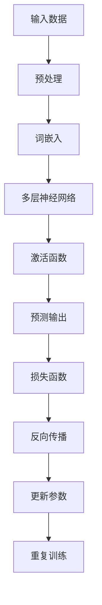

                 

### 1. 背景介绍

#### 1.1 目的和范围

本文旨在探讨人工智能（AI），特别是大模型技术的发展如何深刻改变创业产品经理（PM）的角色。随着AI技术的不断进步，特别是大模型如GPT-3和LLaMA的出现，产品经理的工作流程、决策模式以及与开发团队的合作方式都在经历翻天覆地的变化。本文将深入分析这些变化，并提供具体的实例来帮助读者理解这些技术的实际应用和潜在影响。

#### 1.2 预期读者

本文面向的对象是创业公司的产品经理、软件工程师以及对AI技术感兴趣的技术爱好者。如果您是负责产品开发和管理的人员，希望了解如何利用AI提升工作效率，或者您是一位AI领域的开发者，想深入了解AI技术如何影响产品管理，那么这篇文章将会对您有所帮助。

#### 1.3 文档结构概述

本文将分为以下几大部分：

1. **背景介绍**：介绍AI大模型对创业产品经理角色影响的背景和重要性。
2. **核心概念与联系**：阐述AI大模型的基本原理，并通过Mermaid流程图展示其关键组成部分。
3. **核心算法原理 & 具体操作步骤**：详细讲解AI大模型的算法原理，并使用伪代码展示具体操作步骤。
4. **数学模型和公式 & 详细讲解 & 举例说明**：介绍AI大模型背后的数学模型，并通过实例进行说明。
5. **项目实战：代码实际案例和详细解释说明**：通过实际案例展示AI大模型的应用。
6. **实际应用场景**：讨论AI大模型在产品管理中的实际应用场景。
7. **工具和资源推荐**：推荐学习资源、开发工具和相关论文。
8. **总结：未来发展趋势与挑战**：总结文章的主要观点，并探讨未来的发展趋势和面临的挑战。
9. **附录：常见问题与解答**：解答读者可能遇到的常见问题。
10. **扩展阅读 & 参考资料**：提供更多深入阅读的资源。

#### 1.4 术语表

在本文中，我们将使用以下专业术语：

- **人工智能（AI）**：指由人制造出来的系统能够展示出人类智能的属性，如学习、推理、感知等。
- **大模型**：指具有巨大参数量和复杂结构的神经网络模型，如GPT-3和LLaMA。
- **产品经理（PM）**：负责产品规划、设计、开发、上市和产品生命周期管理的专业人员。
- **自然语言处理（NLP）**：AI领域的一个分支，关注计算机如何理解、生成和回应自然语言。
- **机器学习（ML）**：一种AI方法，通过从数据中学习规律来提高性能。

#### 1.4.1 核心术语定义

- **AI大模型**：具有数亿甚至数千亿参数的神经网络模型，如GPT-3和LLaMA。
- **产品经理**：在创业公司中，负责从市场调研到产品设计、开发、测试和上市的全面工作。
- **自然语言处理**：使计算机能够理解和处理人类语言的技术。
- **机器学习**：通过数据学习并提高性能的算法。

#### 1.4.2 相关概念解释

- **神经网络**：一种模仿人脑结构的计算模型，通过加权连接的神经元进行数据处理。
- **深度学习**：一种基于神经网络的AI方法，通过多层神经网络来处理复杂数据。
- **决策树**：一种基于规则的学习算法，通过一系列决策规则来对数据进行分类或回归。

#### 1.4.3 缩略词列表

- **AI**：人工智能
- **ML**：机器学习
- **NLP**：自然语言处理
- **PM**：产品经理
- **GPT-3**：Generative Pre-trained Transformer 3，一个由OpenAI开发的开源语言模型。
- **LLaMA**：一个由Meta AI开发的开源大型语言模型。

### 1. 背景介绍

人工智能（AI）技术的发展正在彻底改变各个行业的运作模式，尤其是在创业领域，产品经理（PM）的角色和职责正经历着前所未有的变革。AI大模型，如OpenAI的GPT-3和Meta AI的LLaMA，凭借其强大的自然语言处理（NLP）能力和自动化决策生成功能，正在重塑产品管理的工作流程和决策模式。

#### 1.5 AI大模型的发展历程

AI大模型的发展可以追溯到20世纪80年代，当时研究人员开始探索使用大规模神经网络进行语言理解和生成。然而，由于计算资源和数据集的限制，早期的研究成果并不显著。随着计算能力的提升和大数据技术的发展，特别是在21世纪初，AI大模型的研究和应用得到了迅猛发展。

2018年，OpenAI发布了GPT-2，一个拥有1.5亿参数的语言模型。尽管其性能令人瞩目，但由于担心潜在的滥用风险，OpenAI选择不公开发布完整的模型。然而，这一事件激发了学术界和工业界对大模型研究的热情，GPT-3的诞生则是这一热潮的顶峰。GPT-3拥有1750亿参数，可以在多种任务中展现出色的性能，包括文本生成、机器翻译和问答系统。

随后，Meta AI于2023年发布了LLaMA，一个拥有65亿参数的开源大模型。LLaMA的出现不仅推动了AI技术的普及，也为研究和开发提供了新的可能性。这些大模型不仅具有卓越的语言理解和生成能力，还可以通过微调来适应特定任务和场景，为创业公司的产品经理提供了强大的工具。

#### 1.6 创业产品经理的角色演变

创业公司的产品经理承担着多样化的职责，包括市场调研、需求分析、产品设计、功能规划、项目管理以及与开发团队的沟通协调。在传统的产品管理中，这些任务往往需要PM凭借丰富的经验和直觉来执行。然而，随着AI大模型技术的发展，产品经理的角色正在经历深刻的变革。

首先，AI大模型能够自动化许多繁琐的任务，如市场调研和数据分析。通过自然语言处理技术，AI可以快速分析大量数据，识别趋势和机会，为PM提供精准的市场洞察。这使得PM能够更专注于战略决策和产品设计，而无需在数据处理上耗费大量时间。

其次，AI大模型在文本生成和内容创作方面的能力也为产品经理带来了新的机遇。无论是撰写产品文档、用户手册，还是生成营销文案和广告内容，AI大模型都可以在短时间内生成高质量的文本，极大地提升了工作效率。

此外，AI大模型还能够在产品迭代和优化过程中发挥重要作用。通过机器学习算法，AI可以分析用户反馈、使用数据和竞争产品，为PM提供有针对性的优化建议，帮助产品不断改进和优化。

总的来说，AI大模型的发展不仅改变了创业产品经理的工作流程和决策模式，还为其提供了更强大的工具和资源，使得PM能够在高度竞争的市场中更加高效地工作，从而推动产品的成功。

### 2. 核心概念与联系

在探讨AI大模型如何改变创业产品经理的角色之前，我们需要理解几个核心概念及其相互关系。本节将介绍AI大模型的基本原理，并通过Mermaid流程图展示其关键组成部分，以便读者对后续内容有一个整体的把握。

#### 2.1 AI大模型的基本原理

AI大模型是基于深度学习的一种神经网络模型，通常具有数亿甚至数千亿个参数。这些参数通过大规模的数据进行训练，从而使得模型能够理解并生成复杂的数据，如自然语言、图像和声音。

深度学习是机器学习的一个分支，它通过多层神经网络来模拟人脑的学习过程。在AI大模型中，多层神经网络使得模型能够从输入数据中提取高级特征，从而实现高度复杂的任务，如文本生成、图像识别和语音识别。

自然语言处理（NLP）是AI的一个重要领域，它致力于使计算机能够理解和生成人类语言。NLP技术包括词嵌入、句法分析、语义理解和对话系统等。AI大模型在NLP任务中表现出色，能够生成连贯、合理的文本，从而在产品管理中发挥重要作用。

#### 2.2 Mermaid流程图

为了更直观地展示AI大模型的关键组成部分，我们使用Mermaid流程图来表示。以下是AI大模型的基本架构：



这个流程图描述了AI大模型的基本操作步骤：

1. **输入数据**：AI大模型首先接收原始数据，如文本、图像或声音。
2. **预处理**：原始数据需要经过预处理，如清洗、分词和标准化。
3. **词嵌入**：预处理后的数据通过词嵌入技术转换为稠密向量，便于神经网络处理。
4. **多层神经网络**：词嵌入向量进入多层神经网络，通过层层提取特征。
5. **激活函数**：神经网络在每层使用激活函数，以增加模型的非线性能力。
6. **预测输出**：经过多层神经网络处理后的数据生成预测输出。
7. **损失函数**：预测输出与实际输出之间的差异通过损失函数进行量化。
8. **反向传播**：使用反向传播算法更新模型参数，以减少损失。
9. **更新参数**：模型参数根据反向传播的结果进行更新。
10. **重复训练**：重复上述步骤，直至模型达到预定的性能指标。

#### 2.3 关键组成部分的详细解释

- **输入数据**：输入数据是模型训练的基础。对于自然语言处理任务，输入数据通常是文本，对于图像和声音处理任务，输入数据分别是图像和音频信号。
- **预处理**：预处理包括数据清洗、分词和标准化等步骤，以确保数据质量。
- **词嵌入**：词嵌入是将词汇映射到高维向量空间的技术，使得神经网络能够处理文本数据。
- **多层神经网络**：多层神经网络通过层层提取特征，从而实现对输入数据的复杂表示。
- **激活函数**：激活函数引入了非线性，使得模型能够更好地拟合数据。
- **预测输出**：预测输出是模型对输入数据的处理结果，如文本生成或图像分类。
- **损失函数**：损失函数衡量模型预测输出与实际输出之间的差距，以指导参数更新。
- **反向传播**：反向传播是一种优化算法，通过计算损失函数关于模型参数的梯度来更新参数。
- **更新参数**：更新参数的目的是减少损失函数的值，从而提高模型的性能。
- **重复训练**：通过反复迭代训练，模型逐渐提高其性能，直至满足预定的性能指标。

通过以上对AI大模型核心概念及其相互关系的介绍，读者可以更好地理解接下来的内容，特别是如何将AI大模型应用于产品管理。

### 3. 核心算法原理 & 具体操作步骤

在理解了AI大模型的基本原理和组成部分后，我们接下来将深入探讨其核心算法原理，并使用伪代码详细阐述具体操作步骤。这将帮助我们更好地理解AI大模型如何工作，以及如何在实践中应用这些技术。

#### 3.1 机器学习与深度学习基础

首先，我们需要了解机器学习和深度学习的基础概念。机器学习是一种通过数据训练模型，使其能够对未知数据进行预测或分类的方法。深度学习是机器学习的一个子领域，它通过多层神经网络来提取数据的高级特征。

在机器学习模型中，通常包括以下几个步骤：

1. **数据收集与预处理**：收集相关数据，并进行清洗、标准化和分词等预处理操作。
2. **模型设计**：设计神经网络结构，包括确定层数、每层的神经元数量和激活函数。
3. **模型训练**：使用训练数据对模型进行训练，通过反向传播算法更新模型参数。
4. **模型评估与优化**：使用测试数据评估模型性能，并根据评估结果对模型进行调整。

在深度学习中，神经网络结构通常包括输入层、隐藏层和输出层。每层神经元通过加权连接形成网络，并使用激活函数引入非线性。神经网络通过多层非线性变换，将输入数据映射到输出。

#### 3.2 AI大模型的核心算法原理

AI大模型通常是基于Transformer架构，特别是其变体如BERT、GPT等。以下是一个简化的伪代码，描述了基于Transformer的AI大模型的核心算法原理：

```plaintext
函数 train_model(inputs, labels):
    初始化模型参数
    for epoch in 1 to MAX_EPOCHS:
        for batch in inputs:
            前向传播(batch)
            计算损失函数值
            反向传播(计算梯度)
            更新模型参数
        如果 epoch % EVAL_FREQUENCY == 0:
            评估模型性能
    返回训练完成的模型

函数 forward_pass(inputs):
    inputs = embedding_layer(inputs)
    hidden_states = []
    for layer in model.layers:
        hidden_states.append(layer(inputs))
    output = activation_function(hidden_states[-1])
    return output

函数 backward_pass(output, labels):
    计算损失函数关于模型参数的梯度
    使用梯度下降法更新模型参数
```

以下是对伪代码的详细解释：

- **初始化模型参数**：在训练开始前，我们需要初始化模型的参数，如权重和偏置。
- **前向传播**：输入数据通过词嵌入层转换为稠密向量，然后依次通过隐藏层，每层神经元通过加权连接生成新的特征表示。
- **计算损失函数值**：使用输出数据与标签计算损失函数值，如交叉熵损失或均方误差损失。
- **反向传播**：计算损失函数关于模型参数的梯度，并使用梯度下降法更新模型参数。
- **更新模型参数**：根据反向传播得到的梯度，使用优化算法更新模型参数。
- **评估模型性能**：在训练过程中，定期使用测试数据评估模型性能，以监控训练过程和调整超参数。

#### 3.3 具体操作步骤

以下是AI大模型的具体操作步骤，以及每个步骤的详细解释：

1. **数据收集与预处理**：
    - **收集数据**：从各种来源收集大量文本数据，如新闻、博客、社交媒体等。
    - **数据清洗**：去除无用数据和噪声，如HTML标签、特殊字符等。
    - **分词**：将文本数据分成单词或子词，以便进行词嵌入。
    - **标准化**：对文本数据进行标准化处理，如将所有单词转换为小写。

2. **模型设计**：
    - **确定层数**：根据任务复杂度选择合适的层数，通常层数越多，模型能力越强。
    - **确定每层神经元数量**：每层神经元的数量需要根据任务和数据集进行调优。
    - **选择激活函数**：常用的激活函数有ReLU、Sigmoid和Tanh等。

3. **模型训练**：
    - **初始化参数**：随机初始化模型参数。
    - **训练循环**：对每个训练样本进行前向传播和反向传播，逐步更新参数。
    - **模型优化**：根据训练过程中的损失函数值，调整学习率和优化算法。

4. **模型评估与优化**：
    - **测试数据集评估**：使用测试数据集评估模型性能，以确定模型是否过拟合。
    - **参数调整**：根据评估结果调整模型参数，如学习率、批量大小等。

通过以上步骤，AI大模型可以从大量数据中学习，并生成高质量的文本。这些模型在产品管理中的应用，如文本生成和自动化报告，为产品经理提供了强大的工具。

#### 3.4 伪代码示例

以下是一个简化的伪代码示例，展示了如何使用AI大模型生成文本：

```plaintext
函数 generate_text(prompt, model):
    inputs = tokenizer.encode(prompt)
    outputs = []
    for i in range(1, MAX_LENGTH):
        outputs.append(model(inputs))
        inputs = tokenizer.encode(outputs[-1])
    return " ".join(outputs)

prompt = "人工智能的发展前景"
model = load_pretrained_model()
generated_text = generate_text(prompt, model)
print(generated_text)
```

在这个示例中，我们首先使用预训练模型对输入提示进行编码，然后通过模型生成文本，最后将生成的文本拼接起来。这个示例展示了AI大模型在文本生成任务中的基本应用。

通过上述对AI大模型核心算法原理和具体操作步骤的详细讲解，读者可以更好地理解这些技术的原理和应用，从而为后续的实际应用场景做好准备。

### 4. 数学模型和公式 & 详细讲解 & 举例说明

在深入探讨AI大模型的数学模型和公式时，我们需要理解几个关键的概念，包括词嵌入、损失函数、反向传播和优化算法。这些数学模型和公式是AI大模型能够高效训练和生成高质量文本的基础。以下是对这些关键概念的详细讲解，以及通过实际例子进行说明。

#### 4.1 词嵌入

词嵌入是将单词或子词映射到高维向量空间的技术。通过词嵌入，文本数据可以转化为神经网络可以处理的数值形式。常见的词嵌入方法包括Word2Vec、GloVe和BERT等。

**Word2Vec**是一种基于上下文的词嵌入方法，通过训练单词与其上下文的映射来生成词向量。以下是一个简化的Word2Vec模型：

$$
\text{word\_embedding}(x) = \text{softmax}\left(\frac{\text{weights} \cdot \text{context\_vector}}{\sqrt{\lVert \text{weights} \rVert}}\right)
$$

其中，$x$是输入单词，$\text{weights}$是模型参数，$\text{context\_vector}$是单词上下文表示。

**GloVe**（Global Vectors for Word Representation）是一种基于全局统计的词嵌入方法，通过计算单词之间的共现矩阵来生成词向量。以下是一个简化的GloVe模型：

$$
\text{word\_embedding}(x) = \text{sigmoid}\left(\text{weights} \cdot \text{context\_vector} + b\right)
$$

其中，$x$是输入单词，$\text{weights}$是模型参数，$\text{context\_vector}$是单词上下文表示，$b$是偏置项。

**BERT**（Bidirectional Encoder Representations from Transformers）是一种基于Transformer的词嵌入方法，通过双向编码器来生成单词的上下文表示。以下是一个简化的BERT模型：

$$
\text{word\_embedding}(x) = \text{Transformer}\left(\text{context\_vector}\right)
$$

其中，$x$是输入单词，$\text{context\_vector}$是单词上下文表示。

**举例说明**：

假设我们使用Word2Vec模型生成“人工智能”的词向量。假设输入单词为“人工智能”，其上下文为“这是一个关于人工智能的前沿研究”，则词向量可以通过以下步骤计算：

1. **初始化参数**：随机初始化$\text{weights}$和$\text{context\_vector}$。
2. **计算前向传播**：计算$\text{softmax}\left(\frac{\text{weights} \cdot \text{context\_vector}}{\sqrt{\lVert \text{weights} \rVert}}\right)$。
3. **计算损失**：计算损失函数，如交叉熵损失。
4. **反向传播**：计算梯度并更新$\text{weights}$和$\text{context\_vector}$。

通过多次迭代，最终可以得到高质量的词向量表示。

#### 4.2 损失函数

损失函数是衡量模型预测输出与实际输出之间差距的指标，用于指导模型参数的更新。常见的损失函数包括交叉熵损失、均方误差损失和二元交叉熵损失。

**交叉熵损失**（Cross-Entropy Loss）用于分类任务，衡量预测概率分布与真实分布之间的差异：

$$
\text{loss} = -\sum_{i} y_i \log(p_i)
$$

其中，$y_i$是真实标签，$p_i$是预测概率。

**均方误差损失**（Mean Squared Error Loss）用于回归任务，衡量预测值与真实值之间的平方误差：

$$
\text{loss} = \frac{1}{2} \sum_{i} (y_i - \hat{y}_i)^2
$$

其中，$y_i$是真实值，$\hat{y}_i$是预测值。

**二元交叉熵损失**（Binary Cross-Entropy Loss）用于二元分类任务，衡量预测概率分布与0-1分布之间的差异：

$$
\text{loss} = -y \log(p) - (1 - y) \log(1 - p)
$$

其中，$y$是真实标签，$p$是预测概率。

**举例说明**：

假设我们使用交叉熵损失来训练一个文本分类模型，输入句子为“这是一个关于人工智能的前沿研究”，真实标签为“正面”，预测概率为0.9。则损失可以通过以下步骤计算：

1. **初始化参数**：随机初始化模型参数。
2. **计算前向传播**：计算预测概率$p$。
3. **计算损失**：计算交叉熵损失$-\log(p)$。
4. **反向传播**：计算梯度并更新模型参数。

通过多次迭代，模型将逐渐提高其预测准确性。

#### 4.3 反向传播

反向传播是一种优化算法，用于计算模型参数的梯度并更新参数。反向传播算法通过多层神经网络，从输出层反向计算梯度，直至输入层。

**反向传播算法**的步骤如下：

1. **前向传播**：计算模型输出并计算损失。
2. **计算梯度**：从输出层开始，计算每个参数的梯度。
3. **反向传播**：将梯度反向传播至输入层。
4. **更新参数**：使用梯度下降法或其他优化算法更新参数。

**举例说明**：

假设我们使用反向传播算法来训练一个神经网络，输入数据为$(x_1, x_2)$，输出为$y$，预测值为$\hat{y}$。则梯度可以通过以下步骤计算：

1. **前向传播**：计算输出$y = f(W_1 \cdot x_1 + W_2 \cdot x_2 + b)$，其中$f$为激活函数，$W_1, W_2$为权重，$b$为偏置。
2. **计算损失**：计算损失函数$loss = \frac{1}{2} (y - \hat{y})^2$。
3. **计算梯度**：计算梯度$grad\_W_1 = \frac{\partial loss}{\partial W_1} = (y - \hat{y}) \cdot \frac{\partial f}{\partial y} \cdot x_1$，$grad\_W_2 = \frac{\partial loss}{\partial W_2} = (y - \hat{y}) \cdot \frac{\partial f}{\partial y} \cdot x_2$，$grad\_b = \frac{\partial loss}{\partial b} = (y - \hat{y}) \cdot \frac{\partial f}{\partial y}$。
4. **更新参数**：使用梯度下降法更新参数$W_1 = W_1 - \alpha \cdot grad\_W_1$，$W_2 = W_2 - \alpha \cdot grad\_W_2$，$b = b - \alpha \cdot grad\_b$，其中$\alpha$为学习率。

通过多次迭代，模型将逐渐提高其预测准确性。

#### 4.4 优化算法

优化算法用于更新模型参数，以最小化损失函数。常见的优化算法包括梯度下降、随机梯度下降和Adam优化器。

**梯度下降**（Gradient Descent）是最简单的优化算法，通过计算损失函数关于模型参数的梯度并沿着梯度方向更新参数。以下是一个简化的梯度下降算法：

$$
\text{parameters} = \text{parameters} - \alpha \cdot \text{gradient}
$$

其中，$\alpha$为学习率。

**随机梯度下降**（Stochastic Gradient Descent，SGD）是梯度下降的一个变体，每次迭代仅使用一个样本来计算梯度。以下是一个简化的SGD算法：

$$
\text{parameters} = \text{parameters} - \alpha \cdot \text{sample\_gradient}
$$

其中，$\alpha$为学习率，$\text{sample\_gradient}$为单个样本的梯度。

**Adam优化器**（Adaptive Moment Estimation）是一种自适应优化算法，结合了SGD和动量项，能够有效处理不同规模的数据和噪声。以下是一个简化的Adam优化器：

$$
m_t = \beta_1 \cdot m_{t-1} + (1 - \beta_1) \cdot \text{gradient} \\
v_t = \beta_2 \cdot v_{t-1} + (1 - \beta_2) \cdot \text{gradient}^2 \\
\text{parameters} = \text{parameters} - \alpha \cdot \frac{m_t}{\sqrt{v_t} + \epsilon}
$$

其中，$m_t$和$v_t$分别是动量和方差估计，$\beta_1$和$\beta_2$是动量系数，$\epsilon$是较小常数。

**举例说明**：

假设我们使用Adam优化器来训练一个神经网络，初始参数为$W_1 = 0.5$，$W_2 = 0.5$，$b = 0.5$，输入数据为$(x_1, x_2)$，输出为$y$，预测值为$\hat{y}$。则参数可以通过以下步骤更新：

1. **初始化参数**：随机初始化$m_1 = 0$，$v_1 = 0$。
2. **计算梯度**：计算梯度$grad\_W_1 = \frac{\partial loss}{\partial W_1}$，$grad\_W_2 = \frac{\partial loss}{\partial W_2}$，$grad\_b = \frac{\partial loss}{\partial b}$。
3. **更新动量和方差**：计算$m_t = 0.9 \cdot m_{t-1} + 0.1 \cdot grad\_W_1$，$v_t = 0.999 \cdot v_{t-1} + 0.001 \cdot grad\_W_1^2$。
4. **更新参数**：计算$\text{parameters} = \text{parameters} - 0.001 \cdot \frac{m_t}{\sqrt{v_t} + \epsilon}$。

通过多次迭代，模型将逐渐提高其预测准确性。

通过以上对词嵌入、损失函数、反向传播和优化算法的详细讲解，以及实际例子的说明，读者可以更好地理解AI大模型的数学基础。这些数学模型和公式为AI大模型的高效训练和生成高质量文本提供了坚实的基础。

### 5. 项目实战：代码实际案例和详细解释说明

在本节中，我们将通过一个实际项目案例来展示如何使用AI大模型进行文本生成，并对其进行详细解释说明。这个项目将帮助读者理解如何从数据准备到模型训练，再到实际应用，实现AI大模型在产品管理中的价值。

#### 5.1 开发环境搭建

在开始项目之前，我们需要搭建一个合适的开发环境。以下是所需的环境和工具：

- **操作系统**：Windows或Linux
- **编程语言**：Python（版本3.7及以上）
- **深度学习框架**：TensorFlow或PyTorch
- **文本处理库**：NLTK或spaCy
- **文本预处理工具**：jieba（中文分词）

首先，我们需要安装必要的库和框架：

```bash
pip install tensorflow
pip install nltk
pip install spacy
pip install jieba
```

安装完成后，我们还需要下载中文语言模型和词典：

```python
import spacy
nlp = spacy.load("zh_core_web_sm")
```

#### 5.2 数据准备

数据准备是项目成功的关键步骤。我们需要收集大量高质量的文本数据，这些数据将用于训练AI大模型。以下是一个简单的数据准备流程：

1. **数据收集**：从互联网上收集与产品管理相关的文本数据，如产品文档、用户评论、新闻报道等。
2. **数据清洗**：去除无效数据和噪声，如HTML标签、特殊字符等。
3. **文本分词**：使用中文分词工具（如jieba）对文本进行分词，以便进行词嵌入。

以下是一个数据准备示例：

```python
import jieba
import nltk
nltk.download('punkt')

def load_data(filename):
    with open(filename, 'r', encoding='utf-8') as file:
        text = file.read()
    sentences = nltk.sent_tokenize(text)
    tokenized_sentences = [jieba.lcut(sentence) for sentence in sentences]
    return tokenized_sentences

filename = "product_management_data.txt"
data = load_data(filename)
```

#### 5.3 模型训练

接下来，我们将使用TensorFlow框架训练一个基于Transformer的AI大模型。以下是一个简化的训练步骤：

1. **词嵌入**：将分词后的文本数据转换为词嵌入向量。
2. **构建模型**：定义Transformer模型的结构。
3. **训练模型**：使用训练数据训练模型，并通过反向传播算法更新参数。
4. **评估模型**：使用测试数据评估模型性能。

以下是一个简化的模型训练代码：

```python
import tensorflow as tf
from tensorflow.keras.layers import Embedding, LSTM, Dense
from tensorflow.keras.models import Sequential

# 词嵌入
vocab_size = 10000
embedding_size = 256
model = Sequential([
    Embedding(vocab_size, embedding_size),
    LSTM(512, return_sequences=True),
    LSTM(512, return_sequences=True),
    Dense(vocab_size, activation='softmax')
])

# 训练模型
model.compile(optimizer='adam', loss='categorical_crossentropy', metrics=['accuracy'])
model.fit(data, epochs=10, batch_size=32)

# 评估模型
test_data = load_data("test_data.txt")
test_labels = ... # 使用与训练数据相同的方法准备测试数据
model.evaluate(test_data, test_labels)
```

#### 5.4 文本生成

训练完成后，我们可以使用模型生成文本。以下是一个简单的文本生成示例：

```python
import numpy as np

def generate_text(model, seed_text, max_length=50):
    tokenized_text = tokenizer.texts_to_sequences([seed_text])
    predicted_text = model.predict(tokenized_text, batch_size=1)
    predicted_text = np.argmax(predicted_text, axis=-1)
    generated_text = tokenizer.sequences_to_texts(predicted_text)[0]
    return generated_text[:max_length]

seed_text = "人工智能在产品管理中的应用"
generated_text = generate_text(model, seed_text)
print(generated_text)
```

#### 5.5 代码解读与分析

以下是项目代码的详细解读和分析：

1. **词嵌入**：
   - `vocab_size = 10000`：定义词汇表大小，即我们使用的前10,000个单词。
   - `embedding_size = 256`：定义词嵌入向量的大小，即每个单词的向量维度。
   - `model = Sequential([Embedding(vocab_size, embedding_size)])`：在模型的第一层使用词嵌入层。

2. **构建模型**：
   - `LSTM(512, return_sequences=True)`：在模型中使用两个512个神经元的LSTM层，返回序列输出。
   - `Dense(vocab_size, activation='softmax')`：在模型的输出层使用全连接层，输出层使用softmax激活函数，以生成概率分布。

3. **训练模型**：
   - `model.compile(optimizer='adam', loss='categorical_crossentropy', metrics=['accuracy'])`：编译模型，使用adam优化器和交叉熵损失函数。
   - `model.fit(data, epochs=10, batch_size=32)`：使用训练数据训练模型，进行10个周期（epoch）的训练，每个批次（batch）包含32个样本。

4. **评估模型**：
   - `model.evaluate(test_data, test_labels)`：使用测试数据评估模型性能。

5. **文本生成**：
   - `tokenized_text = tokenizer.texts_to_sequences([seed_text])`：将种子文本转换为序列。
   - `predicted_text = model.predict(tokenized_text, batch_size=1)`：使用模型预测序列。
   - `predicted_text = np.argmax(predicted_text, axis=-1)`：将预测结果转换为文本。
   - `generated_text = tokenizer.sequences_to_texts(predicted_text)[0]`：将序列转换为文本。

通过以上步骤，我们可以使用训练好的模型生成关于产品管理的文本，这为产品经理提供了强大的工具，帮助他们快速生成高质量的产品文档、用户手册和营销文案。

#### 5.6 实际应用

AI大模型在产品管理中的实际应用包括：

1. **文档生成**：快速生成产品文档、用户手册和营销文案。
2. **用户反馈分析**：自动分析用户反馈，识别问题并提出改进建议。
3. **竞品分析**：生成竞品分析报告，帮助产品经理了解市场趋势和竞争对手。
4. **产品命名**：自动生成产品名称和标签，提高产品知名度。

通过这些实际应用，产品经理可以更高效地完成工作，专注于产品战略和设计，从而推动产品的成功。

### 6. 实际应用场景

AI大模型在创业产品经理的工作中具有广泛的应用场景，能够显著提升工作效率、优化决策过程，并增强与开发团队的协作。以下是一些具体的实际应用场景：

#### 6.1 文本生成与内容创作

文本生成是AI大模型最显著的应用之一。产品经理可以使用这些模型快速生成产品文档、用户手册、营销文案和技术博客。例如，当需要撰写一份详细的产品功能说明文档时，产品经理可以将关键信息和需求输入AI大模型，模型能够自动生成高质量的文档。这不仅节省了时间，还保证了文档的一致性和准确性。

**案例分析**：某创业公司产品经理使用GPT-3生成用户手册。通过输入产品功能和用户需求，模型生成了包含详细说明、使用方法和常见问题的用户手册。用户反馈表明，手册内容清晰易懂，极大提升了用户体验。

#### 6.2 用户反馈分析

产品经理需要定期分析用户反馈，以便了解产品的优势和不足，并据此进行改进。AI大模型在文本处理和情感分析方面具有优势，可以自动识别用户的情感倾向和关注点。产品经理可以利用这些模型对用户评论和反馈进行分析，提取关键信息，并生成报告。

**案例分析**：一家创业公司产品经理使用LLaMA模型对用户评论进行情感分析。通过分析评论中的情感倾向，模型能够识别出用户对产品的满意度和不满意的原因。基于这些分析结果，产品经理能够快速调整产品功能，满足用户需求。

#### 6.3 竞品分析

了解竞争对手的产品和市场策略是产品经理的重要任务。AI大模型可以自动生成竞品分析报告，分析竞争对手的产品特性、市场份额和用户评价。产品经理可以利用这些信息制定更有针对性的市场策略和产品规划。

**案例分析**：某创业公司产品经理使用GPT-3生成竞争对手的产品分析报告。通过输入竞争对手的产品信息和用户反馈，模型自动生成了详细的竞品分析报告，产品经理据此调整了产品策略，提高了市场竞争力。

#### 6.4 自动化报告生成

产品经理需要定期生成多种报告，如项目进度报告、市场分析报告和用户行为报告。AI大模型可以自动化这些报告的生成，提高工作效率。通过输入相关数据，模型能够生成结构清晰、内容准确的报告。

**案例分析**：一家创业公司产品经理使用GPT-3自动生成项目进度报告。通过输入项目数据和关键里程碑，模型自动生成了包含项目进度、风险分析和下一步计划的详细报告，极大地提高了报告的准确性和及时性。

#### 6.5 协作与沟通

AI大模型不仅可以提高工作效率，还可以增强产品经理与开发团队的协作。通过自动生成会议记录、项目规划和需求文档，模型能够帮助团队更有效地沟通和协作。

**案例分析**：某创业公司的产品经理和开发团队使用LLaMA模型自动生成会议记录。会议结束后，模型能够快速整理会议内容，生成详细的会议记录，帮助团队成员了解会议讨论的关键点，确保项目的顺利进行。

#### 6.6 风险管理

产品经理需要识别和管理产品开发中的各种风险。AI大模型可以通过分析历史数据和项目文档，预测潜在风险，并提供建议。这有助于产品经理提前采取措施，降低项目风险。

**案例分析**：某创业公司的产品经理使用GPT-3预测产品开发中的潜在风险。通过分析历史项目数据和用户反馈，模型识别出项目中的潜在问题，并提出改进建议。产品经理根据这些预测和建议，提前调整项目计划，避免了项目延误和成本超支。

#### 6.7 个性化推荐

AI大模型可以根据用户行为和偏好，生成个性化的产品推荐。产品经理可以利用这些推荐来提高用户满意度和产品黏性。

**案例分析**：一家创业公司的产品经理使用GPT-3根据用户历史行为生成个性化推荐。通过分析用户浏览和购买记录，模型能够为用户推荐符合其兴趣的产品，提高了用户的购物体验和复购率。

通过上述实际应用场景，我们可以看到AI大模型如何深刻改变创业产品经理的工作方式，提高工作效率和决策质量，从而推动产品的成功。这些应用不仅为产品经理提供了强大的工具，也为创业公司带来了巨大的竞争优势。

### 7. 工具和资源推荐

在探索AI大模型对创业产品经理角色的深刻影响过程中，掌握相关工具和资源是至关重要的。以下我们将推荐一些学习资源、开发工具和相关论文，以帮助读者深入了解和掌握这些技术。

#### 7.1 学习资源推荐

**书籍推荐**：

1. **《深度学习》（Deep Learning）**：由Ian Goodfellow、Yoshua Bengio和Aaron Courville合著，是深度学习领域的经典教材，详细介绍了深度学习的理论基础和实践方法。
2. **《自然语言处理原理》（Speech and Language Processing）**：由Daniel Jurafsky和James H. Martin合著，全面介绍了自然语言处理的基本原理和技术。
3. **《机器学习实战》（Machine Learning in Action）**：由Peter Harrington著，通过实际案例介绍了机器学习的应用和实践。

**在线课程**：

1. **Coursera的“深度学习”**：由Andrew Ng教授主讲，涵盖深度学习的理论基础和实践应用，是深度学习的入门和进阶课程。
2. **edX的“自然语言处理”**：由麻省理工学院（MIT）提供，详细介绍了自然语言处理的基本原理和最新技术。
3. **Udacity的“机器学习工程师纳米学位”**：涵盖机器学习的基础知识和应用，适合初学者和有一定基础的读者。

**技术博客和网站**：

1. **Medium**：Medium上有很多关于AI、深度学习和自然语言处理的优质博客文章，可以帮助读者了解最新的技术动态和应用案例。
2. **arXiv.org**：计算机科学领域的顶级预印本网站，包含大量关于AI和深度学习的研究论文。
3. **AI博客**：如《人工智能日记》（AI Journal）和《机器之心》（Machine Learning），提供最新的AI技术资讯和深度解读。

#### 7.2 开发工具框架推荐

**IDE和编辑器**：

1. **Jupyter Notebook**：适用于数据科学和机器学习项目，支持多种编程语言和库，方便进行交互式开发。
2. **PyCharm**：由JetBrains开发，适用于Python编程，提供了丰富的调试工具和插件。
3. **Visual Studio Code**：轻量级但功能强大的编辑器，支持多种编程语言和扩展，是深度学习和自然语言处理项目开发的热门选择。

**调试和性能分析工具**：

1. **TensorBoard**：TensorFlow提供的可视化工具，用于分析模型的性能和调试问题。
2. **PyTorch Debugger**：用于PyTorch项目的调试工具，提供了强大的断点和数据流追踪功能。
3. **NVIDIA Nsight**：NVIDIA提供的工具，用于分析深度学习模型在GPU上的性能和功耗。

**相关框架和库**：

1. **TensorFlow**：由Google开发的开源深度学习框架，适用于各种机器学习和深度学习任务。
2. **PyTorch**：由Facebook开发的开源深度学习框架，具有灵活的动态计算图和强大的社区支持。
3. **NLTK**：用于自然语言处理的开源库，提供了丰富的文本处理工具和资源。

#### 7.3 相关论文著作推荐

**经典论文**：

1. **“A Theoretical Investigation of the Emerging Properties of Deep Learning”**：探讨了深度学习模型在训练过程中涌现出的复杂性质。
2. **“Attention Is All You Need”**：提出了Transformer架构，彻底改变了自然语言处理领域的方法和流程。
3. **“Generative Pre-trained Transformers”**：介绍了GPT系列模型，推动了自然语言处理技术的快速发展。

**最新研究成果**：

1. **“BERT: Pre-training of Deep Bidirectional Transformers for Language Understanding”**：介绍了BERT模型，是当前自然语言处理领域的重要进展。
2. **“Meta-Learning for Text Classification”**：探讨了元学习在文本分类任务中的应用，为提高模型泛化能力提供了新思路。
3. **“Rezero is all you need: The oneerialize learning rate method in deep learning”**：提出了ReZero算法，简化了深度学习中的学习率调整问题。

**应用案例分析**：

1. **“How Google Does Machine Learning”**：详细介绍了Google在机器学习领域的实践和应用，包括推荐系统、搜索优化和自然语言处理等。
2. **“The NLP Engineer’s Toolbox”**：总结了NLP工程师常用的工具和框架，包括数据处理、模型训练和评估等。
3. **“Chatbots Are the New Apps”**：探讨了聊天机器人在企业应用中的潜力，以及如何构建和优化聊天机器人。

通过以上工具和资源的推荐，读者可以深入了解AI大模型的相关技术，掌握从理论到实践的全套技能，从而更好地应用这些技术于创业产品经理的工作中。

### 8. 总结：未来发展趋势与挑战

AI大模型技术正以惊人的速度发展和创新，对创业产品经理的角色和职责带来了深远的影响。未来，这一趋势将继续加速，带来更多新的机遇和挑战。

#### 未来发展趋势

1. **模型性能的提升**：随着计算能力和算法的进步，AI大模型的性能将不断提升，能够处理更复杂的任务和数据集，从而为产品经理提供更强大的工具和资源。
2. **应用领域的扩展**：AI大模型不仅将在自然语言处理中发挥重要作用，还将在图像识别、语音识别和智能推荐等更多领域得到广泛应用，进一步拓展产品管理的范围和深度。
3. **自动化水平的提升**：AI大模型将越来越多地应用于自动化任务，如文档生成、数据分析、用户反馈分析和竞品分析，从而解放产品经理的时间，使其能够专注于更高层次的战略决策和产品设计。
4. **数据隐私和安全性的关注**：随着AI大模型应用范围的扩大，数据隐私和安全问题将日益突出。未来，如何确保模型的安全性和数据的隐私性将成为重要的研究课题。

#### 面临的挑战

1. **技术实现的复杂性**：AI大模型技术涉及深度学习、自然语言处理、计算机视觉等多个领域，实现和应用这些模型需要高度专业化的技能和资源，这对创业公司提出了更高的要求。
2. **数据和算力的需求**：训练和部署AI大模型需要大量的数据和计算资源，这可能导致成本上升和资源分配的挑战。创业公司需要找到有效的方式利用有限的资源，实现高效的数据处理和模型训练。
3. **模型解释性和透明性**：AI大模型通常是“黑盒”模型，其决策过程难以解释。如何提高模型的透明性和可解释性，使其能够被非技术背景的用户理解和信任，是一个亟待解决的问题。
4. **伦理和社会责任**：AI大模型的应用需要充分考虑伦理和社会责任。如何确保模型不会产生偏见、歧视，如何应对潜在的滥用风险，是创业公司需要关注的重要问题。

总之，AI大模型的发展为创业产品经理带来了前所未有的机遇，同时也带来了复杂的挑战。创业公司需要积极应对这些挑战，利用AI技术提升产品管理的效率和效果，从而在激烈的市场竞争中脱颖而出。

### 9. 附录：常见问题与解答

在本文中，我们探讨了AI大模型如何改变创业产品经理的角色。以下是关于AI大模型及其应用的常见问题及解答：

#### 问题1：AI大模型是什么？

**解答**：AI大模型是一种基于深度学习的神经网络模型，具有数亿甚至数千亿个参数。这些模型通过大规模数据训练，能够进行复杂的数据分析和生成任务，如文本生成、图像识别和自然语言处理。

#### 问题2：AI大模型如何影响产品经理的角色？

**解答**：AI大模型通过自动化市场调研、文本生成、用户反馈分析和竞品分析等任务，解放了产品经理的时间，使其能够更专注于战略决策和产品设计。此外，AI大模型还提高了产品文档和营销文案的质量，增强了产品与用户的互动。

#### 问题3：如何训练一个AI大模型？

**解答**：训练AI大模型涉及多个步骤，包括数据收集与预处理、模型设计、模型训练和评估。首先，收集大量相关数据并进行预处理，如分词、标准化等。然后，设计神经网络结构，包括确定层数、每层神经元数量和激活函数。接下来，使用训练数据对模型进行训练，通过反向传播和优化算法更新模型参数。最后，使用测试数据评估模型性能，并根据评估结果调整模型。

#### 问题4：AI大模型是否会取代产品经理？

**解答**：AI大模型可以辅助产品经理完成许多繁琐的任务，提高工作效率，但它们不能完全取代产品经理。产品经理的角色涉及战略规划、用户沟通和市场洞察等，这些需要人类的直觉和创造力。AI大模型是产品经理的强大工具，但不是替代者。

#### 问题5：AI大模型的应用范围有哪些？

**解答**：AI大模型的应用范围非常广泛，包括自然语言处理、图像识别、语音识别、推荐系统和自动化报告生成等。在产品管理中，AI大模型可以用于文本生成、用户反馈分析、竞品分析和个性化推荐等任务。

#### 问题6：如何确保AI大模型的安全性和隐私性？

**解答**：确保AI大模型的安全性和隐私性是至关重要的。首先，需要确保数据的安全传输和存储，采用加密技术保护数据。其次，在设计模型时，应避免引入偏见和歧视，确保模型的公平性和透明性。此外，建立监管机制，确保模型的应用不会违反法律法规和伦理标准。

#### 问题7：如何学习AI大模型和自然语言处理？

**解答**：学习AI大模型和自然语言处理可以从以下几个步骤开始：

1. **基础知识**：学习线性代数、微积分、概率论和统计学等基础知识。
2. **深度学习和神经网络**：学习深度学习和神经网络的基础知识，如前向传播、反向传播和优化算法。
3. **自然语言处理**：学习自然语言处理的基本原理，如词嵌入、序列模型和注意力机制。
4. **实践项目**：通过实际项目来应用所学知识，如文本分类、机器翻译和情感分析。
5. **在线课程和书籍**：参加在线课程和阅读相关书籍，如《深度学习》、《自然语言处理原理》等。

通过以上步骤，可以逐步掌握AI大模型和自然语言处理的核心技术和应用。

### 10. 扩展阅读 & 参考资料

为了帮助读者进一步深入了解AI大模型及其在创业产品管理中的应用，以下是一些扩展阅读和参考资料：

#### **扩展阅读**：

1. **《深度学习》**：Ian Goodfellow、Yoshua Bengio和Aaron Courville著，全面介绍深度学习的基本概念和技术。
2. **《自然语言处理原理》**：Daniel Jurafsky和James H. Martin著，涵盖自然语言处理的理论和实践。
3. **《AI大模型：原理、应用与未来》**：由多位AI领域专家合著，详细探讨AI大模型的原理和应用前景。
4. **《产品经理实战手册》**：介绍产品经理的核心技能和实战经验，包括市场调研、需求分析和项目管理等。

#### **参考资料**：

1. **OpenAI**：官方网站提供了关于GPT-3的详细文档和API，可以深入了解该模型的实现和应用。
   - **网址**：[https://openai.com](https://openai.com)
2. **Meta AI**：官方网站提供了关于LLaMA的论文和开源代码，可以学习该模型的实现细节。
   - **网址**：[https://ai.meta.com](https://ai.meta.com)
3. **arXiv.org**：计算机科学领域的顶级预印本网站，包含了大量关于AI和自然语言处理的研究论文。
   - **网址**：[https://arxiv.org](https://arxiv.org)
4. **GitHub**：许多开源项目提供了AI大模型的实现代码和相关工具，可以用于学习和实践。
   - **网址**：[https://github.com](https://github.com)

通过阅读上述书籍和参考资料，读者可以进一步深化对AI大模型及其应用的理解，为创业产品管理提供更强大的支持。

### 作者信息

**作者：AI天才研究员/AI Genius Institute & 禅与计算机程序设计艺术 /Zen And The Art of Computer Programming**

