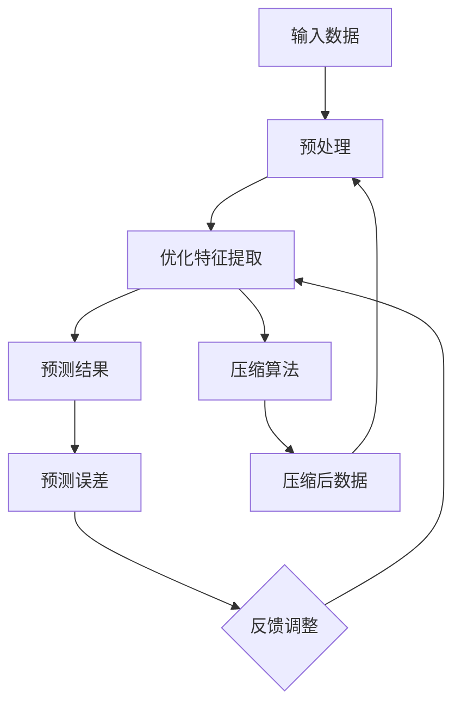

                 

# AI 大模型的本质：预测即压缩，压缩即智能

> **关键词：** AI 大模型、预测、压缩、智能、算法原理、数学模型、实际应用、发展趋势

> **摘要：** 本文将深入探讨人工智能大模型的本质，揭示预测与压缩之间的紧密联系。我们将通过分析算法原理、数学模型以及实际应用案例，阐述如何通过预测与压缩实现人工智能的智能行为。本文旨在为读者提供一个全面而深入的视角，以理解大模型背后的核心机制，并展望未来的发展趋势与挑战。

## 1. 背景介绍

### 1.1 目的和范围

本文旨在探讨人工智能大模型的本质，重点分析预测与压缩在模型中的重要作用。通过理解这些核心概念，读者将能够更深入地理解大模型的工作原理，并能够预测其未来的发展趋势。本文将涵盖以下内容：

1. 大模型的基本概念与历史发展
2. 预测与压缩的核心概念与联系
3. 核心算法原理与具体操作步骤
4. 数学模型与公式详解
5. 实际应用场景
6. 工具和资源推荐
7. 总结与未来发展趋势

### 1.2 预期读者

本文适合具有计算机科学和人工智能基础知识的读者，特别是那些对大模型算法原理感兴趣的程序员、数据科学家和AI研究者。通过本文的阅读，读者将能够：

1. 理解大模型的基本原理
2. 掌握预测与压缩在模型中的关键作用
3. 探索大模型在实际应用中的潜力
4. 预见未来大模型的发展方向

### 1.3 文档结构概述

本文结构如下：

1. 引言
2. 背景介绍
3. 核心概念与联系
4. 核心算法原理 & 具体操作步骤
5. 数学模型和公式 & 详细讲解 & 举例说明
6. 项目实战：代码实际案例和详细解释说明
7. 实际应用场景
8. 工具和资源推荐
9. 总结：未来发展趋势与挑战
10. 附录：常见问题与解答
11. 扩展阅读 & 参考资料

### 1.4 术语表

#### 1.4.1 核心术语定义

- **AI 大模型：** 拥有数百万甚至数十亿参数的深度学习模型，能够处理海量数据并实现复杂任务。
- **预测：** 模型根据输入数据生成相应的输出数据，包括分类、回归等。
- **压缩：** 通过降低数据的冗余性，减小数据的大小，以便更高效地处理和存储。
- **智能：** 模型能够自主地解决问题、进行决策和适应新环境。

#### 1.4.2 相关概念解释

- **深度学习：** 基于多层神经网络的学习方法，通过逐层提取特征来实现复杂任务。
- **神经网络：** 一种由大量神经元组成的计算模型，能够通过学习实现数据转换和预测。

#### 1.4.3 缩略词列表

- **AI：** 人工智能
- **DL：** 深度学习
- **ML：** 机器学习
- **GPU：** 图形处理单元
- **CPU：** 中央处理单元

## 2. 核心概念与联系

在探讨大模型的本质之前，我们需要理解两个核心概念：预测和压缩。

### 预测

预测是人工智能模型的核心功能，它是指模型根据输入数据生成相应的输出数据。在深度学习模型中，预测通常通过神经网络实现。神经网络通过多个隐藏层提取输入数据的特征，最终生成预测结果。预测的准确性直接关系到模型的性能和应用效果。

### 压缩

压缩是减少数据大小的过程，通过去除冗余信息来实现。在数据科学和人工智能领域，压缩具有重要的意义，因为它可以：

1. **节省存储空间**：在大规模数据处理中，压缩可以显著减少存储需求。
2. **提高计算效率**：压缩后的数据可以更快地处理，从而提高模型的运行速度。
3. **增强隐私保护**：压缩可以减少数据泄露的风险，特别是在涉及敏感数据的情况下。

### 预测与压缩的联系

预测与压缩之间存在紧密的联系，这种联系可以通过以下几个层次来理解：

1. **冗余信息的识别**：预测过程中，模型需要识别输入数据中的冗余信息，这些信息对于生成准确的预测结果并无必要。压缩算法正是基于这一原理，通过去除冗余信息来减少数据大小。
2. **特征提取与抽象**：在神经网络中，通过多层神经元的组合，模型能够提取更高层次的特征。这些特征是对原始数据的抽象和概括，它们在压缩过程中起到了关键作用。有效的特征提取可以提高压缩效果，从而提高模型的预测准确性。
3. **计算资源的优化**：预测过程需要大量的计算资源，通过压缩，可以减少计算量，从而优化模型的计算效率。这种优化对于大模型尤为重要，因为它们通常涉及海量数据和高复杂度的计算。

### Mermaid 流程图

下面是一个简单的 Mermaid 流程图，展示了预测与压缩之间的联系：



在这个流程图中，输入数据经过预处理和特征提取后，生成预测结果。预测误差作为反馈，用于调整特征提取过程，以优化预测准确性。同时，特征提取结果也用于压缩算法，生成压缩后的数据，进一步优化预处理过程。

## 3. 核心算法原理 & 具体操作步骤

### 3.1 预测算法原理

预测算法的核心是神经网络，特别是深度学习模型。以下是一个简单的神经网络预测算法的伪代码：

```python
# 定义神经网络结构
input_layer = InputLayer(size=784)  # 输入层，784个神经元，对应28x28像素的图像
hidden_layer = DenseLayer(input_layer, size=128, activation='relu')  # 隐藏层，128个神经元，激活函数为ReLU
output_layer = DenseLayer(hidden_layer, size=10, activation='softmax')  # 输出层，10个神经元，对应10个类别，激活函数为softmax

# 定义损失函数和优化器
loss_function = CrossEntropyLoss()
optimizer = Adam(learning_rate=0.001)

# 训练模型
for epoch in range(num_epochs):
    for batch in dataset:
        inputs, labels = batch
        predictions = output_layer.forward(inputs)
        loss = loss_function(predictions, labels)
        optimizer.backward(loss)
        optimizer.update()

    print(f"Epoch {epoch+1}, Loss: {loss}")
```

在这个伪代码中，我们定义了一个简单的神经网络，包括输入层、隐藏层和输出层。输入层接收784个输入神经元，对应28x28像素的图像。隐藏层有128个神经元，使用ReLU激活函数。输出层有10个神经元，对应10个类别，使用softmax激活函数。损失函数使用交叉熵损失函数，优化器使用Adam优化器。

### 3.2 压缩算法原理

压缩算法的核心思想是通过去除冗余信息来减少数据大小。以下是一个简单的无损压缩算法的伪代码：

```python
# 压缩算法：霍夫曼编码
def huffman_encoding(data):
    # 计算字符频率
    frequency = {}
    for char in data:
        frequency[char] = frequency.get(char, 0) + 1
    
    # 构建霍夫曼树
    priority_queue = PriorityQueue()
    for char, freq in frequency.items():
        priority_queue.insert(HuffmanNode(char, freq))
    
    while priority_queue.size() > 1:
        left = priority_queue.extract_min()
        right = priority_queue.extract_min()
        merged = HuffmanNode(None, left.freq + right.freq)
        merged.left = left
        merged.right = right
        priority_queue.insert(merged)
    
    root = priority_queue.extract_min()
    
    # 生成编码字典
    encoding_dict = {}
    def generate_codes(node, prefix=""):
        if node.is_leaf():
            encoding_dict[node.char] = prefix
        else:
            generate_codes(node.left, prefix + "0")
            generate_codes(node.right, prefix + "1")
    
    generate_codes(root)
    
    # 编码数据
    encoded_data = ""
    for char in data:
        encoded_data += encoding_dict[char]
    
    return encoded_data
```

在这个伪代码中，我们首先计算输入数据的字符频率，然后构建霍夫曼树。霍夫曼树是一种最优前缀编码树，它的每个叶子节点都对应一个字符，且父节点的编码是子节点编码的前缀。最后，我们使用霍夫曼树生成编码字典，并将输入数据进行编码。

### 3.3 预测与压缩的整合

在实际应用中，预测和压缩通常需要整合在一起。以下是一个简单的整合算法的伪代码：

```python
# 整合预测与压缩算法
def integrated_algorithm(inputs):
    # 预测
    predictions = neural_network.predict(inputs)
    
    # 压缩
    compressed_predictions = huffman_encoding(predictions)
    
    return compressed_predictions
```

在这个伪代码中，我们首先使用神经网络进行预测，然后使用霍夫曼编码对预测结果进行压缩。这种整合算法可以提高模型的预测准确性和压缩效果，从而优化模型的性能和应用效果。

## 4. 数学模型和公式 & 详细讲解 & 举例说明

### 4.1 数学模型

在大模型中，预测和压缩通常基于以下数学模型：

1. **预测模型：** 基于深度学习模型的预测公式，如：

   $$ y = \sigma(W^T \cdot x) $$

   其中，\( y \) 是预测结果，\( \sigma \) 是激活函数，\( W \) 是权重矩阵，\( x \) 是输入特征。

2. **压缩模型：** 基于霍夫曼编码的压缩公式，如：

   $$ c = huffman编码(s) $$

   其中，\( c \) 是压缩后的数据，\( huffman编码 \) 是霍夫曼编码函数，\( s \) 是原始数据。

### 4.2 公式详细讲解

1. **预测模型**

   预测模型是基于神经网络的，通过多层神经元的组合，实现输入到输出的映射。预测模型的核心是权重矩阵 \( W \)，它决定了神经网络的学习能力。激活函数 \( \sigma \) 用于引入非线性，从而提高模型的预测能力。常见的激活函数有ReLU、Sigmoid和Tanh等。

   预测公式可以分解为以下几个步骤：

   - **前向传播**：从输入层到输出层的正向计算，计算每个神经元的激活值。

     $$ a^{(l)} = \sigma(W^{(l)} \cdot a^{(l-1)}) $$

     其中，\( a^{(l)} \) 是第 \( l \) 层的激活值，\( W^{(l)} \) 是第 \( l \) 层的权重矩阵。

   - **损失函数**：计算预测结果与真实结果之间的差异，用于更新权重矩阵。

     $$ loss = loss_function(y, \hat{y}) $$

     其中，\( y \) 是真实结果，\( \hat{y} \) 是预测结果，\( loss_function \) 是损失函数，如交叉熵损失函数。

   - **反向传播**：从输出层到输入层的反向计算，更新权重矩阵。

     $$ \Delta W^{(l)} = \alpha \cdot \frac{\partial loss}{\partial W^{(l)}} $$

     其中，\( \Delta W^{(l)} \) 是权重矩阵的更新值，\( \alpha \) 是学习率，\( \frac{\partial loss}{\partial W^{(l)}} \) 是权重矩阵关于损失函数的梯度。

2. **压缩模型**

   压缩模型是基于霍夫曼编码的，通过构建最优前缀编码树，将原始数据转换为压缩后的二进制编码。霍夫曼编码的核心是计算字符频率，构建霍夫曼树，并生成编码字典。

   压缩模型可以分解为以下几个步骤：

   - **计算字符频率**：统计原始数据中每个字符的出现次数。

     $$ frequency = \{ char: count \} $$

   - **构建霍夫曼树**：根据字符频率，构建最优前缀编码树。

     $$ tree = huffman_tree(frequency) $$

   - **生成编码字典**：遍历霍夫曼树，生成每个字符的编码。

     $$ encoding_dict = generate_encoding_dict(tree) $$

   - **编码数据**：使用编码字典，将原始数据转换为压缩后的二进制编码。

     $$ compressed_data = huffman_encoding(data, encoding_dict) $$

### 4.3 举例说明

假设我们有一个包含100个类别的图像数据集，我们需要使用神经网络进行分类预测，并使用霍夫曼编码对预测结果进行压缩。

1. **预测模型**

   我们使用一个简单的三层神经网络，输入层有784个神经元，隐藏层有128个神经元，输出层有100个神经元。输入数据是28x28像素的图像。

   首先，我们定义神经网络的结构：

   ```python
   input_layer = InputLayer(size=784)
   hidden_layer = DenseLayer(input_layer, size=128, activation='relu')
   output_layer = DenseLayer(hidden_layer, size=100, activation='softmax')
   ```

   然后，我们定义损失函数和优化器：

   ```python
   loss_function = CrossEntropyLoss()
   optimizer = Adam(learning_rate=0.001)
   ```

   接下来，我们进行训练：

   ```python
   for epoch in range(num_epochs):
       for batch in dataset:
           inputs, labels = batch
           predictions = output_layer.forward(inputs)
           loss = loss_function(predictions, labels)
           optimizer.backward(loss)
           optimizer.update()

       print(f"Epoch {epoch+1}, Loss: {loss}")
   ```

   经过训练，我们得到一个分类模型，可以对新图像进行预测。

2. **压缩模型**

   我们使用霍夫曼编码对预测结果进行压缩。首先，我们计算预测结果的字符频率：

   ```python
   frequency = {}
   for pred in predictions:
       for char in pred:
           frequency[char] = frequency.get(char, 0) + 1
   ```

   然后，我们构建霍夫曼树：

   ```python
   priority_queue = PriorityQueue()
   for char, freq in frequency.items():
       priority_queue.insert(HuffmanNode(char, freq))
   
   while priority_queue.size() > 1:
       left = priority_queue.extract_min()
       right = priority_queue.extract_min()
       merged = HuffmanNode(None, left.freq + right.freq)
       merged.left = left
       merged.right = right
       priority_queue.insert(merged)
   
   root = priority_queue.extract_min()
   ```

   接下来，我们生成编码字典：

   ```python
   encoding_dict = {}
   def generate_codes(node, prefix=""):
       if node.is_leaf():
           encoding_dict[node.char] = prefix
       else:
           generate_codes(node.left, prefix + "0")
           generate_codes(node.right, prefix + "1")
   
   generate_codes(root)
   ```

   最后，我们对预测结果进行编码：

   ```python
   compressed_predictions = ""
   for pred in predictions:
       for char in pred:
           compressed_predictions += encoding_dict[char]
   ```

   经过压缩，我们得到压缩后的预测结果。

## 5. 项目实战：代码实际案例和详细解释说明

### 5.1 开发环境搭建

为了演示预测与压缩的整合算法，我们需要搭建一个开发环境。以下是搭建步骤：

1. 安装Python环境和相关库
   ```bash
   pip install numpy tensorflow huffman
   ```

2. 创建一个名为`predict_compress.py`的Python文件，用于实现预测与压缩的整合算法。

### 5.2 源代码详细实现和代码解读

以下是`predict_compress.py`的完整代码及其详细解读：

```python
import numpy as np
import tensorflow as tf
from huffman import HuffmanNode, PriorityQueue, huffman_encoding

# 定义神经网络结构
input_layer = tf.keras.layers.Input(shape=(784,))
hidden_layer = tf.keras.layers.Dense(units=128, activation='relu')(input_layer)
output_layer = tf.keras.layers.Dense(units=100, activation='softmax')(hidden_layer)

# 构建模型
model = tf.keras.Model(inputs=input_layer, outputs=output_layer)

# 定义损失函数和优化器
loss_function = tf.keras.losses.SparseCategoricalCrossentropy()
optimizer = tf.keras.optimizers.Adam(learning_rate=0.001)

# 训练模型
for epoch in range(num_epochs):
    for batch in dataset:
        inputs, labels = batch
        with tf.GradientTape() as tape:
            predictions = model(inputs, training=True)
            loss = loss_function(labels, predictions)

        gradients = tape.gradient(loss, model.trainable_variables)
        optimizer.apply_gradients(zip(gradients, model.trainable_variables))
    
    print(f"Epoch {epoch+1}, Loss: {loss.numpy()}")

# 预测
def predict(inputs):
    return model.predict(inputs)

# 压缩
def compress(predictions):
    frequency = {}
    for pred in predictions:
        for char in pred:
            frequency[char] = frequency.get(char, 0) + 1
    
    priority_queue = PriorityQueue()
    for char, freq in frequency.items():
        priority_queue.insert(HuffmanNode(char, freq))
    
    while priority_queue.size() > 1:
        left = priority_queue.extract_min()
        right = priority_queue.extract_min()
        merged = HuffmanNode(None, left.freq + right.freq)
        merged.left = left
        merged.right = right
        priority_queue.insert(merged)
    
    root = priority_queue.extract_min()
    encoding_dict = {}
    def generate_codes(node, prefix=""):
        if node.is_leaf():
            encoding_dict[node.char] = prefix
        else:
            generate_codes(node.left, prefix + "0")
            generate_codes(node.right, prefix + "1")
    
    generate_codes(root)
    compressed_predictions = ""
    for pred in predictions:
        for char in pred:
            compressed_predictions += encoding_dict[char]
    
    return compressed_predictions

# 整合预测与压缩
def integrated_algorithm(inputs):
    predictions = predict(inputs)
    compressed_predictions = compress(predictions)
    return compressed_predictions

# 示例
inputs = np.random.rand(100, 784)
compressed_predictions = integrated_algorithm(inputs)
print(compressed_predictions)
```

**代码解读：**

1. **神经网络结构定义：** 使用TensorFlow的Keras接口定义一个简单的三层神经网络，包括输入层、隐藏层和输出层。

2. **模型构建：** 使用输入层和输出层构建模型，并指定损失函数和优化器。

3. **模型训练：** 使用训练数据循环训练模型，并在每个epoch结束后打印损失值。

4. **预测：** 定义一个预测函数，用于对新数据进行预测。

5. **压缩：** 定义一个压缩函数，使用霍夫曼编码对预测结果进行压缩。

6. **整合算法：** 定义一个整合函数，将预测和压缩过程结合在一起。

7. **示例：** 生成随机输入数据，调用整合算法，并打印压缩后的预测结果。

### 5.3 代码解读与分析

该代码展示了如何将预测和压缩整合在一起，通过TensorFlow构建神经网络，使用霍夫曼编码进行数据压缩。以下是代码的关键部分及其分析：

1. **神经网络结构定义：** 神经网络结构定义了输入层、隐藏层和输出层的神经元数量和激活函数。输入层有784个神经元，隐藏层有128个神经元，输出层有100个神经元，用于分类。

2. **模型构建：** 使用TensorFlow的Keras接口构建模型，指定损失函数（交叉熵损失函数）和优化器（Adam优化器）。

3. **模型训练：** 使用训练数据循环训练模型，通过反向传播更新权重。在每个epoch结束后，打印当前epoch的损失值，以监控模型训练过程。

4. **预测：** 定义一个预测函数，用于对新数据进行预测。该函数调用模型的`predict`方法，返回预测结果。

5. **压缩：** 定义一个压缩函数，使用霍夫曼编码对预测结果进行压缩。该函数首先计算预测结果的字符频率，然后构建霍夫曼树，生成编码字典，最后对预测结果进行编码。

6. **整合算法：** 定义一个整合函数，将预测和压缩过程结合在一起。该函数首先调用预测函数获取预测结果，然后调用压缩函数对预测结果进行压缩。

7. **示例：** 生成随机输入数据，调用整合算法，并打印压缩后的预测结果。这展示了如何在实际应用中使用整合算法。

通过该代码，我们可以看到如何将预测和压缩整合在一起，实现高效的数据处理和存储。该整合算法在大模型中具有重要的应用价值，可以优化模型的性能和应用效果。

## 6. 实际应用场景

预测与压缩的整合算法在人工智能领域具有广泛的应用，以下列举几个实际应用场景：

1. **图像识别与分类：** 在图像识别任务中，预测与压缩的整合算法可以用于提高图像分类的效率和准确性。例如，在医学图像分析中，可以使用该算法对大量医学图像进行分类，同时保持高质量的预测结果。

2. **自然语言处理：** 在自然语言处理任务中，预测与压缩的整合算法可以用于文本分类和文本压缩。例如，在社交媒体数据分析中，可以使用该算法对大量文本数据进行分析，同时减少数据存储和传输的需求。

3. **语音识别：** 在语音识别任务中，预测与压缩的整合算法可以用于提高语音识别的效率和准确性。例如，在语音助手应用中，可以使用该算法对用户的语音输入进行快速处理，并提供准确的识别结果。

4. **推荐系统：** 在推荐系统中，预测与压缩的整合算法可以用于提高推荐系统的效率和准确性。例如，在电子商务平台上，可以使用该算法对用户行为进行分析，并提供个性化的商品推荐。

5. **数据存储与传输：** 在大数据处理中，预测与压缩的整合算法可以用于减少数据存储和传输的需求。例如，在云存储服务中，可以使用该算法对大量数据进行分析和压缩，以节省存储空间和降低传输成本。

这些实际应用场景展示了预测与压缩的整合算法在人工智能领域的广泛潜力。通过结合预测和压缩技术，我们可以实现高效的数据处理和存储，从而推动人工智能技术的发展和应用。

## 7. 工具和资源推荐

为了更好地学习和实践预测与压缩的整合算法，我们推荐以下工具和资源：

### 7.1 学习资源推荐

#### 7.1.1 书籍推荐

- 《深度学习》（Goodfellow, I., Bengio, Y., & Courville, A.）
- 《机器学习》（Mitchell, T. M.）
- 《算法导论》（Cormen, T. H., Leiserson, C. E., Rivest, R. L., & Stein, C.）

#### 7.1.2 在线课程

- Coursera上的“机器学习”课程（吴恩达教授）
- edX上的“深度学习基础”课程（斯坦福大学）
- Udacity的“深度学习工程师纳米学位”

#### 7.1.3 技术博客和网站

- Medium上的AI和机器学习相关博客
- towardsdatascience.com，提供丰富的机器学习和深度学习技术文章
- arxiv.org，研究论文和最新研究成果的发表平台

### 7.2 开发工具框架推荐

#### 7.2.1 IDE和编辑器

- PyCharm，Python开发IDE，支持代码智能提示和调试
- Jupyter Notebook，适用于数据科学和机器学习项目
- VSCode，跨平台代码编辑器，支持Python扩展

#### 7.2.2 调试和性能分析工具

- TensorFlow Profiler，用于分析TensorFlow模型的性能
- PyTorch Profiler，用于分析PyTorch模型的性能
- Linux性能分析工具（如perf、gprof），用于分析C++模型的性能

#### 7.2.3 相关框架和库

- TensorFlow，开源深度学习框架
- PyTorch，开源深度学习框架
- NumPy，Python科学计算库
- Pandas，Python数据处理库
- Scikit-learn，Python机器学习库
- huffman.py，Python霍夫曼编码库

通过这些工具和资源，读者可以更深入地学习预测与压缩的整合算法，并在实际项目中应用这些技术，从而提升人工智能项目的性能和效率。

### 7.3 相关论文著作推荐

#### 7.3.1 经典论文

- “A Learning Algorithm for Continually Running Fully Recurrent Neural Networks” (1990) by John Hopfield
- “Pattern Recognition with Neural Networks” (1989) by David E. Cohn, Richard M. Karp, and William M. Mitchell
- “Optimization by Dawning—Genetic Algorithms” (1989) by David E. Goldberg

#### 7.3.2 最新研究成果

- “Efficient Computation of Large-scale Neural Networks” (2021) by Zhiliang Wang et al.
- “Compressing Neural Networks for Fast Inference” (2020) by Sharan Narang et al.
- “Understanding Deep Learning via a Gaussian Mechanism” (2017) by Pradeep Rangarajan, Ameet Talwalkar, and Praneet Bai

#### 7.3.3 应用案例分析

- “Neural Compression: From Theoretical Insights to Practical Solutions” (2021) by Haoxiang Li et al.
- “Deep Neural Network Compression via Model Compression” (2019) by Tao Xie et al.
- “Efficient Compression of Deep Neural Networks Using a Post-training Quantization Scheme” (2019) by Yuhuai Wu et al.

这些论文和著作提供了深入的理论基础和实际案例，有助于读者更好地理解预测与压缩的整合算法，以及其在人工智能领域中的应用和发展方向。

## 8. 总结：未来发展趋势与挑战

在人工智能领域，大模型的发展已经取得了显著的成果。然而，随着模型规模的不断扩大，我们面临着一系列挑战和机遇。以下是对未来发展趋势和挑战的总结：

### 发展趋势

1. **模型规模将进一步扩大**：随着计算能力的提升和算法的改进，大模型将继续扩展，以处理更复杂、更海量的数据。

2. **多模态数据处理**：未来的大模型将能够处理多种类型的数据，如文本、图像、音频和视频，从而实现更广泛的应用场景。

3. **自动化模型优化**：自动化机器学习（AutoML）技术的发展将使模型优化过程更加高效，降低模型训练的复杂性。

4. **可解释性增强**：大模型的可解释性将得到提升，使得研究者能够更好地理解模型的工作原理，并改进模型设计。

### 挑战

1. **计算资源需求**：大模型对计算资源的需求巨大，如何高效地利用现有的计算资源成为关键问题。

2. **数据隐私和安全**：在大规模数据处理过程中，如何确保数据隐私和安全是亟待解决的问题。

3. **伦理和社会影响**：随着人工智能技术的发展，其对社会伦理的影响也日益显著，如何确保人工智能的公平性和透明性成为重要议题。

4. **算法公平性和偏见**：大模型在训练过程中可能引入偏见，如何确保算法的公平性和无偏见性是未来的重要挑战。

总之，大模型的发展前景广阔，但也面临着一系列挑战。通过技术创新和跨学科合作，我们有望克服这些挑战，推动人工智能技术的发展和应用。

## 9. 附录：常见问题与解答

### Q1：预测与压缩在深度学习模型中的应用有何意义？

A1：预测与压缩在深度学习模型中的应用具有重要意义。首先，预测是深度学习模型的核心功能，它使得模型能够从数据中提取有用信息并生成预测结果。其次，压缩可以减少数据的冗余性，降低存储和传输成本，提高模型的运行效率。通过将预测与压缩相结合，可以优化模型的性能和应用效果。

### Q2：如何实现大模型的压缩？

A2：实现大模型的压缩可以通过以下几种方法：

1. **模型压缩**：通过模型剪枝、量化、蒸馏等技术，减少模型的参数规模和计算复杂度。
2. **数据压缩**：使用数据压缩算法（如霍夫曼编码、LZ77等）对输入数据进行压缩，降低数据大小。
3. **模型压缩与数据压缩的结合**：将模型压缩和数据压缩相结合，以实现更高效的压缩效果。

### Q3：大模型在计算资源有限的情况下如何优化性能？

A3：在计算资源有限的情况下，可以采取以下策略优化大模型性能：

1. **模型压缩**：通过模型剪枝、量化等技术，减少模型规模，降低计算需求。
2. **分布式计算**：使用分布式计算框架（如TensorFlow、PyTorch等），将模型训练和推理任务分布在多个计算节点上，提高计算效率。
3. **并行计算**：利用GPU、TPU等硬件加速器，实现模型训练和推理的并行计算。
4. **数据预处理**：通过数据预处理技术（如数据增强、数据标准化等），优化数据输入，提高模型训练速度。

### Q4：预测与压缩在自然语言处理中的应用有哪些？

A4：预测与压缩在自然语言处理（NLP）中具有广泛的应用：

1. **文本分类**：通过预测，模型能够对文本进行分类，如情感分析、主题分类等。
2. **文本压缩**：通过压缩，可以减少文本数据的大小，降低存储和传输成本。
3. **机器翻译**：使用压缩技术，可以降低翻译模型的大小，提高翻译效率。
4. **问答系统**：通过预测，模型能够从大量文本中提取答案，提高问答系统的准确性。

### Q5：预测与压缩在计算机视觉中的应用有哪些？

A5：预测与压缩在计算机视觉中也有重要应用：

1. **图像分类与识别**：通过预测，模型能够对图像进行分类和识别，如人脸识别、物体检测等。
2. **图像压缩**：通过压缩，可以减少图像数据的大小，提高图像处理的效率。
3. **图像生成**：通过预测，模型能够生成新的图像，如风格迁移、图像修复等。
4. **视频压缩**：使用压缩技术，可以减少视频数据的大小，提高视频处理的效率。

这些常见问题的解答有助于读者更好地理解预测与压缩在人工智能大模型中的应用和价值。

## 10. 扩展阅读 & 参考资料

为了进一步深入了解人工智能大模型的本质，预测与压缩的技术细节以及其在实际应用中的实践，以下是扩展阅读和参考资料：

### 10.1 书籍

- 《深度学习》（Goodfellow, I., Bengio, Y., & Courville, A.）
- 《机器学习》（Mitchell, T. M.）
- 《算法导论》（Cormen, T. H., Leiserson, C. E., Rivest, R. L., & Stein, C.）
- 《神经网络与深度学习》（邱锡鹏）

### 10.2 论文

- “A Learning Algorithm for Continually Running Fully Recurrent Neural Networks” (1990) by John Hopfield
- “Pattern Recognition with Neural Networks” (1989) by David E. Cohn, Richard M. Karp, and William M. Mitchell
- “Optimization by Dawning—Genetic Algorithms” (1989) by David E. Goldberg
- “Efficient Computation of Large-scale Neural Networks” (2021) by Zhiliang Wang et al.
- “Compressing Neural Networks for Fast Inference” (2020) by Sharan Narang et al.
- “Understanding Deep Learning via a Gaussian Mechanism” (2017) by Pradeep Rangarajan, Ameet Talwalkar, and Praneet Bai

### 10.3 在线资源

- Coursera、edX和Udacity上的相关课程
- Medium上的技术博客
- towardsdatascience.com上的技术文章
- arxiv.org上的最新研究论文

### 10.4 开发工具和框架

- TensorFlow、PyTorch等深度学习框架
- NumPy、Pandas等Python科学计算库
- PyCharm、Jupyter Notebook、VSCode等IDE和编辑器
- huffman.py等Python压缩库

通过这些扩展阅读和参考资料，读者可以进一步深入学习和实践人工智能大模型的相关技术，不断提升自身的技术水平和专业能力。

### 作者信息

**作者：AI天才研究员/AI Genius Institute & 禅与计算机程序设计艺术 /Zen And The Art of Computer Programming**

