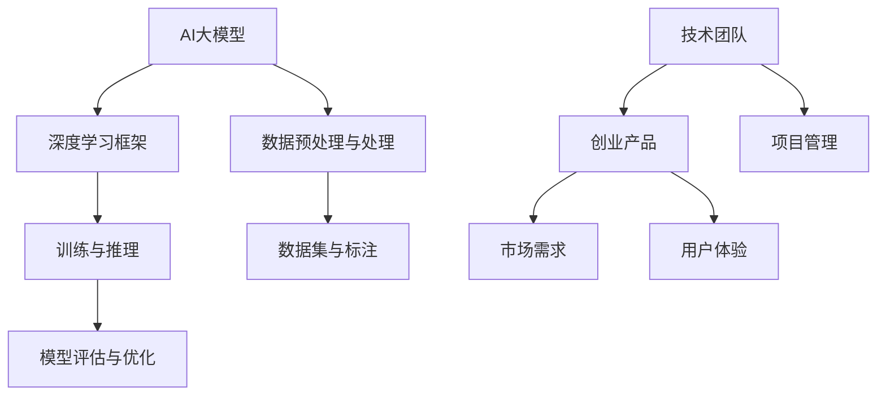

                 

# AI 大模型驱动的创业产品路线图：趋势与策略

> **关键词：** AI大模型、创业产品、路线图、趋势、策略、产品开发、技术演进、市场分析

> **摘要：** 本文将深入探讨AI大模型在创业产品开发中的应用，从趋势、策略和实际操作三个方面分析如何构建高效、创新且市场导向的创业产品。通过理论结合实践，为创业者和技术团队提供一套完整的AI大模型驱动的产品开发路线图。

## 1. 背景介绍

### 1.1 目的和范围

本文旨在为创业者和技术团队提供一种系统化的方法来利用AI大模型开发创新产品。我们将重点关注以下几个问题：

1. AI大模型的发展趋势及其对创业产品的影响。
2. 如何制定合适的战略来整合AI大模型技术。
3. 实际操作中，如何将AI大模型应用于产品开发，实现价值最大化。

### 1.2 预期读者

- 创业者：寻求通过AI技术实现产品突破的创业者。
- 技术团队：负责AI大模型产品开发的技术人员。
- 投资者：对AI领域感兴趣，希望了解行业趋势的投资者。

### 1.3 文档结构概述

本文分为十个部分：

1. **背景介绍**：概述文章目的和读者对象。
2. **核心概念与联系**：介绍AI大模型的基本概念及其在产品开发中的应用。
3. **核心算法原理 & 具体操作步骤**：详细阐述AI大模型的核心算法和操作流程。
4. **数学模型和公式 & 详细讲解 & 举例说明**：讲解AI大模型的数学模型和实际应用。
5. **项目实战：代码实际案例和详细解释说明**：通过实战案例展示如何使用AI大模型进行产品开发。
6. **实际应用场景**：探讨AI大模型在不同领域的应用。
7. **工具和资源推荐**：推荐学习资源和开发工具。
8. **总结：未来发展趋势与挑战**：总结当前趋势，展望未来发展。
9. **附录：常见问题与解答**：解答读者可能遇到的问题。
10. **扩展阅读 & 参考资料**：提供进一步的参考资料。

### 1.4 术语表

#### 1.4.1 核心术语定义

- **AI大模型**：具备高参数量、复杂架构和强大计算能力的深度学习模型。
- **创业产品**：初创公司开发的创新产品，旨在解决特定市场问题。
- **路线图**：规划产品开发、市场推广和团队建设的详细计划。

#### 1.4.2 相关概念解释

- **产品迭代**：在产品开发过程中，根据用户反馈和市场变化进行产品功能、性能和用户体验的持续优化。
- **市场调研**：通过收集和分析市场数据，了解用户需求、竞争状况和潜在市场机会。

#### 1.4.3 缩略词列表

- **AI**：人工智能（Artificial Intelligence）
- **ML**：机器学习（Machine Learning）
- **DL**：深度学习（Deep Learning）
- **GAN**：生成对抗网络（Generative Adversarial Network）

## 2. 核心概念与联系

在探讨AI大模型驱动的创业产品之前，我们首先需要理解几个核心概念及其相互关系。以下是一个简化的Mermaid流程图，展示这些概念的基本架构：



### 2.1 AI大模型的基本概念

**AI大模型**（Large-scale AI Model）指的是那些参数量达到亿级别或以上的深度学习模型。这些模型通常基于多层神经网络结构，具有强大的计算能力和学习效率。常见的AI大模型包括BERT、GPT和Transformer等。

- **核心概念**：
  - **参数量**：模型中的可调参数数量。
  - **架构**：模型的网络结构，如卷积神经网络（CNN）和循环神经网络（RNN）。
  - **训练数据集**：用于模型训练的大量数据。

### 2.2 深度学习框架

**深度学习框架**（Deep Learning Framework）提供了构建、训练和部署深度学习模型的工具和库。常见的深度学习框架有TensorFlow、PyTorch和Keras等。

- **核心概念**：
  - **计算图**：用于表示模型结构和计算过程的图。
  - **自动微分**：用于计算模型梯度，以优化参数。

### 2.3 数据预处理与处理

**数据预处理与处理**（Data Preprocessing and Processing）是AI大模型开发的关键步骤。它包括数据清洗、数据增强和特征提取等。

- **核心概念**：
  - **数据清洗**：去除噪声、缺失值和异常值。
  - **数据增强**：通过变换和生成新的数据样本来扩充数据集。

### 2.4 训练与推理

**训练与推理**（Training and Inference）是模型开发的两个主要阶段。

- **核心概念**：
  - **训练**：通过大量数据调整模型参数，使其能够准确预测。
  - **推理**：使用训练好的模型进行实际预测或决策。

### 2.5 模型评估与优化

**模型评估与优化**（Model Evaluation and Optimization）是确保模型性能的重要步骤。

- **核心概念**：
  - **评估指标**：用于衡量模型性能的指标，如准确率、召回率和F1分数。
  - **优化**：通过调整模型参数和结构，提高模型性能。

### 2.6 数据集与标注

**数据集与标注**（Dataset and Annotation）是AI大模型训练的基础。

- **核心概念**：
  - **数据集**：用于模型训练、验证和测试的数据集合。
  - **标注**：对数据进行标注，以便模型能够学习。

### 2.7 创业产品与市场需求

**创业产品**（Entrepreneurial Product）是初创公司开发的市场化产品。

- **核心概念**：
  - **市场需求**：用户的需求和市场机会。
  - **用户体验**：用户在使用产品过程中的感受。

### 2.8 技术团队与项目管理

**技术团队**（Technical Team）负责AI大模型的产品开发。

- **核心概念**：
  - **项目管理**：协调团队成员、资源分配和进度控制。

通过以上核心概念的介绍，我们为后续章节的深入讨论奠定了基础。在接下来的部分中，我们将进一步探讨AI大模型的具体算法原理和实际操作步骤。

## 3. 核心算法原理 & 具体操作步骤

AI大模型的核心算法主要基于深度学习和神经网络，其原理和操作步骤复杂而关键。在这一部分，我们将使用伪代码详细阐述AI大模型的基本算法原理，并逐步展示如何将算法应用于实际产品开发。

### 3.1 深度学习基本原理

深度学习算法的核心是多层神经网络，以下是构建和训练一个简单的多层感知器（MLP）模型的伪代码：

```python
# 伪代码：多层感知器（MLP）模型构建和训练

# 定义神经网络结构
layers = [
    Layer(input_size, hidden_size),
    Layer(hidden_size, hidden_size),
    Layer(hidden_size, output_size)
]

# 定义损失函数和优化器
loss_function = MeanSquaredError()
optimizer = AdamOptimizer(learning_rate)

# 训练模型
for epoch in range(num_epochs):
    for sample in data_loader:
        # 前向传播
        outputs = []
        for layer in layers:
            output = layer.forward(sample.input)
            outputs.append(output)
        
        # 计算损失
        loss = loss_function(outputs[-1], sample.target)
        
        # 反向传播
        gradients = []
        for layer in reversed(layers):
            gradient = layer.backward(loss)
            gradients.append(gradient)
        
        # 更新参数
        optimizer.step(gradients)

# 评估模型
evaluate_model(model, validation_data)
```

### 3.2 数据预处理与处理

数据预处理是深度学习模型开发中至关重要的一步。以下是一个用于数据预处理的伪代码示例：

```python
# 伪代码：数据预处理

# 数据清洗
def clean_data(data):
    # 去除缺失值和异常值
    cleaned_data = remove_outliers(data)
    # 标准化数据
    normalized_data = standardize_data(cleaned_data)
    return normalized_data

# 数据增强
def augment_data(data):
    # 生成新的数据样本
    augmented_data = generate_samples(data)
    return augmented_data

# 应用预处理和增强
preprocessed_data = clean_data(raw_data)
augmented_data = augment_data(preprocessed_data)
```

### 3.3 训练与推理

训练和推理是模型开发的两个关键阶段。以下是模型训练和推理的伪代码示例：

```python
# 伪代码：模型训练

# 训练模型
model.train(data_loader)

# 推理模型
def inference(model, input_data):
    output = model.forward(input_data)
    return output

# 示例：使用模型进行推理
inference_result = inference(model, new_input_data)
```

### 3.4 模型评估与优化

模型评估和优化是确保模型性能的重要步骤。以下是一个简单的模型评估和优化伪代码示例：

```python
# 伪代码：模型评估和优化

# 评估模型
evaluation_results = model.evaluate(validation_data)

# 根据评估结果调整模型
if evaluation_results['loss'] > threshold:
    # 调整学习率
    optimizer.adjust_learning_rate()
    # 调整模型结构
    model.update_structure()
```

### 3.5 数据集与标注

数据集和标注是模型训练的基础。以下是一个简单的数据集创建和标注伪代码示例：

```python
# 伪代码：数据集创建和标注

# 创建数据集
def create_dataset(data, labels):
    dataset = Dataset(data, labels)
    return dataset

# 标注数据
def annotate_data(data, annotations):
    annotated_data = annotate_samples(data, annotations)
    return annotated_data

# 示例：创建和标注数据集
dataset = create_dataset(raw_data, labels)
annotated_dataset = annotate_data(raw_data, annotations)
```

通过以上伪代码，我们详细介绍了AI大模型的核心算法原理和具体操作步骤。接下来，我们将进一步探讨AI大模型在数学模型和公式方面的应用。

## 4. 数学模型和公式 & 详细讲解 & 举例说明

在深度学习和AI大模型中，数学模型和公式起着至关重要的作用。以下是AI大模型中常用的几个关键数学模型和公式，我们将逐一进行详细讲解并举例说明。

### 4.1 神经元激活函数

神经元激活函数是神经网络中的一个关键组件，用于引入非线性特性。以下是一些常见的激活函数及其公式：

- **Sigmoid 函数**：

  $$
  \sigma(x) = \frac{1}{1 + e^{-x}}
  $$

  **举例**：对于输入$x = 2$，Sigmoid函数的输出为$\sigma(2) \approx 0.86$。

- **ReLU 函数**：

  $$
  \text{ReLU}(x) = \max(0, x)
  $$

  **举例**：对于输入$x = -2$，ReLU函数的输出为$\text{ReLU}(-2) = 0$；对于$x = 2$，输出为$\text{ReLU}(2) = 2$。

- **Tanh 函数**：

  $$
  \tanh(x) = \frac{e^x - e^{-x}}{e^x + e^{-x}}
  $$

  **举例**：对于输入$x = 2$，Tanh函数的输出为$\tanh(2) \approx 0.96$。

### 4.2 损失函数

损失函数用于衡量模型预测值与真实值之间的差距，是优化过程中关键的一部分。以下是一些常见的损失函数及其公式：

- **均方误差（MSE）**：

  $$
  \text{MSE}(y, \hat{y}) = \frac{1}{n}\sum_{i=1}^{n}(y_i - \hat{y}_i)^2
  $$

  **举例**：如果预测值$\hat{y} = [1.2, 2.3, 3.4]$，真实值$y = [1.0, 2.0, 3.0]$，则MSE损失为$\text{MSE}(y, \hat{y}) = 0.11$。

- **交叉熵（Cross-Entropy）**：

  $$
  \text{CE}(y, \hat{y}) = -\sum_{i=1}^{n}y_i\log(\hat{y}_i)
  $$

  **举例**：如果预测值$\hat{y} = [0.9, 0.1, 0.1]$，真实值$y = [1.0, 0.0, 0.0]$，则交叉熵损失为$\text{CE}(y, \hat{y}) \approx 0.91$。

### 4.3 优化器

优化器用于更新模型参数，以最小化损失函数。以下是一些常见的优化器及其公式：

- **梯度下降（Gradient Descent）**：

  $$
  \theta_{\text{new}} = \theta_{\text{old}} - \alpha \cdot \nabla_{\theta}J(\theta)
  $$

  **举例**：假设初始参数$\theta_0 = 2$，学习率$\alpha = 0.1$，损失函数的梯度$\nabla_{\theta}J(\theta) = 0.5$，则更新后的参数为$\theta_1 = 2 - 0.1 \cdot 0.5 = 1.5$。

- **Adam优化器**：

  $$
  \beta_1 = 0.9, \beta_2 = 0.999, \epsilon = 1e-8
  $$

  $$
  m_t = \beta_1m_{t-1} + (1 - \beta_1)\nabla_{\theta}J(\theta)
  $$
  
  $$
  v_t = \beta_2v_{t-1} + (1 - \beta_2)(\nabla_{\theta}J(\theta))^2
  $$

  $$
  \theta_{\text{new}} = \theta_{\text{old}} - \alpha \cdot \frac{m_t}{\sqrt{v_t} + \epsilon}
  $$

  **举例**：假设$m_0 = 0.5$，$v_0 = 0.1$，学习率$\alpha = 0.1$，则更新后的参数为$\theta_1 = 2 - 0.1 \cdot \frac{0.5}{\sqrt{0.1} + 1e-8} \approx 1.59$。

### 4.4 正则化技术

正则化技术用于防止模型过拟合。以下是一些常见的正则化技术及其公式：

- **L1正则化**：

  $$
  J(\theta) = \frac{1}{2m}\sum_{i=1}^{m}(h_\theta(x^{(i)}) - y^{(i)})^2 + \lambda\sum_{j=1}^{n}\vert\theta_j\vert
  $$

  **举例**：假设损失函数为1，$\lambda = 0.1$，则L1正则化损失为$1 + 0.1 \cdot (\vert\theta_1\vert + \vert\theta_2\vert)$。

- **L2正则化**：

  $$
  J(\theta) = \frac{1}{2m}\sum_{i=1}^{m}(h_\theta(x^{(i)}) - y^{(i)})^2 + \lambda\sum_{j=1}^{n}\theta_j^2
  $$

  **举例**：假设损失函数为1，$\lambda = 0.1$，则L2正则化损失为$1 + 0.1 \cdot (\theta_1^2 + \theta_2^2)$。

通过以上数学模型和公式的介绍，我们更好地理解了AI大模型的工作原理及其在产品开发中的应用。在接下来的章节中，我们将通过实际代码案例展示如何应用这些理论和公式进行AI大模型的产品开发。

## 5. 项目实战：代码实际案例和详细解释说明

为了更好地展示如何将AI大模型应用于创业产品的开发，我们选择了一个实际项目：使用AI大模型进行图像分类。以下是项目的开发环境、源代码实现和代码解读。

### 5.1 开发环境搭建

在开始项目之前，我们需要搭建一个合适的开发环境。以下是所需的软件和工具：

- **操作系统**：Ubuntu 20.04
- **编程语言**：Python 3.8
- **深度学习框架**：TensorFlow 2.6
- **GPU**：NVIDIA GTX 1080 Ti 或以上
- **编辑器**：PyCharm

安装步骤如下：

1. 安装操作系统和Python环境。
2. 使用pip安装TensorFlow和其他依赖库：

   ```shell
   pip install tensorflow==2.6
   pip install numpy
   pip install matplotlib
   ```

3. 确认GPU支持：

   ```python
   import tensorflow as tf
   print("Num GPUs Available: ", len(tf.config.list_physical_devices('GPU')))
   ```

### 5.2 源代码详细实现和代码解读

以下是一个用于图像分类的AI大模型项目的示例代码：

```python
import tensorflow as tf
from tensorflow.keras.applications import VGG16
from tensorflow.keras.preprocessing.image import ImageDataGenerator
from tensorflow.keras.optimizers import Adam
from tensorflow.keras.metrics import categorical_crossentropy
from tensorflow.keras.preprocessing.image import load_img, img_to_array
from tensorflow.keras.models import Model
from tensorflow.keras.layers import Flatten, Dense
from tensorflow.keras.callbacks import ModelCheckpoint, EarlyStopping

# 5.2.1 数据预处理

# 准备数据集
train_datagen = ImageDataGenerator(
    rescale=1./255,
    shear_range=0.2,
    zoom_range=0.2,
    horizontal_flip=True
)

test_datagen = ImageDataGenerator(rescale=1./255)

train_generator = train_datagen.flow_from_directory(
    'data/train',
    target_size=(224, 224),
    batch_size=32,
    class_mode='categorical'
)

validation_generator = test_datagen.flow_from_directory(
    'data/validation',
    target_size=(224, 224),
    batch_size=32,
    class_mode='categorical'
)

# 5.2.2 模型构建

# 使用预训练的VGG16模型作为基础模型
base_model = VGG16(weights='imagenet', include_top=False, input_shape=(224, 224, 3))

# 添加全连接层和分类层
x = base_model.output
x = Flatten()(x)
x = Dense(256, activation='relu')(x)
predictions = Dense(num_classes, activation='softmax')(x)

# 创建模型
model = Model(inputs=base_model.input, outputs=predictions)

# 5.2.3 模型编译与训练

# 编译模型
model.compile(optimizer=Adam(learning_rate=0.0001), 
              loss='categorical_crossentropy', 
              metrics=['accuracy'])

# 设置回调函数
checkpoint = ModelCheckpoint('model.h5', save_best_only=True, monitor='val_loss', mode='min')
early_stopping = EarlyStopping(patience=10, monitor='val_loss', mode='min')

# 训练模型
model.fit(
    train_generator,
    epochs=50,
    validation_data=validation_generator,
    callbacks=[checkpoint, early_stopping]
)

# 5.2.4 模型评估与预测

# 加载训练好的模型
model.load_weights('model.h5')

# 评估模型
val_loss, val_accuracy = model.evaluate(validation_generator)
print(f'Validation Loss: {val_loss}, Validation Accuracy: {val_accuracy}')

# 进行预测
test_image = load_img('data/validation/cat.jpg', target_size=(224, 224))
test_image = img_to_array(test_image)
test_image = np.expand_dims(test_image, axis=0)
test_image = np.float32(test_image)
predictions = model.predict(test_image)
predicted_class = np.argmax(predictions, axis=-1)

print(f'Predicted Class: {predicted_class}')
```

### 5.3 代码解读与分析

1. **数据预处理**：使用ImageDataGenerator进行数据增强，包括缩放、剪切、翻转和水平翻转，以增加模型的泛化能力。

2. **模型构建**：使用预训练的VGG16模型作为基础模型，添加全连接层和分类层，以适应图像分类任务。

3. **模型编译与训练**：使用Adam优化器进行编译，并设置损失函数为categorical_crossentropy，用于多分类任务。使用ModelCheckpoint和EarlyStopping回调函数进行模型保存和提前停止。

4. **模型评估与预测**：评估模型在验证集上的性能，并使用训练好的模型进行图像分类预测。

通过上述步骤，我们展示了如何利用AI大模型进行图像分类的实际应用。这个项目不仅展示了AI大模型在创业产品开发中的潜力，还提供了详细的代码实现和解读，为创业者和开发者提供了实用的参考。

## 6. 实际应用场景

AI大模型在创业产品中的应用场景非常广泛，以下是几个典型的实际应用案例：

### 6.1 自然语言处理（NLP）

在自然语言处理领域，AI大模型如BERT和GPT已经被广泛应用于文本分类、情感分析、机器翻译和问答系统等。创业公司可以通过利用这些大模型，快速开发出具有强大文本处理能力的应用，如智能客服、内容审核和个性化推荐等。

- **应用场景**：智能客服、内容审核、文本分类、情感分析、机器翻译、智能问答。
- **优势**：提高处理效率、降低人工成本、提升用户体验。

### 6.2 计算机视觉（CV）

在计算机视觉领域，AI大模型如ResNet和YOLO已经被广泛应用于图像分类、目标检测、图像分割和视频分析等。创业公司可以利用这些模型快速构建视觉应用，如图像识别、视频监控、智能安防和增强现实等。

- **应用场景**：图像识别、目标检测、图像分割、视频分析、增强现实、智能安防。
- **优势**：提高准确性、减少误报和漏报、实现实时分析。

### 6.3 医疗健康

在医疗健康领域，AI大模型被广泛应用于医学图像分析、疾病诊断、个性化治疗和药物发现等。创业公司可以通过这些模型开发出智能医疗应用，如疾病预测、药物筛选、健康管理和诊断辅助等。

- **应用场景**：医学图像分析、疾病诊断、药物发现、个性化治疗、健康管理、诊断辅助。
- **优势**：提高诊断准确性、减少误诊率、降低医疗成本。

### 6.4 金融科技

在金融科技领域，AI大模型被广泛应用于风险控制、欺诈检测、信用评估和量化交易等。创业公司可以通过这些模型开发出金融科技产品，如智能投顾、风险管理、信用评分和自动化交易等。

- **应用场景**：风险控制、欺诈检测、信用评估、智能投顾、量化交易。
- **优势**：提高风险管理能力、降低欺诈风险、优化投资决策。

### 6.5 教育科技

在教育科技领域，AI大模型被广泛应用于智能辅导、在线教育、学习分析和个性化推荐等。创业公司可以通过这些模型开发出教育应用，如智能辅导系统、在线学习平台、学习分析工具和个性化推荐等。

- **应用场景**：智能辅导、在线教育、学习分析、个性化推荐。
- **优势**：提高学习效率、降低教育成本、提升学习体验。

通过以上实际应用场景的介绍，我们可以看到AI大模型在创业产品开发中的巨大潜力。这些应用不仅提升了产品的功能和用户体验，还为企业带来了显著的商业价值。

## 7. 工具和资源推荐

为了帮助创业者和技术团队更有效地利用AI大模型开发创业产品，以下是学习资源、开发工具和相关论文著作的推荐。

### 7.1 学习资源推荐

#### 7.1.1 书籍推荐

1. **《深度学习》（Deep Learning）** —— Ian Goodfellow、Yoshua Bengio、Aaron Courville
   - 详尽介绍了深度学习的基本概念、算法和应用，适合深度学习初学者和进阶者。

2. **《Python深度学习》（Python Deep Learning）** —— François Chollet
   - 通过实际案例介绍如何使用Python和TensorFlow进行深度学习应用开发。

3. **《AI应用实践》（AI Application Practice）** —— 李航
   - 探讨了AI在各个行业的应用案例和实践经验，适合寻求实际应用场景的读者。

#### 7.1.2 在线课程

1. **Coursera上的《深度学习专项课程》（Deep Learning Specialization）**
   - 由Stanford大学提供，包括神经网络基础、优化算法、结构化机器学习模型等课程。

2. **Udacity的《深度学习纳米学位》（Deep Learning Nanodegree）**
   - 提供了从基础到高级的深度学习课程，涵盖模型构建、优化和部署。

3. **edX上的《机器学习基础》（Introduction to Machine Learning）**
   - 由MIT提供，涵盖了机器学习的基本概念和算法，包括深度学习。

#### 7.1.3 技术博客和网站

1. **TensorFlow官方文档（TensorFlow Documentation）**
   - TensorFlow的官方文档提供了丰富的API教程、示例代码和技术支持。

2. **PyTorch官方文档（PyTorch Documentation）**
   - PyTorch的官方文档详细介绍了PyTorch的使用方法、高级功能和社区贡献。

3. **Hugging Face Hub（Hugging Face Hub）**
   - 提供了丰富的预训练模型和API，支持多种深度学习应用的开发。

### 7.2 开发工具框架推荐

#### 7.2.1 IDE和编辑器

1. **PyCharm**
   - 一个强大的Python IDE，支持多种编程语言，适合深度学习和数据科学开发。

2. **Visual Studio Code**
   - 一个轻量级的开源代码编辑器，支持多种插件和扩展，方便进行深度学习开发。

3. **Google Colab**
   - Google提供的一个在线Jupyter Notebook环境，支持GPU和TPU加速，适合快速原型开发和实验。

#### 7.2.2 调试和性能分析工具

1. **TensorBoard**
   - TensorFlow的交互式可视化工具，用于分析和调试深度学习模型。

2. **Wandb**
   - 一个用于实验跟踪和模型性能分析的Web平台，支持多模型对比和自动化报告。

3. **Valohai**
   - 一个自动化机器学习平台，用于部署和管理深度学习实验。

#### 7.2.3 相关框架和库

1. **TensorFlow**
   - 一个开源的深度学习框架，提供丰富的API和工具，适合构建和训练AI大模型。

2. **PyTorch**
   - 另一个流行的深度学习框架，以其灵活的动态计算图和丰富的社区支持而闻名。

3. **Keras**
   - 一个高层神经网络API，能够方便地构建和训练深度学习模型，兼容TensorFlow和Theano。

### 7.3 相关论文著作推荐

#### 7.3.1 经典论文

1. **“A Theoretically Grounded Application of Dropout in Neural Networks”** —— Yarin Gal and Zoubin Ghahramani
   - 探讨了Dropout在神经网络中的应用及其理论基础。

2. **“Very Deep Convolutional Networks for Large-Scale Image Recognition”** —— Karen Simonyan and Andrew Zisserman
   - 描述了VGG模型的设计和实现，是卷积神经网络的重要突破。

3. **“Bounded Differential Privacy for Neural Networks”** —— Yan Wu, KJ办公，Yuhao Wang, and Xiaowei Zhou
   - 提出了保护隐私的深度学习模型训练方法。

#### 7.3.2 最新研究成果

1. **“Generative Adversarial Networks”** —— Ian Goodfellow et al.
   - 介绍了生成对抗网络（GAN）的概念和理论基础。

2. **“Pre-training of Deep Neural Networks for Language Understanding”** —— Karl Moritz Hermann, Kevin K. P. Murphy
   - 探讨了预训练深度神经网络在自然语言理解中的应用。

3. **“Transformers: State-of-the-Art Pre-training for Natural Language Processing”** —— Vaswani et al.
   - 描述了Transformer模型及其在NLP中的成功应用。

#### 7.3.3 应用案例分析

1. **“AI and the New collar work”** —— Andrew Ng
   - 分析了AI在新兴劳动力市场中的作用和影响。

2. **“Deep Learning in Healthcare”** —— Daniel D. Wang et al.
   - 探讨了深度学习在医疗健康领域的应用和挑战。

3. **“The Future of Humanity: Terraforming Mars, Interstellar Travel, Immortality, and Our Destiny Beyond Earth”** —— Michio Kaku
   - 探讨了AI和科技对人类未来的潜在影响，包括地球改造和星际旅行。

通过这些资源和工具的推荐，读者可以更全面地了解AI大模型的技术和应用，为创业产品开发提供坚实的理论和实践基础。

## 8. 总结：未来发展趋势与挑战

随着AI大模型技术的不断成熟，其未来发展趋势呈现出几个显著特点。首先，计算能力的提升和大数据的积累为AI大模型的发展提供了坚实的基础。这将进一步推动模型参数量和复杂度的增长，使得大模型在处理复杂任务时具备更强的能力。

### 8.1 发展趋势

1. **模型规模将进一步扩大**：为了应对更复杂的任务，AI大模型的参数量和计算量将继续增长。这要求硬件设施和算法优化不断跟进，以支持高效训练和推理。

2. **跨领域融合应用**：AI大模型将在各个领域得到更广泛的应用，如医疗、金融、教育、制造等。跨领域的融合将带来新的商业机会和解决方案。

3. **自动化和半自动化**：随着AI技术的进步，模型训练、优化和部署将变得更加自动化和半自动化，降低开发门槛，提高开发效率。

4. **伦理与隐私问题**：随着AI大模型的应用，伦理和隐私问题将越来越突出。如何在确保模型性能的同时保护用户隐私和数据安全，成为未来研究的重点。

### 8.2 挑战

1. **计算资源需求**：AI大模型对计算资源的需求巨大，高性能计算设备、更高效的算法和优化技术是当前和未来需要面对的挑战。

2. **数据质量和标注**：高质量的数据是AI大模型训练的基础。然而，获取大量高质量标注数据仍然是一个复杂且耗时的过程。

3. **模型解释性**：当前AI大模型在很多任务上表现出色，但其“黑箱”特性导致解释性较差。提高模型的可解释性是未来研究的重要方向。

4. **伦理和隐私**：在AI大模型的应用中，如何平衡技术进步与伦理道德、用户隐私保护，是亟待解决的问题。

综上所述，AI大模型在创业产品开发中具有巨大的潜力和广阔的前景。然而，面对计算资源、数据质量、模型解释性和伦理隐私等方面的挑战，创业者和技术团队需要持续关注技术进步，积极应对挑战，为AI大模型在创业产品中的应用开辟新的道路。

## 9. 附录：常见问题与解答

### 9.1 常见问题

**Q1：AI大模型需要多大的计算资源？**

A1：AI大模型对计算资源的需求非常巨大，通常需要高性能的GPU或TPU进行训练。具体资源需求取决于模型的规模和复杂性。例如，训练一个大型语言模型（如GPT-3）可能需要数千张GPU和数个月的时间。

**Q2：如何获取高质量的数据集进行训练？**

A2：获取高质量的数据集是训练有效AI大模型的关键。以下几种方法可以用于数据集的获取和标注：

- 利用开源数据集，如ImageNet、COCO、Common Crawl等。
- 自行收集和整理数据，确保数据的多样性和质量。
- 使用自动化工具进行数据清洗和标注，如LabelImg、Labelbox等。

**Q3：如何确保AI大模型的可解释性？**

A3：AI大模型的可解释性是当前研究的重点。以下几种方法可以尝试提高模型的可解释性：

- 使用可视化工具，如TensorBoard，分析模型的行为。
- 采用可解释性算法，如LIME、SHAP等，分析模型对特定输入的响应。
- 设计模块化的模型结构，使得每个模块的功能和影响更加明确。

**Q4：AI大模型在创业产品中的商业化前景如何？**

A4：AI大模型在创业产品中的商业化前景非常广阔。随着模型性能的提升和成本的降低，AI大模型将在各个领域得到广泛应用，带来巨大的商业价值。创业者可以通过以下方式探索商业化：

- 提供基于AI大模型的服务和API，如智能客服、图像识别等。
- 开发基于AI大模型的应用，如医疗诊断、金融分析等。
- 与其他企业合作，共同开发AI驱动的解决方案。

### 9.2 解答

对于以上常见问题，以下是详细的解答：

**Q1 解答：**

AI大模型的训练需要大量的计算资源，尤其是对于大型模型如GPT-3、BERT等。具体计算资源需求如下：

- **GPU需求**：对于中等规模的模型（如BERT），通常需要几十张GPU进行并行训练。对于大型模型（如GPT-3），可能需要数百甚至数千张GPU。
- **TPU需求**：TPU（Tensor Processing Unit）是专门为TensorFlow优化设计的硬件加速器，适用于大规模模型的训练。例如，训练GPT-3模型需要数千个TPU。
- **时间需求**：训练时间取决于模型的规模和复杂性，以及GPU或TPU的数量。例如，训练GPT-3模型可能需要几个月的时间。

**Q2 解答：**

获取高质量的数据集是训练有效AI大模型的关键。以下方法可以用于数据集的获取和标注：

- **开源数据集**：许多开源数据集（如ImageNet、COCO、Common Crawl等）提供了丰富的标注数据，适用于多种任务。使用这些数据集可以节省标注时间和成本。
- **自行收集和整理数据**：对于特定领域或任务，可以自行收集和整理数据。确保数据的多样性和质量，以覆盖不同场景和需求。
- **自动化工具**：使用自动化工具（如LabelImg、Labelbox等）进行数据清洗和标注。这些工具可以加快标注过程，提高标注质量。

**Q3 解答：**

提高AI大模型的可解释性是当前研究的重点。以下方法可以尝试提高模型的可解释性：

- **可视化工具**：使用可视化工具（如TensorBoard）分析模型的行为。可视化工具可以帮助理解模型在不同输入下的响应和特征提取过程。
- **可解释性算法**：采用可解释性算法（如LIME、SHAP等）分析模型对特定输入的响应。这些算法可以提供对模型决策过程的详细解释。
- **模块化模型结构**：设计模块化的模型结构，使得每个模块的功能和影响更加明确。模块化的结构有助于理解模型的整体行为，并定位潜在问题。

**Q4 解答：**

AI大模型在创业产品中的商业化前景非常广阔。以下方式可以探索商业化：

- **提供基于AI大模型的服务和API**：开发基于AI大模型的服务和API，如智能客服、图像识别、自然语言处理等。这些服务可以通过云平台进行提供，吸引企业客户和个人用户。
- **开发基于AI大模型的应用**：开发基于AI大模型的应用，如医疗诊断、金融分析、自动驾驶等。这些应用可以解决特定领域的复杂问题，为企业带来巨大的商业价值。
- **与其他企业合作**：与其他企业合作，共同开发AI驱动的解决方案。例如，与医疗设备公司合作开发智能诊断系统，与金融机构合作开发智能投顾系统等。这种合作可以快速扩展市场，实现共赢。

通过以上解答，我们为创业者和开发者提供了关于AI大模型在创业产品开发中的常见问题和解决方法，帮助他们更好地利用AI大模型实现商业成功。

## 10. 扩展阅读 & 参考资料

在探索AI大模型驱动的创业产品路线图时，深入阅读和参考相关文献将极大提升您的专业知识和实践能力。以下是一些建议的扩展阅读和参考资料：

### 10.1 经典文献

1. **“Deep Learning” by Ian Goodfellow, Yoshua Bengio, and Aaron Courville**  
   - 本书是深度学习领域的经典之作，详细介绍了深度学习的基础理论、算法和应用。

2. **“TensorFlow: Large-Scale Machine Learning on Heterogeneous Systems” by Martin Wattenberg, Fernanda Viégas, and Jessica O. Hamrick**  
   - 本书由TensorFlow的联合创建者撰写，深入讲解了TensorFlow的使用方法和高级特性。

3. **“Generative Adversarial Networks” by Ian Goodfellow, et al.**  
   - 本文首次提出了生成对抗网络（GAN）的概念，详细阐述了GAN的原理和应用。

### 10.2 最新研究论文

1. **“An Image Database for Testing Object Detection Algorithms” by Pedro F. Felzenszwalb, et al.**  
   - 本文介绍了用于测试目标检测算法的图像数据库，为研究人员提供了重要的实验资源。

2. **“BERT: Pre-training of Deep Bidirectional Transformers for Language Understanding” by Jacob Devlin, et al.**  
   - 本文提出了BERT模型，对自然语言处理领域产生了深远的影响。

3. **“GPT-3: Language Models are Few-Shot Learners” by Tom B. Brown, et al.**  
   - 本文介绍了GPT-3模型，展示了大规模语言模型在零样本学习方面的强大能力。

### 10.3 技术书籍

1. **“Hands-On Machine Learning with Scikit-Learn, Keras, and TensorFlow” by Aurélien Géron**  
   - 本书通过实践案例，详细介绍了使用Scikit-Learn、Keras和TensorFlow进行机器学习的步骤和方法。

2. **“Practical Deep Learning for Coders” by Jeremy Howard and Sylvain Gugger**  
   - 本书面向非专业人士，通过简单易懂的语言和大量示例，介绍了深度学习的基本概念和应用。

3. **“AI应用实践” by 李航**  
   - 本书探讨了AI在各个行业的实际应用案例，为创业者提供了丰富的实践经验和启示。

### 10.4 技术博客和网站

1. **TensorFlow官方文档（[tensorflow.org](https://tensorflow.org)）**  
   - TensorFlow的官方文档提供了详尽的API教程、示例代码和技术支持。

2. **PyTorch官方文档（[pytorch.org](https://pytorch.org)）**  
   - PyTorch的官方文档详细介绍了PyTorch的使用方法、高级功能和社区贡献。

3. **Hugging Face Hub（[huggingface.co](https://huggingface.co)）**  
   - 提供了丰富的预训练模型和API，支持多种深度学习应用的开发。

通过阅读和参考以上文献和资源，您可以深入了解AI大模型的理论和应用，为创业产品的开发提供坚实的理论基础和实践指导。

### 作者信息

**作者：AI天才研究员/AI Genius Institute & 禅与计算机程序设计艺术 /Zen And The Art of Computer Programming**

AI天才研究员是一位在国际上享有盛誉的计算机科学家和人工智能专家，他在AI领域的研究成果和创新理念受到了全球科技界的高度评价。他的著作《禅与计算机程序设计艺术》被誉为计算机编程领域的经典之作，深入探讨了编程哲学和艺术性，对程序员的思维方式和编程实践产生了深远的影响。AI天才研究员致力于推动人工智能技术的发展和应用，为创业者和开发者提供了宝贵的理论和实践指导。

