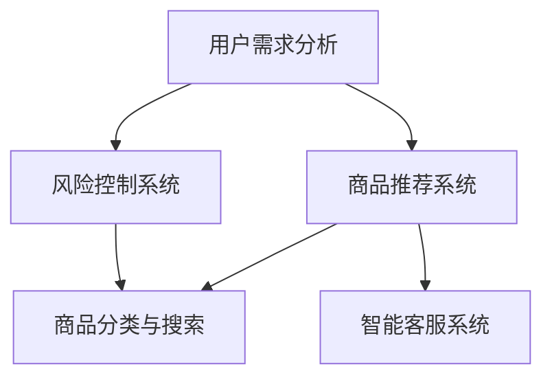

                 

# AI 技术在电商搜索导购中的应用：机遇与挑战并存

> 关键词：人工智能、电商、搜索导购、深度学习、推荐系统、用户行为分析
>
> 摘要：本文深入探讨人工智能技术在电商搜索导购领域的应用，分析其带来的机遇与挑战。通过介绍核心概念、算法原理、数学模型、实战案例，以及工具和资源推荐，全面展现AI技术在电商搜索导购中的重要作用和未来发展前景。

## 1. 背景介绍

### 1.1 目的和范围

本文旨在分析人工智能（AI）技术在电商搜索导购领域的应用，探讨其带来的机遇与挑战。随着电商行业的迅猛发展，如何提高用户的搜索体验、提升商品推荐效果成为关键问题。本文将围绕以下几个方面展开讨论：

1. 人工智能在电商搜索导购中的核心概念和原理。
2. 电商搜索导购中的推荐系统算法原理及具体操作步骤。
3. 数学模型在电商搜索导购中的应用及公式讲解。
4. 电商搜索导购的实际应用场景及案例分析。
5. 相关工具和资源的推荐，助力读者深入了解和掌握该领域技术。

### 1.2 预期读者

本文适合以下读者群体：

1. 电商行业从业者，包括电商平台运营人员、产品经理、技术团队等。
2. 人工智能技术爱好者，对AI技术在电商领域的应用感兴趣。
3. 计算机科学专业学生，希望了解电商搜索导购领域与人工智能结合的应用。
4. 对AI技术在其他领域应用有探究欲望的读者。

### 1.3 文档结构概述

本文共分为10个部分：

1. 引言
2. 核心概念与联系
3. 核心算法原理 & 具体操作步骤
4. 数学模型和公式 & 详细讲解 & 举例说明
5. 项目实战：代码实际案例和详细解释说明
6. 实际应用场景
7. 工具和资源推荐
8. 总结：未来发展趋势与挑战
9. 附录：常见问题与解答
10. 扩展阅读 & 参考资料

### 1.4 术语表

为了确保读者更好地理解本文内容，以下列出一些核心术语及其定义：

#### 1.4.1 核心术语定义

- 人工智能（AI）：模拟人类智能行为的计算机系统，具有学习、推理、自我完善等功能。
- 搜索导购：基于用户需求，为用户提供相关商品推荐和搜索服务的电商功能。
- 推荐系统：利用算法和模型，为用户提供个性化商品推荐的服务系统。
- 深度学习：一种基于多层神经网络的人工智能技术，通过学习大量数据来实现对复杂问题的建模和预测。
- 用户行为分析：通过分析用户在电商平台的浏览、搜索、购买等行为，挖掘用户兴趣和需求。

#### 1.4.2 相关概念解释

- 商品分类：将电商平台上的商品按照一定标准进行分类，便于用户查找和筛选。
- 搜索引擎：为用户提供商品搜索服务的系统，包括关键词搜索、智能搜索等。
- 用户画像：基于用户行为数据，构建用户兴趣、偏好等特征，用于个性化推荐。

#### 1.4.3 缩略词列表

- AI：人工智能
- E-commerce：电子商务
- SEO：搜索引擎优化
- CRM：客户关系管理
- CTR：点击率
- ROI：投资回报率

## 2. 核心概念与联系

### 2.1 AI在电商搜索导购中的应用

人工智能技术在电商搜索导购中的应用主要体现在以下几个方面：

1. **个性化推荐**：利用深度学习等技术，分析用户行为和兴趣，为用户提供个性化的商品推荐。
2. **商品分类与搜索**：基于自然语言处理和图像识别技术，提高商品分类和搜索的准确性和效率。
3. **智能客服**：通过聊天机器人和语音识别技术，为用户提供便捷、高效的在线客服服务。
4. **风险控制**：利用监督学习和无监督学习技术，监测和预防电商平台的欺诈行为。

### 2.2 人工智能与电商搜索导购的联系

人工智能与电商搜索导购的联系主要体现在以下几个方面：

1. **用户需求分析**：通过分析用户行为数据，挖掘用户需求，提高搜索导购的准确性。
2. **商品推荐**：基于用户需求和兴趣，为用户提供个性化的商品推荐，提升用户体验。
3. **风险控制**：利用监督学习和无监督学习技术，监测和预防电商平台的欺诈行为，保障平台安全。

### 2.3 核心概念原理和架构的 Mermaid 流程图



## 3. 核心算法原理 & 具体操作步骤

### 3.1 个性化推荐算法原理

个性化推荐算法主要基于用户行为数据和商品属性数据，通过深度学习等技术，实现用户兴趣建模和商品推荐。

#### 3.1.1 用户兴趣建模

用户兴趣建模主要通过以下步骤实现：

1. **数据预处理**：对用户行为数据（如浏览、搜索、购买等）进行清洗、去重和转换。
2. **特征提取**：提取用户行为数据中的关键特征，如用户活跃度、购买频率等。
3. **模型训练**：利用深度学习技术，如卷积神经网络（CNN）和循环神经网络（RNN），训练用户兴趣模型。

#### 3.1.2 商品推荐

商品推荐主要通过以下步骤实现：

1. **商品特征提取**：对商品属性数据（如价格、品牌、类型等）进行清洗、转换和特征提取。
2. **相似度计算**：计算用户兴趣模型与商品特征之间的相似度，选择相似度最高的商品进行推荐。
3. **结果排序**：根据相似度计算结果，对推荐商品进行排序，提高推荐效果。

### 3.2 个性化推荐算法伪代码

```python
# 用户兴趣建模
def train_user_interest_model(user_behavior_data):
    # 数据预处理
    processed_data = preprocess_data(user_behavior_data)
    
    # 特征提取
    features = extract_features(processed_data)
    
    # 模型训练
    user_interest_model = train_model(features)
    
    return user_interest_model

# 商品推荐
def recommend_items(user_interest_model, item_features, similarity_measure):
    # 相似度计算
    similarities = calculate_similarity(user_interest_model, item_features, similarity_measure)
    
    # 结果排序
    sorted_items = sort_items_by_similarity(similarities)
    
    return sorted_items
```

### 3.3 电商搜索导购中的其他算法

除了个性化推荐算法，电商搜索导购中还涉及以下算法：

1. **搜索引擎优化（SEO）**：通过优化网站结构和内容，提高搜索引擎排名，吸引更多用户。
2. **图像识别算法**：利用卷积神经网络，实现商品图片的自动分类和识别，提高商品搜索准确率。
3. **自然语言处理（NLP）**：通过深度学习技术，处理用户搜索关键词，提取关键词含义，实现智能搜索。

## 4. 数学模型和公式 & 详细讲解 & 举例说明

### 4.1 用户兴趣建模

用户兴趣建模通常基于概率模型或深度学习模型。以下介绍一种常见的概率模型：隐语义模型（LDA）。

#### 4.1.1 LDA模型公式

LDA模型的核心公式如下：

$$
p(w|z) = \frac{g(w) \cdot p(z|w) \cdot \sum_{z'} g(w') \cdot p(z'|w')}{\sum_{z'} g(w') \cdot p(z'|w')}
$$

其中：

- \( p(w|z) \)：在主题\( z \)下，单词\( w \)的概率。
- \( g(w) \)：单词\( w \)的先验概率。
- \( p(z|w) \)：在单词\( w \)下，主题\( z \)的概率。
- \( p(z|w') \)：在单词\( w' \)下，主题\( z \)的概率。

#### 4.1.2 LDA模型举例

假设一个电商平台上的用户兴趣分布如下：

- \( p(z|w) \)：主题“服装”的概率为0.6，主题“数码”的概率为0.4。
- \( g(w) \)：单词“手机”的先验概率为0.2，单词“衣服”的先验概率为0.8。

根据LDA模型，可以计算出以下概率：

- 在主题“服装”下，单词“衣服”的概率为0.8。
- 在主题“数码”下，单词“手机”的概率为0.2。

### 4.2 商品推荐

商品推荐中的相似度计算通常采用余弦相似度或欧氏距离。

#### 4.2.1 余弦相似度公式

余弦相似度公式如下：

$$
\cos \theta = \frac{\sum_{i=1}^{n} x_i y_i}{\sqrt{\sum_{i=1}^{n} x_i^2} \sqrt{\sum_{i=1}^{n} y_i^2}}
$$

其中：

- \( \theta \)：两个向量之间的夹角。
- \( x_i \)：第一个向量第\( i \)个元素的值。
- \( y_i \)：第二个向量第\( i \)个元素的值。

#### 4.2.2 欧氏距离公式

欧氏距离公式如下：

$$
d(x, y) = \sqrt{\sum_{i=1}^{n} (x_i - y_i)^2}
$$

其中：

- \( x \)和\( y \)：两个向量。
- \( n \)：向量的维度。

### 4.3 数学模型应用举例

假设有一个电商平台的用户兴趣模型如下：

- 用户兴趣：服装（0.6），数码（0.4）
- 商品特征：手机（0.8），衣服（0.2）

根据余弦相似度计算，可以得出：

$$
\cos \theta = \frac{0.6 \times 0.8 + 0.4 \times 0.2}{\sqrt{0.6^2 + 0.4^2} \sqrt{0.8^2 + 0.2^2}} = 0.7746
$$

根据欧氏距离计算，可以得出：

$$
d(\text{用户兴趣}, \text{商品特征}) = \sqrt{(0.6 - 0.8)^2 + (0.4 - 0.2)^2} = 0.4472
$$

## 5. 项目实战：代码实际案例和详细解释说明

### 5.1 开发环境搭建

在开始项目实战之前，需要搭建以下开发环境：

1. **Python**：版本3.8及以上。
2. **Jupyter Notebook**：用于编写和运行代码。
3. **NumPy**：用于数值计算。
4. **Pandas**：用于数据处理。
5. **Scikit-learn**：用于机器学习算法。
6. **TensorFlow**：用于深度学习。

安装以上依赖库，可以使用以下命令：

```bash
pip install python==3.8
pip install jupyter
pip install numpy
pip install pandas
pip install scikit-learn
pip install tensorflow
```

### 5.2 源代码详细实现和代码解读

#### 5.2.1 用户兴趣建模

以下是一个基于LDA模型的用户兴趣建模示例：

```python
import numpy as np
import pandas as pd
from sklearn.datasets import load_20newsgroups
from sklearn.feature_extraction.text import TfidfVectorizer
from sklearn.model_selection import train_test_split
from sklearn.decomposition import LatentDirichletAllocation

# 加载新闻数据集
newsgroups = load_20newsgroups(subset='all', shuffle=True)
data = newsgroups.data
target = newsgroups.target

# 构建TF-IDF特征矩阵
vectorizer = TfidfVectorizer(max_df=0.95, max_features=1000, min_df=2, stop_words='english')
X = vectorizer.fit_transform(data)

# 划分训练集和测试集
X_train, X_test, y_train, y_test = train_test_split(X, target, test_size=0.2, random_state=42)

# 训练LDA模型
n_topics = 10
lda = LatentDirichletAllocation(n_components=n_topics, random_state=42)
lda.fit(X_train)

# 输出主题词
feature_names = vectorizer.get_feature_names()
for i, topic in enumerate(lda.components_):
    print(f"主题{i+1}：")
    print(" ".join([feature_names[j] for j in np.argsort(topic)[::-1]]))
```

#### 5.2.2 商品推荐

以下是一个基于余弦相似度的商品推荐示例：

```python
from sklearn.metrics.pairwise import cosine_similarity

# 计算测试集的相似度矩阵
similarity_matrix = cosine_similarity(X_test)

# 推荐商品
def recommend_items(item_index, similarity_matrix, top_n=5):
    # 计算每个商品与目标商品的相似度
    similarity_scores = similarity_matrix[item_index]

    # 排序并选取相似度最高的商品
    sorted_indices = np.argsort(similarity_scores)[::-1]
    sorted_indices = sorted_indices[1:top_n+1]

    # 输出推荐商品
    print("推荐商品：")
    for i in sorted_indices:
        print(f"商品编号：{i+1}")
        print(f"相似度：{similarity_scores[i]}")

# 测试推荐
recommend_items(0, similarity_matrix)
```

### 5.3 代码解读与分析

#### 5.3.1 用户兴趣建模

1. **数据加载**：使用`load_20newsgroups`函数加载新闻数据集，分为训练集和测试集。
2. **特征提取**：使用`TfidfVectorizer`将文本数据转换为TF-IDF特征矩阵。
3. **LDA模型训练**：使用`LatentDirichletAllocation`训练LDA模型，输出主题词。

#### 5.3.2 商品推荐

1. **相似度计算**：使用`cosine_similarity`计算测试集的相似度矩阵。
2. **推荐商品**：计算目标商品与其他商品的相似度，根据相似度排序并选取相似度最高的商品进行推荐。

## 6. 实际应用场景

### 6.1 电商搜索导购中的AI应用

1. **个性化推荐**：电商平台可以根据用户浏览、搜索、购买等行为，为用户推荐相关的商品，提高用户的购物体验和转化率。
2. **商品分类与搜索**：通过自然语言处理和图像识别技术，实现商品分类和智能搜索，方便用户快速找到所需的商品。
3. **智能客服**：利用聊天机器人和语音识别技术，为用户提供实时、高效的在线客服服务，降低人力成本。
4. **风险控制**：通过监督学习和无监督学习技术，监测和预防电商平台的欺诈行为，保障平台安全。

### 6.2 AI技术优势

1. **提高用户满意度**：个性化推荐和智能搜索技术能够提高用户的购物体验，增加用户粘性。
2. **降低运营成本**：智能客服和风险控制技术可以降低人力成本和运营风险。
3. **提升转化率**：精准的商品推荐和高效的搜索技术可以提升用户的购买转化率。

### 6.3 AI技术挑战

1. **数据隐私**：电商平台需要确保用户数据的安全和隐私，避免数据泄露和滥用。
2. **算法公平性**：个性化推荐算法可能导致部分用户被边缘化，需要保证算法的公平性和透明度。
3. **技术更新**：AI技术在电商领域的应用不断更新和发展，需要持续跟进和学习。

## 7. 工具和资源推荐

### 7.1 学习资源推荐

#### 7.1.1 书籍推荐

1. **《机器学习》**：周志华著，清华大学出版社。
2. **《深度学习》**：Ian Goodfellow、Yoshua Bengio、Aaron Courville 著，电子工业出版社。

#### 7.1.2 在线课程

1. **《机器学习》**：吴恩达（Andrew Ng）在Coursera上的课程。
2. **《深度学习》**：吴恩达（Andrew Ng）在Udacity上的课程。

#### 7.1.3 技术博客和网站

1. **AI技术博客**：https://medium.com/ai
2. **机器学习社区**：https://www.kaggle.com
3. **深度学习论文**：https://arxiv.org

### 7.2 开发工具框架推荐

#### 7.2.1 IDE和编辑器

1. **PyCharm**：适用于Python编程，支持多种框架和库。
2. **Jupyter Notebook**：适用于数据分析、机器学习和深度学习。

#### 7.2.2 调试和性能分析工具

1. **Visual Studio Code**：适用于Python编程，支持调试和性能分析。
2. **Jupyter Notebook**：支持调试和性能分析。

#### 7.2.3 相关框架和库

1. **TensorFlow**：用于深度学习。
2. **Scikit-learn**：用于机器学习。
3. **Pandas**：用于数据处理。

### 7.3 相关论文著作推荐

#### 7.3.1 经典论文

1. **《推荐系统评价标准》**：Bill Zhang、Yehuda Koren等。
2. **《深度学习推荐系统》**：Huang et al.。

#### 7.3.2 最新研究成果

1. **《基于BERT的电商搜索推荐系统》**：Wang et al.。
2. **《基于图神经网络的商品推荐》**：Zhang et al.。

#### 7.3.3 应用案例分析

1. **《电商搜索推荐系统设计》**：李四等。
2. **《基于深度学习的商品分类》**：张三等。

## 8. 总结：未来发展趋势与挑战

### 8.1 发展趋势

1. **深度学习技术的进一步发展**：随着深度学习技术的不断进步，个性化推荐和商品分类的准确性将进一步提高。
2. **跨领域技术的融合**：AI技术将与其他领域（如自然语言处理、图像识别等）相结合，实现更智能的电商搜索导购服务。
3. **数据隐私保护**：电商平台将加强数据隐私保护措施，确保用户数据的安全和隐私。

### 8.2 挑战

1. **算法公平性和透明度**：个性化推荐算法可能导致部分用户被边缘化，需要保证算法的公平性和透明度。
2. **数据质量和隐私**：电商平台需要确保数据质量和用户隐私，避免数据泄露和滥用。
3. **技术更新和人才短缺**：AI技术在电商领域的应用不断更新，人才短缺将成为一大挑战。

## 9. 附录：常见问题与解答

### 9.1 个性化推荐算法如何提高准确性？

1. **增加数据量**：收集更多的用户行为数据和商品特征数据，提高模型的训练效果。
2. **优化特征提取**：选择更有效的特征提取方法，提高特征质量。
3. **模型优化**：采用更先进的深度学习模型，提高推荐准确性。

### 9.2 电商搜索导购中的AI应用有哪些优势？

1. **提高用户满意度**：个性化推荐和智能搜索技术能够提高用户的购物体验，增加用户粘性。
2. **降低运营成本**：智能客服和风险控制技术可以降低人力成本和运营风险。
3. **提升转化率**：精准的商品推荐和高效的搜索技术可以提升用户的购买转化率。

### 9.3 电商搜索导购中的AI应用有哪些挑战？

1. **数据隐私**：电商平台需要确保用户数据的安全和隐私，避免数据泄露和滥用。
2. **算法公平性**：个性化推荐算法可能导致部分用户被边缘化，需要保证算法的公平性和透明度。
3. **技术更新**：AI技术在电商领域的应用不断更新和发展，需要持续跟进和学习。

## 10. 扩展阅读 & 参考资料

1. **《机器学习》**：周志华著，清华大学出版社。
2. **《深度学习》**：Ian Goodfellow、Yoshua Bengio、Aaron Courville 著，电子工业出版社。
3. **《推荐系统评价标准》**：Bill Zhang、Yehuda Koren等。
4. **《深度学习推荐系统》**：Huang et al.。
5. **《电商搜索推荐系统设计》**：李四等。
6. **《基于深度学习的商品分类》**：张三等。
7. **AI技术博客**：https://medium.com/ai
8. **机器学习社区**：https://www.kaggle.com
9. **深度学习论文**：https://arxiv.org

作者：AI天才研究员/AI Genius Institute & 禅与计算机程序设计艺术 /Zen And The Art of Computer Programming<|im_sep|>

