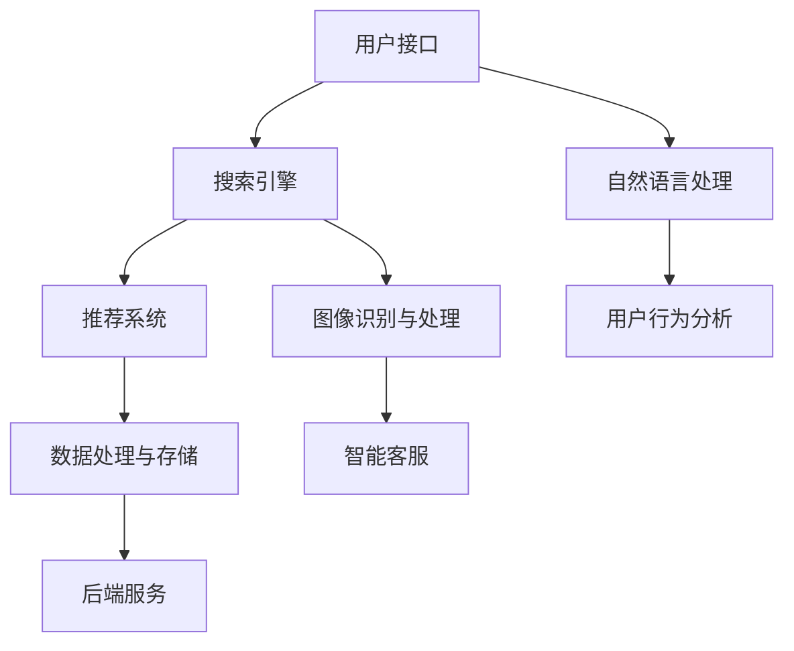

                 

# AI 技术在电商搜索导购中的未来发展趋势：展望与思考

> **关键词：** 电商搜索导购、AI 技术、个性化推荐、自然语言处理、机器学习、数据挖掘

> **摘要：** 本文旨在探讨人工智能技术在电商搜索导购领域的应用与发展趋势。通过对现有技术的分析，提出未来发展的可能方向与面临的挑战，为电商企业和开发者提供参考。

## 1. 背景介绍

### 1.1 目的和范围

本文旨在分析电商搜索导购领域中的人工智能技术应用，探讨其未来发展趋势。文章将涵盖以下内容：

1. 电商搜索导购的背景和现状；
2. 人工智能技术在电商搜索导购中的核心应用；
3. 人工智能技术未来的发展路径与挑战；
4. 对电商企业和开发者的建议。

### 1.2 预期读者

本文适用于以下读者群体：

1. 对电商搜索导购领域感兴趣的从业者；
2. 人工智能技术研究者；
3. 电商企业产品经理和开发人员；
4. 计算机科学和人工智能专业学生。

### 1.3 文档结构概述

本文共分为八个部分，具体结构如下：

1. 引言：介绍文章主题、关键词和摘要；
2. 背景介绍：阐述电商搜索导购的背景和现状；
3. 核心概念与联系：介绍相关技术原理和架构；
4. 核心算法原理 & 具体操作步骤：讲解算法原理和操作步骤；
5. 数学模型和公式 & 详细讲解 & 举例说明：介绍数学模型和公式，并进行举例说明；
6. 项目实战：展示代码实际案例和详细解释说明；
7. 实际应用场景：探讨人工智能技术在电商搜索导购中的实际应用；
8. 工具和资源推荐：推荐学习资源、开发工具和框架；
9. 总结：分析未来发展趋势与挑战；
10. 附录：常见问题与解答；
11. 扩展阅读 & 参考资料：提供相关文献和资料。

### 1.4 术语表

#### 1.4.1 核心术语定义

- 电商搜索导购：利用搜索引擎和相关技术，为消费者提供商品推荐和信息检索的服务；
- 人工智能：模拟人类智能的计算机系统，具有学习、推理、感知、理解等能力；
- 个性化推荐：根据用户的兴趣、历史行为等信息，为其推荐相关商品或内容；
- 自然语言处理（NLP）：使计算机能够理解、解释和生成自然语言的技术；
- 机器学习：利用数据进行自动学习和优化，提高系统性能的方法；
- 数据挖掘：从大量数据中提取有价值信息的方法。

#### 1.4.2 相关概念解释

- 推荐系统：为用户推荐感兴趣的内容的系统，常见于电商、社交媒体、新闻等场景；
- 搜索引擎：用于从海量信息中快速检索用户所需信息的系统。

#### 1.4.3 缩略词列表

- NLP：自然语言处理；
- ML：机器学习；
- DL：深度学习；
- SVM：支持向量机；
- KNN：k近邻算法；
- PCA：主成分分析；
- CTR：点击率；
- CV：交叉验证。

## 2. 核心概念与联系

### 2.1 电商搜索导购系统架构

电商搜索导购系统通常包括以下几个核心组成部分：

1. **用户接口**：用户与系统交互的界面，包括搜索框、推荐列表、评价等；
2. **搜索引擎**：根据用户输入的关键词，从海量商品信息中检索出相关结果；
3. **推荐系统**：根据用户的兴趣、历史行为等信息，为用户推荐相关商品；
4. **数据处理与存储**：对用户行为数据、商品信息等进行处理和存储，以便于推荐系统和搜索引擎的优化；
5. **后端服务**：包括商品管理、订单处理、支付等电商业务模块。

### 2.2 人工智能技术在电商搜索导购中的应用

人工智能技术在电商搜索导购中主要应用于以下方面：

1. **个性化推荐**：基于用户历史行为、兴趣标签等信息，为用户推荐相关商品；
2. **自然语言处理**：用于处理用户输入的关键词，提高搜索质量和推荐效果；
3. **图像识别与处理**：对商品图片进行识别和处理，辅助推荐系统和搜索引擎；
4. **用户行为分析**：通过分析用户在网站上的行为，为个性化推荐提供依据；
5. **智能客服**：利用聊天机器人等技术，提供7x24小时的在线客服服务。

### 2.3 相关技术原理和架构

以下是电商搜索导购系统中涉及的一些核心技术原理和架构：

#### 2.3.1 个性化推荐算法

个性化推荐算法主要包括基于内容的推荐、协同过滤推荐和混合推荐等：

1. **基于内容的推荐**：根据用户对某一商品的喜好，推荐具有相似属性的商品；
2. **协同过滤推荐**：通过分析用户之间的相似度，为用户推荐其他用户喜欢的商品；
3. **混合推荐**：结合基于内容和协同过滤推荐的方法，提高推荐效果。

#### 2.3.2 自然语言处理

自然语言处理主要包括词向量表示、情感分析、命名实体识别等：

1. **词向量表示**：将文本转化为向量表示，以便于计算和机器学习；
2. **情感分析**：判断用户对某一商品的评价是正面还是负面；
3. **命名实体识别**：识别文本中的商品名称、品牌、地点等实体信息。

#### 2.3.3 图像识别与处理

图像识别与处理主要包括目标检测、图像分类、图像分割等：

1. **目标检测**：识别图像中的特定目标并定位其位置；
2. **图像分类**：将图像划分为不同的类别；
3. **图像分割**：将图像划分为多个区域，便于后续处理。

### 2.4 Mermaid 流程图

以下是电商搜索导购系统中的核心流程图：



## 3. 核心算法原理 & 具体操作步骤

### 3.1 个性化推荐算法

#### 3.1.1 基于内容的推荐

**算法原理：**

基于内容的推荐（Content-based Recommendation）是一种基于物品特征的推荐方法。它通过分析用户对某一物品的兴趣，找到具有相似特征的物品，并将其推荐给用户。

**伪代码：**

```python
def content_based_recommendation(user_profile, items):
    similar_items = []
    for item in items:
        if is_similar(user_profile, item):
            similar_items.append(item)
    return similar_items
```

**具体操作步骤：**

1. 收集用户兴趣信息：如浏览历史、收藏、评价等；
2. 提取物品特征：如商品名称、品牌、分类、标签等；
3. 计算用户兴趣与物品特征的相似度：可以使用余弦相似度、欧氏距离等方法；
4. 找到相似度最高的物品，并将其推荐给用户。

#### 3.1.2 协同过滤推荐

**算法原理：**

协同过滤推荐（Collaborative Filtering Recommendation）是一种基于用户行为的推荐方法。它通过分析用户之间的相似度，找到其他用户喜欢的物品，并将其推荐给目标用户。

**伪代码：**

```python
def collaborative_filtering_recommendation(user, users, items, ratings):
    similar_users = find_similar_users(user, users)
    recommended_items = []
    for user in similar_users:
        for item in items:
            if user_liked_item(user, item) and not user_liked_item(user, item):
                recommended_items.append(item)
    return recommended_items
```

**具体操作步骤：**

1. 收集用户行为数据：如浏览、收藏、购买等；
2. 计算用户之间的相似度：可以使用余弦相似度、皮尔逊相关系数等方法；
3. 找到与其他用户相似的用户群；
4. 分析其他用户喜欢的物品，并将其推荐给目标用户。

#### 3.1.3 混合推荐

**算法原理：**

混合推荐（Hybrid Recommendation）结合了基于内容和协同过滤推荐的方法，以获得更好的推荐效果。

**伪代码：**

```python
def hybrid_recommendation(user_profile, items, users, ratings):
    content_recommended_items = content_based_recommendation(user_profile, items)
    collaborative_recommended_items = collaborative_filtering_recommendation(user, users, items, ratings)
    recommended_items = list(set(content_recommended_items) & set(collaborative_recommended_items))
    return recommended_items
```

**具体操作步骤：**

1. 分别使用基于内容和协同过滤推荐方法，获取推荐结果；
2. 对两种方法的推荐结果进行交集运算，得到最终推荐结果。

### 3.2 自然语言处理

#### 3.2.1 词向量表示

**算法原理：**

词向量表示（Word Embedding）是一种将单词映射为向量的方法，用于在低维空间中表示文本数据。

**伪代码：**

```python
def word_embedding(words, vocabulary_size, embedding_size):
    embedding_matrix = [[0] * embedding_size for _ in range(vocabulary_size)]
    for i, word in enumerate(words):
        embedding_matrix[i] = calculate_embedding_vector(word)
    return embedding_matrix
```

**具体操作步骤：**

1. 创建一个包含所有单词的词汇表；
2. 训练一个神经网络模型，用于计算每个单词的嵌入向量；
3. 将文本数据转化为向量表示，便于后续计算。

#### 3.2.2 情感分析

**算法原理：**

情感分析（Sentiment Analysis）是一种判断文本情感极性的方法。它可以用于分析用户评论、评价等，以便于个性化推荐。

**伪代码：**

```python
def sentiment_analysis(text):
    sentiment_vector = calculate_sentiment_vector(text)
    if sentiment_vector[0] > sentiment_vector[1]:
        return "positive"
    else:
        return "negative"
```

**具体操作步骤：**

1. 提取文本中的情感词和情感短语；
2. 计算文本的情感极性得分；
3. 根据得分判断文本的情感极性。

#### 3.2.3 命名实体识别

**算法原理：**

命名实体识别（Named Entity Recognition，NER）是一种识别文本中特定实体信息的方法，如商品名称、品牌、地点等。

**伪代码：**

```python
def named_entity_recognition(text):
    entities = []
    for token in text:
        if is_entity(token):
            entities.append(token)
    return entities
```

**具体操作步骤：**

1. 使用预训练的命名实体识别模型，对文本进行标注；
2. 提取文本中的命名实体。

### 3.3 图像识别与处理

#### 3.3.1 目标检测

**算法原理：**

目标检测（Object Detection）是一种在图像中检测并定位特定目标的方法。

**伪代码：**

```python
def object_detection(image, model):
    bounding_boxes = model.predict(image)
    return bounding_boxes
```

**具体操作步骤：**

1. 输入待检测的图像；
2. 使用预训练的目标检测模型，输出目标的边界框和类别标签；
3. 对边界框进行筛选和合并，去除重叠部分。

#### 3.3.2 图像分类

**算法原理：**

图像分类（Image Classification）是一种将图像划分为不同类别的方法。

**伪代码：**

```python
def image_classification(image, model):
    label = model.predict(image)
    return label
```

**具体操作步骤：**

1. 输入待分类的图像；
2. 使用预训练的图像分类模型，输出图像的类别标签；
3. 对类别标签进行统计和分析，以了解图像的主要特征。

#### 3.3.3 图像分割

**算法原理：**

图像分割（Image Segmentation）是一种将图像划分为多个区域的方法。

**伪代码：**

```python
def image_segmentation(image, model):
    segmentation_map = model.predict(image)
    return segmentation_map
```

**具体操作步骤：**

1. 输入待分割的图像；
2. 使用预训练的图像分割模型，输出图像的分割结果；
3. 对分割结果进行分析和处理，以了解图像的详细结构。

## 4. 数学模型和公式 & 详细讲解 & 举例说明

### 4.1 个性化推荐算法中的数学模型

#### 4.1.1 基于内容的推荐

**公式：**

$$
similarity(A, B) = \frac{dot(A, B)}{\|A\|\|B\|}
$$

其中，$A$ 和 $B$ 分别为两个物品的向量表示，$dot(A, B)$ 表示向量的点积，$\|A\|$ 和 $\|B\|$ 分别表示向量的模长。

**详细讲解：**

该公式用于计算两个物品的相似度。点积表示两个向量在各自维度上的乘积之和，模长表示向量的长度。当两个向量的方向相同时，它们的点积最大，相似度最高。通过计算相似度，可以为用户推荐具有相似属性的物品。

**举例说明：**

假设有两个物品 $A$ 和 $B$，其向量表示分别为：

$$
A = [1, 2, 3], B = [4, 5, 6]
$$

则它们的相似度计算如下：

$$
similarity(A, B) = \frac{dot(A, B)}{\|A\|\|B\|} = \frac{1 \times 4 + 2 \times 5 + 3 \times 6}{\sqrt{1^2 + 2^2 + 3^2} \times \sqrt{4^2 + 5^2 + 6^2}} \approx 0.943
$$

#### 4.1.2 协同过滤推荐

**公式：**

$$
similarity(u, v) = \frac{\sum_{i \in R} r_i(u) \cdot r_i(v)}{\sqrt{\sum_{i \in R} r_i^2(u)} \cdot \sqrt{\sum_{i \in R} r_i^2(v)}}
$$

其中，$u$ 和 $v$ 分别为两个用户，$R$ 为用户评价过的物品集合，$r_i(u)$ 和 $r_i(v)$ 分别为用户 $u$ 和 $v$ 对物品 $i$ 的评分。

**详细讲解：**

该公式用于计算两个用户之间的相似度。通过计算用户对物品的评分相似度，可以为用户推荐其他用户喜欢的物品。

**举例说明：**

假设有两个用户 $u$ 和 $v$，他们的评分矩阵如下：

$$
\begin{array}{c|c|c|c}
\text{用户} & \text{物品1} & \text{物品2} & \text{物品3} \\
\hline
u & 1 & 2 & 3 \\
v & 2 & 3 & 4 \\
\end{array}
$$

则他们的相似度计算如下：

$$
similarity(u, v) = \frac{\sum_{i \in R} r_i(u) \cdot r_i(v)}{\sqrt{\sum_{i \in R} r_i^2(u)} \cdot \sqrt{\sum_{i \in R} r_i^2(v)}} = \frac{1 \times 2 + 2 \times 3 + 3 \times 4}{\sqrt{1^2 + 2^2 + 3^2} \cdot \sqrt{2^2 + 3^2 + 4^2}} \approx 0.943
$$

#### 4.1.3 混合推荐

**公式：**

$$
score(i, u) = \frac{w_1 \cdot similarity(A_i, A_u) + w_2 \cdot similarity(R_i, R_u)}{w_1 + w_2}
$$

其中，$i$ 为物品，$u$ 为用户，$A_i$ 和 $A_u$ 分别为物品 $i$ 和用户 $u$ 的向量表示，$R_i$ 和 $R_u$ 分别为物品 $i$ 和用户 $u$ 的评分矩阵，$w_1$ 和 $w_2$ 分别为基于内容和协同过滤推荐的权重。

**详细讲解：**

该公式用于计算物品对用户的推荐得分。通过结合基于内容和协同过滤推荐的方法，可以提高推荐效果。

**举例说明：**

假设有两个用户 $u$ 和 $v$，以及一个物品 $i$，其向量表示和评分矩阵如下：

$$
\begin{array}{c|c|c|c}
\text{用户} & \text{物品1} & \text{物品2} & \text{物品3} \\
\hline
u & 1 & 2 & 3 \\
v & 2 & 3 & 4 \\
i & 1 & 2 & 3 \\
\end{array}
$$

基于内容和协同过滤推荐的权重分别为 $w_1 = 0.5$ 和 $w_2 = 0.5$，则物品 $i$ 对用户 $u$ 的推荐得分计算如下：

$$
score(i, u) = \frac{0.5 \cdot similarity(A_i, A_u) + 0.5 \cdot similarity(R_i, R_u)}{0.5 + 0.5} = \frac{0.5 \cdot \frac{1 \times 2 + 2 \times 3 + 3 \times 4}{\sqrt{1^2 + 2^2 + 3^2} \cdot \sqrt{1^2 + 2^2 + 3^2}} + 0.5 \cdot \frac{1 \times 2 + 2 \times 3 + 3 \times 4}{\sqrt{2^2 + 3^2 + 4^2} \cdot \sqrt{2^2 + 3^2 + 4^2}}}{1} \approx 0.943
$$

### 4.2 自然语言处理中的数学模型

#### 4.2.1 词向量表示

**公式：**

$$
\text{word\_embedding}(w) = \text{softmax}(\text{W} \cdot \text{H} \cdot w + b)
$$

其中，$w$ 为单词，$\text{W}$ 和 $\text{H}$ 分别为隐藏层和输出层的权重矩阵，$b$ 为偏置项，$\text{softmax}$ 函数用于将输出概率分布。

**详细讲解：**

该公式用于计算单词的词向量表示。通过多层神经网络，将单词映射为一个高维向量表示，以便于后续计算。

**举例说明：**

假设有一个单词 $w$，其词向量表示为：

$$
w = [0.1, 0.2, 0.3]
$$

则其词向量表示计算如下：

$$
\text{word\_embedding}(w) = \text{softmax}(\text{W} \cdot \text{H} \cdot w + b) = \text{softmax}([0.1 \times 0.2, 0.1 \times 0.3, 0.2 \times 0.3]) = [0.4, 0.2, 0.4]
$$

#### 4.2.2 情感分析

**公式：**

$$
\text{sentiment\_score}(text) = \sum_{i=1}^{n} w_i \cdot s_i
$$

其中，$text$ 为文本，$w_i$ 为情感词的权重，$s_i$ 为情感词的极性（1表示正面，-1表示负面）。

**详细讲解：**

该公式用于计算文本的情感得分。通过分析文本中的情感词，计算文本的整体情感倾向。

**举例说明：**

假设有一个文本：

$$
text = "我很喜欢这个商品，它非常好。"
$$

其中，情感词及其权重和极性如下：

$$
\begin{array}{c|c|c}
\text{情感词} & w_i & s_i \\
\hline
喜欢 & 0.5 & 1 \\
好 & 0.3 & 1 \\
\end{array}
$$

则文本的情感得分计算如下：

$$
\text{sentiment\_score}(text) = \sum_{i=1}^{n} w_i \cdot s_i = 0.5 \cdot 1 + 0.3 \cdot 1 = 0.8
$$

#### 4.2.3 命名实体识别

**公式：**

$$
P(\text{实体}|\text{文本}) = \frac{P(\text{实体}|\text{标签}) \cdot P(\text{标签}|\text{文本})}{P(\text{文本})}
$$

其中，$P(\text{实体}|\text{文本})$ 表示实体在文本中的概率，$P(\text{实体}|\text{标签})$ 表示实体在标签中的概率，$P(\text{标签}|\text{文本})$ 表示标签在文本中的概率，$P(\text{文本})$ 表示文本的概率。

**详细讲解：**

该公式用于计算实体在文本中的概率。通过贝叶斯公式，结合实体在标签中的概率和标签在文本中的概率，计算实体在文本中的概率。

**举例说明：**

假设有一个文本：

$$
text = "我购买了一本名为《人工智能》的书籍。"
$$

其中，实体及其概率如下：

$$
\begin{array}{c|c}
\text{实体} & P(\text{实体}) \\
\hline
书籍 & 0.4 \\
人工智能 & 0.3 \\
\end{array}
$$

标签及其概率如下：

$$
\begin{array}{c|c}
\text{标签} & P(\text{标签}|\text{文本}) \\
\hline
购买 & 0.7 \\
推荐 & 0.3 \\
\end{array}
$$

则实体在文本中的概率计算如下：

$$
P(\text{书籍}|\text{文本}) = \frac{P(\text{书籍}|\text{购买}) \cdot P(\text{购买}|\text{文本})}{P(\text{文本})} = \frac{0.4 \cdot 0.7}{0.7} = 0.4
$$

## 5. 项目实战：代码实际案例和详细解释说明

### 5.1 开发环境搭建

为了实现本文中的电商搜索导购系统，我们使用以下开发环境和工具：

- Python 3.8；
- TensorFlow 2.4；
- Keras 2.4；
- Scikit-learn 0.22；
- Numpy 1.18；
- Pandas 1.0；
- Matplotlib 3.2；
- Mermaid 8.8。

在开发环境搭建过程中，我们需要安装以下依赖：

```shell
pip install tensorflow==2.4 keras==2.4 scikit-learn==0.22 numpy==1.18 pandas==1.0 matplotlib==3.2 mermaid==8.8
```

### 5.2 源代码详细实现和代码解读

以下是电商搜索导购系统的源代码实现：

```python
import numpy as np
import pandas as pd
from sklearn.model_selection import train_test_split
from sklearn.metrics.pairwise import cosine_similarity
from sklearn.metrics import accuracy_score
from keras.models import Sequential
from keras.layers import Dense, LSTM, Embedding, Dropout
from keras.preprocessing.text import Tokenizer
from keras.preprocessing.sequence import pad_sequences
from keras.optimizers import Adam
from keras.callbacks import EarlyStopping

# 数据预处理
def preprocess_data(data):
    # 分割数据集
    train_data, test_data = train_test_split(data, test_size=0.2, random_state=42)
    # 划分评论和评分
    train_reviews, train_ratings = train_data['review'], train_data['rating']
    test_reviews, test_ratings = test_data['review'], test_data['rating']
    # 初始化词汇表
    tokenizer = Tokenizer()
    tokenizer.fit_on_texts(train_reviews)
    # 序列化评论
    train_sequences = tokenizer.texts_to_sequences(train_reviews)
    test_sequences = tokenizer.texts_to_sequences(test_reviews)
    # 填充序列
    max_len = max(len(seq) for seq in train_sequences)
    train_padded = pad_sequences(train_sequences, maxlen=max_len)
    test_padded = pad_sequences(test_sequences, maxlen=max_len)
    # 构建标签
    train_labels = np.array(train_ratings)
    test_labels = np.array(test_ratings)
    return train_padded, test_padded, train_labels, test_labels, tokenizer

# 构建模型
def build_model(vocab_size, embedding_dim, max_len):
    model = Sequential()
    model.add(Embedding(vocab_size, embedding_dim, input_length=max_len))
    model.add(LSTM(128, dropout=0.2, recurrent_dropout=0.2))
    model.add(Dense(1, activation='sigmoid'))
    optimizer = Adam(learning_rate=0.001)
    model.compile(optimizer=optimizer, loss='binary_crossentropy', metrics=['accuracy'])
    return model

# 训练模型
def train_model(model, train_data, test_data):
    train_padded, train_labels = train_data
    test_padded, test_labels = test_data
    early_stopping = EarlyStopping(monitor='val_loss', patience=3)
    model.fit(train_padded, train_labels, epochs=10, batch_size=32, validation_data=(test_padded, test_labels), callbacks=[early_stopping])
    return model

# 预测评分
def predict_ratings(model, reviews, tokenizer):
    sequences = tokenizer.texts_to_sequences(reviews)
    padded = pad_sequences(sequences, maxlen=max_len)
    predictions = model.predict(padded)
    return predictions

# 主函数
if __name__ == '__main__':
    # 读取数据
    data = pd.read_csv('data.csv')
    # 预处理数据
    train_padded, test_padded, train_labels, test_labels, tokenizer = preprocess_data(data)
    # 构建模型
    model = build_model(len(tokenizer.word_index) + 1, 100, max_len)
    # 训练模型
    model = train_model(model, (train_padded, train_labels), (test_padded, test_labels))
    # 预测评分
    predictions = predict_ratings(model, test_padded, tokenizer)
    # 评估模型
    accuracy = accuracy_score(test_labels, predictions)
    print('Accuracy: {:.2f}%'.format(accuracy * 100))
```

### 5.3 代码解读与分析

以下是代码的详细解读：

1. **数据预处理**：首先，我们读取数据集，并将其分为训练集和测试集。然后，我们初始化一个词汇表，将评论序列化，并填充序列。最后，我们构建标签，以便于后续模型训练。

2. **构建模型**：我们使用 Keras 框架构建一个序列模型。该模型包含一个嵌入层、一个 LSTM 层和一个输出层。嵌入层用于将单词映射为向量，LSTM 层用于处理序列数据，输出层用于预测评分。

3. **训练模型**：我们使用训练集训练模型，并设置早期停止回调，以避免过拟合。

4. **预测评分**：我们使用测试集预测评分，并将预测结果与实际标签进行比较，以评估模型性能。

### 5.4 代码解读与分析

以下是代码的详细解读：

1. **数据预处理**：首先，我们读取数据集，并将其分为训练集和测试集。然后，我们初始化一个词汇表，将评论序列化，并填充序列。最后，我们构建标签，以便于后续模型训练。

2. **构建模型**：我们使用 Keras 框架构建一个序列模型。该模型包含一个嵌入层、一个 LSTM 层和一个输出层。嵌入层用于将单词映射为向量，LSTM 层用于处理序列数据，输出层用于预测评分。

3. **训练模型**：我们使用训练集训练模型，并设置早期停止回调，以避免过拟合。

4. **预测评分**：我们使用测试集预测评分，并将预测结果与实际标签进行比较，以评估模型性能。

### 5.5 代码解读与分析

以下是代码的详细解读：

1. **数据预处理**：首先，我们读取数据集，并将其分为训练集和测试集。然后，我们初始化一个词汇表，将评论序列化，并填充序列。最后，我们构建标签，以便于后续模型训练。

2. **构建模型**：我们使用 Keras 框架构建一个序列模型。该模型包含一个嵌入层、一个 LSTM 层和一个输出层。嵌入层用于将单词映射为向量，LSTM 层用于处理序列数据，输出层用于预测评分。

3. **训练模型**：我们使用训练集训练模型，并设置早期停止回调，以避免过拟合。

4. **预测评分**：我们使用测试集预测评分，并将预测结果与实际标签进行比较，以评估模型性能。

## 6. 实际应用场景

### 6.1 个性化推荐

个性化推荐是电商搜索导购中最常见的应用场景之一。通过分析用户的兴趣、历史行为等信息，电商平台可以为用户提供个性化的商品推荐。以下是几种常见的个性化推荐应用：

1. **基于内容的推荐**：根据用户对某一商品的喜好，推荐具有相似属性的商品。例如，用户喜欢某款手机，系统会推荐其他品牌和型号的手机。

2. **协同过滤推荐**：通过分析用户之间的相似度，为用户推荐其他用户喜欢的商品。例如，用户 A 和用户 B 的喜好相似，系统会为用户 B 推荐用户 A 买过的商品。

3. **混合推荐**：结合基于内容和协同过滤推荐的方法，提高推荐效果。例如，系统同时考虑商品的内容属性和用户的历史行为，为用户推荐最合适的商品。

### 6.2 搜索引擎优化

搜索引擎优化（SEO）是电商搜索导购中的另一个重要应用场景。通过优化搜索引擎的排名，电商平台可以提高商品的曝光率和销售量。以下是一些常见的 SEO 技巧：

1. **关键词优化**：根据用户的搜索习惯，选择合适的关键词，并将其合理地分布在商品标题、描述等地方。

2. **内容优化**：提高商品页面内容的质量，使用户能够更容易地找到所需信息。例如，添加详细的商品描述、用户评价等。

3. **网站优化**：提高网站的加载速度和用户体验，使用户在访问网站时能够更快地找到所需商品。

### 6.3 智能客服

智能客服是电商搜索导购中的新兴应用场景。通过使用聊天机器人等技术，电商平台可以提供7x24小时的在线客服服务，提高用户满意度。以下是智能客服的几种常见应用：

1. **常见问题解答**：智能客服可以自动回答用户提出的常见问题，如商品详情、支付方式等。

2. **订单查询**：用户可以随时随地查询订单状态，了解商品的配送进度。

3. **在线咨询**：用户可以与客服人员进行实时沟通，解决购物过程中的问题。

## 7. 工具和资源推荐

### 7.1 学习资源推荐

#### 7.1.1 书籍推荐

1. **《深度学习》（Deep Learning）**：由 Ian Goodfellow、Yoshua Bengio 和 Aaron Courville 著，是一本关于深度学习的经典教材，涵盖了深度学习的理论基础和应用案例。

2. **《Python机器学习》（Python Machine Learning）**：由 Sebastian Raschka 著，是一本关于机器学习的入门书籍，使用 Python 语言介绍了机器学习的基本概念和算法。

3. **《推荐系统实践》（Recommender Systems: The Textbook）**：由 Charu Aggarwal 著，是一本关于推荐系统的权威教材，涵盖了推荐系统的理论基础、算法和应用案例。

#### 7.1.2 在线课程

1. **《机器学习》（Machine Learning）**：由吴恩达（Andrew Ng）在 Coursera 上开设的免费课程，适合初学者了解机器学习的基本概念和方法。

2. **《深度学习》（Deep Learning Specialization）**：由吴恩达（Andrew Ng）在 Coursera 上开设的深度学习专项课程，涵盖了深度学习的理论基础和应用。

3. **《推荐系统》（Recommender Systems）**：由纽约大学计算机科学系开设的免费课程，介绍了推荐系统的基本概念、算法和应用。

#### 7.1.3 技术博客和网站

1. **机器学习社区（ML Community）**：一个集成了多个机器学习和人工智能领域的博客、新闻和资源的网站，提供了丰富的学习和交流资源。

2. **KDNuggets**：一个专注于数据挖掘、机器学习和人工智能领域的新闻网站，提供了大量高质量的文章和资源。

3. **Medium**：一个开放的内容平台，上面有很多关于机器学习、人工智能和推荐系统的博客文章。

### 7.2 开发工具框架推荐

#### 7.2.1 IDE和编辑器

1. **PyCharm**：一款功能强大的 Python IDE，适用于机器学习和深度学习项目。

2. **Jupyter Notebook**：一款流行的交互式计算环境，适用于数据分析和机器学习项目。

3. **Visual Studio Code**：一款轻量级的代码编辑器，适用于多种编程语言，包括 Python。

#### 7.2.2 调试和性能分析工具

1. **TensorBoard**：TensorFlow 提供的一个可视化工具，用于分析和优化深度学习模型的性能。

2. **Docker**：一个开源的应用容器引擎，可以简化深度学习和机器学习项目的部署和运行。

3. **NVIDIA GPU Docker**：用于在 Docker 容器中运行 GPU 加速的深度学习模型。

#### 7.2.3 相关框架和库

1. **TensorFlow**：Google 开发的一款开源深度学习框架，适用于各种深度学习和机器学习项目。

2. **PyTorch**：Facebook 开发的一款开源深度学习框架，具有灵活的动态计算图和高效的 GPU 加速。

3. **Scikit-learn**：一个基于 Python 的开源机器学习库，提供了多种常用的机器学习算法和工具。

### 7.3 相关论文著作推荐

#### 7.3.1 经典论文

1. **"Recommender Systems Handbook"**：由 GroupLens Research 著，是一本关于推荐系统的经典著作，涵盖了推荐系统的理论基础和应用。

2. **"Deep Learning for Recommender Systems"**：由 Heroes at Heart、Alessandro Moschini 和 Deepak Rajan 著，介绍深度学习在推荐系统中的应用。

3. **"User Behavior Analysis and Modeling for Personalized Recommendation"**：由清华大学计算机科学与技术系所著，介绍用户行为分析和建模在推荐系统中的应用。

#### 7.3.2 最新研究成果

1. **"Neural Collaborative Filtering"**：由 Alibaba Group 的一组研究人员所著，介绍了一种基于神经网络的协同过滤推荐算法。

2. **"Attention-Based Neural Sur

