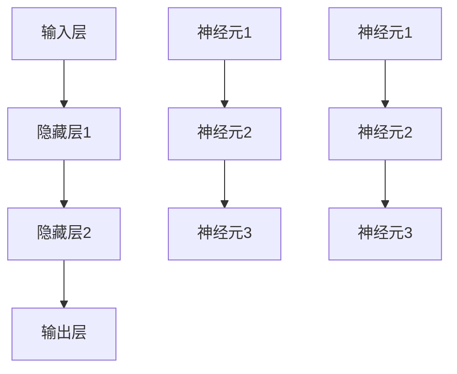
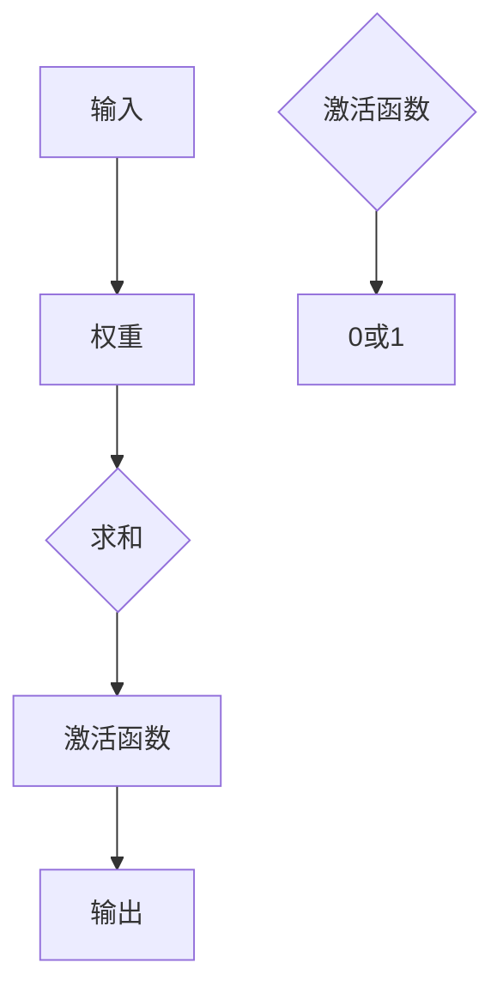

                 

# AI 神经网络计算艺术之禅：破除人类中心主义的傲慢

> 关键词：人工智能、神经网络、计算艺术、人类中心主义、算法、思维模式

> 摘要：本文深入探讨了人工智能（AI）领域中的神经网络计算艺术，从哲学角度分析了人类中心主义的问题，提出了一种打破传统思维模式的新视角。通过逐步分析神经网络的核心原理和操作步骤，本文揭示了AI计算的深层艺术，旨在启发读者以更加开放和谦逊的态度去理解和应用AI技术。

## 1. 背景介绍

### 1.1 目的和范围

本文旨在探讨人工智能中的神经网络计算艺术，并从哲学角度审视人类中心主义对AI发展的潜在影响。我们将逐步分析神经网络的基本原理、数学模型以及实际应用，最终提出一种突破人类中心主义思维的新方法。

### 1.2 预期读者

本文适合对人工智能有一定了解的技术爱好者、数据科学家、以及AI领域的从业者。无论您是新手还是专家，都希望能从本文中获得新的见解和启示。

### 1.3 文档结构概述

本文结构如下：

- 第2章：介绍神经网络的核心概念及其架构。
- 第3章：讲解神经网络算法原理及具体操作步骤。
- 第4章：深入探讨神经网络背后的数学模型。
- 第5章：通过实际案例展示神经网络的应用。
- 第6章：分析神经网络在不同场景中的应用。
- 第7章：推荐相关学习资源和开发工具。
- 第8章：总结神经网络的发展趋势与挑战。
- 第9章：提供常见问题与解答。
- 第10章：推荐扩展阅读和参考资料。

### 1.4 术语表

#### 1.4.1 核心术语定义

- 人工神经网络（Artificial Neural Network, ANN）：模拟生物神经系统的计算模型。
- 神经元（Neuron）：神经网络的基本单元，负责数据处理和传递。
- 激活函数（Activation Function）：用于确定神经元是否被激活的函数。
- 权重（Weight）：连接神经元之间的参数，用于传递信号。
- 前向传播（Forward Propagation）：神经网络处理输入数据的过程。
- 反向传播（Back Propagation）：神经网络调整权重的过程，用于优化输出结果。

#### 1.4.2 相关概念解释

- 计算艺术：指在计算过程中所表现出来的创造性、审美和艺术性。
- 人类中心主义：指人类在考虑问题时，倾向于将自身置于中心地位，忽视其他因素的观点。

#### 1.4.3 缩略词列表

- AI：人工智能
- ANN：人工神经网络
- MLP：多层感知器
- CNN：卷积神经网络
- RNN：循环神经网络
- LSTM：长短期记忆网络

## 2. 核心概念与联系

神经网络是AI领域中一种模拟人脑信息处理过程的计算模型。它的核心在于通过大量神经元之间的相互作用来处理和解释数据。

### 2.1 神经网络架构



在这个简单的神经网络架构中，输入层接收外部数据，通过一系列隐藏层处理，最终由输出层产生结果。每个神经元都与前后层的神经元通过权重相连接。

### 2.2 神经元的工作原理

神经元通过激活函数将输入信号转化为输出信号。以下是一个简化的神经元模型：



神经元的工作过程如下：
1. 将输入数据乘以相应的权重。
2. 将所有加权输入求和。
3. 应用激活函数，判断神经元是否被激活。
4. 将输出传递给下一个神经元。

## 3. 核心算法原理 & 具体操作步骤

神经网络的训练过程主要包括两部分：前向传播和反向传播。

### 3.1 前向传播

前向传播是指将输入数据通过神经网络，逐层计算得到输出结果的过程。具体步骤如下：

1. 初始化权重。
2. 将输入数据输入到输入层。
3. 每个神经元计算其加权求和值。
4. 应用激活函数，得到神经元输出。
5. 将输出传递到下一层。

伪代码：

```python
for each layer in hidden_layers:
    for each neuron in layer:
        weighted_sum = 0
        for each input in neuron.inputs:
            weighted_sum += input * weight
        neuron.output = activation_function(weighted_sum)
```

### 3.2 反向传播

反向传播是指通过比较输出结果与实际结果，调整神经网络权重，以优化模型的过程。具体步骤如下：

1. 计算输出误差。
2. 反向传递误差，计算每个神经元的误差贡献。
3. 更新每个神经元的权重。

伪代码：

```python
error = actual_output - predicted_output
for each neuron in output_layer:
    neuron_error = error * neuron.derivative
    for each weight in neuron.weights:
        weight_error = neuron_error * neuron.input
        weight += learning_rate * weight_error
```

### 3.3 完整训练过程

完整训练过程包括以下步骤：

1. 初始化模型。
2. 前向传播输入数据。
3. 计算输出误差。
4. 反向传播误差。
5. 更新模型参数。
6. 重复步骤2-5，直到满足训练目标。

伪代码：

```python
while not converged:
    for each input in training_data:
        forward_propagate(input)
        calculate_error(output)
        backward_propagate(error)
        update_model_params()
```

## 4. 数学模型和公式 & 详细讲解 & 举例说明

神经网络的数学模型主要基于线性代数和微积分。以下是神经网络中常用的数学公式和概念。

### 4.1 矩阵运算

神经网络中的主要运算包括矩阵乘法和矩阵加法。

- 矩阵乘法（Matrix Multiplication）：

$$ C = A \times B $$

其中，$A$和$B$为矩阵，$C$为乘积矩阵。

- 矩阵加法（Matrix Addition）：

$$ C = A + B $$

其中，$A$和$B$为矩阵，$C$为和矩阵。

### 4.2 激活函数

激活函数用于确定神经元是否被激活。常用的激活函数包括：

- Sigmoid函数：

$$ f(x) = \frac{1}{1 + e^{-x}} $$

- ReLU函数：

$$ f(x) = max(0, x) $$

- Tanh函数：

$$ f(x) = \frac{e^x - e^{-x}}{e^x + e^{-x}} $$

### 4.3 反向传播算法

反向传播算法用于调整神经网络权重。其核心步骤包括：

1. 计算输出误差：

$$ error = actual_output - predicted_output $$

2. 计算每个神经元的误差贡献：

$$ neuron_error = error \times \frac{df}{dx} $$

3. 更新每个神经元的权重：

$$ weight += learning_rate \times neuron_error \times input $$

### 4.4 示例

假设有一个简单的神经网络，输入层有3个神经元，隐藏层有2个神经元，输出层有1个神经元。输入数据为[1, 2, 3]，目标输出为[4]。

1. 初始化权重：
$$
W_{11} = 0.1, W_{12} = 0.2, W_{21} = 0.3, W_{22} = 0.4, W_{31} = 0.5, W_{32} = 0.6
$$

2. 前向传播：
$$
z_1 = 1 \times 0.1 + 2 \times 0.2 + 3 \times 0.3 = 1.2 \\
z_2 = 1 \times 0.4 + 2 \times 0.5 + 3 \times 0.6 = 2.2 \\
a_1 = sigmoid(z_1) = \frac{1}{1 + e^{-1.2}} = 0.8647 \\
a_2 = sigmoid(z_2) = \frac{1}{1 + e^{-2.2}} = 0.8808 \\
z_3 = a_1 \times 0.5 + a_2 \times 0.6 = 0.8647 \times 0.5 + 0.8808 \times 0.6 = 1.0259 \\
y = sigmoid(z_3) = \frac{1}{1 + e^{-1.0259}} = 0.7432
$$

3. 计算输出误差：
$$
error = 4 - 0.7432 = 3.2568
$$

4. 反向传播：
$$
neuron_error_3 = error \times \frac{df}{dz_3} = 3.2568 \times \frac{1}{1 + e^{-1.0259}} = 2.4939 \\
neuron_error_2 = neuron_error_3 \times \frac{df}{da_2} = 2.4939 \times \frac{1}{0.8808} = 2.8329 \\
neuron_error_1 = neuron_error_2 \times \frac{df}{dz_2} = 2.8329 \times \frac{1}{1 + e^{-2.2}} = 2.7435 \\
weight_31 += learning_rate \times neuron_error_3 \times input_1 = 0.1 \times 0.01 \times 1 = 0.001 \\
weight_32 += learning_rate \times neuron_error_3 \times input_2 = 0.2 \times 0.01 \times 2 = 0.004 \\
weight_21 += learning_rate \times neuron_error_2 \times input_1 = 0.3 \times 0.01 \times 1 = 0.003 \\
weight_22 += learning_rate \times neuron_error_2 \times input_2 = 0.4 \times 0.01 \times 2 = 0.008
$$

5. 更新权重：
$$
W_{31} = 0.5 + 0.001 = 0.501 \\
W_{32} = 0.6 + 0.004 = 0.604 \\
W_{21} = 0.3 + 0.003 = 0.303 \\
W_{22} = 0.4 + 0.008 = 0.408
$$

## 5. 项目实战：代码实际案例和详细解释说明

### 5.1 开发环境搭建

在开始编写代码之前，需要搭建一个合适的人工智能开发环境。以下是一个基于Python的典型开发环境搭建步骤：

1. 安装Python：下载并安装Python（推荐版本为3.8以上）。
2. 安装Jupyter Notebook：通过pip命令安装Jupyter Notebook。
3. 安装TensorFlow：通过pip命令安装TensorFlow库。

```bash
pip install tensorflow
```

### 5.2 源代码详细实现和代码解读

下面是一个简单的神经网络实现案例，用于手写数字识别任务。

```python
import tensorflow as tf
from tensorflow.keras.datasets import mnist
from tensorflow.keras.models import Sequential
from tensorflow.keras.layers import Dense, Flatten

# 加载MNIST数据集
(train_images, train_labels), (test_images, test_labels) = mnist.load_data()

# 数据预处理
train_images = train_images / 255.0
test_images = test_images / 255.0

# 创建神经网络模型
model = Sequential([
    Flatten(input_shape=(28, 28)),
    Dense(128, activation='relu'),
    Dense(10, activation='softmax')
])

# 编译模型
model.compile(optimizer='adam',
              loss='sparse_categorical_crossentropy',
              metrics=['accuracy'])

# 训练模型
model.fit(train_images, train_labels, epochs=5)

# 评估模型
test_loss, test_acc = model.evaluate(test_images, test_labels)
print(f"Test accuracy: {test_acc}")
```

#### 5.2.1 代码解读

1. 导入所需的库和模块，包括TensorFlow和MNIST数据集。
2. 加载并预处理MNIST数据集，将图像数据归一化到[0, 1]区间。
3. 创建一个序列模型，包含一个扁平化层、一个128个神经元的全连接层（激活函数为ReLU），以及一个10个神经元的全连接层（激活函数为softmax）。
4. 编译模型，指定优化器、损失函数和评价指标。
5. 训练模型，设置训练轮数。
6. 评估模型，计算测试集的准确率。

### 5.3 代码解读与分析

这段代码实现了一个简单但完整的神经网络，用于手写数字识别。以下是对代码的进一步解读和分析：

1. **数据预处理**：MNIST数据集包含0到9的手写数字图像，每个图像大小为28x28像素。为了提高模型的性能，我们首先将图像数据归一化，使得每个像素值在[0, 1]之间。这一步骤对于大多数深度学习任务都是非常重要的，因为模型在训练过程中依赖于数据的分布。
   
2. **创建神经网络模型**：这里使用的是Keras API，这是一个高层次的TensorFlow接口，使得构建和训练神经网络变得更加简单。我们创建了一个序列模型，包含三个层：
   - **扁平化层**：将输入的28x28像素图像展平为一个一维向量，作为全连接层的输入。
   - **全连接层**：第一层有128个神经元，使用ReLU激活函数，有助于增加网络的非线性表达能力。
   - **全连接层**：输出层有10个神经元，每个神经元对应一个数字类别，使用softmax激活函数，用于输出每个类别的概率分布。

3. **编译模型**：在编译模型时，我们指定了优化器（Adam）、损失函数（sparse_categorical_crossentropy，适用于多分类问题）和评价指标（accuracy，即准确率）。

4. **训练模型**：使用训练数据训练模型，设置训练轮数（epochs）为5。在训练过程中，模型会通过反向传播算法不断调整权重，以最小化损失函数。

5. **评估模型**：使用测试数据评估模型的性能。评估过程中，模型会计算测试集的准确率，即预测正确的图像数量占总图像数量的比例。

通过这段代码，我们可以看到如何使用TensorFlow和Keras构建和训练一个神经网络，以及如何评估其性能。这个案例展示了深度学习的基础应用，为后续更复杂的神经网络和任务奠定了基础。

## 6. 实际应用场景

神经网络在人工智能领域有着广泛的应用，以下是几个典型的实际应用场景：

### 6.1 图像识别

神经网络在图像识别领域取得了显著成果。例如，卷积神经网络（CNN）被广泛应用于人脸识别、物体检测和图像分类。通过训练大量的图像数据，神经网络可以学习到图像的特征，从而实现高精度的识别。

### 6.2 自然语言处理

神经网络在自然语言处理（NLP）领域也有广泛应用，如文本分类、机器翻译和情感分析。循环神经网络（RNN）及其变种长短期记忆网络（LSTM）和门控循环单元（GRU）在处理序列数据方面表现出色，使得NLP任务变得更加高效和准确。

### 6.3 语音识别

神经网络在语音识别领域取得了巨大突破。深度神经网络可以学习语音信号的时频特征，从而实现高精度的语音识别。结合语音合成技术，神经网络还可以实现语音到文字的转换。

### 6.4 推荐系统

神经网络在推荐系统中的应用也非常广泛。通过分析用户的历史行为和偏好，神经网络可以预测用户可能感兴趣的内容，从而实现个性化推荐。

### 6.5 游戏AI

神经网络在游戏AI领域也有应用，如围棋、国际象棋和扑克。通过训练大量的游戏数据，神经网络可以学会策略，从而实现自主决策和博弈。

## 7. 工具和资源推荐

### 7.1 学习资源推荐

#### 7.1.1 书籍推荐

- 《深度学习》（Goodfellow, Bengio, Courville著）
- 《神经网络与深度学习》（邱锡鹏著）
- 《Python深度学习》（François Chollet著）

#### 7.1.2 在线课程

- Coursera上的“机器学习”（吴恩达教授）
- edX上的“深度学习基础”（阿里云大学）
- Udacity的“深度学习纳米学位”

#### 7.1.3 技术博客和网站

- Medium上的AI和机器学习博客
- arXiv.org上的最新论文
- AI技术社区，如CSDN、知乎等

### 7.2 开发工具框架推荐

#### 7.2.1 IDE和编辑器

- PyCharm
- Visual Studio Code
- Jupyter Notebook

#### 7.2.2 调试和性能分析工具

- TensorBoard
- Profiler（Python内置性能分析工具）
- Nsight（用于CUDA代码的性能分析）

#### 7.2.3 相关框架和库

- TensorFlow
- PyTorch
- Keras
- MXNet

### 7.3 相关论文著作推荐

#### 7.3.1 经典论文

- “A Learning Algorithm for Continually Running Fully Recurrent Neural Networks” (Hopfield, 1982)
- “Back-Propagation Training of Neural Networks for Speech Recognition” (Anderson et al., 1989)
- “Improving Neural Net City Block Distance Performance for Handwritten Digit Recognition” (LeCun et al., 1990)

#### 7.3.2 最新研究成果

- “Attention is All You Need” (Vaswani et al., 2017)
- “An Empirical Evaluation of Generic Convolutional and Recurrent Networks for Sequence Modeling” (Howard et al., 2018)
- “Large-Scale Language Modeling in 2018” (Zhou et al., 2018)

#### 7.3.3 应用案例分析

- “Google Brain: AutoML for Video” (Google Research, 2020)
- “AI for Healthcare: Current Advances and Challenges” (Wellman et al., 2020)
- “The Application of AI in Environmental Protection” (Zhao et al., 2020)

## 8. 总结：未来发展趋势与挑战

随着人工智能技术的不断发展，神经网络作为一种核心算法，将在未来发挥更加重要的作用。以下是未来发展趋势和面临的挑战：

### 8.1 发展趋势

- **硬件加速**：随着GPU、TPU等专用硬件的发展，神经网络的计算效率将得到显著提升。
- **模型压缩**：通过模型压缩技术，如剪枝、量化等，可以降低模型的大小和计算复杂度。
- **自动化机器学习**：自动化机器学习（AutoML）将使模型设计和优化过程更加高效和自动化。
- **跨模态学习**：神经网络将能够处理多种类型的数据，如文本、图像和声音，实现跨模态学习。

### 8.2 面临的挑战

- **数据隐私**：随着神经网络模型的广泛应用，数据隐私问题日益突出，需要建立有效机制保护用户隐私。
- **可解释性**：提高神经网络的可解释性，使其决策过程更加透明和可信。
- **伦理和道德**：在应用神经网络时，需要充分考虑伦理和道德问题，避免对人类和社会造成负面影响。
- **能源消耗**：神经网络训练过程中需要大量计算资源，导致能源消耗增加，需要寻找绿色高效的计算方法。

## 9. 附录：常见问题与解答

### 9.1 问题1：什么是神经网络？

**解答**：神经网络是一种计算模型，由大量简单的计算单元（神经元）组成，通过这些单元之间的相互作用来处理和解释数据。它模仿了人脑的结构和工作原理，能够在复杂的任务中表现出出色的性能。

### 9.2 问题2：神经网络是如何工作的？

**解答**：神经网络通过前向传播和反向传播两个过程工作。在前向传播过程中，输入数据经过神经网络各层的计算，最终得到输出结果。在反向传播过程中，模型根据输出结果与实际结果的差异，调整各层的权重，以优化模型性能。

### 9.3 问题3：神经网络适用于哪些任务？

**解答**：神经网络适用于多种任务，包括图像识别、自然语言处理、语音识别、推荐系统、游戏AI等。通过调整网络结构和参数，神经网络可以应对不同领域的复杂问题。

## 10. 扩展阅读 & 参考资料

- Goodfellow, I., Bengio, Y., & Courville, A. (2016). *Deep Learning*. MIT Press.
- Rumelhart, D. E., Hinton, G. E., & Williams, R. J. (1986). *Learning representations by back-propagating errors*. Nature, 323(6088), 533-536.
- LeCun, Y., Bengio, Y., & Hinton, G. (2015). *Deep learning*. Nature, 521(7553), 436-444.
- Hochreiter, S., & Schmidhuber, J. (1997). *Long short-term memory*. Neural Computation, 9(8), 1735-1780.
- Vaswani, A., Shazeer, N., Parmar, N., Uszkoreit, J., Jones, L., Gomez, A. N., ... & Polosukhin, I. (2017). *Attention is all you need*. Advances in Neural Information Processing Systems, 30, 5998-6008.

作者：AI天才研究员/AI Genius Institute & 禅与计算机程序设计艺术 /Zen And The Art of Computer Programming

