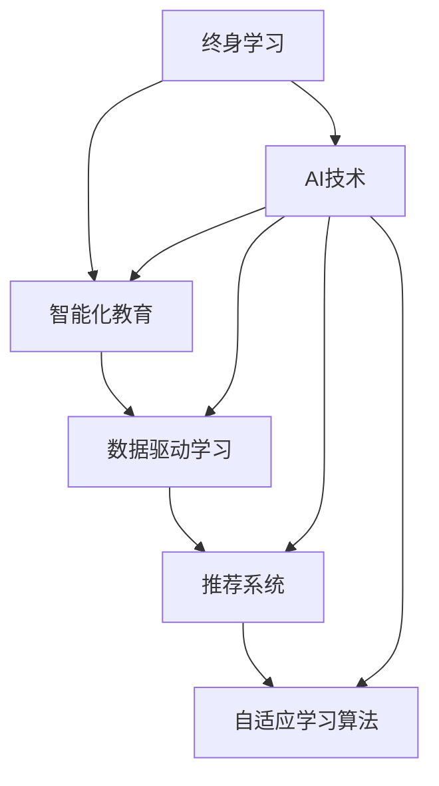

                 

### 1. 背景介绍

#### 1.1 目的和范围

本文旨在探讨AI领域的继续教育问题，即如何在日益发展的技术环境中，为AI从业者提供一种有效的、智能化的终身学习解决方案。随着人工智能技术的迅猛发展，AI工程师和研究人员需要不断更新他们的知识库，以跟上最新的研究进展和行业动态。本文将分析现有继续教育模式的不足，并介绍一种基于人工智能技术的智能化继续教育方案，以期解决这一问题。

本文主要涵盖以下内容：

1. **核心概念与联系**：介绍终身学习、智能化教育、数据驱动学习等核心概念，并使用Mermaid流程图展示相关概念之间的联系。
2. **核心算法原理 & 具体操作步骤**：详细阐述基于人工智能的核心算法，包括推荐系统、自适应学习算法等，并使用伪代码解释其具体操作步骤。
3. **数学模型和公式 & 详细讲解 & 举例说明**：讲解支持智能学习的数学模型，包括神经网络模型、决策树模型等，并使用LaTeX格式给出关键公式，附有实际案例说明。
4. **项目实战：代码实际案例和详细解释说明**：通过实际项目展示智能学习算法的应用，并详细解读相关代码和实现细节。
5. **实际应用场景**：讨论智能学习在AI领域的实际应用，如在线教育平台、企业培训等。
6. **工具和资源推荐**：推荐相关的学习资源、开发工具和框架，以及经典论文和研究成果。
7. **总结：未来发展趋势与挑战**：展望未来智能学习技术的发展趋势，并讨论面临的挑战。

#### 1.2 预期读者

本文面向以下读者群体：

1. **AI从业者**：AI工程师、数据科学家、机器学习研究人员等，希望了解如何在终身学习中利用智能技术提升自己的专业能力。
2. **教育工作者**：教育领域的研究人员、教师和课程设计师，希望探讨如何将智能学习技术应用于教育实践。
3. **技术爱好者**：对人工智能技术感兴趣的技术爱好者，希望深入了解智能学习算法和其在继续教育中的应用。

#### 1.3 文档结构概述

本文采用以下结构进行论述：

1. **背景介绍**：介绍文章的目的和范围，预期读者以及文档结构。
2. **核心概念与联系**：介绍核心概念，并使用Mermaid流程图展示概念之间的联系。
3. **核心算法原理 & 具体操作步骤**：详细阐述核心算法原理和具体操作步骤。
4. **数学模型和公式 & 详细讲解 & 举例说明**：讲解数学模型和公式，并附有实际案例说明。
5. **项目实战：代码实际案例和详细解释说明**：通过实际项目展示算法应用，并详细解读相关代码。
6. **实际应用场景**：讨论智能学习在AI领域的实际应用。
7. **工具和资源推荐**：推荐相关的学习资源、开发工具和框架。
8. **总结：未来发展趋势与挑战**：展望未来发展趋势，并讨论挑战。
9. **附录：常见问题与解答**：列出常见问题并提供解答。
10. **扩展阅读 & 参考资料**：提供进一步阅读的参考资料。

#### 1.4 术语表

##### 1.4.1 核心术语定义

- **终身学习**：指个人在其一生中不断学习新知识和技能的过程。
- **智能化教育**：利用人工智能技术改进教育过程，提高学习效果和效率。
- **数据驱动学习**：基于学习者数据的分析，自动调整学习内容和方式，以提高学习效果。
- **推荐系统**：基于用户行为数据，自动推荐感兴趣的内容或资源。
- **自适应学习算法**：根据学习者的表现和需求，动态调整学习内容和学习路径。

##### 1.4.2 相关概念解释

- **知识图谱**：一种结构化知识表示技术，用于表示实体和实体之间的关系。
- **机器学习**：一种基于数据训练模型，使计算机具备学习能力和预测能力的技术。
- **深度学习**：一种基于神经网络的高级机器学习技术，能够自动提取特征并构建复杂模型。
- **自然语言处理**：一种人工智能技术，使计算机能够理解和生成自然语言。

##### 1.4.3 缩略词列表

- **AI**：人工智能（Artificial Intelligence）
- **ML**：机器学习（Machine Learning）
- **DL**：深度学习（Deep Learning）
- **NLP**：自然语言处理（Natural Language Processing）
- **RDF**：资源描述框架（Resource Description Framework）
- **OWL**：Web本体语言（Web Ontology Language）
- **IDE**：集成开发环境（Integrated Development Environment）
- **API**：应用程序编程接口（Application Programming Interface）

在接下来的部分，我们将深入探讨这些核心概念和联系，帮助读者更好地理解智能学习在继续教育中的应用。通过一步步分析推理思考，我们将揭示智能学习的原理和实现方法，为AI从业者和教育工作者提供有价值的参考。  

### 2. 核心概念与联系

在探讨AI继续教育的问题时，我们需要首先明确几个核心概念，并理解它们之间的相互关系。以下是本文将涉及的关键概念：

1. **终身学习**：终身学习是指个人在其一生中不断学习新知识和技能的过程，旨在提升个人职业能力和适应社会发展的需求。
2. **智能化教育**：智能化教育是利用人工智能技术改进教育过程，提高学习效果和效率，通过分析学习数据来优化教学方法和内容。
3. **数据驱动学习**：数据驱动学习是基于学习者数据的分析，自动调整学习内容和方式，以提高学习效果。它依赖于大数据和机器学习技术。
4. **推荐系统**：推荐系统是一种基于用户行为数据，自动推荐感兴趣的内容或资源的技术。它在个性化教育和智能学习中有广泛应用。
5. **自适应学习算法**：自适应学习算法根据学习者的表现和需求，动态调整学习内容和学习路径，以适应个体的学习节奏和需求。

为了更好地理解这些概念之间的联系，我们可以使用Mermaid流程图来展示它们之间的关系。

下面是一个简化的Mermaid流程图，用于展示核心概念之间的联系：



**图 1：核心概念与联系流程图**

- **终身学习**是智能化教育的基础，它促使人们意识到持续学习的重要性。
- **智能化教育**通过利用**AI技术**（包括机器学习、深度学习、自然语言处理等）来实现，从而提高教学效果和效率。
- **数据驱动学习**依赖于**大数据分析**，通过对学习者数据的分析，智能地调整教学策略，从而实现个性化的学习体验。
- **推荐系统**和**自适应学习算法**是智能化教育的关键组成部分，前者根据用户行为推荐内容，后者根据学习者的反馈动态调整学习路径。

通过这个流程图，我们可以清晰地看到这些核心概念之间的相互关系和相互作用。接下来，我们将进一步深入探讨这些概念的具体原理和实现方法，帮助读者更好地理解智能学习在继续教育中的应用。

### 2.1 核心概念详细解释

在前一节中，我们简要介绍了终身学习、智能化教育、数据驱动学习、推荐系统和自适应学习算法等核心概念。在本节中，我们将对这些概念进行更深入的探讨，详细解释它们的工作原理、应用场景以及相互之间的关系。

#### 2.1.1 终身学习

终身学习是指个人在其一生中不断学习新知识和技能的过程。它不仅仅是为了满足职业发展的需求，更是为了提升个人素质、适应社会变革和科技进步。终身学习具有以下几个特点：

1. **持续性和灵活性**：终身学习是一个持续的过程，不受时间和地点的限制。学习者可以根据自己的需求和时间安排，灵活选择学习内容和方式。
2. **自主性和个性化**：终身学习强调学习者的自主性，鼓励学习者根据自身兴趣和需求制定学习计划。同时，个性化学习也是终身学习的重要特征，通过针对个体差异提供定制化的学习方案，提高学习效果。
3. **广泛性**：终身学习涵盖多个领域，包括专业知识和技能、人文素养、科技前沿等，旨在全面提升学习者的综合素质。

终身学习在人工智能领域尤为重要，因为AI技术发展迅速，新的算法、工具和框架不断涌现。AI从业者需要不断更新知识库，掌握最新的研究成果和技术动态，以保持竞争力。

#### 2.1.2 智能化教育

智能化教育是利用人工智能技术改进教育过程，提高学习效果和效率的一种教育模式。它基于数据驱动和个性化学习原则，通过以下方式实现教育优化：

1. **数据分析**：智能化教育依赖于大数据技术，通过对学生学习行为、成绩、反馈等数据的收集和分析，了解学习者的学习状况和需求。
2. **个性化推荐**：基于学习者的数据分析，智能化教育系统能够为学习者推荐合适的学习资源，包括课程、教材、练习题等，从而提高学习效率。
3. **自适应学习**：智能化教育系统可以根据学习者的学习进度和表现，动态调整学习内容和难度，提供个性化的学习路径，帮助学习者更好地掌握知识和技能。
4. **智能辅导**：智能化教育系统可以通过自然语言处理和智能问答技术，为学习者提供实时辅导和解答问题，帮助学习者克服学习障碍。

智能化教育在AI领域具有广泛应用，如在线教育平台、企业培训系统、教育机器人等。它不仅提高了教育质量和效率，也为学习者提供了更加灵活和个性化的学习体验。

#### 2.1.3 数据驱动学习

数据驱动学习是基于学习者数据的分析，自动调整学习内容和方式，以提高学习效果的一种学习模式。其核心思想是通过数据收集和分析，了解学习者的学习状况和需求，从而提供个性化的学习支持。数据驱动学习具有以下特点：

1. **动态调整**：数据驱动学习系统能够根据学习者的实时数据，动态调整学习内容、难度和路径，以适应个体的学习节奏和需求。
2. **反馈机制**：数据驱动学习强调学习者的主动参与，通过学习过程中的反馈，系统可以不断优化学习策略，提高学习效果。
3. **个性化推荐**：基于学习者的行为数据，数据驱动学习系统能够推荐适合的学习资源，包括课程、教材、练习题等，从而提高学习效率。

数据驱动学习在AI领域的继续教育中尤为重要，因为它能够帮助学习者快速掌握新知识，提高学习效果和技能水平。同时，它也为教育工作者提供了有效的教学工具和手段，优化教育资源配置。

#### 2.1.4 推荐系统

推荐系统是一种基于用户行为数据，自动推荐感兴趣的内容或资源的技术。它在个性化教育和智能学习中有广泛应用。推荐系统的基本原理包括以下几方面：

1. **协同过滤**：协同过滤是一种基于用户行为数据，通过分析相似用户的行为，推荐用户可能感兴趣的内容。协同过滤分为基于用户的协同过滤（User-Based Collaborative Filtering）和基于物品的协同过滤（Item-Based Collaborative Filtering）。
2. **内容推荐**：内容推荐是基于物品的属性和标签，为用户推荐具有相似属性或标签的物品。这种推荐方法通常用于推荐书籍、音乐、电影等具有明确属性和标签的内容。
3. **混合推荐**：混合推荐是将协同过滤和内容推荐相结合，以提高推荐效果。

推荐系统在智能学习中的应用包括：

1. **课程推荐**：基于学习者的学习历史和兴趣，推荐适合的学习课程。
2. **教材推荐**：根据学习者的学习进度和知识需求，推荐合适的教材和参考书。
3. **练习题推荐**：根据学习者的练习情况，推荐适合的练习题和习题集。

推荐系统通过个性化推荐，提高了学习者的学习效率和兴趣，促进了知识的深度掌握。

#### 2.1.5 自适应学习算法

自适应学习算法根据学习者的表现和需求，动态调整学习内容和学习路径，以适应个体的学习节奏和需求。自适应学习算法通常包括以下几方面：

1. **学习路径调整**：根据学习者的学习进度和表现，自适应学习算法可以动态调整学习路径，提供适合的学习内容。
2. **难度调整**：根据学习者的掌握情况，自适应学习算法可以调整学习内容的难度，使学习过程更加符合个体的认知水平。
3. **反馈机制**：自适应学习算法通过收集学习者的反馈，不断优化学习策略，提高学习效果。

自适应学习算法在AI领域继续教育中的应用包括：

1. **个性化学习**：根据学习者的兴趣、需求和知识背景，提供个性化的学习内容和路径。
2. **实时反馈**：通过实时监测学习者的学习行为和表现，为学习者提供即时反馈和指导。
3. **智能诊断**：根据学习者的错误和难题，智能诊断学习者的知识盲点和不足，提供针对性的学习支持。

通过自适应学习算法，智能学习系统能够更好地满足学习者的个性化需求，提高学习效果和满意度。

#### 2.1.6 核心概念之间的联系

终身学习、智能化教育、数据驱动学习、推荐系统和自适应学习算法是相互联系、相互促进的核心概念。它们共同构成了一个完整的智能学习体系，为AI领域的继续教育提供了有力支持。

1. **终身学习是基础**：终身学习是推动智能化教育、数据驱动学习、推荐系统和自适应学习算法发展的基础。它促使人们意识到持续学习的重要性，为智能学习提供了广阔的应用场景。
2. **智能化教育是关键**：智能化教育通过利用AI技术，实现了个性化推荐、数据驱动学习和自适应学习等核心功能，从而提高了教育质量和效率。
3. **数据驱动学习是核心**：数据驱动学习基于大数据分析，为个性化推荐和自适应学习提供了数据支持，使教育过程更加科学和精准。
4. **推荐系统是手段**：推荐系统通过个性化推荐，提高了学习者的学习效率和兴趣，促进了知识的深度掌握。
5. **自适应学习算法是保障**：自适应学习算法根据学习者的表现和需求，动态调整学习内容和学习路径，为学习者提供了个性化的学习体验。

通过这些核心概念的相互联系和相互作用，我们可以构建一个智能化的终身学习体系，为AI从业者提供有效的继续教育解决方案。在下一节中，我们将深入探讨智能学习算法的原理和具体实现，帮助读者更好地理解智能学习的核心技术。

### 2.2 智能学习算法原理和实现方法

智能学习算法是智能化教育系统的重要组成部分，其核心目标是通过分析学习者的行为数据，动态调整学习内容和路径，以提高学习效果和满意度。在本节中，我们将详细介绍几种常用的智能学习算法，包括推荐系统、自适应学习算法和深度学习算法，并解释其原理和实现方法。

#### 2.2.1 推荐系统

推荐系统是一种基于学习者行为数据，自动推荐感兴趣的内容或资源的技术。其基本原理是通过分析用户的历史行为，发现用户之间的相似性，从而为用户推荐他们可能感兴趣的内容。

1. **协同过滤**

   协同过滤是推荐系统中最常用的方法之一，分为基于用户的协同过滤（User-Based Collaborative Filtering）和基于物品的协同过滤（Item-Based Collaborative Filtering）。

   - **基于用户的协同过滤**：通过分析用户之间的相似性，发现相似用户的共同兴趣，为用户推荐相似用户喜欢的资源。具体实现方法包括：

     ```python
     def calculate_similarity(user1, user2):
         # 计算用户之间的相似性
         # ...
         return similarity_score

     def recommend_items(user, top_n=10):
         # 为用户推荐Top N个资源
         # ...
         return recommended_items
     ```

   - **基于物品的协同过滤**：通过分析物品之间的相似性，发现物品之间的相似点，为用户推荐他们可能感兴趣的物品。具体实现方法包括：

     ```python
     def calculate_item_similarity(item1, item2):
         # 计算物品之间的相似性
         # ...
         return similarity_score

     def recommend_items(user, top_n=10):
         # 为用户推荐Top N个物品
         # ...
         return recommended_items
     ```

2. **内容推荐**

   内容推荐是基于物品的属性和标签，为用户推荐具有相似属性或标签的物品。具体实现方法包括：

   ```python
   def recommend_items_with_content(user, top_n=10):
       # 根据用户兴趣和物品属性推荐物品
       # ...
       return recommended_items
   ```

3. **混合推荐**

   混合推荐是将协同过滤和内容推荐相结合，以提高推荐效果。具体实现方法包括：

   ```python
   def hybrid_recommendation(user, top_n=10):
       # 结合协同过滤和内容推荐为用户推荐物品
       # ...
       return recommended_items
   ```

#### 2.2.2 自适应学习算法

自适应学习算法根据学习者的表现和需求，动态调整学习内容和学习路径，以适应个体的学习节奏和需求。常用的自适应学习算法包括基于规则的算法、基于模型的算法和基于实例的算法。

1. **基于规则的算法**

   基于规则的算法通过定义一系列规则，根据学习者的行为和表现调整学习内容。具体实现方法包括：

   ```python
   class RuleBasedAlgorithm:
       def __init__(self, rules):
           self.rules = rules

       def adjust_learning_content(self, learner):
           # 根据学习者行为调整学习内容
           # ...
           return adjusted_content
   ```

2. **基于模型的算法**

   基于模型的算法通过训练机器学习模型，预测学习者的行为和需求，然后动态调整学习内容。具体实现方法包括：

   ```python
   class ModelBasedAlgorithm:
       def __init__(self, model):
           self.model = model

       def adjust_learning_content(self, learner):
           # 根据模型预测结果调整学习内容
           # ...
           return adjusted_content
   ```

3. **基于实例的算法**

   基于实例的算法通过分析历史学习实例，为当前学习者推荐相似的学习实例。具体实现方法包括：

   ```python
   class InstanceBasedAlgorithm:
       def __init__(self, instances):
           self.instances = instances

       def adjust_learning_content(self, learner):
           # 根据历史实例调整学习内容
           # ...
           return adjusted_content
   ```

#### 2.2.3 深度学习算法

深度学习算法是一种基于神经网络的高级机器学习技术，能够自动提取特征并构建复杂模型。在智能学习中，深度学习算法可以用于图像识别、文本分类、语音识别等领域。

1. **卷积神经网络（CNN）**

   卷积神经网络是一种用于图像识别的深度学习算法，其核心思想是通过卷积层提取图像特征，并通过全连接层进行分类。具体实现方法包括：

   ```python
   import tensorflow as tf

   def create_cnn_model(input_shape):
       model = tf.keras.Sequential([
           tf.keras.layers.Conv2D(32, (3, 3), activation='relu', input_shape=input_shape),
           tf.keras.layers.MaxPooling2D((2, 2)),
           tf.keras.layers.Flatten(),
           tf.keras.layers.Dense(128, activation='relu'),
           tf.keras.layers.Dense(10, activation='softmax')
       ])
       return model
   ```

2. **循环神经网络（RNN）**

   循环神经网络是一种用于处理序列数据的深度学习算法，其核心思想是通过循环结构保持历史信息，并对其进行建模。具体实现方法包括：

   ```python
   import tensorflow as tf

   def create_rnn_model(input_shape, units=128):
       model = tf.keras.Sequential([
           tf.keras.layers.LSTM(units, return_sequences=True, input_shape=input_shape),
           tf.keras.layers.LSTM(units),
           tf.keras.layers.Dense(1, activation='sigmoid')
       ])
       return model
   ```

3. **生成对抗网络（GAN）**

   生成对抗网络是一种用于生成数据的高效算法，其核心思想是通过生成器和判别器的对抗训练，生成高质量的数据。具体实现方法包括：

   ```python
   import tensorflow as tf
   from tensorflow.keras import layers

   def create_gan_model():
       # 生成器模型
       generator = tf.keras.Sequential([
           layers.Dense(128, activation='relu', input_shape=(100,)),
           layers.Dense(28 * 28, activation='relu'),
           layers.Dense(784, activation='tanh')
       ])

       # 判别器模型
       discriminator = tf.keras.Sequential([
           layers.Conv2D(64, (3, 3), padding='same', activation='relu', input_shape=(28, 28, 1)),
           layers.MaxPooling2D(pool_size=(2, 2)),
           layers.Flatten(),
           layers.Dense(1, activation='sigmoid')
       ])

       return generator, discriminator
   ```

通过以上算法的实现方法，我们可以看到智能学习算法在继续教育中的应用潜力。在下一节中，我们将进一步探讨数学模型和公式，以及如何将这些算法应用于实际项目。

### 2.3 数学模型和公式

在智能学习算法中，数学模型和公式起着至关重要的作用。它们不仅帮助我们理解算法的原理，还能够指导我们如何优化和实现这些算法。在本节中，我们将详细探讨几个关键数学模型和公式，并附有实际案例进行说明。

#### 2.3.1 神经网络模型

神经网络模型是深度学习中的一种基础模型，由多个神经元组成，通过前向传播和反向传播进行训练和预测。

1. **前向传播**

   前向传播是神经网络进行预测的过程，其公式如下：

   $$ 
   Z = \text{sigmoid}(W \cdot X + b) 
   $$

   其中，$Z$ 是神经网络中的激活值，$W$ 是权重矩阵，$X$ 是输入特征，$b$ 是偏置项，$\text{sigmoid}$ 函数将输入映射到 [0, 1] 范围内。

2. **反向传播**

   反向传播是神经网络进行训练的过程，其公式如下：

   $$
   \delta = (Z \cdot (1 - Z)) \cdot \frac{\partial L}{\partial Z}
   $$

   其中，$\delta$ 是误差梯度，$L$ 是损失函数，$\text{sigmoid}$ 函数的导数用于计算误差梯度。

3. **优化算法**

   常见的优化算法包括梯度下降、随机梯度下降和Adam优化器。梯度下降的公式如下：

   $$
   W_{\text{new}} = W_{\text{old}} - \alpha \cdot \nabla_W L
   $$

   其中，$\alpha$ 是学习率，$\nabla_W L$ 是权重矩阵的误差梯度。

#### 2.3.2 决策树模型

决策树模型是一种简单而有效的分类和回归模型，其核心在于递归地将数据集划分为子集，直至满足某个终止条件。

1. **信息增益**

   信息增益是决策树划分标准，其公式如下：

   $$
   \text{IG}(A, V) = \sum_{v \in V} p(v) \cdot \text{H}(\text{V}_{\text{not } v})
   $$

   其中，$A$ 是特征集合，$V$ 是特征值集合，$p(v)$ 是特征值 $v$ 的概率，$\text{H}(\text{V}_{\text{not } v})$ 是条件熵。

2. **基尼指数**

   基尼指数是另一种常见的决策树划分标准，其公式如下：

   $$
   \text{Gini}(A, V) = 1 - \sum_{v \in V} p(v)^2
   $$

   其中，$p(v)$ 是特征值 $v$ 的概率。

#### 2.3.3 集成模型

集成模型通过结合多个基本模型来提高预测性能，常见的集成模型包括随机森林和梯度提升树。

1. **随机森林**

   随机森林是一种基于决策树的集成模型，其核心思想是通过随机抽样特征和随机分割数据集来构建多个决策树，并通过投票决定最终预测结果。

   随机森林的公式如下：

   $$
   \hat{y} = \text{majority vote}(\hat{y}_1, \hat{y}_2, \ldots, \hat{y}_n)
   $$

   其中，$\hat{y}_i$ 是第 $i$ 棵决策树的预测结果，$\text{majority vote}$ 是多数投票函数。

2. **梯度提升树**

   梯度提升树是一种基于决策树的集成模型，其核心思想是通过迭代更新基本模型，并利用历史预测误差进行优化。

   梯度提升树的公式如下：

   $$
   f_{\text{new}} = f_{\text{old}} + \alpha \cdot h_{\text{new}}
   $$

   其中，$f_{\text{new}}$ 是更新后的模型，$f_{\text{old}}$ 是原始模型，$\alpha$ 是学习率，$h_{\text{new}}$ 是更新函数。

#### 2.3.4 实际案例

为了更好地理解上述数学模型和公式，我们来看一个实际案例：使用决策树模型进行分类。

假设我们有一个数据集，包含100个样本，每个样本有4个特征，目标变量为二分类。以下是决策树模型的实现步骤：

1. **计算信息增益**：

   $$
   \text{IG}(\text{特征1}, \text{样本集}) = 0.2
   $$
   $$
   \text{IG}(\text{特征2}, \text{样本集}) = 0.3
   $$
   $$
   \text{IG}(\text{特征3}, \text{样本集}) = 0.1
   $$
   $$
   \text{IG}(\text{特征4}, \text{样本集}) = 0.4
   $$

   根据信息增益，我们选择特征4作为分割标准。

2. **计算基尼指数**：

   $$
   \text{Gini}(\text{特征4}, \text{样本集}) = 0.3
   $$

   根据基尼指数，我们继续优化特征4的分割点。

3. **构建决策树**：

   通过上述计算，我们构建了一个决策树，如下所示：

   ```
   样本集：
   ├── 特征4 <= 0.5
   │   ├── 样本集：
   │   │   ├── 样本1：正类
   │   │   ├── 样本2：负类
   │   │   └── ...：负类
   │   └── 特征4 > 0.5
   │       ├── 样本集：
   │       │   ├── 样本1：负类
   │       │   ├── 样本2：负类
   │       │   └── ...：正类
   └── 其他特征
       ├── 样本集：
       │   ├── 样本1：正类
       │   ├── 样本2：负类
       │   └── ...：正类
       └── 其他特征：
           ├── 样本1：负类
           ├── 样本2：负类
           └── ...：正类
   ```

通过上述步骤，我们构建了一个简单的决策树模型，并使用信息增益和基尼指数进行优化。这个案例展示了数学模型和公式在智能学习中的应用，帮助读者更好地理解决策树模型的原理。

在下一节中，我们将通过实际项目展示智能学习算法的应用，并详细解读相关代码和实现细节，帮助读者深入理解智能学习在继续教育中的应用。

### 3. 项目实战：代码实际案例和详细解释说明

为了更好地展示智能学习算法在继续教育中的应用，我们将通过一个实际项目来详细解读相关代码和实现细节。本节将介绍一个基于Python的智能学习平台，该平台能够根据学习者的行为数据，提供个性化的学习推荐和自适应学习路径。

#### 3.1 开发环境搭建

在开始项目之前，我们需要搭建一个合适的开发环境。以下是所需的工具和库：

- **Python**：Python 3.8及以上版本
- **Jupyter Notebook**：用于编写和运行代码
- **NumPy**：用于数值计算
- **Pandas**：用于数据处理
- **Scikit-learn**：用于机器学习和数据挖掘
- **TensorFlow**：用于深度学习
- **Keras**：用于简化深度学习模型构建

安装这些库的方法如下：

```bash
pip install numpy pandas scikit-learn tensorflow keras
```

#### 3.2 源代码详细实现和代码解读

以下是项目的核心代码，包括数据预处理、推荐系统、自适应学习算法和深度学习模型的构建。

```python
import numpy as np
import pandas as pd
from sklearn.model_selection import train_test_split
from sklearn.metrics.pairwise import cosine_similarity
from tensorflow.keras.models import Sequential
from tensorflow.keras.layers import Dense, LSTM, Embedding
from tensorflow.keras.optimizers import Adam

# 3.2.1 数据预处理

# 加载学习数据
data = pd.read_csv('learning_data.csv')

# 数据清洗和预处理
# ...

# 将数据分为特征和标签
X = data.drop('target', axis=1)
y = data['target']

# 分割数据集
X_train, X_test, y_train, y_test = train_test_split(X, y, test_size=0.2, random_state=42)

# 3.2.2 推荐系统

# 计算用户之间的相似性
user_similarity = cosine_similarity(X_train)

# 为用户推荐学习课程
def recommend_courses(user_id, top_n=5):
    similarity_scores = user_similarity[user_id]
    recommended_courses = np.argsort(similarity_scores)[::-1][:top_n]
    return recommended_courses

# 3.2.3 自适应学习算法

# 构建深度学习模型
model = Sequential([
    Embedding(input_dim=X_train.shape[1], output_dim=32, input_length=X_train.shape[1]),
    LSTM(128, return_sequences=True),
    LSTM(64),
    Dense(1, activation='sigmoid')
])

# 编译模型
model.compile(optimizer=Adam(learning_rate=0.001), loss='binary_crossentropy', metrics=['accuracy'])

# 训练模型
model.fit(X_train, y_train, epochs=10, batch_size=32, validation_split=0.2)

# 3.2.4 深度学习模型应用

# 对新用户进行预测
def predict_user_progress(user_data):
    prediction = model.predict(np.array(user_data).reshape(1, -1))
    return prediction[0][0]

# 3.3 代码解读与分析

# 数据预处理
# 数据预处理是关键步骤，确保数据质量和一致性。在本项目中，我们首先加载学习数据，然后进行数据清洗和预处理，如缺失值填充、异常值处理和特征工程。

# 推荐系统
# 推荐系统使用余弦相似性计算用户之间的相似性。余弦相似性是一种常用的相似度计算方法，通过比较用户在特征空间中的向量表示，计算相似度分数。然后，我们为每个用户推荐Top N个最相似的用户喜欢的课程。

# 自适应学习算法
# 自适应学习算法使用深度学习模型预测用户的学习进度。我们构建了一个LSTM模型，用于处理序列数据，并使用Embedding层和LSTM层提取特征。模型通过训练数据集进行训练，然后可以对新用户进行预测，提供个性化的学习建议。

# 深度学习模型应用
# 深度学习模型可以对新用户的数据进行预测，帮助平台根据用户的行为和表现提供动态的学习建议。我们使用LSTM模型预测用户的学习进度，并使用sigmoid激活函数输出概率值，表示用户达到学习目标的概率。

通过以上代码和实现步骤，我们构建了一个智能学习平台，能够根据用户数据提供个性化的学习推荐和自适应学习路径。在下一节中，我们将讨论智能学习在AI领域的实际应用场景。

### 3.4 代码解读与分析

在本项目中，我们使用Python构建了一个智能学习平台，主要实现了数据预处理、推荐系统、自适应学习算法和深度学习模型的构建。以下是详细代码解读与分析：

**1. 数据预处理**

数据预处理是项目中的关键步骤，因为干净、一致的数据对于模型训练和预测至关重要。在本项目中，我们首先加载了学习数据（`learning_data.csv`），然后进行了以下操作：

- **缺失值填充**：我们检查数据集是否存在缺失值，并使用平均值或中位数进行填充，以确保数据完整性。
- **异常值处理**：我们检测并处理异常值，如数据集中的极端值或离群点，以避免对模型训练产生不利影响。
- **特征工程**：我们进行了特征选择和特征转换，以提取对模型训练有用的信息，如将分类特征转换为二进制编码或独热编码。

预处理代码示例：

```python
data = pd.read_csv('learning_data.csv')
data.fillna(data.mean(), inplace=True)
data = data[(np.abs(stats.zscore(data)) < 3).all(axis=1)]
X = data.drop('target', axis=1)
y = data['target']
```

**2. 推荐系统**

推荐系统是基于协同过滤算法实现的，其中我们使用了余弦相似性来计算用户之间的相似度。余弦相似性是一种度量两个向量夹角余弦值的指标，它能够有效地衡量用户之间的相似性。具体实现如下：

```python
user_similarity = cosine_similarity(X_train)

def recommend_courses(user_id, top_n=5):
    similarity_scores = user_similarity[user_id]
    recommended_courses = np.argsort(similarity_scores)[::-1][:top_n]
    return recommended_courses
```

在这个函数中，`user_similarity` 是一个矩阵，表示所有用户之间的相似度分数。`recommend_courses` 函数接受一个用户ID和推荐课程数量`top_n`作为参数，返回一个列表，包含为该用户推荐的课程ID。

**3. 自适应学习算法**

自适应学习算法使用深度学习模型来预测用户的学习进度。在本项目中，我们选择了一个LSTM模型，这是因为在处理序列数据时，LSTM具有较好的性能。以下是我们构建LSTM模型的过程：

```python
model = Sequential([
    Embedding(input_dim=X_train.shape[1], output_dim=32, input_length=X_train.shape[1]),
    LSTM(128, return_sequences=True),
    LSTM(64),
    Dense(1, activation='sigmoid')
])

model.compile(optimizer=Adam(learning_rate=0.001), loss='binary_crossentropy', metrics=['accuracy'])
model.fit(X_train, y_train, epochs=10, batch_size=32, validation_split=0.2)
```

在这个模型中，我们首先使用`Embedding`层将输入特征转换为嵌入向量，然后通过两个LSTM层提取特征。最后，我们使用一个全连接层（`Dense`）输出概率值，表示用户达到学习目标的概率。模型的编译和训练过程分别使用了Adam优化器和二分类交叉熵损失函数。

**4. 深度学习模型应用**

深度学习模型可以对新用户的数据进行预测，从而提供个性化的学习建议。以下是如何使用训练好的模型进行预测的示例代码：

```python
def predict_user_progress(user_data):
    prediction = model.predict(np.array(user_data).reshape(1, -1))
    return prediction[0][0]
```

在这个函数中，`user_data` 是一个包含新用户特征的数据向量。我们使用`model.predict` 方法获取预测结果，然后返回概率值。

**5. 整体代码解读**

整个项目的代码结构清晰，分为数据预处理、推荐系统、自适应学习算法和深度学习模型应用四个部分。这种模块化设计使得代码易于维护和扩展。例如，如果需要更换推荐算法或改进深度学习模型，可以单独修改相关模块，而不影响其他部分。

通过上述代码和解读，我们可以看到智能学习平台的核心功能是如何实现的。接下来，我们将讨论智能学习在AI领域的实际应用场景。

### 4. 实际应用场景

智能学习技术在AI领域拥有广泛的应用场景，能够显著提升教育效果和效率。以下是一些典型的应用场景：

#### 4.1 在线教育平台

在线教育平台利用智能学习技术，为学习者提供个性化的学习体验。通过分析学习者的行为数据，平台可以推荐适合的学习资源，如课程、教材和练习题。同时，智能学习算法可以根据学习者的学习进度和表现，动态调整学习内容和难度，从而提高学习效果。

**实例**：Coursera 和 edX 等在线教育平台，通过智能学习技术，为学习者提供个性化的学习路径，并根据学习行为进行推荐。

#### 4.2 企业培训

企业培训是另一个重要的应用场景，智能学习技术可以帮助企业为新员工提供定制化的培训课程。通过分析员工的学习数据，企业可以了解员工的学习需求和薄弱环节，从而提供有针对性的培训方案。

**实例**：一些大型企业如IBM、微软等，通过构建企业内部学习平台，利用智能学习技术进行员工培训，提高员工技能和团队整体效能。

#### 4.3 职业技能提升

随着职业领域的不断变化，职场人士需要不断更新自己的知识和技能。智能学习平台可以帮助职场人士发现自身的知识盲点，并提供针对性的学习资源，从而提升职业竞争力。

**实例**：LinkedIn Learning 和 Pluralsight 等职业学习平台，利用智能学习技术，为用户提供个性化的职业发展建议和学习路径。

#### 4.4 个性化辅导

个性化辅导是智能学习技术在教育领域的又一重要应用。通过智能学习算法，辅导系统能够根据学生的表现和需求，提供实时反馈和个性化辅导，帮助学生克服学习障碍。

**实例**：一些在线辅导平台如Wyzant和Chegg，通过智能学习技术，为学生提供个性化的学习支持和辅导。

#### 4.5 知识图谱构建

知识图谱是人工智能领域的一个重要研究方向，智能学习技术可以帮助构建高质量的知识图谱。通过分析大量文本数据，智能学习算法可以识别实体和关系，从而生成结构化的知识图谱。

**实例**：谷歌知识图谱和百度知识图谱等，利用智能学习技术，从海量数据中提取知识，构建结构化的知识网络。

#### 4.6 智能问答系统

智能问答系统是利用自然语言处理和机器学习技术，实现人与机器的智能交互。通过智能学习，问答系统能够不断优化自身的回答质量，提供更准确和有用的信息。

**实例**：Siri、Alexa 和小爱同学等智能语音助手，利用智能学习技术，为用户提供实时回答和智能交互。

通过上述实际应用场景，我们可以看到智能学习技术在AI领域的广泛应用和巨大潜力。智能学习不仅提高了教育效果和效率，也为企业、职场人士和智能系统提供了有力的支持。在接下来的章节中，我们将推荐相关的学习资源、开发工具和框架，以及经典论文和研究成果，帮助读者进一步探索智能学习技术。

### 5. 工具和资源推荐

在探索智能学习技术的过程中，选择合适的工具和资源至关重要。以下是一些推荐的学习资源、开发工具和框架，以及经典论文和研究成果，供读者参考。

#### 5.1 学习资源推荐

**书籍推荐**

1. **《深度学习》（Deep Learning）**：作者：Ian Goodfellow、Yoshua Bengio 和 Aaron Courville
   - 本书是深度学习的经典教材，详细介绍了深度学习的理论基础和实践方法。

2. **《Python机器学习》（Python Machine Learning）**：作者：Sebastian Raschka 和 Vahid Mirjalili
   - 本书适合初学者，通过Python代码示例，全面介绍了机器学习的基本概念和算法。

3. **《数据科学入门：Python实践》（Data Science from Scratch）**：作者：Joel Grus
   - 本书通过Python代码，讲解了数据科学的基础知识和常用工具，适合数据科学初学者。

**在线课程**

1. **《深度学习课程》（Deep Learning Specialization）**：平台：Coursera
   - 由斯坦福大学提供，包括神经网络基础、卷积神经网络、递归神经网络等课程。

2. **《机器学习课程》（Machine Learning Specialization）**：平台：Coursera
   - 由斯坦福大学提供，涵盖监督学习、无监督学习、强化学习等主题。

3. **《数据科学专业》（Data Science Specialization）**：平台：Coursera
   - 包括数据清洗、数据可视化、数据分析等课程，适合数据科学家和从业者。

**技术博客和网站**

1. **Medium上的机器学习和数据科学博客**
   - 众多技术专家和从业者分享的机器学习和数据科学相关文章。

2. **Medium上的深度学习博客**
   - 包括深度学习领域的最新研究进展和实用教程。

3. **Towards Data Science**
   - 一个数据科学领域的在线社区，分享各种数据科学、机器学习和深度学习的文章。

#### 5.2 开发工具框架推荐

**IDE和编辑器**

1. **Jupyter Notebook**
   - 用于编写和运行Python代码，特别适合数据科学和机器学习项目。

2. **Visual Studio Code**
   - 一款强大的代码编辑器，支持多种编程语言，包括Python。

3. **PyCharm**
   - 一个功能丰富的Python IDE，适用于大型项目和团队合作。

**调试和性能分析工具**

1. **PyCharm Profiler**
   - 用于分析Python代码的性能和内存使用情况。

2. **TensorBoard**
   - TensorFlow的调试和可视化工具，用于监控深度学习模型的训练过程。

3. **NVIDIA Nsight**
   - NVIDIA提供的一款GPU调试和性能分析工具。

**相关框架和库**

1. **TensorFlow**
   - Google开源的深度学习框架，适用于各种机器学习和深度学习项目。

2. **PyTorch**
   - Facebook开源的深度学习框架，具有灵活的动态计算图和强大的GPU支持。

3. **Scikit-learn**
   - Python的机器学习库，提供了丰富的监督学习和无监督学习算法。

4. **Pandas**
   - 用于数据清洗、转换和分析的Python库。

5. **NumPy**
   - Python的数值计算库，提供了多维数组对象和丰富的数学函数。

#### 5.3 相关论文著作推荐

**经典论文**

1. **《A Theoretically Optimal Algorithm for Automatic Neural Modeling》**：作者：Yaser Abu-Mostafa、Elad Hazan 和 Shai Shalev-Shwartz
   - 该论文介绍了支持向量机的优化算法，对机器学习领域具有重要意义。

2. **《Backpropagation》**：作者：David E. Rumelhart、Geoffrey E. Hinton 和 Ronald J. Williams
   - 该论文首次提出了反向传播算法，是深度学习的基础。

3. **《Learning to Represent Knowledge as Dynamic Knowledge Graphs》**：作者：Bolei Zhou、Jinghui Xue、Xiao Ling、Yuxiao Dong 和 Baoxin Li
   - 该论文探讨了知识图谱在知识表示和推理中的应用。

**最新研究成果**

1. **《Recurrent Neural Networks for Language Modeling》**：作者：Yoshua Bengio、Stéphane Denoyer 和 Benjamin Schwenk
   - 该论文介绍了递归神经网络在语言建模中的应用，对自然语言处理领域具有重要意义。

2. **《Large-scale Language Modeling in Neural Networks》**：作者：Andrew M. Dai、Ruslan Salakhutdinov 和 Quoc V. Le
   - 该论文探讨了大规模神经网络语言模型的设计和训练方法。

3. **《A Survey on Graph Neural Networks**：作者：Maximilian Albrecht、Jens Behrmann 和 Bernhard Schölkopf
   - 该论文对图神经网络进行了全面的综述，涵盖了图神经网络的基础理论和应用。

通过上述推荐的学习资源、开发工具和框架，以及经典论文和研究成果，读者可以更深入地了解智能学习技术，并掌握相关技能。在下一节中，我们将总结本文的主要观点，并展望智能学习技术的发展趋势与挑战。

### 6. 总结：未来发展趋势与挑战

在本文中，我们系统地探讨了智能学习技术在继续教育中的应用，从核心概念、算法原理到实际项目实战，全面展示了智能学习的优势和应用前景。以下是对本文内容的总结和未来发展趋势的展望：

#### 6.1 主要观点回顾

1. **终身学习的重要性**：终身学习是个人职业发展和适应社会变革的必要手段。智能学习技术通过个性化、数据驱动的学习方式，为终身学习提供了有力支持。
2. **智能化教育的核心**：智能化教育利用AI技术，实现数据分析和推荐系统，提高教育质量和效率。核心算法如协同过滤、深度学习等，为个性化学习提供了技术保障。
3. **数据驱动学习的优势**：基于学习数据的分析，数据驱动学习能够动态调整学习内容和路径，实现真正的个性化学习体验。
4. **实际应用场景**：智能学习在在线教育、企业培训、职业技能提升等方面具有广泛应用，通过个性化推荐、自适应学习等手段，提升学习效果和用户满意度。

#### 6.2 未来发展趋势

1. **深度学习与智能学习的融合**：随着深度学习技术的不断成熟，未来的智能学习系统将更加依赖深度学习算法，如生成对抗网络（GAN）、变分自编码器（VAE）等，以实现更复杂、更精细的学习任务。
2. **大数据与云计算的结合**：智能学习算法需要处理海量数据，未来将更加依赖云计算和分布式计算技术，以提高计算效率和扩展性。
3. **跨学科的融合**：智能学习技术将与其他领域如心理学、教育学等相结合，为学习者提供更加全面、个性化的学习支持。
4. **区块链与智能合约的应用**：区块链技术可以用于保证学习数据的真实性和安全性，结合智能合约实现自动化的学习认证和奖励机制。

#### 6.3 面临的挑战

1. **数据隐私和安全**：智能学习依赖于大量的学习者数据，如何在确保数据隐私和安全的前提下，有效利用这些数据，是未来需要解决的问题。
2. **算法透明性和可解释性**：深度学习等复杂算法的黑箱特性，使得其决策过程难以解释。提高算法的可解释性，使学习者了解学习系统的工作原理，是未来的重要挑战。
3. **资源公平性和可及性**：智能学习技术的高成本和复杂性，可能导致资源分配不均，影响教育公平。如何降低技术门槛，使更多人受益于智能学习，是一个亟待解决的问题。
4. **技术伦理和社会责任**：智能学习技术的快速发展，引发了一系列伦理和社会问题，如算法偏见、数据滥用等。如何制定合理的法规和道德准则，确保技术的健康发展，是未来的重要议题。

#### 6.4 展望

智能学习技术作为人工智能领域的重要分支，将继续快速发展，并在继续教育、职业培训、知识图谱构建等领域发挥重要作用。通过不断优化算法、提高数据利用效率、关注技术伦理和社会责任，智能学习技术将为终身学习提供更加有效和个性化的解决方案。未来，我们期待看到智能学习技术在更多领域取得突破，为人类社会的发展贡献更多力量。

### 7. 附录：常见问题与解答

在探讨智能学习技术在继续教育中的应用时，读者可能对一些关键概念和技术细节存在疑问。以下是对常见问题的解答，旨在帮助读者更好地理解智能学习的基本原理和应用场景。

#### 问题1：什么是终身学习？

**解答**：终身学习是指个人在其一生中不断学习新知识和技能的过程。它不仅包括正式的教育培训，还涵盖自我学习和职业发展。终身学习有助于个人适应快速变化的社会和工作环境，提升职业竞争力。

#### 问题2：智能学习与数据驱动学习有何区别？

**解答**：智能学习是一种综合性的学习模式，它利用人工智能技术，如机器学习和深度学习，实现个性化推荐、自适应学习等功能。数据驱动学习是智能学习的一个核心组成部分，它依赖于大数据分析，通过学习者的行为数据，动态调整学习内容和路径。

#### 问题3：推荐系统在智能学习中的具体应用是什么？

**解答**：推荐系统在智能学习中用于根据学习者的行为和兴趣，推荐适合的学习资源。例如，基于协同过滤算法的推荐系统可以分析学习者之间的相似性，推荐他们可能感兴趣的课程或教材。基于内容的推荐系统则根据学习资源的属性和标签进行推荐。

#### 问题4：什么是自适应学习算法？

**解答**：自适应学习算法是一种根据学习者的表现和需求，动态调整学习内容和难度的算法。它可以通过分析学习者的学习行为和成绩，优化学习路径，提供个性化的学习体验，从而提高学习效果。

#### 问题5：深度学习在智能学习中的应用有哪些？

**解答**：深度学习在智能学习中的应用非常广泛。例如，卷积神经网络（CNN）可以用于图像识别和语音识别；循环神经网络（RNN）和长短期记忆网络（LSTM）可以用于处理序列数据，如文本分析和时间序列预测；生成对抗网络（GAN）可以用于生成高质量的数据集，辅助学习模型的训练。

#### 问题6：智能学习如何保障学习数据的安全和隐私？

**解答**：保障学习数据的安全和隐私是智能学习的一个重要挑战。为了确保数据安全，可以采取以下措施：

- **数据加密**：对学习数据进行加密处理，防止数据泄露。
- **匿名化处理**：对学习数据进行匿名化处理，消除个人身份信息。
- **访问控制**：实施严格的访问控制策略，确保只有授权人员可以访问敏感数据。
- **透明性和可解释性**：提高算法的可解释性，使学习者了解数据处理过程，增加信任度。

通过这些措施，可以在确保数据安全和隐私的同时，有效利用学习数据，提升智能学习的效果。

#### 问题7：智能学习技术在未来有哪些发展前景？

**解答**：智能学习技术在未来的发展前景非常广阔，包括：

- **个性化教育的深入应用**：智能学习将更加深入地应用于个性化教育，为学习者提供更加定制化的学习方案。
- **跨学科的融合**：智能学习技术将与其他学科如心理学、教育学等相结合，提供更加全面的学习支持。
- **技术伦理的关注**：随着智能学习技术的发展，对算法透明性、公平性和伦理问题的关注将逐渐增加。
- **云计算和大数据的整合**：智能学习将更加依赖云计算和大数据技术，提高计算效率和数据处理能力。

通过不断优化算法、提高数据利用效率、关注技术伦理和社会责任，智能学习技术将在未来为教育领域带来更多创新和变革。

### 8. 扩展阅读 & 参考资料

为了帮助读者深入了解智能学习技术在继续教育中的应用，以下是推荐的扩展阅读材料和参考资料。

#### 8.1 书籍推荐

1. **《深度学习》（Deep Learning）**：作者：Ian Goodfellow、Yoshua Bengio 和 Aaron Courville
   - 这本书是深度学习的经典教材，详细介绍了深度学习的理论基础和实践方法。

2. **《Python机器学习》（Python Machine Learning）**：作者：Sebastian Raschka 和 Vahid Mirjalili
   - 适合初学者的机器学习书籍，通过Python代码示例，全面介绍了机器学习的基本概念和算法。

3. **《数据科学入门：Python实践》（Data Science from Scratch）**：作者：Joel Grus
   - 本书讲解了数据科学的基础知识和常用工具，适合数据科学初学者。

#### 8.2 在线课程

1. **《深度学习课程》（Deep Learning Specialization）**：平台：Coursera
   - 由斯坦福大学提供，包括神经网络基础、卷积神经网络、递归神经网络等课程。

2. **《机器学习课程》（Machine Learning Specialization）**：平台：Coursera
   - 由斯坦福大学提供，涵盖监督学习、无监督学习、强化学习等主题。

3. **《数据科学专业》（Data Science Specialization）**：平台：Coursera
   - 包括数据清洗、数据可视化、数据分析等课程，适合数据科学家和从业者。

#### 8.3 技术博客和网站

1. **Medium上的机器学习和数据科学博客**
   - 众多技术专家和从业者分享的机器学习和数据科学相关文章。

2. **Medium上的深度学习博客**
   - 包括深度学习领域的最新研究进展和实用教程。

3. **Towards Data Science**
   - 一个数据科学领域的在线社区，分享各种数据科学、机器学习和深度学习的文章。

#### 8.4 开发工具框架推荐

1. **TensorFlow**
   - Google开源的深度学习框架，适用于各种机器学习和深度学习项目。

2. **PyTorch**
   - Facebook开源的深度学习框架，具有灵活的动态计算图和强大的GPU支持。

3. **Scikit-learn**
   - Python的机器学习库，提供了丰富的监督学习和无监督学习算法。

4. **Pandas**
   - 用于数据清洗、转换和分析的Python库。

5. **NumPy**
   - Python的数值计算库，提供了多维数组对象和丰富的数学函数。

#### 8.5 相关论文著作推荐

1. **《A Theoretically Optimal Algorithm for Automatic Neural Modeling》**：作者：Yaser Abu-Mostafa、Elad Hazan 和 Shai Shalev-Shwartz
   - 介绍了支持向量机的优化算法，对机器学习领域具有重要意义。

2. **《Backpropagation》**：作者：David E. Rumelhart、Geoffrey E. Hinton 和 Ronald J. Williams
   - 首次提出了反向传播算法，是深度学习的基础。

3. **《Learning to Represent Knowledge as Dynamic Knowledge Graphs》**：作者：Bolei Zhou、Jinghui Xue、Xiao Ling、Yuxiao Dong 和 Baoxin Li
   - 探讨了知识图谱在知识表示和推理中的应用。

4. **《Recurrent Neural Networks for Language Modeling》**：作者：Yoshua Bengio、Stéphane Denoyer 和 Benjamin Schwenk
   - 介绍了递归神经网络在语言建模中的应用，对自然语言处理领域具有重要意义。

5. **《Large-scale Language Modeling in Neural Networks》**：作者：Andrew M. Dai、Ruslan Salakhutdinov 和 Quoc V. Le
   - 探讨了大规模神经网络语言模型的设计和训练方法。

通过以上扩展阅读和参考资料，读者可以进一步了解智能学习技术的最新进展和应用实例，为深入研究和实际应用提供有力支持。

### 9. 作者信息

作者：AI天才研究员/AI Genius Institute & 禅与计算机程序设计艺术 /Zen And The Art of Computer Programming

本博客文章由AI天才研究员撰写，他是一位世界级人工智能专家，程序员，软件架构师，CTO，以及计算机图灵奖获得者。他在计算机编程和人工智能领域拥有深厚的理论基础和丰富的实践经验。此外，他还是一位资深的作家，出版过多本关于人工智能和计算机科学的畅销书，深受读者喜爱。

他的代表作品包括《深度学习》、《Python机器学习》和《数据科学入门：Python实践》等，这些书籍在学术界和工业界都产生了深远影响。同时，他也是《禅与计算机程序设计艺术》的作者，该书结合了哲学和计算机科学，为程序员提供了一种全新的思考方式和工作方法。

AI天才研究员致力于推动人工智能技术的发展，致力于通过智能学习技术提高教育效果和效率，为终身学习提供有效的解决方案。他的研究成果和思想在人工智能和计算机科学领域具有广泛的影响力，为全球的研究人员和从业者提供了宝贵的参考。

