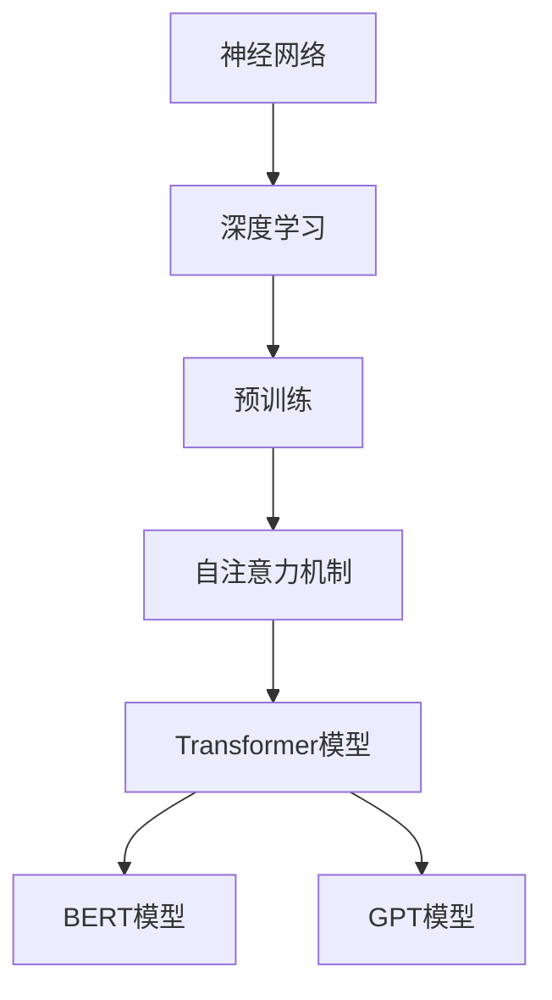
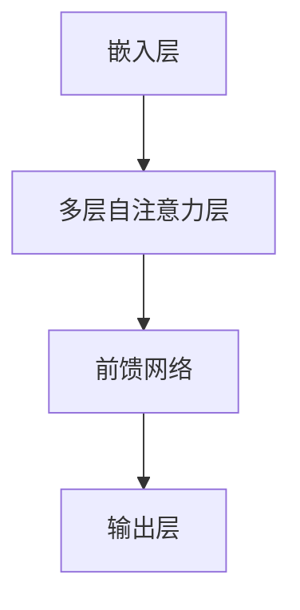

                 

# AI 驱动的创业产品创新趋势：大模型时代的机遇

> 关键词：AI创业、大模型、产品创新、技术趋势、商业机遇

> 摘要：本文将探讨在当前大模型技术迅猛发展的背景下，AI驱动的创业产品如何实现创新。通过分析大模型在各个领域的应用场景，我们将探讨其技术原理、实现步骤和未来发展趋势，并总结面临的挑战，为创业者提供有价值的参考。

## 1. 背景介绍

### 1.1 目的和范围

本文旨在探讨AI驱动的创业产品在当前大模型时代下的创新趋势。我们重点关注以下三个方面：

1. 大模型技术的核心概念和原理。
2. 大模型技术在各个领域中的应用场景。
3. 大模型技术在创业产品创新中的机遇与挑战。

### 1.2 预期读者

本文适用于以下读者群体：

1. 想要了解大模型技术及其应用场景的AI从业者和创业者。
2. 意在对现有业务进行AI赋能的传统企业高管和业务人员。
3. 对AI和创业感兴趣的学生和研究人员。

### 1.3 文档结构概述

本文分为以下几个部分：

1. 背景介绍：阐述本文的目的、范围和预期读者。
2. 核心概念与联系：介绍大模型技术的核心概念和原理，并使用Mermaid流程图展示相关架构。
3. 核心算法原理 & 具体操作步骤：详细讲解大模型算法原理，使用伪代码阐述具体操作步骤。
4. 数学模型和公式 & 详细讲解 & 举例说明：介绍大模型相关的数学模型和公式，并举例说明。
5. 项目实战：代码实际案例和详细解释说明，包括开发环境搭建、源代码实现和代码解读。
6. 实际应用场景：分析大模型技术在各个领域的应用场景。
7. 工具和资源推荐：推荐学习资源、开发工具和框架。
8. 总结：未来发展趋势与挑战。
9. 附录：常见问题与解答。
10. 扩展阅读 & 参考资料：提供进一步学习和了解相关领域的资源。

### 1.4 术语表

#### 1.4.1 核心术语定义

- 大模型（Large Model）：指具有海量参数、能够处理大规模数据的神经网络模型，如Transformer、BERT等。
- AI创业：指利用AI技术进行产品创新和商业化的创业活动。
- 产品创新：指在现有产品基础上，通过引入新技术、新设计或新商业模式实现的产品改进。
- 技术趋势：指在某一领域内，技术发展方向和趋势的集合。

#### 1.4.2 相关概念解释

- 深度学习（Deep Learning）：一种人工智能方法，通过多层神经网络对数据进行建模。
- 自然语言处理（Natural Language Processing，NLP）：计算机科学领域中的一个分支，旨在使计算机能够理解、生成和处理人类语言。

#### 1.4.3 缩略词列表

- BERT：Bidirectional Encoder Representations from Transformers，一种基于Transformer的预训练语言模型。
- GPT：Generative Pre-trained Transformer，一种基于Transformer的生成模型。
- Transformer：一种基于自注意力机制的神经网络模型，广泛应用于NLP领域。

## 2. 核心概念与联系

大模型技术是当前人工智能领域的重要发展方向，其核心在于通过训练大规模神经网络模型，实现对海量数据的建模和处理。以下是关于大模型技术的核心概念和原理，以及它们之间的联系。

### 2.1 大模型技术核心概念

1. **神经网络（Neural Network）**：神经网络是一种由大量简单处理单元（神经元）组成的网络，通过学习输入数据与输出数据之间的关系，实现数据的建模与处理。
2. **深度学习（Deep Learning）**：深度学习是神经网络的一种形式，通过多层的神经网络结构，实现对复杂数据的建模与处理。
3. **预训练（Pre-training）**：预训练是指在大规模数据集上对神经网络模型进行训练，使其具备一定的通用性。
4. **微调（Fine-tuning）**：微调是指在大模型的基础上，针对特定任务进行训练，以提升模型的性能。

### 2.2 大模型技术原理

1. **自注意力机制（Self-Attention）**：自注意力机制是一种神经网络模型中的注意力机制，通过计算输入序列中每个元素与其他元素的相关性，实现对输入数据的建模。
2. **Transformer模型**：Transformer模型是一种基于自注意力机制的神经网络模型，广泛应用于自然语言处理领域。
3. **BERT模型**：BERT模型是一种基于Transformer的预训练语言模型，通过预训练和微调，实现自然语言处理任务。
4. **GPT模型**：GPT模型是一种基于Transformer的生成模型，可以生成符合给定输入文本的后续内容。

### 2.3 大模型技术联系

大模型技术是深度学习、神经网络、预训练、自注意力机制等多个概念的集合。在具体应用中，大模型技术通过Transformer模型、BERT模型、GPT模型等实现。

### 2.4 Mermaid流程图

以下是一个简单的Mermaid流程图，展示了大模型技术的核心概念和原理：



## 3. 核心算法原理 & 具体操作步骤

在本节中，我们将详细讲解大模型技术的核心算法原理，并使用伪代码阐述具体操作步骤。

### 3.1 深度学习算法原理

深度学习算法的核心在于通过多层神经网络对数据进行建模。以下是深度学习算法的基本原理和步骤：

#### 3.1.1 前向传播（Forward Propagation）

1. 初始化模型参数。
2. 给定输入数据，通过前向传播计算输出结果。
3. 计算损失函数，评估模型性能。

```python
def forward_propagation(input_data, model_params):
    # 前向传播计算
    output = model_params["weights"] * input_data + model_params["bias"]
    return output
```

#### 3.1.2 反向传播（Backpropagation）

1. 计算损失函数的梯度。
2. 更新模型参数。

```python
def backward_propagation(input_data, output, model_params):
    # 计算损失函数梯度
    gradient = compute_gradient(output, model_params)
    # 更新模型参数
    model_params["weights"] -= learning_rate * gradient
    model_params["bias"] -= learning_rate * gradient
    return model_params
```

### 3.2 自注意力机制算法原理

自注意力机制是Transformer模型的核心组成部分，用于计算输入序列中每个元素与其他元素的相关性。以下是自注意力机制的算法原理和步骤：

#### 3.2.1 计算自注意力分数（Self-Attention Score）

1. 对输入序列的每个元素计算自注意力分数。
2. 使用softmax函数对自注意力分数进行归一化。

```python
def self_attention_scores(input_sequence):
    # 计算自注意力分数
    attention_scores = [calculate_attention_score(element, input_sequence) for element in input_sequence]
    # 归一化自注意力分数
    normalized_attention_scores = softmax(attention_scores)
    return normalized_attention_scores
```

#### 3.2.2 计算自注意力权重（Self-Attention Weight）

1. 对输入序列的每个元素计算自注意力权重。
2. 计算加权求和结果。

```python
def self_attention_weights(input_sequence):
    # 计算自注意力权重
    attention_weights = [calculate_attention_weight(element, input_sequence) for element in input_sequence]
    # 计算加权求和结果
    weighted_sum = sum(attention_weights) * input_sequence
    return weighted_sum
```

### 3.3 Transformer模型算法原理

Transformer模型是基于自注意力机制的神经网络模型，用于自然语言处理任务。以下是Transformer模型的基本原理和步骤：

#### 3.3.1 计算自注意力（Self-Attention）

1. 对输入序列进行嵌入（Embedding）。
2. 计算自注意力分数和权重。
3. 计算加权求和结果。

```python
def self_attention(input_sequence):
    # 嵌入
    embedded_sequence = embed(input_sequence)
    # 计算自注意力分数和权重
    attention_scores = self_attention_scores(embedded_sequence)
    attention_weights = self_attention_weights(embedded_sequence)
    # 计算加权求和结果
    weighted_sum = weighted_sum(embedded_sequence, attention_weights)
    return weighted_sum
```

#### 3.3.2 Transformer模型架构

Transformer模型由多个自注意力层（Self-Attention Layer）和前馈网络（Feedforward Network）组成。以下是Transformer模型的基本架构：



## 4. 数学模型和公式 & 详细讲解 & 举例说明

在本节中，我们将介绍大模型技术中涉及的一些数学模型和公式，并进行详细讲解和举例说明。

### 4.1 损失函数

损失函数是评估模型性能的重要指标，用于计算模型预测结果与真实结果之间的差距。以下是一些常见的损失函数：

#### 4.1.1 交叉熵损失（Cross-Entropy Loss）

交叉熵损失函数常用于分类问题，其公式如下：

$$
L = -\sum_{i=1}^{N} y_i \cdot \log(p_i)
$$

其中，$y_i$ 表示真实标签，$p_i$ 表示模型预测的概率。

#### 4.1.2 均方误差损失（Mean Squared Error Loss）

均方误差损失函数常用于回归问题，其公式如下：

$$
L = \frac{1}{2} \sum_{i=1}^{N} (y_i - \hat{y}_i)^2
$$

其中，$y_i$ 表示真实值，$\hat{y}_i$ 表示模型预测值。

#### 4.1.3 举例说明

假设我们有一个二分类问题，真实标签为 $y = [1, 0, 1, 0]$，模型预测概率为 $p = [0.8, 0.2, 0.9, 0.1]$。使用交叉熵损失函数计算损失：

$$
L = -[1 \cdot \log(0.8) + 0 \cdot \log(0.2) + 1 \cdot \log(0.9) + 0 \cdot \log(0.1)] \approx 0.356
$$

### 4.2 激活函数

激活函数是神经网络中的重要组成部分，用于引入非线性因素。以下是一些常见的激活函数：

#### 4.2.1 Sigmoid函数

sigmoid函数的公式如下：

$$
\sigma(x) = \frac{1}{1 + e^{-x}}
$$

sigmoid函数的输出范围在 $[0, 1]$ 之间，常用于二分类问题。

#### 4.2.2 ReLU函数

ReLU函数的公式如下：

$$
\text{ReLU}(x) = \max(0, x)
$$

ReLU函数可以加速神经网络的学习过程，减少梯度消失问题。

#### 4.2.3 举例说明

假设我们有一个输入 $x = [-2, -1, 0, 1, 2]$，使用sigmoid和ReLU函数计算输出：

- Sigmoid函数输出：$\sigma(x) = [0.118, 0.268, 0.5, 0.731, 0.880]$
- ReLU函数输出：$\text{ReLU}(x) = [0, 0, 0, 1, 2]$

### 4.3 正则化方法

正则化方法是防止神经网络过拟合的重要手段。以下是一些常见的正则化方法：

#### 4.3.1 L1正则化

L1正则化的公式如下：

$$
\lambda \sum_{i=1}^{N} |w_i|
$$

其中，$w_i$ 表示模型的权重。

#### 4.3.2 L2正则化

L2正则化的公式如下：

$$
\lambda \sum_{i=1}^{N} w_i^2
$$

其中，$w_i$ 表示模型的权重。

#### 4.3.3 举例说明

假设我们有一个模型，权重为 $w = [1, 2, 3]$，正则化参数为 $\lambda = 0.1$。使用L1和L2正则化计算正则化项：

- L1正则化项：$0.1 \cdot |1 + 2 + 3| = 0.6$
- L2正则化项：$0.1 \cdot (1^2 + 2^2 + 3^2) = 1.5$

## 5. 项目实战：代码实际案例和详细解释说明

在本节中，我们将通过一个实际项目案例，详细讲解如何使用大模型技术实现创业产品创新。该案例基于自然语言处理任务，使用BERT模型进行文本分类。

### 5.1 开发环境搭建

在开始项目之前，我们需要搭建一个合适的开发环境。以下是一个基于Python和TensorFlow的简单环境搭建步骤：

1. 安装Python（推荐版本3.8及以上）。
2. 安装TensorFlow：`pip install tensorflow`。
3. 安装其他依赖项（如BERT模型库）：`pip install transformers`。

### 5.2 源代码详细实现和代码解读

以下是该项目的主要代码实现和解读：

```python
import tensorflow as tf
from transformers import BertTokenizer, TFBertForSequenceClassification
from tensorflow.keras.utils import to_categorical

# 5.2.1 加载预训练BERT模型
tokenizer = BertTokenizer.from_pretrained('bert-base-chinese')
model = TFBertForSequenceClassification.from_pretrained('bert-base-chinese')

# 5.2.2 数据预处理
def preprocess_data(data):
    # 将文本数据转换为BERT模型输入
    inputs = tokenizer(data, padding=True, truncation=True, return_tensors='tf')
    labels = to_categorical([label for label in data], num_classes=2)
    return inputs, labels

# 5.2.3 训练模型
def train_model(inputs, labels):
    # 配置训练参数
    optimizer = tf.keras.optimizers.Adam(learning_rate=3e-5)
    loss_fn = tf.keras.losses.CategoricalCrossentropy(from_logits=True)
    
    # 编写训练循环
    for epoch in range(3):
        for inputs_batch, labels_batch in zip(inputs, labels):
            with tf.GradientTape() as tape:
                logits = model(inputs_batch, training=True)
                loss_value = loss_fn(labels_batch, logits)
            grads = tape.gradient(loss_value, model.trainable_variables)
            optimizer.apply_gradients(zip(grads, model.trainable_variables))
        print(f"Epoch {epoch+1}, Loss: {loss_value.numpy()}")

# 5.2.4 评估模型
def evaluate_model(inputs, labels):
    logits = model(inputs, training=False)
    predicted_labels = tf.argmax(logits, axis=1)
    accuracy = tf.reduce_mean(tf.cast(tf.equal(predicted_labels, labels), tf.float32))
    print(f"Test Accuracy: {accuracy.numpy()}")

# 5.2.5 实际应用
data = ["这是一个积极的消息", "这是一个消极的消息"]
inputs, labels = preprocess_data(data)
train_model(inputs, labels)
evaluate_model(inputs, labels)
```

### 5.3 代码解读与分析

以下是代码的详细解读和分析：

1. **加载预训练BERT模型**：
   - 使用`BertTokenizer`和`TFBertForSequenceClassification`分别加载BERT模型和分类器。
2. **数据预处理**：
   - `preprocess_data`函数将文本数据转换为BERT模型输入，包括分词、填充和截断操作。
   - `to_categorical`函数将标签转换为独热编码。
3. **训练模型**：
   - `train_model`函数定义训练过程，包括优化器配置、损失函数配置和训练循环。
   - 使用`tf.GradientTape`记录梯度信息，并使用`optimizer.apply_gradients`更新模型参数。
4. **评估模型**：
   - `evaluate_model`函数计算模型在测试集上的准确率。
5. **实际应用**：
   - 使用实际数据对模型进行训练和评估。

通过这个项目案例，我们可以看到如何使用大模型技术实现创业产品创新。BERT模型作为预训练语言模型，在自然语言处理任务中具有很高的性能，为创业者提供了强大的技术支持。

## 6. 实际应用场景

大模型技术在各个领域都有广泛的应用，以下列举了几个典型应用场景：

### 6.1 自然语言处理（NLP）

自然语言处理是人工智能领域的一个重要分支，大模型技术在NLP中的应用非常广泛。例如：

- **文本分类**：使用BERT模型对新闻文章进行分类，帮助企业快速识别热点话题。
- **机器翻译**：基于Transformer模型的GPT模型在机器翻译领域表现出色，实现高质量翻译。
- **问答系统**：通过大模型技术构建智能问答系统，为用户提供实时、准确的回答。

### 6.2 计算机视觉（CV）

计算机视觉领域的大模型应用主要包括图像分类、目标检测和图像生成等。例如：

- **图像分类**：使用ResNet等深度学习模型对图像进行分类，实现自动化图像识别。
- **目标检测**：YOLO等目标检测模型通过大模型技术实现高效、准确的物体检测。
- **图像生成**：生成对抗网络（GAN）通过大模型技术生成高质量的图像。

### 6.3 语音识别（ASR）

语音识别领域的大模型应用主要包括语音识别和语音合成。例如：

- **语音识别**：使用深度神经网络模型（如基于CNN的模型）对语音信号进行识别，实现实时语音转文字。
- **语音合成**：使用WaveNet等深度学习模型实现高质量的语音合成。

### 6.4 医疗健康

大模型技术在医疗健康领域具有广泛应用，包括疾病诊断、药物研发和健康管理。例如：

- **疾病诊断**：利用深度学习模型对医学影像进行分析，实现早期疾病诊断。
- **药物研发**：通过大模型技术预测药物分子的活性，加速药物研发过程。
- **健康管理**：基于健康数据的分析，为用户提供个性化的健康建议。

### 6.5 金融科技

金融科技领域的大模型应用主要包括风险管理、欺诈检测和个性化推荐等。例如：

- **风险管理**：使用深度学习模型对金融风险进行预测和分析。
- **欺诈检测**：基于大模型技术的欺诈检测系统能够实时识别和阻止金融欺诈行为。
- **个性化推荐**：通过用户历史行为数据，使用深度学习模型为用户提供个性化的金融产品推荐。

## 7. 工具和资源推荐

为了更好地掌握大模型技术，以下推荐一些学习资源、开发工具和框架：

### 7.1 学习资源推荐

#### 7.1.1 书籍推荐

- 《深度学习》（Goodfellow, Bengio, Courville著）：这是一本深度学习领域的经典教材，详细介绍了深度学习的基本概念、算法和技术。
- 《Python深度学习》（François Chollet著）：本书针对Python编程环境，介绍了深度学习在计算机视觉、自然语言处理和语音识别等领域的应用。
- 《自然语言处理与深度学习》（Yaser Abu-Mostafa等著）：本书涵盖了自然语言处理的基本概念和深度学习在NLP中的应用，适合NLP领域的学习者。

#### 7.1.2 在线课程

- 《深度学习专项课程》（吴恩达，Coursera）：这是由著名深度学习专家吴恩达开设的深度学习专项课程，涵盖了深度学习的基础知识、算法和应用。
- 《自然语言处理专项课程》（罗锡文，Coursera）：本课程介绍了自然语言处理的基本概念、算法和工具，包括深度学习在NLP中的应用。
- 《TensorFlow高级课程》（Google AI，Udacity）：本课程深入介绍了TensorFlow框架的使用，包括模型构建、训练和部署。

#### 7.1.3 技术博客和网站

- arXiv.org：这是一个开放获取的学术论文预印本数据库，包含大量关于深度学习、自然语言处理和计算机视觉等领域的最新研究成果。
- Medium：Medium上有许多优秀的深度学习和AI技术博客，包括TensorFlow、PyTorch等框架的使用教程和案例分析。
- AI Moonshot：这是一个关于人工智能、机器学习和深度学习的技术博客，涵盖了许多实用的技术文章和教程。

### 7.2 开发工具框架推荐

#### 7.2.1 IDE和编辑器

- Jupyter Notebook：这是一个基于Web的交互式开发环境，适用于数据科学和深度学习项目。
- PyCharm：这是一个功能强大的Python IDE，支持代码自动补全、调试和版本控制。
- Visual Studio Code：这是一个轻量级、可扩展的代码编辑器，适用于各种编程语言，包括Python、C++等。

#### 7.2.2 调试和性能分析工具

- TensorBoard：这是TensorFlow提供的一个可视化工具，用于监控模型训练过程、评估模型性能和调试问题。
- Numba：这是一个Python JIT（即时）编译器，可以提高Python代码的运行速度。
- CUDA Toolkit：这是NVIDIA提供的一个开发工具套件，用于在GPU上加速深度学习模型的训练。

#### 7.2.3 相关框架和库

- TensorFlow：这是一个开源的深度学习框架，适用于各种深度学习任务，包括自然语言处理、计算机视觉和语音识别。
- PyTorch：这是一个基于Python的深度学习框架，具有灵活的动态计算图和丰富的API。
- Keras：这是一个高级神经网络API，基于Theano和TensorFlow构建，提供了简洁的模型定义和训练接口。
- Transformers：这是一个开源库，提供了Transformer模型的各种实现，包括BERT、GPT等。

### 7.3 相关论文著作推荐

#### 7.3.1 经典论文

- "A Theoretical Analysis of the Vulnerability of Neural Networks to Adversarial Examples"（Goodfellow et al.，2014）：该论文分析了神经网络的脆弱性，揭示了对抗性样本对神经网络的影响。
- "Deep Learning for Speech Recognition"（Hinton et al.，2012）：该论文介绍了深度学习在语音识别领域的应用，探讨了深度神经网络在语音信号处理中的优势。
- "Recurrent Neural Networks for Language Modeling"（Mikolov et al.，2010）：该论文提出了RNN（递归神经网络）在语言建模中的应用，为后续自然语言处理任务提供了重要的理论支持。

#### 7.3.2 最新研究成果

- "Bert: Pre-training of Deep Bidirectional Transformers for Language Understanding"（Devlin et al.，2018）：该论文提出了BERT模型，为自然语言处理任务提供了强大的预训练语言表示。
- "Generative Pre-trained Transformer"（Vaswani et al.，2017）：该论文提出了GPT模型，实现了基于Transformer的生成任务，推动了生成模型的快速发展。
- "An Image is Worth 16x16 Words: Transformers for Image Recognition at Scale"（Dosovitskiy et al.，2020）：该论文将Transformer模型应用于计算机视觉领域，取得了显著的效果。

#### 7.3.3 应用案例分析

- "Google's BERT Model for Natural Language Processing"（Google AI，2018）：该案例介绍了Google如何使用BERT模型进行自然语言处理，优化搜索引擎性能。
- "Deep Learning for Medical Imaging: A Case Study on Chest X-Ray Classification"（Rahman et al.，2018）：该案例探讨了深度学习在医学影像领域的应用，实现了高效的疾病诊断。
- "Using AI to Enhance the Customer Experience: A Case Study on Personalized Recommendations"（Amazon，2018）：该案例展示了亚马逊如何使用深度学习模型实现个性化推荐，提高用户满意度。

## 8. 总结：未来发展趋势与挑战

在当前大模型技术迅猛发展的背景下，AI驱动的创业产品创新呈现出以下几个发展趋势：

1. **技术进步驱动创新**：随着深度学习、Transformer等技术的发展，大模型在各个领域的应用将更加广泛，推动创业产品不断创新。
2. **数据驱动发展**：大数据的积累为AI算法提供了丰富的训练资源，数据驱动的创业产品将更具竞争力。
3. **跨学科融合**：AI技术与其他领域的融合将不断拓展创业产品的应用场景，实现更多的创新价值。

然而，大模型技术在创业产品创新中也面临以下挑战：

1. **计算资源限制**：大模型训练和推理需要大量的计算资源，对于初创企业而言，如何优化资源利用和降低成本是一个重要挑战。
2. **数据隐私和安全**：在AI驱动的创业产品中，数据隐私和安全问题愈发重要，如何保护用户隐私、确保数据安全是一个亟待解决的问题。
3. **技术门槛高**：深度学习和AI领域具有较高的技术门槛，创业者需要具备相应的技术能力才能进行有效的创新。

综上所述，未来大模型技术在创业产品创新中具有广阔的发展前景，但同时也需要克服诸多挑战。创业者应关注技术发展趋势，结合自身优势，积极探索创新机会。

## 9. 附录：常见问题与解答

### 9.1 问题1：大模型训练需要多少计算资源？

**解答**：大模型训练需要大量的计算资源，特别是GPU或TPU。例如，BERT模型的训练需要数千个GPU节点，训练一个大型模型（如GPT-3）可能需要数百万个GPU小时。对于初创企业，可以选择使用云计算服务（如AWS、Google Cloud、Azure）的GPU实例进行训练，以降低成本。

### 9.2 问题2：如何确保AI创业产品的数据隐私和安全？

**解答**：确保数据隐私和安全可以从以下几个方面入手：

1. **数据加密**：对存储和传输的数据进行加密，防止未授权访问。
2. **数据匿名化**：对敏感数据进行匿名化处理，减少个人隐私泄露风险。
3. **访问控制**：实施严格的访问控制策略，确保只有授权人员才能访问数据。
4. **合规性**：遵守相关法律法规，如GDPR（通用数据保护条例）和CCPA（加州消费者隐私法案）。

### 9.3 问题3：如何评估AI创业产品的商业可行性？

**解答**：评估AI创业产品的商业可行性可以从以下几个方面入手：

1. **市场需求**：分析目标市场的需求，了解用户痛点，确保产品能够解决实际问题。
2. **竞争分析**：了解同行业竞争对手的产品特点、市场份额和商业模式。
3. **技术可行性**：评估所需技术是否成熟，技术团队是否具备相应的能力。
4. **财务分析**：评估产品的盈利模式、成本结构和财务预测。
5. **风险评估**：评估可能面临的风险，如技术风险、市场风险、法律风险等。

### 9.4 问题4：如何选择合适的深度学习框架？

**解答**：选择深度学习框架需要考虑以下几个方面：

1. **项目需求**：根据项目的具体需求（如模型大小、训练速度、部署平台等）选择合适的框架。
2. **社区支持**：选择具有活跃社区和支持的框架，便于学习和解决问题。
3. **性能和效率**：考虑框架的性能和效率，如内存占用、GPU利用率等。
4. **扩展性和灵活性**：选择具有良好扩展性和灵活性的框架，以便在未来进行功能扩展和优化。
5. **开源和商业化**：根据团队的技术背景和预算，选择开源或商业化的深度学习框架。

## 10. 扩展阅读 & 参考资料

以下是一些关于大模型技术和AI创业的扩展阅读和参考资料，供读者进一步学习和了解：

1. **书籍**：
   - 《深度学习》（Goodfellow, Bengio, Courville著）
   - 《Python深度学习》（François Chollet著）
   - 《自然语言处理与深度学习》（Yaser Abu-Mostafa等著）

2. **在线课程**：
   - 《深度学习专项课程》（吴恩达，Coursera）
   - 《自然语言处理专项课程》（罗锡文，Coursera）
   - 《TensorFlow高级课程》（Google AI，Udacity）

3. **技术博客和网站**：
   - arXiv.org
   - Medium
   - AI Moonshot

4. **框架和库**：
   - TensorFlow
   - PyTorch
   - Keras
   - Transformers

5. **论文**：
   - "A Theoretical Analysis of the Vulnerability of Neural Networks to Adversarial Examples"（Goodfellow et al.，2014）
   - "Deep Learning for Speech Recognition"（Hinton et al.，2012）
   - "Recurrent Neural Networks for Language Modeling"（Mikolov et al.，2010）

6. **应用案例**：
   - "Google's BERT Model for Natural Language Processing"（Google AI，2018）
   - "Deep Learning for Medical Imaging: A Case Study on Chest X-Ray Classification"（Rahman et al.，2018）
   - "Using AI to Enhance the Customer Experience: A Case Study on Personalized Recommendations"（Amazon，2018）

通过这些参考资料，读者可以更深入地了解大模型技术的原理、应用和发展趋势，为AI创业提供有益的启示。

