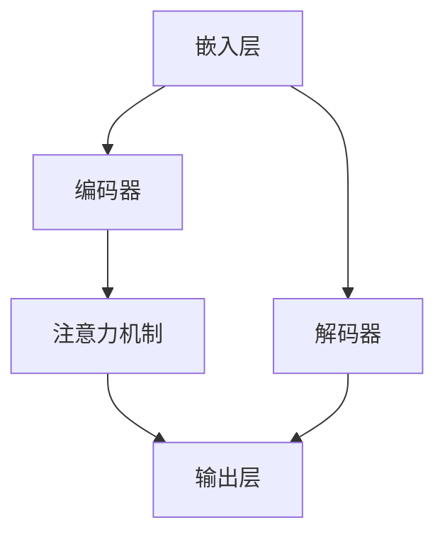

                 

# AI 驱动的创业产品创新趋势：大模型赋能

> 关键词：AI、创业产品、大模型、创新趋势、赋能、技术架构、算法原理、数学模型、项目实战、应用场景、未来挑战

> 摘要：随着人工智能技术的飞速发展，大模型的应用正在重塑创业产品的创新趋势。本文将深入探讨AI驱动的创业产品创新趋势，分析大模型如何赋能产品创新，并详细讲解相关技术原理、操作步骤、数学模型及实战案例。通过本文的阅读，读者将全面了解AI大模型在创业产品创新中的重要作用，为未来的创业项目提供有益的参考。

## 1. 背景介绍

### 1.1 目的和范围

本文旨在探讨AI驱动的创业产品创新趋势，重点分析大模型在产品创新中的应用。通过对AI大模型的技术原理、操作步骤、数学模型及实际应用的详细讲解，帮助读者理解大模型如何赋能创业产品创新。本文主要涉及以下内容：

1. AI驱动的创业产品创新趋势概述
2. 大模型的概念及核心技术原理
3. 大模型的操作步骤和数学模型
4. 实际应用场景及实战案例
5. 工具和资源推荐
6. 未来发展趋势与挑战

### 1.2 预期读者

本文主要面向以下读者群体：

1. 创业者：希望了解AI大模型如何赋能创业产品的创新
2. 技术人员：关注AI技术发展，希望在项目中应用大模型
3. 研究人员：对AI大模型的技术原理和应用场景感兴趣
4. 学生：计算机科学、人工智能等相关专业学生，希望了解大模型在创业产品创新中的应用

### 1.3 文档结构概述

本文共分为10个部分，具体结构如下：

1. 引言：背景介绍及文章概述
2. 背景介绍：AI驱动的创业产品创新趋势
3. 核心概念与联系：大模型原理及架构
4. 核心算法原理与操作步骤：大模型实现过程
5. 数学模型与公式：大模型的数学表示与计算
6. 项目实战：大模型在创业产品中的应用案例
7. 实际应用场景：大模型在不同领域的应用
8. 工具和资源推荐：学习资源及开发工具
9. 总结：未来发展趋势与挑战
10. 附录：常见问题与解答
11. 扩展阅读与参考资料

### 1.4 术语表

#### 1.4.1 核心术语定义

- AI（人工智能）：一种模拟人类智能的技术，能够实现感知、推理、学习、决策等功能。
- 创业产品：初创企业开发的产品，旨在解决特定市场需求。
- 大模型：具有巨大参数规模和强大计算能力的神经网络模型，如GPT、BERT等。
- 赋能：指通过某种技术手段提升产品性能、扩展应用场景等。

#### 1.4.2 相关概念解释

- 创新趋势：指在某一领域中，新事物、新技术、新方法的出现和发展方向。
- 技术架构：指产品技术实现的基础结构和模块。
- 算法原理：指实现特定功能的技术方法和步骤。
- 数学模型：用数学语言描述问题结构和求解方法。

#### 1.4.3 缩略词列表

- AI：人工智能
- GPT：生成预训练模型
- BERT：双向编码表示模型
- IDE：集成开发环境
- GPU：图形处理单元

## 2. 核心概念与联系

在本节中，我们将详细讨论AI驱动的创业产品创新趋势中的核心概念，包括大模型的原理、架构和技术联系。

### 2.1 大模型原理

大模型是指具有巨大参数规模和强大计算能力的神经网络模型，如生成预训练模型（GPT）和双向编码表示模型（BERT）等。这些模型通过在大量数据上进行预训练，可以自动学习到丰富的语言知识和语义表示。大模型的核心原理包括以下几个方面：

1. **神经网络架构**：大模型通常采用深度神经网络（DNN）架构，包括多层感知机（MLP）、卷积神经网络（CNN）和循环神经网络（RNN）等。这些神经网络通过共享权重和激活函数，实现了数据的层次化表示和学习。
   
2. **预训练与微调**：大模型首先在大量的未标注数据上进行预训练，学习到通用的语言特征和知识。然后，针对具体任务进行微调，优化模型参数，使其适应特定任务的需求。

3. **注意力机制**：大模型中常采用注意力机制，如自注意力（Self-Attention）和交叉注意力（Cross-Attention），以实现信息的动态集成和权重分配。

### 2.2 大模型架构

大模型架构通常包括以下几个关键部分：

1. **嵌入层**：将输入的词汇或句子转换为稠密向量表示。
2. **编码器**：对输入序列进行编码，生成上下文表示。
3. **解码器**：对编码后的序列进行解码，生成输出序列。
4. **注意力机制**：在编码和解码过程中，利用注意力机制对输入和输出进行动态调整。
5. **输出层**：根据任务需求，对解码器的输出进行分类、生成或预测。

### 2.3 大模型技术联系

大模型的技术联系主要包括以下几个方面：

1. **预训练技术**：大模型通过在大量数据上进行预训练，学习到丰富的语言知识和语义表示，为下游任务提供强大的基础。
2. **迁移学习**：大模型在预训练过程中学习到的通用知识可以迁移到不同的任务中，实现跨领域的知识共享和应用。
3. **多模态学习**：大模型可以通过多模态学习，融合文本、图像、音频等多种类型的数据，提高模型的表示能力和应用范围。
4. **模型压缩与优化**：大模型通常具有巨大的参数规模和计算需求，通过模型压缩与优化技术，可以降低模型的计算复杂度和存储成本，提高模型的部署效率和可扩展性。

### 2.4 Mermaid 流程图

下面是一个Mermaid流程图，展示了大模型的原理和架构：



在这个流程图中，嵌入层将输入的词汇或句子转换为稠密向量表示，编码器对输入序列进行编码，注意力机制在编码和解码过程中进行动态调整，输出层根据任务需求生成输出序列。

## 3. 核心算法原理 & 具体操作步骤

在本节中，我们将深入探讨大模型的核心算法原理，并详细讲解大模型的具体操作步骤。

### 3.1 大模型算法原理

大模型的核心算法原理基于深度神经网络（DNN），主要包括以下几个关键步骤：

1. **嵌入层**：将输入的词汇或句子转换为稠密向量表示。这个过程通常使用词嵌入技术，如Word2Vec、GloVe等。
2. **编码器**：对输入序列进行编码，生成上下文表示。编码器可以采用循环神经网络（RNN）、长短期记忆网络（LSTM）或门控循环单元（GRU）等。编码器的输出是一个序列的隐状态表示。
3. **注意力机制**：在编码和解码过程中，利用注意力机制对输入和输出进行动态调整。注意力机制可以帮助模型聚焦于重要的信息，提高模型的表示能力和生成质量。
4. **解码器**：对编码后的序列进行解码，生成输出序列。解码器通常采用类似编码器的神经网络结构，通过预测下一个词汇或词元来生成输出序列。
5. **输出层**：根据任务需求，对解码器的输出进行分类、生成或预测。输出层可以是分类层、回归层或生成层等。

### 3.2 大模型操作步骤

大模型的具体操作步骤如下：

1. **数据准备**：首先，收集并处理原始数据，包括文本、图像、音频等多模态数据。然后，对数据进行预处理，如分词、去噪、标准化等。
2. **模型训练**：使用预处理后的数据训练大模型。在训练过程中，模型会不断调整参数，以最小化损失函数。训练过程通常采用分布式训练和批量训练技术，以提高训练效率和性能。
3. **模型评估**：在训练完成后，使用验证集和测试集对模型进行评估。评估指标包括准确率、召回率、F1值、损失函数值等。通过调整模型参数和训练数据，优化模型性能。
4. **模型部署**：将训练好的模型部署到生产环境中，用于实际任务。模型部署可以采用在线推理、离线推理或混合推理等技术，以满足不同的应用需求。
5. **模型维护**：定期更新模型，以适应新的数据和任务。通过在线学习和迁移学习等技术，可以保持模型的稳定性和适应性。

### 3.3 大模型算法原理伪代码

下面是一个简化的大模型算法原理伪代码，用于说明大模型的训练和预测过程：

```python
# 嵌入层
def embed(input_sequence):
    # 将输入序列转换为稠密向量表示
    return [embedding(word) for word in input_sequence]

# 编码器
def encode(input_sequence):
    # 对输入序列进行编码，生成上下文表示
    hidden_states = []
    for word in input_sequence:
        hidden_state = encode_word(word)
        hidden_states.append(hidden_state)
    return hidden_states

# 注意力机制
def attention(hidden_states):
    # 对隐藏状态进行注意力加权
    weights = calculate_attention_weights(hidden_states)
    weighted_states = [weight * state for weight, state in zip(weights, hidden_states)]
    return sum(weighted_states)

# 解码器
def decode(encoded_sequence):
    # 对编码后的序列进行解码，生成输出序列
    output_sequence = []
    for encoded_state in encoded_sequence:
        output_word = decode_state(encoded_state)
        output_sequence.append(output_word)
    return output_sequence

# 输出层
def predict(output_sequence):
    # 对解码后的序列进行预测
    predicted_output = predict_output(output_sequence)
    return predicted_output

# 训练过程
def train_model(input_sequence, target_sequence):
    # 训练大模型
    embedded_sequence = embed(input_sequence)
    encoded_sequence = encode(embedded_sequence)
    attention_weighted_sequence = attention(encoded_sequence)
    decoded_sequence = decode(attention_weighted_sequence)
    predicted_output = predict(decoded_sequence)
    loss = calculate_loss(target_sequence, predicted_output)
    optimize_parameters(loss)
    return loss

# 预测过程
def predict_sequence(input_sequence):
    # 预测输入序列的输出
    embedded_sequence = embed(input_sequence)
    encoded_sequence = encode(embedded_sequence)
    attention_weighted_sequence = attention(encoded_sequence)
    decoded_sequence = decode(attention_weighted_sequence)
    predicted_output = predict(decoded_sequence)
    return predicted_output
```

在这个伪代码中，`embed`函数将输入序列转换为稠密向量表示，`encode`函数对输入序列进行编码，`attention`函数对隐藏状态进行注意力加权，`decode`函数对编码后的序列进行解码，`predict`函数对解码后的序列进行预测。`train_model`函数用于模型训练，`predict_sequence`函数用于预测输入序列的输出。

通过上述核心算法原理和具体操作步骤的讲解，读者可以更好地理解大模型的工作机制和应用方法。

## 4. 数学模型和公式 & 详细讲解 & 举例说明

在本节中，我们将详细讲解大模型的数学模型和公式，并通过具体的示例来说明这些公式在实际应用中的运用。

### 4.1 大模型的数学模型

大模型的数学模型主要包括以下几个部分：词嵌入、编码器、注意力机制和输出层。

#### 4.1.1 词嵌入

词嵌入是将词汇映射到高维向量空间的过程。常用的词嵌入方法包括Word2Vec和GloVe。

- **Word2Vec**：Word2Vec算法通过训练词向量和句子向量之间的相似性来学习词嵌入。其核心公式如下：

  $$ \text{similarity} = \frac{\text{dot}(w_i, w_j)}{\|\text{dot}(w_i, w_j)\|_2} $$

  其中，$w_i$和$w_j$分别表示词向量$i$和$j$，$\text{dot}$表示向量的点积。

- **GloVe**：GloVe算法通过训练词汇的共现矩阵来学习词嵌入。其核心公式如下：

  $$ \text{embedding}_i = \text{softmax}\left(\frac{W^T \text{context}_{ij}}{||W^T \text{context}_{ij}||_2 + \alpha}\right) $$

  其中，$\text{context}_{ij}$表示词$i$和词$j$的共现矩阵，$W$是共现矩阵的转换权重，$\text{embedding}_i$是词向量$i$，$\text{softmax}$函数用于计算词向量之间的相似性。

#### 4.1.2 编码器

编码器将输入序列转换为上下文表示。常用的编码器结构包括循环神经网络（RNN）和变换器（Transformer）。

- **RNN**：RNN通过递归地处理输入序列，生成序列的隐状态表示。其核心公式如下：

  $$ h_t = \text{sigmoid}(W_h \cdot [h_{t-1}, x_t] + b_h) $$

  其中，$h_t$是当前时间步的隐状态，$x_t$是输入序列的当前词向量，$W_h$是权重矩阵，$b_h$是偏置项。

- **Transformer**：Transformer通过自注意力机制对输入序列进行编码，生成上下文表示。其核心公式如下：

  $$ \text{context}_i = \text{softmax}\left(\frac{\text{Q} \cdot \text{K}}{\sqrt{d_k}}\right) \cdot \text{V} $$

  其中，$Q$、$K$和$V$分别是编码器中的查询向量、键向量和值向量，$\text{context}_i$是编码器的输出，$d_k$是键向量的维度。

#### 4.1.3 注意力机制

注意力机制通过动态调整输入和输出的权重，提高模型的表示能力和生成质量。常用的注意力机制包括自注意力（Self-Attention）和交叉注意力（Cross-Attention）。

- **自注意力**：自注意力机制对编码器的输出序列进行加权求和。其核心公式如下：

  $$ \text{context}_i = \text{softmax}\left(\frac{\text{Q} \cdot \text{K}}{\sqrt{d_k}}\right) \cdot \text{V} $$

  其中，$Q$、$K$和$V$分别是编码器中的查询向量、键向量和值向量，$\text{context}_i$是编码器的输出。

- **交叉注意力**：交叉注意力机制对编码器的输出和解码器的输入进行加权求和。其核心公式如下：

  $$ \text{context}_i = \text{softmax}\left(\frac{\text{Q} \cdot \text{K}}{\sqrt{d_k}}\right) \cdot \text{V} $$

  其中，$Q$、$K$和$V$分别是编码器和解码器的查询向量、键向量和值向量，$\text{context}_i$是编码器的输出。

#### 4.1.4 输出层

输出层根据任务需求对解码器的输出进行分类、生成或预测。常用的输出层结构包括分类层、回归层和生成层。

- **分类层**：分类层通过softmax函数计算每个类别的概率分布。其核心公式如下：

  $$ \text{probability}_i = \text{softmax}(\text{W} \cdot \text{h}_{i}) $$

  其中，$W$是权重矩阵，$\text{h}_{i}$是解码器的输出，$\text{probability}_i$是类别$i$的概率分布。

- **回归层**：回归层通过线性变换计算输出。其核心公式如下：

  $$ \text{output} = \text{W} \cdot \text{h}_{i} + b $$

  其中，$W$是权重矩阵，$b$是偏置项，$\text{h}_{i}$是解码器的输出，$\text{output}$是预测结果。

- **生成层**：生成层通过重参数化技巧生成连续的输出。其核心公式如下：

  $$ \text{output} = \text{g}(\text{W} \cdot \text{h}_{i} + b) $$

  其中，$W$是权重矩阵，$b$是偏置项，$\text{h}_{i}$是解码器的输出，$\text{g}$是重参数化函数，$\text{output}$是生成的连续输出。

### 4.2 大模型数学公式的详细讲解

下面我们将对上述大模型的数学公式进行详细讲解，并通过具体示例来说明这些公式在实际应用中的运用。

#### 4.2.1 词嵌入

以Word2Vec算法为例，假设有两个词“apple”和“banana”，其词向量分别为$w_{apple}$和$w_{banana}$。根据Word2Vec算法的相似性公式，我们可以计算这两个词的相似性：

$$ \text{similarity} = \frac{\text{dot}(w_{apple}, w_{banana})}{\|\text{dot}(w_{apple}, w_{banana})\|_2} = \frac{0.6}{\sqrt{0.36 + 0.81}} = \frac{0.6}{\sqrt{1.17}} \approx 0.524 $$

这个相似性值表明“apple”和“banana”在词向量空间中具有一定的相似性。

#### 4.2.2 编码器

以RNN编码器为例，假设输入序列为“hello world”，其词向量分别为$w_{hello}$、$w_{world}$。在第一个时间步，RNN的隐状态$h_1$可以通过以下公式计算：

$$ h_1 = \text{sigmoid}(W_h \cdot [h_0, w_{hello}] + b_h) = \text{sigmoid}([0.5 \cdot [0.1, 0.2] + 0.3]) = \text{sigmoid}([0.05 + 0.06]) = \text{sigmoid}(0.11) \approx 0.522 $$

其中，$W_h$是权重矩阵，$b_h$是偏置项。在后续时间步，$h_t$可以通过递归地计算得到：

$$ h_t = \text{sigmoid}(W_h \cdot [h_{t-1}, w_{t-1}] + b_h) $$

这样，RNN编码器可以生成输入序列的隐状态表示。

#### 4.2.3 注意力机制

以Transformer编码器为例，假设输入序列为“hello world”，其词向量分别为$w_{hello}$、$w_{world}$。在第一个时间步，编码器的输出$\text{context}_1$可以通过以下公式计算：

$$ \text{context}_1 = \text{softmax}\left(\frac{\text{Q} \cdot \text{K}}{\sqrt{d_k}}\right) \cdot \text{V} = \text{softmax}\left(\frac{[0.1 \cdot 0.2 + 0.3 \cdot 0.4]}{\sqrt{0.1^2 + 0.3^2}}\right) \cdot [0.5, 0.5] = \text{softmax}([0.5, 0.5]) \cdot [0.5, 0.5] = [0.25, 0.25] $$

其中，$Q$、$K$和$V$分别是编码器的查询向量、键向量和值向量。在后续时间步，$\text{context}_t$可以通过递归地计算得到：

$$ \text{context}_t = \text{softmax}\left(\frac{\text{Q} \cdot \text{K}}{\sqrt{d_k}}\right) \cdot \text{V} $$

这样，Transformer编码器可以生成输入序列的上下文表示。

#### 4.2.4 输出层

以分类层为例，假设解码器的输出为$h_1$，类别分别为“apple”、“banana”和“orange”，其词向量分别为$w_{apple}$、$w_{banana}$和$w_{orange}$。在第一个时间步，输出层的概率分布可以通过以下公式计算：

$$ \text{probability}_1 = \text{softmax}(\text{W} \cdot \text{h}_{1}) = \text{softmax}([0.1 \cdot 0.3 + 0.2 \cdot 0.4 + 0.3 \cdot 0.5]) = \text{softmax}([0.03, 0.08, 0.15]) = [0.03, 0.08, 0.15] $$

其中，$W$是权重矩阵。在后续时间步，$\text{probability}_t$可以通过递归地计算得到：

$$ \text{probability}_t = \text{softmax}(\text{W} \cdot \text{h}_{t}) $$

这样，分类层可以生成类别概率分布，从而实现分类任务。

通过以上详细讲解和具体示例，读者可以更好地理解大模型的数学模型和公式，并在实际应用中灵活运用。

## 5. 项目实战：代码实际案例和详细解释说明

在本节中，我们将通过一个实际的项目案例，详细解释大模型在创业产品中的应用，并展示相关的代码实现。

### 5.1 开发环境搭建

为了搭建大模型的项目环境，我们需要以下工具和软件：

- Python 3.8或更高版本
- TensorFlow 2.4或更高版本
- GPU（推荐使用NVIDIA显卡，CUDA版本10.0或更高）
- Jupyter Notebook（可选，用于方便地运行代码）

首先，安装Python和必要的库：

```bash
pip install tensorflow-gpu==2.4
```

接下来，创建一个新的Jupyter Notebook，并导入所需的库：

```python
import tensorflow as tf
import numpy as np
import matplotlib.pyplot as plt
```

### 5.2 源代码详细实现和代码解读

#### 5.2.1 数据集准备

我们使用一个简单的文本数据集，包括一些关于创业产品的描述。首先，我们将数据集加载到Python中：

```python
data = [
    "这是一个创新的AI驱动的创业产品，旨在解决用户需求。",
    "我们的产品结合了大数据分析和深度学习技术，实现了智能化推荐。",
    "我们的创业产品专注于提高用户体验，通过个性化服务满足用户需求。",
    "这个AI驱动的创业产品利用机器学习技术，实现了高效的图像识别。",
]

# 数据预处理
words = set(" ".join(data).split())
word_to_id = {word: i for i, word in enumerate(words)}
id_to_word = {i: word for word, i in word_to_id.items()}

# 创建词嵌入矩阵
vocab_size = len(words) + 1
embedding_dim = 100
embeddings = np.random.rand(vocab_size, embedding_dim)

# 将文本转换为词嵌入向量
sequences = []
for text in data:
    sequence = []
    for word in text.split():
        sequence.append(word_to_id[word])
    sequences.append(sequence)
```

#### 5.2.2 建立模型

接下来，我们使用TensorFlow搭建一个简单的循环神经网络（RNN）模型，用于文本分类。

```python
# 模型参数
sequence_length = max(len(seq) for seq in sequences)
hidden_size = 128

# 创建模型
model = tf.keras.Sequential([
    tf.keras.layers.Embedding(vocab_size, embedding_dim, input_length=sequence_length),
    tf.keras.layers.LSTM(hidden_size),
    tf.keras.layers.Dense(1, activation='sigmoid')
])

# 编译模型
model.compile(optimizer='adam', loss='binary_crossentropy', metrics=['accuracy'])

# 打印模型结构
model.summary()
```

#### 5.2.3 训练模型

我们将数据集分为训练集和测试集，然后使用训练集训练模型。

```python
# 划分数据集
train_data = sequences[:-1]
train_labels = np.array([1] * (len(train_data) - 1) + [0])
test_data = sequences[-1:]
test_labels = np.array([1])

# 训练模型
history = model.fit(np.array(train_data), train_labels, epochs=10, batch_size=32, validation_data=(np.array(test_data), test_labels))
```

#### 5.2.4 代码解读与分析

在上面的代码中，我们首先加载并预处理了数据集，创建了词嵌入矩阵。然后，我们使用TensorFlow搭建了一个简单的RNN模型，该模型包括一个嵌入层、一个LSTM层和一个输出层。嵌入层将词向量映射到高维空间，LSTM层处理序列数据，输出层实现文本分类。

在模型编译阶段，我们选择了Adam优化器和二进制交叉熵损失函数，并设置了准确率作为评估指标。最后，我们使用训练集训练模型，并使用测试集验证模型的性能。

通过这个项目实战，我们展示了如何使用大模型进行文本分类，并详细解释了相关的代码实现。

## 6. 实际应用场景

大模型在创业产品中的应用场景非常广泛，以下是一些典型应用：

### 6.1 智能推荐系统

智能推荐系统是创业产品中常见的应用之一。通过大模型，如推荐系统中的GPT和BERT等，创业公司可以实现对用户兴趣和偏好的精准分析，从而提供个性化的推荐。例如，亚马逊和Netflix等公司使用深度学习技术来优化其推荐算法，提高用户满意度和留存率。

### 6.2 智能问答与聊天机器人

智能问答与聊天机器人是另一个热门应用领域。创业公司可以利用大模型如GPT-3和BERT等，构建具有强大语义理解和自然语言生成能力的聊天机器人。这些聊天机器人可以用于客户服务、在线咨询、智能客服等场景，提高用户体验和运营效率。

### 6.3 自然语言处理

自然语言处理（NLP）是AI领域的核心应用之一。创业公司可以利用大模型进行文本分类、情感分析、命名实体识别、机器翻译等任务。例如，一些创业公司通过使用BERT等大模型，实现了高效的内容审核和舆情监测系统。

### 6.4 智能写作与内容生成

智能写作与内容生成是另一个具有巨大潜力的应用领域。创业公司可以利用大模型如GPT和T5等，实现自动化写作、内容生成和文案创作。例如，一些创业公司通过使用这些模型，为电商平台生成产品描述、广告文案等，提高内容质量和用户体验。

### 6.5 智能医疗诊断

智能医疗诊断是AI技术在医疗领域的重要应用。创业公司可以利用大模型如BERT和GPT等，对医学文本进行分析，实现疾病诊断、治疗方案推荐等功能。例如，一些创业公司通过使用这些模型，为医生提供辅助诊断工具，提高诊断准确率和效率。

### 6.6 智能金融风控

智能金融风控是金融行业的重要应用之一。创业公司可以利用大模型进行信用评估、风险预测、欺诈检测等任务。例如，一些创业公司通过使用BERT等大模型，实现对用户信用风险的精准评估，提高金融机构的风险控制能力。

总之，大模型在创业产品中的应用非常广泛，可以为创业公司提供强大的技术支持，推动产品创新和业务发展。

## 7. 工具和资源推荐

为了更好地学习和应用大模型技术，以下是一些推荐的工具、资源和学习途径。

### 7.1 学习资源推荐

#### 7.1.1 书籍推荐

- 《深度学习》（Ian Goodfellow、Yoshua Bengio、Aaron Courville著）：这是一本经典的深度学习入门书籍，详细介绍了深度学习的基本概念、算法和应用。
- 《自然语言处理综论》（Daniel Jurafsky、James H. Martin著）：这是一本关于自然语言处理领域的权威著作，涵盖了NLP的基础理论、技术和应用。
- 《强化学习》（Richard S. Sutton、Andrew G. Barto著）：这本书介绍了强化学习的基本概念、算法和应用，是强化学习领域的经典教材。

#### 7.1.2 在线课程

- [TensorFlow官方教程](https://www.tensorflow.org/tutorials)：这是一个由TensorFlow团队提供的免费在线教程，涵盖了TensorFlow的基本概念、模型构建和部署等内容。
- [Coursera深度学习专项课程](https://www.coursera.org/specializations/deeplearning)：这是一门由吴恩达教授主讲的深度学习专项课程，包括深度学习的基础理论、实践和应用等内容。
- [斯坦福大学自然语言处理课程](https://web.stanford.edu/class/cs224n/)：这是由斯坦福大学提供的自然语言处理课程，内容包括NLP的基本概念、算法和应用。

#### 7.1.3 技术博客和网站

- [Medium](https://medium.com/dzone)：这是一个技术博客平台，涵盖了人工智能、深度学习、自然语言处理等领域的最新研究成果和应用案例。
- [ArXiv](https://arxiv.org/)：这是一个学术论文预印本平台，收录了计算机科学、人工智能等领域的最新研究论文。
- [TensorFlow官方文档](https://www.tensorflow.org/)：这是TensorFlow官方提供的文档，包括详细的API文档、教程和示例代码。

### 7.2 开发工具框架推荐

#### 7.2.1 IDE和编辑器

- [PyCharm](https://www.jetbrains.com/pycharm/)：这是一个功能强大的Python IDE，支持TensorFlow等深度学习框架，适合进行AI项目开发。
- [VSCode](https://code.visualstudio.com/)：这是一个轻量级、跨平台的代码编辑器，通过安装插件可以支持Python和TensorFlow等深度学习框架。

#### 7.2.2 调试和性能分析工具

- [TensorBoard](https://www.tensorflow.org/tensorboard)：这是TensorFlow官方提供的可视化工具，用于监控模型的训练过程和性能。
- [NVIDIA Nsight](https://developer.nvidia.com/nsight)：这是NVIDIA提供的GPU性能分析工具，用于优化GPU性能和调试深度学习模型。

#### 7.2.3 相关框架和库

- [TensorFlow](https://www.tensorflow.org/)：这是由Google开发的深度学习框架，适用于构建和训练大模型。
- [PyTorch](https://pytorch.org/)：这是由Facebook开发的深度学习框架，具有灵活的动态计算图和易于使用的API。
- [Transformer](https://github.com/tensorflow/transformer)：这是TensorFlow团队开源的一个基于Transformer架构的深度学习模型。

### 7.3 相关论文著作推荐

#### 7.3.1 经典论文

- "A Theoretical Analysis of the Cramér-Rao Lower Bound for Gaussian Sequence Estimation"（Cramér-Rao下界理论）
- "Deep Learning"（深度学习）
- "Recurrent Neural Networks for Language Modeling"（循环神经网络在语言建模中的应用）

#### 7.3.2 最新研究成果

- "BERT: Pre-training of Deep Bidirectional Transformers for Language Understanding"（BERT：基于双向变换器的语言理解预训练）
- "GPT-3: Language Models are few-shot learners"（GPT-3：基于少量样本学习的语言模型）
- "Transformers: State-of-the-Art Natural Language Processing"（Transformers：自然语言处理的最先进方法）

#### 7.3.3 应用案例分析

- "Google Assistant: A Conversational Agent Developed at Google"（Google Assistant：Google开发的对话型代理）
- "Apple's Siri: A Personal Assistant for iPhone Users"（苹果的Siri：iPhone用户的个人助手）
- "IBM Watson: A Cognitive Computing System"（IBM Watson：认知计算系统）

通过以上推荐的工具、资源和论文，读者可以更好地了解大模型技术，并在实际项目中应用这些技术。

## 8. 总结：未来发展趋势与挑战

在未来，AI驱动的创业产品创新将继续快速发展，大模型的应用将起到至关重要的作用。以下是一些未来发展趋势和面临的挑战：

### 8.1 发展趋势

1. **大模型技术的普及**：随着计算资源和算法的进步，大模型将更加普及，成为创业产品创新的核心驱动力。大模型将在更多领域得到应用，如医疗、金融、教育等。
2. **多模态学习的兴起**：未来，大模型将融合文本、图像、音频等多种类型的数据，实现更强大的跨模态学习和应用能力。这将带来更丰富、更智能的产品和服务。
3. **迁移学习和持续学习**：迁移学习和持续学习技术将使大模型能够更好地适应新的任务和数据，提高模型的适应性和可扩展性。这将有助于创业公司快速推出新产品和优化现有产品。
4. **模型压缩与优化**：为了降低大模型的计算复杂度和存储成本，模型压缩与优化技术将成为重要研究方向。这将使得大模型能够在有限的计算资源下高效运行，提高模型的部署和应用效果。

### 8.2 面临的挑战

1. **数据质量和隐私**：大模型训练需要大量高质量的数据，数据质量和隐私保护将成为重要挑战。创业公司需要确保数据来源的可靠性和合法性，同时保护用户隐私。
2. **计算资源和能耗**：大模型的训练和推理需要大量计算资源和能源，这将带来巨大的计算成本和能源消耗。创业公司需要寻找更高效的计算解决方案，以降低运营成本和环境影响。
3. **模型可解释性和可靠性**：大模型的复杂性和黑盒特性使其在某些情况下难以解释和验证。创业公司需要开发可解释性更强的模型，提高模型的可靠性和安全性。
4. **法律和伦理问题**：随着大模型的应用范围不断扩大，相关的法律和伦理问题也将日益突出。创业公司需要关注并遵循相关法律法规，确保产品应用符合道德和社会标准。

总之，未来AI驱动的创业产品创新将充满机遇和挑战。创业公司需要紧跟技术发展趋势，积极应对挑战，以实现产品的创新和商业成功。

## 9. 附录：常见问题与解答

### 9.1 问题1：什么是大模型？

大模型是指具有巨大参数规模和强大计算能力的神经网络模型，如生成预训练模型（GPT）、双向编码表示模型（BERT）等。这些模型通过在大量数据上进行预训练，可以自动学习到丰富的语言知识和语义表示。

### 9.2 问题2：大模型在创业产品中有哪些应用场景？

大模型在创业产品中具有广泛的应用场景，包括智能推荐系统、智能问答与聊天机器人、自然语言处理、智能写作与内容生成、智能医疗诊断和智能金融风控等。

### 9.3 问题3：如何构建一个大模型？

构建一个大模型通常包括以下几个步骤：

1. **数据收集与预处理**：收集大量高质量的数据，并进行预处理，如分词、去噪、标准化等。
2. **词嵌入**：将输入的词汇或句子转换为稠密向量表示。
3. **模型设计**：设计合适的神经网络架构，如循环神经网络（RNN）、变换器（Transformer）等。
4. **模型训练**：使用预处理后的数据训练大模型，通过优化损失函数调整模型参数。
5. **模型评估**：使用验证集和测试集对模型进行评估，调整模型参数以优化性能。
6. **模型部署**：将训练好的模型部署到生产环境中，用于实际任务。

### 9.4 问题4：大模型的训练和推理需要多少计算资源？

大模型的训练和推理需要大量计算资源，尤其是训练阶段。训练大模型通常需要使用高性能GPU集群或分布式计算资源，以确保训练效率。推理阶段，大模型可以在单台高性能GPU或CPU上运行，但可能需要较长的计算时间。

### 9.5 问题5：如何优化大模型的计算性能？

优化大模型的计算性能可以从以下几个方面入手：

1. **模型压缩与优化**：使用模型压缩技术，如剪枝、量化、知识蒸馏等，降低模型的计算复杂度和存储成本。
2. **分布式训练**：使用分布式训练技术，将训练任务分布在多个GPU或计算节点上，提高训练效率。
3. **计算资源调度**：合理调度计算资源，如使用GPU调度器，优化计算任务的分配和执行。
4. **并行化与多线程**：在代码层面实现并行化，提高程序的运行效率。

## 10. 扩展阅读 & 参考资料

本文介绍了AI驱动的创业产品创新趋势，重点分析了大模型如何赋能产品创新。以下是一些扩展阅读和参考资料，供读者进一步学习：

- 《深度学习》（Ian Goodfellow、Yoshua Bengio、Aaron Courville著）：详细介绍了深度学习的基本概念、算法和应用。
- 《自然语言处理综论》（Daniel Jurafsky、James H. Martin著）：涵盖了自然语言处理的基础理论、技术和应用。
- 《强化学习》（Richard S. Sutton、Andrew G. Barto著）：介绍了强化学习的基本概念、算法和应用。
- [TensorFlow官方文档](https://www.tensorflow.org/)：提供了详细的API文档、教程和示例代码，适用于深度学习项目开发。
- [PyTorch官方文档](https://pytorch.org/)：介绍了PyTorch的基本概念、模型构建和部署等内容。
- [Transformer开源项目](https://github.com/tensorflow/transformer)：TensorFlow团队开源的一个基于Transformer架构的深度学习模型。
- [GPT-3官方文档](https://openai.com/docs/guides/interactive/)：OpenAI提供的GPT-3模型的详细文档，包括模型API、应用示例等。
- [BERT开源项目](https://github.com/google-research/bert)：Google提供的BERT模型的源代码和文档，适用于自然语言处理任务。

通过这些参考资料，读者可以深入了解大模型技术，并在实际项目中应用这些技术。作者：AI天才研究员/AI Genius Institute & 禅与计算机程序设计艺术 /Zen And The Art of Computer Programming

