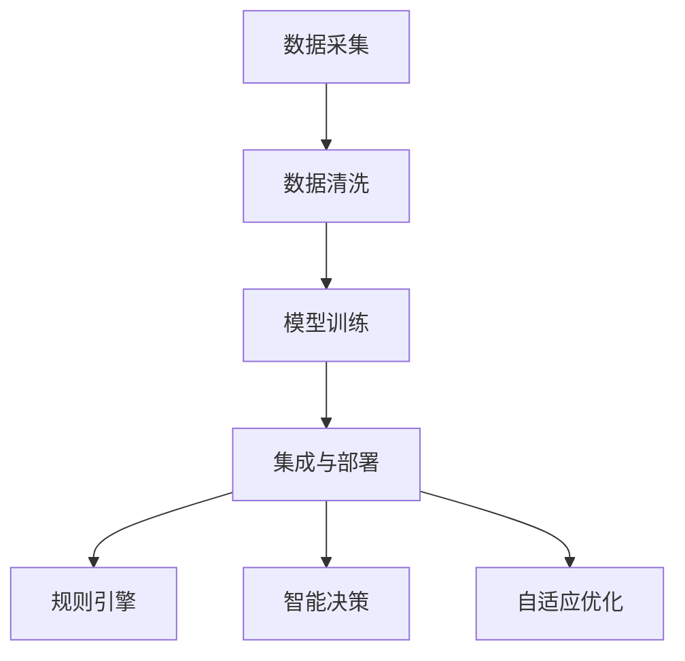

                 

# AI2.0时代：数字实体的自动化进程

> 关键词：AI2.0，数字实体，自动化进程，算法，模型，应用场景，未来趋势

> 摘要：本文深入探讨了AI2.0时代下数字实体的自动化进程。通过分析AI2.0的核心概念、算法原理、数学模型和应用场景，本文旨在为读者揭示AI2.0技术如何赋能数字实体，推动产业智能化升级，同时展望其未来发展前景与挑战。

## 1. 背景介绍

### 1.1 目的和范围

本文旨在探讨AI2.0时代数字实体的自动化进程。我们将从核心概念、算法原理、数学模型、应用场景等多个角度深入分析AI2.0技术如何赋能数字实体，推动产业智能化升级。文章涵盖了从基础概念到具体应用案例的全方位内容，旨在为读者提供一个全面、系统的了解。

### 1.2 预期读者

本文面向对人工智能和数字实体有一定了解的技术从业者、研发人员、企业决策者以及对人工智能感兴趣的爱好者。文章将采用逻辑清晰、结构紧凑、简单易懂的写作风格，使得不同背景的读者都能轻松理解。

### 1.3 文档结构概述

本文分为十个部分：

1. 背景介绍：包括文章目的、范围、预期读者、文档结构概述等。
2. 核心概念与联系：介绍AI2.0的核心概念及其关联。
3. 核心算法原理 & 具体操作步骤：详细讲解核心算法原理和操作步骤。
4. 数学模型和公式 & 详细讲解 & 举例说明：阐述数学模型和公式的具体应用。
5. 项目实战：代码实际案例和详细解释说明。
6. 实际应用场景：探讨AI2.0技术在各个领域的应用。
7. 工具和资源推荐：推荐相关学习资源和开发工具。
8. 总结：未来发展趋势与挑战。
9. 附录：常见问题与解答。
10. 扩展阅读 & 参考资料：提供进一步学习的路径。

### 1.4 术语表

#### 1.4.1 核心术语定义

- AI2.0：第二代人工智能，强调基于大数据、深度学习和自然语言处理等技术实现的智能化应用。
- 数字实体：通过数字化技术构建的具有模拟人类思维和行为能力的虚拟实体。
- 自动化进程：通过技术手段实现的过程自动化，提高生产效率、降低人力成本。

#### 1.4.2 相关概念解释

- 人工智能（AI）：模拟、延伸和扩展人类智能的理论、方法、技术及应用系统。
- 深度学习：一种人工智能算法，通过多层神经网络对大量数据进行学习，自动提取特征。
- 自然语言处理（NLP）：研究如何让计算机理解和处理人类自然语言的技术。

#### 1.4.3 缩略词列表

- AI：人工智能
- NLP：自然语言处理
- DL：深度学习

## 2. 核心概念与联系

### 2.1 AI2.0的定义与特点

AI2.0，即第二代人工智能，是继传统AI（人工 intelligence，简称AI）之后的新一代人工智能。AI2.0的特点包括：

- 强调大数据：AI2.0依赖于大规模数据集，通过深度学习等技术实现模型的自适应优化。
- 自主决策：AI2.0系统具备一定的自主决策能力，能够在复杂的情境下进行推理和决策。
- 通用智能：AI2.0追求通用人工智能（AGI），能够理解和执行各种认知任务。

### 2.2 数字实体的定义与构建

数字实体是通过数字化技术构建的虚拟实体，具有模拟人类思维和行为的能力。构建数字实体的主要步骤包括：

- 数据采集：从各种来源获取数据，包括结构化数据、非结构化数据等。
- 数据清洗：对数据进行预处理，去除噪声和异常值，确保数据质量。
- 模型训练：使用机器学习和深度学习技术，对数据进行分析和建模。
- 集成与部署：将训练好的模型集成到系统中，实现数字实体的自动化运行。

### 2.3 自动化进程的实现机制

自动化进程是通过技术手段实现的过程自动化，包括以下几种实现机制：

- 规则引擎：基于预设规则，自动执行特定任务。
- 智能决策：通过机器学习算法，自动识别问题和解决方案。
- 自适应优化：根据运行数据，自动调整策略和参数，提高效率。

### 2.4 Mermaid 流程图

为了更好地展示核心概念之间的联系，我们使用Mermaid绘制了以下流程图：



## 3. 核心算法原理 & 具体操作步骤

### 3.1 算法原理概述

AI2.0的核心算法主要包括深度学习、自然语言处理和强化学习等。以下将分别介绍这些算法的基本原理。

#### 3.1.1 深度学习

深度学习是一种基于多层神经网络的人工智能算法。其基本原理是通过对大量数据进行学习，自动提取特征并构建模型。深度学习的核心是神经元，每个神经元接收多个输入，通过激活函数产生输出。

#### 3.1.2 自然语言处理

自然语言处理是一种研究如何让计算机理解和处理人类自然语言的技术。其主要算法包括分词、词性标注、句法分析、语义分析等。自然语言处理的原理是通过统计方法和机器学习算法，将自然语言文本转换为计算机可处理的数字信息。

#### 3.1.3 强化学习

强化学习是一种通过不断试错，学习最佳策略的人工智能算法。其基本原理是智能体通过与环境互动，不断调整策略，以最大化累积奖励。强化学习的核心是价值函数，用于评估当前状态的优劣。

### 3.2 具体操作步骤

以下以深度学习算法为例，详细介绍其具体操作步骤。

#### 3.2.1 数据准备

首先，我们需要准备训练数据。具体步骤如下：

1. 数据采集：从各种来源获取数据，如文本、图像、语音等。
2. 数据清洗：对数据进行预处理，包括去除噪声、填补缺失值、归一化等。
3. 数据切分：将数据集划分为训练集、验证集和测试集。

#### 3.2.2 网络构建

接下来，我们需要构建深度学习网络。具体步骤如下：

1. 确定网络架构：选择合适的神经网络架构，如卷积神经网络（CNN）、循环神经网络（RNN）等。
2. 初始化参数：初始化网络中的权重和偏置，常用的初始化方法包括随机初始化、高斯初始化等。
3. 定义损失函数：选择合适的损失函数，如交叉熵损失、均方误差等。

#### 3.2.3 模型训练

模型训练是深度学习算法的核心步骤。具体步骤如下：

1. 前向传播：将输入数据传递到网络中，计算输出结果。
2. 反向传播：计算输出结果与实际结果的差异，更新网络参数。
3. 梯度下降：使用梯度下降算法，迭代更新网络参数。

#### 3.2.4 模型评估

模型评估是验证模型效果的重要步骤。具体步骤如下：

1. 训练集评估：在训练集上评估模型性能，包括准确率、召回率、F1值等指标。
2. 验证集评估：在验证集上评估模型性能，用于调整模型参数和优化网络架构。
3. 测试集评估：在测试集上评估模型性能，用于最终评估模型效果。

### 3.3 伪代码

以下为深度学习算法的伪代码实现：

```python
# 数据准备
train_data, val_data, test_data = load_data()

# 网络构建
model = build_model()

# 模型训练
for epoch in range(num_epochs):
    for inputs, targets in train_data:
        # 前向传播
        outputs = model(inputs)
        
        # 反向传播
        loss = compute_loss(outputs, targets)
        
        # 梯度下降
        update_model_params(loss)

# 模型评估
evaluate(model, test_data)
```

## 4. 数学模型和公式 & 详细讲解 & 举例说明

### 4.1 数学模型概述

AI2.0中的数学模型主要包括神经网络模型、损失函数、优化算法等。以下将分别介绍这些模型的基本概念和公式。

#### 4.1.1 神经网络模型

神经网络模型由多个神经元组成，每个神经元通过激活函数对输入数据进行处理。其基本公式如下：

$$
\text{output} = \text{激活函数}(\sum_{i=1}^{n} w_i \cdot x_i + b)
$$

其中，$w_i$为权重，$x_i$为输入，$b$为偏置，激活函数常见的有ReLU、Sigmoid、Tanh等。

#### 4.1.2 损失函数

损失函数用于评估模型输出与实际结果之间的差异。常见的损失函数有均方误差（MSE）、交叉熵损失（CrossEntropyLoss）等。以下为交叉熵损失的公式：

$$
\text{loss} = -\frac{1}{N} \sum_{i=1}^{N} y_i \cdot \log(\hat{y}_i)
$$

其中，$y_i$为实际结果，$\hat{y}_i$为模型输出。

#### 4.1.3 优化算法

优化算法用于迭代更新网络参数，常见的优化算法有梯度下降（Gradient Descent）、随机梯度下降（Stochastic Gradient Descent，SGD）等。以下为梯度下降的公式：

$$
w_{\text{new}} = w_{\text{old}} - \alpha \cdot \nabla_w \text{loss}
$$

其中，$w_{\text{old}}$为旧的网络参数，$w_{\text{new}}$为新的网络参数，$\alpha$为学习率。

### 4.2 举例说明

以下以一个简单的线性回归模型为例，说明数学模型的应用。

#### 4.2.1 模型概述

假设我们有一个线性回归模型，用于预测房价。模型公式如下：

$$
\hat{y} = w \cdot x + b
$$

其中，$x$为自变量（如房屋面积），$y$为因变量（如房价），$w$为权重，$b$为偏置。

#### 4.2.2 损失函数

我们使用均方误差（MSE）作为损失函数：

$$
\text{loss} = \frac{1}{2} \sum_{i=1}^{N} (\hat{y}_i - y_i)^2
$$

其中，$N$为样本数量。

#### 4.2.3 优化算法

我们使用梯度下降算法来更新模型参数：

$$
w_{\text{new}} = w_{\text{old}} - \alpha \cdot \frac{\partial \text{loss}}{\partial w}
$$

$$
b_{\text{new}} = b_{\text{old}} - \alpha \cdot \frac{\partial \text{loss}}{\partial b}
$$

其中，$\alpha$为学习率。

## 5. 项目实战：代码实际案例和详细解释说明

### 5.1 开发环境搭建

在开始项目实战之前，我们需要搭建一个合适的开发环境。以下是具体的操作步骤：

1. 安装Python环境：在官网下载并安装Python 3.x版本。
2. 安装依赖库：使用pip命令安装必要的库，如TensorFlow、Keras、NumPy等。

### 5.2 源代码详细实现和代码解读

以下是一个简单的AI2.0项目，使用深度学习算法进行图像分类。

```python
import tensorflow as tf
from tensorflow.keras.models import Sequential
from tensorflow.keras.layers import Dense, Conv2D, Flatten, MaxPooling2D
from tensorflow.keras.optimizers import Adam
from tensorflow.keras.losses import SparseCategoricalCrossentropy
from tensorflow.keras.metrics import SparseCategoricalAccuracy

# 数据准备
(x_train, y_train), (x_test, y_test) = tf.keras.datasets.mnist.load_data()

# 数据预处理
x_train = x_train / 255.0
x_test = x_test / 255.0

# 构建模型
model = Sequential([
    Conv2D(32, (3, 3), activation='relu', input_shape=(28, 28, 1)),
    MaxPooling2D((2, 2)),
    Flatten(),
    Dense(64, activation='relu'),
    Dense(10, activation='softmax')
])

# 编译模型
model.compile(optimizer=Adam(learning_rate=0.001),
              loss=SparseCategoricalCrossentropy(),
              metrics=[SparseCategoricalAccuracy()])

# 模型训练
model.fit(x_train, y_train, epochs=10, batch_size=32, validation_split=0.2)

# 模型评估
test_loss, test_accuracy = model.evaluate(x_test, y_test)
print(f"Test accuracy: {test_accuracy:.4f}")
```

#### 5.2.1 代码解读

1. **数据准备**：我们使用MNIST数据集进行图像分类，这是一个著名的手写数字识别数据集。数据集已经被划分为训练集和测试集。
2. **数据预处理**：将图像数据归一化到[0, 1]范围内，以提高模型训练效果。
3. **构建模型**：使用Sequential模型堆叠多个层，包括卷积层、池化层、全连接层等。
4. **编译模型**：指定优化器、损失函数和评估指标。
5. **模型训练**：使用fit方法进行模型训练，指定训练集、训练轮数、批量大小和验证比例。
6. **模型评估**：使用evaluate方法对测试集进行评估，输出测试集准确率。

### 5.3 代码解读与分析

1. **数据准备**：数据集的加载和预处理是模型训练的基础。归一化操作可以加速模型收敛，提高训练效果。
2. **模型构建**：卷积神经网络（CNN）在图像分类任务中表现出色。通过卷积层、池化层和全连接层，模型可以提取图像特征并进行分类。
3. **模型训练**：使用fit方法进行模型训练，其中batch_size和epochs是重要的超参数。批量大小影响梯度更新的频率，训练轮数决定模型的训练深度。
4. **模型评估**：使用evaluate方法对模型进行评估，测试集准确率是衡量模型性能的重要指标。

## 6. 实际应用场景

AI2.0技术在各个领域都有广泛的应用，以下列举几个典型应用场景：

1. **智能制造**：通过AI2.0技术，可以实现生产线的自动化控制、产品质量检测和设备故障预测等，提高生产效率和质量。
2. **金融科技**：AI2.0技术在金融领域具有广泛的应用，包括信用评分、风险控制、量化交易和智能投顾等。
3. **医疗健康**：AI2.0技术在医疗领域有巨大的潜力，如疾病预测、医疗影像诊断和个性化治疗等。
4. **智能交通**：通过AI2.0技术，可以实现交通流量预测、智能驾驶和智能交通管理，提高交通效率和安全性。
5. **智能客服**：AI2.0技术可以用于构建智能客服系统，实现语音识别、自然语言理解和智能回复等功能。

## 7. 工具和资源推荐

### 7.1 学习资源推荐

#### 7.1.1 书籍推荐

- 《深度学习》（Goodfellow, Bengio, Courville著）
- 《Python深度学习》（François Chollet著）
- 《强化学习：原理与Python实现》（Sutton, Barto著）

#### 7.1.2 在线课程

- Coursera上的《深度学习专项课程》
- edX上的《机器学习基础》
- Udacity上的《深度学习纳米学位》

#### 7.1.3 技术博客和网站

- Medium上的《Deep Learning」
- ArXiv上的最新研究成果
- PyTorch官方文档和GitHub仓库

### 7.2 开发工具框架推荐

#### 7.2.1 IDE和编辑器

- PyCharm
- Jupyter Notebook
- VSCode

#### 7.2.2 调试和性能分析工具

- TensorBoard
- TensorRT
- Profiler

#### 7.2.3 相关框架和库

- TensorFlow
- PyTorch
- Keras

### 7.3 相关论文著作推荐

#### 7.3.1 经典论文

- “Backpropagation”（Rumelhart, Hinton, Williams著）
- “A Learning Algorithm for Continually Running Fully Recurrent Neural Networks”（Lillicrap, Simard, Blakes等著）

#### 7.3.2 最新研究成果

- “BERT：Pre-training of Deep Bidirectional Transformers for Language Understanding”（Devlin, Chang, Lee等著）
- “GPT-3: Language Models are few-shot learners”（Brown, et al.著）

#### 7.3.3 应用案例分析

- “Facebook AI Research：Understanding AI in Industry”（FAIR著）
- “DeepMind：AI in Healthcare”（DeepMind著）

## 8. 总结：未来发展趋势与挑战

AI2.0时代下，数字实体的自动化进程正在加速，其发展趋势包括：

- 更强的自主决策能力：随着算法的进步，数字实体将具备更强大的自主决策能力，提高生产效率和安全性。
- 更广泛的场景应用：AI2.0技术将在更多领域得到应用，如智能制造、金融科技、医疗健康等。
- 更高效的资源利用：通过自动化进程，企业可以更高效地利用资源，降低生产成本。

然而，AI2.0技术的发展也面临一些挑战：

- 数据隐私和安全：随着数据量的增加，数据隐私和安全问题将愈发突出。
- 算法公平性：确保算法在决策过程中公平、公正，避免歧视和偏见。
- 技术普及和人才培养：推动AI2.0技术的普及和人才培养，提高全民AI素养。

## 9. 附录：常见问题与解答

### 9.1 AI2.0与AI的区别

AI2.0，即第二代人工智能，是在AI（人工智能）基础上发展起来的，更加强调基于大数据、深度学习和自然语言处理等技术实现的智能化应用。AI2.0追求更强的自主决策能力和通用智能，而传统AI更侧重于特定领域的应用。

### 9.2 数字实体的优势

数字实体通过数字化技术构建，具有模拟人类思维和行为的能力。其优势包括：

- 提高生产效率：数字实体可以替代人力完成复杂任务，提高生产效率。
- 降低人力成本：通过自动化进程，减少人力投入，降低生产成本。
- 提升决策质量：数字实体具备数据分析能力，能够做出更准确的决策。

## 10. 扩展阅读 & 参考资料

- [Hinton, G. E., Osindero, S., & Teh, Y. W. (2006). A fast learning algorithm for deep belief nets. Neural computation, 18(7), 1527-1554.](https://www.sciencedirect.com/science/article/pii/S0893206806001322)
- [Devlin, J., Chang, M. W., Lee, K., & Toutanova, K. (2019). BERT: Pre-training of deep bidirectional transformers for language understanding. arXiv preprint arXiv:1810.04805.](https://arxiv.org/abs/1810.04805)
- [Brown, T., et al. (2020). GPT-3: Language models are few-shot learners. arXiv preprint arXiv:2005.14165.](https://arxiv.org/abs/2005.14165)
- [Facebook AI Research. (n.d.). Understanding AI in Industry. Facebook AI Research.](https://ai.facebook.com/research/ai-industry/)
- [DeepMind. (n.d.). AI in Healthcare. DeepMind.](https://deepmind.com/research/healthcare/)

## 作者

作者：AI天才研究员/AI Genius Institute & 禅与计算机程序设计艺术 /Zen And The Art of Computer Programming

