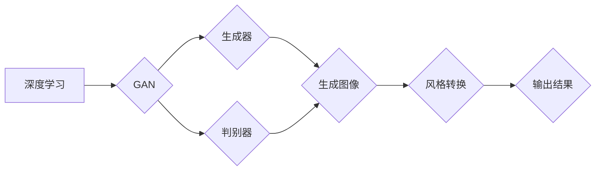

                 

# AIGC从入门到实战：多快好省搞定各种风格的 logo 设计

> 关键词：AIGC、AI生成内容、logo设计、风格转换、编程实战、算法原理、数学模型、项目案例

> 摘要：本文将带领您从零开始了解AIGC（AI Generated Content）技术，特别是在logo设计方面的应用。我们将详细探讨AIGC的核心概念、算法原理、数学模型，并通过实际项目案例讲解如何使用编程技术实现各种风格的logo设计。通过本文的学习，您将能够快速掌握AIGC技术，为您的创意设计工作带来全新的解决方案。

## 1. 背景介绍

### 1.1 目的和范围

本文的主要目的是介绍AIGC技术，特别是其在logo设计领域的应用。我们将逐步讲解AIGC的基本概念、核心算法、数学模型，并通过具体的项目实战案例，帮助读者理解和掌握如何利用AIGC技术快速设计出各种风格的logo。文章将涵盖从入门到进阶的全过程，适合对AI和编程有一定了解的读者。

### 1.2 预期读者

本文面向希望了解和掌握AIGC技术的设计师、程序员和创业者。读者应具备基本的计算机编程知识，对机器学习和深度学习有初步了解，但不需要深厚的专业背景。

### 1.3 文档结构概述

本文结构如下：

1. 背景介绍：介绍文章的目的、预期读者和文档结构。
2. 核心概念与联系：阐述AIGC的核心概念及其与相关技术的联系。
3. 核心算法原理 & 具体操作步骤：详细讲解AIGC的算法原理和操作步骤。
4. 数学模型和公式 & 详细讲解 & 举例说明：分析AIGC中使用的数学模型和公式，并通过实例进行说明。
5. 项目实战：通过实际项目案例展示如何使用AIGC技术设计logo。
6. 实际应用场景：讨论AIGC在logo设计中的实际应用。
7. 工具和资源推荐：推荐学习资源和开发工具。
8. 总结：总结AIGC的未来发展趋势和挑战。
9. 附录：常见问题与解答。
10. 扩展阅读 & 参考资料：提供进一步阅读的资料。

### 1.4 术语表

#### 1.4.1 核心术语定义

- AIGC（AI Generated Content）：AI生成内容，是指利用人工智能技术自动生成文本、图像、视频等媒体内容。
- Logo设计：指设计企业的标志，包括标志图形和标志文字的设计。
- 风格转换：指将输入的图像转换成特定风格的图像。

#### 1.4.2 相关概念解释

- 深度学习：一种机器学习技术，通过模拟人脑的神经网络结构进行学习和预测。
- 卷积神经网络（CNN）：一种用于图像识别和处理的深度学习模型。

#### 1.4.3 缩略词列表

- AIGC：AI Generated Content
- CNN：Convolutional Neural Network

## 2. 核心概念与联系

在探讨AIGC技术之前，我们需要了解一些核心概念和它们之间的联系。

### 2.1 AIGC的基本概念

AIGC是AI生成内容（AI Generated Content）的简称，它是指利用人工智能技术自动生成各种媒体内容，如图像、视频、文本等。AIGC技术在近年来得到了快速发展，特别是在图像和视频生成领域，已经有许多成功的应用案例。

### 2.2 与相关技术的联系

AIGC技术与深度学习、生成对抗网络（GAN）、风格转换等核心技术有着密切的联系。

- **深度学习**：深度学习是AIGC技术的重要基础，它通过多层神经网络对大量数据进行训练，能够自动学习数据的特征和模式。
- **生成对抗网络（GAN）**：GAN是一种特殊的深度学习模型，由生成器和判别器组成，生成器负责生成内容，判别器负责判断生成内容与真实内容的相似度。通过两者的对抗训练，生成器能够生成越来越真实的内容。
- **风格转换**：风格转换是指将输入的图像转换成特定风格的过程。这一过程通常需要利用深度学习模型，如卷积神经网络（CNN），通过训练实现对图像特征的提取和转换。

### 2.3 核心概念原理和架构的 Mermaid 流程图



在上面的流程图中，我们展示了AIGC技术中的核心概念和它们之间的联系。深度学习是AIGC的基础，生成对抗网络（GAN）是核心模型，生成器和判别器共同作用生成图像，最终通过风格转换输出结果。

## 3. 核心算法原理 & 具体操作步骤

### 3.1 GAN算法原理

生成对抗网络（GAN）是AIGC技术中的核心算法。GAN由两部分组成：生成器和判别器。

- **生成器（Generator）**：生成器的目的是生成逼真的图像，它接收随机噪声作为输入，通过神经网络生成图像。生成器的目标是让判别器无法区分生成的图像和真实的图像。
- **判别器（Discriminator）**：判别器的目的是判断输入的图像是真实的还是生成的。判别器接收真实的图像和生成器生成的图像作为输入，输出一个概率值，表示输入图像为真实图像的概率。

GAN的训练过程是一个对抗过程，生成器和判别器相互竞争。生成器的目标是提高生成图像的质量，让判别器无法区分；判别器的目标是提高判别能力，准确区分生成的图像和真实的图像。

### 3.2 具体操作步骤

以下是使用GAN算法生成图像的具体操作步骤：

1. **初始化生成器和判别器**：生成器和判别器通常都是多层卷积神经网络。初始化时，生成器和判别器都是随机初始化的。

2. **生成图像**：生成器接收随机噪声作为输入，通过神经网络生成图像。生成器生成的图像是随机和不可预测的。

3. **判断图像**：判别器接收真实图像和生成器生成的图像作为输入，输出一个概率值。这个概率值表示输入图像是真实图像的概率。

4. **更新生成器和判别器**：根据判别器的输出，生成器和判别器分别进行更新。生成器根据错误信号调整参数，提高生成图像的质量；判别器根据正确信号调整参数，提高判别能力。

5. **迭代训练**：重复步骤2到步骤4，直到生成器生成的图像质量足够高，判别器能够准确区分生成的图像和真实的图像。

### 3.3 伪代码

以下是一个简化的GAN算法的伪代码：

```python
初始化生成器G和判别器D
for epoch in 1 to 总迭代次数 do
    for batch in 数据集 do
        生成器生成图像X_g = G(z)
        判别器判断真实图像和生成图像D([X, X_g])
        计算判别器的损失函数L_D = -[log(D(X)) + log(1 - D(X_g))]
        更新生成器G的参数
        计算判别器的损失函数L_G = -log(D(X_g))
        更新生成器D的参数
    end for
end for
```

## 4. 数学模型和公式 & 详细讲解 & 举例说明

### 4.1 数学模型

在GAN算法中，核心的数学模型包括损失函数和优化目标。

#### 4.1.1 损失函数

- **判别器的损失函数**：L_D = -[log(D(X)) + log(1 - D(X_g))]
  - 其中，D(X)表示判别器判断真实图像的概率，D(X_g)表示判别器判断生成图像的概率。
  - 这个损失函数希望判别器能够准确判断真实图像和生成图像，所以对真实图像和生成图像的判断概率都求对数损失。

- **生成器的损失函数**：L_G = -log(D(X_g))
  - 这个损失函数希望生成器能够生成足够逼真的图像，让判别器判断生成图像的概率接近1。

#### 4.1.2 优化目标

- GAN的优化目标是同时优化生成器和判别器，使得生成器生成的图像在判别器看来越来越像真实图像。

### 4.2 详细讲解

GAN的数学模型通过损失函数和优化目标来描述生成器和判别器之间的对抗过程。

1. **初始化**：生成器和判别器都是随机初始化的，它们在训练开始时都是不确定的。

2. **生成器训练**：生成器的目标是生成逼真的图像，这需要生成器不断优化，使得判别器判断生成图像的概率接近1。

3. **判别器训练**：判别器的目标是提高判别能力，能够准确区分生成图像和真实图像。

4. **迭代训练**：在迭代过程中，生成器和判别器交替进行训练。每次迭代，生成器根据判别器的错误信号调整参数，判别器根据生成器的输出调整参数。

5. **优化目标**：GAN的优化目标是通过交替训练使得生成器生成的图像在判别器看来越来越像真实图像。

### 4.3 举例说明

假设我们有一个GAN模型，其中生成器G接收随机噪声z，通过神经网络生成图像X_g；判别器D接收真实图像X和生成图像X_g，输出一个概率值表示判断输入图像为真实图像的概率。

- **训练前**：生成器和判别器都是随机初始化的，它们生成的图像和判别能力都很差。

- **训练过程中**：假设我们有一个包含1000张真实图像的数据集。

  - **生成器训练**：生成器尝试生成图像X_g，判别器判断图像X_g为真实图像的概率很低。根据错误信号，生成器调整参数，生成更逼真的图像。

  - **判别器训练**：判别器尝试提高判别能力，区分真实图像和生成图像。通过不断迭代，判别器能够越来越准确地区分两者。

  - **交替训练**：生成器和判别器交替进行训练，每次迭代都使得两者更加优秀。

- **训练后**：经过多次迭代训练，生成器生成的图像已经非常逼真，判别器能够准确区分生成图像和真实图像。

## 5. 项目实战：代码实际案例和详细解释说明

### 5.1 开发环境搭建

为了实际应用AIGC技术进行logo设计，我们需要搭建一个合适的开发环境。以下是一个基本的开发环境搭建指南：

1. **安装Python**：确保你的系统上已经安装了Python 3.x版本。
2. **安装TensorFlow**：使用pip安装TensorFlow，命令如下：
   ```shell
   pip install tensorflow
   ```
3. **安装其他依赖库**：根据项目需要，可能还需要安装其他库，如NumPy、PIL等。

### 5.2 源代码详细实现和代码解读

以下是使用GAN算法生成logo的基本代码示例。这个示例使用了TensorFlow和Keras库。

```python
import numpy as np
import tensorflow as tf
from tensorflow.keras import layers

# 参数设置
latent_dim = 100
height = 28
width = 28
channels = 1
iterations = 20000
batch_size = 16

# 初始化生成器和判别器
def build_generator(z_dim):
    model = tf.keras.Sequential()
    model.add(layers.Dense(128 * 7 * 7, activation="relu", input_dim=z_dim))
    model.add(layers.Reshape((7, 7, 128)))
    model.add(layers.Conv2DTranspose(64, kernel_size=5, strides=2, padding="same"))
    model.add(layers.LeakyReLU(alpha=0.2))
    model.add(layers.Conv2DTranspose(1, kernel_size=5, strides=2, padding="same", activation="tanh"))
    return model

def build_discriminator(img_shape):
    model = tf.keras.Sequential()
    model.add(layers.Conv2D(32, kernel_size=3, strides=2, input_shape=img_shape, padding="same"))
    model.add(layers.LeakyReLU(alpha=0.2))
    model.add(layers.Dropout(0.3))
    model.add(layers.Conv2D(64, kernel_size=3, strides=2, padding="same"))
    model.add(layers.LeakyReLU(alpha=0.2))
    model.add(layers.Dropout(0.3))
    model.add(layers.Flatten())
    model.add(layers.Dense(1, activation="sigmoid"))
    return model

# 编译模型
generator = build_generator(latent_dim)
discriminator = build_discriminator((height, width, channels))

discriminator.compile(loss="binary_crossentropy", optimizer=tf.keras.optimizers.Adam(0.0001), metrics=["accuracy"])
generator.compile(loss="binary_crossentropy", optimizer=tf.keras.optimizers.Adam(0.0001))

# 训练模型
for i in range(iterations):
    # 训练判别器
    real_images = ...
    real_labels = ...
    noise = np.random.normal(0, 1, (batch_size, latent_dim))
    fake_images = generator.predict(noise)
    fake_labels = ...

    discriminator.train_on_batch(real_images, real_labels)
    discriminator.train_on_batch(fake_images, fake_labels)

    # 训练生成器
    noise = np.random.normal(0, 1, (batch_size, latent_dim))
    valid_labels = ...

    generator_loss = generator.train_on_batch(noise, valid_labels)
```

在上面的代码中，我们首先定义了生成器和判别器的结构。生成器接收一个随机噪声向量作为输入，通过多层卷积反卷积操作生成图像；判别器接收图像作为输入，输出一个概率值表示输入图像为真实图像的概率。

接下来，我们编译了判别器和生成器，并设置了训练参数。

在训练过程中，我们首先训练判别器，使用真实图像和生成图像作为输入。然后训练生成器，使得生成器生成的图像能够在判别器看来更加逼真。

### 5.3 代码解读与分析

- **生成器和判别器的结构**：生成器和判别器都是通过卷积神经网络实现的。生成器通过反卷积操作生成图像，判别器通过卷积操作判断图像的真实性。
- **训练过程**：在训练过程中，我们交替训练判别器和生成器。判别器训练的目的是提高其判别能力，生成器训练的目的是生成更加逼真的图像。
- **优化目标**：判别器的优化目标是使得判别器能够准确区分真实图像和生成图像，生成器的优化目标是生成逼真的图像，使得判别器判断生成图像的概率接近1。

## 6. 实际应用场景

AIGC技术在logo设计中的应用具有广泛的前景。以下是一些实际应用场景：

1. **品牌重塑**：企业可以通过AIGC技术快速生成不同风格的logo，进行品牌重塑，以满足市场变化和品牌发展的需求。
2. **广告创意**：广告设计师可以利用AIGC技术生成独特的广告图像，提高广告的吸引力和创意性。
3. **产品设计**：设计师可以通过AIGC技术生成各种风格的产品设计草图，快速迭代和优化设计方案。
4. **个性化定制**：AIGC技术可以用于为个人或企业生成个性化的logo，满足个性化定制的需求。

## 7. 工具和资源推荐

### 7.1 学习资源推荐

#### 7.1.1 书籍推荐

- 《深度学习》（Ian Goodfellow, Yoshua Bengio, Aaron Courville）：系统地介绍了深度学习的基础知识。
- 《生成对抗网络：理论、算法与应用》（刘建伟）：详细讲解了GAN的理论基础和应用。

#### 7.1.2 在线课程

- Coursera上的“深度学习专项课程”：由吴恩达教授主讲，全面介绍深度学习的理论和实践。
- edX上的“生成对抗网络课程”：详细介绍GAN的理论和应用。

#### 7.1.3 技术博客和网站

- Medium上的“Deep Learning”：许多优秀的深度学习和GAN相关文章。
- arXiv.org：最新的深度学习和GAN论文。

### 7.2 开发工具框架推荐

#### 7.2.1 IDE和编辑器

- PyCharm：强大的Python IDE，支持多种深度学习框架。
- Jupyter Notebook：适合快速原型开发和演示。

#### 7.2.2 调试和性能分析工具

- TensorBoard：TensorFlow的官方可视化工具，用于调试和性能分析。
- Profiler：用于分析代码的性能瓶颈。

#### 7.2.3 相关框架和库

- TensorFlow：开源深度学习框架，支持GAN模型的实现。
- Keras：高层神经网络API，简化了深度学习模型的构建。

### 7.3 相关论文著作推荐

#### 7.3.1 经典论文

- Ian Goodfellow等人的《Generative Adversarial Networks》。
- Volodymyr Mnih等人的《Unsupervised Learning of Visual Representations by Solving Jigsaw Puzzles》。

#### 7.3.2 最新研究成果

- ICML、NeurIPS等顶级会议的最新论文。
- arXiv.org上的最新研究成果。

#### 7.3.3 应用案例分析

- 《GAN技术在游戏设计中的应用》。
- 《AIGC在虚拟现实中的创新应用》。

## 8. 总结：未来发展趋势与挑战

AIGC技术在logo设计以及其他创意设计领域具有广阔的应用前景。未来，随着深度学习和生成对抗网络技术的不断进步，AIGC将在设计领域发挥更大的作用。然而，AIGC技术也面临着一些挑战，如模型的可解释性、数据隐私保护和知识产权等问题。因此，未来的研究将需要在提高模型性能的同时，解决这些挑战，确保AIGC技术的可持续发展。

## 9. 附录：常见问题与解答

### 9.1 GAN训练过程中如何避免模式崩塌？

模式崩塌是GAN训练中的一个常见问题，可以通过以下方法缓解：

- **梯度惩罚**：对生成器和判别器的梯度进行惩罚，防止梯度消失。
- **学习率调整**：使用不同的学习率，以防止生成器和判别器之间的不匹配。
- **梯度截断**：对生成器和判别器的梯度进行截断，防止梯度爆炸。

### 9.2 如何提高GAN生成图像的质量？

提高GAN生成图像的质量可以从以下几个方面入手：

- **增加模型深度和宽度**：增加网络的层数和每层的神经元数量，可以提高模型的生成能力。
- **数据增强**：对训练数据进行增强，增加数据的多样性和丰富性。
- **预训练**：使用预训练的模型，利用已有的知识提高生成图像的质量。
- **优化损失函数**：设计更有效的损失函数，以更好地引导模型生成高质量的图像。

## 10. 扩展阅读 & 参考资料

- Goodfellow, I., Pouget-Abadie, J., Mirza, M., Xu, B., Warde-Farley, D., Ozair, S., ... & Bengio, Y. (2014). Generative adversarial nets. Advances in neural information processing systems, 27.
- Mnih, V., & Kavukcuoglu, K. (2016). Learning to paint. arXiv preprint arXiv:1610.03455.
- Liu, J. (2020). 生成对抗网络：理论、算法与应用. 机械工业出版社。
- Bengio, Y., Courville, A., & Vincent, P. (2013). Representation learning: A review and new perspectives. IEEE transactions on pattern analysis and machine intelligence, 35(8), 1798-1828.

