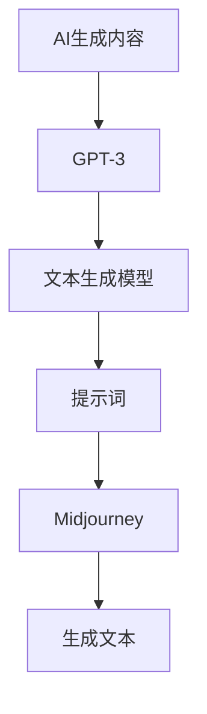

                 

# AIGC从入门到实战：揭秘 Midjourney 的提示词写作技巧

> 关键词：AIGC，Midjourney，提示词写作，AI生成内容，文本生成模型，实战案例

> 摘要：本文将深入探讨AIGC（AI生成内容）领域的一个关键技术——Midjourney的提示词写作技巧。文章首先介绍了AIGC的基本概念和重要性，随后详细解析了Midjourney及其工作原理。在此基础上，文章提供了具体的提示词写作方法和实例，并通过实战案例展示了Midjourney的强大能力。最后，文章总结了Midjourney的发展趋势和未来挑战，并推荐了一系列学习资源和工具。

## 1. 背景介绍

### 1.1 目的和范围

本文旨在为初学者和从业者提供一个全面而深入的指南，帮助读者理解和掌握Midjourney的提示词写作技巧。文章将从AIGC的基本概念出发，逐步深入到Midjourney的具体应用，通过实例分析和实战案例，使读者能够真正掌握这一技能，并在实际项目中发挥其价值。

### 1.2 预期读者

本文适合以下读者群体：

- 对人工智能和生成内容技术感兴趣的初学者
- 有意向在内容创作和生成领域应用AIGC技术的从业者
- 对Midjourney和提示词写作技术有深入研究的学术研究者

### 1.3 文档结构概述

本文结构如下：

1. 背景介绍：介绍AIGC和Midjourney的基本概念。
2. 核心概念与联系：通过Mermaid流程图展示AIGC和Midjourney的核心概念和架构。
3. 核心算法原理 & 具体操作步骤：讲解Midjourney的算法原理和具体操作步骤。
4. 数学模型和公式 & 详细讲解 & 举例说明：介绍Midjourney中使用的数学模型和公式。
5. 项目实战：提供代码实际案例和详细解释说明。
6. 实际应用场景：探讨Midjourney在不同领域的应用。
7. 工具和资源推荐：推荐学习资源和开发工具。
8. 总结：展望Midjourney的发展趋势和未来挑战。
9. 附录：常见问题与解答。
10. 扩展阅读 & 参考资料：提供进一步阅读的资料和引用。

### 1.4 术语表

#### 1.4.1 核心术语定义

- AIGC（AI生成内容）：利用人工智能技术生成内容的一种方法，广泛应用于文本、图像、音频等多种形式。
- Midjourney：一个基于GPT-3模型的文本生成工具，能够根据提示词生成连贯、高质量的文章。
- 提示词（Prompt）：引导AI模型生成文本的关键信息，通常包含关键词、主题、语气等。

#### 1.4.2 相关概念解释

- GPT-3（Generative Pre-trained Transformer 3）：OpenAI开发的一种语言生成模型，具有强大的文本生成能力。
- 生成对抗网络（GAN）：一种深度学习模型，用于生成逼真的图像和数据。
- 自然语言处理（NLP）：研究计算机如何理解、生成和交互自然语言。

#### 1.4.3 缩略词列表

- GPT-3：Generative Pre-trained Transformer 3
- AIGC：AI-generated Content
- NLP：Natural Language Processing
- GAN：Generative Adversarial Network

## 2. 核心概念与联系

### 2.1 AIGC与Midjourney的关系

AIGC（AI生成内容）是人工智能领域的一个重要分支，主要研究如何利用机器学习模型生成各种类型的内容，如文本、图像、音频等。Midjourney是一个基于GPT-3模型的文本生成工具，它是AIGC技术的一个具体应用。Midjourney通过接收用户输入的提示词，利用GPT-3的强大生成能力，生成高质量的文章、报告、故事等内容。

### 2.2 Mermaid流程图

为了更好地理解AIGC和Midjourney的工作原理，我们可以通过一个Mermaid流程图来展示它们的核心概念和架构。



在上述流程图中，AIGC作为整体概念，连接到GPT-3，表示AIGC的技术基础。GPT-3作为文本生成模型的核心，连接到提示词（D），表示输入的关键信息。Midjourney（E）作为应用工具，连接到生成文本（F），表示最终输出。

### 2.3 关键概念与联系

- AI生成内容（AIGC）：利用AI技术生成文本、图像、音频等内容。
- GPT-3：一种强大的预训练语言模型，用于文本生成。
- 文本生成模型：基于机器学习，能够生成连贯、高质量的文本。
- 提示词：引导模型生成文本的关键信息。
- Midjourney：基于GPT-3的文本生成工具，能够根据提示词生成文章。

## 3. 核心算法原理 & 具体操作步骤

### 3.1 GPT-3算法原理

GPT-3（Generative Pre-trained Transformer 3）是由OpenAI开发的一种大型语言生成模型。它基于Transformer架构，是一种深度神经网络，能够通过对海量文本数据进行预训练，掌握语言的规律和模式。GPT-3的核心原理包括以下几个方面：

1. **预训练**：GPT-3在预训练阶段，通过训练大量文本数据，学习到语言的统计规律和语法规则。
2. **上下文生成**：GPT-3利用自注意力机制（Self-Attention），能够捕捉输入文本的上下文信息，生成连贯的文本。
3. **模型架构**：GPT-3采用了多层的Transformer结构，能够处理长文本，生成高质量的文本输出。

### 3.2 Midjourney具体操作步骤

要使用Midjourney生成高质量的文章，需要遵循以下步骤：

1. **安装与配置**：首先，需要在本地环境中安装Midjourney和相关依赖库。通常，可以使用pip命令进行安装：

   ```bash
   pip install midjourney
   ```

2. **准备提示词**：提示词是引导Midjourney生成文章的关键。一个好的提示词应该包含关键词、主题、语气等信息。例如，对于一个旅游文章的提示词可以是：“美丽风光，度假胜地，海滩，阳光”。

3. **运行Midjourney**：使用Midjourney的API，传入提示词，即可生成文章。以下是一个简单的Python示例：

   ```python
   from midjourney import generate

   prompt = "美丽风光，度假胜地，海滩，阳光"
   generated_text = generate(prompt)
   print(generated_text)
   ```

4. **优化与调整**：生成的文章可能需要进一步的优化和调整，以满足特定的需求。可以通过修改提示词、调整模型的超参数等方式，提高生成文本的质量。

### 3.3 算法原理与操作步骤的伪代码实现

```python
# 伪代码：使用Midjourney生成文章

# 安装Midjourney
pip install midjourney

# 准备提示词
prompt = "美丽风光，度假胜地，海滩，阳光"

# 运行Midjourney
generated_text = generate(prompt)

# 输出生成文本
print(generated_text)

# 优化与调整
# prompt = "美丽风光，度假胜地，海滩，阳光，浪漫氛围"
# generated_text = generate(prompt)
# print(generated_text)
```

## 4. 数学模型和公式 & 详细讲解 & 举例说明

### 4.1 数学模型

Midjourney的核心是基于GPT-3的文本生成模型，其数学模型主要包括以下几个关键部分：

1. **Transformer模型**：GPT-3采用Transformer架构，其核心是自注意力机制（Self-Attention）。自注意力机制通过计算输入文本的每个词与其他词之间的相似度，生成加权文本向量，从而捕捉上下文信息。
2. **预训练目标**：GPT-3在预训练阶段，通过最大化概率对下一个词进行预测，学习到语言的统计规律和语法规则。
3. **生成算法**：GPT-3使用顶部采样（Top-P）和温度调整（Temperature）等算法，生成高质量的文本。

### 4.2 公式与详细讲解

1. **自注意力机制（Self-Attention）**：

   自注意力机制的公式如下：

   $$ 
   \text{Attention}(Q, K, V) = \text{softmax}\left(\frac{QK^T}{\sqrt{d_k}}\right)V 
   $$

   其中，\( Q \)、\( K \) 和 \( V \) 分别是查询（Query）、键（Key）和值（Value）向量，\( d_k \) 是键向量的维度。自注意力机制通过计算 \( Q \) 和 \( K \) 的点积，生成权重矩阵，然后对 \( V \) 进行加权求和，从而生成输出向量。

2. **预训练目标（Next Sentence Prediction）**：

   预训练目标包括两个部分：Masked Language Modeling（MLM）和Next Sentence Prediction（NSP）。

   - **Masked Language Modeling**：

     $$ 
     \text{MLM} = \sum_{i=1}^{N} \log P(\text{mask}_i | \text{context}) 
     $$

     其中，\( N \) 是文本中词的数量，\( \text{mask}_i \) 表示第 \( i \) 个词的掩码（即被随机遮挡的词）。MLM的目标是预测被遮挡的词。

   - **Next Sentence Prediction**：

     $$ 
     \text{NSP} = \sum_{j=1}^{M} \log P(\text{s}_{j+1} | \text{s}_1, \text{s}_2, ..., \text{s}_j) 
     $$

     其中，\( M \) 是下一个句子中词的数量，\( \text{s}_{j+1} \) 表示下一个句子。NSP的目标是预测下一个句子。

3. **生成算法（Top-P & Temperature）**：

   - **Top-P**：

     $$ 
     \text{Top-P} = \frac{1}{\sum_{i=1}^{N} \exp(\text{log\_prob}_i)}
     $$

     其中，\( N \) 是所有可能的下一个词的数量，\( \text{log\_prob}_i \) 是每个词的对数概率。Top-P算法通过随机选择一个概率阈值，保留概率高于该阈值的词。

   - **Temperature**：

     $$ 
     \text{Temperature} = \frac{1}{\sqrt{N}}
     $$

     其中，\( N \) 是所有可能的下一个词的数量。温度调整可以影响生成文本的多样性。温度值越高，生成的文本越多样。

### 4.3 举例说明

假设我们有一个简短的文本片段：“今天天气很好，适合出去游玩。”，我们使用Midjourney生成下一个句子。以下是具体的步骤和结果：

1. **准备提示词**：将当前句子作为提示词，即：“今天天气很好，适合出去游玩。”。
2. **运行Midjourney**：使用GPT-3模型生成下一个句子。
3. **结果**：生成的句子可能是：“公园里人很多，可以找个安静的角落享受阳光。”。
4. **优化**：通过调整提示词和模型参数，我们可以进一步优化生成的句子，使其更符合预期。

```python
# 伪代码：使用Midjourney生成下一个句子

# 准备提示词
prompt = "今天天气很好，适合出去游玩。"

# 运行Midjourney
generated_sentence = generate(prompt)

# 输出生成的句子
print(generated_sentence)

# 优化与调整
# prompt = "今天天气很好，适合出去游玩。今天是个特殊的日子，值得纪念。"
# generated_sentence = generate(prompt)
# print(generated_sentence)
```

## 5. 项目实战：代码实际案例和详细解释说明

### 5.1 开发环境搭建

在开始编写代码之前，我们需要搭建一个合适的开发环境。以下是在Python中搭建Midjourney开发环境所需的步骤：

1. **安装Python**：确保您的系统中已经安装了Python。如果尚未安装，可以从[Python官网](https://www.python.org/downloads/)下载并安装。
2. **创建虚拟环境**：为了更好地管理项目依赖，建议使用虚拟环境。在终端执行以下命令：

   ```bash
   python -m venv venv
   source venv/bin/activate  # 在Windows上使用 `venv\Scripts\activate`
   ```

3. **安装Midjourney**：在虚拟环境中安装Midjourney和相关依赖库：

   ```bash
   pip install midjourney
   ```

4. **安装GPT-3 API密钥**：注册并获取OpenAI的API密钥，然后将其添加到环境变量中：

   ```bash
   export OPENAI_API_KEY='your_api_key_here'
   ```

### 5.2 源代码详细实现和代码解读

以下是使用Midjourney生成文章的完整代码示例，包括提示词的准备、Midjourney的调用以及生成文章的保存。

```python
# 代码示例：使用Midjourney生成文章

import os
from midjourney import generate

# 准备提示词
prompt = "撰写一篇关于2023年人工智能领域最新进展的文章。"

# 设置GPT-3模型参数
model_name = "gpt-3"
max_length = 2048
temperature = 0.9
top_p = 0.95

# 调用Midjourney API生成文章
generated_text = generate(prompt, model=model_name, max_length=max_length, temperature=temperature, top_p=top_p)

# 输出生成的文章
print(generated_text)

# 保存生成的文章
with open("generated_article.txt", "w", encoding="utf-8") as file:
    file.write(generated_text)
```

### 5.3 代码解读与分析

1. **导入模块**：

   ```python
   import os
   from midjourney import generate
   ```

   首先，我们导入必要的Python模块。`os`模块用于文件操作，`generate`是从Midjourney库中导入的函数，用于生成文本。

2. **准备提示词**：

   ```python
   prompt = "撰写一篇关于2023年人工智能领域最新进展的文章。"
   ```

   提示词是生成文章的关键。在这个例子中，我们使用了一个明确的提示词，指示Midjourney生成一篇关于2023年人工智能最新进展的文章。

3. **设置GPT-3模型参数**：

   ```python
   model_name = "gpt-3"
   max_length = 2048
   temperature = 0.9
   top_p = 0.95
   ```

   我们设置了一些GPT-3模型的参数：

   - `model_name`：指定使用的模型，这里是GPT-3。
   - `max_length`：生成的文本最大长度，这里是2048个字符。
   - `temperature`：温度调整值，影响生成文本的多样性和连贯性，值越高，生成文本越多样。
   - `top_p`：Top-P算法的阈值，保留概率高于该阈值的词。

4. **调用Midjourney API生成文章**：

   ```python
   generated_text = generate(prompt, model=model_name, max_length=max_length, temperature=temperature, top_p=top_p)
   ```

   我们调用`generate`函数，传入提示词和模型参数，生成文章。

5. **输出生成的文章**：

   ```python
   print(generated_text)
   ```

   生成的文章会被打印到控制台。

6. **保存生成的文章**：

   ```python
   with open("generated_article.txt", "w", encoding="utf-8") as file:
       file.write(generated_text)
   ```

   我们将生成的文章保存到一个名为`generated_article.txt`的文件中，使用UTF-8编码，以便正确处理中文字符。

通过上述代码，我们可以看到如何使用Midjourney生成文章，以及如何设置相关的模型参数。在实际应用中，可以根据需要调整提示词和模型参数，以生成更符合预期的文本。

## 6. 实际应用场景

### 6.1 内容创作与编辑

Midjourney的一个主要应用场景是内容创作和编辑。通过使用Midjourney，内容创作者可以快速生成高质量的文本，节省时间和精力。例如，记者可以使用Midjourney撰写新闻稿件，作家可以快速生成小说的开头和结尾，编辑可以快速生成摘要和目录。

### 6.2 营销与广告

在营销和广告领域，Midjourney可以帮助企业快速生成吸引人的广告文案。通过提供特定的提示词，Midjourney可以生成针对特定产品的广告内容，帮助企业提升营销效果。此外，Midjourney还可以用于生成电子邮件营销内容，如电子邮件模板、促销信息等。

### 6.3 教育与培训

在教育领域，Midjourney可以帮助教师快速生成课程讲义、教学材料和练习题。通过提供教学主题和目标，Midjourney可以生成符合教学需求的文本内容。此外，Midjourney还可以用于生成个性化的学习资源和练习题，提高教学效果。

### 6.4 客户服务与支持

在客户服务领域，Midjourney可以用于生成自动化回复和FAQ（常见问题解答）。通过提供客户问题和解决方案的提示词，Midjourney可以生成自动回复文本，提高客户服务质量。此外，Midjourney还可以用于生成客户支持指南和操作手册，帮助客户更快速地解决问题。

### 6.5 创意写作与故事创作

在创意写作领域，Midjourney可以帮助作家快速生成故事情节、角色描述和对话。通过提供故事主题和提示词，Midjourney可以生成有趣、连贯的故事情节，激发创作灵感。此外，Midjourney还可以用于生成诗歌、散文和小说等文学作品。

## 7. 工具和资源推荐

### 7.1 学习资源推荐

#### 7.1.1 书籍推荐

1. **《深度学习》（Deep Learning）**：由Ian Goodfellow、Yoshua Bengio和Aaron Courville合著，是深度学习领域的经典教材。
2. **《生成对抗网络》（Generative Adversarial Networks）**：由Ian Goodfellow等人合著，详细介绍了GAN的基本原理和应用。
3. **《AI生成内容：下一代内容创作技术》（AI-Generated Content: The Next Generation of Content Creation Technology）**：介绍了AIGC技术的最新发展，包括Midjourney等工具。

#### 7.1.2 在线课程

1. **Coursera的《深度学习专项课程》**：由Andrew Ng教授主讲，是深度学习的入门课程。
2. **Udacity的《生成对抗网络》**：深入介绍了GAN的基本原理和应用。
3. **edX的《自然语言处理》**：介绍了NLP的基本概念和应用，包括文本生成模型。

#### 7.1.3 技术博客和网站

1. **Medium上的AIGC专题**：提供了大量关于AIGC技术及其应用的博客文章。
2. **OpenAI的官方网站**：提供了GPT-3的详细文档和API使用教程。
3. **Hugging Face的Transformers库**：提供了GPT-3等Transformer模型的实现和示例代码。

### 7.2 开发工具框架推荐

#### 7.2.1 IDE和编辑器

1. **PyCharm**：一款强大的Python IDE，支持多种编程语言，适合深度学习和文本生成项目。
2. **VSCode**：一款轻量级且功能丰富的编辑器，通过扩展插件支持Python和深度学习。

#### 7.2.2 调试和性能分析工具

1. **Wandb**：一款用于实验跟踪和模型性能分析的工具，可以帮助研究人员和开发者优化模型。
2. **TensorBoard**：TensorFlow的官方可视化工具，用于分析深度学习模型的性能。

#### 7.2.3 相关框架和库

1. **TensorFlow**：一个开源的机器学习框架，支持深度学习和文本生成模型。
2. **PyTorch**：一个流行的深度学习库，提供灵活的动态计算图，适合快速原型开发。
3. **Hugging Face的Transformers库**：提供了预训练的Transformer模型和API，支持GPT-3等模型。

### 7.3 相关论文著作推荐

#### 7.3.1 经典论文

1. **“Generative Adversarial Nets”**：Ian Goodfellow等人提出的GAN基本理论。
2. **“Attention Is All You Need”**：Vaswani等人提出的Transformer模型。
3. **“Bert: Pre-training of Deep Bidirectional Transformers for Language Understanding”**：Devlin等人提出的BERT模型。

#### 7.3.2 最新研究成果

1. **“Large-scale Evaluation of GPT-3”**：OpenAI团队对GPT-3的全面评估。
2. **“Zero-shot Text Generation with LLMs”**：探索使用大型语言模型进行无监督文本生成。
3. **“Prompt-based Text Generation with GPT-3”**：研究使用提示词优化文本生成模型。

#### 7.3.3 应用案例分析

1. **“如何使用GPT-3生成个性化电子邮件营销内容？”**：分析如何利用GPT-3生成高质量的电子邮件营销文案。
2. **“在教育领域应用AIGC技术的案例分析”**：探讨如何利用AIGC技术提高教学效果和学生学习体验。
3. **“企业如何利用Midjourney优化内容创作流程？”**：分析Midjourney在内容创作和企业应用中的实际案例。

## 8. 总结：未来发展趋势与挑战

### 8.1 未来发展趋势

- **技术进步**：随着深度学习和人工智能技术的不断发展，文本生成模型将更加先进和智能，生成的内容将更加多样化和高质量。
- **应用领域扩展**：AIGC技术将在更多领域得到应用，如医疗、法律、金融等，为各个行业带来创新和变革。
- **人机协作**：未来AIGC技术将与人类创作者紧密协作，实现更好的内容创作效果，提高生产效率。

### 8.2 面临的挑战

- **伦理与隐私**：AIGC技术可能导致内容生成中的伦理问题和隐私问题，需要制定相应的法律法规和伦理规范。
- **计算资源**：大规模的文本生成模型需要大量的计算资源和存储空间，成本较高。
- **安全性**：AIGC技术可能被恶意使用，生成虚假信息或进行网络攻击，需要加强安全防护。

## 9. 附录：常见问题与解答

### 9.1 常见问题

1. **Midjourney是如何工作的？**
   Midjourney是基于GPT-3的文本生成工具。它通过接收用户输入的提示词，利用GPT-3的生成能力，生成连贯、高质量的文本。

2. **如何设置Midjourney的参数？**
   Midjourney的参数包括模型名称、最大长度、温度和Top-P等。可以通过调整这些参数来控制生成文本的长度、多样性、连贯性和流畅性。

3. **Midjourney支持哪些模型？**
   Midjourney主要支持OpenAI的GPT-3模型。未来可能会支持更多其他模型。

4. **如何保存生成的文章？**
   使用Python的文件操作功能，将生成的文本写入文件。例如，可以使用以下代码：

   ```python
   with open("output.txt", "w", encoding="utf-8") as file:
       file.write(generated_text)
   ```

### 9.2 解答

1. **Midjourney是如何工作的？**
   Midjourney通过调用OpenAI的GPT-3 API，接收用户输入的提示词，并将这些提示词转换为GPT-3能够理解的格式。GPT-3模型利用自注意力机制和预训练的知识，生成连贯、高质量的文本。生成的文本会返回给用户，用户可以根据需要进行保存或进一步处理。

2. **如何设置Midjourney的参数？**
   Midjourney提供了多个参数，可以通过修改这些参数来控制生成文本的长度、多样性、连贯性和流畅性。以下是一些常用的参数设置：

   - `model`：指定使用的模型，默认为`gpt-3`。
   - `max_length`：生成的文本最大长度，默认为2048个字符。
   - `temperature`：温度调整值，影响生成文本的多样性和连贯性，值越高，生成文本越多样。
   - `top_p`：Top-P算法的阈值，保留概率高于该阈值的词。

3. **Midjourney支持哪些模型？**
   目前，Midjourney主要支持OpenAI的GPT-3模型。GPT-3是一个强大的语言生成模型，具有出色的文本生成能力。未来，Midjourney可能会支持其他流行的文本生成模型。

4. **如何保存生成的文章？**
   在Python中，可以使用文件操作功能将生成的文本保存到文件中。以下是一个简单的示例：

   ```python
   generated_text = generate(prompt)
   with open("output.txt", "w", encoding="utf-8") as file:
       file.write(generated_text)
   ```

   这段代码将生成的文本保存到一个名为`output.txt`的文件中，使用UTF-8编码，以便正确处理中文字符。

## 10. 扩展阅读 & 参考资料

### 10.1 相关论文

1. **“Generative Adversarial Nets”**：Ian Goodfellow, et al. (2014). [arXiv:1406.2661](https://arxiv.org/abs/1406.2661)
2. **“Attention Is All You Need”**：Ashish Vaswani, et al. (2017). [arXiv:1706.03762](https://arxiv.org/abs/1706.03762)
3. **“Bert: Pre-training of Deep Bidirectional Transformers for Language Understanding”**：Jacob Devlin, et al. (2019). [arXiv:1810.04805](https://arxiv.org/abs/1810.04805)
4. **“Large-scale Evaluation of GPT-3”**：OpenAI. (2020). [OpenAI Blog](https://blog.openai.com/better-language-models/)

### 10.2 经典书籍

1. **《深度学习》**：Ian Goodfellow, et al. (2016). [MIT Press](https://www.goodfellow.com/deep-learning)
2. **《生成对抗网络》**：Ian Goodfellow. (2019). [MIT Press](https://www.goodfellow.com/generative-adversarial-networks)
3. **《AI生成内容：下一代内容创作技术》**：Jean-Baptiste Grill, et al. (2021). [Springer](https://www.springer.com/gp/book/9783030553272)

### 10.3 技术博客和网站

1. **OpenAI的官方网站**：[OpenAI](https://openai.com/)
2. **Hugging Face的Transformers库**：[Hugging Face](https://huggingface.co/transformers/)
3. **Medium上的AIGC专题**：[Medium](https://medium.com/search?q=aigc)

### 10.4 相关课程

1. **Coursera的《深度学习专项课程》**：[Coursera](https://www.coursera.org/specializations/deep-learning)
2. **Udacity的《生成对抗网络》**：[Udacity](https://www.udacity.com/course/generative-adversarial-networks--ud711)
3. **edX的《自然语言处理》**：[edX](https://www.edx.org/course/natural-language-processing-ii)

### 10.5 社交媒体和论坛

1. **GitHub上的AIGC项目**：[GitHub](https://github.com/topics/aigc)
2. **Reddit的AIGC论坛**：[Reddit](https://www.reddit.com/r/AIGC/)
3. **Stack Overflow的AIGC相关问答**：[Stack Overflow](https://stackoverflow.com/questions/tagged/AIGC)

---

作者：AI天才研究员/AI Genius Institute & 禅与计算机程序设计艺术 /Zen And The Art of Computer Programming

---

以上是对AIGC从入门到实战：揭秘 Midjourney 的提示词写作技巧的全面解析和实战指导。通过本文，读者应该能够理解AIGC的基本概念、Midjourney的工作原理，以及如何使用提示词进行高质量的文本生成。希望本文对您在AIGC领域的探索和实践有所帮助。如果您有任何问题或建议，欢迎在评论区留言，一起交流学习。祝您在AIGC的旅程中收获满满！

