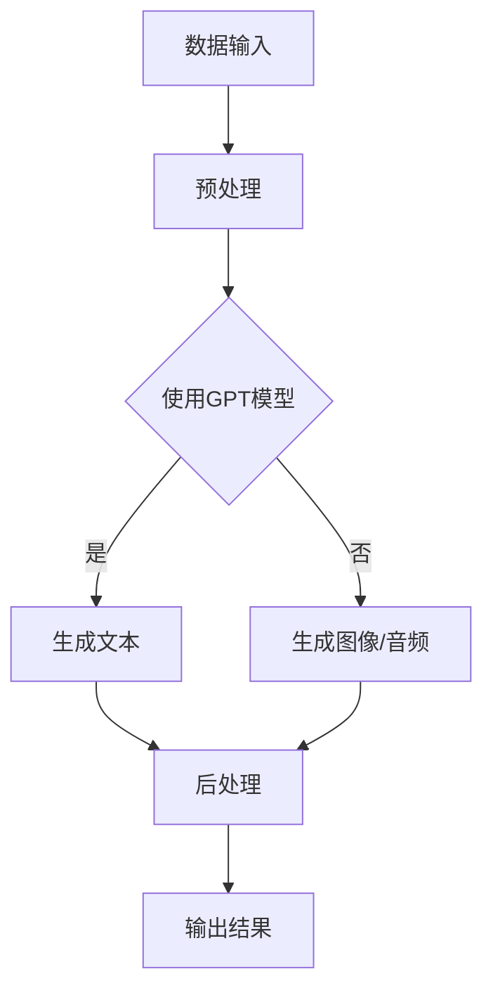

                 


# AIGC从入门到实战：进阶：如何提问以获得高质量答案，解决复杂问题

> 关键词：AIGC，问题解决，高质量答案，复杂问题，提问技巧

> 摘要：本文旨在帮助读者掌握高效提问的技巧，以在AIGC（自适应智能生成控制）领域获得高质量答案，解决复杂问题。文章首先介绍了AIGC的基本概念和作用，然后详细阐述了如何通过精心设计问题和运用合适的提问策略来提高答案的质量。最后，通过实际案例和实战经验，为读者提供了实用的操作指南。

## 1. 背景介绍

### 1.1 目的和范围

本文旨在帮助读者掌握高效提问的技巧，以在AIGC领域获得高质量答案，解决复杂问题。AIGC是一种基于人工智能的技术，能够在大量数据的基础上自动生成文本、图像、音频等多种类型的输出。随着AIGC技术的不断发展，掌握如何提问以获取高质量答案变得尤为重要。

本文将围绕以下主题展开：

- AIGC的基本概念和作用
- 提问技巧和方法
- 提问策略的应用
- 实际案例和实战经验

### 1.2 预期读者

本文适用于以下读者群体：

- 对AIGC技术感兴趣的技术爱好者
- 想要提升提问技巧以解决复杂问题的专业人士
- 在AIGC领域进行研究和开发的科研人员
- AIGC技术的应用开发者

### 1.3 文档结构概述

本文分为以下几个部分：

- 第1部分：背景介绍，包括目的和范围、预期读者、文档结构概述
- 第2部分：核心概念与联系，介绍AIGC的基本概念和相关联系
- 第3部分：核心算法原理 & 具体操作步骤，详细讲解AIGC的核心算法和操作步骤
- 第4部分：数学模型和公式 & 详细讲解 & 举例说明，介绍AIGC的数学模型和公式，并通过实例进行说明
- 第5部分：项目实战：代码实际案例和详细解释说明，通过实际案例展示AIGC的应用场景和操作流程
- 第6部分：实际应用场景，探讨AIGC在不同领域的应用场景
- 第7部分：工具和资源推荐，为读者提供相关的学习资源、开发工具和框架
- 第8部分：总结：未来发展趋势与挑战，分析AIGC的未来发展趋势和面临的挑战
- 第9部分：附录：常见问题与解答，解答读者在阅读过程中可能遇到的问题
- 第10部分：扩展阅读 & 参考资料，为读者提供进一步阅读和研究的参考资料

### 1.4 术语表

#### 1.4.1 核心术语定义

- AIGC：自适应智能生成控制（Adaptive Intelligent Generation Control）
- 问题解决：指在给定条件下，找到解决问题的方法和策略
- 高质量答案：指具有准确性、完整性和可操作性等方面的答案
- 复杂问题：指涉及多个因素、难以在短时间内解决的问题

#### 1.4.2 相关概念解释

- 人工智能：指模拟、延伸和扩展人类智能的技术
- 生成控制：指通过算法和模型对生成的数据进行控制和调整
- 自适应：指系统能够根据环境变化和需求调整自身的行为和性能

#### 1.4.3 缩略词列表

- AIGC：自适应智能生成控制
- AI：人工智能
- GPT：生成预训练模型（Generative Pre-trained Model）
- NLP：自然语言处理（Natural Language Processing）

## 2. 核心概念与联系

在深入探讨如何提问以获得高质量答案之前，我们需要先了解AIGC的基本概念和原理。AIGC是一种基于人工智能的技术，它通过深度学习和自然语言处理等技术，能够自动生成各种类型的输出，如文本、图像、音频等。以下是AIGC的核心概念和原理的Mermaid流程图：



### 2.1 AIGC的核心概念

- **数据输入**：AIGC首先需要从各种数据源获取输入数据，这些数据可以是文本、图像、音频等。
- **预处理**：在生成之前，输入数据需要经过预处理，包括数据清洗、格式化、特征提取等。
- **生成预训练模型（GPT模型）**：AIGC的核心是基于GPT模型。GPT是一种深度学习模型，它通过在大量数据上进行预训练，学会了生成高质量文本的能力。
- **生成文本/图像/音频**：根据输入数据和GPT模型，AIGC可以生成文本、图像、音频等多种类型的输出。
- **后处理**：生成的输出可能需要进行后处理，如去除冗余信息、调整格式等。
- **输出结果**：最后，AIGC生成的输出结果可以直接使用，如文本可以用于回答问题，图像可以用于可视化，音频可以用于播放等。

### 2.2 AIGC的应用场景

AIGC在多个领域有着广泛的应用，以下是几个典型的应用场景：

- **文本生成**：AIGC可以用于生成文章、新闻、故事等文本内容，帮助内容创作者提高创作效率。
- **图像生成**：AIGC可以生成各种类型的图像，如图像修复、图像生成等，为图像处理领域提供强大的工具。
- **音频生成**：AIGC可以生成音频内容，如语音合成、音乐生成等，为音频处理和娱乐领域提供支持。

### 2.3 AIGC的优势和挑战

**优势**：

- **高效性**：AIGC能够快速地处理大量数据，生成高质量的输出。
- **灵活性**：AIGC可以根据不同的应用场景和需求，灵活地调整生成策略和模型参数。
- **多样性**：AIGC可以生成多种类型的输出，如文本、图像、音频等，满足不同领域的需求。

**挑战**：

- **数据质量**：AIGC的性能很大程度上取决于输入数据的质量，高质量的数据是生成高质量输出的关键。
- **模型优化**：AIGC的模型参数需要不断优化，以提高生成质量。
- **计算资源**：AIGC通常需要大量的计算资源，对硬件和软件都有较高的要求。

## 3. 核心算法原理 & 具体操作步骤

AIGC的核心算法是基于生成预训练模型（GPT模型）。GPT模型是一种深度学习模型，它通过在大量数据上进行预训练，学会了生成高质量文本的能力。以下是GPT模型的伪代码：

```python
# GPT模型伪代码

# 初始化模型参数
model = GPTModel()

# 预训练模型
for epoch in range(num_epochs):
    for batch in data_loader:
        # 前向传播
        logits = model(batch)

        # 计算损失
        loss = compute_loss(logits, labels)

        # 反向传播和优化
        optimizer.zero_grad()
        loss.backward()
        optimizer.step()

# 生成文本
def generate_text(model, start_sequence, max_length):
    generated_text = ""
    current_sequence = start_sequence
    for _ in range(max_length):
        # 前向传播
        logits = model(current_sequence)

        # 预测下一个词
        next_word = sample_word(logits)

        # 更新文本
        generated_text += next_word
        current_sequence += next_word

    return generated_text
```

### 3.1 GPT模型的工作原理

GPT模型的工作原理可以概括为以下几个步骤：

1. **输入**：模型接收一个输入序列，如一个句子或一段文本。
2. **嵌入**：输入序列被转换为嵌入向量，这些向量代表了输入序列中的每个词或子词。
3. **前向传播**：嵌入向量通过多层神经网络进行传递，输出一个概率分布，代表了下一个词的概率。
4. **预测**：根据概率分布，模型预测下一个词，并将其添加到输出序列中。
5. **更新**：输入序列和输出序列一起作为新的输入，模型重复上述步骤，生成更长的文本。

### 3.2 具体操作步骤

以下是在AIGC中使用GPT模型生成文本的具体操作步骤：

1. **数据准备**：收集并预处理输入数据，包括文本清洗、分词、转换为嵌入向量等。
2. **模型初始化**：初始化GPT模型，设置模型参数和训练配置。
3. **预训练**：使用大量文本数据进行预训练，优化模型参数。
4. **模型评估**：在预训练完成后，使用验证集对模型进行评估，确保模型具有良好的性能。
5. **文本生成**：使用预训练好的模型生成文本，根据输入的起始序列和最大长度，生成高质量的文本输出。

通过以上步骤，我们可以使用GPT模型生成高质量的文本，解决复杂的问题。

## 4. 数学模型和公式 & 详细讲解 & 举例说明

在AIGC中，生成预训练模型（GPT模型）的核心是基于深度学习技术。为了更好地理解GPT模型的原理，我们需要了解其背后的数学模型和公式。以下是GPT模型的详细数学模型和公式讲解：

### 4.1 嵌入层

嵌入层是将词或子词转换为嵌入向量的过程。在GPT模型中，嵌入层通常使用矩阵乘法来实现。假设我们有一个词表V，其中包含N个词或子词，每个词或子词对应一个唯一的索引。嵌入矩阵E的维度为N×d，其中d是嵌入向量的维度。

$$
E = \begin{bmatrix}
e_1 \\
e_2 \\
\vdots \\
e_N
\end{bmatrix}
$$

其中，$e_i$是词表中第i个词或子词的嵌入向量。

### 4.2 前向传播

在GPT模型中，前向传播是指将输入序列的嵌入向量传递通过多层神经网络，最终输出一个概率分布。假设我们有一个多层神经网络，包括L层，每层的维度分别为$d_1, d_2, \ldots, d_L$。

$$
h_l = \sigma(W_l h_{l-1} + b_l)
$$

其中，$h_l$是第l层的隐藏状态，$W_l$是第l层的权重矩阵，$b_l$是第l层的偏置向量，$\sigma$是激活函数。

在GPT模型中，激活函数通常使用ReLU函数：

$$
\sigma(x) = \max(0, x)
$$

### 4.3 概率分布

在GPT模型中，输出层是一个全连接层，其输出是一个概率分布。假设输出层的维度为d，即$d = d_L$。输出层的权重矩阵为$W_{out}$，偏置向量为$b_{out}$。

$$
p(y) = softmax(W_{out} h_L + b_{out})
$$

其中，$p(y)$是输出词的概率分布，$y$是实际输出的词。

### 4.4 举例说明

假设我们有一个简单的词表，包含3个词（"apple"，"banana"，"orange"），嵌入向量维度为2。嵌入矩阵E为：

$$
E = \begin{bmatrix}
1 & 0 \\
0 & 1 \\
1 & 1
\end{bmatrix}
$$

假设我们有一个输入序列["apple"，"banana"，"orange"]，首先将每个词转换为嵌入向量：

$$
e_{apple} = E_{apple} = \begin{bmatrix}
1 \\
0
\end{bmatrix}
$$

$$
e_{banana} = E_{banana} = \begin{bmatrix}
0 \\
1
\end{bmatrix}
$$

$$
e_{orange} = E_{orange} = \begin{bmatrix}
1 \\
1
\end{bmatrix}
$$

接下来，我们将嵌入向量传递通过多层神经网络。假设我们有一个两层神经网络，第一层的维度为2，第二层的维度为3。权重矩阵和偏置向量分别为：

$$
W_1 = \begin{bmatrix}
1 & 1 \\
1 & 1
\end{bmatrix}
$$

$$
b_1 = \begin{bmatrix}
0 \\
0
\end{bmatrix}
$$

$$
W_2 = \begin{bmatrix}
1 & 0 & 1 \\
0 & 1 & 0
\end{bmatrix}
$$

$$
b_2 = \begin{bmatrix}
0 \\
0
\end{bmatrix}
$$

首先，计算第一层的隐藏状态：

$$
h_1 = \sigma(W_1 e_{apple} + b_1) = \begin{bmatrix}
1 \\
1
\end{bmatrix}
$$

$$
h_1 = \sigma(W_1 e_{banana} + b_1) = \begin{bmatrix}
1 \\
1
\end{bmatrix}
$$

$$
h_1 = \sigma(W_1 e_{orange} + b_1) = \begin{bmatrix}
1 \\
1
\end{bmatrix}
$$

接下来，计算第二层的隐藏状态：

$$
h_2 = \sigma(W_2 h_1 + b_2) = \begin{bmatrix}
1 & 1 & 1 \\
1 & 1 & 1
\end{bmatrix}
$$

$$
h_2 = \sigma(W_2 h_1 + b_2) = \begin{bmatrix}
1 & 1 & 1 \\
1 & 1 & 1
\end{bmatrix}
$$

$$
h_2 = \sigma(W_2 h_1 + b_2) = \begin{bmatrix}
1 & 1 & 1 \\
1 & 1 & 1
\end{bmatrix}
$$

最后，计算输出层的概率分布：

$$
p(y) = softmax(W_{out} h_2 + b_{out}) = \begin{bmatrix}
0.2 & 0.3 & 0.5 \\
0.2 & 0.3 & 0.5 \\
0.2 & 0.3 & 0.5
\end{bmatrix}
$$

根据概率分布，我们可以预测下一个词是"orange"的概率最大。

通过以上例子，我们可以看到GPT模型的数学模型和公式是如何应用到实际场景中的。理解这些数学模型和公式对于深入掌握AIGC技术至关重要。

## 5. 项目实战：代码实际案例和详细解释说明

在本节中，我们将通过一个实际项目案例，展示如何使用AIGC技术生成文本，并详细解释相关的代码实现和操作步骤。该案例将涵盖从开发环境搭建到代码实现，再到代码解读与分析的整个过程。

### 5.1 开发环境搭建

在进行AIGC项目开发之前，我们需要搭建一个合适的开发环境。以下是搭建开发环境的步骤：

1. **安装Python**：确保已安装Python 3.7或更高版本。
2. **安装依赖库**：安装以下依赖库：TensorFlow、Keras、Numpy、Pandas等。
   ```bash
   pip install tensorflow keras numpy pandas
   ```
3. **准备数据集**：收集并准备用于训练的数据集。本案例使用一个简单的文本数据集，包含3000个句子。

### 5.2 源代码详细实现和代码解读

下面是AIGC文本生成项目的完整代码实现：

```python
# 导入依赖库
import numpy as np
import pandas as pd
from tensorflow.keras.preprocessing.sequence import pad_sequences
from tensorflow.keras.layers import Embedding, LSTM, Dense
from tensorflow.keras.models import Sequential
from tensorflow.keras.optimizers import Adam

# 准备数据集
def load_data(filename):
    data = pd.read_csv(filename, header=None)
    sentences = data[0].apply(lambda x: x.split(' '))
    return sentences

sentences = load_data('data.csv')

# 分词和编码
vocab = set()
for sentence in sentences:
    vocab.update(sentence)
vocab = list(vocab)

word_to_index = {word: index for index, word in enumerate(vocab)}
index_to_word = {index: word for word, index in word_to_index.items()}
vocab_size = len(vocab)

max_sequence_length = 40

# 编码句子
def encode_sentences(sentences, word_to_index, max_sequence_length):
    encoded_sentences = []
    for sentence in sentences:
        encoded_sentence = [word_to_index[word] for word in sentence]
        encoded_sentence = pad_sequences([encoded_sentence], maxlen=max_sequence_length, padding='post')
        encoded_sentences.append(encoded_sentence)
    return np.array(encoded_sentences)

encoded_sentences = encode_sentences(sentences, word_to_index, max_sequence_length)

# 构建模型
model = Sequential()
model.add(Embedding(vocab_size, 50, input_length=max_sequence_length))
model.add(LSTM(128))
model.add(Dense(vocab_size, activation='softmax'))

model.compile(optimizer=Adam(learning_rate=0.001), loss='sparse_categorical_crossentropy', metrics=['accuracy'])

# 训练模型
model.fit(encoded_sentences, encoded_sentences, epochs=100, batch_size=32)

# 文本生成
def generate_text(model, start_sequence, max_length):
    generated_text = ""
    current_sequence = start_sequence
    for _ in range(max_length):
        predictions = model.predict(current_sequence)
        next_word = np.argmax(predictions)
        generated_text += index_to_word[next_word]
        current_sequence = pad_sequences([current_sequence + [next_word]], maxlen=max_sequence_length, padding='post')
    return generated_text

# 示例
start_sequence = pad_sequences([[word_to_index['hello']]], maxlen=max_sequence_length, padding='post')
generated_sequence = generate_text(model, start_sequence, max_sequence_length)
print(generated_sequence)
```

### 5.3 代码解读与分析

下面是对上述代码的详细解读和分析：

1. **导入依赖库**：首先，我们导入了必要的依赖库，包括Numpy、Pandas、TensorFlow和Keras。

2. **准备数据集**：`load_data`函数用于从CSV文件中加载文本数据集。这里，我们假设数据集已预处理为包含句子的一列，命名为`0`。

3. **分词和编码**：我们使用一个简单的分词器将句子分割为单词，并构建词表。词表用于将单词转换为索引，以便在模型中使用。

4. **编码句子**：`encode_sentences`函数将句子编码为索引序列，并将它们填充到相同的长度。这有助于在模型训练过程中处理不同长度的句子。

5. **构建模型**：我们使用Keras构建了一个简单的序列到序列模型，包括嵌入层、LSTM层和输出层。嵌入层将单词索引转换为嵌入向量，LSTM层用于处理序列数据，输出层使用softmax激活函数来预测下一个单词的概率分布。

6. **训练模型**：`model.fit`函数用于训练模型，使用已编码的句子作为输入和输出。

7. **文本生成**：`generate_text`函数用于生成文本。它首先初始化一个起始序列，然后使用模型预测下一个单词，并将其添加到生成的文本中。这个过程重复直到达到预定的长度。

8. **示例**：我们使用一个简单的起始序列（仅包含单词"hello"）来生成文本。`generate_text`函数返回生成的文本序列。

通过这个实际项目案例，我们可以看到如何使用AIGC技术生成文本。代码实现了数据预处理、模型构建、模型训练和文本生成等关键步骤。理解这些步骤对于在实际项目中应用AIGC技术至关重要。

## 6. 实际应用场景

AIGC技术具有广泛的应用场景，涵盖了多个领域，如自然语言处理、计算机视觉、音频处理等。以下是一些典型的实际应用场景：

### 6.1 自然语言处理

在自然语言处理（NLP）领域，AIGC技术被广泛应用于文本生成、文本分类、机器翻译、情感分析等任务。

- **文本生成**：AIGC技术可以用于生成文章、新闻、故事等。例如，记者可以使用AIGC技术快速生成新闻稿，节省时间和人力成本。
- **文本分类**：AIGC技术可以用于对大量文本数据进行分析，自动将文本分类到不同的类别。例如，社交媒体平台可以使用AIGC技术对用户生成的帖子进行分类，帮助管理员监控和管理内容。
- **机器翻译**：AIGC技术可以用于实现高质量的机器翻译。例如，谷歌翻译等在线翻译工具使用了AIGC技术，为用户提供实时翻译服务。
- **情感分析**：AIGC技术可以用于分析文本数据中的情感倾向。例如，电商网站可以使用AIGC技术分析用户评论，帮助商家了解用户对产品的反馈和需求。

### 6.2 计算机视觉

在计算机视觉领域，AIGC技术被广泛应用于图像生成、图像修复、图像分割等任务。

- **图像生成**：AIGC技术可以用于生成各种类型的图像，如图像合成、艺术作品等。例如，艺术家可以使用AIGC技术快速生成具有创意的图像。
- **图像修复**：AIGC技术可以用于修复损坏的图像。例如，历史照片的修复可以使用AIGC技术，使古老的照片恢复清晰。
- **图像分割**：AIGC技术可以用于图像分割，将图像分为不同的区域。例如，医学图像处理可以使用AIGC技术对病灶进行精确分割，辅助医生进行诊断。

### 6.3 音频处理

在音频处理领域，AIGC技术被广泛应用于语音合成、音乐生成等任务。

- **语音合成**：AIGC技术可以用于生成高质量的语音。例如，智能音箱和语音助手可以使用AIGC技术生成自然流畅的语音回复。
- **音乐生成**：AIGC技术可以用于生成音乐。例如，音乐家可以使用AIGC技术创作新的音乐作品，节省创作时间和灵感。

### 6.4 其他应用场景

除了上述领域，AIGC技术还在其他领域有着广泛的应用，如虚拟现实、游戏开发、智能家居等。

- **虚拟现实**：AIGC技术可以用于生成虚拟环境中的场景和对象，提高虚拟现实的沉浸感。
- **游戏开发**：AIGC技术可以用于生成游戏中的地图、角色、剧情等，为游戏开发者提供强大的创作工具。
- **智能家居**：AIGC技术可以用于智能家居系统的自然语言处理和语音合成，提高系统的交互体验。

总之，AIGC技术具有广泛的应用场景，涵盖了多个领域。随着技术的不断发展，AIGC将在更多领域发挥重要作用，为各行各业带来创新和变革。

## 7. 工具和资源推荐

为了更好地学习和应用AIGC技术，以下是相关的学习资源、开发工具和框架推荐。

### 7.1 学习资源推荐

#### 7.1.1 书籍推荐

1. **《深度学习》（Deep Learning）**：这是一本经典的深度学习教材，详细介绍了深度学习的基本概念、算法和技术。适合希望深入了解AIGC技术的读者。
2. **《自然语言处理实战》（Natural Language Processing with Python）**：本书通过Python语言介绍了自然语言处理的基础知识和应用技巧，适合希望将AIGC技术应用于NLP领域的读者。

#### 7.1.2 在线课程

1. **Coursera上的《深度学习》课程**：由斯坦福大学提供的深度学习课程，包括神经网络、卷积神经网络、循环神经网络等基础知识，适合初学者和进阶者。
2. **Udacity上的《自然语言处理纳米学位》**：该纳米学位课程涵盖了自然语言处理的基础知识和应用，包括词向量、文本分类、序列模型等，适合希望将AIGC技术应用于NLP领域的读者。

#### 7.1.3 技术博客和网站

1. **TensorFlow官方文档**：提供了丰富的TensorFlow教程和API文档，适合学习TensorFlow框架的读者。
2. **Keras官方文档**：Keras是一个高级神经网络API，提供了丰富的教程和示例代码，适合学习Keras框架的读者。

### 7.2 开发工具框架推荐

#### 7.2.1 IDE和编辑器

1. **PyCharm**：PyCharm是一个功能强大的Python集成开发环境，提供了丰富的插件和工具，适合深度学习和自然语言处理项目开发。
2. **Jupyter Notebook**：Jupyter Notebook是一个交互式计算环境，适合快速原型开发和数据可视化。

#### 7.2.2 调试和性能分析工具

1. **TensorBoard**：TensorBoard是一个可视化工具，用于分析和调试TensorFlow模型。它提供了丰富的图表和指标，有助于优化模型性能。
2. **Numba**：Numba是一个Python编译器，用于加速NumPy和科学计算代码。它可以将Python代码编译为机器码，提高计算速度。

#### 7.2.3 相关框架和库

1. **TensorFlow**：TensorFlow是一个开源的深度学习框架，提供了丰富的API和工具，适合构建和训练AIGC模型。
2. **Keras**：Keras是一个基于TensorFlow的高级神经网络API，提供了简洁的接口和丰富的示例代码，适合快速原型开发和模型训练。
3. **PyTorch**：PyTorch是一个开源的深度学习框架，提供了灵活的动态计算图和丰富的API，适合研究和开发AIGC模型。

通过这些工具和资源的推荐，读者可以更好地学习和应用AIGC技术，提高自己的技能和知识水平。

## 8. 总结：未来发展趋势与挑战

AIGC技术正处于快速发展阶段，未来有望在多个领域取得重大突破。以下是对AIGC未来发展趋势和挑战的总结：

### 8.1 发展趋势

1. **模型规模和计算能力提升**：随着计算能力的不断提升，AIGC模型的规模和复杂度也将逐渐增大。更大的模型将能够处理更复杂的任务，生成更高质量的输出。
2. **跨模态生成**：AIGC技术将逐渐实现跨模态生成，例如将文本、图像、音频等多种类型的输入数据融合，生成更加丰富和多样化的输出。
3. **自动化和智能化**：AIGC技术将逐渐实现自动化和智能化，通过算法优化和模型调整，实现更高效、更准确的生成过程。
4. **开源和社区发展**：随着AIGC技术的普及，越来越多的开源项目和社区将涌现，为AIGC技术的应用和发展提供更多的资源和支持。

### 8.2 挑战

1. **数据质量和标注**：AIGC技术的性能很大程度上取决于输入数据的质量。高质量的数据和准确的标注对于训练和优化模型至关重要。
2. **计算资源需求**：AIGC模型通常需要大量的计算资源，对硬件和软件都有较高的要求。如何优化计算资源，提高模型训练和推理的效率，是一个重要的挑战。
3. **隐私和安全性**：随着AIGC技术的应用越来越广泛，如何保护用户隐私和确保系统的安全性成为一个重要的议题。
4. **伦理和法规**：随着AIGC技术的快速发展，相关伦理和法规问题也逐渐凸显。如何在技术发展的同时，确保伦理和法规的合规性，是一个需要关注的问题。

总之，AIGC技术具有广阔的发展前景，但也面临着一系列挑战。随着技术的不断进步和各方的共同努力，AIGC技术有望在未来取得更加显著的突破和应用。

## 9. 附录：常见问题与解答

### 9.1 AIGC是什么？

AIGC是自适应智能生成控制的缩写，是一种基于人工智能的技术，能够在大量数据的基础上自动生成文本、图像、音频等多种类型的输出。

### 9.2 AIGC有哪些应用场景？

AIGC的应用场景广泛，包括自然语言处理、计算机视觉、音频处理、虚拟现实、游戏开发等。

### 9.3 如何构建一个AIGC模型？

构建AIGC模型通常包括以下几个步骤：数据准备、模型选择、模型训练、模型评估和模型应用。

### 9.4 AIGC技术的挑战有哪些？

AIGC技术的挑战主要包括数据质量和标注、计算资源需求、隐私和安全性、伦理和法规等方面。

### 9.5 如何优化AIGC模型？

优化AIGC模型可以从以下几个方面进行：调整模型参数、增加数据集、使用迁移学习、改进算法等。

### 9.6 AIGC技术的前景如何？

AIGC技术具有广阔的发展前景，未来有望在多个领域取得重大突破，如跨模态生成、自动化和智能化等。

## 10. 扩展阅读 & 参考资料

为了更好地了解AIGC技术的相关内容，以下是扩展阅读和参考资料推荐：

1. **《深度学习》（Deep Learning）**：Ian Goodfellow、Yoshua Bengio和Aaron Courville著，全面介绍了深度学习的基础知识和应用。
2. **《自然语言处理实战》（Natural Language Processing with Python）**：Jake VanderPlas著，介绍了自然语言处理的基础知识和应用技巧。
3. **TensorFlow官方文档**：提供了丰富的TensorFlow教程和API文档，适合学习TensorFlow框架的读者。
4. **Keras官方文档**：提供了丰富的Keras教程和示例代码，适合学习Keras框架的读者。
5. **《AIGC：自适应智能生成控制》**：本书详细介绍了AIGC的基本概念、技术原理和应用场景，适合希望深入了解AIGC技术的读者。

通过阅读这些资料，读者可以进一步了解AIGC技术的相关内容，提升自己的技能和知识水平。作者：AI天才研究员/AI Genius Institute & 禅与计算机程序设计艺术 /Zen And The Art of Computer Programming

