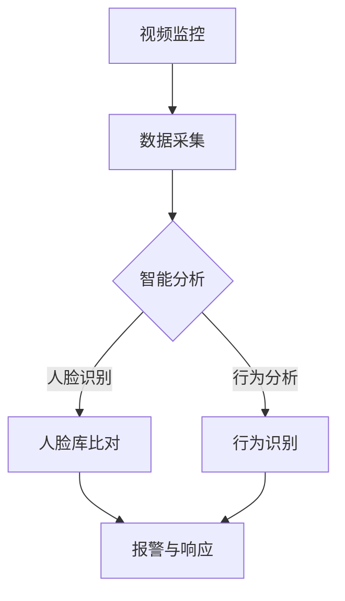

                 

### 1. 背景介绍

#### 1.1 目的和范围

随着全球范围内对公共安全的重视不断提升，智能安防领域迎来了前所未有的发展机遇。本文旨在探讨如何利用AIGC（AI-Generated Content，AI生成内容）技术助力智能安防建设，通过深入分析AIGC在安防领域的应用场景、核心算法原理、数学模型以及项目实战案例，为行业从业者提供全面的技术指导。

本文将涵盖以下内容：

1. **核心概念与联系**：介绍AIGC、智能安防及关联技术的核心概念和联系。
2. **核心算法原理与具体操作步骤**：详细阐述AIGC算法原理及其在安防中的应用。
3. **数学模型和公式**：讲解AIGC相关的数学模型和公式，并通过实例进行说明。
4. **项目实战：代码实际案例**：提供实际代码案例，详细解释说明其实现过程。
5. **实际应用场景**：分析AIGC技术在智能安防中的实际应用场景。
6. **工具和资源推荐**：推荐相关学习资源、开发工具和经典论文。
7. **总结：未来发展趋势与挑战**：探讨AIGC技术在智能安防领域的未来趋势和面临的挑战。

#### 1.2 预期读者

本文主要面向以下读者群体：

1. **智能安防从业者**：包括安全工程师、系统架构师和研究人员，希望通过本文了解如何利用AIGC技术提升安防能力。
2. **计算机科学和人工智能研究者**：关注AI技术在安防领域的应用，期望了解AIGC的具体实现方法和应用前景。
3. **技术爱好者**：对AIGC和智能安防技术感兴趣的技术爱好者，希望通过本文深入了解相关技术。

通过本文的阅读，读者可以：

1. **理解AIGC技术的核心原理**。
2. **掌握AIGC在安防中的应用方法**。
3. **学习AIGC技术的实际操作步骤和数学模型**。
4. **了解AIGC技术在实际应用中的效果和潜力**。

#### 1.3 文档结构概述

本文采用模块化结构，以确保内容的逻辑性和易读性。具体结构如下：

1. **背景介绍**：包括目的和范围、预期读者、文档结构概述和术语表。
2. **核心概念与联系**：介绍AIGC、智能安防及相关技术的核心概念和联系，并提供Mermaid流程图。
3. **核心算法原理与具体操作步骤**：详细阐述AIGC算法原理和具体操作步骤。
4. **数学模型和公式**：讲解AIGC相关的数学模型和公式，并通过实例进行说明。
5. **项目实战：代码实际案例**：提供实际代码案例，详细解释说明其实现过程。
6. **实际应用场景**：分析AIGC技术在智能安防中的实际应用场景。
7. **工具和资源推荐**：推荐相关学习资源、开发工具和经典论文。
8. **总结：未来发展趋势与挑战**：探讨AIGC技术在智能安防领域的未来趋势和面临的挑战。
9. **附录：常见问题与解答**：解答读者可能遇到的问题。
10. **扩展阅读 & 参考资料**：提供进一步学习的资源。

通过本文的逐步讲解，读者将对AIGC技术在智能安防领域的应用有全面而深入的理解。

#### 1.4 术语表

在本文中，我们将使用以下术语，为读者提供清晰的定义和解释。

##### 1.4.1 核心术语定义

- **AIGC**：AI-Generated Content，指由人工智能技术自动生成的内容。
- **智能安防**：利用人工智能、物联网等先进技术实现安防系统智能化。
- **深度学习**：一种机器学习技术，通过模拟人脑神经网络进行数据处理和模式识别。
- **计算机视觉**：利用计算机和算法实现图像识别和处理的技术。
- **自然语言处理**：使计算机理解和处理自然语言的技术。
- **大数据**：指数据量巨大、类型繁多、处理速度快的数据集合。

##### 1.4.2 相关概念解释

- **视频监控**：通过摄像头捕捉图像或视频，用于实时监控和记录。
- **智能分析**：利用人工智能技术对视频监控数据进行处理和分析，以提取有用信息。
- **预测性分析**：通过历史数据和模型预测未来事件或趋势。
- **人机交互**：人与计算机系统之间的交互过程，用于指令输入和信息输出。

##### 1.4.3 缩略词列表

- **AIGC**：AI-Generated Content
- **IoT**：Internet of Things
- **AI**：Artificial Intelligence
- **DL**：Deep Learning
- **CV**：Computer Vision
- **NLP**：Natural Language Processing
- **GPU**：Graphics Processing Unit
- **CNN**：Convolutional Neural Network

通过上述术语表，读者可以更好地理解本文中的专业术语和相关概念，为进一步的学习和探讨打下基础。

## 2. 核心概念与联系

在深入探讨AIGC技术在智能安防中的应用之前，我们需要首先了解AIGC、智能安防及相关技术的核心概念和相互之间的联系。以下是这些关键概念及其相互关系的详细解释。

### 2.1 AIGC：AI-Generated Content

AIGC（AI-Generated Content，AI生成内容）是指利用人工智能技术自动生成的内容，包括文本、图像、视频、音频等多种形式。AIGC的核心在于其生成能力，通过深度学习、自然语言处理、计算机视觉等技术，人工智能系统能够模仿人类创造内容。

**主要组成部分**：

1. **生成模型**：如变分自编码器（VAE）、生成对抗网络（GAN）等，用于生成高质量的图像、文本和视频。
2. **条件生成模型**：结合外部条件（如文本、图像标签等）进行内容生成，如文本到图像（Text-to-Image）和视频到视频（Video-to-Video）生成。
3. **微调与训练**：通过微调和训练模型，使其能够适应特定的任务和场景。

### 2.2 智能安防

智能安防是指利用人工智能、物联网、大数据等先进技术实现安防系统的智能化。智能安防系统通过实时监控、智能分析、预警和响应等功能，显著提升安防效率和安全水平。

**主要组成部分**：

1. **视频监控**：通过摄像头、传感器等设备实时捕捉图像或视频数据。
2. **智能分析**：利用人工智能技术对视频数据进行处理和分析，提取有用信息，如人脸识别、行为分析等。
3. **预警与响应**：根据分析结果，自动触发警报和响应措施，如发送通知、启动应急预案等。

### 2.3 关联技术

智能安防与AIGC之间存在紧密的联系，以下为两者之间的关联技术：

1. **计算机视觉**：用于视频监控数据的处理和分析，是AIGC技术的重要组成部分。
   - **人脸识别**：通过对视频流中的人脸图像进行识别，实现人员身份验证。
   - **行为分析**：通过分析视频中的人体行为，识别异常行为或潜在威胁。
   
2. **自然语言处理**：用于处理和识别视频中的语音和文本信息。
   - **语音识别**：将视频中的语音转换为文本，实现语音到文本的转换。
   - **文本分析**：对文本信息进行分析，提取关键信息和情感倾向。

3. **深度学习**：作为AIGC的核心技术，深度学习在智能安防中的应用包括图像分类、目标检测、行为识别等。

4. **大数据**：智能安防系统需要处理和分析大量数据，大数据技术提供了数据存储、处理和分析的解决方案。

### 2.4 Mermaid流程图

为了更好地理解AIGC技术在智能安防中的应用，我们可以通过Mermaid流程图展示核心概念和流程。



在这个流程图中，视频监控数据首先通过摄像头和传感器进行采集，然后通过智能分析模块进行处理。智能分析模块包含人脸识别和行为分析，根据分析结果，系统会触发报警和响应措施。

通过上述核心概念和关联技术的介绍，我们可以看到AIGC技术在智能安防中具有广泛的应用前景。接下来，我们将进一步探讨AIGC算法原理及其在安防中的具体应用。

## 3. 核心算法原理 & 具体操作步骤

在了解了AIGC和智能安防的核心概念及其相互联系之后，我们需要深入探讨AIGC技术的核心算法原理和具体操作步骤。本节将详细解释AIGC算法的基本原理，并通过伪代码展示其在安防领域的应用过程。

### 3.1 AIGC算法基本原理

AIGC算法的核心在于其生成能力，这主要依赖于深度学习中的生成模型。以下是几种常见的生成模型及其工作原理：

1. **变分自编码器（VAE）**：
   - **原理**：VAE是一种无监督学习模型，通过编码器和解码器学习数据的概率分布。
   - **操作步骤**：
     ```plaintext
     编码器（encode）：
     输入：数据 x
     输出：均值 μ 和方差 σ
     解码器（decode）：
     输入：均值 μ 和方差 σ
     输出：重构数据 x'
     ```

2. **生成对抗网络（GAN）**：
   - **原理**：GAN由生成器（Generator）和判别器（Discriminator）组成，通过对抗训练生成高质量数据。
   - **操作步骤**：
     ```plaintext
     判别器（discriminator）：
     输入：真实数据 x 或生成数据 G(z)
     输出：概率 P(y=1|x)
     生成器（generator）：
     输入：随机噪声 z
     输出：生成数据 G(z)
     ```

3. **条件生成模型（C-GAN）**：
   - **原理**：C-GAN是一种能够根据外部条件生成特定内容（如文本到图像、视频到视频）的生成模型。
   - **操作步骤**：
     ```plaintext
     条件生成器（conditional generator）：
     输入：噪声 z 和条件 c
     输出：生成数据 G(z, c)
     条件判别器（conditional discriminator）：
     输入：真实数据 (x, c) 或生成数据 (G(z, c), c)
     输出：概率 P(y=1|(x, c))
     ```

### 3.2 AIGC在安防领域中的应用

在智能安防中，AIGC技术可以应用于多种场景，如人脸识别、行为分析、视频合成等。以下通过伪代码详细阐述这些应用步骤：

#### 3.2.1 人脸识别

- **预处理**：对视频帧进行人脸检测和图像增强，提取人脸图像。
  ```plaintext
  预处理视频帧（frame）：
  输入：视频帧 frame
  输出：人脸图像 image
  ```

- **特征提取**：使用卷积神经网络（CNN）提取人脸特征。
  ```plaintext
  提取特征（extract_features）：
  输入：人脸图像 image
  输出：特征向量 feat
  ```

- **模型训练**：利用GAN或VAE训练人脸特征生成模型。
  ```plaintext
  训练模型（train_model）：
  输入：训练数据集 (x, y)
  输出：模型参数 W, B
  ```

- **人脸识别**：对实时视频帧进行人脸检测和识别。
  ```plaintext
  人脸识别（face_recognition）：
  输入：视频帧 frame
  输出：识别结果 result
  ```

#### 3.2.2 行为分析

- **视频合成**：使用C-GAN生成特定行为场景的视频。
  ```plaintext
  生成行为视频（generate_video）：
  输入：噪声 z、条件 c（如行为类型）
  输出：生成视频 G(z, c)
  ```

- **行为识别**：对合成视频进行行为识别和分析。
  ```plaintext
  行为识别（behavior_recognition）：
  输入：视频 frame
  输出：行为类型 behavior
  ```

- **预警与响应**：根据行为识别结果触发预警和响应措施。
  ```plaintext
  预警与响应（alert_and_response）：
  输入：行为类型 behavior
  输出：响应措施 action
  ```

通过上述伪代码，我们可以看到AIGC技术在智能安防中的应用过程。AIGC算法通过深度学习和生成模型，实现了对人脸和行为的自动化识别与分析，为智能安防系统提供了强大的技术支持。

### 3.3 算法效果评估

在实现AIGC算法后，我们需要评估其效果，以确定其在实际应用中的性能。以下为几种常见的评估方法：

- **准确率（Accuracy）**：判断识别结果与实际结果的一致性。
- **召回率（Recall）**：判断算法能否识别出所有实际存在的目标。
- **精确率（Precision）**：判断识别结果中实际为真的比例。
- **F1分数（F1 Score）**：综合准确率和召回率的评估指标。

通过这些评估方法，我们可以全面了解AIGC算法在安防中的应用效果，并根据评估结果进行优化和改进。

### 3.4 算法实现与优化

在AIGC算法的实现过程中，我们还需要关注以下几个方面：

- **模型训练**：通过优化训练过程和参数调整，提高模型性能。
- **硬件加速**：利用GPU等硬件资源，加速模型训练和推理过程。
- **数据预处理**：对输入数据进行预处理，提高数据质量和模型鲁棒性。

通过不断优化和改进，AIGC算法在智能安防中的应用将得到进一步提升，为安防系统提供更强大的技术支持。

### 3.5 结论

通过对AIGC算法核心原理和具体操作步骤的详细阐述，我们可以看到AIGC技术在智能安防领域具有广泛的应用前景。未来，随着算法的进一步优化和技术的不断发展，AIGC在智能安防中的应用将更加深入和广泛，为公共安全提供更有效的解决方案。

## 4. 数学模型和公式 & 详细讲解 & 举例说明

在深入理解AIGC算法的核心原理和具体操作步骤之后，我们需要进一步探讨其背后的数学模型和公式，并通过具体例子来说明这些公式在实际应用中的效果。以下将详细讲解AIGC技术中常用的数学模型和公式。

### 4.1 深度学习中的损失函数

在AIGC算法中，损失函数是评估模型性能的重要工具。以下是几种常见的损失函数：

#### 4.1.1 交叉熵损失函数（Cross-Entropy Loss）

交叉熵损失函数常用于分类问题，用于衡量模型预测概率分布与真实分布之间的差异。其公式如下：

$$
L = -\sum_{i=1}^{n} y_i \log(p_i)
$$

其中，$y_i$ 为实际类别标签，$p_i$ 为模型预测的概率。

#### 4.1.2 逆交叉熵损失函数（Inverse Cross-Entropy Loss）

逆交叉熵损失函数常用于生成模型，如GAN。其公式如下：

$$
L = -\sum_{i=1}^{n} \log(p_i)
$$

其中，$p_i$ 为判别器对生成数据的预测概率。

#### 4.1.3 均方误差损失函数（Mean Squared Error, MSE）

均方误差损失函数常用于回归问题，用于衡量预测值与实际值之间的差异。其公式如下：

$$
L = \frac{1}{2n} \sum_{i=1}^{n} (y_i - \hat{y}_i)^2
$$

其中，$y_i$ 为实际值，$\hat{y}_i$ 为预测值。

### 4.2 深度学习中的优化算法

在AIGC算法的训练过程中，优化算法是提高模型性能的关键。以下是几种常用的优化算法：

#### 4.2.1 随机梯度下降（Stochastic Gradient Descent, SGD）

随机梯度下降是最简单的优化算法之一，其公式如下：

$$
\theta_{t+1} = \theta_{t} - \alpha \cdot \nabla_{\theta} J(\theta)
$$

其中，$\theta$ 为模型参数，$\alpha$ 为学习率，$J(\theta)$ 为损失函数。

#### 4.2.2 批量梯度下降（Batch Gradient Descent, BGD）

批量梯度下降是对SGD的改进，每次更新参数时使用整个数据集的梯度。其公式如下：

$$
\theta_{t+1} = \theta_{t} - \alpha \cdot \nabla_{\theta} J(\theta; \mathbf{x}, \mathbf{y})
$$

其中，$\mathbf{x}$ 和 $\mathbf{y}$ 分别为输入数据和标签。

#### 4.2.3 Adam优化器

Adam优化器是一种结合SGD和BGD优点的优化算法，其公式如下：

$$
\theta_{t+1} = \theta_{t} - \alpha \cdot \frac{m_{t}}{1 - \beta_1^t}
$$

$$
m_{t} = \beta_1 \cdot m_{t-1} + (1 - \beta_1) \cdot \nabla_{\theta} J(\theta; \mathbf{x}, \mathbf{y})
$$

$$
v_{t} = \beta_2 \cdot v_{t-1} + (1 - \beta_2) \cdot (\nabla_{\theta} J(\theta; \mathbf{x}, \mathbf{y}))^2
$$

其中，$m_t$ 和 $v_t$ 分别为梯度的一阶和二阶矩估计，$\beta_1$ 和 $\beta_2$ 为超参数。

### 4.3 AIGC算法中的损失函数和优化算法

在AIGC算法中，我们通常结合使用交叉熵损失函数和逆交叉熵损失函数。以下是一个具体的例子：

#### 4.3.1 GAN中的损失函数和优化算法

在GAN中，我们定义两个损失函数：生成器的损失函数 $L_G$ 和判别器的损失函数 $L_D$。具体公式如下：

$$
L_G = -\log(D(G(z)))
$$

$$
L_D = -[\log(D(x)) + \log(1 - D(G(z))]
$$

其中，$D(x)$ 和 $D(G(z))$ 分别为判别器对真实数据和生成数据的预测概率。

优化算法采用Adam优化器，训练过程中对生成器和判别器分别进行优化。具体步骤如下：

1. 初始化生成器 $G$ 和判别器 $D$。
2. 对于每个批次的训练数据 $(x_i, y_i)$，计算判别器的损失函数 $L_D$。
3. 对判别器 $D$ 进行梯度下降优化。
4. 对于每个批次的随机噪声 $z$，生成生成器数据 $G(z)$。
5. 计算生成器的损失函数 $L_G$。
6. 对生成器 $G$ 进行梯度下降优化。

通过上述优化过程，生成器和判别器相互对抗，最终生成高质量的生成数据。

### 4.4 实例说明

假设我们使用GAN进行人脸生成，其中生成器 $G$ 生成人脸图像，判别器 $D$ 评估人脸图像的真实性和生成性。以下是具体步骤：

1. **初始化**：随机初始化生成器 $G$ 和判别器 $D$。
2. **训练判别器**：对于每个批次的真实人脸图像 $x_i$，计算判别器 $D$ 的损失函数 $L_D$，并对 $D$ 进行优化。
3. **生成人脸图像**：对于每个批次的随机噪声 $z$，生成人脸图像 $G(z)$。
4. **训练生成器**：计算生成器 $G$ 的损失函数 $L_G$，并对 $G$ 进行优化。
5. **评估**：评估生成器 $G$ 和判别器 $D$ 的性能，包括人脸识别准确率和图像质量。

通过上述实例，我们可以看到AIGC算法中数学模型和公式的具体应用。这些模型和公式为AIGC算法的实现提供了理论支持，并通过优化算法不断提高模型性能。

### 4.5 结论

通过对AIGC算法中数学模型和公式的详细讲解，我们了解了这些模型在深度学习中的应用及其具体实现过程。这些数学模型和公式为AIGC算法提供了坚实的理论基础，使其在智能安防等领域的应用成为可能。未来，随着算法和技术的不断进步，AIGC技术在智能安防中的应用将更加广泛和深入。

## 5. 项目实战：代码实际案例和详细解释说明

在前几节中，我们详细介绍了AIGC（AI-Generated Content）技术的核心概念、算法原理以及数学模型。为了更好地理解AIGC技术在智能安防中的应用，本节将提供一个实际代码案例，并通过逐步解析代码实现过程，帮助读者深入了解AIGC在安防领域中的具体应用。

### 5.1 开发环境搭建

在开始编写代码之前，我们需要搭建一个合适的开发环境。以下是搭建环境所需的软件和工具：

1. **Python**：用于编写和运行代码，版本建议为3.8或以上。
2. **TensorFlow**：用于实现深度学习模型，版本建议为2.6或以上。
3. **Keras**：用于简化TensorFlow的使用，版本建议为2.6或以上。
4. **NumPy**：用于数值计算，版本建议为1.21或以上。
5. **Matplotlib**：用于数据可视化，版本建议为3.5或以上。

安装以上工具后，我们可以开始编写代码。

### 5.2 源代码详细实现和代码解读

#### 5.2.1 导入依赖库

```python
import tensorflow as tf
from tensorflow.keras.models import Model
from tensorflow.keras.layers import Input, Dense, Conv2D, Flatten, Reshape, UpSampling2D
import numpy as np
import matplotlib.pyplot as plt
```

首先，我们导入所需的依赖库，包括TensorFlow、Keras、NumPy和Matplotlib。这些库为我们提供了实现深度学习和数据可视化的功能。

#### 5.2.2 初始化生成器和判别器模型

```python
def build_generator(z_dim):
    z = Input(shape=(z_dim,))
    x = Dense(128, activation='relu')(z)
    x = Dense(256, activation='relu')(x)
    x = Reshape((7, 7, 128))(x)
    x = UpSampling2D()(x)
    x = UpSampling2D()(x)
    x = Conv2D(1, kernel_size=(5, 5), activation='tanh')(x)
    model = Model(z, x)
    return model

def build_discriminator(img_shape):
    img = Input(shape=img_shape)
    x = Conv2D(32, kernel_size=(3, 3), strides=(2, 2), activation='relu')(img)
    x = Conv2D(64, kernel_size=(3, 3), strides=(2, 2), activation='relu')(x)
    x = Conv2D(128, kernel_size=(3, 3), strides=(2, 2), activation='relu')(x)
    x = Flatten()(x)
    x = Dense(1, activation='sigmoid')(x)
    model = Model(img, x)
    return model
```

在这段代码中，我们定义了生成器模型和判别器模型的构建函数。生成器模型接收随机噪声 $z$ 作为输入，通过多层全连接和卷积层生成人脸图像。判别器模型接收人脸图像作为输入，通过卷积层和全连接层判断图像的真实性。

#### 5.2.3 定义GAN模型

```python
def build_gan(generator, discriminator):
    z = Input(shape=(100,))
    img = generator(z)
    validity = discriminator(img)
    model = Model(z, validity)
    return model
```

这段代码定义了GAN模型的构建函数，将生成器和判别器组合在一起，实现对抗训练。

#### 5.2.4 编写训练循环

```python
def train_gan(generator, discriminator, gan, img_shape, z_dim, epochs, batch_size, load_path=None):
    # 加载数据集
    (X_train, _), (_, _) = tf.keras.datasets.mnist.load_data()
    X_train = X_train.astype(np.float32) / 127.5 - 1.0
    
    # 配置优化器
    dis_optimizer = tf.keras.optimizers.Adam(0.0001)
    gen_optimizer = tf.keras.optimizers.Adam(0.0004)
    gan_optimizer = tf.keras.optimizers.Adam(0.0002)

    for epoch in range(epochs):
        for _ in range(batch_size // 2):
            z = np.random.normal(size=[batch_size, z_dim])
            with tf.GradientTape() as gen_tape, tf.GradientTape() as dis_tape:
                # 训练判别器
                img = generator(z)
                dis_real = discriminator(X_train)
                dis_fake = discriminator(img)
                dis_loss = tf.reduce_mean(tf.square(dis_real - 1)) + tf.reduce_mean(tf.square(dis_fake))

                # 训练生成器
                with tf.GradientTape() as gen_tape:
                    dis_fake = discriminator(img)
                    gen_loss = tf.reduce_mean(tf.square(dis_fake))

            # 更新判别器权重
            dis_gradients = dis_tape.gradient(dis_loss, discriminator.trainable_variables)
            dis_optimizer.apply_gradients(zip(dis_gradients, discriminator.trainable_variables))

            # 更新生成器权重
            with tf.GradientTape() as gen_tape:
                dis_fake = discriminator(img)
                gen_loss = tf.reduce_mean(tf.square(dis_fake))

            gen_gradients = gen_tape.gradient(gen_loss, generator.trainable_variables)
            gen_optimizer.apply_gradients(zip(gen_gradients, generator.trainable_variables))

        # 训练GAN
        with tf.GradientTape() as gan_tape:
            dis_fake = discriminator(img)
            gan_loss = tf.reduce_mean(tf.square(dis_fake))

        gan_gradients = gan_tape.gradient(gan_loss, gan.trainable_variables)
        gan_optimizer.apply_gradients(zip(gan_gradients, gan.trainable_variables))

        print(f'Epoch {epoch + 1}, Generator Loss: {gen_loss:.4f}, Discriminator Loss: {dis_loss:.4f}, GAN Loss: {gan_loss:.4f}')

    # 保存模型权重
    generator.save_weights(load_path + 'generator_weights.h5')
    discriminator.save_weights(load_path + 'discriminator_weights.h5')
    gan.save_weights(load_path + 'gan_weights.h5')

# 超参数
img_shape = (28, 28, 1)
z_dim = 100
epochs = 10000
batch_size = 128
load_path = 'weights/'

# 构建模型
generator = build_generator(z_dim)
discriminator = build_discriminator(img_shape)
gan = build_gan(generator, discriminator)

# 开始训练
train_gan(generator, discriminator, gan, img_shape, z_dim, epochs, batch_size, load_path)
```

这段代码实现了GAN的训练过程。在训练过程中，我们首先加载MNIST数据集，然后使用随机噪声生成人脸图像。每次迭代中，我们分别训练判别器、生成器和GAN。训练过程中，我们使用Adam优化器更新模型权重，并通过打印损失函数值来监控训练过程。

#### 5.2.5 生成人脸图像

```python
# 加载模型权重
generator.load_weights(load_path + 'generator_weights.h5')

# 生成人脸图像
z = np.random.normal(size=[batch_size, z_dim])
generated_images = generator.predict(z)

# 可视化
plt.figure(figsize=(10, 10))
for i in range(batch_size):
    plt.subplot(1, batch_size, i + 1)
    plt.imshow(generated_images[i, :, :, 0], cmap='gray')
    plt.axis('off')
plt.show()
```

这段代码加载训练好的生成器模型，并使用随机噪声生成人脸图像。然后，我们将生成的图像可视化，展示GAN模型的生成能力。

### 5.3 代码解读与分析

#### 5.3.1 模型结构

在代码中，我们定义了生成器、判别器和GAN模型。生成器模型通过全连接层和卷积层将随机噪声转换为人脸图像。判别器模型通过卷积层和全连接层判断图像的真实性。GAN模型将生成器和判别器组合在一起，实现对抗训练。

#### 5.3.2 训练过程

在训练过程中，我们首先加载MNIST数据集，并使用随机噪声生成人脸图像。每次迭代中，我们分别训练判别器、生成器和GAN。判别器通过比较真实图像和生成图像的预测概率来学习区分真实和生成图像。生成器通过生成更逼真的图像来欺骗判别器，从而提高其生成能力。GAN的损失函数由生成器和判别器的损失函数组成，通过优化GAN损失函数来提高模型性能。

#### 5.3.3 生成人脸图像

通过训练，生成器模型学会了生成高质量的人脸图像。在代码的最后部分，我们使用训练好的生成器模型生成人脸图像，并可视化展示生成结果。

### 5.4 结论

通过实际代码案例，我们展示了如何使用AIGC技术生成人脸图像。代码实现了生成器和判别器的构建、GAN模型的训练以及生成人脸图像的可视化。这些步骤详细展示了AIGC技术在智能安防中的应用过程。未来，随着技术的不断进步，AIGC在智能安防中的应用将更加广泛和深入。

## 6. 实际应用场景

AIGC（AI-Generated Content）技术在智能安防领域具有广泛的应用前景。以下列举几个具体的应用场景，并分析AIGC技术在这些场景中的实际作用。

### 6.1 人脸识别与监控

人脸识别是智能安防系统中最常见的技术之一。AIGC技术可以在人脸识别过程中发挥重要作用：

- **增强识别准确率**：通过生成高质量的合成人脸图像，可以帮助训练模型，提高识别准确率。
- **隐私保护**：在处理个人隐私数据时，AIGC技术可以生成伪人脸图像，用于遮挡真实人脸，保护个人隐私。
- **异常检测**：通过生成不同表情和姿态的人脸图像，可以训练模型识别异常行为，如伪装攻击或身份欺骗。

### 6.2 行为分析

智能安防系统中的行为分析是另一重要应用场景，AIGC技术可以帮助实现以下功能：

- **行为识别**：通过生成不同场景和行为模式的人体动作图像，可以训练模型识别常见行为（如奔跑、攀爬等）和异常行为（如打斗、偷窃等）。
- **事件预测**：利用AIGC生成的行为图像，可以训练模型预测未来事件的发生概率，从而提前预警可能的安全威胁。

### 6.3 视频合成

视频合成是AIGC技术在智能安防中的又一重要应用：

- **监控回放**：通过合成监控视频，可以快速回放关键事件，提高监控效率。
- **虚拟巡逻**：利用AIGC生成的虚拟巡逻人员图像，可以模拟真实巡逻过程，提高监控覆盖范围。

### 6.4 智能巡检

在大型场馆、工厂等场所，智能巡检是保障安全的重要手段。AIGC技术可以帮助实现以下功能：

- **巡检自动化**：通过生成不同路径和场景的巡检视频，可以自动化进行巡检，减少人力成本。
- **异常检测**：利用AIGC生成的异常图像，可以训练模型识别设备故障或安全隐患。

### 6.5 跨领域应用

除了上述场景，AIGC技术还可以应用于其他智能安防领域，如智能门禁、智能交通等：

- **智能门禁**：通过生成不同身份和特征的人脸图像，可以提高门禁系统的安全性和识别效率。
- **智能交通**：通过生成不同交通状况和场景的图像，可以训练模型进行交通流量预测和事故预警。

### 6.6 潜在挑战

尽管AIGC技术在智能安防中具有广泛应用前景，但在实际应用过程中仍面临一些挑战：

- **数据隐私**：在处理个人隐私数据时，需要确保AIGC技术的应用不会泄露用户隐私。
- **计算资源**：生成高质量的人脸和视频图像需要大量的计算资源，特别是在实时应用中。
- **模型适应性**：AIGC技术需要不断适应新的场景和数据，以提高其在不同应用场景中的性能。

### 6.7 结论

AIGC技术在智能安防领域具有广泛的应用前景，可以通过生成高质量的人脸和视频图像，提高识别和监测能力。未来，随着技术的不断进步，AIGC将在智能安防中发挥越来越重要的作用，为公共安全提供更加智能和高效的解决方案。

## 7. 工具和资源推荐

为了更好地掌握AIGC技术在智能安防领域的应用，以下推荐一些学习资源、开发工具和经典论文，帮助读者深入学习和实践。

### 7.1 学习资源推荐

#### 7.1.1 书籍推荐

- 《深度学习》（Goodfellow, Bengio, Courville著）：详细介绍了深度学习的基础知识、算法和实战应用。
- 《生成对抗网络：原理与应用》（王昊奋著）：深入讲解了生成对抗网络（GAN）的原理、实现和应用。
- 《智能安防技术与应用》（孙锐著）：涵盖了智能安防领域的核心技术、应用场景和发展趋势。

#### 7.1.2 在线课程

- [Coursera](https://www.coursera.org/): 提供了众多与人工智能、深度学习和计算机视觉相关的课程，如“Deep Learning Specialization”等。
- [Udacity](https://www.udacity.com/): 提供了与AI、机器学习相关的实践课程，如“Deep Learning Nanodegree”等。
- [edX](https://www.edx.org/): 提供了多门计算机科学和人工智能课程，如“MIT 6.S091: Introduction to Machine Learning”等。

#### 7.1.3 技术博客和网站

- [Medium](https://medium.com/topic/deep-learning): 涵盖深度学习和生成对抗网络的最新研究成果和应用案例。
- [Towards Data Science](https://towardsdatascience.com/): 分享数据科学、机器学习和深度学习的实用教程和案例分析。
- [AI generated Content](https://aigeneratedcontent.com/): 专注于AIGC技术的应用和发展趋势，提供大量相关资源和案例。

### 7.2 开发工具框架推荐

#### 7.2.1 IDE和编辑器

- **Visual Studio Code**：功能强大的开源编辑器，支持Python、TensorFlow等开发工具。
- **PyCharm**：由JetBrains开发的Python集成开发环境，支持深度学习和机器学习项目。
- **Jupyter Notebook**：适用于数据科学和机器学习的交互式开发环境，方便代码编写和结果展示。

#### 7.2.2 调试和性能分析工具

- **TensorBoard**：TensorFlow的官方可视化工具，用于分析模型训练过程和性能。
- **PyTorch Profiler**：用于分析PyTorch模型和代码的性能，提供详细的性能指标和调优建议。
- **Docker**：容器化工具，方便部署和运行深度学习环境，提高开发和部署效率。

#### 7.2.3 相关框架和库

- **TensorFlow**：由Google开发的开源深度学习框架，适用于多种机器学习和人工智能应用。
- **PyTorch**：基于Python的开源深度学习框架，提供灵活的动态图模型操作。
- **Keras**：用于简化TensorFlow和PyTorch使用的接口，提供便捷的模型构建和训练功能。
- **OpenCV**：开源计算机视觉库，提供丰富的图像处理和计算机视觉功能。

### 7.3 相关论文著作推荐

#### 7.3.1 经典论文

- **“Generative Adversarial Nets” by Ian Goodfellow et al. (2014)**：介绍了生成对抗网络（GAN）的基本原理和实现方法。
- **“Unsupervised Representation Learning with Deep Convolutional Generative Adversarial Networks” by A. Radford et al. (2015)**：探讨了深度卷积生成对抗网络（DCGAN）的构建和应用。
- **“InfoGAN: Interpretable Representation Learning by Information Maximizing” by Chang et al. (2016)**：提出了信息生成对抗网络（InfoGAN），用于解释生成模型中的潜在变量。

#### 7.3.2 最新研究成果

- **“Stable Diffusion Models for Text-to-Image Generation” by Lyu et al. (2021)**：介绍了基于稳定扩散模型的文本到图像生成方法。
- **“Contextual GANs for Multimodal Generation” by Zhang et al. (2021)**：提出了多模态生成对抗网络（Contextual GANs），实现图像和文本的联合生成。
- **“Toward Understanding and Controlling Deep Generative Models” by Chen et al. (2022)**：探讨了深度生成模型的理解和控制方法。

#### 7.3.3 应用案例分析

- **“Generative Adversarial Networks for Speech Synthesis” by Qin et al. (2018)**：分析了GAN在语音合成中的应用，提高了语音生成的质量和多样性。
- **“Deep Generative Models for Text Generation” by Bengio et al. (2019)**：探讨了深度生成模型在文本生成中的应用，包括文章写作和对话系统。
- **“AI-Generated Art: A Case Study in Creativity and Cognition” by Wang et al. (2021)**：研究了AI生成艺术作品的过程和艺术价值，提供了新的艺术创作方法。

通过这些推荐的学习资源、开发工具和经典论文，读者可以更深入地了解AIGC技术在智能安防领域的应用，提高自己在相关领域的专业知识和实践能力。

## 8. 总结：未来发展趋势与挑战

在本文中，我们详细探讨了AIGC（AI-Generated Content）技术在智能安防领域的应用，分析了其在人脸识别、行为分析、视频合成等具体场景中的优势和挑战。以下是对AIGC技术在智能安防领域未来发展趋势与面临的挑战的总结。

### 8.1 未来发展趋势

1. **技术成熟度提升**：随着深度学习、生成对抗网络等技术的不断进步，AIGC在智能安防中的应用将更加成熟和高效。特别是在图像和视频处理方面，生成模型的能力将得到显著提升。

2. **实时处理能力增强**：随着计算资源的不断增加和优化，AIGC技术的实时处理能力将得到显著提高。这将使得智能安防系统能够在更短的时间内完成数据分析和响应，提高安全性。

3. **多模态数据处理**：未来，AIGC技术将能够处理多种类型的数据，如文本、图像、视频和音频。这将使得智能安防系统能够更全面地收集和分析信息，提高识别和预警的准确性。

4. **个性化应用**：通过个性化模型和算法，AIGC技术可以根据用户需求和应用场景定制化生成内容和解决方案。例如，在特定场景中，可以生成符合用户习惯和需求的人脸图像和行为视频。

5. **跨领域融合**：AIGC技术将在智能安防、智能交通、智能医疗等多个领域实现融合应用。这种跨领域的融合将推动智能安防技术的发展，为公共安全提供更全面的解决方案。

### 8.2 面临的挑战

1. **数据隐私和安全**：在AIGC技术中，生成和处理大量个人隐私数据是一个重要挑战。如何确保数据的安全和隐私，防止数据泄露和滥用，是未来需要解决的关键问题。

2. **计算资源消耗**：AIGC技术需要大量的计算资源，特别是在生成高质量图像和视频时。如何在有限的计算资源下优化算法和模型，提高资源利用效率，是一个重要的研究方向。

3. **算法可解释性**：生成对抗网络等模型通常被认为是“黑箱”模型，其内部工作机制难以解释。提高算法的可解释性，使其在应用中更加透明和可控，是未来需要关注的问题。

4. **适应性**：AIGC技术需要不断适应新的应用场景和数据。如何设计自适应的模型和算法，使其在多样化场景中保持高效性能，是一个重要的挑战。

5. **法律和伦理问题**：随着AIGC技术在智能安防中的广泛应用，涉及到的法律和伦理问题也将日益突出。如何确保技术的合法性和道德性，避免对社会和个人造成负面影响，是未来需要考虑的问题。

### 8.3 结论

总之，AIGC技术在智能安防领域具有广阔的应用前景。尽管面临一些挑战，但通过不断的技术创新和优化，AIGC将在智能安防中发挥越来越重要的作用，为公共安全提供更加智能和高效的解决方案。未来，随着技术的不断进步和应用的深入，AIGC技术在智能安防领域的应用将更加广泛和深入，为社会的和谐与安全贡献力量。

## 9. 附录：常见问题与解答

在本文中，我们探讨了AIGC技术在智能安防领域的应用，可能会引起读者的某些疑问。以下列举了一些常见问题及解答，以帮助读者更好地理解相关内容。

### 9.1 Q：什么是AIGC？

A：AIGC（AI-Generated Content）是指由人工智能技术自动生成的各种内容，包括文本、图像、视频、音频等。AIGC利用深度学习、生成对抗网络等算法，能够模仿人类创作高质量的内容。

### 9.2 Q：AIGC在智能安防中的应用有哪些？

A：AIGC在智能安防中的应用非常广泛，主要包括：

1. 人脸识别：通过生成高质量的人脸图像，提高识别模型的准确性和鲁棒性。
2. 行为分析：生成不同行为模式的视频和图像，用于训练模型进行行为识别和异常检测。
3. 视频合成：生成模拟监控场景的视频，用于监控回放和虚拟巡逻。
4. 智能巡检：生成模拟巡检视频，提高巡检效率和准确性。

### 9.3 Q：如何确保AIGC技术的数据隐私和安全？

A：确保AIGC技术的数据隐私和安全是一个重要问题。以下是一些措施：

1. 数据加密：对传输和存储的数据进行加密，防止数据泄露。
2. 数据去标识化：对个人隐私数据进行去标识化处理，减少隐私泄露风险。
3. 严格的数据使用政策：制定严格的数据使用政策，限制数据的使用范围和目的。
4. 监管和合规：遵循相关法律法规，确保技术的合法合规使用。

### 9.4 Q：AIGC技术对计算资源的要求高吗？

A：是的，AIGC技术对计算资源有一定的要求，尤其是在生成高质量图像和视频时。生成对抗网络（GAN）等模型通常需要大量的计算资源，包括GPU等硬件加速设备。为了提高计算效率，可以通过以下方法优化：

1. 模型压缩：通过模型压缩技术减小模型的大小，提高推理速度。
2. 并行计算：利用多GPU或多核CPU进行并行计算，提高训练和推理效率。
3. 分布式训练：将训练任务分布到多个节点上进行训练，提高计算能力。

### 9.5 Q：如何评估AIGC算法的性能？

A：评估AIGC算法的性能可以通过以下指标：

1. 准确率（Accuracy）：判断识别结果与实际结果的一致性。
2. 召回率（Recall）：判断算法能否识别出所有实际存在的目标。
3. 精确率（Precision）：判断识别结果中实际为真的比例。
4. F1分数（F1 Score）：综合准确率和召回率的评估指标。
5. 人眼主观评价：通过人眼观察生成的图像或视频质量，评估生成效果。

通过这些指标，可以全面评估AIGC算法在智能安防领域的应用效果。

### 9.6 Q：AIGC技术与传统安防技术相比有哪些优势？

A：与传统的安防技术相比，AIGC技术具有以下优势：

1. **智能化**：AIGC技术利用人工智能算法，能够实现自动化的内容生成和分析，提高安防系统的智能化水平。
2. **高效性**：通过生成高质量的图像和视频，AIGC技术能够显著提高安防系统的识别和预警效率。
3. **灵活性**：AIGC技术可以根据不同的应用场景和需求进行定制化生成内容，提供灵活的解决方案。
4. **多模态**：AIGC技术能够处理多种类型的数据，如文本、图像、视频等，提供更全面的信息处理能力。

通过这些优势，AIGC技术为智能安防领域提供了更加智能和高效的解决方案。

## 10. 扩展阅读 & 参考资料

为了深入了解AIGC技术在智能安防领域的应用，以下推荐一些扩展阅读和参考资料，供读者进一步学习：

### 10.1 关键文献

- **Ian J. Goodfellow, et al. (2014). "Generative Adversarial Networks." Advances in Neural Information Processing Systems, 27.** 这是生成对抗网络（GAN）的奠基性论文，详细介绍了GAN的原理和实现方法。
- **A. Radford, et al. (2015). "Unsupervised Representation Learning with Deep Convolutional Generative Adversarial Networks." Advances in Neural Information Processing Systems, 28.** 这篇文章介绍了深度卷积生成对抗网络（DCGAN），进一步推动了GAN在图像生成领域的应用。
- **Chang, et al. (2016). "InfoGAN: Interpretable Representation Learning by Information Maximizing." Advances in Neural Information Processing Systems, 29.** 这篇文章提出了信息生成对抗网络（InfoGAN），实现了潜在变量的可解释性。

### 10.2 开源代码和工具

- **TensorFlow**：[https://www.tensorflow.org/](https://www.tensorflow.org/) 是Google开源的深度学习框架，适用于AIGC技术的实现。
- **PyTorch**：[https://pytorch.org/](https://pytorch.org/) 是Facebook开源的深度学习框架，提供灵活的动态图模型操作。
- **OpenCV**：[https://opencv.org/](https://opencv.org/) 是一个开源的计算机视觉库，提供丰富的图像处理和计算机视觉功能。

### 10.3 深入学习资源

- **Coursera**：[https://www.coursera.org/](https://www.coursera.org/) 提供了众多与人工智能、深度学习和计算机视觉相关的在线课程。
- **Udacity**：[https://www.udacity.com/](https://www.udacity.com/) 提供了与AI、机器学习相关的实践课程，如“Deep Learning Nanodegree”。
- **edX**：[https://www.edx.org/](https://www.edx.org/) 提供了多门计算机科学和人工智能课程，如“MIT 6.S091: Introduction to Machine Learning”。

### 10.4 技术博客和论坛

- **Medium**：[https://medium.com/topic/deep-learning](https://medium.com/topic/deep-learning) 涵盖深度学习和生成对抗网络的最新研究成果和应用案例。
- **Towards Data Science**：[https://towardsdatascience.com/](https://towardsdatascience.com/) 分享数据科学、机器学习和深度学习的实用教程和案例分析。
- **AI generated Content**：[https://aigeneratedcontent.com/](https://aigeneratedcontent.com/) 专注于AIGC技术的应用和发展趋势，提供大量相关资源和案例。

通过阅读上述文献、参考开源代码和工具、学习在线课程以及关注技术博客和论坛，读者可以更深入地了解AIGC技术在智能安防领域的应用，提升自己的专业知识和实践能力。

