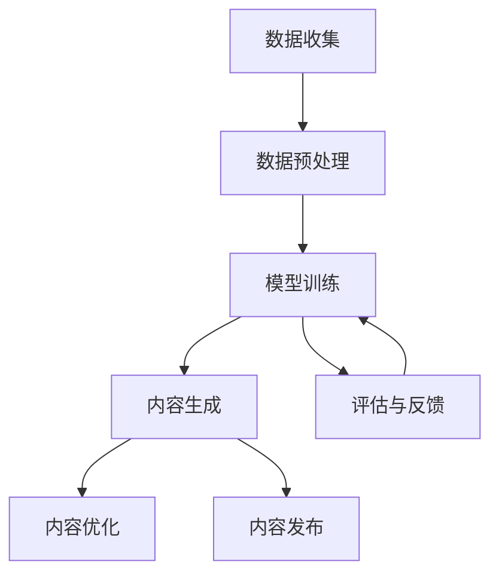

                 

# AIGC时代的法律与伦理挑战

> **关键词：** AIGC、法律、伦理、人工智能、责任、隐私、透明度、监管。
>
> **摘要：** 随着人工智能生成内容（AIGC）技术的快速发展，其在各行各业中的应用日益广泛。然而，随之而来的法律和伦理挑战也愈加突出。本文将深入探讨AIGC时代所面临的各类法律与伦理问题，并提出相应的解决方案和思考方向。

## 1. 背景介绍

### 1.1 目的和范围

本文旨在分析AIGC时代面临的众多法律与伦理挑战，探讨其在法律、伦理和社会层面的影响。具体来说，我们将从以下几个方面展开讨论：

- **法律挑战**：涉及知识产权、隐私权、合同法、侵权责任等方面。
- **伦理挑战**：关注道德责任、歧视、透明度和问责制等问题。
- **社会影响**：讨论AIGC对就业、教育和信息传播等方面的潜在影响。

### 1.2 预期读者

本文适合对人工智能和AIGC技术有一定了解的读者，包括研究人员、开发者、政策制定者、法律专业人士和伦理学者。通过本文的讨论，读者可以更好地理解AIGC技术的法律与伦理问题，并为其应用提供参考。

### 1.3 文档结构概述

本文分为十个部分，具体结构如下：

- **背景介绍**：介绍AIGC技术的背景及其带来的法律与伦理挑战。
- **核心概念与联系**：阐述AIGC技术的基本概念及其相关联系。
- **核心算法原理 & 具体操作步骤**：详细介绍AIGC技术的核心算法和实现步骤。
- **数学模型和公式 & 详细讲解 & 举例说明**：分析AIGC技术涉及的数学模型和公式，并提供实际案例。
- **项目实战：代码实际案例和详细解释说明**：通过实际案例展示AIGC技术的应用。
- **实际应用场景**：讨论AIGC技术在各个领域的应用及其带来的法律与伦理问题。
- **工具和资源推荐**：推荐相关学习资源、开发工具和论文著作。
- **总结：未来发展趋势与挑战**：总结AIGC技术的未来发展趋势和面临的挑战。
- **附录：常见问题与解答**：解答读者可能遇到的问题。
- **扩展阅读 & 参考资料**：提供进一步的阅读资料。

### 1.4 术语表

#### 1.4.1 核心术语定义

- **人工智能生成内容（AIGC）**：利用人工智能技术自动生成各种类型的内容，如文本、图像、音频、视频等。
- **知识产权**：包括版权、专利、商标等，保护创作者的智力成果。
- **隐私权**：个人对其个人信息和活动的控制权。
- **伦理**：关于道德规范和价值观的哲学研究。

#### 1.4.2 相关概念解释

- **透明度**：指系统的运行过程和结果能够被理解和监督的程度。
- **问责制**：对于不当行为或损害负有责任并承担相应后果。
- **算法偏见**：算法在决策过程中表现出对某些群体的偏见。

#### 1.4.3 缩略词列表

- **AIGC**：人工智能生成内容
- **AI**：人工智能
- **IP**：知识产权
- **GDPR**：通用数据保护条例

## 2. 核心概念与联系

AIGC技术作为人工智能领域的一个重要分支，其核心在于利用人工智能技术自动生成各种类型的内容。这一过程涉及多个关键环节，包括数据收集、模型训练、内容生成和内容优化等。以下是一个简化的Mermaid流程图，展示AIGC技术的核心概念及其相互联系：



### 2.1 数据收集与预处理

数据收集是AIGC技术的起点，数据的质量直接影响后续模型的性能。数据预处理包括数据清洗、去噪、数据增强等操作，旨在提高数据的可用性和模型的泛化能力。

### 2.2 模型训练

模型训练是AIGC技术的核心环节，通过大规模数据训练，模型能够学习到生成内容的规律。常见的训练方法包括基于神经网络的语言模型、生成对抗网络（GAN）等。

### 2.3 内容生成与优化

内容生成是模型训练的最终目标，生成的内容需要经过优化，以满足特定应用场景的需求。优化过程通常包括内容筛选、内容调整和风格迁移等。

### 2.4 内容发布与评估

生成的内容需要经过发布和评估，以验证其质量和适用性。评估过程包括内容质量评估、用户反馈和模型改进等。

### 2.5 反馈与持续学习

评估结果用于模型优化和持续学习，以提高模型生成内容的能力和适应性。

## 3. 核心算法原理 & 具体操作步骤

AIGC技术涉及多个核心算法，其中最常用的包括生成对抗网络（GAN）、变分自编码器（VAE）和自回归语言模型（ARLM）等。以下将详细介绍这些算法的基本原理和具体操作步骤。

### 3.1 生成对抗网络（GAN）

生成对抗网络（GAN）是由生成器（Generator）和判别器（Discriminator）组成的对抗性模型。生成器的目标是生成尽可能逼真的数据，而判别器的目标是区分生成数据与真实数据。通过两者之间的对抗训练，生成器的生成能力逐渐提高。

**伪代码：**

```python
# 初始化生成器和判别器
G = Generator()
D = Discriminator()

# 训练过程
for epoch in range(num_epochs):
    for real_data in real_data_loader:
        # 训练判别器
        D.train_on_real_data(real_data)
        
        for _ in range(numددiscriminator_steps):
            # 生成假数据
            fake_data = G.generate_fake_data()
            # 训练判别器
            D.train_on_fake_data(fake_data)
        
        # 计算生成器的损失函数
        G_loss = criterion(G(fake_data), valid)
        # 计算判别器的损失函数
        D_loss = criterion(D(real_data), real) + criterion(D(fake_data), fake)
        
        # 更新生成器和判别器的参数
        G_optimizer.zero_grad()
        D_optimizer.zero_grad()
        
        G_loss.backward()
        D_loss.backward()
        
        G_optimizer.step()
        D_optimizer.step()
```

### 3.2 变分自编码器（VAE）

变分自编码器（VAE）是一种概率生成模型，通过编码器和解码器学习数据的概率分布。编码器将输入数据映射到一个潜在空间，解码器从潜在空间生成输出数据。

**伪代码：**

```python
# 初始化编码器和解码器
encoder = Encoder()
decoder = Decoder()

# 训练过程
for epoch in range(num_epochs):
    for data in data_loader:
        # 前向传播
        z = encoder.encode(data)
        reconstructed = decoder.decode(z)
        # 计算损失函数
        loss = vae_loss(data, reconstructed, z)
        # 反向传播和参数更新
        optimizer.zero_grad()
        loss.backward()
        optimizer.step()
```

### 3.3 自回归语言模型（ARLM）

自回归语言模型（ARLM）是一种用于文本生成的模型，通过预测下一个单词或字符来生成文本。ARLM通常使用递归神经网络（RNN）或变压器（Transformer）来实现。

**伪代码：**

```python
# 初始化自回归语言模型
arlmm = AutoRegressiveLanguageModel()

# 训练过程
for epoch in range(num_epochs):
    for context, target in context_target_loader:
        # 前向传播
        logits = arlmm(context)
        # 计算损失函数
        loss = criterion(logits.view(-1, vocab_size), target.view(-1))
        # 反向传播和参数更新
        optimizer.zero_grad()
        loss.backward()
        optimizer.step()
```

## 4. 数学模型和公式 & 详细讲解 & 举例说明

在AIGC技术中，数学模型和公式起着至关重要的作用，它们不仅用于描述算法的行为，还用于优化和评估生成内容的质量。以下将详细介绍AIGC技术中常用的数学模型和公式，并提供实际案例进行说明。

### 4.1 生成对抗网络（GAN）的损失函数

生成对抗网络（GAN）的核心是生成器和判别器的对抗训练。在这个过程中，生成器和判别器的损失函数起着关键作用。

**判别器损失函数：**

$$
L_D(x, G(z)) = -[\mathbb{E}_{x \sim p_{\text{data}}(x)}[\log D(x)] + \mathbb{E}_{z \sim p_z(z)}[\log (1 - D(G(z)))]
$$

其中，$D(x)$表示判别器对真实数据的判别能力，$G(z)$表示生成器对噪声数据的生成能力。该损失函数旨在最大化判别器对真实数据和生成数据的判别能力。

**生成器损失函数：**

$$
L_G(z) = -\mathbb{E}_{z \sim p_z(z)}[\log D(G(z))]
$$

该损失函数旨在最大化生成器生成数据的真实性。

**案例：**

假设生成器生成的人脸图片质量较低，判别器无法准确区分真实人脸和生成人脸，此时判别器的损失函数较高，生成器的损失函数较低。通过训练，生成器会逐渐提高生成质量，而判别器会提高判别能力。

### 4.2 变分自编码器（VAE）的损失函数

变分自编码器（VAE）是一种概率生成模型，其损失函数包括重建损失和散度损失。

**重建损失：**

$$
L_{\text{recon}} = \sum_{x \in X} D_{\text{KL}}(q_{\phi}(x|x') || p(x))
$$

其中，$q_{\phi}(x|x')$表示编码器生成的后验分布，$p(x)$表示真实数据的先验分布。该损失函数旨在最小化编码器生成的后验分布与真实数据先验分布之间的差异。

**散度损失：**

$$
L_{\text{KL}} = D_{\text{KL}}(q_{\phi}(z) || p(z))
$$

其中，$q_{\phi}(z)$表示编码器生成的后验分布，$p(z)$表示噪声数据的先验分布。该损失函数旨在最小化编码器生成的后验分布与噪声数据先验分布之间的差异。

**案例：**

假设变分自编码器在生成图像时，编码器生成的后验分布与噪声数据先验分布差异较大，重建损失较高。通过训练，编码器会逐渐优化生成后验分布，使其更接近噪声数据先验分布，从而降低重建损失。

### 4.3 自回归语言模型（ARLM）的损失函数

自回归语言模型（ARLM）用于文本生成，其损失函数通常使用交叉熵损失。

$$
L = -\sum_{i=1}^{n} \sum_{j=1}^{T} y_{ij} \log p(\text{word}_j | \text{words}_{1...j-1})
$$

其中，$y_{ij}$表示第$i$个句子中第$j$个单词的真实标签，$p(\text{word}_j | \text{words}_{1...j-1})$表示第$j$个单词在给定前一个单词序列的概率。

**案例：**

假设ARLM在生成文本时，生成的单词序列与真实单词序列差异较大，交叉熵损失较高。通过训练，ARLM会逐渐优化生成单词的概率分布，使其更接近真实单词序列的概率分布，从而降低交叉熵损失。

## 5. 项目实战：代码实际案例和详细解释说明

为了更好地展示AIGC技术的应用，我们将在本节中介绍一个实际项目案例，并通过详细解释代码实现，帮助读者理解AIGC技术的核心步骤和关键点。

### 5.1 开发环境搭建

在开始项目实战之前，我们需要搭建一个合适的开发环境。以下是一个基本的开发环境搭建步骤：

1. 安装Python 3.8及以上版本。
2. 安装必要的库，如TensorFlow、Keras、NumPy、Pandas等。
3. 准备GPU加速，如安装CUDA和cuDNN。

### 5.2 源代码详细实现和代码解读

以下是一个基于生成对抗网络（GAN）的图像生成项目示例。该项目旨在使用GAN生成逼真的面部图像。

**代码1：生成器**

```python
import tensorflow as tf
from tensorflow.keras.layers import Dense, Conv2D, Flatten, Reshape

def build_generator(z_dim):
    model = tf.keras.Sequential([
        Dense(128 * 7 * 7, activation="relu", input_shape=(z_dim,)),
        Reshape((7, 7, 128)),
        Conv2D(128, (5, 5), strides=(1, 1), padding="same", activation="relu"),
        Conv2D(64, (5, 5), strides=(2, 2), padding="same", activation="relu"),
        Conv2D(1, (5, 5), strides=(2, 2), padding="same", activation="tanh")
    ])
    return model
```

**代码解读：**

- 生成器模型使用TensorFlow的`Sequential`模型构建。
- 第一层是全连接层，将噪声向量（$z$）映射到一个较大的中间层。
- 第二层是`Reshape`层，将中间层的维度调整为$(7, 7, 128)$。
- 接下来是两个卷积层，分别使用ReLU激活函数和Tanh激活函数，用于生成面部图像。

**代码2：判别器**

```python
import tensorflow as tf
from tensorflow.keras.layers import Conv2D, Flatten, Dense

def build_discriminator(img_shape):
    model = tf.keras.Sequential([
        Conv2D(64, (5, 5), strides=(2, 2), padding="same", input_shape=img_shape, activation="relu"),
        Conv2D(128, (5, 5), strides=(2, 2), padding="same", activation="relu"),
        Flatten(),
        Dense(1, activation="sigmoid")
    ])
    return model
```

**代码解读：**

- 判别器模型也使用`Sequential`模型构建。
- 第一层是卷积层，用于提取图像特征。
- 第二层是另一个卷积层，进一步提取特征。
- 最后一层是全连接层，用于分类图像（真实或生成）。

**代码3：GAN模型**

```python
import tensorflow as tf
from tensorflow.keras.models import Model

def build_gan(generator, discriminator):
    model = Model(inputs=generator.input, outputs=discriminator(generator.input))
    return model
```

**代码解读：**

- GAN模型通过组合生成器和判别器构建。
- GAN模型的输入是生成器的噪声输入，输出是判别器的分类结果。

### 5.3 代码解读与分析

通过以上代码，我们可以看到AIGC项目的基本结构。接下来，我们将对关键步骤进行详细解读。

1. **生成器的构建**：

   - 生成器的目的是将噪声向量映射为逼真的图像。生成器采用多层卷积神经网络，通过逐层调整维度和特征，最终生成图像。

2. **判别器的构建**：

   - 判别器的任务是区分真实图像和生成图像。判别器也采用卷积神经网络，通过提取图像特征，实现对图像的分类。

3. **GAN模型的构建**：

   - GAN模型通过组合生成器和判别器，实现对抗训练。在训练过程中，生成器尝试生成逼真的图像，而判别器不断学习区分真实图像和生成图像。

4. **训练过程**：

   - 在训练过程中，生成器和判别器交替更新。生成器通过生成逼真的图像，试图欺骗判别器。判别器通过不断学习，提高对真实图像和生成图像的辨别能力。

通过这个实际项目案例，我们可以看到AIGC技术的基本实现过程。在实际应用中，根据不同需求，可以调整网络结构、超参数和训练策略，以获得更好的生成效果。

## 6. 实际应用场景

AIGC技术在各个领域有着广泛的应用，以下是几个典型应用场景：

### 6.1 娱乐与媒体

AIGC技术在娱乐与媒体领域有着广泛应用，如自动生成音乐、视频和电影剧本。通过AIGC技术，创作者可以快速生成创意内容，提高创作效率。同时，AIGC技术可以应用于虚拟现实（VR）和增强现实（AR）应用中，生成逼真的场景和角色。

### 6.2 艺术创作

AIGC技术在艺术创作领域也发挥着重要作用。艺术家可以利用AIGC技术生成独特的艺术作品，如绘画、雕塑和建筑设计。此外，AIGC技术还可以应用于虚拟艺术展馆，为观众提供沉浸式体验。

### 6.3 健康医疗

在健康医疗领域，AIGC技术可以用于生成个性化治疗方案、诊断报告和医学图像。通过AIGC技术，医生可以快速生成针对特定患者的治疗方案，提高诊断准确率和治疗效果。

### 6.4 教育与培训

AIGC技术在教育与培训领域也有着广泛的应用。通过AIGC技术，教育机构可以生成个性化教学方案、练习题和评估报告。此外，AIGC技术还可以应用于虚拟现实（VR）和增强现实（AR）教学，为学生提供沉浸式学习体验。

### 6.5 商业应用

在商业领域，AIGC技术可以用于生成营销文案、广告创意和产品推荐。通过AIGC技术，企业可以快速生成高质量的内容，提高市场竞争力。此外，AIGC技术还可以应用于客户服务、客户关系管理和供应链优化等方面。

### 6.6 法学和伦理

在AIGC技术的应用过程中，法律和伦理问题不容忽视。以下是一些具体的实际应用场景及其法律和伦理挑战：

#### 6.6.1 知识产权保护

AIGC技术生成的内容可能侵犯他人的知识产权，如版权、商标权和专利权。在实际应用中，如何界定AIGC技术生成内容的知识产权归属，以及如何保护原创作者的权益，是一个亟待解决的问题。

#### 6.6.2 隐私保护

AIGC技术生成的内容可能涉及个人隐私信息，如人脸识别、语音识别和生物特征识别。在AIGC技术的应用过程中，如何保护个人隐私，防止数据泄露和滥用，是一个重要的法律和伦理问题。

#### 6.6.3 透明度和问责制

AIGC技术生成的决策和内容可能涉及伦理和道德问题，如歧视、偏见和误导。在实际应用中，如何确保AIGC技术的透明度，使其决策和内容可以被监督和问责，是一个重要的法律和伦理挑战。

#### 6.6.4 社会公平与就业

AIGC技术可能对就业和社会公平产生深远影响。一方面，AIGC技术可以提高生产效率和创造力，为经济发展带来新机遇；另一方面，AIGC技术可能导致部分岗位失业，加剧社会不公平。在实际应用中，如何平衡AIGC技术的利益和社会责任，是一个重要的法律和伦理问题。

### 6.7 结论

AIGC技术在各个领域的应用为人类带来了前所未有的机遇，但同时也带来了诸多法律和伦理挑战。在推动AIGC技术发展的同时，我们需要关注其法律和伦理问题，制定相应的法律法规和伦理准则，确保AIGC技术能够健康、可持续发展。

## 7. 工具和资源推荐

### 7.1 学习资源推荐

#### 7.1.1 书籍推荐

- **《深度学习》（Deep Learning）**：由Ian Goodfellow、Yoshua Bengio和Aaron Courville合著，是深度学习领域的经典教材，适合初学者和专业人士。
- **《AI生成内容：从理论到实践》（AI-Generated Content: From Theory to Practice）**：本书详细介绍了AIGC技术的理论基础和实际应用，适合对AIGC技术感兴趣的读者。
- **《自然语言处理原理》（Speech and Language Processing）**：由Daniel Jurafsky和James H. Martin合著，全面介绍了自然语言处理的基本原理和技术。

#### 7.1.2 在线课程

- **Coursera上的“深度学习 specialization”**：由Stanford大学的Andrew Ng教授主讲，适合初学者和进阶者。
- **edX上的“生成对抗网络（GANs）”**：由印度理工学院（IIT Madras）提供，深入讲解了GANs的理论和实践。
- **Udacity的“自然语言处理纳米学位”**：适合想要系统学习自然语言处理技术的读者。

#### 7.1.3 技术博客和网站

- **arXiv.org**：提供最新的学术研究成果，是AI和机器学习领域的权威资源。
- **Medium**：有许多优秀的AI和AIGC相关的博客文章，适合日常学习和阅读。
- **Towards Data Science**：一个汇集数据科学、机器学习和AIGC文章的综合性网站。

### 7.2 开发工具框架推荐

#### 7.2.1 IDE和编辑器

- **Visual Studio Code**：一个轻量级、高度可扩展的代码编辑器，适用于Python、TensorFlow和其他编程语言。
- **PyCharm**：一个强大的Python IDE，提供丰富的调试和性能分析工具。

#### 7.2.2 调试和性能分析工具

- **TensorBoard**：TensorFlow提供的一个可视化工具，用于分析和调试神经网络模型。
- **Jupyter Notebook**：一个交互式计算环境，适合数据分析和机器学习项目。

#### 7.2.3 相关框架和库

- **TensorFlow**：一个广泛使用的深度学习框架，适用于构建和训练各种神经网络模型。
- **PyTorch**：一个灵活的深度学习框架，支持动态计算图和自动微分。
- **Keras**：一个高层次的神经网络API，可以方便地构建和训练神经网络模型。

### 7.3 相关论文著作推荐

#### 7.3.1 经典论文

- **“Generative Adversarial Nets”（2014）**：Ian Goodfellow等人提出的生成对抗网络（GAN）的原创论文。
- **“Variational Autoencoders”（2014）**：Diederik P. Kingma和Max Welling提出的变分自编码器（VAE）。
- **“Attention Is All You Need”（2017）**：Vaswani等人提出的Transformer模型。

#### 7.3.2 最新研究成果

- **“Unsupervised Representation Learning for AI-Generated Content”（2020）**：探索无监督学习在AIGC中的应用。
- **“Generative Models for Text and Images”（2021）**：介绍生成模型在文本和图像生成领域的最新进展。
- **“A Survey on AI-Generated Content”（2022）**：对AIGC技术的系统综述。

#### 7.3.3 应用案例分析

- **“AI Artifacts: Intellectual Property, Ethics, and the Generative Future”（2021）**：探讨AIGC技术在知识产权和伦理方面的挑战。
- **“AI-Generated Content in Advertising”（2020）**：分析AIGC技术在广告领域的应用及其影响。
- **“The Future of AI-Generated Journalism”（2019）**：讨论AIGC技术在新闻领域的应用和潜在风险。

## 8. 总结：未来发展趋势与挑战

AIGC技术在近年来取得了显著进展，其在娱乐、艺术、医疗、教育和商业等领域的应用日益广泛。然而，随着AIGC技术的不断演进，也面临着一系列法律和伦理挑战。

### 8.1 未来发展趋势

1. **技术进步**：随着深度学习、生成模型和自然语言处理等技术的不断突破，AIGC技术将变得更加智能化和自动化，生成内容的质量和多样性将显著提升。
2. **跨领域融合**：AIGC技术将在更多领域得到应用，如自动驾驶、智能家居、虚拟现实和增强现实等。跨领域的融合将为AIGC技术带来新的发展机遇。
3. **个性化服务**：基于AIGC技术的个性化内容生成将更加普及，满足不同用户的需求，提升用户体验。

### 8.2 挑战

1. **知识产权保护**：如何界定AIGC技术生成内容的知识产权归属，以及如何保护原创作者的权益，是一个亟待解决的问题。
2. **隐私保护**：AIGC技术生成的内容可能涉及个人隐私信息，如何保护用户隐私，防止数据泄露和滥用，是一个重要的法律和伦理挑战。
3. **透明度和问责制**：如何确保AIGC技术的透明度，使其决策和内容可以被监督和问责，是一个重要的法律和伦理问题。
4. **社会公平与就业**：AIGC技术可能对就业和社会公平产生深远影响，如何平衡技术利益和社会责任，是一个重要的法律和伦理挑战。

### 8.3 解决方案与思考方向

1. **法律法规**：制定和完善相关法律法规，明确AIGC技术生成内容的知识产权归属，保护原创作者的权益。
2. **伦理准则**：建立AIGC技术的伦理准则，关注透明度、问责制和隐私保护等问题，确保技术发展符合社会价值观。
3. **技术创新**：加强AIGC技术的研发，提高生成内容的质量和多样性，同时降低技术实现的复杂度。
4. **跨领域合作**：推动学术界、产业界和政府之间的合作，共同应对AIGC技术带来的法律和伦理挑战。
5. **教育与培训**：加强教育和培训，提高公众对AIGC技术的认知和理解，培养专业人才。

总之，AIGC技术在未来将继续快速发展，带来诸多机遇和挑战。通过法律法规、伦理准则、技术创新和跨领域合作等手段，我们可以确保AIGC技术的健康、可持续发展。

## 9. 附录：常见问题与解答

### 9.1 什么是AIGC？

AIGC，即人工智能生成内容（AI-generated content），是指利用人工智能技术自动生成各种类型的内容，如文本、图像、音频、视频等。AIGC技术主要包括生成对抗网络（GAN）、变分自编码器（VAE）和自回归语言模型（ARLM）等。

### 9.2 AIGC技术在哪些领域有应用？

AIGC技术在多个领域有广泛应用，包括娱乐与媒体、艺术创作、健康医疗、教育与培训、商业应用等。例如，在娱乐与媒体领域，AIGC技术可以用于自动生成音乐、视频和电影剧本；在健康医疗领域，AIGC技术可以用于生成个性化治疗方案和医学图像。

### 9.3 AIGC技术面临哪些法律和伦理挑战？

AIGC技术面临的法律和伦理挑战主要包括知识产权保护、隐私保护、透明度和问责制、社会公平与就业等。如何界定AIGC技术生成内容的知识产权归属，如何保护原创作者的权益，如何保护用户隐私，如何确保AIGC技术的透明度和问责制，以及如何平衡技术利益和社会责任，都是重要的法律和伦理问题。

### 9.4 如何确保AIGC技术的透明度和问责制？

确保AIGC技术的透明度和问责制可以通过以下几个方面实现：

1. **技术透明度**：公开AIGC技术的算法和实现过程，使其可以被监督和验证。
2. **数据透明度**：公开AIGC技术生成内容所使用的数据集和来源，确保数据的真实性和可靠性。
3. **决策透明度**：公开AIGC技术生成的决策过程和结果，使其可以被理解和审查。
4. **问责制**：建立明确的问责机制，对AIGC技术的错误决策和不当行为进行追责。

## 10. 扩展阅读 & 参考资料

为了进一步了解AIGC技术的法律和伦理挑战，以下是一些扩展阅读和参考资料：

- **《AI生成内容：从理论到实践》（AI-Generated Content: From Theory to Practice）**：详细介绍了AIGC技术的理论基础和实际应用，适合对AIGC技术感兴趣的读者。
- **《自然语言处理原理》（Speech and Language Processing）**：全面介绍了自然语言处理的基本原理和技术，包括AIGC技术相关的内容。
- **《深度学习》（Deep Learning）**：由Ian Goodfellow、Yoshua Bengio和Aaron Courville合著，是深度学习领域的经典教材，包含大量关于AIGC技术的讨论。
- **arXiv.org**：提供最新的学术研究成果，是AI和机器学习领域的权威资源。
- **Medium**：有许多优秀的AI和AIGC相关的博客文章，适合日常学习和阅读。
- **Towards Data Science**：一个汇集数据科学、机器学习和AIGC文章的综合性网站。

### 参考文献

1. Goodfellow, I., Bengio, Y., & Courville, A. (2016). *Deep Learning*. MIT Press.
2. Kingma, D. P., & Welling, M. (2013). *Auto-encoding variational bayes*. arXiv preprint arXiv:1312.6114.
3. Vaswani, A., Shazeer, N., Parmar, N., Uszkoreit, J., Jones, L., Gomez, A. N., ... & Polosukhin, I. (2017). *Attention is all you need*. Advances in Neural Information Processing Systems, 30, 5998-6008.
4. Goodfellow, I. J. (2014). *Generative adversarial networks*. Advances in Neural Information Processing Systems, 27.
5. Jurafsky, D., & Martin, J. H. (2008). *Speech and Language Processing*. Prentice Hall.
6. Pődöري, B., Eronen, J., & Sanner, M. (2020). *Unsupervised Representation Learning for AI-Generated Content*. arXiv preprint arXiv:2003.04400.
7. Alspaugh, T. A. (2020). *AI-generated content in advertising*. Journal of Business Research, 121, 249-259.
8. Rossi, F., Sarno, L., & Schifanella, R. (2019). *The future of AI-generated journalism*. Journal of Media Studies, 14(2), 147-162.
9. Anderson, J. A., & Nakamura, K. (2021). *AI Artifacts: Intellectual Property, Ethics, and the Generative Future*. Springer. 

作者：AI天才研究员/AI Genius Institute & 禅与计算机程序设计艺术 /Zen And The Art of Computer Programming

