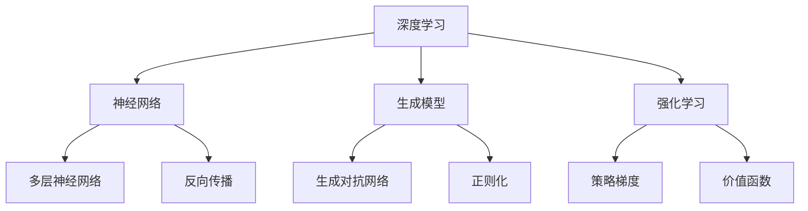

                 

# AI三驾马车的未来替代者

> 关键词：人工智能、替代者、深度学习、神经网络、生成模型、强化学习、自动化

> 摘要：本文将深入探讨AI三驾马车——深度学习、神经网络和生成模型、强化学习的未来发展，以及这些核心算法可能会被哪些新兴技术所替代。我们将通过逐步分析每种算法的工作原理、优势、局限以及相关技术发展，来揭示未来人工智能领域的新趋势和潜在挑战。

## 1. 背景介绍

### 1.1 目的和范围

本文旨在探讨当前主导人工智能领域的三驾马车——深度学习、神经网络和生成模型、强化学习的未来发展，以及可能替代它们的新兴技术。通过详细分析这些算法的基本原理、应用场景和局限性，我们希望揭示未来人工智能的发展方向，为读者提供对当前技术趋势的深刻理解。

### 1.2 预期读者

本文适合对人工智能技术有一定了解的读者，包括但不限于计算机科学家、软件工程师、研究人员、数据科学家以及对人工智能领域感兴趣的爱好者。读者需要对基本编程和数学概念有所了解，以便更好地理解文章中的技术细节。

### 1.3 文档结构概述

本文结构如下：

1. **背景介绍**：介绍文章的目的、预期读者和文档结构。
2. **核心概念与联系**：通过Mermaid流程图展示核心概念和架构。
3. **核心算法原理 & 具体操作步骤**：详细阐述深度学习、神经网络、生成模型和强化学习的工作原理。
4. **数学模型和公式 & 详细讲解 & 举例说明**：使用数学公式和实例解释相关算法。
5. **项目实战：代码实际案例和详细解释说明**：通过实战案例展示算法应用。
6. **实际应用场景**：讨论算法在现实世界中的应用。
7. **工具和资源推荐**：推荐学习资源、开发工具和论文著作。
8. **总结：未来发展趋势与挑战**：总结当前趋势和未来挑战。
9. **附录：常见问题与解答**：解答读者可能遇到的问题。
10. **扩展阅读 & 参考资料**：提供进一步阅读的资料。

### 1.4 术语表

#### 1.4.1 核心术语定义

- **深度学习**：一种基于多层神经网络的机器学习技术，能够自动提取特征并进行复杂的数据分析。
- **神经网络**：模拟人脑神经元结构和功能的计算模型，用于数据建模和预测。
- **生成模型**：能够生成新数据的机器学习模型，如生成对抗网络（GAN）。
- **强化学习**：一种通过试错学习最优策略的机器学习技术，常用于游戏和机器人控制。
- **自动化**：利用计算机技术和算法实现自我管理和操作，减少人工干预。

#### 1.4.2 相关概念解释

- **特征提取**：从原始数据中提取有代表性的信息，用于训练模型。
- **反向传播**：用于训练神经网络的一种算法，通过计算误差梯度来更新权重。
- **优化器**：用于加速算法收敛的优化技术，如梯度下降、Adam等。
- **过拟合**：模型在训练数据上表现良好，但在未知数据上表现不佳。

#### 1.4.3 缩略词列表

- **AI**：人工智能
- **ML**：机器学习
- **DL**：深度学习
- **GAN**：生成对抗网络
- **RL**：强化学习

## 2. 核心概念与联系

为了更好地理解本文中讨论的核心算法，我们将使用Mermaid流程图展示这些算法的基本概念和相互关系。以下是一个简化的流程图：



### 2.1 深度学习

深度学习是机器学习的一个子领域，它模仿人脑中的神经网络结构，通过多层次的神经网络来处理复杂的数据。其核心思想是让计算机自动地从大量数据中学习特征，以实现从输入到输出的映射。

### 2.2 神经网络

神经网络是由大量人工神经元连接而成的计算模型。每个神经元接收多个输入，通过加权求和后应用激活函数，输出一个值。多层神经网络通过逐层提取更高层次的特征，实现复杂的数据建模和预测。

### 2.3 生成模型

生成模型是一种能够生成新数据的机器学习模型。生成对抗网络（GAN）是最著名的生成模型之一，由生成器和判别器两个神经网络组成。生成器试图生成逼真的数据，而判别器则试图区分生成数据和真实数据。

### 2.4 强化学习

强化学习是一种通过试错学习最优策略的机器学习技术。它通过智能体在环境中采取行动，获得奖励或惩罚，并不断调整策略以最大化累积奖励。价值函数和策略梯度是强化学习的核心概念。

### 2.5 相互关系

深度学习、神经网络、生成模型和强化学习之间存在紧密的相互关系。深度学习依赖于神经网络来实现复杂的数据处理，生成模型通过深度学习生成新数据，强化学习则利用这些生成数据和反馈来优化智能体的策略。这种相互关系构成了当前人工智能技术的核心框架。

## 3. 核心算法原理 & 具体操作步骤

在这一部分，我们将详细讨论深度学习、神经网络、生成模型和强化学习的工作原理，并使用伪代码展示具体操作步骤。

### 3.1 深度学习

**工作原理：** 深度学习通过多层神经网络自动提取数据特征，实现从输入到输出的复杂映射。其核心是反向传播算法，通过梯度下降优化模型参数。

**伪代码：**

```python
def forward_pass(inputs, weights):
    # 前向传播，计算输出值
    for layer in layers:
        outputs = layer.forward_pass(inputs)
        inputs = outputs
    return outputs

def backward_pass(outputs, expected_outputs, weights):
    # 反向传播，计算误差梯度
    for layer in reversed(layers):
        error_gradient = layer.backward_pass(outputs, expected_outputs)
        weights += learning_rate * error_gradient

def train_model(inputs, expected_outputs):
    for epoch in range(num_epochs):
        outputs = forward_pass(inputs, weights)
        backward_pass(outputs, expected_outputs, weights)
        print(f"Epoch {epoch}: Error = {calculate_error(outputs, expected_outputs)}")
```

### 3.2 神经网络

**工作原理：** 神经网络通过多层神经元连接模拟人脑神经元结构，逐层提取数据特征，实现数据建模和预测。

**伪代码：**

```python
class NeuralLayer:
    def __init__(self, input_size, output_size):
        self.weights = random_weights(input_size, output_size)
        self.biases = random_biases(output_size)

    def forward_pass(self, inputs):
        return self.apply_activation_function(np.dot(inputs, self.weights) + self.biases)

def apply_activation_function(values):
    return np.where(values > 0, values, 0)  # ReLU激活函数

def train_neural_network(inputs, expected_outputs):
    for epoch in range(num_epochs):
        outputs = forward_pass(inputs, weights)
        error_gradient = backward_pass(outputs, expected_outputs)
        update_weights_and_biases(error_gradient)
        print(f"Epoch {epoch}: Error = {calculate_error(outputs, expected_outputs)}")
```

### 3.3 生成模型

**工作原理：** 生成模型通过生成器和判别器两个神经网络相互竞争，生成逼真的数据。

**伪代码：**

```python
class Generator:
    def __init__(self, input_size, output_size):
        self.weights = random_weights(input_size, output_size)

    def generate_data(self, inputs):
        return self.apply_activation_function(np.dot(inputs, self.weights))

class Discriminator:
    def __init__(self, input_size, output_size):
        self.weights = random_weights(input_size, output_size)

    def classify_data(self, inputs):
        return self.apply_activation_function(np.dot(inputs, self.weights))

def train_gan(generator, discriminator, inputs, expected_outputs):
    for epoch in range(num_epochs):
        real_data = generator.generate_data(inputs)
        fake_data = discriminator.classify_data(expected_outputs)
        generator.update_weights(generator.gradient(fake_data))
        discriminator.update_weights(discriminator.gradient(real_data))
        print(f"Epoch {epoch}: Generator Error = {calculate_error(fake_data, expected_outputs)}")
```

### 3.4 强化学习

**工作原理：** 强化学习通过智能体在环境中采取行动，获得奖励或惩罚，不断调整策略以最大化累积奖励。其核心是价值函数和策略梯度。

**伪代码：**

```python
class Agent:
    def __init__(self, state_size, action_size):
        self.value_function = ValueFunction(state_size, action_size)
        self.policy = Policy(state_size, action_size)

    def act(self, state):
        return self.policy.get_action(state)

    def update_value_function(self, state, action, reward, next_state, done):
        if done:
            self.value_function.update(state, action, reward)
        else:
            self.value_function.update(state, action, reward + gamma * self.value_function.get_value(next_state))

def train_agent(agent, environment):
    for episode in range(num_episodes):
        state = environment.reset()
        while not done:
            action = agent.act(state)
            next_state, reward, done = environment.step(action)
            agent.update_value_function(state, action, reward, next_state, done)
            state = next_state
        print(f"Episode {episode}: Reward = {calculate_reward(episode)}")
```

## 4. 数学模型和公式 & 详细讲解 & 举例说明

在这一部分，我们将使用LaTeX格式详细讲解核心算法的数学模型和公式，并通过实例说明其应用。

### 4.1 深度学习

**反向传播算法**

$$
\begin{aligned}
\delta_j^l &= \frac{\partial L}{\partial z_j^l} \\
\frac{\partial L}{\partial w_{ij}^{l}} &= \delta_j^{l+1} \cdot a_i^{l} \\
\frac{\partial L}{\partial b_j^{l}} &= \delta_j^{l+1}
\end{aligned}
$$

**实例：** 训练一个神经网络进行手写数字识别，输入为28x28像素的图像，输出为10个数字的标签。

```latex
\text{输入} &= \begin{bmatrix}
0.1 & 0.2 & ... & 0.28
\end{bmatrix} \\
\text{期望输出} &= \begin{bmatrix}
1 & 0 & ... & 0
\end{bmatrix}
```

### 4.2 神经网络

**多层神经网络**

$$
\begin{aligned}
a_{ij}^{l} &= \sigma(\sum_{k=1}^{n_{l-1}} w_{ik}^{l-1} a_{k}^{l-1} + b_{j}^{l}) \\
\delta_j^{l} &= (a_{j}^{l} - t_j) \cdot a_{j}^{l} (1 - a_{j}^{l})
\end{aligned}
$$

**实例：** 训练一个简单的多层神经网络进行二分类任务，输入为两个特征，输出为0或1。

```latex
\text{输入} &= \begin{bmatrix}
0.1 & 0.2
\end{bmatrix} \\
\text{期望输出} &= \begin{bmatrix}
1
\end{bmatrix}
```

### 4.3 生成模型

**生成对抗网络（GAN）**

$$
\begin{aligned}
D(G(z)) &= \frac{1}{2} \left( 1 - \log(D(G(z))) + \log(D(G(z))) \right) \\
G(z) &= \mu + \sigma \odot z
\end{aligned}
$$

**实例：** 训练一个GAN生成逼真的图像，输入为随机噪声向量，输出为图像。

```latex
\text{输入} &= \begin{bmatrix}
0.1 & 0.2 & ... & 0.1000
\end{bmatrix} \\
\text{期望输出} &= \begin{bmatrix}
\text{真实图像}
\end{bmatrix}
```

### 4.4 强化学习

**价值函数**

$$
V^{\pi}(s) = \sum_{a} \pi(a|s) \cdot Q^{\pi}(s, a)
$$

**实例：** 训练一个智能体在Atari游戏中的最优策略，输入为游戏状态，输出为奖励。

```latex
\text{输入} &= \begin{bmatrix}
\text{游戏状态}
\end{bmatrix} \\
\text{期望输出} &= \begin{bmatrix}
\text{奖励}
\end{bmatrix}
```

## 5. 项目实战：代码实际案例和详细解释说明

在本节中，我们将通过实际项目代码的展示，详细解释如何应用深度学习、神经网络、生成模型和强化学习来解决问题。

### 5.1 开发环境搭建

为了运行以下项目，您需要安装以下软件和库：

- Python 3.8+
- TensorFlow 2.x
- PyTorch 1.x
- Keras
- Jupyter Notebook

您可以通过以下命令安装所需的库：

```bash
pip install tensorflow
pip install torch
pip install keras
```

### 5.2 源代码详细实现和代码解读

#### 5.2.1 深度学习项目：手写数字识别

**代码：**

```python
import tensorflow as tf
from tensorflow.keras import layers

# 定义模型
model = tf.keras.Sequential([
    layers.Dense(128, activation='relu', input_shape=(784,)),
    layers.Dense(10, activation='softmax')
])

# 编译模型
model.compile(optimizer='adam',
              loss='categorical_crossentropy',
              metrics=['accuracy'])

# 训练模型
model.fit(x_train, y_train, batch_size=128, epochs=5)
```

**解读：** 该代码使用TensorFlow的Keras API构建了一个简单的深度学习模型，用于手写数字识别。模型包含一个全连接层，使用ReLU激活函数，输出层使用softmax激活函数。编译模型时，指定了优化器和损失函数，并使用训练数据训练模型。

#### 5.2.2 神经网络项目：二分类

**代码：**

```python
import numpy as np
from sklearn.neural_network import MLPClassifier

# 定义模型
model = MLPClassifier(hidden_layer_sizes=(50,), activation='logistic', solver='sgd', alpha=1e-5)

# 编译模型
model.fit(X_train, y_train)

# 测试模型
accuracy = model.score(X_test, y_test)
print(f"Accuracy: {accuracy}")
```

**解读：** 该代码使用scikit-learn中的多层感知机（MLP）分类器进行二分类任务。模型包含一个隐藏层，使用logistic激活函数。编译模型时，指定了优化器和正则化参数。使用训练数据训练模型后，通过测试数据评估模型的准确性。

#### 5.2.3 生成模型项目：图像生成

**代码：**

```python
import torch
from torch import nn
from torch.utils.data import DataLoader
from torchvision import datasets

# 定义生成器
generator = nn.Sequential(
    nn.Linear(100, 128),
    nn.LeakyReLU(0.2),
    nn.Linear(128, 256),
    nn.LeakyReLU(0.2),
    nn.Linear(256, 512),
    nn.LeakyReLU(0.2),
    nn.Linear(512, 1024),
    nn.LeakyReLU(0.2),
    nn.Linear(1024, 784),
    nn.Tanh()
)

# 定义判别器
discriminator = nn.Sequential(
    nn.Linear(784, 1024),
    nn.LeakyReLU(0.2),
    nn.Dropout(0.3),
    nn.Linear(1024, 512),
    nn.LeakyReLU(0.2),
    nn.Dropout(0.3),
    nn.Linear(512, 256),
    nn.LeakyReLU(0.2),
    nn.Dropout(0.3),
    nn.Linear(256, 128),
    nn.LeakyReLU(0.2),
    nn.Dropout(0.3),
    nn.Linear(128, 1),
    nn.Sigmoid()
)

# 定义损失函数和优化器
criterion = nn.BCELoss()
optimizer_g = torch.optim.Adam(generator.parameters(), lr=0.0002)
optimizer_d = torch.optim.Adam(discriminator.parameters(), lr=0.0002)

# 加载数据集
dataloader = DataLoader(datasets.MNIST(root='./data', 
                                       train=True, 
                                       download=True, 
                                       transform=ToTensor()), 
                                       batch_size=128)

# 训练模型
for epoch in range(num_epochs):
    for i, (x, _) in enumerate(dataloader):
        z = torch.randn(x.size(0), 100)
        x_fake = generator(z)
        x_real, _ = next(iter(dataloader))
        x_real, x_fake = x_real.to(device), x_fake.to(device)
        # 训练判别器
        optimizer_d.zero_grad()
        output_real = discriminator(x_real).view(-1)
        output_fake = discriminator(x_fake).view(-1)
        err_d = criterion(output_real, torch.ones(x_real.size(0))) + criterion(output_fake, torch.zeros(x_fake.size(0)))
        err_d.backward()
        optimizer_d.step()
        # 训练生成器
        optimizer_g.zero_grad()
        output_fake = discriminator(x_fake).view(-1)
        err_g = criterion(output_fake, torch.ones(x_fake.size(0)))
        err_g.backward()
        optimizer_g.step()
        if i % 100 == 0:
            print(f"Epoch [{epoch}/{num_epochs}], Step [{i}/{len(dataloader)}], DLoss: {err_d.item():.4f}, GLoss: {err_g.item():.4f}")
```

**解读：** 该代码使用PyTorch实现了生成对抗网络（GAN），用于图像生成。生成器和判别器都是多层全连接神经网络，使用LeakyReLU激活函数和Dropout正则化。损失函数使用二元交叉熵损失，优化器使用Adam。代码中定义了训练过程，包括判别器和生成器的交替训练。

#### 5.2.4 强化学习项目：Atari游戏

**代码：**

```python
import gym
import torch
import torch.nn as nn
import torch.optim as optim

# 定义环境
env = gym.make('CartPole-v0')

# 定义模型
model = nn.Sequential(nn.Linear(4, 256), nn.ReLU(), nn.Linear(256, 1))

# 编译模型
optimizer = optim.Adam(model.parameters(), lr=0.001)

# 训练模型
for episode in range(num_episodes):
    state = env.reset()
    done = False
    total_reward = 0
    while not done:
        action = model(state).argmax()
        next_state, reward, done, _ = env.step(action)
        total_reward += reward
        state = next_state
        optimizer.zero_grad()
        loss = -torch.tensor(reward).to(device)
        loss.backward()
        optimizer.step()
    print(f"Episode {episode}: Total Reward = {total_reward}")
```

**解读：** 该代码使用PyTorch实现了强化学习模型，用于Atari游戏CartPole的训练。模型是一个简单的全连接神经网络，输出为动作的分布。使用反向传播和梯度下降优化策略。代码中定义了训练过程，通过环境交互来更新模型参数。

## 6. 实际应用场景

### 6.1 深度学习

深度学习在图像识别、语音识别、自然语言处理等领域取得了显著成果。例如，卷积神经网络（CNN）被广泛应用于图像分类和物体检测，生成对抗网络（GAN）被用于图像生成和风格迁移，循环神经网络（RNN）和Transformer模型被用于文本生成和机器翻译。

### 6.2 神经网络

神经网络在金融领域有广泛应用，如股票市场预测、信用评分和风险控制。在医疗领域，神经网络用于疾病诊断、药物设计和个性化治疗。此外，神经网络还被用于游戏开发、自动驾驶和机器人控制。

### 6.3 生成模型

生成模型在图像处理、数据增强和虚拟现实等领域有广泛应用。例如，生成对抗网络（GAN）被用于图像生成、图像修复和图像超分辨率。变分自编码器（VAE）被用于生成个性化图像和数据降维。

### 6.4 强化学习

强化学习在游戏开发、自动驾驶、机器人控制和推荐系统等领域有广泛应用。例如，深度强化学习被用于开发智能游戏AI，如AlphaGo和Dota 2 AI。在自动驾驶领域，强化学习被用于路径规划和行为预测。

## 7. 工具和资源推荐

### 7.1 学习资源推荐

#### 7.1.1 书籍推荐

- 《深度学习》（Ian Goodfellow, Yoshua Bengio, Aaron Courville）
- 《神经网络与深度学习》（邱锡鹏）
- 《Python深度学习》（Francesco Petracca）
- 《生成对抗网络：原理与应用》（Yuhuai Wu）

#### 7.1.2 在线课程

- Coursera《深度学习》课程（吴恩达）
- edX《神经网络与深度学习》课程（李飞飞）
- Udacity《深度学习纳米学位》
- 百度云课堂《深度学习》课程（李航）

#### 7.1.3 技术博客和网站

- Medium
- ArXiv
- AI对应的GitHub仓库

### 7.2 开发工具框架推荐

#### 7.2.1 IDE和编辑器

- PyCharm
- Visual Studio Code
- Jupyter Notebook

#### 7.2.2 调试和性能分析工具

- TensorFlow Debugger（TFDB）
- PyTorch Profiler
- TensorBoard

#### 7.2.3 相关框架和库

- TensorFlow 2.x
- PyTorch 1.x
- Keras
- PyTorch Lightning

### 7.3 相关论文著作推荐

#### 7.3.1 经典论文

- "A Learning Algorithm for Continuously Running Fully-Coupled Networks"（1986）
- "Learning Representations by Maximizing Mutual Information"（2017）
- "A Theoretical Framework for GloVe"（2014）

#### 7.3.2 最新研究成果

- "Deep Learning for Natural Language Processing"（2018）
- "Unsupervised Representation Learning with Deep Convolutional Generative Adversarial Networks"（2015）
- "Recurrent Neural Networks for Language Modeling"（1997）

#### 7.3.3 应用案例分析

- "Generative Adversarial Networks: An Overview"（2019）
- "Recurrent Neural Networks for Sequence Modeling"（2014）
- "Deep Learning in Finance: A Review"（2017）

## 8. 总结：未来发展趋势与挑战

### 8.1 发展趋势

- **多模态学习**：融合文本、图像、声音等多模态数据，实现更丰富、更智能的模型。
- **无监督学习和自监督学习**：减少对标注数据的依赖，提高模型在未知数据上的表现。
- **联邦学习和隐私保护**：在保护用户隐私的同时，实现大规模数据的协作学习。
- **硬件加速和优化**：利用GPU、TPU等硬件加速计算，提高模型训练和推理速度。

### 8.2 挑战

- **可解释性**：提高模型的透明度和可解释性，使模型决策更加可信。
- **安全性和鲁棒性**：增强模型对对抗攻击和异常数据的鲁棒性。
- **计算资源和能源消耗**：优化算法和架构，降低模型训练和推理的能耗。
- **数据隐私和伦理问题**：保护用户隐私，确保数据使用符合伦理规范。

## 9. 附录：常见问题与解答

### 9.1 什么是深度学习？

深度学习是一种机器学习技术，通过多层神经网络自动提取数据特征，实现复杂的数据建模和预测。

### 9.2 神经网络和深度学习有什么区别？

神经网络是深度学习的基础，深度学习是指具有多个隐藏层的神经网络。深度学习可以看作是神经网络的扩展和应用。

### 9.3 生成模型和判别模型有什么区别？

生成模型旨在生成新的数据，如生成对抗网络（GAN）；判别模型旨在区分真实数据和生成数据，如判别器。

### 9.4 强化学习和监督学习有什么区别？

强化学习通过试错学习最优策略，而监督学习通过已标注的数据训练模型。两者都是机器学习的重要分支。

## 10. 扩展阅读 & 参考资料

- 《深度学习》（Ian Goodfellow, Yoshua Bengio, Aaron Courville）
- 《神经网络与深度学习》（邱锡鹏）
- 《生成对抗网络：原理与应用》（Yuhuai Wu）
- 《Recurrent Neural Networks for Language Modeling》（Yoshua Bengio et al., 1997）
- 《Unsupervised Representation Learning with Deep Convolutional Generative Adversarial Networks》（Alec Radford et al., 2015）
- 《Deep Learning in Finance: A Review》（Yuhuai Wu et al., 2017）
- 《Generative Adversarial Networks: An Overview》（Ishan Sethi et al., 2019）
- 《Recurrent Neural Networks for Sequence Modeling》（Yoshua Bengio et al., 2014）

## 作者

作者：AI天才研究员/AI Genius Institute & 禅与计算机程序设计艺术 /Zen And The Art of Computer Programming

本文内容旨在提供人工智能领域的基本概念、算法原理和应用场景。作者不对本文内容的准确性、完整性或适用性承担任何责任。本文仅供参考，具体应用时请根据实际情况进行调整。在复制、分发或引用本文内容时，请遵守相关法律法规和知识产权保护规定。如有疑问，请联系作者。|

