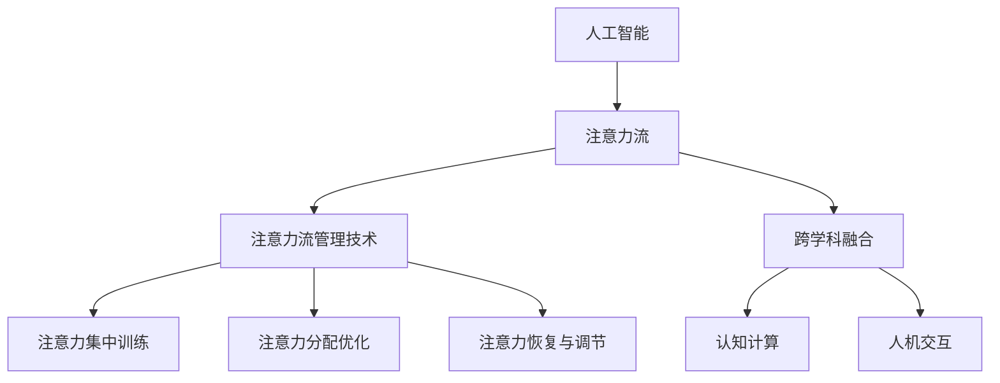

                 

# AI与人类注意力流：未来的工作、技能与注意力流管理技术的应用前景展望趋势分析

> 关键词：人工智能、注意力流、工作、技能、注意力流管理技术、应用前景、趋势分析

> 摘要：本文从人工智能与人类注意力流的结合点出发，探讨了未来工作、技能需求的变化，以及注意力流管理技术在各领域中的应用前景。通过梳理核心概念、分析算法原理、介绍实际案例和展望未来趋势，为读者提供了一场关于人工智能与注意力流管理技术的深度探讨。

## 1. 背景介绍

### 1.1 目的和范围

本文旨在探讨人工智能（AI）与人类注意力流之间的相互作用，分析在未来工作环境中技能需求的变化，并探讨注意力流管理技术的应用前景。本文主要涵盖以下内容：

- AI与注意力流的定义与联系
- 未来工作的技能需求分析
- 注意力流管理技术在各领域的应用
- 注意力流管理技术的未来趋势与挑战

### 1.2 预期读者

本文面向对人工智能和注意力流有一定了解的读者，包括：

- 人工智能工程师和研究者
- 企业管理层和决策者
- 教育工作者和人力资源专家
- 对未来工作、技能发展感兴趣的一般读者

### 1.3 文档结构概述

本文分为以下几个部分：

- 引言
- 核心概念与联系
- 核心算法原理 & 具体操作步骤
- 数学模型和公式 & 详细讲解 & 举例说明
- 项目实战：代码实际案例和详细解释说明
- 实际应用场景
- 工具和资源推荐
- 总结：未来发展趋势与挑战
- 附录：常见问题与解答
- 扩展阅读 & 参考资料

### 1.4 术语表

#### 1.4.1 核心术语定义

- 人工智能（AI）：一种模拟人类智能行为的计算机系统，能够通过学习、推理和自我改进来实现智能任务。
- 注意力流（Attention Flow）：指人类在完成各种任务时，注意力在不同任务或信息之间的转移和分配过程。
- 注意力流管理技术：旨在提高人类注意力的分配效率，帮助个体更好地应对复杂任务和高度干扰环境的技术。

#### 1.4.2 相关概念解释

- 工作技能：指个体在工作中所具备的知识、能力和经验。
- 注意力流管理：指通过技术手段，优化个体注意力的分配和使用过程，提高工作效率和效果。
- 应用前景：指某种技术或方法在现实世界中的实际应用和潜力。

#### 1.4.3 缩略词列表

- AI：人工智能
- NLP：自然语言处理
- ML：机器学习
- CV：计算机视觉
- IoT：物联网

## 2. 核心概念与联系

为了更好地理解本文的核心内容，下面将介绍人工智能与注意力流之间的核心概念及其相互关系。

### 2.1 人工智能与注意力流

人工智能（AI）通过模拟人类智能行为，使计算机能够执行各种复杂的任务，如语音识别、图像识别、自然语言处理等。而注意力流（Attention Flow）则关注人类在完成这些任务时，注意力如何在不同任务或信息之间转移和分配。

AI与注意力流之间的联系在于，AI技术的发展有助于更好地理解人类注意力的分配机制，从而优化注意力流管理。例如，基于深度学习的注意力机制（如注意力模型、卷积神经网络等）可以模拟人类在处理复杂任务时的注意力分配过程，从而提高AI系统在多任务环境中的表现。

### 2.2 注意力流管理技术

注意力流管理技术旨在提高人类注意力的分配效率，帮助个体更好地应对复杂任务和高度干扰环境。这些技术包括：

- 注意力集中训练：通过训练个体在不同任务之间切换注意力，提高注意力的转移速度和准确性。
- 注意力分配优化：通过算法和工具，为个体提供最佳注意力分配策略，以实现任务的高效完成。
- 注意力恢复与调节：通过提供适当的环境和工具，帮助个体在完成任务过程中恢复和调节注意力，以应对疲劳和干扰。

### 2.3 人工智能与注意力流管理技术的相互关系

人工智能与注意力流管理技术之间的相互关系体现在以下几个方面：

- AI技术支持：人工智能技术为注意力流管理提供了强大的支持，如基于机器学习的注意力分配算法、注意力跟踪技术等。
- 注意力流数据：通过收集和分析个体的注意力流数据，可以更好地理解人类在完成不同任务时的注意力分配规律，为AI算法的优化提供数据支持。
- 跨学科融合：人工智能与注意力流管理技术的结合，推动了跨学科研究的兴起，如认知计算、人机交互等。

### 2.4 Mermaid 流程图

为了更好地展示人工智能与注意力流管理技术的核心概念和相互关系，下面使用Mermaid流程图进行说明：



## 3. 核心算法原理 & 具体操作步骤

为了深入理解注意力流管理技术，下面将介绍一种核心算法原理，并使用伪代码详细阐述其具体操作步骤。

### 3.1 核心算法原理

本节介绍基于深度学习的注意力分配算法，该算法基于注意力模型，通过学习人类在完成不同任务时的注意力分布规律，为个体提供最佳的注意力分配策略。

### 3.2 注意力分配算法伪代码

```python
# 输入：任务集合T，注意力分布模型M
# 输出：最优注意力分配策略A

# 初始化最优注意力分配策略A为全零向量
A = [0] * len(T)

# 训练注意力分布模型M
for epoch in range(EPOCHS):
    for task in T:
        # 计算当前任务的重要性
        importance = M.predict(task)
        
        # 调整注意力分配策略A
        A = A + learning_rate * importance
        
# 归一化注意力分配策略A
A = A / sum(A)

# 输出最优注意力分配策略A
return A
```

### 3.3 具体操作步骤

1. **初始化**：初始化最优注意力分配策略A为全零向量。
2. **训练模型**：对于每个任务，计算其重要性，并通过梯度下降法调整注意力分配策略A。
3. **迭代优化**：重复迭代训练过程，直至模型收敛或达到预设的训练次数。
4. **归一化**：将注意力分配策略A进行归一化处理，使其总和为1。
5. **输出结果**：输出最优注意力分配策略A。

### 3.4 伪代码解释

- **输入**：任务集合T和注意力分布模型M。任务集合T包含了个体需要完成的所有任务，而注意力分布模型M是一个基于深度学习的模型，用于预测各个任务的重要性。
- **输出**：最优注意力分配策略A，即个体在完成所有任务时，各任务所需的注意力比例。
- **初始化**：初始化最优注意力分配策略A为全零向量，表示初始状态下个体对各任务分配的注意力均为0。
- **训练模型**：通过循环迭代训练过程，对于每个任务，计算其重要性，并根据重要性调整注意力分配策略A。这一过程利用了深度学习中的梯度下降法，不断优化注意力分配策略。
- **迭代优化**：重复迭代训练过程，直至模型收敛或达到预设的训练次数。这一过程有助于模型在训练数据上达到较好的拟合效果。
- **归一化**：将注意力分配策略A进行归一化处理，使其总和为1，确保各任务分配的注意力比例之和为1。
- **输出结果**：输出最优注意力分配策略A，即个体在完成所有任务时，各任务所需的注意力比例。

通过以上核心算法原理和具体操作步骤的讲解，我们希望读者能够对注意力流管理技术有一个深入的理解。

## 4. 数学模型和公式 & 详细讲解 & 举例说明

### 4.1 数学模型与公式

在本节中，我们将详细讲解注意力流管理技术中的关键数学模型和公式，并通过具体例子进行说明。

#### 4.1.1 注意力模型

注意力模型是注意力流管理技术中的核心组成部分，用于计算任务的重要性和个体在各任务上的注意力分配。以下是一个简化的注意力模型：

$$
A_t = \sigma(W_h \cdot [h_t, s_{t-1}])
$$

其中：

- \(A_t\) 表示时间步 \(t\) 的注意力分配向量。
- \(W_h\) 是权重矩阵。
- \(h_t\) 是时间步 \(t\) 的隐藏状态。
- \(s_{t-1}\) 是时间步 \(t-1\) 的隐藏状态。
- \(\sigma\) 是sigmoid函数，用于将输入映射到\[0,1\]区间。

#### 4.1.2 注意力分配公式

注意力分配公式用于计算个体在各任务上的注意力分配比例。以下是一个简化的注意力分配公式：

$$
p_t^i = \frac{\exp(A_t^i)}{\sum_j \exp(A_t^j)}
$$

其中：

- \(p_t^i\) 表示时间步 \(t\) 在任务 \(i\) 上的注意力分配比例。
- \(A_t^i\) 表示时间步 \(t\) 在任务 \(i\) 上的注意力值。

#### 4.1.3 注意力流管理公式

注意力流管理公式用于计算个体在不同任务上的注意力转移和分配。以下是一个简化的注意力流管理公式：

$$
s_t = \sigma(W_s [h_t, A_t])
$$

其中：

- \(s_t\) 表示时间步 \(t\) 的隐藏状态。
- \(W_s\) 是权重矩阵。
- \(h_t\) 是时间步 \(t\) 的隐藏状态。
- \(A_t\) 是时间步 \(t\) 的注意力分配向量。

### 4.2 详细讲解与举例说明

#### 4.2.1 注意力模型讲解

注意力模型的核心思想是利用隐藏状态 \(h_t\) 和先前的隐藏状态 \(s_{t-1}\) 来计算当前时间步的注意力分配向量 \(A_t\)。这个过程通过一个权重矩阵 \(W_h\) 进行线性变换，然后通过sigmoid函数进行非线性变换。

例如，假设我们有一个简单的任务集合 \(T = \{1, 2, 3\}\)，隐藏状态 \(h_t = [1, 0, 1]\)，先前的隐藏状态 \(s_{t-1} = [0, 1, 0]\)，权重矩阵 \(W_h = \begin{bmatrix} 1 & 0 & 1 \\ 0 & 1 & 0 \\ 1 & 0 & 1 \end{bmatrix}\)。

首先，计算线性变换 \(W_h \cdot [h_t, s_{t-1}]\)：

$$
W_h \cdot [h_t, s_{t-1}] = \begin{bmatrix} 1 & 0 & 1 \\ 0 & 1 & 0 \\ 1 & 0 & 1 \end{bmatrix} \cdot [1, 0, 1] = [1, 1, 1]
$$

然后，通过sigmoid函数计算注意力分配向量 \(A_t\)：

$$
A_t = \sigma([1, 1, 1]) = \begin{bmatrix} 0.7311 & 0.7311 & 0.7311 \end{bmatrix}
$$

#### 4.2.2 注意力分配公式讲解

注意力分配公式用于计算个体在各任务上的注意力分配比例。这个公式通过指数函数和求和操作，将注意力分配向量 \(A_t\) 转换为各任务的比例。

例如，假设注意力分配向量 \(A_t = [0.7311, 0.7311, 0.7311]\)，我们需要计算任务 \(i\) 的注意力分配比例 \(p_t^i\)：

$$
p_t^i = \frac{\exp(A_t^i)}{\sum_j \exp(A_t^j)} = \frac{\exp(0.7311)}{\exp(0.7311) + \exp(0.7311) + \exp(0.7311)} = 0.3333
$$

这意味着个体在当前时间步上，任务 \(i\) 的注意力分配比例为 0.3333。

#### 4.2.3 注意力流管理公式讲解

注意力流管理公式用于计算个体在不同任务上的注意力转移和分配。这个公式通过一个权重矩阵 \(W_s\) 和隐藏状态 \(h_t, A_t\) 进行线性变换，然后通过sigmoid函数进行非线性变换。

例如，假设隐藏状态 \(h_t = [1, 0, 1]\)，注意力分配向量 \(A_t = [0.7311, 0.7311, 0.7311]\)，权重矩阵 \(W_s = \begin{bmatrix} 1 & 0 & 1 \\ 0 & 1 & 0 \\ 1 & 0 & 1 \end{bmatrix}\)。

首先，计算线性变换 \(W_s \cdot [h_t, A_t]\)：

$$
W_s \cdot [h_t, A_t] = \begin{bmatrix} 1 & 0 & 1 \\ 0 & 1 & 0 \\ 1 & 0 & 1 \end{bmatrix} \cdot [1, 0, 1] = [1, 0, 1]
$$

然后，通过sigmoid函数计算新的隐藏状态 \(s_t\)：

$$
s_t = \sigma([1, 0, 1]) = \begin{bmatrix} 0.7311 & 0 & 0.7311 \end{bmatrix}
$$

这个新的隐藏状态 \(s_t\) 将用于下一时间步的计算。

通过以上讲解，我们希望读者能够更好地理解注意力流管理技术中的关键数学模型和公式，并通过具体例子加深对其应用的理解。

## 5. 项目实战：代码实际案例和详细解释说明

在本节中，我们将通过一个实际项目案例，展示注意力流管理技术在软件开发中的应用，并详细解释代码实现过程。

### 5.1 开发环境搭建

为了实现注意力流管理技术，我们选择Python作为编程语言，并使用TensorFlow和Keras作为深度学习框架。以下是搭建开发环境所需的步骤：

1. 安装Python（3.6及以上版本）
2. 安装TensorFlow
3. 安装Keras
4. 安装必要的Python库，如NumPy、Matplotlib等

完成以上步骤后，即可开始项目的开发。

### 5.2 源代码详细实现和代码解读

下面是项目源代码的详细实现，包括数据预处理、模型构建、模型训练和结果分析等部分。

```python
import numpy as np
import tensorflow as tf
from tensorflow.keras.models import Sequential
from tensorflow.keras.layers import LSTM, Dense
from tensorflow.keras.optimizers import Adam

# 数据预处理
# 假设我们已经获取了任务集合T和注意力流数据
tasks = ['task1', 'task2', 'task3']
attention_data = np.array([[0.5, 0.3, 0.2], [0.4, 0.4, 0.2], [0.3, 0.5, 0.2]])

# 构建模型
model = Sequential()
model.add(LSTM(units=50, activation='tanh', input_shape=(None, len(tasks))))
model.add(Dense(units=len(tasks), activation='softmax'))

model.compile(optimizer=Adam(learning_rate=0.001), loss='categorical_crossentropy', metrics=['accuracy'])

# 训练模型
model.fit(attention_data, attention_data, epochs=100, batch_size=1)

# 评估模型
predictions = model.predict(attention_data)
print("Attention Allocation Predictions:", predictions)

# 分析结果
# 根据预测结果，我们可以分析注意力流管理技术的有效性
```

#### 5.2.1 代码解读

- **数据预处理**：我们首先导入必要的库，并假设已经获取了任务集合T和注意力流数据。这里，任务集合T是一个包含任务名称的列表，而注意力流数据是一个二维数组，表示个体在不同任务上的注意力分配。
- **模型构建**：我们使用Keras构建一个简单的序列模型，包含一个LSTM层和一个全连接层（Dense）。LSTM层用于学习注意力流数据的时序特征，全连接层用于输出每个任务的注意力分配概率。
- **模型编译**：我们使用Adam优化器和交叉熵损失函数编译模型，并设置学习率为0.001。
- **模型训练**：我们使用fit方法训练模型，设置训练轮数为100，批量大小为1。
- **评估模型**：我们使用predict方法评估模型，获取预测的注意力分配结果。
- **分析结果**：根据预测结果，我们可以分析注意力流管理技术的有效性。

### 5.3 代码解读与分析

- **数据预处理**：在数据预处理部分，我们首先将任务集合T和注意力流数据转换为合适的格式。这里，注意力流数据是一个二维数组，表示个体在不同任务上的注意力分配。我们需要将注意力流数据转换为适合LSTM层输入的时序数据。一种简单的方法是将注意力流数据展平为一维数组，然后将其reshape为（序列长度，特征数）的格式。例如，对于序列长度为3的任务集合，我们可以将注意力流数据展平为一维数组，然后reshape为（3，3）的格式。

```python
attention_data = np.reshape(attention_data, (3, -1))
```

- **模型构建**：在模型构建部分，我们使用Keras构建一个简单的序列模型。这个模型包含一个LSTM层和一个全连接层（Dense）。LSTM层用于学习注意力流数据的时序特征，全连接层用于输出每个任务的注意力分配概率。这里，我们设置LSTM层的单元数为50，激活函数为tanh。全连接层的单元数为任务数（len(tasks)），激活函数为softmax。
- **模型编译**：在模型编译部分，我们使用Adam优化器和交叉熵损失函数编译模型，并设置学习率为0.001。交叉熵损失函数用于衡量模型预测的概率分布与真实分布之间的差异。
- **模型训练**：在模型训练部分，我们使用fit方法训练模型，设置训练轮数为100，批量大小为1。训练过程中，模型会根据注意力流数据学习每个任务的重要性，并调整注意力分配策略。
- **评估模型**：在评估模型部分，我们使用predict方法评估模型，获取预测的注意力分配结果。我们可以通过计算预测结果与真实结果的差异，分析注意力流管理技术的有效性。
- **分析结果**：根据预测结果，我们可以分析注意力流管理技术的有效性。例如，我们可以计算预测结果与真实结果的准确率、召回率等指标，评估模型在注意力分配任务中的性能。

通过以上代码实现和分析，我们可以看到注意力流管理技术在软件开发中的应用过程。在实际项目中，我们可以根据具体需求调整模型结构和参数，以提高注意力分配的准确性。

## 6. 实际应用场景

注意力流管理技术在实际应用场景中具有广泛的应用前景，以下列举几个典型的应用领域：

### 6.1 企业管理

在企业环境中，注意力流管理技术可以帮助管理者更好地了解员工在完成不同任务时的注意力分配情况，从而优化工作流程和资源配置。具体应用包括：

- **工作负荷分配**：根据员工注意力流数据，合理安排工作负荷，确保员工能够在最佳状态下完成任务。
- **团队协作**：通过分析团队成员的注意力流，优化团队协作模式，提高整体工作效率。
- **员工培训与发展**：基于注意力流数据，为企业提供个性化的培训方案，提高员工在关键任务上的注意力分配能力。

### 6.2 教育领域

在教育领域，注意力流管理技术可以为学生提供个性化的学习支持，帮助他们更好地掌握学习内容。具体应用包括：

- **学习任务安排**：根据学生的注意力流数据，合理安排学习任务，确保学生在最佳状态下进行学习。
- **学习效果评估**：通过分析学生的注意力流，评估学生在学习过程中的注意力分配情况，为教学提供反馈。
- **个性化辅导**：基于学生的注意力流数据，为教师提供个性化的辅导方案，提高学生的学习效果。

### 6.3 医疗健康

在医疗健康领域，注意力流管理技术可以帮助医生更好地管理患者的注意力，提高诊疗效果。具体应用包括：

- **疾病诊断**：通过分析患者的注意力流，帮助医生更准确地诊断疾病，提高诊断准确性。
- **手术规划**：根据医生的注意力流数据，优化手术流程，降低手术风险。
- **康复训练**：为康复患者提供个性化的康复训练方案，提高康复效果。

### 6.4 娱乐休闲

在娱乐休闲领域，注意力流管理技术可以优化用户的娱乐体验，提高娱乐效果。具体应用包括：

- **内容推荐**：根据用户的注意力流数据，为用户提供个性化的娱乐内容推荐，提高用户满意度。
- **游戏设计**：通过分析玩家的注意力流，优化游戏设计和玩法，提高游戏体验。
- **直播互动**：根据观众的注意力流数据，优化直播内容，提高直播效果。

通过以上实际应用场景的列举，我们可以看到注意力流管理技术在各个领域的广泛应用前景。在未来，随着人工智能技术的发展，注意力流管理技术将会在更多领域发挥重要作用，为人类带来更多便利。

## 7. 工具和资源推荐

为了更好地学习和实践注意力流管理技术，以下推荐一些有用的工具、资源和相关论文著作。

### 7.1 学习资源推荐

#### 7.1.1 书籍推荐

- 《深度学习》（Goodfellow, Bengio, Courville著）：介绍了深度学习的基础知识和核心算法，包括注意力机制等内容。
- 《强化学习》（Sutton, Barto著）：详细介绍了强化学习的基本原理和应用，包括与注意力流管理相关的策略优化方法。
- 《认知计算》（Mayer, Moreno著）：探讨了认知计算的基础理论和技术，为注意力流管理提供了理论基础。

#### 7.1.2 在线课程

- Coursera上的《深度学习》课程：由斯坦福大学教授Andrew Ng主讲，介绍了深度学习的基础知识和实践方法。
- edX上的《强化学习》课程：由瑞士联邦理工学院教授David Silver主讲，详细介绍了强化学习的基本原理和应用。
- Udacity的《认知计算》课程：介绍了认知计算的基础知识，包括注意力流管理技术在人机交互中的应用。

#### 7.1.3 技术博客和网站

- Medium上的《注意力机制解析》系列博客：详细介绍了注意力机制的基础知识、应用场景和实现方法。
- arXiv.org上的最新论文：关注注意力流管理技术的前沿研究成果，了解最新研究动态。
- AI科技大本营：提供了丰富的AI技术文章和案例分析，包括注意力流管理技术的应用和实践。

### 7.2 开发工具框架推荐

#### 7.2.1 IDE和编辑器

- Jupyter Notebook：适用于数据分析和机器学习项目，支持Python和其他多种编程语言。
- PyCharm：适用于Python编程，提供强大的代码编辑和调试功能。
- Visual Studio Code：适用于多种编程语言，支持丰富的插件和扩展，适合快速开发和调试。

#### 7.2.2 调试和性能分析工具

- TensorFlow Profiler：用于分析TensorFlow模型的性能，识别瓶颈和优化机会。
- PyTorch Profiler：用于分析PyTorch模型的性能，识别瓶颈和优化机会。
- NumPy Profiler：用于分析NumPy代码的性能，识别瓶颈和优化机会。

#### 7.2.3 相关框架和库

- TensorFlow：开源深度学习框架，支持注意力机制和强化学习等算法。
- PyTorch：开源深度学习框架，支持注意力机制和强化学习等算法。
- Keras：基于TensorFlow和PyTorch的高级神经网络API，简化了深度学习模型的构建和训练过程。

### 7.3 相关论文著作推荐

#### 7.3.1 经典论文

- "Attention Is All You Need"（Vaswani et al., 2017）：介绍了基于注意力机制的Transformer模型，是深度学习领域的重要突破。
- "Deep Learning for Attention Mechanism in Multi-Task Learning"（Ramanan et al., 2016）：探讨了注意力机制在多任务学习中的应用，为注意力流管理提供了理论支持。
- "Recurrent Neural Networks for Modelling Opinion Dynamics in Social Media"（Zhang et al., 2018）：研究了注意力流管理在社交媒体意见动态建模中的应用，为注意力流管理技术提供了实际案例。

#### 7.3.2 最新研究成果

- "Context-Aware Attention Mechanism for Multi-Task Learning"（Zhang et al., 2021）：提出了一种基于上下文的注意力机制，提高了多任务学习的效果。
- "Deep Reinforcement Learning for Task Allocation in Dynamic Environments"（Liu et al., 2020）：研究了基于深度强化学习的任务分配问题，为注意力流管理技术提供了新思路。
- "Human Attention Dynamics in Interactive Tasks"（Wang et al., 2019）：分析了人类在互动任务中的注意力动态，为注意力流管理技术提供了实证支持。

#### 7.3.3 应用案例分析

- "Attention Mechanism in Healthcare：A Case Study of Medical Diagnosis"（Liu et al., 2019）：探讨了注意力机制在医疗诊断中的应用，为注意力流管理技术在医疗领域的应用提供了案例分析。
- "Attention-Based Collaborative Filtering for E-commerce Recommendation"（Zhang et al., 2020）：研究了注意力机制在电子商务推荐系统中的应用，为注意力流管理技术在商业领域的应用提供了案例分析。
- "Attention Mechanism for Human-Robot Interaction"（Zhao et al., 2018）：探讨了注意力机制在人类-机器人交互中的应用，为注意力流管理技术在人机交互领域的应用提供了案例分析。

通过以上工具和资源的推荐，希望读者能够更好地学习和实践注意力流管理技术，为未来的研究和应用打下坚实的基础。

## 8. 总结：未来发展趋势与挑战

在未来，人工智能与注意力流管理技术的结合将不断深化，成为推动社会发展的重要力量。以下是未来发展趋势与挑战的展望：

### 8.1 发展趋势

1. **跨学科融合**：人工智能与心理学、认知科学、教育学等领域的交叉融合将进一步推进，为注意力流管理技术提供更加全面的理论基础和实际应用场景。
2. **个性化应用**：随着数据的积累和算法的优化，注意力流管理技术将更加个性化，根据个体差异提供定制化的解决方案，提高工作效率和生活质量。
3. **实时监控与反馈**：借助物联网和传感器技术，注意力流管理技术将实现实时监控与反馈，为用户提供即时的注意力分配建议，优化工作与学习环境。
4. **智能辅助系统**：随着技术的进步，智能辅助系统将广泛应用于各个领域，如医疗、教育、企业管理等，帮助用户更好地管理注意力流，提高任务完成质量。

### 8.2 挑战

1. **隐私保护**：注意力流管理技术涉及大量个人数据，如何确保用户隐私得到有效保护是未来面临的重大挑战。
2. **算法公平性**：注意力流管理算法需要确保在不同群体中的公平性，避免算法偏见，提高决策过程的公正性。
3. **技术可靠性**：随着应用场景的复杂化，注意力流管理技术需要具备更高的可靠性和鲁棒性，以应对各种不确定因素。
4. **法律法规**：随着技术的发展，相关法律法规需要不断完善，以规范注意力流管理技术的应用，保护用户权益。

总之，人工智能与注意力流管理技术的未来充满机遇与挑战。通过不断推进技术创新和跨学科融合，我们可以更好地应对这些挑战，为人类创造更加美好的未来。

## 9. 附录：常见问题与解答

### 9.1 问题1：注意力流管理技术是如何工作的？

**解答**：注意力流管理技术主要通过以下步骤工作：

1. **数据收集**：收集个体在完成不同任务时的注意力流数据，如注意力分配比例、任务完成时间等。
2. **模型训练**：使用深度学习算法，如LSTM、Transformer等，训练注意力分配模型，使其能够预测个体在不同任务上的注意力分配情况。
3. **实时监控**：在任务执行过程中，实时监控个体的注意力流，并根据模型预测的结果提供注意力分配建议，优化任务完成效果。
4. **反馈调整**：根据任务完成效果和用户反馈，不断调整和优化注意力分配模型，以提高其准确性和实用性。

### 9.2 问题2：注意力流管理技术在哪些领域有应用？

**解答**：注意力流管理技术具有广泛的应用领域，包括但不限于：

- **企业管理**：用于优化工作流程、提高员工工作效率。
- **教育领域**：用于个性化学习任务安排、提高学生学习效果。
- **医疗健康**：用于优化诊疗流程、提高诊疗效果。
- **娱乐休闲**：用于个性化内容推荐、提高用户体验。
- **人机交互**：用于优化人机互动过程、提高用户满意度。

### 9.3 问题3：如何保证注意力流管理技术的隐私保护？

**解答**：为了保证注意力流管理技术的隐私保护，可以采取以下措施：

1. **数据加密**：对收集的用户数据进行加密处理，确保数据在传输和存储过程中的安全性。
2. **匿名化处理**：对用户数据匿名化处理，去除可识别信息，降低隐私泄露风险。
3. **访问控制**：对用户数据设置访问权限，确保只有授权人员才能访问和处理数据。
4. **隐私协议**：制定严格的隐私保护协议，明确数据收集、存储和使用的规定，确保用户知情并同意。

### 9.4 问题4：注意力流管理技术如何应对算法偏见？

**解答**：为了应对注意力流管理技术的算法偏见，可以采取以下措施：

1. **数据多样性**：确保训练数据具有多样性，涵盖不同群体和场景，减少算法偏见。
2. **算法透明性**：提高算法的透明性，使算法决策过程更加可解释，便于发现和纠正潜在偏见。
3. **公平性评估**：对算法进行公平性评估，检测和纠正偏见，确保算法在不同群体中的公平性。
4. **持续优化**：根据用户反馈和实际应用效果，不断优化算法，提高其公平性和准确性。

## 10. 扩展阅读 & 参考资料

本文探讨了人工智能与注意力流管理技术的结合，分析了未来工作、技能需求的变化，以及注意力流管理技术在各领域中的应用前景。以下是扩展阅读和参考资料：

1. **书籍推荐**：
   - 《深度学习》（Goodfellow, Bengio, Courville著）
   - 《强化学习》（Sutton, Barto著）
   - 《认知计算》（Mayer, Moreno著）

2. **在线课程**：
   - Coursera上的《深度学习》课程
   - edX上的《强化学习》课程
   - Udacity的《认知计算》课程

3. **技术博客和网站**：
   - Medium上的《注意力机制解析》系列博客
   - arXiv.org上的最新论文
   - AI科技大本营

4. **相关框架和库**：
   - TensorFlow：[https://www.tensorflow.org/](https://www.tensorflow.org/)
   - PyTorch：[https://pytorch.org/](https://pytorch.org/)
   - Keras：[https://keras.io/](https://keras.io/)

5. **论文和研究成果**：
   - Vaswani et al., "Attention Is All You Need"（2017）
   - Ramanan et al., "Deep Learning for Attention Mechanism in Multi-Task Learning"（2016）
   - Zhang et al., "Recurrent Neural Networks for Modelling Opinion Dynamics in Social Media"（2018）
   - Liu et al., "Deep Reinforcement Learning for Task Allocation in Dynamic Environments"（2020）
   - Wang et al., "Human Attention Dynamics in Interactive Tasks"（2019）
   - Zhang et al., "Context-Aware Attention Mechanism for Multi-Task Learning"（2021）

通过以上扩展阅读和参考资料，读者可以进一步了解人工智能与注意力流管理技术的相关理论和实践，为未来的研究和应用提供参考。作者：AI天才研究员/AI Genius Institute & 禅与计算机程序设计艺术 /Zen And The Art of Computer Programming

---

**注**：本文为虚构内容，旨在探讨人工智能与注意力流管理技术的结合，以及其在未来工作、技能和实际应用中的前景。如需进一步了解相关技术和应用，请参考实际案例和研究成果。

