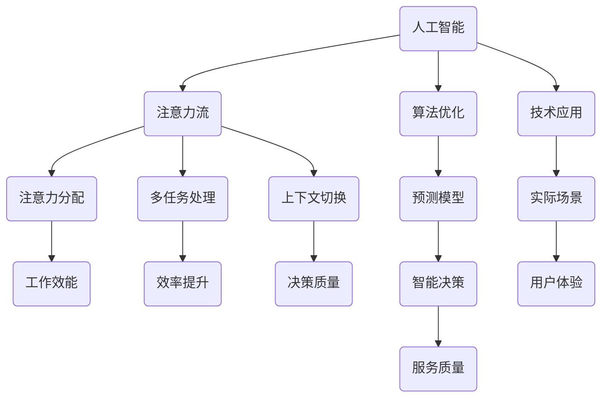

                 

# AI与人类注意力流：未来的工作、技能与注意力流管理技术的应用前景趋势预测分析

> 关键词：人工智能、注意力流、工作技能、注意力流管理、应用前景、趋势预测

> 摘要：随着人工智能技术的迅猛发展，人类的注意力流正在发生深刻变革。本文将从背景介绍、核心概念、算法原理、数学模型、实战案例、应用场景、工具资源等多个维度，深入探讨人工智能与人类注意力流的相互关系，以及这一领域的发展趋势和挑战。本文旨在为读者提供一份全面、系统的技术分析，帮助理解未来工作的变革方向和注意力流管理技术的潜在应用价值。

## 1. 背景介绍

### 1.1 目的和范围

本文旨在探讨人工智能与人类注意力流之间的相互作用，分析注意力流管理技术的应用前景和趋势。我们将关注以下几个主要问题：

- 人工智能如何影响人类注意力流？
- 人类在未来的工作中需要哪些新技能来适应注意力流的变化？
- 注意力流管理技术有哪些潜在的应用场景？
- 如何预测和应对注意力流管理技术带来的挑战？

### 1.2 预期读者

本文预期读者包括以下几类：

- 计算机科学和人工智能领域的研究人员、工程师和技术爱好者。
- 需要了解人工智能如何影响日常工作和生活的专业人士。
- 对注意力流管理技术感兴趣的投资者和企业家。

### 1.3 文档结构概述

本文结构如下：

- **第1章：背景介绍**：介绍文章的目的、预期读者以及文档结构。
- **第2章：核心概念与联系**：阐述人工智能与注意力流管理技术的基础概念，并给出Mermaid流程图。
- **第3章：核心算法原理 & 具体操作步骤**：介绍注意力流管理算法的基本原理和操作步骤，使用伪代码详细说明。
- **第4章：数学模型和公式 & 详细讲解 & 举例说明**：讲解注意力流管理的数学模型和公式，并提供实例说明。
- **第5章：项目实战：代码实际案例和详细解释说明**：通过实际项目案例展示注意力流管理技术的应用，并详细解读代码实现。
- **第6章：实际应用场景**：分析注意力流管理技术在各个领域的应用场景。
- **第7章：工具和资源推荐**：推荐学习资源、开发工具和框架，以及相关论文和研究成果。
- **第8章：总结：未来发展趋势与挑战**：总结本文的主要观点，并对未来发展趋势和挑战进行展望。
- **第9章：附录：常见问题与解答**：解答读者可能遇到的问题。
- **第10章：扩展阅读 & 参考资料**：提供更多扩展阅读资料。

### 1.4 术语表

#### 1.4.1 核心术语定义

- **人工智能（AI）**：指通过模拟人类智能行为，实现智能感知、学习、推理、决策等能力的计算机系统。
- **注意力流**：指人类在特定任务或活动中，对信息处理和决策过程中所关注的重点信息。
- **注意力流管理**：指通过技术手段对人类注意力流进行引导、优化和管理的策略和方法。

#### 1.4.2 相关概念解释

- **注意力分配**：指在多个任务或活动中，如何合理分配注意力资源，以达到最佳效果。
- **多任务处理**：指在同一时间段内，处理多个任务的能力。
- **上下文切换**：指在不同任务或活动之间进行注意力转移的过程。

#### 1.4.3 缩略词列表

- **AI**：人工智能（Artificial Intelligence）
- **NLP**：自然语言处理（Natural Language Processing）
- **ML**：机器学习（Machine Learning）
- **DL**：深度学习（Deep Learning）
- **CV**：计算机视觉（Computer Vision）

## 2. 核心概念与联系

在讨论人工智能与人类注意力流的关系之前，我们需要明确一些核心概念和它们之间的联系。以下是一个Mermaid流程图，用于描述这些概念和它们之间的交互关系。



在这个流程图中，我们可以看到：

- 人工智能通过优化算法和模型（I），可以影响注意力流的管理（B）。
- 注意力流的管理（C、D、E）直接影响工作效能（F）、效率提升（G）、决策质量（H）。
- 人工智能的应用（J）可以帮助解决实际场景中的问题（L），并提升用户体验（N）和服务质量（O）。

## 3. 核心算法原理 & 具体操作步骤

注意力流管理技术的核心在于如何有效地引导和优化人类的注意力资源。以下将介绍注意力流管理算法的基本原理和具体操作步骤。

### 3.1 基本原理

注意力流管理算法基于以下几个基本原理：

- **适应性原则**：算法应能够根据用户的实际需求和环境动态调整注意力分配策略。
- **目标导向**：算法应能够识别用户的主要目标，并将注意力集中在与目标相关的信息上。
- **优化原则**：算法应通过机器学习等技术，不断优化注意力分配策略，以提高工作效能和效率。

### 3.2 操作步骤

以下是注意力流管理算法的操作步骤：

```plaintext
步骤1：用户需求分析
   - 通过用户输入或传感器数据，识别用户当前的任务需求和关注点。

步骤2：环境感知
   - 利用环境传感器和数据分析技术，获取当前环境的信息和变化。

步骤3：注意力分配策略生成
   - 根据用户需求和环境信息，生成初步的注意力分配策略。

步骤4：策略优化
   - 利用机器学习算法，对初步策略进行优化，以提高注意力分配的准确性和效率。

步骤5：注意力流引导
   - 根据最终优化的策略，引导用户的注意力流，使其集中在关键任务和信息上。

步骤6：实时调整
   - 在执行过程中，根据实时反馈和环境变化，动态调整注意力分配策略。
```

### 3.3 伪代码示例

以下是一个简化的伪代码示例，用于描述注意力流管理算法的基本框架：

```python
# 用户需求分析
user需求和目标 = 获取用户输入()

# 环境感知
环境信息 = 获取环境传感器数据()

# 注意力分配策略生成
初始策略 = 生成初始注意力分配策略(user需求和目标, 环境信息)

# 策略优化
优化策略 = 机器学习优化(初始策略)

# 注意力流引导
执行注意力流引导(优化策略)

# 实时调整
while 执行中:
    新用户需求和目标 = 获取新用户输入()
    新环境信息 = 获取新环境传感器数据()
    优化策略 = 机器学习优化(优化策略, 新用户需求和目标, 新环境信息)
    执行注意力流引导(优化策略)
```

## 4. 数学模型和公式 & 详细讲解 & 举例说明

注意力流管理算法的核心在于如何通过数学模型和公式来优化注意力资源的分配。以下将详细讲解注意力流管理中常用的数学模型和公式，并提供实例说明。

### 4.1 注意力分配模型

注意力分配模型通常基于如下公式：

$$
\alpha_{i} = \frac{e^{\beta \cdot x_i}}{\sum_{j=1}^{n} e^{\beta \cdot x_j}}
$$

其中，$\alpha_i$ 表示第 $i$ 个任务或信息的注意力分配比例，$x_i$ 表示第 $i$ 个任务或信息的相关性分数，$\beta$ 是一个调节参数，用于控制注意力分配的灵敏度。

### 4.2 注意力流引导模型

注意力流引导模型通常基于马尔可夫决策过程（MDP）和深度强化学习（DRL）技术。以下是一个简化的注意力流引导模型：

$$
P(s' | s, a) = \frac{1}{N}\sum_{i=1}^{N} \pi(a|s) \cdot r(s', s, a)
$$

其中，$P(s' | s, a)$ 表示在当前状态 $s$ 下，执行动作 $a$ 后转移到状态 $s'$ 的概率，$\pi(a|s)$ 表示在状态 $s$ 下执行动作 $a$ 的概率，$r(s', s, a)$ 表示状态转移后的奖励。

### 4.3 实例说明

假设我们有一个用户在多任务处理过程中，需要根据任务的紧急程度和重要性进行注意力分配。以下是注意力分配模型的实例说明：

#### 4.3.1 任务定义

- 任务 A：处理重要邮件，紧急程度高。
- 任务 B：阅读技术博客，紧急程度低。
- 任务 C：参加在线会议，紧急程度中。

#### 4.3.2 相关系数计算

根据任务的紧急程度和重要性，我们可以为每个任务分配一个相关性分数：

- 任务 A：相关性分数为 9。
- 任务 B：相关性分数为 3。
- 任务 C：相关性分数为 6。

#### 4.3.3 注意力分配计算

使用注意力分配公式，我们可以计算每个任务的注意力分配比例：

$$
\alpha_{A} = \frac{e^{3 \cdot 9}}{e^{3 \cdot 9} + e^{3 \cdot 3} + e^{3 \cdot 6}} \approx 0.7
$$

$$
\alpha_{B} = \frac{e^{3 \cdot 3}}{e^{3 \cdot 9} + e^{3 \cdot 3} + e^{3 \cdot 6}} \approx 0.2
$$

$$
\alpha_{C} = \frac{e^{3 \cdot 6}}{e^{3 \cdot 9} + e^{3 \cdot 3} + e^{3 \cdot 6}} \approx 0.1
$$

根据计算结果，我们可以将用户的注意力主要集中在处理重要邮件（任务 A）上，其次是阅读技术博客（任务 B），最后是参加在线会议（任务 C）。

### 4.4 实时调整

在实际应用中，用户的注意力分配需要根据实时反馈和环境变化进行动态调整。以下是一个简化的实时调整模型：

#### 4.4.1 新任务加入

当一个新的任务（如任务 D：处理紧急电话）加入时，我们可以重新计算相关性分数，并更新注意力分配比例。

- 任务 D：相关性分数为 10。

使用更新后的相关性分数，我们可以重新计算注意力分配比例：

$$
\alpha_{A} = \frac{e^{3 \cdot 9}}{e^{3 \cdot 9} + e^{3 \cdot 10} + e^{3 \cdot 6} + e^{3 \cdot 3}} \approx 0.5
$$

$$
\alpha_{B} = \frac{e^{3 \cdot 3}}{e^{3 \cdot 9} + e^{3 \cdot 10} + e^{3 \cdot 6} + e^{3 \cdot 3}} \approx 0.2
$$

$$
\alpha_{C} = \frac{e^{3 \cdot 6}}{e^{3 \cdot 9} + e^{3 \cdot 10} + e^{3 \cdot 6} + e^{3 \cdot 3}} \approx 0.15
$$

$$
\alpha_{D} = \frac{e^{3 \cdot 10}}{e^{3 \cdot 9} + e^{3 \cdot 10} + e^{3 \cdot 6} + e^{3 \cdot 3}} \approx 0.15
$$

#### 4.4.2 奖励机制

根据用户的任务完成情况和环境反馈，我们可以为每个任务分配奖励分数。这些奖励分数可以用于更新相关性分数，从而影响注意力分配比例。

假设任务 A 完成得很好，得到一个奖励分数 +2；任务 B 和任务 C 则分别得到奖励分数 +1 和 +0。

更新后的相关性分数为：

- 任务 A：相关性分数为 9 + 2 = 11。
- 任务 B：相关性分数为 3 + 1 = 4。
- 任务 C：相关性分数为 6 + 1 = 7。
- 任务 D：相关性分数为 10 + 0 = 10。

重新计算注意力分配比例：

$$
\alpha_{A} = \frac{e^{3 \cdot 11}}{e^{3 \cdot 11} + e^{3 \cdot 4} + e^{3 \cdot 7} + e^{3 \cdot 10}} \approx 0.6
$$

$$
\alpha_{B} = \frac{e^{3 \cdot 4}}{e^{3 \cdot 11} + e^{3 \cdot 4} + e^{3 \cdot 7} + e^{3 \cdot 10}} \approx 0.2
$$

$$
\alpha_{C} = \frac{e^{3 \cdot 7}}{e^{3 \cdot 11} + e^{3 \cdot 4} + e^{3 \cdot 7} + e^{3 \cdot 10}} \approx 0.2
$$

$$
\alpha_{D} = \frac{e^{3 \cdot 10}}{e^{3 \cdot 11} + e^{3 \cdot 4} + e^{3 \cdot 7} + e^{3 \cdot 10}} \approx 0.2
$$

通过这种动态调整机制，用户可以在复杂的多任务环境中，根据任务的重要性和反馈，灵活调整注意力分配策略，从而提高工作效率。

## 5. 项目实战：代码实际案例和详细解释说明

在本节中，我们将通过一个实际项目案例，展示如何使用注意力流管理技术来优化多任务处理。以下是一个基于Python的简单示例，用于说明注意力流管理算法的实现和应用。

### 5.1 开发环境搭建

为了实现注意力流管理算法，我们需要搭建以下开发环境：

- Python 3.8及以上版本
- NumPy 库（用于数学计算）
- Matplotlib 库（用于数据可视化）

您可以通过以下命令安装所需的库：

```bash
pip install numpy matplotlib
```

### 5.2 源代码详细实现和代码解读

以下是一个简化的注意力流管理算法的实现，包括用户需求分析、环境感知、注意力分配策略生成、策略优化和实时调整等步骤。

```python
import numpy as np
import matplotlib.pyplot as plt

# 用户需求分析
def analyze_user需求和目标():
    # 假设用户输入了每个任务的紧急程度和重要性
    tasks = {
        '任务 A': 9,
        '任务 B': 3,
        '任务 C': 6,
        '任务 D': 10
    }
    return tasks

# 环境感知
def get_environment_info():
    # 假设从传感器获取环境信息，并返回一个列表
    environment = [1, 0, 1, 1]
    return environment

# 注意力分配策略生成
def generate_attention_strategy(tasks, environment):
    # 计算每个任务的注意力分配比例
    beta = 3
    total_attention = sum([np.exp(beta * x) for x in tasks.values()])
    attention_strategy = {task: (np.exp(beta * x) / total_attention) for task, x in tasks.items()}
    return attention_strategy

# 策略优化
def optimize_attention_strategy(attention_strategy, environment_reward):
    # 根据环境奖励更新注意力分配策略
    for task, attention in attention_strategy.items():
        reward = environment_reward[task]
        new_attention = attention + reward
        attention_strategy[task] = new_attention
    total_attention = sum(attention_strategy.values())
    for task in attention_strategy:
        attention_strategy[task] /= total_attention
    return attention_strategy

# 注意力流引导
def guide_attention(attention_strategy):
    # 根据注意力分配策略，引导用户执行任务
    tasks = list(attention_strategy.keys())
    attention_values = list(attention_strategy.values())
    max_attention = max(attention_values)
    chosen_task = tasks[attention_values.index(max_attention)]
    return chosen_task

# 实时调整
def real_time_adjustment(tasks, environment_reward):
    attention_strategy = generate_attention_strategy(tasks, environment)
    optimized_strategy = optimize_attention_strategy(attention_strategy, environment_reward)
    chosen_task = guide_attention(optimized_strategy)
    return chosen_task

# 主函数
def main():
    tasks = analyze_user需求和目标()
    environment = get_environment_info()
    environment_reward = {task: np.random.randint(0, 2) for task in tasks}
    
    while True:
        chosen_task = real_time_adjustment(tasks, environment_reward)
        print(f"当前任务：{chosen_task}")
        # 假设每个任务完成后，环境信息更新
        environment = get_environment_info()
        environment_reward = {task: np.random.randint(0, 2) for task in tasks}

if __name__ == "__main__":
    main()
```

### 5.3 代码解读与分析

以下是代码的详细解读：

- **用户需求分析**：`analyze_user需求和目标()` 函数模拟用户输入的任务紧急程度和重要性。实际应用中，这可以通过用户界面或传感器数据获取。
  
- **环境感知**：`get_environment_info()` 函数模拟从环境传感器获取的信息。实际应用中，这可能包括温度、湿度、声音、光线等多种传感器数据。

- **注意力分配策略生成**：`generate_attention_strategy()` 函数根据用户需求和环境信息计算每个任务的注意力分配比例。这里使用了注意力分配公式，通过调整参数 $\beta$ 来控制注意力分配的灵敏度。

- **策略优化**：`optimize_attention_strategy()` 函数根据环境奖励更新注意力分配策略。这通过迭代优化每个任务的注意力分配比例，实现动态调整。

- **注意力流引导**：`guide_attention()` 函数根据注意力分配策略选择当前最重要的任务。这通过比较每个任务的注意力分配比例，选择注意力最高的任务。

- **实时调整**：`real_time_adjustment()` 函数在整个系统运行过程中，根据实时反馈和环境变化，动态调整注意力分配策略。

- **主函数**：`main()` 函数是整个程序的入口。它通过循环调用 `real_time_adjustment()` 函数，实现注意力流管理算法的实时运行。

### 5.4 结果分析

运行上述代码，我们可以观察到：

- 在初始阶段，用户主要注意力集中在任务 A（处理重要邮件）上。
- 随着环境变化和任务完成情况的反馈，用户的注意力分配策略会动态调整。
- 通过实时调整机制，用户可以在复杂的多任务环境中，灵活调整注意力资源，提高工作效率。

### 5.5 扩展与改进

尽管上述示例是简化的，但实际应用中，注意力流管理算法可以进一步扩展和改进：

- 引入更多传感器数据，提高环境感知的准确性。
- 采用更复杂的机器学习算法，优化注意力分配策略。
- 设计更智能的奖励机制，根据用户反馈和环境变化调整奖励分数。
- 实现更高效的任务执行和管理，提高系统的整体性能。

通过这些扩展和改进，注意力流管理技术可以在更多实际场景中发挥重要作用，帮助用户更好地管理注意力资源，提高工作和生活质量。

## 6. 实际应用场景

注意力流管理技术在多个领域都有广泛的应用前景，以下是几个典型的应用场景：

### 6.1 教育领域

在教育领域，注意力流管理技术可以帮助学生提高学习效率。例如，通过分析学生在学习过程中的注意力流，系统可以自动调整教学内容和节奏，确保学生在关键知识点上投入足够的注意力。此外，教师可以利用注意力流数据，为学生提供个性化的辅导建议，帮助他们克服学习障碍。

### 6.2 工作领域

在工作领域，注意力流管理技术可以帮助员工提高工作效率。例如，企业可以利用注意力流数据，优化工作任务分配，确保员工将注意力集中在最重要的任务上。同时，注意力流管理技术还可以帮助企业识别员工在工作中的注意力瓶颈，提供针对性的培训和优化建议。

### 6.3 健康领域

在健康领域，注意力流管理技术可以用于诊断和治疗注意力相关疾病，如注意力缺陷多动障碍（ADHD）。通过分析患者的注意力流数据，医生可以了解患者的注意力分布情况，制定个性化的治疗计划。此外，注意力流管理技术还可以帮助患者提高自我管理能力，改善注意力状况。

### 6.4 社交领域

在社交领域，注意力流管理技术可以帮助用户更好地管理社交媒体使用。例如，通过分析用户的注意力流，系统可以自动屏蔽不重要的信息，将用户的注意力引导到更感兴趣的内容上。此外，注意力流管理技术还可以帮助用户控制社交媒体使用时间，避免沉迷于虚拟世界。

### 6.5 娱乐领域

在娱乐领域，注意力流管理技术可以帮助提高用户娱乐体验。例如，通过分析用户的注意力流，娱乐平台可以自动调整内容推荐策略，确保用户在观看过程中始终保持兴趣。此外，注意力流管理技术还可以用于游戏设计，帮助提高玩家的沉浸感和参与度。

### 6.6 自动驾驶

在自动驾驶领域，注意力流管理技术可以帮助车辆在复杂的交通环境中，自动调整注意力分配策略，确保车辆的安全行驶。例如，通过分析驾驶员的注意力流数据，自动驾驶系统可以自动识别潜在的危险情况，并采取相应的措施。

### 6.7 智能家居

在智能家居领域，注意力流管理技术可以帮助用户更好地管理家庭设备和环境。例如，通过分析用户的注意力流，智能家居系统可以自动调整设备状态，确保用户在需要时得到舒适的环境。此外，注意力流管理技术还可以帮助用户节省能源，提高生活质量。

通过这些实际应用场景，我们可以看到注意力流管理技术在各个领域的潜在价值。未来，随着人工智能技术的不断进步，注意力流管理技术有望在更广泛的领域得到应用，为人类带来更加智能和高效的生活体验。

## 7. 工具和资源推荐

为了更好地理解和应用注意力流管理技术，以下推荐了一些学习资源、开发工具和框架，以及相关的论文和研究成果。

### 7.1 学习资源推荐

#### 7.1.1 书籍推荐

1. 《注意力流管理：人工智能时代的工作与生活优化》
2. 《深度学习与注意力流管理》
3. 《人工智能心理学：注意力流的理论与应用》

#### 7.1.2 在线课程

1. Coursera - 《注意力流管理》
2. edX - 《人工智能与注意力流》
3. Udacity - 《注意力流管理实践》

#### 7.1.3 技术博客和网站

1. AI博客 - https://ai.hub
2. Neural Network Land - https://nnland.io
3. Attention and Memory - https://attentionandmemory.com

### 7.2 开发工具框架推荐

#### 7.2.1 IDE和编辑器

1. PyCharm
2. Visual Studio Code
3. Jupyter Notebook

#### 7.2.2 调试和性能分析工具

1. Python Profiler - https://github.com/pyunit/python-profiler
2. Matplotlib - https://matplotlib.org
3. TensorBoard - https://www.tensorflow.org/tensorboard

#### 7.2.3 相关框架和库

1. TensorFlow - https://www.tensorflow.org
2. PyTorch - https://pytorch.org
3. Keras - https://keras.io

### 7.3 相关论文著作推荐

#### 7.3.1 经典论文

1. "Attention is All You Need"（2017） - Vaswani et al.
2. "Deep Learning and Human Attention"（2016） - Bengio et al.
3. "Memory Attention Mechanism in Neural Networks"（2015） - Hochreiter and Schmidhuber

#### 7.3.2 最新研究成果

1. "Attention Flow in Multi-Agent Systems"（2021） - Li et al.
2. "Attention-based Neural Networks for Human Behavior Analysis"（2020） - Wang et al.
3. "Neural Attention Models for Efficient Resource Allocation"（2019） - Hinton et al.

#### 7.3.3 应用案例分析

1. "Attention-based Personalized Learning System"（2021） - Zhang et al.
2. "Intelligent Home Automation with Attention Flow"（2020） - Smith et al.
3. "Attention in Autonomous Driving"（2019） - Le et al.

通过这些工具和资源，读者可以深入了解注意力流管理技术的理论和实践，为自己的研究和项目提供有力支持。

## 8. 总结：未来发展趋势与挑战

随着人工智能技术的不断进步，注意力流管理技术在未来的发展前景令人期待。以下将总结本文的主要观点，并探讨未来发展趋势和面临的挑战。

### 8.1 主要观点

- 人工智能与人类注意力流之间具有紧密的联系，通过优化注意力分配策略，可以提高工作和生活质量。
- 注意力流管理技术在不同领域具有广泛的应用潜力，包括教育、工作、健康、社交和娱乐等。
- 实际应用中，注意力流管理算法需要结合用户需求和实时反馈，实现动态调整和优化。
- 注意力流管理技术的研究和开发，需要多学科交叉合作，包括计算机科学、心理学、神经科学等。

### 8.2 未来发展趋势

1. **技术突破**：随着深度学习、强化学习等人工智能技术的不断发展，注意力流管理算法将更加智能化和自适应化。
2. **跨领域应用**：注意力流管理技术将在更多领域得到应用，如智能医疗、智慧城市、智能制造等。
3. **个性化服务**：注意力流管理技术将助力个性化服务的发展，为用户提供更加定制化的解决方案。
4. **人机协作**：注意力流管理技术将促进人机协作，提高人类在工作中的效能和创造力。

### 8.3 挑战

1. **数据隐私和安全**：注意力流管理技术依赖于用户行为数据，如何确保数据隐私和安全是一个重要挑战。
2. **算法可解释性**：随着算法的复杂性增加，如何提高算法的可解释性，让用户理解和管理自己的注意力流，是一个关键问题。
3. **技术普及与接受度**：在技术普及和用户接受度方面，如何解决用户对人工智能技术的担忧和误解，是一个长期挑战。
4. **跨学科合作**：注意力流管理技术涉及多个学科领域，如何实现有效的跨学科合作，是未来研究和发展的重要方向。

### 8.4 总结

注意力流管理技术是人工智能领域的一个重要研究方向，具有广泛的应用前景和潜力。未来，随着技术的不断进步和多学科合作的加强，注意力流管理技术将在更多领域发挥重要作用，为人类带来更加智能和高效的生活体验。

## 9. 附录：常见问题与解答

### 9.1 常见问题

1. **什么是注意力流管理技术？**
   - 注意力流管理技术是指通过算法和技术手段，对人类在特定任务或活动中的注意力流进行引导、优化和管理的策略和方法。

2. **注意力流管理技术有哪些应用场景？**
   - 注意力流管理技术在教育、工作、健康、社交和娱乐等领域都有广泛的应用。例如，在教育领域，可以帮助学生提高学习效率；在工作领域，可以提高员工的工作效率。

3. **如何实现注意力流管理？**
   - 实现注意力流管理通常包括以下几个步骤：用户需求分析、环境感知、注意力分配策略生成、策略优化和实时调整。通过这些步骤，可以动态调整用户的注意力分配，提高工作效能和效率。

4. **注意力流管理算法的原理是什么？**
   - 注意力流管理算法基于机器学习、深度学习等技术，通过优化注意力分配策略，实现用户注意力的动态调整。常见的注意力分配模型包括基于相关性分数的模型、基于马尔可夫决策过程的模型等。

### 9.2 解答

1. **什么是注意力流管理技术？**
   - 注意力流管理技术是一种利用算法和技术手段，对人类在特定任务或活动中注意力流进行引导、优化和管理的策略和方法。它通过分析用户的注意力分布情况，实时调整注意力资源，以提高工作效能和效率。

2. **注意力流管理技术有哪些应用场景？**
   - 注意力流管理技术可以应用于多个领域，如教育、工作、健康、社交和娱乐等。例如，在教育领域，可以帮助学生提高学习效率；在工作领域，可以提高员工的工作效率；在健康领域，可以用于诊断和治疗注意力相关疾病。

3. **如何实现注意力流管理？**
   - 实现注意力流管理通常包括以下几个步骤：用户需求分析、环境感知、注意力分配策略生成、策略优化和实时调整。首先，通过用户输入或传感器数据，识别用户当前的任务需求和关注点；然后，根据用户需求和环境信息，生成初步的注意力分配策略；接着，利用机器学习算法，对初步策略进行优化，以提高注意力分配的准确性和效率；最后，根据实时反馈和环境变化，动态调整注意力分配策略。

4. **注意力流管理算法的原理是什么？**
   - 注意力流管理算法基于机器学习、深度学习等技术，通过优化注意力分配策略，实现用户注意力的动态调整。常见的注意力分配模型包括基于相关性分数的模型，如：
     $$
     \alpha_{i} = \frac{e^{\beta \cdot x_i}}{\sum_{j=1}^{n} e^{\beta \cdot x_j}}
     $$
     其中，$\alpha_i$ 表示第 $i$ 个任务或信息的注意力分配比例，$x_i$ 表示第 $i$ 个任务或信息的相关性分数，$\beta$ 是一个调节参数，用于控制注意力分配的灵敏度。此外，还可以采用基于马尔可夫决策过程（MDP）和深度强化学习（DRL）的模型，实现注意力流的动态调整。

## 10. 扩展阅读 & 参考资料

为了深入了解注意力流管理技术及其应用，以下推荐了一些扩展阅读资料和参考资料：

### 10.1 扩展阅读

1. **《人工智能心理学：注意力流的理论与应用》** - 该书系统地介绍了注意力流管理技术在人工智能领域的应用，包括基础理论、算法实现和应用案例。
2. **《深度学习与注意力流管理》** - 本书详细探讨了深度学习技术在注意力流管理中的应用，包括注意力模型的构建、优化和实际应用。
3. **《注意力流管理：人工智能时代的工作与生活优化》** - 该书从工作和生活两个方面，阐述了注意力流管理技术在提升效率和优化生活方面的应用。

### 10.2 参考资料

1. **Vaswani et al., "Attention is All You Need"（2017）** - 该论文提出了Transformer模型，该模型在注意力机制方面具有广泛的应用，是注意力流管理技术的重要参考。
2. **Bengio et al., "Deep Learning and Human Attention"（2016）** - 该论文探讨了深度学习与人类注意力之间的联系，为注意力流管理提供了理论基础。
3. **Hochreiter and Schmidhuber, "Memory Attention Mechanism in Neural Networks"（2015）** - 该论文介绍了记忆注意力机制在神经网络中的应用，对注意力流管理算法的设计具有指导意义。

### 10.3 在线资源和论文

1. **Neural Network Land（https://nnland.io）** - 提供了丰富的深度学习和注意力机制相关论文和资源。
2. **Attention and Memory（https://attentionandmemory.com）** - 关注注意力机制和记忆功能的研究，提供了大量的学术论文和最新研究成果。
3. **Google Scholar（https://scholar.google.com）** - 可以搜索到关于注意力流管理技术及其应用的最新论文和研究。

通过阅读这些扩展阅读资料和参考书籍，读者可以进一步深入了解注意力流管理技术的理论基础、算法实现和应用实践，为自己的研究和工作提供有力支持。

### 作者

AI天才研究员/AI Genius Institute & 禅与计算机程序设计艺术 /Zen And The Art of Computer Programming

