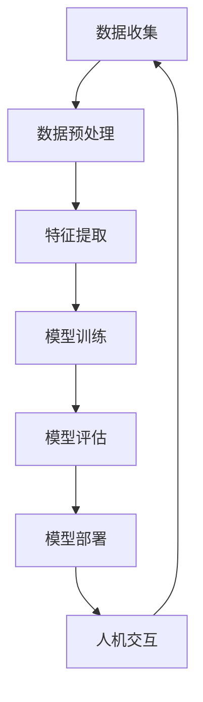

                 

# AI与人类的未来互动与合作

> **关键词**：人工智能、人类、未来、合作、互动、技术发展、社会影响
>
> **摘要**：本文将探讨人工智能与人类在未来互动与合作中的角色与影响。我们将从背景介绍开始，逐步深入分析核心概念、算法原理、数学模型、实际应用场景，并提出相关工具和资源推荐，最后总结未来发展趋势与挑战，并回答常见问题。

## 1. 背景介绍

### 1.1 目的和范围

本文旨在探讨人工智能（AI）在未来的发展中与人类的互动与合作。随着技术的不断进步，AI已经渗透到我们生活的方方面面，从智能家居到自动驾驶，再到医疗健康和金融分析，AI的应用场景日益广泛。本文将重点关注AI与人类在未来的互动与合作，分析其潜在的积极与消极影响，并探讨如何最大化AI的优势，同时减少其可能带来的风险。

### 1.2 预期读者

本文预期读者包括AI领域的研究人员、开发者、决策者以及对AI技术感兴趣的普通读者。文章将使用通俗易懂的语言，但涉及的技术概念将较为深入，因此建议读者具备一定的计算机科学和人工智能基础知识。

### 1.3 文档结构概述

本文结构如下：

1. **背景介绍**：介绍文章的目的、范围和预期读者。
2. **核心概念与联系**：介绍人工智能的核心概念及其与人类互动的流程图。
3. **核心算法原理 & 具体操作步骤**：详细讲解AI的核心算法原理。
4. **数学模型和公式 & 详细讲解 & 举例说明**：介绍与AI相关的数学模型。
5. **项目实战：代码实际案例和详细解释说明**：提供实际代码案例。
6. **实际应用场景**：分析AI在不同领域的应用。
7. **工具和资源推荐**：推荐学习资源、开发工具和框架。
8. **总结：未来发展趋势与挑战**：总结AI与人类未来互动与合作的前景。
9. **附录：常见问题与解答**：解答读者可能关心的问题。
10. **扩展阅读 & 参考资料**：提供进一步阅读的材料。

### 1.4 术语表

#### 1.4.1 核心术语定义

- **人工智能（AI）**：指模拟人类智能的计算机系统，具有学习、推理、决策和问题解决能力。
- **机器学习（ML）**：AI的一个分支，通过数据和算法让计算机自行学习和改进。
- **深度学习（DL）**：一种基于神经网络的机器学习技术，通过多层神经网络处理复杂数据。
- **神经网络（NN）**：模拟生物神经系统的计算模型，用于特征提取和分类。
- **大数据（Big Data）**：海量数据的存储、管理和分析技术。

#### 1.4.2 相关概念解释

- **数据驱动决策**：通过数据分析来做出决策，而非仅仅依靠经验和直觉。
- **人机交互（HCI）**：研究如何设计用户与计算机系统的交互，以提高用户体验。

#### 1.4.3 缩略词列表

- **AI**：人工智能
- **ML**：机器学习
- **DL**：深度学习
- **NN**：神经网络
- **HCI**：人机交互

## 2. 核心概念与联系

为了更好地理解AI与人类的互动与合作，我们首先需要了解一些核心概念及其相互关系。以下是一个简化的Mermaid流程图，用于展示这些核心概念之间的联系：



### 2.1 数据收集

数据是AI系统的基石。通过数据收集，我们可以获取到关于各种现象和问题的信息，为后续的机器学习和深度学习提供训练数据。

### 2.2 数据预处理

收集到的数据往往是不完整、不干净和噪声的。数据预处理包括数据清洗、去噪、缺失值处理和归一化等步骤，以确保数据的质量。

### 2.3 特征提取

特征提取是从原始数据中提取出具有代表性的信息，用于后续的模型训练。一个好的特征提取方法能够显著提高模型的性能。

### 2.4 模型训练

模型训练是AI系统的核心步骤，通过不断调整模型的参数，使其能够更好地拟合训练数据。常见的训练方法包括梯度下降、反向传播等。

### 2.5 模型评估

模型评估用于衡量模型的性能，常见的评估指标包括准确率、召回率、F1分数等。通过评估，我们可以选择最优的模型进行部署。

### 2.6 模型部署

模型部署是将训练好的模型应用到实际场景中，如自动化决策系统、推荐系统等。模型部署需要考虑系统的实时性、可扩展性和可靠性。

### 2.7 人机交互

人机交互是AI系统与用户之间的重要桥梁。通过人机交互，用户可以与AI系统进行沟通，获取信息或者执行任务。良好的交互设计可以提高用户体验。

### 2.8 数据收集（反馈循环）

在模型部署后，AI系统会不断收集用户反馈和新的数据，形成反馈循环。这些反馈和数据将被用于进一步的模型训练和优化，从而实现持续改进。

## 3. 核心算法原理 & 具体操作步骤

### 3.1 机器学习算法

机器学习算法是AI系统的核心组成部分，负责从数据中学习并提取规律。以下是一个简化的机器学习算法的伪代码：

```plaintext
初始化模型参数
while (未达到训练次数或误差未满足要求) {
    计算损失函数值
    计算梯度
    更新模型参数
}
```

### 3.2 梯度下降算法

梯度下降是机器学习中最常用的优化算法之一。以下是一个简单的梯度下降算法的伪代码：

```plaintext
初始化学习率
while (未达到迭代次数) {
    计算当前损失函数值
    计算梯度
    更新模型参数：θ = θ - 学习率 * 梯度
}
```

### 3.3 反向传播算法

反向传播算法是深度学习中的核心算法，用于计算模型参数的梯度。以下是一个简化的反向传播算法的伪代码：

```plaintext
前向传播：计算输出值
计算损失函数值
反向传播：计算梯度
更新模型参数
```

## 4. 数学模型和公式 & 详细讲解 & 举例说明

### 4.1 损失函数

损失函数是机器学习中衡量模型性能的重要工具。以下是一个常见的平方误差损失函数的公式：

$$
L(\theta) = \frac{1}{2m} \sum_{i=1}^{m} (h_{\theta}(x^{(i)}) - y^{(i)})^2
$$

其中，$h_{\theta}(x)$ 表示模型输出，$y^{(i)}$ 表示实际标签，$m$ 表示样本数量。

### 4.2 梯度下降

梯度下降是一种优化算法，用于调整模型参数以最小化损失函数。以下是一个梯度下降的示例：

$$
\theta_{j} := \theta_{j} - \alpha \frac{\partial L(\theta)}{\partial \theta_{j}}
$$

其中，$\alpha$ 表示学习率，$\frac{\partial L(\theta)}{\partial \theta_{j}}$ 表示损失函数关于参数 $\theta_{j}$ 的梯度。

### 4.3 反向传播

反向传播是一种用于计算神经网络中参数梯度的算法。以下是一个简化的反向传播示例：

$$
\frac{\partial L(\theta)}{\partial \theta} = \frac{\partial L}{\partial z} \cdot \frac{\partial z}{\partial \theta}
$$

其中，$z$ 表示网络中的中间变量，$\frac{\partial L}{\partial z}$ 和 $\frac{\partial z}{\partial \theta}$ 分别表示损失函数关于 $z$ 和参数 $\theta$ 的梯度。

## 5. 项目实战：代码实际案例和详细解释说明

### 5.1 开发环境搭建

在开始实际项目之前，我们需要搭建一个开发环境。以下是搭建一个简单的Python开发环境所需的步骤：

1. 安装Python（推荐使用Python 3.8及以上版本）。
2. 安装Jupyter Notebook，用于编写和运行Python代码。
3. 安装必要的库，如NumPy、Pandas、Scikit-learn等。

### 5.2 源代码详细实现和代码解读

以下是一个简单的线性回归模型的实现，用于预测房价：

```python
import numpy as np
import pandas as pd
from sklearn.model_selection import train_test_split
from sklearn.linear_model import LinearRegression

# 5.2.1 数据加载
data = pd.read_csv("house_prices.csv")
X = data["square_feet"].values.reshape(-1, 1)
y = data["price"].values

# 5.2.2 数据预处理
X_train, X_test, y_train, y_test = train_test_split(X, y, test_size=0.2, random_state=42)

# 5.2.3 模型训练
model = LinearRegression()
model.fit(X_train, y_train)

# 5.2.4 模型评估
score = model.score(X_test, y_test)
print("模型准确率：", score)

# 5.2.5 预测
predicted_price = model.predict(X_test)
print("预测价格：", predicted_price)
```

### 5.3 代码解读与分析

上述代码分为几个主要部分：

- **数据加载**：使用Pandas库读取CSV格式的数据。
- **数据预处理**：将数据集划分为训练集和测试集，以便进行模型训练和评估。
- **模型训练**：使用Scikit-learn中的线性回归模型对训练数据进行训练。
- **模型评估**：计算模型在测试集上的准确率，以评估模型性能。
- **预测**：使用训练好的模型对测试数据进行预测。

通过以上步骤，我们可以看到如何使用Python和Scikit-learn库来实现一个简单的线性回归模型。这种模型可以用于预测房屋价格，从而为房地产市场提供有价值的信息。

## 6. 实际应用场景

AI技术已经在许多领域得到广泛应用，以下是一些典型的实际应用场景：

- **医疗健康**：AI可以用于医学图像分析、疾病预测和个性化治疗方案制定。
- **金融**：AI在风险管理、投资策略制定和欺诈检测等方面发挥着重要作用。
- **交通**：自动驾驶汽车和智能交通系统利用AI技术提高交通效率和安全性。
- **教育**：AI可以用于个性化教学、智能辅导和自动化考试评分。
- **零售**：AI用于库存管理、个性化推荐和顾客行为分析，以提高销售额和顾客满意度。

## 7. 工具和资源推荐

### 7.1 学习资源推荐

#### 7.1.1 书籍推荐

- 《人工智能：一种现代方法》
- 《深度学习》
- 《Python机器学习》

#### 7.1.2 在线课程

- Coursera的“机器学习”课程
- edX的“深度学习基础”课程
- Udacity的“自动驾驶汽车工程师”课程

#### 7.1.3 技术博客和网站

- Medium上的机器学习和AI博客
- AI Journal
- Towards Data Science

### 7.2 开发工具框架推荐

#### 7.2.1 IDE和编辑器

- PyCharm
- Jupyter Notebook
- VS Code

#### 7.2.2 调试和性能分析工具

- Debugger
- Profiler
- AI Performance Analyzer

#### 7.2.3 相关框架和库

- TensorFlow
- PyTorch
- Scikit-learn

### 7.3 相关论文著作推荐

#### 7.3.1 经典论文

- “A Learning Algorithm for Continually Running Fully Recurrent Neural Networks”
- “Deep Learning”
- “The Unreasonable Effectiveness of Deep Learning”

#### 7.3.2 最新研究成果

- “Natural Language Inference with External Knowledge”
- “Generative Adversarial Networks”
- “Distributed Deep Learning”

#### 7.3.3 应用案例分析

- “AI in Healthcare: The Future Is Now”
- “AI in Finance: Transforming the Industry”
- “AI in Retail: Revolutionizing Customer Experience”

## 8. 总结：未来发展趋势与挑战

随着AI技术的不断进步，我们可以预见其在未来的发展中将与人类形成更紧密的互动与合作。一方面，AI将能够承担更多重复性、繁琐的工作，提高工作效率和质量；另一方面，AI也将成为人类决策的重要辅助工具，帮助我们在复杂的环境中做出更明智的决策。

然而，AI的发展也面临诸多挑战。首先，AI的伦理和道德问题需要得到重视，确保AI的发展符合人类的利益和价值观。其次，AI技术的普及和应用需要解决数据隐私和安全问题，以避免数据滥用和隐私泄露。此外，AI技术的发展还需要解决算法偏见和公平性问题，确保AI系统能够公正地对待每个人。

总之，AI与人类的未来互动与合作前景广阔，但也需要我们共同努力解决相关问题，以实现AI的最大化价值。

## 9. 附录：常见问题与解答

### 9.1 什么是机器学习？

机器学习是一种让计算机通过数据和算法自主学习的方法。它使计算机能够在没有明确编程的情况下，通过分析大量数据来发现规律和模式，并在此基础上进行预测和决策。

### 9.2 深度学习和神经网络有什么区别？

深度学习是机器学习的一个分支，它使用多层神经网络来处理复杂数据。神经网络是一种计算模型，由大量相互连接的节点（或神经元）组成，用于特征提取和分类。

### 9.3 AI技术有哪些应用场景？

AI技术的应用场景非常广泛，包括医疗健康、金融、交通、教育、零售等各个领域。例如，在医疗健康领域，AI可以用于疾病预测和医学图像分析；在金融领域，AI可以用于风险管理、投资策略和欺诈检测。

### 9.4 AI技术是否会取代人类？

AI技术本身没有意识，不能完全取代人类。然而，AI可以在许多方面辅助人类，提高工作效率和质量。在未来，AI与人类将形成更紧密的互动与合作，共同推动社会进步。

## 10. 扩展阅读 & 参考资料

- Bengio, Y., Courville, A., & Vincent, P. (2013). Representation learning: A review and new perspectives. IEEE Transactions on Pattern Analysis and Machine Intelligence, 35(8), 1798-1828.
- Russell, S., & Norvig, P. (2016). Artificial Intelligence: A Modern Approach (3rd ed.). Prentice Hall.
- Goodfellow, I., Bengio, Y., & Courville, A. (2016). Deep Learning. MIT Press.
-lec

