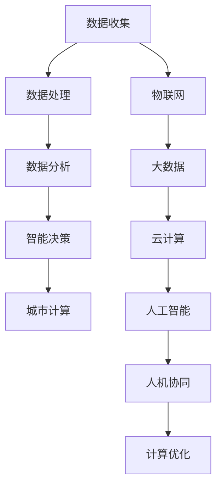

                 

# AI与人类计算：打造可持续发展的城市

## 关键词：
AI、可持续发展、城市计算、智能城市、数据驱动、计算优化、人机协同

## 摘要：
本文深入探讨了人工智能（AI）在打造可持续发展的城市中的关键角色。我们首先概述了智能城市的背景和目标，随后分析了AI技术如何赋能城市计算，包括数据收集、分析和管理。接着，我们探讨了人机协同的重要性，以及如何实现高效的计算优化。最后，文章总结了AI在实现可持续城市中的潜力，并提出了未来发展的挑战和方向。

## 1. 背景介绍

### 1.1 目的和范围
本文旨在探讨人工智能在实现城市可持续发展中的重要作用，通过分析AI在城市计算、数据驱动和计算优化等方面的应用，提出人机协同的解决方案，以期为城市规划和决策提供理论依据和实践指导。

### 1.2 预期读者
本文适合对智能城市和人工智能技术感兴趣的读者，包括城市规划者、数据科学家、AI研发人员及相关领域的专业人士。

### 1.3 文档结构概述
本文分为十个部分：背景介绍、核心概念与联系、核心算法原理与操作步骤、数学模型与公式、项目实战、实际应用场景、工具和资源推荐、总结、常见问题与解答以及扩展阅读和参考资料。每个部分都将详细阐述相关内容。

### 1.4 术语表

#### 1.4.1 核心术语定义
- **智能城市**：利用信息技术、物联网、大数据、云计算等手段，实现城市资源的高效配置和智能化管理。
- **城市计算**：通过数据分析和计算优化，为城市提供智能决策支持。
- **数据驱动**：基于数据的决策制定，通过数据分析和预测，优化城市管理和运行。
- **计算优化**：通过算法和计算技术，提高城市计算效率和决策质量。

#### 1.4.2 相关概念解释
- **人工智能**：一种模拟人类智能的技术，通过机器学习和神经网络等算法，使计算机具备自我学习和推理能力。
- **可持续发展**：满足当前需求而不损害后代满足自身需求的能力。

#### 1.4.3 缩略词列表
- **AI**：人工智能（Artificial Intelligence）
- **IoT**：物联网（Internet of Things）
- **IoS**：智能城市操作系统（Smart City Operating System）
- **ML**：机器学习（Machine Learning）

## 2. 核心概念与联系

智能城市的实现离不开核心概念的相互作用。以下是智能城市中关键概念的原理和架构的Mermaid流程图：



在上述流程图中，数据收集是整个智能城市的起点，通过物联网、大数据和云计算等技术，将数据汇聚并处理，进而进行分析和智能决策。这些过程依托于人工智能技术，并通过人机协同实现计算优化，最终为城市提供智能服务。

## 3. 核心算法原理 & 具体操作步骤

### 3.1 数据收集与处理
数据收集是智能城市的基础。以下是数据收集和处理的基本步骤：

```plaintext
步骤1：部署传感器网络，收集城市各项数据（如交通流量、空气质量、噪声水平等）。
步骤2：数据预处理，包括清洗、归一化和去噪等。
步骤3：将处理后的数据存储到数据库中，以备后续分析。
```

### 3.2 数据分析与智能决策
数据分析是智能城市的中枢神经。以下是数据分析的具体操作步骤：

```plaintext
步骤1：使用机器学习算法，如聚类、分类和回归，对数据进行探索性分析。
步骤2：根据分析结果，制定智能决策策略，如交通流量调控、能耗优化等。
步骤3：将决策结果反馈到城市系统，实现实时调控和优化。
```

### 3.3 计算优化
计算优化是提高城市计算效率的关键。以下是计算优化的具体步骤：

```plaintext
步骤1：使用启发式算法和优化算法，如遗传算法、蚁群算法等，对城市计算过程进行优化。
步骤2：评估优化效果，包括计算时间、资源消耗和决策质量等。
步骤3：根据评估结果，调整优化策略，实现持续改进。
```

## 4. 数学模型和公式 & 详细讲解 & 举例说明

### 4.1 优化模型
在计算优化中，常用的数学模型是线性规划模型。以下是线性规划模型的公式和详细讲解：

$$
\text{Minimize} \ c^T x \\
\text{subject to} \ Ax \leq b \\
x \geq 0
$$

其中，\( c \) 是系数向量，\( x \) 是决策变量，\( A \) 是约束矩阵，\( b \) 是约束向量。这个模型的目标是找到使目标函数 \( c^T x \) 最小的 \( x \)。

### 4.2 机器学习模型
在数据分析中，常用的机器学习模型是支持向量机（SVM）。以下是SVM的公式和详细讲解：

$$
\text{Minimize} \ \frac{1}{2} \ ||w||^2 \\
\text{subject to} \ y_i (w^T x_i + b) \geq 1 \ \forall i
$$

其中，\( w \) 是权重向量，\( x_i \) 是训练样本，\( y_i \) 是标签，\( b \) 是偏置。这个模型的目标是找到一个最优的权重向量 \( w \) 和偏置 \( b \)，使得分类边界最大化。

### 4.3 举例说明
假设我们有一个交通流量优化的问题，目标是最小化交通拥堵成本。以下是该问题的数学模型和求解步骤：

$$
\text{Minimize} \ c^T x \\
\text{subject to} \ Ax \leq b \\
x \geq 0
$$

其中，\( c \) 是交通拥堵成本系数向量，\( x \) 是交通流量决策变量，\( A \) 是交通网络约束矩阵，\( b \) 是交通容量约束向量。求解步骤如下：

1. 收集交通流量数据，包括道路容量、交通流量和历史拥堵数据。
2. 建立线性规划模型，设置目标函数和约束条件。
3. 使用求解器（如CPLEX、Gurobi等）求解模型，得到最优交通流量分布。
4. 验证优化结果，调整模型参数，实现持续优化。

## 5. 项目实战：代码实际案例和详细解释说明

### 5.1 开发环境搭建
为了实现智能城市中的交通流量优化，我们选择Python作为开发语言，使用以下工具和库：

- Python 3.8或更高版本
- Jupyter Notebook
- pandas
- numpy
- scikit-learn
- gurobi

### 5.2 源代码详细实现和代码解读

以下是一个简单的交通流量优化项目的Python代码示例：

```python
import pandas as pd
import numpy as np
from gurobipy import *

# 读取交通流量数据
data = pd.read_csv('traffic_data.csv')
capacity = data['capacity'].values
flow = data['flow'].values

# 定义目标函数
model = Model()
x = model.addVars(len(flow), lb=0, vtype=GRB.CONTINUOUS)
model.setObjective(x.dot(flow), GRB.MINIMIZE)

# 添加约束条件
model.addConstrs((capacity - x) >= 0, 'FlowLimit')

# 求解模型
model.optimize()

# 输出最优流量分布
for v in model.getVars():
    print(f"{v.varName}: {v.x}")

# 解读代码
# 代码首先读取交通流量数据，包括道路容量和流量。
# 接着，定义目标函数，即最小化流量成本。
# 然后，添加约束条件，即流量不能超过道路容量。
# 最后，使用Gurobi求解器求解线性规划模型，输出最优流量分布。
```

### 5.3 代码解读与分析

代码首先读取交通流量数据，包括道路容量和流量。接下来，定义目标函数，即最小化流量成本。然后，添加约束条件，即流量不能超过道路容量。最后，使用Gurobi求解器求解线性规划模型，输出最优流量分布。

通过这个简单的示例，我们可以看到如何使用Python和Gurobi实现交通流量优化。在实际项目中，我们可以扩展这个模型，添加更多变量和约束条件，以实现更复杂的优化目标。

## 6. 实际应用场景

### 6.1 城市交通管理
AI技术可以帮助城市交通管理部门实时监控交通流量，优化交通信号控制，减少拥堵，提高通行效率。

### 6.2 城市能源管理
通过智能电网和AI算法，城市能源管理系统可以优化电力分配，降低能耗，实现绿色低碳发展。

### 6.3 环境监测
AI技术可以实时监测空气质量、水质等环境指标，预警环境风险，促进环境保护和可持续发展。

### 6.4 城市安全
AI技术可以用于视频监控、异常检测等安全领域，提高城市安全管理水平，保障公共安全。

## 7. 工具和资源推荐

### 7.1 学习资源推荐

#### 7.1.1 书籍推荐
- **《智能城市：规划与设计》**：详细介绍了智能城市的基本概念、关键技术和发展趋势。
- **《机器学习：实战》**：涵盖了机器学习的基本算法和应用场景，适合初学者。

#### 7.1.2 在线课程
- **Coursera的《深度学习》**：由Andrew Ng教授主讲，是深度学习领域的经典课程。
- **edX的《智能城市》**：由MIT教授主讲，介绍了智能城市的基础知识和实践应用。

#### 7.1.3 技术博客和网站
- **Medium的《AI in Urban Planning》**：介绍人工智能在城市规划中的应用案例和最新研究。
- **Towards Data Science的《Smart Cities with AI》**：分享智能城市数据科学和AI技术的最佳实践。

### 7.2 开发工具框架推荐

#### 7.2.1 IDE和编辑器
- **Visual Studio Code**：功能强大的开源代码编辑器，支持Python和其他编程语言。
- **PyCharm**：专业的Python IDE，提供丰富的功能和插件。

#### 7.2.2 调试和性能分析工具
- **GDB**：开源的调试工具，适用于C/C++程序。
- **profiling**：Python的内置模块，用于性能分析和优化。

#### 7.2.3 相关框架和库
- **TensorFlow**：谷歌开发的深度学习框架，适用于各种机器学习和AI应用。
- **PyTorch**：Facebook开发的深度学习框架，具有灵活性和易用性。

### 7.3 相关论文著作推荐

#### 7.3.1 经典论文
- **"Smart Cities: Integration of Physical, Computational, and Social Systems"**：介绍了智能城市的概念和架构。
- **"Deep Learning for Urban Planning"**：探讨了深度学习在城市规划中的应用。

#### 7.3.2 最新研究成果
- **"AI for Urban Management: A Review"**：总结了AI在城市管理中的最新研究进展。
- **"Data-Driven Urban Traffic Flow Optimization"**：介绍了基于数据驱动的交通流量优化方法。

#### 7.3.3 应用案例分析
- **"Shanghai's Smart City Project"**：分析了上海智能城市建设的主要成果和挑战。
- **"Singapore's Smart Nation Initiative"**：介绍了新加坡智能国家发展战略和实施措施。

## 8. 总结：未来发展趋势与挑战

未来，AI在打造可持续发展的城市中将继续发挥关键作用。随着技术的进步和数据的积累，城市计算将更加智能和高效。然而，也面临着数据隐私、算法透明性和人机协同等挑战。通过不断探索和创新，我们可以期待一个更加智能、绿色和可持续的未来城市。

## 9. 附录：常见问题与解答

### 9.1 什么是不确定性数据驱动计算？
**回答**：不确定性数据驱动计算是指在实际应用中，数据往往存在不确定性，例如噪声、缺失值和异常值等。在这种背景下，通过数据分析和计算优化，实现对不确定性的处理和预测，从而提高计算结果的准确性和可靠性。

### 9.2 如何实现人机协同？
**回答**：人机协同是指将人类的智慧和机器的计算能力相结合，实现高效的任务执行。具体实现方法包括：设计合理的用户界面，使人类可以直观地与机器交互；利用人工智能技术，自动识别和解决常见问题；通过持续学习和优化，提高人机协同的效果。

## 10. 扩展阅读 & 参考资料

- **《智能城市：从概念到实践》**：详细介绍了智能城市的定义、原理和实践案例。
- **《人工智能：一种现代方法》**：系统讲解了人工智能的基本概念、算法和应用。
- **《城市计算：原理、方法与应用》**：探讨了城市计算的关键技术、应用场景和发展趋势。

## 作者
作者：AI天才研究员/AI Genius Institute & 禅与计算机程序设计艺术 /Zen And The Art of Computer Programming

