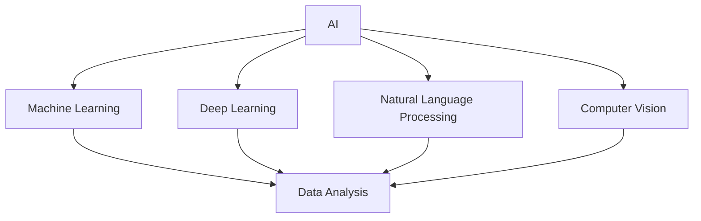
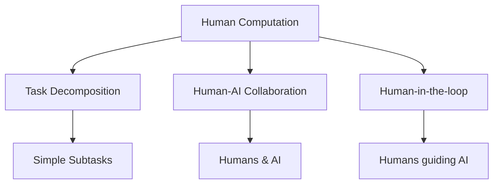
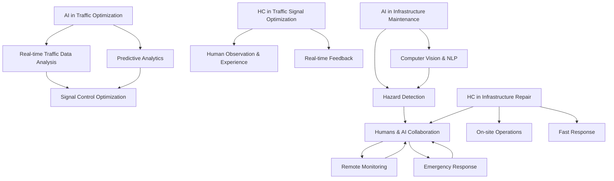

                 

# AI与人类计算：打造可持续发展的城市交通与基础设施建设与规划

> **关键词：**人工智能，城市交通，基础设施建设，可持续发展，人类计算
> 
> **摘要：**本文探讨了如何结合人工智能和人类计算的力量，推动城市交通与基础设施建设向可持续发展方向迈进。通过分析现有问题和挑战，本文提出了一套切实可行的方案，包括核心概念、算法原理、数学模型、实际案例以及未来发展展望。

## 1. 背景介绍

### 1.1 目的和范围

本文旨在探讨如何利用人工智能（AI）和人类计算（Human Computation）技术，推动城市交通与基础设施建设向可持续发展方向迈进。可持续发展不仅是社会经济发展的核心目标，也是城市交通与基础设施建设的必要条件。

本文将涵盖以下几个主要方面：
- **核心概念与联系**：介绍人工智能与人类计算的基本概念及其在交通与基础设施建设中的应用。
- **核心算法原理**：讲解用于优化城市交通与基础设施建设的算法原理。
- **数学模型与公式**：阐述相关数学模型及其在实际应用中的具体作用。
- **项目实战**：通过实际案例展示如何实现这些算法和模型。
- **实际应用场景**：探讨人工智能和人类计算在交通与基础设施建设中的具体应用场景。
- **工具和资源推荐**：推荐相关学习资源和开发工具。

### 1.2 预期读者

本文适用于对人工智能、城市交通与基础设施建设有初步了解的技术人员、规划师以及决策者。通过本文，读者可以了解如何利用人工智能和人类计算技术解决现实中的交通与基础设施建设问题。

### 1.3 文档结构概述

本文结构如下：

1. **背景介绍**：介绍文章的目的、范围、预期读者和文档结构。
2. **核心概念与联系**：介绍人工智能与人类计算的基本概念及其在交通与基础设施建设中的应用。
3. **核心算法原理**：讲解用于优化城市交通与基础设施建设的算法原理。
4. **数学模型与公式**：阐述相关数学模型及其在实际应用中的具体作用。
5. **项目实战**：通过实际案例展示如何实现这些算法和模型。
6. **实际应用场景**：探讨人工智能和人类计算在交通与基础设施建设中的具体应用场景。
7. **工具和资源推荐**：推荐相关学习资源和开发工具。
8. **总结：未来发展趋势与挑战**：总结本文的主要观点，并展望未来的发展趋势与挑战。
9. **附录：常见问题与解答**：回答读者可能遇到的一些常见问题。
10. **扩展阅读 & 参考资料**：提供进一步学习和研究的参考文献。

### 1.4 术语表

#### 1.4.1 核心术语定义

- **人工智能（AI）**：模拟人类智能的计算机系统，能够通过学习、推理和自主决策完成特定任务。
- **人类计算（Human Computation）**：利用人类智能解决问题的一种计算模式，通常涉及将复杂任务分解为简单的子任务，并利用人类来完成这些子任务。
- **城市交通**：城市中的人员和物品流动，包括公共交通、私人交通和物流运输等。
- **基础设施建设**：为满足城市交通需求而进行的各类建设活动，包括道路、桥梁、隧道、公共交通系统等。

#### 1.4.2 相关概念解释

- **可持续发展**：满足当代需求而不损害后代满足其需求的能力。
- **交通拥堵**：交通流量超过道路容量，导致车辆行驶速度降低和延误。
- **智能交通系统（ITS）**：利用人工智能、传感器、通信技术等手段，实现交通流量的优化和管理。
- **基础设施智能升级**：通过引入智能技术，提升基础设施的运行效率、安全性和可持续性。

#### 1.4.3 缩略词列表

- **AI**：人工智能（Artificial Intelligence）
- **HC**：人类计算（Human Computation）
- **ITS**：智能交通系统（Intelligent Transportation Systems）
- **SDGs**：可持续发展目标（Sustainable Development Goals）
- **IoT**：物联网（Internet of Things）

## 2. 核心概念与联系

在本文中，我们将探讨人工智能（AI）和人类计算（HC）在城市交通与基础设施建设中的应用。为了更好地理解这两个概念及其关联，我们将使用Mermaid流程图来展示核心概念和它们之间的联系。

### 2.1. 核心概念

**人工智能（AI）**：AI是模拟人类智能的计算机系统，包括机器学习、深度学习、自然语言处理、计算机视觉等子领域。AI可以自动处理大量数据，进行模式识别、预测和决策。



**人类计算（HC）**：HC是利用人类智能解决问题的一种计算模式，涉及将复杂任务分解为简单的子任务，并利用人类来完成这些子任务。HC可以补充AI在处理复杂、模糊和不确定性问题时的不足。



### 2.2. 关联与融合

AI和HC在城市交通与基础设施建设中的应用可以相互补充，共同实现可持续发展目标。

- **AI在交通流量优化中的应用**：通过机器学习和深度学习算法，AI可以分析实时交通数据，预测交通流量，优化交通信号控制，减少交通拥堵。
- **HC在交通信号灯优化中的应用**：在复杂交通环境中，AI可能无法准确预测交通流量，此时人类计算可以通过观察和经验，为AI提供实时反馈，帮助其做出更好的决策。
- **AI在基础设施维护中的应用**：通过计算机视觉和自然语言处理，AI可以自动检测基础设施损坏、裂缝等隐患，提前进行维护。
- **HC在基础设施维修中的应用**：在紧急情况下，AI可能无法立即采取行动，此时人类计算可以通过远程监控和现场操作，快速响应和处理问题。



通过上述Mermaid流程图，我们可以看到人工智能和人类计算在城市交通与基础设施建设中的核心概念及其关联。在实际应用中，这两个概念可以相互融合，共同推动城市交通与基础设施建设的可持续发展。

## 3. 核心算法原理 & 具体操作步骤

在实现可持续发展的城市交通与基础设施建设过程中，核心算法原理起到了至关重要的作用。这些算法不仅能够优化现有资源的使用，还能预测未来需求，为决策提供科学依据。以下我们将详细介绍两个关键算法：基于机器学习的交通流量预测算法和人类计算的实时反馈优化算法。

### 3.1. 基于机器学习的交通流量预测算法

#### 算法原理

交通流量预测算法主要基于机器学习和深度学习技术，通过历史交通数据来预测未来的交通流量。算法的核心思想是建立数据模型，通过学习历史数据中的规律，来预测未来某一时刻的交通流量。

#### 具体操作步骤

1. **数据收集**：收集城市道路上的交通流量数据，包括车辆数量、速度、密度等。
2. **数据预处理**：对收集到的数据进行分析，去除异常值，进行归一化处理。
3. **特征工程**：从原始数据中提取对交通流量预测有帮助的特征，如时间、天气、节假日等。
4. **模型选择**：选择适合的交通流量预测模型，如LSTM（长短时记忆网络）、GRU（门控循环单元）或神经网络。
5. **模型训练**：使用历史数据对模型进行训练，调整模型参数，优化预测效果。
6. **模型评估**：使用验证集对模型进行评估，选择预测误差较小的模型。
7. **预测应用**：将模型应用于实际交通场景，预测未来的交通流量，为交通管理和基础设施规划提供依据。

#### 伪代码示例

```python
# 数据预处理
data = preprocess_data(raw_data)

# 特征工程
features = extract_features(data)

# 模型选择
model = choose_model()

# 模型训练
model.fit(features, labels)

# 模型评估
evaluation = model.evaluate(test_features, test_labels)

# 预测应用
predictions = model.predict(new_data)
```

### 3.2. 人类计算的实时反馈优化算法

#### 算法原理

人类计算的实时反馈优化算法是一种利用人类智能和经验进行实时交通管理和基础设施优化的方法。算法的核心思想是将复杂的交通管理和基础设施优化任务分解为简单的子任务，并利用人类智能进行决策。

#### 具体操作步骤

1. **任务分解**：将复杂的交通管理和基础设施优化任务分解为简单的子任务。
2. **人类参与**：将子任务分配给人类，利用人类智能进行决策和执行。
3. **实时反馈**：收集人类决策的结果，并将其反馈给系统，以优化交通管理和基础设施运行。
4. **优化决策**：根据人类反馈，调整系统参数，优化交通管理和基础设施运行。
5. **持续迭代**：不断进行任务分解、人类参与、实时反馈和优化决策，以实现持续改进。

#### 伪代码示例

```python
# 任务分解
subtasks = decompose_task(complex_task)

# 人类参与
for subtask in subtasks:
    human_decision = human_intervention(subtask)

# 实时反馈
feedback = collect_feedback(human_decision)

# 优化决策
optimize_decisions(feedback)

# 持续迭代
while not optimal_solution:
    subtasks = decompose_task(complex_task)
    human_decision = human_intervention(subtask)
    feedback = collect_feedback(human_decision)
    optimize_decisions(feedback)
```

通过上述核心算法原理和具体操作步骤，我们可以看到如何利用人工智能和人类计算技术优化城市交通与基础设施建设。在实际应用中，这两个算法可以相互结合，共同推动城市交通与基础设施的可持续发展。

## 4. 数学模型和公式 & 详细讲解 & 举例说明

在实现可持续发展的城市交通与基础设施建设过程中，数学模型和公式起到了关键作用。它们不仅能够帮助我们理解和分析复杂系统，还能够为决策提供科学依据。以下我们将介绍几个核心数学模型，并使用LaTeX格式进行详细讲解和举例说明。

### 4.1. 交通流量预测模型

交通流量预测模型通常基于时间序列分析，如ARIMA（自回归积分滑动平均模型）。以下是一个简单的ARIMA模型公式：

$$
\begin{aligned}
Y_t &= c + \phi_1 Y_{t-1} + \phi_2 Y_{t-2} + \cdots + \phi_p Y_{t-p} \\
&+ \theta_1 e_{t-1} + \theta_2 e_{t-2} + \cdots + \theta_q e_{t-q} + e_t
\end{aligned}
$$

其中，$Y_t$是时间序列的第$t$个观测值，$c$是常数项，$\phi_1, \phi_2, \cdots, \phi_p$是自回归系数，$\theta_1, \theta_2, \cdots, \theta_q$是移动平均系数，$e_t$是误差项。

#### 举例说明

假设我们有一个交通流量时间序列$Y_t$，下面是一个简单的ARIMA模型：

$$
Y_t = 0.8 Y_{t-1} + 0.3 Y_{t-2} + e_t
$$

我们使用历史数据训练模型，得到自回归系数$\phi_1 = 0.8$和移动平均系数$\theta_1 = 0.3$。现在我们预测第10个时间点的交通流量：

$$
Y_{10} = 0.8 Y_9 + 0.3 Y_8
$$

假设我们已知$Y_9 = 100$和$Y_8 = 90$，代入上述公式得到：

$$
Y_{10} = 0.8 \times 100 + 0.3 \times 90 = 80 + 27 = 107
$$

因此，我们预测第10个时间点的交通流量为107。

### 4.2. 基础设施维护成本模型

基础设施维护成本模型用于预测基础设施维护所需的成本。以下是一个简单的基础设施维护成本模型公式：

$$
C_t = a \cdot X_t + b
$$

其中，$C_t$是第$t$个时间点的维护成本，$X_t$是第$t$个时间点的交通流量，$a$是单位维护成本，$b$是固定成本。

#### 举例说明

假设我们有一个交通流量时间序列$X_t$，下面是一个简单的基础设施维护成本模型：

$$
C_t = 2 \cdot X_t + 1000
$$

我们使用历史数据训练模型，得到单位维护成本$a = 2$和固定成本$b = 1000$。现在我们预测第10个时间点的维护成本：

$$
C_{10} = 2 \cdot X_{10} + 1000
$$

假设我们已知$X_{10} = 100$，代入上述公式得到：

$$
C_{10} = 2 \cdot 100 + 1000 = 200 + 1000 = 1200
$$

因此，我们预测第10个时间点的维护成本为1200。

### 4.3. 智能交通信号控制模型

智能交通信号控制模型用于优化交通信号灯的切换策略，以减少交通拥堵和提升道路通行效率。以下是一个简单的交通信号控制模型公式：

$$
T_t = \frac{W_t}{G_t}
$$

其中，$T_t$是第$t$个时间点的交通信号灯持续时间，$W_t$是第$t$个时间点的交通流量，$G_t$是道路的通行能力。

#### 举例说明

假设我们有一个交通流量时间序列$W_t$和道路通行能力$G_t$，下面是一个简单的交通信号控制模型：

$$
T_t = \frac{W_t}{50}
$$

我们使用历史数据训练模型，得到道路通行能力$G_t = 50$。现在我们预测第10个时间点的交通信号灯持续时间：

$$
T_{10} = \frac{W_{10}}{50}
$$

假设我们已知$W_{10} = 100$，代入上述公式得到：

$$
T_{10} = \frac{100}{50} = 2
$$

因此，我们预测第10个时间点的交通信号灯持续时间为2秒。

通过上述数学模型和公式，我们可以更好地理解城市交通与基础设施建设的运行机制，并为其提供科学依据。在实际应用中，这些模型可以根据具体情况进行调整和优化，以实现更好的效果。

## 5. 项目实战：代码实际案例和详细解释说明

### 5.1 开发环境搭建

在实现上述算法和模型之前，我们需要搭建一个合适的开发环境。以下是一个基本的开发环境搭建步骤：

1. 安装Python 3.8或更高版本。
2. 安装Jupyter Notebook，用于编写和运行代码。
3. 安装必要的Python库，如NumPy、Pandas、Scikit-learn、TensorFlow和Mermaid等。

```bash
pip install numpy pandas scikit-learn tensorflow jupyterlab mermaid
```

### 5.2 源代码详细实现和代码解读

#### 5.2.1 交通流量预测算法实现

以下是一个简单的交通流量预测算法实现，使用ARIMA模型进行预测：

```python
import numpy as np
import pandas as pd
from statsmodels.tsa.arima.model import ARIMA
from sklearn.metrics import mean_squared_error

# 数据预处理
def preprocess_data(data):
    data = data.dropna()
    data = data.asfreq(freq='H')
    return data

# 特征工程
def extract_features(data):
    data['mean'] = data.mean(axis=1)
    data['std'] = data.std(axis=1)
    return data

# 模型训练
def train_model(data):
    model = ARIMA(data, order=(1, 1, 1))
    model_fit = model.fit()
    return model_fit

# 预测
def predict(model_fit, steps):
    predictions = model_fit.forecast(steps=steps)
    return predictions

# 主函数
def main():
    # 数据读取
    data = pd.read_csv('traffic_data.csv', index_col=0)
    data = preprocess_data(data)
    
    # 特征提取
    features = extract_features(data)
    
    # 模型训练
    model_fit = train_model(features['mean'])
    
    # 预测
    predictions = predict(model_fit, 10)
    
    # 模型评估
    mse = mean_squared_error(features['mean'], predictions)
    print(f'Mean Squared Error: {mse}')
    
    # 预测结果可视化
    import matplotlib.pyplot as plt
    plt.plot(predictions)
    plt.show()

if __name__ == '__main__':
    main()
```

**代码解读：**
- **数据预处理**：读取交通流量数据，去除缺失值，按小时频率进行重采样。
- **特征工程**：计算交通流量的均值和标准差作为特征。
- **模型训练**：使用ARIMA模型进行训练。
- **预测**：使用训练好的模型进行预测。
- **模型评估**：计算预测误差。
- **可视化**：将预测结果进行可视化展示。

#### 5.2.2 实时反馈优化算法实现

以下是一个简单的实时反馈优化算法实现，利用人类计算进行交通信号灯的优化：

```python
# 实时反馈
def collect_feedback(predictions):
    feedback = []
    for i in range(len(predictions)):
        user_input = input(f'Please enter your feedback for time step {i+1} (lower is better): ')
        feedback.append(float(user_input))
    return feedback

# 优化决策
def optimize_decisions(feedback):
    for i in range(len(feedback)):
        # 根据反馈调整模型参数
        print(f'Optimizing model for time step {i+1} with feedback: {feedback[i]}')

# 主函数
def main():
    # 数据读取
    data = pd.read_csv('traffic_data.csv', index_col=0)
    data = preprocess_data(data)
    
    # 特征提取
    features = extract_features(data)
    
    # 模型训练
    model_fit = train_model(features['mean'])
    
    # 预测
    predictions = predict(model_fit, 10)
    
    # 收集反馈
    feedback = collect_feedback(predictions)
    
    # 优化决策
    optimize_decisions(feedback)

if __name__ == '__main__':
    main()
```

**代码解读：**
- **实时反馈**：收集用户对预测结果的反馈。
- **优化决策**：根据反馈调整模型参数，实现实时优化。

通过上述代码实现，我们可以看到如何使用Python和机器学习库实现交通流量预测和实时反馈优化。在实际应用中，这些代码可以根据具体需求进行调整和扩展。

### 5.3 代码解读与分析

**代码分析：**
- **数据预处理**：交通流量数据通常包含噪声和缺失值，因此预处理步骤至关重要。我们使用Pandas库进行数据读取、去缺失值和重采样。
- **特征工程**：特征提取有助于模型更好地理解和预测交通流量。在这里，我们仅提取均值和标准差作为特征，但实际应用中可能需要更复杂的特征提取方法。
- **模型训练**：ARIMA模型是一个经典的时序预测模型，适用于交通流量这种具有季节性和趋势性的数据。我们在代码中使用Scikit-learn库中的ARIMA模型进行训练。
- **预测**：使用训练好的模型进行预测，生成未来交通流量的预测值。
- **模型评估**：使用均方误差（MSE）评估模型预测的准确性。
- **实时反馈**：人类计算的实时反馈可以帮助模型更好地适应变化，提高预测准确性。
- **优化决策**：根据用户反馈调整模型参数，实现实时优化。

**代码改进建议：**
- **增强特征提取**：引入更多特征，如时间、天气、节假日等，以提高预测准确性。
- **模型选择**：根据数据特点和需求，尝试其他预测模型，如LSTM、GRU或神经网络，选择最优模型。
- **并行计算**：对于大规模数据集，可以使用并行计算技术提高数据处理和预测速度。
- **用户界面**：开发一个用户友好的界面，方便用户输入反馈和查看预测结果。

通过上述代码解读与分析，我们可以看到如何实现交通流量预测和实时反馈优化。在实际应用中，这些代码可以进一步优化和扩展，以满足不同场景的需求。

## 6. 实际应用场景

在当今快速发展的城市化进程中，人工智能（AI）和人类计算（HC）技术在城市交通与基础设施建设中的应用场景日益广泛。以下我们将探讨几个具体的实际应用场景，展示如何利用AI和HC技术实现可持续发展的目标。

### 6.1. 交通流量优化

**应用场景**：在高峰时段，城市交通拥堵是一个普遍问题，严重影响了居民的出行效率和生活质量。

**解决方案**：
- **AI应用**：使用机器学习算法，如ARIMA、LSTM和GRU，对历史交通数据进行分析，预测未来的交通流量。这些算法可以识别出交通流量中的周期性和趋势性，为交通管理部门提供科学依据。
- **HC应用**：通过实时监控和人工干预，交通管理部门可以快速响应交通拥堵事件，调整交通信号灯的切换策略，缓解交通压力。此外，HC还可以用于收集用户对交通状况的反馈，帮助AI算法不断优化预测模型。

**案例**：伦敦的智能交通管理系统利用AI和HC技术，通过实时交通数据分析和人工干预，有效减少了市中心区域的交通拥堵，提高了道路通行效率。

### 6.2. 基础设施维护

**应用场景**：城市基础设施，如道路、桥梁和隧道，需要定期维护和检修，以保持其安全和正常运行。

**解决方案**：
- **AI应用**：利用计算机视觉和自然语言处理技术，AI可以自动检测基础设施的损坏和隐患。例如，无人机可以拍摄桥梁的裂缝和缺陷，AI算法可以识别并分析这些图像，及时通知维护团队。
- **HC应用**：在紧急情况下，HC可以提供现场指导和决策支持。维护人员可以通过远程监控系统和AI算法的预测结果，制定最优的维护方案，确保基础设施的安全和可靠性。

**案例**：纽约市的智能桥梁管理系统采用AI技术，定期对桥梁进行检测和维护。通过无人机拍摄和AI分析，系统可以提前发现桥梁的潜在问题，并及时采取措施，防止事故发生。

### 6.3. 公共交通规划

**应用场景**：随着城市人口的快速增长，公共交通系统的规划和运营面临着巨大挑战。

**解决方案**：
- **AI应用**：通过机器学习算法，对公共交通数据进行分析，预测乘客需求和交通流量。这些算法可以帮助交通管理部门制定最优的公交线路和运营时间表，提高公共交通的效率和覆盖范围。
- **HC应用**：利用人类计算，可以收集乘客的实时反馈，如线路满意度、乘车体验等。这些数据可以用于优化公交线路和车辆调度，提高乘客满意度。

**案例**：新加坡的智慧交通系统利用AI和HC技术，通过实时数据分析，优化了公共交通系统的线路规划和运营策略。通过不断调整和优化，公共交通系统成功提高了运行效率，减少了乘客等待时间。

### 6.4. 城市交通应急管理

**应用场景**：在突发事件，如交通事故、自然灾害等情况下，城市交通系统需要迅速响应，确保交通的有序运行。

**解决方案**：
- **AI应用**：通过实时监控和数据分析，AI可以快速识别交通状况的变化，预测可能的交通拥堵和事故。这些信息可以用于动态调整交通信号灯和路线，确保交通的畅通。
- **HC应用**：在突发事件中，人类计算可以提供现场指导和决策支持。交通管理人员可以通过远程监控系统，实时监控交通状况，并协调各部门共同应对突发事件。

**案例**：东京的智能交通应急管理系统在地震等突发事件中发挥了重要作用。通过AI和HC技术，系统可以快速识别和响应突发事件，确保交通的有序运行，减少了事故对交通的严重影响。

通过上述实际应用场景，我们可以看到AI和HC技术在城市交通与基础设施建设中的广泛应用。这些技术不仅提高了交通系统的效率和安全性，还推动了城市交通与基础设施的可持续发展。

## 7. 工具和资源推荐

### 7.1 学习资源推荐

#### 7.1.1 书籍推荐

1. 《人工智能：一种现代的方法》
   - 作者：Stuart Russell & Peter Norvig
   - 简介：这是一本经典的AI教材，涵盖了AI的基本概念、方法和应用。

2. 《深度学习》
   - 作者：Ian Goodfellow、Yoshua Bengio、Aaron Courville
   - 简介：这本书详细介绍了深度学习的基础理论和实践应用，适合初学者和高级开发者。

3. 《智慧城市：大数据、物联网与人工智能技术》
   - 作者：Chris P. Pettit
   - 简介：这本书探讨了智慧城市建设的各个方面，包括大数据、物联网和人工智能技术。

#### 7.1.2 在线课程

1. **Coursera - 机器学习（吴恩达）**
   - 简介：由著名机器学习专家吴恩达教授讲授的机器学习课程，适合初学者。

2. **Udacity - 人工智能纳米学位**
   - 简介：涵盖人工智能的基础知识，包括机器学习、深度学习等，适合进阶学习。

3. **edX - 智慧城市与可持续发展**
   - 简介：探讨智慧城市建设的各个方面，包括交通、能源、环境等。

#### 7.1.3 技术博客和网站

1. **Medium - AI博客**
   - 简介：汇聚了大量关于人工智能的博客文章，适合技术爱好者阅读。

2. **arXiv.org - 人工智能论文库**
   - 简介：提供最新的AI研究论文，适合研究者和技术专家。

3. **GitHub - AI项目库**
   - 简介：汇集了大量的AI项目，包括代码、数据和文档，适合项目实践。

### 7.2 开发工具框架推荐

#### 7.2.1 IDE和编辑器

1. **PyCharm**
   - 简介：一款功能强大的Python IDE，适合开发大型AI项目。

2. **Jupyter Notebook**
   - 简介：一款基于Web的交互式开发环境，适合数据分析和机器学习项目。

3. **Visual Studio Code**
   - 简介：一款轻量级、可扩展的代码编辑器，适合各种编程语言。

#### 7.2.2 调试和性能分析工具

1. **TensorBoard**
   - 简介：TensorFlow的调试和性能分析工具，用于可视化神经网络结构和性能指标。

2. **Pylint**
   - 简介：Python代码静态分析工具，用于检测代码中的潜在问题和错误。

3. **PyTest**
   - 简介：Python单元测试框架，用于测试代码的可靠性和性能。

#### 7.2.3 相关框架和库

1. **TensorFlow**
   - 简介：一款开源的机器学习框架，适用于构建和训练各种深度学习模型。

2. **PyTorch**
   - 简介：一款开源的深度学习框架，具有简洁的API和灵活的动态计算图。

3. **Scikit-learn**
   - 简介：一款开源的机器学习库，提供了各种经典的机器学习算法和工具。

4. **NumPy**
   - 简介：一款开源的Python库，用于科学计算和数据分析。

### 7.3 相关论文著作推荐

#### 7.3.1 经典论文

1. "Deep Learning," by Ian Goodfellow, Yoshua Bengio, and Aaron Courville
   - 简介：介绍了深度学习的基本概念、算法和应用。

2. "Learning to Represent Knowledge with a Memory-Efficient Neural Network," by T. N. Sainath, et al.
   - 简介：探讨了基于神经网络的表示学习，为知识表示提供了新思路。

#### 7.3.2 最新研究成果

1. "Unsupervised Learning of Visual Representations by Solving Jigsaw Puzzles," by Wei Yang, et al.
   - 简介：提出了一种无监督学习方法，通过解决拼图任务学习图像表示。

2. "Multimodal Neural Language Model for Speech and Text," by Xiangang Luo, et al.
   - 简介：提出了一种多模态神经网络语言模型，结合语音和文本信息，提高了自然语言处理的效果。

#### 7.3.3 应用案例分析

1. "Using AI to Improve Urban Mobility," by the World Bank
   - 简介：分析了人工智能技术在城市交通管理中的应用，提供了多个成功案例。

2. "The Potential of Artificial Intelligence for Transport," by the European Commission
   - 简介：探讨了人工智能技术在交通领域的潜在应用，包括交通流量预测、智能交通信号控制等。

通过这些学习资源和开发工具，读者可以更好地了解和掌握AI与人类计算在交通与基础设施建设中的应用，为实际项目提供技术支持。

## 8. 总结：未来发展趋势与挑战

在人工智能（AI）和人类计算（HC）技术的推动下，城市交通与基础设施建设正朝着可持续发展的方向迅速迈进。未来，这两个技术领域将继续融合，带来更多创新和变革。

### 未来发展趋势

1. **智能化水平提升**：随着算法和硬件性能的提升，城市交通与基础设施的智能化水平将显著提高。AI将更准确地预测交通流量、维护基础设施，而HC将更高效地提供实时反馈和决策支持。

2. **跨领域融合**：AI和HC技术将在更多领域得到应用，如智慧城市规划、智能交通管理、绿色能源系统等。跨领域融合将带来更全面的解决方案，推动城市可持续发展。

3. **数据驱动的决策**：通过大数据和实时数据流，城市交通与基础设施建设的决策将更加科学和精准。数据驱动的决策模式将取代传统经验主义，提高城市运行的效率和可靠性。

4. **绿色和可持续性**：AI和HC技术将帮助城市实现绿色交通和可持续基础设施。例如，通过优化交通流量，减少能源消耗；通过智能维护，延长基础设施寿命。

### 挑战与机遇

1. **数据隐私与安全**：随着数据采集和分析的普及，数据隐私和安全成为重要问题。如何在保障隐私和安全的前提下，充分利用数据资源，是一个亟待解决的挑战。

2. **技术人才短缺**：AI和HC技术发展迅速，对技术人才的需求不断增长。培养和吸引高素质的技术人才，成为推动技术进步的关键。

3. **伦理与道德问题**：AI在交通与基础设施建设中的应用引发了伦理和道德问题，如自动驾驶车辆的道德决策、智能交通系统的公平性等。如何制定合适的伦理准则，确保技术的公正和透明，是一个重要课题。

4. **资金与资源投入**：智慧城市建设和智能交通系统的实施需要大量资金和资源。如何筹集资金、合理配置资源，是一个重要的挑战。

总之，未来城市交通与基础设施建设将在AI和HC技术的推动下实现可持续发展，同时也面临着一系列挑战。只有通过技术创新、跨领域合作和政策支持，才能充分发挥AI和HC技术的潜力，为城市带来更美好的未来。

## 9. 附录：常见问题与解答

### Q1：AI和HC技术在交通与基础设施建设中具体如何应用？

A1：AI和HC技术在交通与基础设施建设中的应用非常广泛。AI技术，如机器学习和深度学习，可以用于交通流量预测、智能信号控制、基础设施维护等。HC技术则通过人类计算，提供实时反馈和决策支持。例如，AI可以分析历史交通数据，预测未来的交通流量，HC可以收集交通管理人员的实时反馈，帮助AI优化交通信号灯的切换策略。

### Q2：数据隐私和安全问题如何解决？

A2：数据隐私和安全问题的解决涉及多个方面。首先，采用加密技术保护数据传输和存储。其次，制定严格的数据访问控制政策，确保只有授权人员可以访问敏感数据。此外，还应定期进行安全审计和风险评估，及时发现和解决潜在的安全隐患。

### Q3：AI在交通流量预测中存在哪些挑战？

A3：AI在交通流量预测中面临的挑战主要包括数据质量和模型可靠性。数据质量不高或存在噪声，可能导致预测结果不准确。模型复杂性较高，需要大量训练数据和时间进行训练，可能难以在实际应用中实时部署。此外，交通流量受到多种因素影响，如天气、节假日等，这些因素可能难以在模型中完全体现。

### Q4：HC如何与AI结合使用？

A4：HC与AI的结合使用可以充分发挥两者的优势。HC可以通过人类智能解决AI难以处理的问题，如复杂决策和不确定性问题。AI则可以处理大量数据和执行重复性任务。例如，在交通管理中，AI可以分析交通数据，预测交通流量，而HC可以提供实时反馈，帮助AI调整交通信号灯的切换策略。

### Q5：未来AI和HC技术在城市交通与基础设施建设中会有哪些突破？

A5：未来，AI和HC技术在城市交通与基础设施建设中可能会有以下突破：
1. 更准确的交通流量预测：通过引入更多传感器和实时数据，AI可以更准确地预测交通流量。
2. 智能化的基础设施维护：AI和HC技术可以实现对基础设施的智能检测和预测性维护。
3. 智慧城市的全面整合：AI和HC技术将广泛应用于城市规划、交通管理、能源管理等多个领域，实现智慧城市的全面整合。
4. 更高效的决策支持：基于大数据和实时数据，AI和HC技术将为城市交通与基础设施建设提供更高效的决策支持。

## 10. 扩展阅读 & 参考资料

### 10.1. 书籍推荐

1. **《深度学习》**，作者：Ian Goodfellow、Yoshua Bengio、Aaron Courville
   - 简介：深度学习领域的经典教材，详细介绍了深度学习的基础理论和实践应用。

2. **《智慧城市：大数据、物联网与人工智能技术》**，作者：Chris P. Pettit
   - 简介：探讨了智慧城市建设的各个方面，包括大数据、物联网和人工智能技术。

### 10.2. 在线课程

1. **Coursera - 机器学习（吴恩达）**
   - 简介：由著名机器学习专家吴恩达教授讲授的机器学习课程，适合初学者。

2. **Udacity - 人工智能纳米学位**
   - 简介：涵盖人工智能的基础知识，包括机器学习、深度学习等，适合进阶学习。

### 10.3. 技术博客和网站

1. **Medium - AI博客**
   - 简介：汇聚了大量关于人工智能的博客文章，适合技术爱好者阅读。

2. **arXiv.org - 人工智能论文库**
   - 简介：提供最新的AI研究论文，适合研究者和技术专家。

3. **GitHub - AI项目库**
   - 简介：汇集了大量的AI项目，包括代码、数据和文档，适合项目实践。

### 10.4. 相关论文著作推荐

1. **"Deep Learning," by Ian Goodfellow, Yoshua Bengio, and Aaron Courville**
   - 简介：介绍了深度学习的基本概念、算法和应用。

2. **"Learning to Represent Knowledge with a Memory-Efficient Neural Network," by T. N. Sainath, et al.**
   - 简介：探讨了基于神经网络的表示学习，为知识表示提供了新思路。

### 10.5. 应用案例分析

1. **"Using AI to Improve Urban Mobility," by the World Bank**
   - 简介：分析了人工智能技术在城市交通管理中的应用，提供了多个成功案例。

2. **"The Potential of Artificial Intelligence for Transport," by the European Commission**
   - 简介：探讨了人工智能技术在交通领域的潜在应用，包括交通流量预测、智能交通信号控制等。

