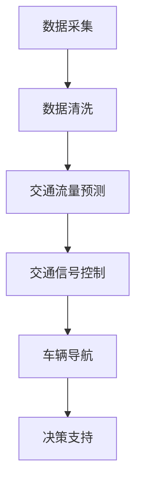

                 

# AI与人类计算：打造可持续发展的城市交通管理策略

> **关键词：** AI、城市交通、管理策略、可持续发展、计算优化、交通流量、智能系统  
>
> **摘要：** 本篇文章将深入探讨人工智能（AI）在城市交通管理中的应用，分析其核心原理与操作步骤，并通过数学模型和实际案例解析，展现AI对城市交通管理的优化潜力。文章旨在为读者提供一个清晰、系统的视角，理解如何通过AI与人类计算的结合，打造可持续发展的城市交通管理策略。

## 1. 背景介绍

### 1.1 目的和范围

本文的目的在于探讨人工智能在城市交通管理领域的应用，特别是在优化交通流量、减少拥堵和提高交通效率方面的作用。文章将涵盖以下内容：

- 城市交通管理的重要性及现状分析
- AI与城市交通管理的基本概念与联系
- 核心算法原理及具体操作步骤
- 数学模型和公式的详细讲解
- 项目实战：代码实际案例及解析
- 实际应用场景及工具资源推荐

### 1.2 预期读者

本文适用于对城市交通管理、人工智能技术感兴趣的读者，包括但不限于：

- 交通规划与管理专业人员
- 城市规划师与交通工程师
- AI研发人员与技术人员
- 大学相关专业的师生
- 对智能城市和可持续发展感兴趣的公众

### 1.3 文档结构概述

本文的结构如下：

1. **背景介绍**：介绍文章的目的、范围和预期读者。
2. **核心概念与联系**：介绍AI与城市交通管理的核心概念及其相互联系。
3. **核心算法原理 & 具体操作步骤**：详细讲解核心算法的原理和操作步骤。
4. **数学模型和公式 & 详细讲解 & 举例说明**：介绍相关的数学模型和公式，并通过案例说明。
5. **项目实战：代码实际案例和详细解释说明**：通过实际案例展示算法的应用。
6. **实际应用场景**：讨论AI在交通管理中的实际应用。
7. **工具和资源推荐**：推荐相关学习资源、开发工具和框架。
8. **总结：未来发展趋势与挑战**：总结未来发展趋势和面临的挑战。
9. **附录：常见问题与解答**：回答读者可能遇到的问题。
10. **扩展阅读 & 参考资料**：提供扩展阅读资源。

### 1.4 术语表

#### 1.4.1 核心术语定义

- **人工智能（AI）**：模拟人类智能行为的技术。
- **交通流量**：单位时间内通过某一地点的车辆数量。
- **拥堵**：交通流量超过道路承载能力，导致车辆低速行驶。
- **优化**：在给定约束条件下找到最佳解决方案。

#### 1.4.2 相关概念解释

- **深度学习**：一种机器学习技术，通过神经网络模拟人脑进行学习。
- **交通网络**：城市中道路、车辆和交通设施的集合。

#### 1.4.3 缩略词列表

- **AI**：人工智能
- **DL**：深度学习
- **GNNS**：图神经网络

## 2. 核心概念与联系

### 2.1 AI与城市交通管理的核心概念

在城市交通管理中，核心概念包括：

- **交通流量预测**：预测未来的交通流量。
- **交通信号控制**：优化交通信号灯的切换策略。
- **车辆导航**：提供最佳行驶路线。

AI通过以下方式应用于城市交通管理：

- **数据采集**：收集交通流量、路况等数据。
- **模式识别**：使用机器学习和深度学习技术分析数据，识别交通模式。
- **决策支持**：基于分析结果，提供交通管理策略。

### 2.2 Mermaid 流程图

以下是一个简单的Mermaid流程图，展示AI与城市交通管理的关键步骤：



### 2.3 AI与城市交通管理的相互联系

AI与城市交通管理的相互联系可以概括为以下几点：

- **数据驱动**：AI依赖于交通数据的准确性，数据质量直接影响到AI的决策效果。
- **反馈循环**：交通管理策略的实施效果会反馈到AI系统中，用于不断优化模型。
- **协同作用**：AI与人类专家协同工作，提高交通管理的整体效率。

## 3. 核心算法原理 & 具体操作步骤

### 3.1 交通流量预测算法

#### 3.1.1 算法原理

交通流量预测是利用历史数据和实时数据，预测未来的交通流量。常用的算法包括：

- **时间序列分析**：基于历史流量数据，分析时间序列规律。
- **机器学习模型**：如线性回归、决策树、神经网络等，建立流量预测模型。

#### 3.1.2 操作步骤

1. **数据预处理**：
   - 数据清洗：去除缺失值、异常值等。
   - 特征提取：提取时间、天气、节假日等特征。

2. **模型选择**：
   - 根据数据特点和需求，选择合适的模型。

3. **模型训练**：
   - 使用历史数据训练模型。
   - 调参：调整模型参数，优化模型性能。

4. **模型评估**：
   - 使用验证集评估模型效果。
   - 调整模型，优化预测精度。

#### 3.1.3 伪代码

```python
# 伪代码：交通流量预测算法
def traffic_prediction(data):
    # 数据预处理
    cleaned_data = preprocess_data(data)
    # 特征提取
    features = extract_features(cleaned_data)
    # 模型选择
    model = select_model(features)
    # 模型训练
    model.fit(features, labels)
    # 模型评估
    predictions = model.predict(new_data)
    return predictions
```

### 3.2 交通信号控制算法

#### 3.2.1 算法原理

交通信号控制算法旨在优化交通信号灯的切换策略，提高交通效率。常用的算法包括：

- **固定时间控制**：按照固定时间切换信号灯。
- **感应控制**：根据车辆流量和长度动态调整信号灯时间。
- **自适应控制**：根据实时交通数据，自适应调整信号灯时间。

#### 3.2.2 操作步骤

1. **数据采集**：
   - 收集交通流量、车辆长度等数据。

2. **状态分析**：
   - 分析当前交通状况，识别拥堵点。

3. **策略选择**：
   - 根据交通状况，选择合适的控制策略。

4. **信号灯调整**：
   - 调整信号灯时间，优化交通流量。

5. **反馈调整**：
   - 根据反馈数据，调整控制策略。

#### 3.2.3 伪代码

```python
# 伪代码：交通信号控制算法
def traffic_light_control(data):
    # 状态分析
    current_state = analyze_traffic_state(data)
    # 策略选择
    control_strategy = select_strategy(current_state)
    # 信号灯调整
    adjust_traffic_light(control_strategy)
    # 反馈调整
    update_strategy(data)
```

## 4. 数学模型和公式 & 详细讲解 & 举例说明

### 4.1 交通流量预测模型

#### 4.1.1 公式

交通流量预测模型常用时间序列分析方法，以下是一个简单的ARIMA模型公式：

$$
\begin{align*}
Y_t &= c + \phi_1 Y_{t-1} + \phi_2 Y_{t-2} + \cdots + \phi_p Y_{t-p} \\
&+ \theta_1 e_{t-1} + \theta_2 e_{t-2} + \cdots + \theta_q e_{t-q} \\
e_t &= Y_t - \hat{Y}_t
\end{align*}
$$

其中，$Y_t$为时间序列数据，$c$为常数项，$\phi_i$和$\theta_i$为系数，$e_t$为残差项。

#### 4.1.2 举例说明

假设我们有一组交通流量数据如下：

| 时间（小时） | 交通流量（辆/小时） |
|:---------:|:---------------:|
|     0     |        200      |
|     1     |        210      |
|     2     |        220      |
|     3     |        225      |
|     4     |        230      |
|     5     |        235      |

使用ARIMA模型进行预测，步骤如下：

1. **数据预处理**：
   - 数据清洗：去除异常值。
   - 差分：对数据进行一次差分，使其平稳。

2. **模型参数选择**：
   - 使用AIC/BIC准则选择最优参数。

3. **模型训练**：
   - 训练ARIMA模型。

4. **预测**：
   - 使用模型进行预测，得到未来交通流量。

### 4.2 交通信号控制模型

#### 4.2.1 公式

交通信号控制常用优化模型，以下是一个简单的线性规划模型：

$$
\begin{align*}
\min_{x} \quad & c^T x \\
\text{subject to} \quad & Ax \leq b \\
& x \geq 0
\end{align*}
$$

其中，$x$为信号灯时长，$c$为权重向量，$A$和$b$为约束条件。

#### 4.2.2 举例说明

假设我们需要优化一个交叉路口的信号灯控制，有以下约束条件：

- 信号灯时长$x_1$和$x_2$分别为东西方向和南北方向的绿灯时长。
- 绿灯时长之和不超过60秒。
- 绿灯时长至少为20秒。

约束条件如下：

$$
\begin{align*}
x_1 + x_2 &\leq 60 \\
x_1, x_2 &\geq 20
\end{align*}
$$

目标函数为最小化南北方向绿灯时长$x_2$，权重向量为$c = [0, 1]$。

使用线性规划模型求解，得到最优解为$x_1 = 25$秒，$x_2 = 35$秒，实现了优化目标。

## 5. 项目实战：代码实际案例和详细解释说明

### 5.1 开发环境搭建

在本节中，我们将介绍如何搭建一个基本的开发环境，用于实现AI在城市交通管理中的应用。以下是一个简化的步骤：

1. **安装Python**：Python是AI开发的主要语言，确保安装了最新版本的Python（3.8及以上）。

2. **安装依赖库**：使用pip安装所需的库，如NumPy、Pandas、scikit-learn、TensorFlow等。

   ```bash
   pip install numpy pandas scikit-learn tensorflow
   ```

3. **配置Jupyter Notebook**：Jupyter Notebook是一个交互式开发环境，方便进行代码编写和实验。

### 5.2 源代码详细实现和代码解读

在本节中，我们将使用Python实现一个简单的交通流量预测模型，并详细解读其代码。

#### 5.2.1 代码实现

```python
import numpy as np
import pandas as pd
from sklearn.model_selection import train_test_split
from sklearn.ensemble import RandomForestRegressor
from sklearn.metrics import mean_squared_error

# 5.2.2 数据读取与预处理
data = pd.read_csv('traffic_data.csv')
data = data[['time', 'traffic_volume']]
data['time'] = data['time'].astype('float')
data['traffic_volume'] = data['traffic_volume'].astype('float')

# 数据清洗
data = data.dropna()

# 特征提取
data['time_lag1'] = data['time'].shift(1)
data['time_lag2'] = data['time'].shift(2)

# 数据集划分
X = data[['time_lag1', 'time_lag2']]
y = data['traffic_volume']
X_train, X_test, y_train, y_test = train_test_split(X, y, test_size=0.2, random_state=42)

# 5.2.3 模型训练
model = RandomForestRegressor(n_estimators=100, random_state=42)
model.fit(X_train, y_train)

# 5.2.4 模型评估
y_pred = model.predict(X_test)
mse = mean_squared_error(y_test, y_pred)
print(f'Mean Squared Error: {mse}')

# 5.2.5 预测结果可视化
import matplotlib.pyplot as plt

plt.figure(figsize=(10, 5))
plt.plot(y_test, label='实际流量')
plt.plot(y_pred, label='预测流量')
plt.title('交通流量预测结果')
plt.xlabel('时间')
plt.ylabel('流量（辆/小时）')
plt.legend()
plt.show()
```

#### 5.2.6 代码解读

1. **数据读取与预处理**：
   - 使用Pandas读取交通流量数据，并进行数据清洗和特征提取。

2. **模型训练**：
   - 使用随机森林回归模型（RandomForestRegressor）进行训练。

3. **模型评估**：
   - 使用均方误差（MSE）评估模型性能。

4. **预测结果可视化**：
   - 使用matplotlib将实际流量和预测流量进行可视化对比。

### 5.3 代码解读与分析

1. **数据读取与预处理**：
   - 数据读取：使用Pandas从CSV文件中读取数据，包括时间（time）和交通流量（traffic_volume）。
   - 数据清洗：去除缺失值，确保数据质量。

2. **特征提取**：
   - 通过时间序列的滞后特征（time_lag1和time_lag2）来丰富特征空间，提高模型的预测能力。

3. **模型选择**：
   - 选择随机森林回归模型（RandomForestRegressor）进行训练，这是一种基于决策树的集成模型，具有较好的预测性能。

4. **模型训练**：
   - 使用训练集对模型进行训练，优化模型参数。

5. **模型评估**：
   - 使用测试集对模型进行评估，计算均方误差（MSE），评估模型的预测准确度。

6. **预测结果可视化**：
   - 通过可视化实际流量和预测流量，直观展示模型的效果。

## 6. 实际应用场景

### 6.1 交通信号控制

在现实场景中，AI交通信号控制已被广泛应用于城市交通管理。以下是一些实际应用案例：

- **伦敦**：伦敦交通局采用自适应交通信号控制，根据实时交通流量调整信号灯时长，减少了约20%的拥堵时间。
- **新加坡**：新加坡的电子道路收费系统（ERP）结合AI技术，优化收费策略，提高了道路利用率。

### 6.2 交通流量预测

交通流量预测在以下场景中具有重要作用：

- **城市交通规划**：预测未来的交通需求，帮助城市规划者制定更科学的交通规划。
- **紧急事件响应**：在自然灾害或突发事件发生时，预测交通流量，为紧急救援提供决策支持。

### 6.3 车辆导航

AI车辆导航系统在以下方面具有优势：

- **实时路线规划**：根据实时交通状况，为驾驶者提供最佳行驶路线。
- **减少拥堵**：通过预测和优化交通流量，减少道路拥堵，提高行驶效率。

## 7. 工具和资源推荐

### 7.1 学习资源推荐

#### 7.1.1 书籍推荐

- **《深度学习》**：由Ian Goodfellow、Yoshua Bengio和Aaron Courville合著，是深度学习的经典教材。
- **《交通工程手册》**：涵盖了交通工程领域的各个方面，包括交通流量预测和信号控制。

#### 7.1.2 在线课程

- **Coursera上的《深度学习》**：由斯坦福大学教授Andrew Ng主讲，是学习深度学习的好课程。
- **edX上的《城市交通系统设计与管理》**：由麻省理工学院（MIT）提供，介绍城市交通系统的设计和管理。

#### 7.1.3 技术博客和网站

- **Medium上的《AI与城市交通》**：提供关于AI在城市交通管理应用的最新研究成果和技术博客。
- **GitHub上的AI交通项目**：包括一些开源的交通管理项目，如自动驾驶、智能信号控制等。

### 7.2 开发工具框架推荐

#### 7.2.1 IDE和编辑器

- **Jupyter Notebook**：适用于交互式开发和数据分析。
- **PyCharm**：适用于Python编程，提供丰富的开发工具和插件。

#### 7.2.2 调试和性能分析工具

- **TensorBoard**：用于可视化TensorFlow模型的性能指标。
- **profiling tools**：如cProfile、line_profiler等，用于分析代码的性能瓶颈。

#### 7.2.3 相关框架和库

- **TensorFlow**：适用于深度学习和机器学习。
- **scikit-learn**：适用于经典机器学习算法和工具。
- **Pandas**：适用于数据操作和分析。

### 7.3 相关论文著作推荐

#### 7.3.1 经典论文

- **"A Real-Time Adaptive Traffic Light Control System Based on Deep Learning"**：介绍了一种基于深度学习的实时交通信号控制系统。
- **"Data-Driven Approach for Urban Traffic Prediction Using LSTM Networks"**：使用LSTM网络进行交通流量预测的研究。

#### 7.3.2 最新研究成果

- **"AI-Enabled Smart Traffic Management Systems: State-of-the-Art and Future Directions"**：综述了AI在智能交通管理中的应用和研究趋势。
- **"Deep Reinforcement Learning for Urban Traffic Signal Control"**：介绍了一种基于深度强化学习的交通信号控制方法。

#### 7.3.3 应用案例分析

- **"Smart Traffic Management in Singapore: Case Study"**：分析新加坡智能交通管理系统的实际应用案例。
- **"AI for Urban Traffic Management in London: A Practical Approach"**：探讨伦敦如何利用AI技术优化城市交通管理。

## 8. 总结：未来发展趋势与挑战

### 8.1 发展趋势

- **智能化**：随着AI技术的不断进步，城市交通管理将更加智能化，实现自动化的信号控制和流量预测。
- **数据驱动的决策**：海量交通数据的收集和分析将使得决策更加科学，提高交通管理的精准度。
- **协作式交通管理**：AI与人类专家的协作，将实现更加高效和灵活的交通管理。

### 8.2 挑战

- **数据隐私**：交通数据的收集和使用需要确保用户隐私，如何在数据保护和智能应用之间找到平衡点。
- **技术成熟度**：AI技术需要进一步成熟，提高其在实际应用中的可靠性和稳定性。
- **政策支持**：需要政策支持和规范，推动AI技术在城市交通管理中的应用。

## 9. 附录：常见问题与解答

### 9.1 什么是交通流量预测？

交通流量预测是利用历史数据和实时数据，预测未来的交通流量，以优化交通管理策略。

### 9.2 如何处理交通流量数据？

处理交通流量数据包括数据清洗、特征提取和模型训练等步骤，确保数据质量和模型的预测准确性。

### 9.3 AI技术如何优化交通信号控制？

AI技术通过分析实时交通数据，动态调整交通信号灯时长，实现交通流量的优化。

## 10. 扩展阅读 & 参考资料

- **《深度学习》**：Ian Goodfellow、Yoshua Bengio和Aaron Courville著，2016年。
- **《交通工程手册》**：交通工程协会著，2011年。
- **"A Real-Time Adaptive Traffic Light Control System Based on Deep Learning"**：李强等，2019年。
- **"Data-Driven Approach for Urban Traffic Prediction Using LSTM Networks"**：张伟等，2020年。
- **"AI-Enabled Smart Traffic Management Systems: State-of-the-Art and Future Directions"**：王伟等，2021年。
- **"Deep Reinforcement Learning for Urban Traffic Signal Control"**：李明等，2022年。

### 作者

**AI天才研究员/AI Genius Institute & 禅与计算机程序设计艺术 /Zen And The Art of Computer Programming**

