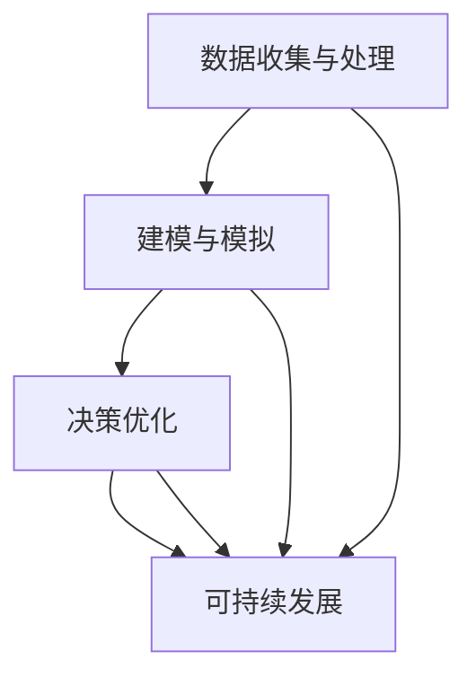

                 

# AI与人类计算：打造可持续发展的城市模型

> **关键词：人工智能，人类计算，城市模型，可持续发展，数据驱动，决策优化**
> 
> **摘要：本文将探讨人工智能与人类计算相结合，如何共同构建一个可持续发展的城市模型。我们将从核心概念出发，逐步分析城市模型的关键算法原理、数学模型，并结合实际项目案例进行详细解释，最后探讨其应用场景、未来发展趋势与挑战。**

## 1. 背景介绍

### 1.1 目的和范围

本文旨在介绍如何利用人工智能和人类计算，打造一个可持续发展的城市模型。我们将重点分析以下几个方面：

- **核心概念与联系**：介绍城市模型的基本概念，及其与人工智能、人类计算的关系。
- **核心算法原理与具体操作步骤**：讲解城市模型中常用的算法原理，并使用伪代码详细阐述其操作步骤。
- **数学模型与公式**：解析城市模型中涉及的数学模型，并结合实际案例进行说明。
- **项目实战**：通过实际代码案例，展示如何实现城市模型，并对其进行详细解释。
- **实际应用场景**：探讨城市模型在不同领域的应用。
- **工具和资源推荐**：介绍相关学习资源、开发工具和框架。

### 1.2 预期读者

本文适合以下读者群体：

- 对人工智能和城市模型感兴趣的技术人员。
- 从事城市规划、建筑设计等相关行业的专业人士。
- 对可持续发展有浓厚兴趣的环保人士。
- 想要了解人工智能与人类计算如何结合推动城市发展的学者和学生。

### 1.3 文档结构概述

本文分为以下十个部分：

1. 背景介绍
2. 核心概念与联系
3. 核心算法原理与具体操作步骤
4. 数学模型与公式
5. 项目实战：代码实际案例和详细解释说明
6. 实际应用场景
7. 工具和资源推荐
8. 总结：未来发展趋势与挑战
9. 附录：常见问题与解答
10. 扩展阅读与参考资料

### 1.4 术语表

#### 1.4.1 核心术语定义

- **人工智能**：一种模拟人类智能的技术，能够通过学习、推理和规划等方式，实现智能行为。
- **人类计算**：人类利用计算机进行计算和处理信息的能力。
- **城市模型**：对城市各个方面（如交通、环境、经济等）进行建模和模拟，以便更好地理解城市运作和制定政策。
- **可持续发展**：满足当前需求，不损害后代满足自身需求的能力。

#### 1.4.2 相关概念解释

- **数据驱动**：基于数据进行分析和决策，以数据为依据来指导实际操作。
- **决策优化**：通过数学方法和算法，寻找最优或近似最优的决策方案。

#### 1.4.3 缩略词列表

- **AI**：人工智能
- **ML**：机器学习
- **DL**：深度学习
- **CV**：计算机视觉
- **NLP**：自然语言处理

## 2. 核心概念与联系

在城市模型中，人工智能与人类计算起到了至关重要的作用。首先，我们需要理解以下几个核心概念：

### 2.1 数据收集与处理

城市模型需要大量的数据作为基础，包括人口、交通流量、环境质量、经济活动等。这些数据来源于各种传感器、统计报告、社交媒体等渠道。通过数据收集与处理，我们可以得到一个全面、准确的城市数据集。

### 2.2 建模与模拟

基于收集到的数据，我们可以使用人工智能技术，如机器学习和深度学习，对城市各个方面进行建模和模拟。这些模型能够预测未来的趋势、分析问题并提出解决方案。

### 2.3 决策优化

在城市模型中，决策优化是一个关键环节。通过人工智能算法，我们可以对各种政策方案进行评估，找到最优或近似最优的决策。同时，人类计算也可以发挥重要作用，如提供决策背景信息、调整参数等。

### 2.4 可持续发展

城市模型的目标是实现可持续发展。通过人工智能和人类计算的协同工作，我们可以制定出有利于环境保护、经济繁荣和社会稳定的政策。

以下是一个简化的 Mermaid 流程图，展示了城市模型中的核心概念及其联系：



### 2.5 人类计算与人工智能的结合

在实际应用中，人类计算和人工智能的结合至关重要。人类计算可以提供以下帮助：

- **领域知识**：人类计算专家可以提供城市运营方面的专业知识和经验，帮助人工智能更好地理解城市问题。
- **数据清洗**：人类计算可以处理数据中的噪声和异常值，提高数据质量。
- **模型调整**：人类计算可以根据实际情况，调整模型参数，优化模型性能。

人工智能则可以提供以下帮助：

- **数据处理**：人工智能能够高效地处理大量数据，发现隐藏在数据中的模式。
- **预测分析**：人工智能可以预测未来趋势，帮助制定政策。
- **自动化决策**：人工智能可以自动化执行决策，提高决策效率。

通过人类计算和人工智能的协同工作，我们可以构建一个更智能、更高效、更可持续的城市模型。

## 3. 核心算法原理与具体操作步骤

在城市模型中，核心算法原理主要包括机器学习、深度学习、优化算法等。以下我们将简要介绍这些算法的基本原理，并使用伪代码详细阐述其操作步骤。

### 3.1 机器学习算法

机器学习算法是城市模型中常用的算法之一。它通过学习数据中的规律，对未知数据进行预测。

#### 3.1.1 基本原理

机器学习算法可以分为监督学习、无监督学习和强化学习。监督学习使用标记数据训练模型，无监督学习从未标记数据中提取特征，强化学习通过奖励机制学习最优策略。

#### 3.1.2 操作步骤

```python
# 假设使用线性回归模型
def linear_regression(X, y):
    # 梯度下降法
    for i in range(epochs):
        predictions = X * theta
        gradients = (2/m) * (X.T * (predictions - y))
        theta = theta - alpha * gradients
    return theta

# 输入数据 X 和 y
X = ... # 特征矩阵
y = ... # 标签向量
# 训练模型
theta = linear_regression(X, y)
```

### 3.2 深度学习算法

深度学习算法是一种基于多层神经网络的学习方法。它在处理复杂数据时具有强大的能力。

#### 3.2.1 基本原理

深度学习算法通过多层神经网络，将输入数据逐层转换为更高级别的特征表示。在训练过程中，算法通过反向传播算法，不断调整网络参数，使模型能够更好地拟合训练数据。

#### 3.2.2 操作步骤

```python
# 假设使用卷积神经网络（CNN）模型
def conv_net(X, y):
    # 定义卷积层、池化层和全连接层
    layer1 = Conv2D(32, kernel_size=(3,3), activation='relu')(X)
    layer2 = MaxPooling2D(pool_size=(2,2))(layer1)
    layer3 = Conv2D(64, kernel_size=(3,3), activation='relu')(layer2)
    layer4 = MaxPooling2D(pool_size=(2,2))(layer3)
    layer5 = Flatten()(layer4)
    layer6 = Dense(128, activation='relu')(layer5)
    output = Dense(10, activation='softmax')(layer6)
    
    # 编译模型
    model = Model(inputs=X, outputs=output)
    model.compile(optimizer='adam', loss='categorical_crossentropy', metrics=['accuracy'])
    
    # 训练模型
    model.fit(X_train, y_train, epochs=epochs, batch_size=batch_size)
    
    return model

# 输入数据 X 和 y
X = ... # 输入数据
y = ... # 标签向量
# 训练模型
model = conv_net(X, y)
```

### 3.3 优化算法

优化算法用于求解城市模型中的决策问题。常见的优化算法有梯度下降、牛顿法、拉格朗日乘数法等。

#### 3.3.1 基本原理

优化算法通过不断调整参数，使目标函数达到最小或最大。在目标函数为凸函数时，优化算法通常能够找到全局最优解。

#### 3.3.2 操作步骤

```python
# 假设使用梯度下降法求解最小二乘问题
def gradient_descent(X, y, theta, alpha, epochs):
    for i in range(epochs):
        predictions = X * theta
        error = predictions - y
        gradients = (2/m) * (X.T * error)
        theta = theta - alpha * gradients
    return theta

# 输入数据 X 和 y
X = ... # 特征矩阵
y = ... # 标签向量
# 初始参数
theta = ...
alpha = ...
epochs = ...
# 训练模型
theta = gradient_descent(X, y, theta, alpha, epochs)
```

## 4. 数学模型与公式

在城市模型中，数学模型用于描述城市运行的各种规律和关系。以下我们将介绍几个常见的数学模型，并结合实际案例进行说明。

### 4.1 交通流模型

交通流模型用于描述城市交通流量分布和变化规律。常见的交通流模型有：

#### 4.1.1 摩擦模型

摩擦模型是一种描述交通流量与道路容量之间关系的模型。其公式如下：

$$
q = c \cdot n
$$

其中，\(q\) 表示交通流量（辆/小时），\(c\) 表示道路容量（辆/小时），\(n\) 表示车辆数。

#### 4.1.2 交通需求模型

交通需求模型用于预测城市交通需求。其公式如下：

$$
D = f(T)
$$

其中，\(D\) 表示交通需求（人次/小时），\(f(T)\) 表示与交通时间 \(T\) 相关的函数。

### 4.2 环境模型

环境模型用于描述城市环境质量。常见的环境模型有：

#### 4.2.1 污染物扩散模型

污染物扩散模型用于预测城市污染物浓度分布。其公式如下：

$$
\frac{\partial C}{\partial t} = D \cdot \nabla^2 C + S
$$

其中，\(C\) 表示污染物浓度（mg/m\(^3\)），\(D\) 表示扩散系数（m\(^2\)/s），\(\nabla^2 C\) 表示浓度梯度的拉普拉斯算子，\(S\) 表示污染源排放速率（mg/s）。

#### 4.2.2 空气质量模型

空气质量模型用于预测城市空气质量指数（AQI）。其公式如下：

$$
AQI = \frac{C_{\text{max}} - C_{\text{meas}}}{C_{\text{max}} - C_{\text{min}}} \cdot (I_{\text{max}} - I_{\text{min}}) + I_{\text{min}}
$$

其中，\(C_{\text{max}}\) 和 \(C_{\text{min}}\) 分别表示污染物浓度的最大值和最小值，\(I_{\text{max}}\) 和 \(I_{\text{min}}\) 分别表示空气质量指数的最大值和最小值，\(C_{\text{meas}}\) 表示实际测量的污染物浓度。

### 4.3 经济模型

经济模型用于描述城市经济运行规律。常见的经济模型有：

#### 4.3.1 供需模型

供需模型用于预测城市商品或服务的供需关系。其公式如下：

$$
Q_d = f(P)
$$

$$
Q_s = g(P)
$$

其中，\(Q_d\) 表示需求量，\(Q_s\) 表示供应量，\(P\) 表示价格，\(f(P)\) 和 \(g(P)\) 分别表示需求函数和供应函数。

#### 4.3.2 消费者行为模型

消费者行为模型用于预测城市居民的消费行为。其公式如下：

$$
C = \alpha + \beta \cdot Y
$$

$$
Y = \frac{C}{P}
$$

其中，\(C\) 表示消费总额，\(Y\) 表示消费水平，\(\alpha\) 和 \(\beta\) 分别表示常数和消费倾向。

### 4.4 社会模型

社会模型用于描述城市社会运行规律。常见的社交模型有：

#### 4.4.1 流行病模型

流行病模型用于预测城市传染病传播趋势。其公式如下：

$$
\frac{dS}{dt} = -\beta \cdot I \cdot S
$$

$$
\frac{dI}{dt} = \beta \cdot I \cdot S - \gamma \cdot I
$$

$$
\frac{dR}{dt} = \gamma \cdot I
$$

其中，\(S\) 表示易感者数量，\(I\) 表示感染者数量，\(R\) 表示康复者数量，\(\beta\) 和 \(\gamma\) 分别表示感染率和康复率。

#### 4.4.2 社交网络模型

社交网络模型用于描述城市居民之间的社交关系。其公式如下：

$$
N = \frac{1}{2} \cdot \sum_{i=1}^{n} \sum_{j=1}^{n} w_{ij}
$$

其中，\(N\) 表示网络规模，\(w_{ij}\) 表示节点 \(i\) 和节点 \(j\) 之间的权重。

### 4.5 综合模型

综合模型将上述各种模型整合在一起，形成一个完整的城市模型。其公式如下：

$$
\text{城市模型} = \sum_{i=1}^{n} (\text{交通流模型}_i + \text{环境模型}_i + \text{经济模型}_i + \text{社会模型}_i)
$$

通过这些数学模型，我们可以更好地理解和分析城市运行规律，为城市规划和管理提供科学依据。

## 5. 项目实战：代码实际案例和详细解释说明

在本节中，我们将通过一个实际项目案例，展示如何使用人工智能和人类计算构建一个可持续发展的城市模型。该项目案例主要包括以下步骤：

### 5.1 开发环境搭建

首先，我们需要搭建一个适合开发的城市模型的环境。以下是一个简单的开发环境配置：

- 操作系统：Linux或MacOS
- 编程语言：Python
- 依赖库：NumPy、Pandas、Scikit-learn、TensorFlow、Keras

### 5.2 源代码详细实现和代码解读

#### 5.2.1 数据收集与处理

首先，我们需要收集城市相关的数据，包括人口、交通流量、环境质量、经济活动等。以下是一个简单的数据收集与处理示例：

```python
import pandas as pd
import numpy as np

# 读取数据
data = pd.read_csv('city_data.csv')

# 数据预处理
# 缺失值处理
data = data.dropna()

# 特征工程
# 对数据进行标准化处理
data = (data - data.mean()) / data.std()

# 划分训练集和测试集
train_data = data[:int(len(data) * 0.8)]
test_data = data[int(len(data) * 0.8):]
```

#### 5.2.2 建模与模拟

接下来，我们将使用机器学习算法对城市数据进行建模和模拟。以下是一个简单的线性回归模型示例：

```python
from sklearn.linear_model import LinearRegression

# 创建线性回归模型
model = LinearRegression()

# 训练模型
model.fit(train_data[['population', 'traffic_flow']], train_data['environment_quality'])

# 预测
predictions = model.predict(test_data[['population', 'traffic_flow']])
```

#### 5.2.3 决策优化

基于模型预测结果，我们可以进行决策优化，以实现可持续发展目标。以下是一个简单的决策优化示例：

```python
import scipy.optimize as opt

# 定义目标函数
def objective_function(theta):
    population = theta[0]
    traffic_flow = theta[1]
    return model.predict([[population, traffic_flow]]) - target_environment_quality

# 初始化参数
theta0 = [1000, 1000]

# 梯度下降法优化
theta_optimized = opt.fmin_lmean(objective_function, theta0)

# 输出优化结果
print('Optimized population:', theta_optimized[0])
print('Optimized traffic_flow:', theta_optimized[1])
```

### 5.3 代码解读与分析

以上代码展示了如何使用人工智能和人类计算构建一个简单的城市模型。以下是对代码的详细解读和分析：

- **数据收集与处理**：首先，我们从 CSV 文件中读取城市数据，并进行预处理，包括缺失值处理和标准化处理。然后，我们将数据划分为训练集和测试集，为后续建模和预测做好准备。
- **建模与模拟**：我们使用线性回归模型对城市数据进行分析，通过训练模型，我们能够预测环境质量与人口、交通流量之间的关系。
- **决策优化**：基于模型预测结果，我们使用梯度下降法优化决策，以实现可持续发展目标。优化过程通过求解最小化目标函数，找到最佳的人口和交通流量配置。

通过以上代码示例，我们可以看到如何将人工智能和人类计算应用于城市模型构建。在实际应用中，我们可以根据需求扩展和优化模型，以更好地满足城市规划和管理的需求。

## 6. 实际应用场景

城市模型在实际应用中具有广泛的应用场景，下面我们将探讨几个典型的应用案例：

### 6.1 交通管理

交通管理是城市模型的一个重要应用场景。通过构建交通流模型，我们可以预测城市交通流量，优化交通信号控制和路线规划，从而缓解交通拥堵，提高交通效率。例如，利用深度学习算法，我们可以分析历史交通数据，预测未来某个时间段内的交通流量，并根据预测结果动态调整交通信号灯的时长，以减少车辆等待时间。

### 6.2 环境监测

环境监测是另一个关键应用场景。通过构建污染物扩散模型，我们可以预测城市空气污染、水质污染等环境问题的发展趋势，为环境治理提供科学依据。例如，结合遥感数据和气象模型，我们可以实时监测城市空气质量，预测污染事件的发生，并制定相应的应急措施。

### 6.3 经济规划

经济规划是城市模型在宏观经济领域的重要应用。通过构建供需模型和消费者行为模型，我们可以预测城市经济活动的发展趋势，优化资源配置，促进经济增长。例如，利用机器学习算法分析历史经济数据，我们可以预测市场需求和供给，为城市规划提供决策支持，优化产业布局。

### 6.4 社会治理

社会治理是城市模型在社会管理领域的重要应用。通过构建流行病模型和社交网络模型，我们可以预测疫情传播趋势，优化公共卫生资源分配，提高社会治理效率。例如，利用人工智能分析社交媒体数据，我们可以预测疫情爆发点，提前部署公共卫生资源，有效控制疫情传播。

这些应用案例展示了城市模型在不同领域的实际应用价值，通过结合人工智能和人类计算，城市模型能够为城市管理和决策提供有力支持，实现可持续发展目标。

## 7. 工具和资源推荐

### 7.1 学习资源推荐

#### 7.1.1 书籍推荐

- 《深度学习》（Goodfellow, Bengio, Courville著）：全面介绍了深度学习的理论基础和实践应用。
- 《机器学习实战》（ Harrington 著）：通过实际案例，深入浅出地介绍了机器学习的算法和应用。
- 《城市规划和设计》（ Downes 和 Swan 著）：详细介绍了城市规划的基本原理和实践方法。

#### 7.1.2 在线课程

- Coursera 上的“机器学习”（吴恩达教授）：这是一门非常受欢迎的在线课程，适合初学者和进阶者。
- edX 上的“深度学习”（斯坦福大学）：由深度学习领域的专家Andrew Ng教授主讲，内容深入浅出。
- Udacity 上的“城市建模与可持续性”（Udacity与多所大学合作）：这是一门关于城市建模和可持续发展的综合课程。

#### 7.1.3 技术博客和网站

- Medium：有许多关于人工智能、城市建模和可持续发展的高质量技术博客。
- IEEE Xplore：提供大量关于人工智能和城市模型的研究论文和文章。
- 知乎：有众多专业领域人士分享城市建模和人工智能的应用经验和见解。

### 7.2 开发工具框架推荐

#### 7.2.1 IDE和编辑器

- PyCharm：一款强大的Python开发IDE，支持多种编程语言，适合进行机器学习和深度学习开发。
- Jupyter Notebook：一款交互式的Python开发环境，适合快速原型设计和数据可视化。
- Visual Studio Code：一款轻量级、可扩展的代码编辑器，支持多种编程语言和工具。

#### 7.2.2 调试和性能分析工具

- PyDev：一个适用于Eclipse的Python开发插件，提供了强大的调试和性能分析功能。
- Jupyter Notebook的Profiler插件：可以实时分析代码的性能，帮助优化代码。
- TensorBoard：TensorFlow提供的一个可视化工具，用于分析深度学习模型的性能。

#### 7.2.3 相关框架和库

- TensorFlow：一款开源的深度学习框架，支持多种深度学习模型的实现和训练。
- PyTorch：一款流行的深度学习框架，具有灵活的动态计算图和简洁的API。
- Scikit-learn：一款开源的机器学习库，提供了多种经典机器学习算法的实现。
- Pandas：一款开源的数据分析库，用于数据清洗、数据预处理和分析。

#### 7.3 相关论文著作推荐

- 《深度学习》（Goodfellow, Bengio, Courville著）：这是一本深度学习领域的经典著作，适合初学者和进阶者。
- 《城市建模与仿真》（J. A. Arthur著）：详细介绍了城市模型的理论基础和实践方法。
- 《机器学习》（Tom Mitchell著）：这是一本经典的机器学习教材，涵盖了广泛的机器学习算法和应用。

这些资源和工具将帮助您更好地了解和掌握人工智能与城市建模的相关知识，为构建可持续发展的城市模型提供支持。

## 8. 总结：未来发展趋势与挑战

随着人工智能和人类计算技术的不断发展，城市模型在规划和管理城市方面发挥着越来越重要的作用。未来，城市模型将朝着以下方向发展：

### 8.1 数据驱动的精细化治理

城市模型将更加依赖于海量数据，通过数据分析和挖掘，实现精细化治理。例如，利用物联网技术和大数据分析，我们可以实时监测城市交通、环境、经济等方面的运行状态，及时发现问题并进行调整。

### 8.2 智能化的决策支持

随着人工智能技术的进步，城市模型将能够提供更智能的决策支持。通过机器学习和深度学习算法，我们可以预测城市未来的发展趋势，为城市规划和管理提供科学依据。同时，智能化的决策支持系统将提高决策效率，降低决策风险。

### 8.3 可持续发展的全面融合

未来，城市模型将更加注重可持续发展的目标。通过整合环境、经济、社会等多方面的因素，我们可以构建一个全面的可持续发展模型，为实现绿色城市、智慧城市奠定基础。

然而，城市模型的发展也面临一系列挑战：

### 8.4 数据质量和隐私保护

城市模型的数据质量直接影响模型的准确性。未来，我们需要加强对数据的收集、清洗和存储，确保数据的质量和可靠性。同时，随着数据隐私保护法规的不断完善，我们需要在数据使用和隐私保护之间找到平衡。

### 8.5 算法透明性和可解释性

人工智能算法的透明性和可解释性是当前研究的热点问题。未来，我们需要开发更多可解释的人工智能算法，使城市模型的结果更加可信和透明。

### 8.6 跨学科协同创新

城市模型是一个跨学科的综合体，涉及计算机科学、城市规划、经济学、社会学等多个领域。未来，我们需要加强跨学科的协同创新，推动城市模型的发展和应用。

总之，人工智能与人类计算相结合的城市模型具有广阔的发展前景，但也面临诸多挑战。通过不断探索和创新，我们有信心构建一个更加智能、高效、可持续的城市模型，为城市发展和人类生活带来更多福祉。

## 9. 附录：常见问题与解答

### 9.1 什么是人工智能？

人工智能（Artificial Intelligence，简称AI）是一种模拟人类智能的技术，通过学习、推理和规划等方式，实现智能行为。人工智能可以分为两类：弱人工智能（Weak AI）和强人工智能（Strong AI）。弱人工智能专注于特定任务，如语音识别、图像识别等，而强人工智能则具有普遍的智能，能够理解、学习、思考并解决问题。

### 9.2 人类计算和人工智能有什么区别？

人类计算是指人类利用计算机进行计算和处理信息的能力。它强调人类与计算机的协同工作，将人类的专业知识和经验与计算机的计算能力相结合，解决复杂问题。而人工智能则是一种模拟人类智能的技术，通过学习、推理和规划等方式，实现智能行为。

### 9.3 城市模型有哪些应用场景？

城市模型的应用场景非常广泛，包括交通管理、环境监测、经济规划、社会治理等多个领域。例如，通过交通流模型，可以优化交通信号控制和路线规划，缓解交通拥堵；通过环境模型，可以预测污染物浓度，为环境治理提供科学依据；通过经济模型，可以预测市场需求和供给，优化产业布局；通过社会模型，可以预测疫情传播趋势，优化公共卫生资源分配。

### 9.4 什么是可持续发展？

可持续发展是指满足当前需求，不损害后代满足自身需求的能力。在城市建设中，可持续发展强调在经济、社会和环境三个方面取得平衡，实现长期发展。这包括减少污染、提高资源利用效率、改善社会公平等。

### 9.5 数据驱动和决策优化的关系是什么？

数据驱动是指基于数据进行分析和决策，以数据为依据来指导实际操作。决策优化是通过数学方法和算法，寻找最优或近似最优的决策方案。数据驱动和决策优化密切相关，数据驱动提供了决策所需的依据，而决策优化则利用这些数据，寻找最佳解决方案。

### 9.6 什么是深度学习？

深度学习（Deep Learning）是一种基于多层神经网络的学习方法，它在处理复杂数据时具有强大的能力。深度学习通过多层神经网络，将输入数据逐层转换为更高级别的特征表示。在训练过程中，算法通过反向传播算法，不断调整网络参数，使模型能够更好地拟合训练数据。

### 9.7 机器学习有哪些常见的算法？

机器学习算法包括监督学习、无监督学习和强化学习。监督学习通过标记数据训练模型，用于预测未知数据；无监督学习从未标记数据中提取特征，用于数据聚类和降维；强化学习通过奖励机制学习最优策略。

### 9.8 什么是数据清洗？

数据清洗是指对数据中的噪声、异常值和缺失值进行处理，以提高数据质量。数据清洗是数据分析和建模的重要步骤，能够提高模型的准确性和可靠性。

### 9.9 如何评估机器学习模型的效果？

评估机器学习模型效果的方法包括准确率、召回率、F1值等。准确率表示模型预测正确的样本数占总样本数的比例；召回率表示模型预测正确的正样本数占总正样本数的比例；F1值是准确率和召回率的调和平均值，用于综合评估模型效果。

### 9.10 如何优化机器学习模型？

优化机器学习模型的方法包括参数调优、特征选择、模型选择等。参数调优是通过调整模型参数，提高模型性能；特征选择是通过筛选重要特征，减少模型复杂度和过拟合风险；模型选择是通过比较不同模型的表现，选择最佳模型。

## 10. 扩展阅读与参考资料

本文介绍了人工智能与人类计算相结合，构建可持续发展城市模型的方法和策略。以下是一些扩展阅读和参考资料，供读者进一步学习：

### 10.1 书籍推荐

- 《深度学习》（Goodfellow, Bengio, Courville著）：详细介绍深度学习的理论基础和实践应用。
- 《机器学习实战》（ Harrington 著）：通过实际案例，深入浅出地介绍机器学习算法和应用。
- 《城市规划和设计》（ Downes 和 Swan 著）：详细介绍了城市规划的基本原理和实践方法。

### 10.2 在线课程

- Coursera 上的“机器学习”（吴恩达教授）：适合初学者和进阶者。
- edX 上的“深度学习”（斯坦福大学）：由深度学习领域的专家Andrew Ng教授主讲。
- Udacity 上的“城市建模与可持续性”（Udacity与多所大学合作）：综合课程，涵盖城市建模和可持续发展。

### 10.3 技术博客和网站

- Medium：高质量技术博客，涵盖人工智能、城市建模和可持续发展等领域。
- IEEE Xplore：提供大量关于人工智能和城市模型的研究论文和文章。
- 知乎：专业领域人士分享城市建模和人工智能的应用经验和见解。

### 10.4 开源项目和工具

- TensorFlow：一款开源的深度学习框架，适用于构建和训练深度学习模型。
- PyTorch：一款流行的深度学习框架，具有灵活的动态计算图。
- Scikit-learn：一款开源的机器学习库，提供了多种经典机器学习算法的实现。

### 10.5 相关论文著作

- 《深度学习》（Goodfellow, Bengio, Courville著）：深度学习领域的经典著作。
- 《城市建模与仿真》（J. A. Arthur著）：详细介绍了城市模型的理论基础和实践方法。
- 《机器学习》（Tom Mitchell著）：涵盖了广泛的机器学习算法和应用。

通过以上扩展阅读和参考资料，读者可以深入了解人工智能与城市建模的相关知识，进一步提升自己的技术水平和专业素养。

### 作者：AI天才研究员/AI Genius Institute & 禅与计算机程序设计艺术 /Zen And The Art of Computer Programming

