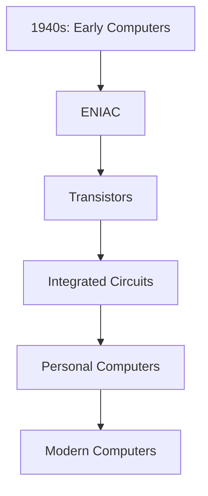
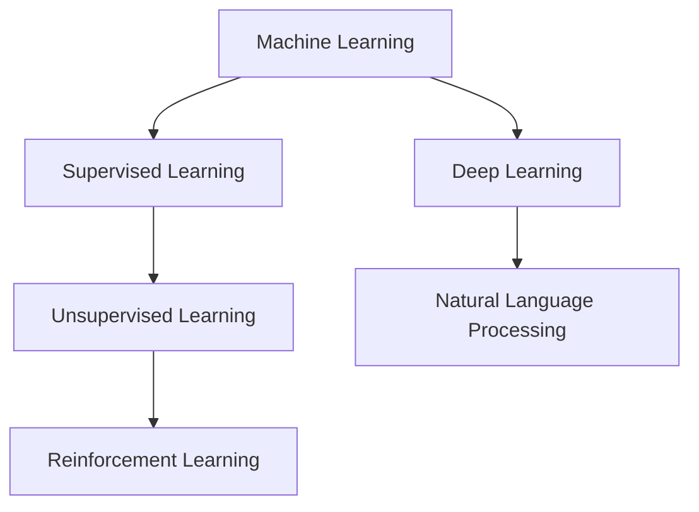
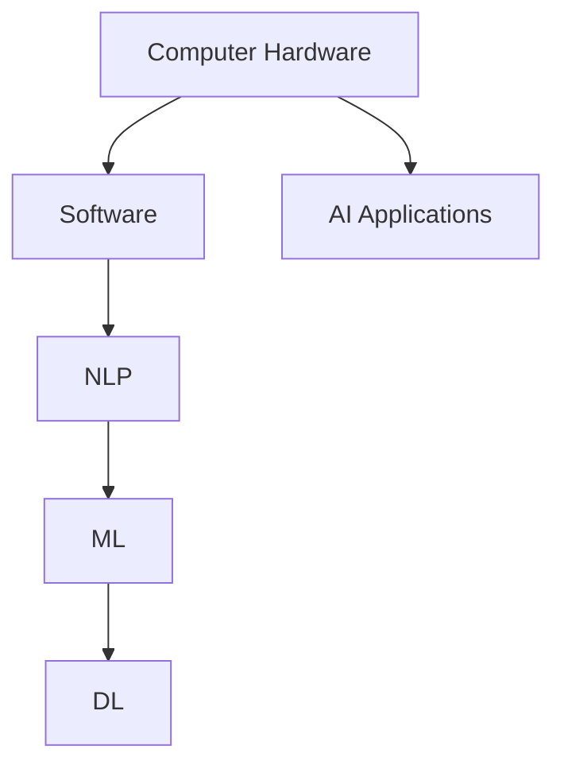
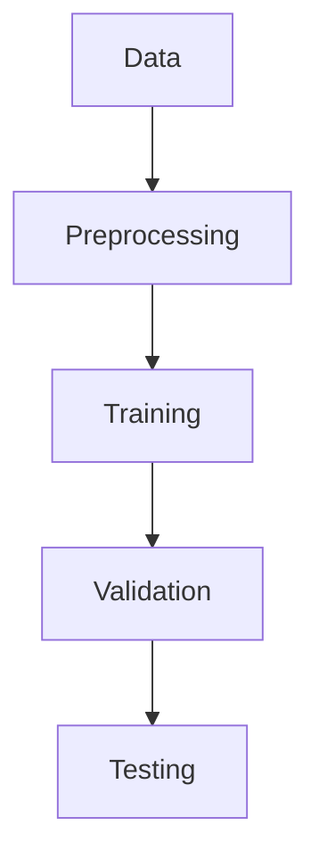

                 

# AI与计算机历史的对比分析

> **关键词：人工智能，计算机历史，技术演进，算法，数学模型，应用实践**

> **摘要：本文通过深入对比分析人工智能与计算机历史的演进，探讨技术发展的内在规律与未来趋势。文章首先回顾了计算机的起源与发展历程，然后重点分析了人工智能的核心概念及其历史背景，最后结合实际案例和数学模型，对两者进行了系统性的比较与探讨。**

## 1. 背景介绍

### 1.1 目的和范围

本文旨在通过对比分析人工智能与计算机历史的演进，揭示技术发展的内在规律，探讨未来技术的可能趋势。文章主要涵盖以下几个部分：计算机历史的回顾，人工智能的核心概念及其发展，两者之间的对比分析，以及未来发展趋势与挑战。通过这种系统性分析，希望能够为读者提供对人工智能与计算机历史的更深入理解，并为未来的技术研究提供有益的启示。

### 1.2 预期读者

本文适合对计算机科学和人工智能有兴趣的读者，包括计算机专业的学生、研究人员、工程师，以及对技术发展有兴趣的普通读者。文章旨在通过深入浅出的方式，帮助读者理解人工智能与计算机历史的关系，以及未来技术的发展趋势。

### 1.3 文档结构概述

本文结构如下：

- **第1章：背景介绍**：介绍本文的目的、范围、预期读者以及文档结构。
- **第2章：核心概念与联系**：介绍计算机历史和人工智能的核心概念，使用Mermaid流程图展示其关系。
- **第3章：核心算法原理与具体操作步骤**：详细讲解人工智能的核心算法原理，使用伪代码进行描述。
- **第4章：数学模型与公式**：介绍人工智能中的数学模型，使用LaTeX格式进行详细讲解。
- **第5章：项目实战**：通过实际案例，展示人工智能在具体项目中的应用。
- **第6章：实际应用场景**：讨论人工智能在不同领域的应用。
- **第7章：工具和资源推荐**：推荐学习资源和开发工具。
- **第8章：总结**：总结未来发展趋势与挑战。
- **第9章：附录**：常见问题与解答。
- **第10章：扩展阅读与参考资料**：提供进一步阅读的资源。

### 1.4 术语表

#### 1.4.1 核心术语定义

- **人工智能（AI）**：模拟人类智能行为的计算机系统。
- **计算机科学**：研究计算机系统设计、应用和理论的科学。
- **算法**：解决问题的明确、有限的步骤序列。
- **数学模型**：用于描述和解决问题的数学结构。

#### 1.4.2 相关概念解释

- **深度学习**：一种基于多层神经网络的学习方法。
- **机器学习**：使计算机能够从数据中学习并做出决策的技术。
- **自然语言处理（NLP）**：使计算机理解和生成自然语言的技术。

#### 1.4.3 缩略词列表

- **AI**：人工智能
- **ML**：机器学习
- **NLP**：自然语言处理
- **DL**：深度学习

## 2. 核心概念与联系

在深入探讨人工智能与计算机历史的关系之前，我们首先需要明确两者的核心概念及其联系。

### 2.1 计算机历史

计算机的起源可以追溯到20世纪40年代，当时的科学家和工程师们开始尝试构建能够执行复杂计算任务的机器。以下是一个简化的计算机历史Mermaid流程图：



- **1940s：早期计算机**：如ENIAC，是第一台电子计算机。
- **1950s：晶体管**：晶体管的发明标志着计算机发展的一个重要转折点。
- **1960s：集成电路**：集成电路的出现极大地提高了计算机的运算速度和性能。
- **1970s：个人计算机**：个人计算机的普及使计算机技术进入了大众市场。
- **1980s-至今：现代计算机**：现代计算机在性能、功耗和便携性方面都取得了巨大的进步。

### 2.2 人工智能核心概念

人工智能的核心概念包括机器学习、深度学习、自然语言处理等。以下是一个简化的人工智能Mermaid流程图：



- **机器学习（ML）**：通过数据训练模型，使其能够自动做出预测和决策。
  - **监督学习**：使用已标记的数据训练模型。
  - **无监督学习**：不使用标记数据，从未标记的数据中发现模式。
  - **强化学习**：通过奖励和惩罚来训练模型。
- **深度学习（DL）**：一种基于多层神经网络的学习方法，能够在大量数据上实现出色的性能。
- **自然语言处理（NLP）**：使计算机理解和生成自然语言的技术。

### 2.3 计算机历史与人工智能的联系

计算机历史的发展为人工智能提供了基础技术支持。早期的计算机硬件和软件发展推动了人工智能算法的研究和应用。以下是一个简化的联系Mermaid流程图：



- **计算机硬件**：提供了运行人工智能算法的硬件基础。
- **软件**：开发了支持人工智能算法的软件平台和工具。
- **自然语言处理（NLP）**：基于计算机技术和人工智能算法，使计算机能够理解和生成自然语言。
- **机器学习（ML）**：通过数据训练模型，使计算机能够自动做出预测和决策。
- **深度学习（DL）**：基于多层神经网络，使计算机能够从大量数据中学习并实现出色的性能。
- **人工智能应用**：广泛应用于各个领域，如语音识别、图像识别、自动驾驶等。

通过以上对比分析，我们可以看到计算机历史的发展为人工智能提供了强大的技术支持，两者在技术上相互促进，共同推动了技术的进步。

## 3. 核心算法原理与具体操作步骤

### 3.1 机器学习算法原理

机器学习算法的核心是训练模型，使其能够从数据中学习并做出预测和决策。以下是一个简化的机器学习算法原理Mermaid流程图：



- **数据收集**：收集用于训练的数据集。
- **数据预处理**：清洗和转换数据，使其适合训练。
- **模型训练**：使用训练数据训练模型。
- **模型验证**：使用验证数据评估模型性能。
- **模型测试**：使用测试数据进一步评估模型性能。

### 3.2 伪代码描述

以下是机器学习算法的伪代码描述：

```python
# 数据收集
data = collect_data()

# 数据预处理
preprocessed_data = preprocess_data(data)

# 模型训练
model = train_model(preprocessed_data)

# 模型验证
validation_loss = validate_model(model, validation_data)

# 模型测试
test_loss = test_model(model, test_data)

# 输出模型性能
print(f"Validation loss: {validation_loss}")
print(f"Test loss: {test_loss}")
```

### 3.3 具体操作步骤

以下是机器学习算法的具体操作步骤：

1. **数据收集**：从各种来源（如数据库、网络爬虫等）收集数据。
2. **数据预处理**：对数据进行清洗、转换和标准化，使其适合训练。
3. **模型训练**：选择合适的算法（如线性回归、决策树、神经网络等），使用训练数据进行训练。
4. **模型验证**：使用验证数据评估模型性能，调整模型参数，以优化性能。
5. **模型测试**：使用测试数据进一步评估模型性能，确保模型具有良好的泛化能力。

通过以上步骤，我们可以训练出一个能够在未知数据上做出准确预测的机器学习模型。这个过程不仅需要数据支持和计算能力，还需要算法和调优技巧。

## 4. 数学模型和公式

### 4.1 机器学习中的数学模型

机器学习中的数学模型主要用于描述数据之间的关系，并指导算法的训练过程。以下是一些常见的数学模型：

#### 4.1.1 线性回归

线性回归模型描述了输入变量和输出变量之间的线性关系。其公式如下：

$$
y = \beta_0 + \beta_1x
$$

其中，$y$ 是输出变量，$x$ 是输入变量，$\beta_0$ 和 $\beta_1$ 是模型参数。

#### 4.1.2 逻辑回归

逻辑回归模型用于分类问题，其公式如下：

$$
\hat{y} = \frac{1}{1 + e^{-(\beta_0 + \beta_1x)}}
$$

其中，$\hat{y}$ 是预测的概率值，$e$ 是自然对数的底数，$\beta_0$ 和 $\beta_1$ 是模型参数。

#### 4.1.3 决策树

决策树模型通过一系列的决策规则来划分数据。其公式如下：

$$
\text{if } x > \beta_0 \text{ then } y = \beta_1
$$

其中，$x$ 是输入变量，$y$ 是输出变量，$\beta_0$ 和 $\beta_1$ 是决策树的参数。

### 4.2 机器学习的数学公式详解

#### 4.2.1 损失函数

损失函数用于衡量模型预测值与实际值之间的差距。以下是一些常见的损失函数：

- **均方误差（MSE）**：

$$
\text{MSE} = \frac{1}{n}\sum_{i=1}^{n}(y_i - \hat{y}_i)^2
$$

其中，$y_i$ 是实际值，$\hat{y}_i$ 是预测值，$n$ 是数据样本数。

- **交叉熵损失（Cross-Entropy Loss）**：

$$
\text{Cross-Entropy Loss} = -\sum_{i=1}^{n} y_i \log(\hat{y}_i)
$$

其中，$y_i$ 是实际值，$\hat{y}_i$ 是预测值。

#### 4.2.2 优化算法

机器学习中的优化算法用于最小化损失函数，以得到最优模型参数。以下是一些常见的优化算法：

- **梯度下降（Gradient Descent）**：

$$
\beta_j = \beta_j - \alpha \frac{\partial J}{\partial \beta_j}
$$

其中，$\beta_j$ 是模型参数，$J$ 是损失函数，$\alpha$ 是学习率。

- **随机梯度下降（Stochastic Gradient Descent，SGD）**：

$$
\beta_j = \beta_j - \alpha \frac{\partial J}{\partial \beta_j}
$$

与梯度下降类似，但使用随机样本进行优化。

#### 4.2.3 深度学习中的反向传播

深度学习中的反向传播算法用于更新神经网络中的权重。其公式如下：

$$
\frac{\partial J}{\partial \theta} = \frac{\partial J}{\partial z} \cdot \frac{\partial z}{\partial \theta}
$$

其中，$J$ 是损失函数，$\theta$ 是神经网络中的权重，$z$ 是神经网络的输出。

### 4.3 举例说明

#### 4.3.1 线性回归

假设我们有一个简单的线性回归模型，其公式为 $y = \beta_0 + \beta_1x$。现在，我们有以下数据：

| x | y |
|---|---|
| 1 | 2 |
| 2 | 4 |
| 3 | 6 |

我们的目标是找到最优的 $\beta_0$ 和 $\beta_1$ 参数。使用最小二乘法，我们可以得到以下公式：

$$
\beta_1 = \frac{\sum_{i=1}^{n}(x_i - \bar{x})(y_i - \bar{y})}{\sum_{i=1}^{n}(x_i - \bar{x})^2}
$$

$$
\beta_0 = \bar{y} - \beta_1\bar{x}
$$

其中，$\bar{x}$ 和 $\bar{y}$ 分别是 $x$ 和 $y$ 的平均值。

根据上述公式，我们可以计算出 $\beta_1 = 2$ 和 $\beta_0 = 0$。因此，线性回归模型可以表示为 $y = 2x$。

#### 4.3.2 逻辑回归

假设我们有一个二分类问题，数据如下：

| x | y |
|---|---|
| 1 | 0 |
| 2 | 1 |
| 3 | 0 |

我们的目标是找到一个逻辑回归模型，能够预测新的输入数据。使用最小化交叉熵损失函数的方法，我们可以得到以下公式：

$$
\beta_1 = \frac{\sum_{i=1}^{n}(y_i - \hat{y}_i)x_i}{\sum_{i=1}^{n}x_i^2}
$$

$$
\beta_0 = \frac{\sum_{i=1}^{n}(y_i - \hat{y}_i)}{n}
$$

其中，$\hat{y}_i$ 是预测的概率值。

根据上述公式，我们可以计算出 $\beta_1 = 1$ 和 $\beta_0 = -0.5$。因此，逻辑回归模型可以表示为：

$$
\hat{y} = \frac{1}{1 + e^{-(1 \cdot x - 0.5)}}
$$

通过这个例子，我们可以看到如何使用数学模型来训练机器学习模型，并预测新的输入数据。

## 5. 项目实战：代码实际案例和详细解释说明

### 5.1 开发环境搭建

在开始实际项目之前，我们需要搭建一个合适的开发环境。以下是一个基本的开发环境搭建步骤：

1. **安装Python**：确保Python环境已经安装在您的计算机上。您可以从Python的官方网站下载并安装。
2. **安装Jupyter Notebook**：Jupyter Notebook是一个交互式的Python环境，使我们能够方便地编写和运行代码。您可以使用以下命令安装：

   ```
   pip install notebook
   ```

3. **安装必要的库**：根据项目需求，我们需要安装一些常用的Python库，如NumPy、Pandas、Scikit-learn等。您可以使用以下命令安装：

   ```
   pip install numpy pandas scikit-learn
   ```

4. **启动Jupyter Notebook**：在命令行中运行以下命令，启动Jupyter Notebook：

   ```
   jupyter notebook
   ```

### 5.2 源代码详细实现和代码解读

以下是一个简单的机器学习项目，使用Python和Scikit-learn库进行实现。该项目的目标是使用线性回归模型预测房价。

```python
# 导入必要的库
import numpy as np
import pandas as pd
from sklearn.model_selection import train_test_split
from sklearn.linear_model import LinearRegression
from sklearn.metrics import mean_squared_error

# 读取数据
data = pd.read_csv('house_prices.csv')

# 数据预处理
X = data[['square_feet']]
y = data['price']

# 数据划分
X_train, X_test, y_train, y_test = train_test_split(X, y, test_size=0.2, random_state=42)

# 模型训练
model = LinearRegression()
model.fit(X_train, y_train)

# 模型评估
y_pred = model.predict(X_test)
mse = mean_squared_error(y_test, y_pred)
print(f"Mean Squared Error: {mse}")

# 输出模型参数
print(f"Model Parameters: {model.coef_}, {model.intercept_}")
```

### 5.3 代码解读与分析

以下是代码的详细解读：

1. **导入必要的库**：我们首先导入了一些常用的Python库，如NumPy、Pandas、Scikit-learn等，这些库为我们提供了丰富的数据处理和分析功能。
2. **读取数据**：我们使用Pandas库读取CSV文件，其中包含了房屋价格和房屋面积的数据。
3. **数据预处理**：我们将数据划分为输入特征矩阵 $X$ 和输出标签向量 $y$。在这个例子中，我们只使用房屋面积作为输入特征。
4. **数据划分**：我们使用Scikit-learn库中的 `train_test_split` 函数将数据划分为训练集和测试集，测试集占20%。
5. **模型训练**：我们使用Scikit-learn库中的 `LinearRegression` 类创建线性回归模型，并使用训练数据进行训练。
6. **模型评估**：我们使用测试数据进行模型评估，计算均方误差（MSE）来衡量模型性能。
7. **输出模型参数**：我们输出模型的参数，包括斜率和截距。

通过这个简单的例子，我们可以看到如何使用Python和Scikit-learn库实现一个机器学习项目。这个过程包括数据读取、数据预处理、模型训练、模型评估和结果输出等步骤。

### 5.4 项目实战总结

通过以上项目实战，我们了解了如何使用Python和Scikit-learn库进行机器学习项目的实现。这个过程不仅涉及数据处理、模型训练和评估，还包括代码解读和分析。在实际项目中，我们还需要考虑数据清洗、特征工程、模型选择和调优等因素。通过不断实践和优化，我们可以不断提高模型性能和预测准确性。

## 6. 实际应用场景

### 6.1 人工智能在医疗领域的应用

人工智能在医疗领域有着广泛的应用，包括疾病诊断、医疗影像分析、个性化治疗等。以下是一些具体的例子：

- **疾病诊断**：通过分析患者的病历、实验室检测结果等数据，人工智能模型可以帮助医生快速诊断疾病。例如，谷歌的DeepMind团队开发了一种基于深度学习的系统，能够准确地识别视网膜病变，帮助医生早期发现糖尿病视网膜病变。
- **医疗影像分析**：人工智能可以自动分析医学影像，如X光、CT和MRI，识别病灶和异常。例如，IBM的Watson for Oncology系统可以使用自然语言处理和机器学习技术，分析医疗影像并推荐治疗方案。
- **个性化治疗**：通过分析患者的基因组数据、病史和治疗方案，人工智能可以提供个性化的治疗建议。例如，美国的Kaleido BioSciences使用人工智能来开发个性化的抗癌药物，以针对患者的特定基因突变。

### 6.2 人工智能在金融领域的应用

人工智能在金融领域也有着广泛的应用，包括风险管理、智能投顾、欺诈检测等。以下是一些具体的例子：

- **风险管理**：通过分析大量的历史数据和实时市场数据，人工智能模型可以帮助金融机构预测市场波动，评估风险。例如，摩根大通使用人工智能技术来识别潜在的信用风险，并制定相应的风险控制策略。
- **智能投顾**：人工智能可以帮助投资者制定个性化的投资策略。例如，Wealthfront和Betterment等平台使用机器学习算法来分析投资者的风险偏好和财务目标，提供智能投资建议。
- **欺诈检测**：通过分析交易数据和行为模式，人工智能模型可以帮助金融机构识别欺诈行为。例如，Visa和MasterCard等支付公司使用人工智能技术来检测和预防欺诈交易，提高交易的安全性。

### 6.3 人工智能在自动驾驶领域的应用

人工智能在自动驾驶领域有着重要的应用，包括感知环境、路径规划和决策控制等。以下是一些具体的例子：

- **感知环境**：自动驾驶汽车使用多种传感器（如雷达、激光雷达、摄像头等）来感知周围环境。人工智能算法可以对这些传感器数据进行分析，识别道路标志、行人、车辆等。
- **路径规划**：基于感知环境的信息，人工智能算法可以规划车辆的行驶路径，避免碰撞和拥堵。例如，谷歌的Waymo使用深度学习算法来预测周围车辆和行人的行为，并制定相应的行驶策略。
- **决策控制**：在自动驾驶过程中，人工智能算法负责控制车辆的加速、转向和刹车等操作。例如，特斯拉的Autopilot系统使用神经网络模型来控制车辆的行驶，实现半自动驾驶功能。

通过以上实际应用场景，我们可以看到人工智能在不同领域的广泛应用，正在深刻地改变我们的生活方式和工作方式。随着技术的不断进步，人工智能的应用场景将更加广泛，为社会发展带来更多可能性。

## 7. 工具和资源推荐

### 7.1 学习资源推荐

#### 7.1.1 书籍推荐

- 《深度学习》（Ian Goodfellow, Yoshua Bengio, Aaron Courville著）：这是一本深度学习的经典教材，涵盖了深度学习的基础理论和应用。
- 《Python机器学习》（Sebastian Raschka著）：本书介绍了使用Python进行机器学习的各种技术和应用。

#### 7.1.2 在线课程

- Coursera的《机器学习》（吴恩达教授）：这是一门非常受欢迎的在线课程，适合初学者学习机器学习的基础知识。
- edX的《深度学习专项课程》（Andrew Ng教授）：这是一门深度学习的高级课程，适合有基础知识的读者。

#### 7.1.3 技术博客和网站

- Medium：Medium上有许多关于人工智能和机器学习的优秀文章和博客，可以提供最新的技术动态和应用案例。
- arXiv：这是一个提供最新研究成果的预印本平台，包括人工智能和机器学习领域的论文。

### 7.2 开发工具框架推荐

#### 7.2.1 IDE和编辑器

- Jupyter Notebook：这是一个交互式的Python环境，适合进行数据分析和机器学习实验。
- PyCharm：这是一个功能强大的Python IDE，支持代码自动补全、调试和性能分析。

#### 7.2.2 调试和性能分析工具

- Visual Studio Code：这是一个轻量级的Python IDE，支持代码调试和性能分析。
- Spyder：这是一个专门用于科学计算的IDE，提供了丰富的数据分析工具。

#### 7.2.3 相关框架和库

- TensorFlow：这是一个开源的机器学习和深度学习框架，提供了丰富的API和工具。
- PyTorch：这是一个流行的深度学习框架，以其动态计算图和灵活的API而闻名。

### 7.3 相关论文著作推荐

#### 7.3.1 经典论文

- "A Learning Algorithm for Continually Running Fully Recurrent Neural Networks"（1991）: 这篇论文提出了长短时记忆（LSTM）网络，为深度学习的发展奠定了基础。
- "Error-Correcting Output Codes and Their Use in Sequence Detection"（1995）: 这篇论文介绍了误差纠正输出码（ECOC），为多类分类问题提供了一种有效的解决方案。

#### 7.3.2 最新研究成果

- "A Theoretically Grounded Application of Dropout in Recurrent Neural Networks"（2017）: 这篇论文提出了一种在循环神经网络（RNN）中应用dropout的新方法，提高了模型的泛化能力。
- "Bert: Pre-training of Deep Bidirectional Transformers for Language Understanding"（2018）: 这篇论文介绍了BERT模型，为自然语言处理领域带来了重大突破。

#### 7.3.3 应用案例分析

- "Facebook AI Research's Application of Deep Learning to NLP"（2017）: 这篇文章介绍了Facebook AI研究团队如何使用深度学习技术解决自然语言处理问题。
- "Deep Learning for Computer Vision: A Comprehensive Overview"（2020）: 这篇文章综述了深度学习在计算机视觉领域的应用，包括图像分类、目标检测和图像生成等。

通过这些工具和资源的推荐，读者可以更深入地学习人工智能和机器学习，掌握相关技术和应用，为未来的研究和工作打下坚实的基础。

## 8. 总结：未来发展趋势与挑战

### 8.1 未来发展趋势

人工智能作为计算机科学的前沿领域，其发展趋势令人振奋。首先，随着计算能力的不断提升，人工智能算法将变得更加高效和准确。深度学习技术的进步，特别是神经网络架构的优化，将进一步提高人工智能的模型性能和应用范围。此外，人工智能在各个领域的应用也将不断拓展，从医疗、金融到自动驾驶，人工智能正逐渐成为推动社会发展的关键力量。

其次，人工智能的发展将更加注重伦理和社会责任。随着人工智能技术的广泛应用，如何确保其透明性、公平性和安全性成为一个重要议题。未来的研究将重点关注如何构建可解释的人工智能模型，提高人工智能系统的可解释性，使其行为更加透明和可控。

最后，跨学科合作将成为人工智能发展的重要趋势。人工智能不仅需要计算机科学的理论支持，还需要数学、统计学、心理学、社会学等多学科的知识。通过跨学科合作，人工智能将更好地理解和模拟人类行为，实现更广泛的应用。

### 8.2 面临的挑战

尽管人工智能有着广阔的发展前景，但仍然面临许多挑战。首先，数据隐私和安全问题是一个重要的挑战。人工智能系统依赖于大量的数据，这些数据的隐私和安全保护至关重要。如何在保护用户隐私的同时，充分利用数据价值，是未来需要解决的一个关键问题。

其次，人工智能的伦理问题也是一个亟待解决的挑战。人工智能系统在决策过程中可能产生不公平、偏见和错误。如何确保人工智能系统在决策过程中的公正性和透明性，避免对人类产生负面影响，是未来需要深入探讨的问题。

此外，人工智能的发展也面临着人才短缺的问题。随着人工智能技术的不断进步，对高水平的人工智能专业人才的需求越来越大。然而，当前的教育体系和人才培养模式难以满足这一需求。因此，如何培养更多具备人工智能知识和技能的专业人才，是未来需要关注的一个重要问题。

### 8.3 应对策略

为了应对未来人工智能发展的挑战，我们可以采取以下策略：

1. **加强数据隐私和安全保护**：制定严格的数据隐私和安全法规，确保人工智能系统的数据使用合法、合规。同时，研究和发展数据加密、匿名化等技术，提高数据保护水平。

2. **推动人工智能伦理研究**：加强人工智能伦理研究，制定伦理标准和规范，确保人工智能系统的行为符合伦理要求。建立跨学科合作平台，推动伦理问题的解决。

3. **加大人才培养力度**：改革教育体系，培养更多具备人工智能知识和技能的专业人才。加强校企合作，推动产学研一体化，提高人才培养的质量和效率。

4. **加强国际合作**：在人工智能领域加强国际合作，共享研究成果和经验，共同应对全球性的挑战。

通过以上策略，我们可以更好地应对人工智能发展过程中的挑战，推动人工智能技术的健康发展，为社会带来更多福祉。

## 9. 附录：常见问题与解答

### 9.1 人工智能与计算机历史的联系是什么？

人工智能与计算机历史密切相关。计算机技术的发展为人工智能提供了强大的计算基础和算法支持。从早期的计算机硬件和软件发展到现代的处理器和编程语言，每一次技术进步都为人工智能的研究和应用创造了条件。例如，晶体管的发明和集成电路的出现大大提高了计算机的性能，推动了人工智能算法的发展。同时，人工智能的进步也为计算机科学带来了新的研究方向和应用领域，如深度学习、自然语言处理等。

### 9.2 人工智能中的机器学习和深度学习有什么区别？

机器学习和深度学习都是人工智能的分支，但它们的侧重点不同。机器学习是一种通过训练模型来从数据中学习的方法，可以用于分类、回归、聚类等多种任务。深度学习是机器学习的一个子领域，它主要基于多层神经网络，通过学习大量数据来提取特征和模式。与传统的机器学习方法相比，深度学习能够自动提取层次化的特征表示，从而在图像识别、语音识别等任务上取得了显著的性能提升。

### 9.3 人工智能在实际应用中面临哪些挑战？

人工智能在实际应用中面临多个挑战。首先，数据隐私和安全问题是一个重要挑战，人工智能系统需要处理大量敏感数据，如何保护这些数据的安全成为关键问题。其次，人工智能系统的透明性和可解释性也是一个挑战，许多人工智能模型（如深度学习模型）的行为难以解释，这可能影响其在关键领域的应用。此外，人工智能的发展还面临着伦理问题，如算法偏见和公平性。最后，人工智能人才短缺也是一个挑战，随着人工智能技术的广泛应用，对高水平的人工智能专业人才的需求越来越大，但当前的教育体系难以满足这一需求。

### 9.4 人工智能未来的发展趋势是什么？

人工智能未来的发展趋势包括：1）计算能力的提升，这将使人工智能算法变得更加高效和准确；2）应用领域的拓展，人工智能将在医疗、金融、教育、自动驾驶等各个领域得到更广泛的应用；3）伦理和社会责任的重要性，人工智能的发展将更加注重伦理和社会责任，确保其行为符合伦理要求；4）跨学科合作，人工智能的发展将需要更多的跨学科知识，如心理学、社会学等。

## 10. 扩展阅读与参考资料

### 10.1 书籍推荐

- 《人工智能：一种现代方法》（ Stuart J. Russell & Peter Norvig 著）
- 《深度学习》（Ian Goodfellow, Yoshua Bengio, Aaron Courville 著）
- 《Python机器学习》（Sebastian Raschka 著）

### 10.2 在线课程

- Coursera的《机器学习》（吴恩达教授）
- edX的《深度学习专项课程》（Andrew Ng教授）

### 10.3 技术博客和网站

- Medium：https://medium.com/topic/artificial-intelligence
- arXiv：https://arxiv.org/

### 10.4 相关论文

- "A Learning Algorithm for Continually Running Fully Recurrent Neural Networks"（1991）
- "Error-Correcting Output Codes and Their Use in Sequence Detection"（1995）
- "Bert: Pre-training of Deep Bidirectional Transformers for Language Understanding"（2018）

### 10.5 应用案例分析

- "Facebook AI Research's Application of Deep Learning to NLP"（2017）
- "Deep Learning for Computer Vision: A Comprehensive Overview"（2020）

通过以上扩展阅读与参考资料，读者可以进一步深入了解人工智能与计算机历史的关系，掌握相关技术和应用，为未来的研究和工作提供有益的参考。

