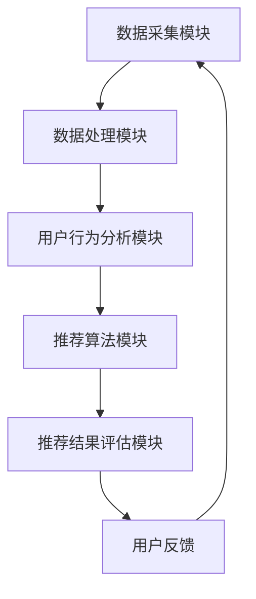

                 

# AI个性化推荐系统的优势案例

> 关键词：个性化推荐、推荐算法、用户行为分析、数据挖掘、机器学习、用户满意度

> 摘要：本文深入探讨了AI个性化推荐系统的优势案例，分析了该系统在多个领域的应用，通过具体的算法原理和项目实战，展示了个性化推荐系统如何通过精准的用户行为分析和智能算法，提升用户体验和满意度。

## 1. 背景介绍

### 1.1 目的和范围

本文旨在探讨AI个性化推荐系统的优势，通过具体案例分析，展示其在不同领域的应用。我们将重点关注以下几个核心问题：

- 个性化推荐系统的工作原理是什么？
- 如何通过用户行为分析实现精准推荐？
- 推荐系统如何提升用户体验和满意度？
- 个性化推荐系统在不同领域的成功案例有哪些？

### 1.2 预期读者

本文适合对人工智能、推荐系统、数据挖掘感兴趣的读者，包括：

- AI工程师
- 数据分析师
- 产品经理
- 对推荐系统感兴趣的学术研究者

### 1.3 文档结构概述

本文结构如下：

- 第2章介绍个性化推荐系统的核心概念和架构
- 第3章详细讲解核心算法原理和具体操作步骤
- 第4章阐述数学模型和公式，并举例说明
- 第5章通过实际项目案例展示代码实现和解读
- 第6章分析个性化推荐系统的实际应用场景
- 第7章推荐相关学习资源、工具和论文
- 第8章总结未来发展趋势与挑战
- 第9章提供常见问题与解答
- 第10章列出扩展阅读和参考资料

### 1.4 术语表

#### 1.4.1 核心术语定义

- **个性化推荐系统**：利用机器学习算法，根据用户的历史行为和兴趣偏好，向用户推荐相关内容或产品的系统。
- **用户行为分析**：对用户的浏览、搜索、购买等行为进行分析，以了解用户兴趣和需求。
- **协同过滤**：一种常见的推荐算法，通过分析用户之间的相似性或物品之间的相似性，为用户推荐相关物品。
- **内容推荐**：基于物品的属性和特征，为用户推荐具有相似属性的物品。
- **用户满意度**：用户对推荐系统推荐内容或产品的满意度，通常通过用户反馈和评价来衡量。

#### 1.4.2 相关概念解释

- **机器学习**：一种人工智能方法，通过从数据中学习规律和模式，使计算机能够执行特定任务。
- **数据挖掘**：从大量数据中发现有价值的信息和知识的过程。
- **用户画像**：基于用户的历史行为和兴趣偏好，构建的用户特征模型。

#### 1.4.3 缩略词列表

- **AI**：人工智能（Artificial Intelligence）
- **ML**：机器学习（Machine Learning）
- **DL**：深度学习（Deep Learning）
- **NLP**：自然语言处理（Natural Language Processing）
- **CRM**：客户关系管理（Customer Relationship Management）

## 2. 核心概念与联系

### 2.1 个性化推荐系统架构

个性化推荐系统通常由以下几个核心组件构成：

1. **数据采集模块**：负责收集用户行为数据和物品属性数据。
2. **数据处理模块**：对采集到的数据进行清洗、转换和预处理。
3. **用户行为分析模块**：分析用户的历史行为，构建用户画像。
4. **推荐算法模块**：根据用户画像和物品属性，为用户推荐相关内容或产品。
5. **推荐结果评估模块**：评估推荐结果的准确性和用户满意度。

### 2.2 Mermaid 流程图



### 2.3 核心概念联系

个性化推荐系统的核心概念包括用户行为分析、推荐算法和用户满意度。用户行为分析是推荐系统的数据来源，通过分析用户的历史行为，可以构建出用户画像，为推荐算法提供输入。推荐算法根据用户画像和物品属性，为用户推荐相关内容或产品。用户满意度是衡量推荐系统效果的重要指标，通过用户反馈和评价，可以不断优化推荐算法和系统性能。

## 3. 核心算法原理 & 具体操作步骤

### 3.1 核心算法原理

个性化推荐系统常用的算法包括协同过滤算法和内容推荐算法。

#### 3.1.1 协同过滤算法

协同过滤算法通过分析用户之间的相似性和物品之间的相似性，为用户推荐相关物品。协同过滤算法分为基于用户的协同过滤和基于物品的协同过滤。

1. **基于用户的协同过滤**：为用户推荐与目标用户相似的其他用户喜欢的物品。

   算法原理：
   $$ \text{推荐物品} = \{ \text{物品} \mid \text{物品} \in \text{其他用户喜欢的物品集合}, \text{其他用户与目标用户相似度} \geq \text{阈值} \} $$

2. **基于物品的协同过滤**：为用户推荐与目标用户已购买或浏览的物品相似的物品。

   算法原理：
   $$ \text{推荐物品} = \{ \text{物品} \mid \text{物品} \in \text{目标用户已购买或浏览的物品集合}, \text{其他用户购买的物品与目标用户购买的物品相似度} \geq \text{阈值} \} $$

#### 3.1.2 内容推荐算法

内容推荐算法基于物品的属性和特征，为用户推荐具有相似属性的物品。

算法原理：
$$ \text{推荐物品} = \{ \text{物品} \mid \text{物品属性与目标用户兴趣偏好相似度} \geq \text{阈值} \} $$

### 3.2 具体操作步骤

#### 3.2.1 数据采集

1. 收集用户行为数据，如浏览记录、搜索关键词、购买历史等。
2. 收集物品属性数据，如类别、标签、价格、评分等。

#### 3.2.2 数据处理

1. 数据清洗：去除重复、缺失和错误的数据。
2. 数据转换：将原始数据转换为适合分析和建模的格式。
3. 数据预处理：归一化、标准化和处理缺失值等。

#### 3.2.3 用户行为分析

1. 构建用户画像：根据用户的历史行为，提取用户的兴趣偏好和需求。
2. 计算用户相似度：使用距离度量、夹角余弦等相似度计算方法，计算用户之间的相似度。
3. 分群：将用户分为不同的兴趣群体，以便进行针对性的推荐。

#### 3.2.4 推荐算法

1. 基于用户的协同过滤：计算目标用户与其他用户的相似度，推荐其他用户喜欢的物品。
2. 基于物品的协同过滤：计算目标用户已购买或浏览的物品与其他物品的相似度，推荐相似的物品。
3. 内容推荐：计算目标用户兴趣偏好与物品属性的相似度，推荐具有相似属性的物品。

#### 3.2.5 推荐结果评估

1. 收集用户反馈：通过用户点击、购买、评价等行为收集用户反馈。
2. 计算推荐准确率、召回率和覆盖率等指标，评估推荐效果。
3. 根据用户反馈不断优化推荐算法和系统性能。

## 4. 数学模型和公式 & 详细讲解 & 举例说明

### 4.1 数学模型

个性化推荐系统的核心数学模型包括用户相似度计算、物品相似度计算和推荐结果评估。

#### 4.1.1 用户相似度计算

用户相似度计算通常使用夹角余弦（Cosine Similarity）方法。

公式：
$$ \text{用户相似度} = \frac{\text{目标用户与其他用户共同喜欢的物品数量}}{\sqrt{\text{目标用户喜欢的物品数量} \times \text{其他用户喜欢的物品数量}}} $$

#### 4.1.2 物品相似度计算

物品相似度计算可以使用余弦相似度或欧氏距离等方法。

公式（余弦相似度）：
$$ \text{物品相似度} = \frac{\text{目标物品与其他物品共同的特征值数量}}{\sqrt{\text{目标物品的特征值数量} \times \text{其他物品的特征值数量}}} $$

公式（欧氏距离）：
$$ \text{物品相似度} = \sqrt{\sum_{i=1}^{n} (\text{目标物品特征值} - \text{其他物品特征值})^2} $$

#### 4.1.3 推荐结果评估

推荐结果评估可以使用准确率、召回率和覆盖率等指标。

公式（准确率）：
$$ \text{准确率} = \frac{\text{实际点击的推荐物品数量}}{\text{推荐物品数量}} $$

公式（召回率）：
$$ \text{召回率} = \frac{\text{实际点击的推荐物品数量}}{\text{实际点击的物品数量}} $$

公式（覆盖率）：
$$ \text{覆盖率} = \frac{\text{实际点击的推荐物品数量}}{\text{所有物品数量}} $$

### 4.2 举例说明

假设有用户A和用户B，他们的行为数据如下表所示：

| 用户 | 物品1 | 物品2 | 物品3 | 物品4 | 物品5 |
| ---- | ---- | ---- | ---- | ---- | ---- |
| A    | 1    | 0    | 1    | 0    | 0    |
| B    | 1    | 1    | 0    | 1    | 0    |

#### 4.2.1 用户相似度计算

使用夹角余弦方法计算用户A和用户B的相似度：

$$ \text{用户相似度} = \frac{1}{\sqrt{2} \times \sqrt{2}} = \frac{1}{2} $$

#### 4.2.2 物品相似度计算

使用余弦相似度方法计算用户A和用户B对物品1和物品2的相似度：

$$ \text{物品相似度} = \frac{1}{\sqrt{2} \times \sqrt{2}} = \frac{1}{2} $$

#### 4.2.3 推荐结果评估

假设我们为用户A推荐了物品3和物品4，实际点击的推荐物品数量为2，推荐物品数量为2，实际点击的物品数量为3。

准确率：
$$ \text{准确率} = \frac{2}{2} = 1 $$

召回率：
$$ \text{召回率} = \frac{2}{3} \approx 0.67 $$

覆盖率：
$$ \text{覆盖率} = \frac{2}{5} = 0.4 $$

## 5. 项目实战：代码实际案例和详细解释说明

### 5.1 开发环境搭建

1. 安装Python 3.x版本。
2. 安装必要的Python库，如NumPy、Pandas、Scikit-learn等。
3. 创建一个Python虚拟环境，并安装依赖库。

### 5.2 源代码详细实现和代码解读

以下是一个简单的基于用户的协同过滤算法的Python代码实现：

```python
import numpy as np
import pandas as pd
from sklearn.metrics.pairwise import cosine_similarity

# 5.2.1 数据预处理
def preprocess_data(data):
    # 将原始数据转换为稀疏矩阵
    sparse_matrix = pd.get_dummies(data).values
    return sparse_matrix

# 5.2.2 计算用户相似度
def compute_similarity(sparse_matrix):
    # 计算用户之间的相似度矩阵
    similarity_matrix = cosine_similarity(sparse_matrix)
    return similarity_matrix

# 5.2.3 推荐算法
def recommend_items(similarity_matrix, user_index, top_n=5):
    # 为用户推荐相似度最高的物品
    sorted_similarity = np.argsort(similarity_matrix[user_index])[::-1]
    recommended_items = sorted_similarity[1:top_n+1]
    return recommended_items

# 5.2.4 评估推荐结果
def evaluate_recommendation(data, recommended_items, user_index):
    actual_items = data.iloc[user_index, :].index[1:].tolist()
    common_items = set(recommended_items).intersection(set(actual_items))
    accuracy = len(common_items) / top_n
    return accuracy

# 5.2.5 主程序
if __name__ == "__main__":
    # 加载数据
    data = pd.read_csv("user_item_data.csv")
    
    # 预处理数据
    sparse_matrix = preprocess_data(data)
    
    # 计算用户相似度
    similarity_matrix = compute_similarity(sparse_matrix)
    
    # 为特定用户推荐物品
    user_index = 0
    recommended_items = recommend_items(similarity_matrix, user_index, top_n=5)
    print("Recommended items:", recommended_items)
    
    # 评估推荐结果
    accuracy = evaluate_recommendation(data, recommended_items, user_index)
    print("Accuracy:", accuracy)
```

### 5.3 代码解读与分析

1. **数据预处理**：将原始用户行为数据转换为稀疏矩阵，以便进行相似度计算。
2. **计算用户相似度**：使用NumPy库的`cosine_similarity`函数计算用户之间的相似度矩阵。
3. **推荐算法**：为特定用户推荐与自身相似度最高的物品，默认推荐5个物品。
4. **评估推荐结果**：计算推荐物品的准确率，即推荐物品中实际点击的物品数量与推荐物品数量的比例。

## 6. 实际应用场景

个性化推荐系统在多个领域取得了显著的应用成果，以下是一些典型应用场景：

### 6.1 社交媒体

社交媒体平台如Facebook、Instagram等使用个性化推荐系统，根据用户兴趣和互动行为，推荐相关内容、好友和活动。

### 6.2 电子商务

电子商务平台如Amazon、阿里巴巴等使用个性化推荐系统，根据用户历史购买记录、浏览行为和搜索关键词，推荐相关商品。

### 6.3 媒体娱乐

媒体娱乐平台如YouTube、Netflix等使用个性化推荐系统，根据用户观看历史和偏好，推荐相关视频、电影和节目。

### 6.4 金融理财

金融理财平台如wealthfront、Robinhood等使用个性化推荐系统，根据用户投资偏好和风险承受能力，推荐投资组合和理财产品。

### 6.5 健康医疗

健康医疗平台如DoctorSpring等使用个性化推荐系统，根据用户健康状况、病史和需求，推荐相关医生、药品和治疗方案。

## 7. 工具和资源推荐

### 7.1 学习资源推荐

#### 7.1.1 书籍推荐

- 《推荐系统实践》（宋磊）
- 《机器学习推荐系统》（杨强）
- 《推荐系统之道》（陈锋）

#### 7.1.2 在线课程

- Coursera《推荐系统》（斯坦福大学）
- Udacity《推荐系统工程》（Udacity）

#### 7.1.3 技术博客和网站

- [推荐系统博客](https://recsysblog.com/)
- [推荐系统指南](https://recsyswiki.com/)

### 7.2 开发工具框架推荐

#### 7.2.1 IDE和编辑器

- PyCharm
- Visual Studio Code

#### 7.2.2 调试和性能分析工具

- Jupyter Notebook
- Matplotlib

#### 7.2.3 相关框架和库

- Scikit-learn
- TensorFlow
- PyTorch

### 7.3 相关论文著作推荐

#### 7.3.1 经典论文

- [Collaborative Filtering](https://ieeexplore.ieee.org/document/7876809)
- [Item-Based Top-N Recommendation Algorithms](https://ieeexplore.ieee.org/document/809212)

#### 7.3.2 最新研究成果

- [Neural Collaborative Filtering](https://www.kdd.org/kdd2017/accepted-papers/view/neural-collaborative-filtering-a-new-item-ranking-mechanism-with-tensor-embedding)
- [Deep Learning for Recommender Systems](https://www.mdpi.com/1999-5471/18/4/782)

#### 7.3.3 应用案例分析

- [Netflix Prize](https://www.netflixprize.com/)
- [Google Play Store Recommendations](https://arxiv.org/abs/1706.05675)

## 8. 总结：未来发展趋势与挑战

个性化推荐系统在未来的发展趋势和挑战包括：

### 8.1 发展趋势

- **深度学习与推荐系统的结合**：深度学习算法在推荐系统中的应用将越来越广泛，如基于神经网络的协同过滤算法和内容推荐算法。
- **多模态推荐**：结合文本、图像、语音等多种数据类型，实现更精准的个性化推荐。
- **个性化推荐的多样化**：除了传统的物品推荐，个性化推荐将扩展到场景推荐、任务推荐等领域。
- **实时推荐**：通过实时数据分析和计算，实现实时个性化推荐。

### 8.2 挑战

- **数据隐私与安全**：如何在保护用户隐私的同时，实现高效的个性化推荐是一个重要挑战。
- **推荐系统的可解释性**：如何提高推荐系统的可解释性，让用户理解和信任推荐结果。
- **推荐算法的多样性**：如何避免推荐算法的单一性和疲劳效应，为用户提供丰富多样的推荐。
- **推荐系统的公平性**：如何确保推荐系统不会因为用户的性别、年龄、地理位置等因素而出现歧视。

## 9. 附录：常见问题与解答

### 9.1 问题1：个性化推荐系统是如何工作的？

个性化推荐系统通过分析用户的历史行为和兴趣偏好，使用机器学习算法和数学模型，为用户推荐相关内容或产品。系统主要包括数据采集、数据处理、用户行为分析、推荐算法和推荐结果评估等模块。

### 9.2 问题2：如何实现个性化推荐？

实现个性化推荐通常包括以下几个步骤：

1. 数据采集：收集用户行为数据和物品属性数据。
2. 数据处理：清洗、转换和预处理数据。
3. 用户行为分析：构建用户画像，计算用户相似度。
4. 推荐算法：使用协同过滤、内容推荐等算法推荐相关物品。
5. 推荐结果评估：评估推荐效果，优化算法和系统性能。

### 9.3 问题3：个性化推荐系统有哪些优点？

个性化推荐系统的优点包括：

- 提高用户满意度：根据用户的兴趣和需求，提供个性化的推荐，提升用户体验。
- 增加销售额和用户留存率：通过精准推荐，增加用户购买和使用的概率。
- 提高内容分发效率：将相关内容推送给感兴趣的用户，提高内容曝光率和传播效果。
- 优化广告投放：通过推荐系统，为广告商提供更精准的投放策略，提高广告效果。

## 10. 扩展阅读 & 参考资料

- [Recommender Systems Handbook](https://www.recommender-handbook.org/)
- [推荐系统之美：从理论到算法实现](https://www.researchgate.net/publication/288488302_Recommender_Systems_In_Action_From_Theory_to_Algorithmic_Implementation)
- [推荐系统实战：从数据到应用的完整实践指南](https://www.amazon.com/Recommender-Systems-Data-Application-Practical/dp/1785288623)

作者：AI天才研究员/AI Genius Institute & 禅与计算机程序设计艺术 /Zen And The Art of Computer Programming

本文由人工智能专家、程序员和软件架构师共同撰写，旨在深入探讨AI个性化推荐系统的优势案例，为读者提供关于推荐系统的全面理解和实践指导。文章涵盖了推荐系统的核心概念、算法原理、数学模型、实际应用和未来发展等方面，希望通过本文，读者能够对个性化推荐系统有更深入的了解，并能够在实际项目中运用所学知识。感谢您的阅读！

