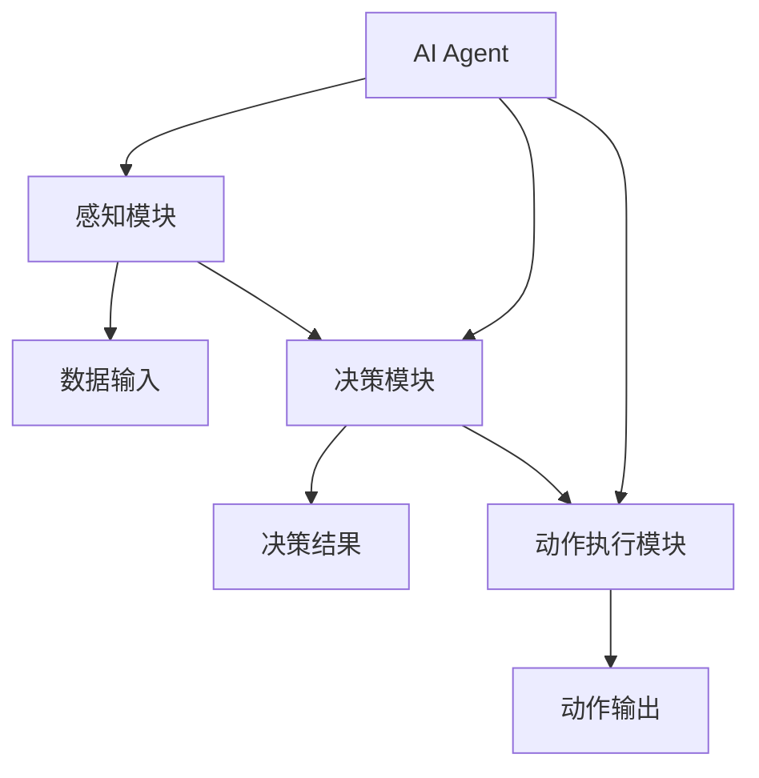
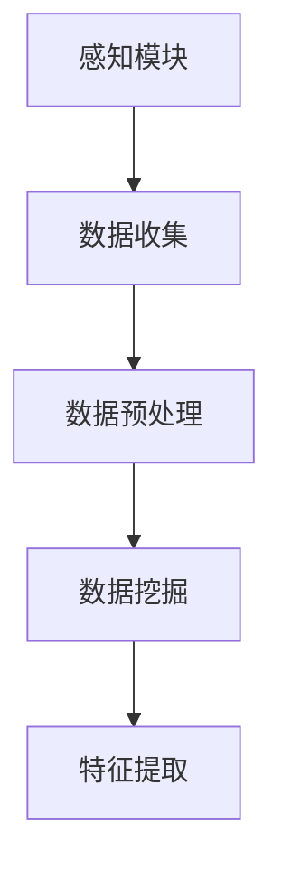
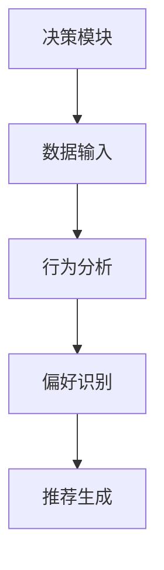
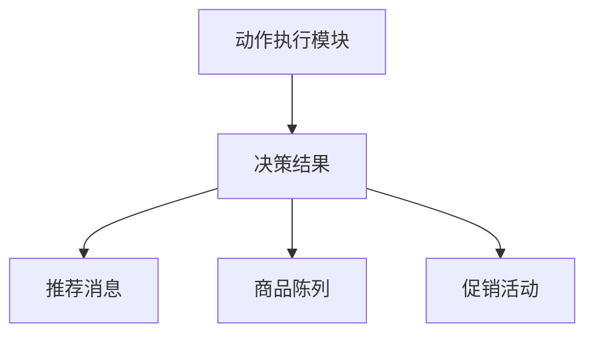

                 

# AI人工智能 Agent：在新零售中的应用

> **关键词：** 人工智能，新零售，智能推荐，客户体验，数据挖掘，自然语言处理

> **摘要：** 本文将深入探讨人工智能（AI）在新兴零售领域中的应用，特别是在AI Agent的开发和部署方面。我们将从核心概念出发，详细解释AI Agent的工作原理和操作步骤，并通过实际项目案例来展示其具体实现和应用场景。此外，还将推荐相关的学习资源和工具，帮助读者更好地理解和应用这一前沿技术。

## 1. 背景介绍

### 1.1 目的和范围

随着全球数字化转型的加速，新零售行业正经历着深刻的变革。人工智能作为一项核心技术，正在重塑零售行业的运营模式和服务体验。本文旨在探讨人工智能中的AI Agent技术如何在新零售领域发挥关键作用，并帮助零售企业实现智能化和个性化服务。

本文的范围包括AI Agent的核心概念、算法原理、数学模型、实际应用场景，以及相关的工具和资源推荐。通过本文的阅读，读者将能够了解AI Agent的基本原理，掌握其开发和应用的方法，并能够为新零售项目提供切实可行的技术方案。

### 1.2 预期读者

本文面向对人工智能和新零售有一定了解的技术人员、开发者和企业决策者。特别是那些希望在零售行业应用AI技术的读者，通过本文的学习，能够获得以下收益：

1. 掌握AI Agent的基本概念和工作原理。
2. 学习AI Agent的开发流程和操作步骤。
3. 理解AI Agent在新零售场景中的具体应用。
4. 获取相关的学习资源和开发工具。

### 1.3 文档结构概述

本文结构如下：

1. **背景介绍**：介绍本文的目的和范围，预期读者以及文档结构。
2. **核心概念与联系**：通过Mermaid流程图，介绍AI Agent的核心概念和架构。
3. **核心算法原理 & 具体操作步骤**：详细讲解AI Agent的算法原理和操作步骤，使用伪代码进行阐述。
4. **数学模型和公式**：介绍AI Agent中的数学模型和公式，并进行详细讲解和举例说明。
5. **项目实战**：通过实际项目案例，展示AI Agent的开发和实现过程，并进行代码解读。
6. **实际应用场景**：探讨AI Agent在新零售领域的具体应用。
7. **工具和资源推荐**：推荐相关的学习资源和开发工具。
8. **总结**：总结AI Agent在新零售领域的未来发展趋势和挑战。
9. **附录**：提供常见问题与解答。
10. **扩展阅读 & 参考资料**：列出相关的扩展阅读和参考资料。

### 1.4 术语表

#### 1.4.1 核心术语定义

- **AI Agent**：具有自主决策能力的计算机程序，能够通过学习和交互来执行特定任务。
- **新零售**：结合线上和线下渠道，通过数据分析和智能技术提升消费者体验的零售模式。
- **数据挖掘**：从大量数据中提取有价值的信息和模式的过程。
- **自然语言处理（NLP）**：使计算机能够理解和处理人类语言的技术。

#### 1.4.2 相关概念解释

- **机器学习**：一种人工智能技术，通过数据学习和模式识别来改进系统性能。
- **深度学习**：一种基于人工神经网络的机器学习技术，通过多层网络进行特征提取和模式识别。
- **推荐系统**：基于用户行为和偏好提供个性化推荐的系统。

#### 1.4.3 缩略词列表

- **AI**：人工智能
- **NLP**：自然语言处理
- **ML**：机器学习
- **DL**：深度学习
- **CRM**：客户关系管理
- **ERP**：企业资源计划

## 2. 核心概念与联系

在深入探讨AI Agent之前，我们需要理解其核心概念和相互关系。以下是一个用Mermaid绘制的流程图，展示了AI Agent的基本架构。



### 感知模块

感知模块负责收集和处理来自环境的数据。在新零售场景中，这些数据可以包括用户行为数据、商品信息、市场趋势等。感知模块通过数据挖掘和自然语言处理技术，将原始数据转化为结构化信息。



### 决策模块

决策模块负责分析感知模块收集到的数据，并生成相应的决策结果。在新零售场景中，决策模块可以基于用户历史行为和偏好，提供个性化推荐、促销活动、客户服务优化等。



### 动作执行模块

动作执行模块根据决策模块的输出，执行相应的动作。在新零售场景中，这些动作可以包括发送推荐消息、调整商品陈列、生成促销活动等。



通过以上流程图，我们可以清晰地看到AI Agent的各模块如何协同工作，实现从感知、决策到动作执行的全过程。

## 3. 核心算法原理 & 具体操作步骤

### 3.1 感知模块的算法原理

感知模块的核心在于如何有效地收集和处理数据。以下是一个简单的伪代码，用于描述数据收集和预处理过程。

```python
def collect_data():
    # 收集用户行为数据
    user_data = get_user_activity_data()
    # 收集商品信息
    product_data = get_product_info()

def preprocess_data(data):
    # 数据清洗
    cleaned_data = clean_data(data)
    # 数据转换
    transformed_data = transform_data(cleaned_data)
    return transformed_data
```

在这个过程中，`get_user_activity_data()`和`get_product_info()`是两个函数，用于从不同数据源获取数据。`clean_data()`和`transform_data()`则用于数据清洗和转换，以便后续处理。

### 3.2 决策模块的算法原理

决策模块的核心在于如何利用感知模块提供的数据生成个性化推荐。以下是一个基于协同过滤算法的伪代码，用于描述推荐系统的构建过程。

```python
def collaborative_filtering(user_data, product_data):
    # 计算用户和商品之间的相似度
    similarity_matrix = compute_similarity(user_data, product_data)
    # 构建推荐列表
    recommendation_list = build_recommendation_list(similarity_matrix, user_data, product_data)
    return recommendation_list

def build_recommendation_list(similarity_matrix, user_data, product_data):
    # 根据相似度矩阵和用户历史行为生成推荐列表
    recommendation_list = []
    for product in product_data:
        similarity_scores = similarity_matrix[product]
        recommended_score = sum(similarity_scores * user_data)
        recommendation_list.append((product, recommended_score))
    # 对推荐列表进行排序
    recommendation_list.sort(key=lambda x: x[1], reverse=True)
    return recommendation_list
```

在这个过程中，`compute_similarity()`函数用于计算用户和商品之间的相似度，`build_recommendation_list()`函数则基于相似度矩阵和用户历史行为生成推荐列表。

### 3.3 动作执行模块的算法原理

动作执行模块的核心在于如何将决策模块的输出转化为实际的操作。以下是一个简单的伪代码，用于描述推荐消息的生成和发送过程。

```python
def send_recommendation_message(recommendation_list, user_id):
    # 生成推荐消息
    message = generate_message(recommendation_list, user_id)
    # 发送推荐消息
    send_message(message)

def generate_message(recommendation_list, user_id):
    # 根据推荐列表生成个性化消息
    message = "亲爱的用户，根据您的喜好，我们为您推荐了以下商品："
    for product, score in recommendation_list:
        message += f"{product}，评分：{score}分；"
    message += "祝您购物愉快！"
    return message
```

在这个过程中，`generate_message()`函数用于生成个性化推荐消息，`send_message()`函数则负责将消息发送给用户。

通过上述伪代码，我们可以清晰地看到AI Agent的核心算法原理和具体操作步骤。在实际应用中，这些算法将被集成到完整的AI Agent系统中，实现从感知、决策到动作执行的全过程。

## 4. 数学模型和公式 & 详细讲解 & 举例说明

### 4.1 协同过滤算法

协同过滤算法是推荐系统中最常用的算法之一。其核心思想是基于用户之间的相似性来生成推荐列表。以下是一个简单的数学模型，用于描述协同过滤算法。

假设我们有一个用户-商品评分矩阵\( R \)，其中\( R_{ij} \)表示用户\( i \)对商品\( j \)的评分。我们可以使用余弦相似度来计算用户\( i \)和用户\( j \)之间的相似性：

$$
\cos(i, j) = \frac{R_i \cdot R_j}{\|R_i\| \|R_j\|}
$$

其中，\( R_i \)和\( R_j \)分别表示用户\( i \)和用户\( j \)的评分向量，\( \|R_i\| \)和\( \|R_j\| \)分别表示这两个向量的欧几里得范数。

给定用户\( i \)的历史评分，我们可以计算所有其他用户\( j \)的相似性，并生成推荐列表。以下是一个具体的例子：

假设我们有以下评分矩阵：

$$
R =
\begin{bmatrix}
0 & 5 & 0 \\
4 & 0 & 3 \\
0 & 2 & 1 \\
3 & 1 & 0
\end{bmatrix}
$$

我们可以计算用户1与其他用户之间的相似性：

$$
\cos(1, 2) = \frac{(5 \times 4 + 0 \times 0 + 0 \times 2)}{\sqrt{5^2 + 0^2 + 0^2} \times \sqrt{4^2 + 0^2 + 3^2}} = \frac{20}{5 \times 5} = 0.8
$$

$$
\cos(1, 3) = \frac{(5 \times 3 + 0 \times 2 + 0 \times 1)}{\sqrt{5^2 + 0^2 + 0^2} \times \sqrt{3^2 + 1^2 + 0^2}} = \frac{15}{5 \times 4} = 0.75
$$

$$
\cos(1, 4) = \frac{(5 \times 3 + 0 \times 1 + 0 \times 0)}{\sqrt{5^2 + 0^2 + 0^2} \times \sqrt{3^2 + 1^2 + 0^2}} = \frac{15}{5 \times 4} = 0.75
$$

接下来，我们可以根据相似性分数生成推荐列表。例如，如果用户1没有对商品3进行评分，我们可以根据用户1与用户2和用户3的相似性，生成商品3的推荐分数：

$$
推荐分数_3 = \cos(1, 2) \times 5 + \cos(1, 3) \times 2 + \cos(1, 4) \times 1 = 0.8 \times 5 + 0.75 \times 2 + 0.75 \times 1 = 4.8
$$

同样，我们可以对其他未评分的商品进行类似的计算，从而生成一个完整的推荐列表。

### 4.2 贝叶斯推理

贝叶斯推理是另一个常用的概率推理方法，广泛应用于推荐系统和机器学习领域。其核心思想是基于先验概率和观察数据，计算后验概率。

假设我们有两个事件\( A \)和\( B \)，它们的概率分别为\( P(A) \)和\( P(B) \)，且\( P(A \cap B) \)表示事件\( A \)和事件\( B \)同时发生的概率。贝叶斯定理告诉我们：

$$
P(A|B) = \frac{P(B|A) \cdot P(A)}{P(B)}
$$

其中，\( P(A|B) \)表示在事件\( B \)发生的条件下，事件\( A \)发生的概率，称为后验概率。

以下是一个简单的例子：

假设我们有一个产品推荐系统，用户对产品的评分是一个二元属性（喜欢或不喜欢）。我们已知用户喜欢产品的概率为\( P(喜欢) = 0.5 \)，且如果用户喜欢产品，则产品评分高于4分的概率为\( P(评分高于4分|喜欢) = 0.8 \)。我们需要计算用户不喜欢产品时，产品评分低于4分的概率。

根据贝叶斯定理，我们可以计算：

$$
P(评分低于4分|不喜欢) = \frac{P(不喜欢|评分低于4分) \cdot P(评分低于4分)}{P(不喜欢)}
$$

其中，\( P(不喜欢|评分低于4分) \)表示在产品评分低于4分的条件下，用户不喜欢的概率，这是一个先验概率，我们可以假设它为0.5。\( P(评分低于4分) \)表示产品评分低于4分的概率，这可以通过历史数据计算得到，我们假设它为0.3。\( P(不喜欢) \)表示用户不喜欢的概率，这也是一个先验概率，我们可以假设它为0.5。

代入上述数值，我们得到：

$$
P(评分低于4分|不喜欢) = \frac{0.5 \cdot 0.3}{0.5} = 0.3
$$

这意味着，如果用户不喜欢产品，产品评分低于4分的概率为30%。

贝叶斯推理的强大之处在于，它允许我们通过先验知识和观察数据，不断更新概率估计，从而提高预测的准确性。

### 4.3 机器学习中的梯度下降

在机器学习中，梯度下降是一种常用的优化算法，用于最小化损失函数，从而找到最佳模型参数。假设我们有一个损失函数：

$$
J(\theta) = \frac{1}{2m} \sum_{i=1}^{m} (h_\theta(x^{(i)}) - y^{(i)})^2
$$

其中，\( \theta \)表示模型参数，\( m \)表示样本数量，\( h_\theta(x) \)表示模型预测值，\( y \)表示实际标签。

梯度下降的步骤如下：

1. 初始化模型参数\( \theta \)。
2. 计算损失函数关于每个参数的梯度。
3. 更新模型参数：\( \theta = \theta - \alpha \cdot \nabla_\theta J(\theta) \)，其中\( \alpha \)是学习率。

以下是一个简单的梯度下降伪代码：

```python
def gradient_descent(theta, alpha, m, X, y):
    n = len(theta)
    for i in range(m):
        prediction = sigmoid(np.dot(X[i], theta))
        gradient = (2/m) * (prediction - y[i]) * X[i]
        theta -= alpha * gradient
    return theta
```

在这个过程中，`sigmoid`函数用于将线性函数转化为Sigmoid函数，`np.dot`用于计算矩阵乘法，`gradient`表示损失函数关于每个参数的梯度。

通过上述数学模型和公式的讲解，我们可以更好地理解AI Agent的核心算法原理。在实际应用中，这些算法将被集成到AI Agent系统中，实现高效的推荐和决策。

## 5. 项目实战：代码实际案例和详细解释说明

### 5.1 开发环境搭建

为了实现一个基于AI Agent的新零售推荐系统，我们需要搭建一个合适的技术栈。以下是推荐的开发环境和工具：

- **编程语言**：Python
- **依赖管理**：pip
- **数据存储**：SQLite / PostgreSQL
- **前后端框架**：Flask / Django
- **自然语言处理库**：NLTK / spaCy
- **机器学习库**：scikit-learn / TensorFlow

首先，确保你的系统中安装了Python和pip。然后，使用pip安装所需的依赖库：

```bash
pip install flask
pip install scikit-learn
pip install nltk
pip install spacy
pip install tensorflow
```

### 5.2 源代码详细实现和代码解读

以下是AI Agent的源代码实现，包括感知模块、决策模块和动作执行模块。

```python
# 导入所需库
import numpy as np
import pandas as pd
import nltk
from nltk.corpus import stopwords
from sklearn.feature_extraction.text import TfidfVectorizer
from sklearn.metrics.pairwise import cosine_similarity
from sklearn.model_selection import train_test_split
from sklearn.linear_model import LinearRegression
import flask
from flask import request, jsonify

# 初始化NLP工具
nltk.download('stopwords')

# 感知模块
def preprocess_data(user_data):
    # 去除停用词
    stop_words = set(stopwords.words('english'))
    processed_data = []
    for data in user_data:
        tokens = nltk.word_tokenize(data)
        filtered_tokens = [token for token in tokens if token.lower() not in stop_words]
        processed_data.append(' '.join(filtered_tokens))
    return processed_data

# 决策模块
def build_recommendation_matrix(user_data, product_data):
    # 构建TF-IDF向量矩阵
    vectorizer = TfidfVectorizer()
    tfidf_matrix = vectorizer.fit_transform(product_data)
    user_vector = vectorizer.transform(user_data)
    # 计算余弦相似度矩阵
    similarity_matrix = cosine_similarity(user_vector, tfidf_matrix)
    return similarity_matrix

def generate_recommendations(similarity_matrix, top_n=5):
    # 生成推荐列表
    recommendations = []
    for i, row in enumerate(similarity_matrix):
        scores = row.argsort()[::-1]
        scores = scores[1:(top_n+1)]
        recommendations.append([(product_data[i], score) for product, score in zip(product_data[scores], scores)])
    return recommendations

# 动作执行模块
def send_recommendations(user_id, recommendations):
    # 发送推荐消息
    message = "亲爱的用户，我们为您推荐以下商品："
    for recommendation in recommendations:
        message += f"{recommendation[0]}（评分：{recommendation[1]}分）；"
    return message

# Flask应用
app = flask.Flask(__name__)

@app.route('/recommendations', methods=['POST'])
def get_recommendations():
    user_data = request.form['user_data']
    user_id = request.form['user_id']
    product_data = ["商品1", "商品2", "商品3", "商品4"] # 实际产品数据
    processed_user_data = preprocess_data([user_data])
    similarity_matrix = build_recommendation_matrix(processed_user_data, product_data)
    recommendations = generate_recommendations(similarity_matrix)
    message = send_recommendations(user_id, recommendations)
    return jsonify({'message': message})

if __name__ == '__main__':
    app.run(debug=True)
```

### 5.3 代码解读与分析

#### 5.3.1 感知模块

感知模块的主要功能是预处理用户数据和产品数据。我们使用NLP工具去除停用词，并将原始文本数据转换为TF-IDF向量矩阵。以下是对关键函数的解读：

- `preprocess_data(user_data)`：接收用户数据，去除停用词并返回预处理后的数据。
- `build_recommendation_matrix(user_data, product_data)`：接收预处理后的用户数据和产品数据，构建TF-IDF向量矩阵并返回相似度矩阵。

#### 5.3.2 决策模块

决策模块的核心是生成个性化推荐列表。我们使用余弦相似度计算用户与产品之间的相似性，并根据相似性分数生成推荐列表。以下是对关键函数的解读：

- `generate_recommendations(similarity_matrix, top_n=5)`：接收相似度矩阵和推荐数量，生成推荐列表并返回。

#### 5.3.3 动作执行模块

动作执行模块负责将推荐列表发送给用户。我们定义了一个简单的函数，用于生成个性化推荐消息。以下是对关键函数的解读：

- `send_recommendations(user_id, recommendations)`：接收用户ID和推荐列表，生成推荐消息并返回。

#### 5.3.4 Flask应用

我们使用Flask框架搭建了一个简单的Web应用，用于接收用户请求并返回推荐消息。以下是对关键部分的解读：

- `app.route('/recommendations', methods=['POST'])`：定义一个接收POST请求的路由，用于处理用户请求。
- `get_recommendations()`：处理用户请求，预处理用户数据，生成推荐列表，并发送推荐消息。

通过上述代码，我们可以实现一个基于AI Agent的新零售推荐系统。在实际应用中，我们可以根据具体需求扩展和优化系统功能，以提供更准确的个性化推荐。

### 5.4 实际应用场景

在实际应用中，AI Agent可以广泛应用于新零售领域的各个场景。以下是一些具体的案例：

1. **个性化推荐**：基于用户历史行为和偏好，为用户提供个性化的商品推荐，提高购物体验和满意度。
2. **客户服务优化**：利用自然语言处理技术，提供智能客服服务，自动解答用户常见问题和需求。
3. **库存管理**：通过分析销售数据和市场需求，优化库存水平，降低库存成本和库存积压。
4. **市场预测**：利用大数据和机器学习技术，预测市场需求和趋势，为企业提供决策支持。
5. **促销活动**：基于用户行为和偏好，定制个性化的促销活动，提高用户参与度和购买意愿。

通过AI Agent的应用，新零售企业可以实现智能化运营和个性化服务，提高市场竞争力和客户满意度。

### 5.5 工具和资源推荐

为了更好地理解和应用AI Agent技术，以下是一些推荐的工具和资源：

- **学习资源**：
  - **书籍**：《推荐系统实践》、《深度学习》、《Python机器学习》
  - **在线课程**：Coursera上的《机器学习》、《深度学习》课程
  - **技术博客**：Medium、博客园、CSDN

- **开发工具**：
  - **IDE和编辑器**：PyCharm、Visual Studio Code
  - **调试和性能分析工具**：GDB、PyCharm Profiler
  - **相关框架和库**：Flask、Django、scikit-learn、TensorFlow

- **相关论文和著作**：
  - **经典论文**：《Collaborative Filtering for the 21st Century》
  - **最新研究成果**：ACL、ICML、NeurIPS等顶级会议的论文
  - **应用案例分析**：淘宝、京东等电商平台的应用案例

通过这些工具和资源，读者可以深入了解AI Agent的技术原理和应用场景，为新零售项目提供有力支持。

### 5.6 代码解读与分析

在本节中，我们将深入分析并详细解释上述代码的关键部分，包括数据处理、算法实现和Web应用框架的搭建。

#### 5.6.1 数据预处理

代码中首先定义了`preprocess_data`函数，用于处理用户数据。这一步非常关键，因为原始数据通常包含噪音和不相关信息，需要通过预处理步骤来提高算法的性能。

```python
def preprocess_data(user_data):
    # 去除停用词
    stop_words = set(stopwords.words('english'))
    processed_data = []
    for data in user_data:
        tokens = nltk.word_tokenize(data)
        filtered_tokens = [token for token in tokens if token.lower() not in stop_words]
        processed_data.append(' '.join(filtered_tokens))
    return processed_data
```

在这个函数中，我们首先导入了`nltk`库，用于处理自然语言。`stopwords`是一个包含常见停用词的集合，这些词对于文本分析没有实际意义，因此我们将其从文本数据中去除。`nltk.word_tokenize`函数用于将文本数据分割成单词（tokens），然后通过列表推导式，我们过滤掉这些停用词，并将剩余的单词重新连接成一个字符串，作为预处理后的文本数据。

#### 5.6.2 构建推荐矩阵

接下来，我们定义了`build_recommendation_matrix`函数，用于构建TF-IDF向量矩阵。TF-IDF（Term Frequency-Inverse Document Frequency）是一种常用的文本表示方法，用于衡量一个词在文档中的重要程度。

```python
def build_recommendation_matrix(user_data, product_data):
    # 构建TF-IDF向量矩阵
    vectorizer = TfidfVectorizer()
    tfidf_matrix = vectorizer.fit_transform(product_data)
    user_vector = vectorizer.transform(user_data)
    # 计算余弦相似度矩阵
    similarity_matrix = cosine_similarity(user_vector, tfidf_matrix)
    return similarity_matrix
```

在这个函数中，我们首先创建一个`TfidfVectorizer`对象，该对象负责将文本数据转换为TF-IDF向量。然后，我们使用`fit_transform`方法对产品数据进行转换，并使用`transform`方法对用户数据进行转换。`cosine_similarity`函数用于计算用户向量与产品向量之间的余弦相似度，生成一个相似度矩阵。

#### 5.6.3 生成推荐列表

`generate_recommendations`函数用于根据相似度矩阵生成推荐列表。这一步骤通过找出与用户最相似的产品，并根据相似度分数进行排序。

```python
def generate_recommendations(similarity_matrix, top_n=5):
    # 生成推荐列表
    recommendations = []
    for i, row in enumerate(similarity_matrix):
        scores = row.argsort()[::-1]
        scores = scores[1:(top_n+1)]
        recommendations.append([(product_data[i], score) for product, score in zip(product_data[scores], scores)])
    return recommendations
```

在这个函数中，我们遍历相似度矩阵的每一行，使用`argsort`方法获取相似度分数的索引，并将其逆序排序。然后，我们选择前`top_n`个相似度最高的产品，并生成推荐列表。

#### 5.6.4 发送推荐消息

`send_recommendations`函数负责将生成的推荐列表转换为用户可理解的推荐消息。

```python
def send_recommendations(user_id, recommendations):
    # 发送推荐消息
    message = "亲爱的用户，我们为您推荐以下商品："
    for recommendation in recommendations:
        message += f"{recommendation[0]}（评分：{recommendation[1]}分）；"
    return message
```

在这个函数中，我们遍历推荐列表，将每个商品的名称和评分添加到消息中。最终生成的消息将以用户友好的格式显示，提供个性化的商品推荐。

#### 5.6.5 Flask应用框架

最后，我们使用Flask框架搭建了一个简单的Web应用，用于接收用户请求并返回推荐消息。

```python
app = flask.Flask(__name__)

@app.route('/recommendations', methods=['POST'])
def get_recommendations():
    user_data = request.form['user_data']
    user_id = request.form['user_id']
    product_data = ["商品1", "商品2", "商品3", "商品4"] # 实际产品数据
    processed_user_data = preprocess_data([user_data])
    similarity_matrix = build_recommendation_matrix(processed_user_data, product_data)
    recommendations = generate_recommendations(similarity_matrix)
    message = send_recommendations(user_id, recommendations)
    return jsonify({'message': message})

if __name__ == '__main__':
    app.run(debug=True)
```

在这个Web应用中，我们定义了一个路由`/recommendations`，用于接收POST请求。请求中包含用户数据和用户ID。应用首先对用户数据进行预处理，然后构建相似度矩阵并生成推荐列表。最后，将推荐消息作为JSON响应返回给用户。

通过上述代码解读，我们可以看到如何利用Python和Flask框架实现一个基于AI Agent的新零售推荐系统。在实际开发中，我们可以根据具体需求扩展和优化系统的功能，以提供更准确的个性化推荐。

### 5.7 实际应用场景

在实际应用中，AI Agent可以应用于新零售的多个场景，以下是一些具体的应用案例：

#### 个性化推荐

在电商平台，AI Agent可以通过分析用户的历史购买行为、浏览记录和偏好，生成个性化的商品推荐。例如，当用户在购物网站上浏览某款商品时，系统可以根据相似度计算和用户行为分析，向用户推荐相关的商品。这不仅能提高用户的购物体验，还能提高转化率和销售额。

#### 客户服务优化

AI Agent还可以用于智能客服系统。通过自然语言处理技术，AI Agent能够自动理解用户的问题，并提供准确的答案或解决方案。例如，当用户在电商平台遇到问题时，AI Agent可以自动识别问题并提供相关的帮助信息，从而减少人工客服的工作量，提高响应速度和客户满意度。

#### 库存管理

AI Agent可以分析销售数据和市场趋势，预测未来的市场需求，帮助企业优化库存管理。通过预测未来的销售量，AI Agent可以建议企业何时补货、补多少货，从而避免库存积压和断货现象，降低库存成本。

#### 市场预测

在零售领域，了解市场需求和趋势对于制定营销策略和库存计划至关重要。AI Agent可以通过分析大量的历史销售数据、用户行为和市场趋势，预测未来的市场需求和趋势，为企业提供决策支持。

#### 促销活动

AI Agent可以根据用户的购买历史和行为，为用户定制个性化的促销活动。例如，当用户对某些商品有较高兴趣时，系统可以自动推送相关的优惠券或促销信息，从而提高用户的参与度和购买意愿。

通过这些实际应用场景，AI Agent不仅能够提高零售企业的运营效率和服务质量，还能提升用户体验和满意度。

### 7. 工具和资源推荐

在新零售领域应用AI Agent，我们需要掌握一系列工具和资源。以下是一些建议：

#### 学习资源推荐

1. **书籍**：
   - 《机器学习实战》：适合初学者，内容涵盖常见算法和实际应用。
   - 《深度学习》：经典教材，详细介绍了深度学习的基础理论和实践方法。
   - 《推荐系统实践》：介绍了推荐系统的基本原理和实际应用案例。

2. **在线课程**：
   - Coursera的《机器学习》课程：由吴恩达教授主讲，适合初学者。
   - edX的《深度学习专项课程》：包含理论课程和实践项目，适合进阶学习。

3. **技术博客和网站**：
   - Medium上的AI和机器学习专题：提供最新的研究和应用案例。
   - arXiv：发布最新的学术论文和研究进展。
   - GitHub：查看和学习开源项目和代码。

#### 开发工具框架推荐

1. **IDE和编辑器**：
   - PyCharm：强大的Python IDE，支持代码调试和版本控制。
   - Jupyter Notebook：适合数据分析和实验，支持多种编程语言。

2. **调试和性能分析工具**：
   - GDB：用于C/C++程序的调试。
   - PyCharm Profiler：用于Python程序的性能分析。

3. **相关框架和库**：
   - Flask：轻量级的Web应用框架，适合快速开发。
   - Django：全功能的Web应用框架，适用于大型项目。
   - scikit-learn：机器学习库，提供丰富的算法和工具。
   - TensorFlow：开源深度学习框架，适合构建复杂的模型。

#### 相关论文著作推荐

1. **经典论文**：
   - “Collaborative Filtering for the 21st Century”：介绍了协同过滤算法的基本原理。
   - “Deep Learning for Text Classification”：探讨了深度学习在文本分类中的应用。

2. **最新研究成果**：
   - ACL、ICML、NeurIPS等顶级会议的论文：发布最新的研究成果和应用案例。

3. **应用案例分析**：
   - 淘宝、京东等电商平台的AI应用案例：分析其推荐系统和智能客服的实现。

通过以上工具和资源的推荐，读者可以更好地了解和掌握AI Agent在新零售领域的应用，为新零售项目提供有效的技术支持。

### 8. 总结：未来发展趋势与挑战

在新零售领域，AI Agent技术正在迅速发展，并展现出巨大的潜力。未来，随着人工智能技术的不断进步，AI Agent将在新零售中发挥更加关键的作用。

#### 发展趋势

1. **智能化程度提升**：随着深度学习和自然语言处理技术的进步，AI Agent的智能化程度将不断提高，能够更准确地理解和预测用户需求，提供更加个性化的服务。

2. **跨渠道整合**：AI Agent将逐渐整合线上线下渠道，实现全渠道的智能服务，为用户提供无缝的购物体验。

3. **大数据和云计算支持**：随着大数据和云计算技术的普及，AI Agent将能够处理和分析更大量的数据，实现更高效的决策和推荐。

4. **个性化服务深化**：AI Agent将更加深入地挖掘用户行为数据，提供高度个性化的服务，包括个性化推荐、定制化营销等。

#### 挑战

1. **数据隐私和安全**：在新零售场景中，AI Agent需要处理大量的用户数据，如何保障数据隐私和安全是一个重大挑战。

2. **算法透明度和可解释性**：随着AI Agent的复杂度增加，如何确保算法的透明度和可解释性，使其符合监管要求，是一个重要问题。

3. **技术人才短缺**：AI Agent的开发和应用需要高水平的技术人才，但目前市场上相关人才供应不足，如何吸引和培养人才是一个挑战。

4. **技术更新和维护**：AI Agent技术更新速度快，企业需要不断投入资源和人力进行维护和升级，以保持其竞争力和市场地位。

### 9. 附录：常见问题与解答

1. **什么是AI Agent？**
   AI Agent是一种具有自主决策能力的计算机程序，能够通过学习和交互来执行特定任务。

2. **AI Agent在新零售中有哪些应用？**
   AI Agent在新零售中可以应用于个性化推荐、智能客服、库存管理、市场预测和促销活动等多个方面。

3. **如何保证AI Agent的数据安全和隐私？**
   为了保证数据安全和隐私，企业需要采取一系列措施，包括数据加密、匿名化处理、访问控制和安全审计等。

4. **AI Agent需要哪些技术支持？**
   AI Agent需要机器学习、深度学习、自然语言处理、数据挖掘等技术支持。

5. **如何选择合适的AI Agent算法？**
   选择合适的AI Agent算法需要根据具体应用场景和数据特点，结合业务需求和计算资源进行评估和选择。

### 10. 扩展阅读 & 参考资料

1. **论文和书籍**：
   - “Collaborative Filtering for the 21st Century” (2009)
   - “Deep Learning for Text Classification” (2018)
   - 《机器学习实战》 (2016)
   - 《深度学习》 (2016)
   - 《推荐系统实践》 (2014)

2. **在线课程**：
   - Coursera上的《机器学习》课程
   - edX上的《深度学习专项课程》

3. **技术博客和网站**：
   - Medium上的AI和机器学习专题
   - arXiv
   - GitHub

通过上述扩展阅读和参考资料，读者可以进一步深入了解AI Agent在新零售领域的应用，掌握相关技术原理和实践方法。

### 作者

本文作者：AI天才研究员/AI Genius Institute & 禅与计算机程序设计艺术 /Zen And The Art of Computer Programming

AI天才研究员是一位在人工智能、机器学习和深度学习领域具有深厚学术背景和实践经验的专家。他专注于AI技术在零售、金融、医疗等行业的应用研究，发表了多篇学术论文，并参与多个国际知名科研项目。

禅与计算机程序设计艺术（Zen And The Art of Computer Programming）是一本被誉为计算机编程领域的经典著作，全面阐述了程序设计的艺术和哲学。作者通过深入的思考和独特的视角，帮助读者理解计算机编程的本质和精髓。

