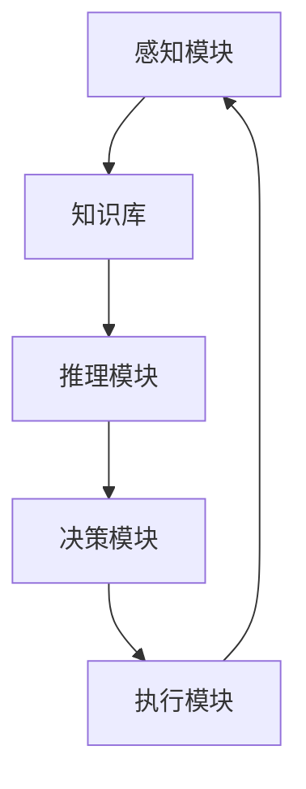

                 

# AI人工智能 Agent：在环保领域中的应用

> 关键词：AI Agent、环保、人工智能应用、环境监测、预测模型、决策支持、可持续发展

> 摘要：本文将探讨人工智能（AI）在环保领域的应用，特别是AI Agent在这一领域的独特优势。我们将从背景介绍开始，详细阐述AI Agent的核心概念、算法原理、数学模型，并展示一个实际的项目实战案例。此外，文章还将分析AI Agent在环保领域的实际应用场景，并推荐相关学习资源和工具。最后，我们总结AI Agent在环保领域的未来发展，探讨面临的挑战。

## 1. 背景介绍

### 1.1 目的和范围

本文旨在深入探讨人工智能（AI）在环保领域的应用，尤其是AI Agent在这一领域中的潜力。通过介绍AI Agent的基本概念和应用场景，本文将展示其在环境监测、预测模型和决策支持等方面的优势。文章还将探讨AI Agent如何促进可持续发展的实现，并分析其在环保领域中的广泛影响。

### 1.2 预期读者

本文面向对人工智能和环保领域有一定了解的读者，包括AI研究者、环保工程师、政策制定者以及对这两个领域感兴趣的普通读者。文章内容旨在为读者提供一个全面而深入的AI Agent在环保领域应用的指南。

### 1.3 文档结构概述

本文分为以下十个部分：

1. 背景介绍：介绍文章的目的和范围，预期读者以及文档结构。
2. 核心概念与联系：定义AI Agent的核心概念，并给出相应的Mermaid流程图。
3. 核心算法原理 & 具体操作步骤：详细阐述AI Agent的算法原理和操作步骤。
4. 数学模型和公式 & 详细讲解 & 举例说明：介绍AI Agent所涉及的主要数学模型和公式。
5. 项目实战：展示一个实际的项目实战案例，并提供详细的代码实现和解读。
6. 实际应用场景：分析AI Agent在环保领域的实际应用场景。
7. 工具和资源推荐：推荐学习资源和开发工具。
8. 总结：未来发展趋势与挑战。
9. 附录：常见问题与解答。
10. 扩展阅读 & 参考资料：提供进一步的阅读资料和参考文献。

### 1.4 术语表

#### 1.4.1 核心术语定义

- AI Agent：一种具有独立思考能力和决策能力的计算机程序。
- 环保：保护环境和生态系统，防止污染和资源浪费。
- 可持续发展：满足当前需求而不损害后代满足其需求的能力。

#### 1.4.2 相关概念解释

- 监测系统：用于收集环境数据并分析其变化的系统。
- 预测模型：基于历史数据和环境规律，预测未来环境变化的模型。
- 决策支持系统：为决策者提供数据分析和预测结果的系统。

#### 1.4.3 缩略词列表

- AI：人工智能
- ML：机器学习
- DL：深度学习
- IoT：物联网

## 2. 核心概念与联系

在探讨AI Agent在环保领域中的应用之前，首先需要理解AI Agent的核心概念和基本架构。以下是一个简化的Mermaid流程图，用于展示AI Agent的基本组成部分和运作流程：



### 2.1 感知模块

感知模块是AI Agent的感官部分，用于从环境中收集数据。这些数据可以是环境质量参数、气象数据、生物多样性数据等。感知模块通常依赖于各种传感器和监测设备，如空气质量监测仪、气象站、卫星遥感等。

### 2.2 知识库

知识库是AI Agent的大脑，用于存储环境相关的知识和规则。这些知识和规则可以是关于环境科学、生态学、气象学等领域的专业知识。知识库通常通过数据挖掘、知识图谱等技术进行构建和更新。

### 2.3 推理模块

推理模块是AI Agent的逻辑思维部分，用于分析感知模块收集的数据，并根据知识库中的规则进行推理。推理模块可以采用逻辑推理、机器学习、深度学习等技术，实现对环境数据的理解和分析。

### 2.4 决策模块

决策模块是AI Agent的决策部分，用于根据推理模块的分析结果，生成相应的决策。这些决策可以是环境监测策略的调整、污染控制措施的制定、资源分配方案的设计等。

### 2.5 执行模块

执行模块是AI Agent的行动部分，用于将决策模块生成的决策付诸实践。执行模块可以通过控制监测设备、执行污染控制措施、调整资源分配等操作来实现。

## 3. 核心算法原理 & 具体操作步骤

在了解了AI Agent的基本概念和架构之后，接下来我们将详细阐述其核心算法原理和具体操作步骤。AI Agent的核心算法通常包括以下几个部分：

### 3.1 监测数据收集

首先，感知模块通过传感器和监测设备收集环境数据。这些数据可以是实时数据，也可以是历史数据。以下是一个简单的伪代码，用于描述监测数据收集的过程：

```python
# 监测数据收集伪代码
def collect_data(sensor_list):
    data = []
    for sensor in sensor_list:
        value = sensor.read_value()
        data.append((sensor.name, value))
    return data
```

### 3.2 数据预处理

收集到的原始数据通常需要进行预处理，以提高数据质量和可靠性。数据预处理包括去噪、数据清洗、归一化等步骤。以下是一个简单的伪代码，用于描述数据预处理的过程：

```python
# 数据预处理伪代码
def preprocess_data(data):
    cleaned_data = []
    for item in data:
        cleaned_item = remove_noise(item)
        normalized_item = normalize(cleaned_item)
        cleaned_data.append(normalized_item)
    return cleaned_data
```

### 3.3 知识库更新

知识库是AI Agent的大脑，其更新过程至关重要。知识库的更新可以通过数据挖掘、知识图谱等技术实现。以下是一个简单的伪代码，用于描述知识库的更新过程：

```python
# 知识库更新伪代码
def update_knowledge_base(data):
    new_knowledge = extract_knowledge(data)
    knowledge_base = merge_knowledge(new_knowledge, knowledge_base)
    return knowledge_base
```

### 3.4 推理与分析

在完成数据预处理和知识库更新后，推理模块开始分析感知模块收集的数据。推理模块可以使用逻辑推理、机器学习、深度学习等技术进行推理。以下是一个简单的伪代码，用于描述推理与分析的过程：

```python
# 推理与分析伪代码
def analyze_data(data, knowledge_base):
    analysis_results = []
    for item in data:
        result = apply_rules(item, knowledge_base)
        analysis_results.append(result)
    return analysis_results
```

### 3.5 决策生成

在完成数据分析后，决策模块生成相应的决策。决策生成通常基于分析结果和知识库中的规则。以下是一个简单的伪代码，用于描述决策生成的过程：

```python
# 决策生成伪代码
def generate_decision(analysis_results):
    decision = select_action(analysis_results)
    return decision
```

### 3.6 执行决策

最后，执行模块将决策付诸实践。执行模块可以通过控制监测设备、执行污染控制措施、调整资源分配等操作来实现。以下是一个简单的伪代码，用于描述执行决策的过程：

```python
# 执行决策伪代码
def execute_decision(decision):
    execute_action(decision)
```

通过以上核心算法原理和具体操作步骤的介绍，我们可以看到AI Agent是如何通过感知、分析、决策和执行的过程，实现对环境的智能监测和调控的。

## 4. 数学模型和公式 & 详细讲解 & 举例说明

在AI Agent中，数学模型和公式扮演着至关重要的角色，它们为感知、推理和决策提供了理论依据。以下是一些常见的数学模型和公式，以及它们的详细讲解和举例说明。

### 4.1 数据采集与预处理

#### 4.1.1 均值滤波

均值滤波是一种简单而常用的数据预处理方法，用于去除噪声。其公式如下：

\[ \mu_k = \frac{1}{N} \sum_{i=1}^{N} x_i(k) \]

其中，\(\mu_k\) 表示滤波后的数据，\(x_i(k)\) 表示第 \(i\) 个传感器在第 \(k\) 时刻的原始数据，\(N\) 表示传感器的数量。

**举例：** 假设有3个传感器，在某一时刻的原始数据分别为 [90, 95, 85]，则滤波后的均值数据为：

\[ \mu_k = \frac{1}{3} (90 + 95 + 85) = 89.17 \]

#### 4.1.2 归一化

归一化是一种常用的数据预处理方法，用于将数据缩放到一个特定的范围。其公式如下：

\[ x_{\text{norm}} = \frac{x - x_{\text{min}}}{x_{\text{max}} - x_{\text{min}}} \]

其中，\(x_{\text{norm}}\) 表示归一化后的数据，\(x\) 表示原始数据，\(x_{\text{min}}\) 和 \(x_{\text{max}}\) 分别表示数据的最小值和最大值。

**举例：** 假设有3个传感器，在某一时刻的原始数据分别为 [90, 95, 85]，最小值为 85，最大值为 95，则归一化后的数据分别为：

\[ x_{1,\text{norm}} = \frac{90 - 85}{95 - 85} = 0.5 \]
\[ x_{2,\text{norm}} = \frac{95 - 85}{95 - 85} = 1.0 \]
\[ x_{3,\text{norm}} = \frac{85 - 85}{95 - 85} = 0.0 \]

### 4.2 知识库更新

#### 4.2.1 支持向量机（SVM）

支持向量机是一种常用的机器学习算法，用于分类和回归。其目标是在高维空间中找到一个最佳的超平面，使得不同类别的数据点尽可能分开。其公式如下：

\[ w \cdot x - b = 0 \]

其中，\(w\) 表示超平面的法向量，\(x\) 表示数据点，\(b\) 表示偏置。

**举例：** 假设有两个类别 A 和 B，分别用正类和负类表示。通过训练，得到最佳的超平面方程为 \(w \cdot x - b = 0\)，其中 \(w = (1, 2)\)，\(b = 3\)。对于一个新的数据点 \(x = (4, 5)\)，我们可以计算其是否位于正类或负类：

\[ w \cdot x - b = (1, 2) \cdot (4, 5) - 3 = 4 + 10 - 3 = 11 \]

由于 \(11 > 0\)，因此该数据点被分类为正类。

#### 4.2.2 知识图谱

知识图谱是一种用于表示知识结构的数据模型，通常由节点和边组成。其公式如下：

\[ G = (V, E) \]

其中，\(G\) 表示知识图谱，\(V\) 表示节点集合，\(E\) 表示边集合。

**举例：** 假设有一个知识图谱，其中包含两个节点 A 和 B，它们之间有一条边表示它们具有某种关系。我们可以用以下公式表示这个知识图谱：

\[ G = (V, E) = ({A, B}, {(A, B)}) \]

### 4.3 推理与分析

#### 4.3.1 贝叶斯定理

贝叶斯定理是一种常用的概率推理方法，用于计算后验概率。其公式如下：

\[ P(A|B) = \frac{P(B|A) \cdot P(A)}{P(B)} \]

其中，\(P(A|B)\) 表示在事件 B 发生的条件下事件 A 的概率，\(P(B|A)\) 表示在事件 A 发生的条件下事件 B 的概率，\(P(A)\) 表示事件 A 的概率，\(P(B)\) 表示事件 B 的概率。

**举例：** 假设某种疾病 A 的发病率为 1%，同时这种疾病会使得病人的体温上升。已知体温超过 38°C 的病人中有 80% 患有这种疾病，体温不超过 38°C 的病人中有 20% 患有这种疾病。如果一个人的体温为 39°C，我们可以计算他患有这种疾病的概率：

\[ P(A|B) = \frac{P(B|A) \cdot P(A)}{P(B)} = \frac{0.8 \cdot 0.01}{0.8 \cdot 0.01 + 0.2 \cdot (1 - 0.01)} \approx 0.395 \]

因此，这个人患有这种疾病的概率约为 39.5%。

#### 4.3.2 决策树

决策树是一种常用的分类和回归方法，其核心思想是通过一系列的判断条件，将数据集划分为多个子集，并最终输出一个分类或回归结果。其公式如下：

\[ T = \{ (X, Y) | X \in X_1, Y \in Y_1 \} \]

其中，\(T\) 表示决策树，\(X\) 表示特征集合，\(Y\) 表示目标集合，\(X_1\) 和 \(Y_1\) 分别表示某个子集的特征和目标。

**举例：** 假设我们有一个简单的决策树，用于判断一个人是否适合进行户外活动。决策树的判断条件如下：

- 如果天气温度低于 10°C，则输出“不适合”；
- 如果天气温度在 10°C 至 20°C 之间，且风速低于 5 m/s，则输出“适合”；
- 如果天气温度在 10°C 至 20°C 之间，且风速超过 5 m/s，则输出“可能不适合”；
- 如果天气温度高于 20°C，则输出“适合”。

对于一个新的数据点，例如天气温度为 15°C，风速为 3 m/s，我们可以根据决策树进行判断：

- 第一个判断条件不满足，因为天气温度高于 10°C；
- 第二个判断条件满足，因为天气温度在 10°C 至 20°C 之间，且风速低于 5 m/s。

因此，输出结果为“适合”。

通过以上数学模型和公式的详细讲解和举例说明，我们可以看到AI Agent在环保领域的应用是如何通过严谨的数学理论来支撑的。

## 5. 项目实战：代码实际案例和详细解释说明

### 5.1 开发环境搭建

在进行AI Agent在环保领域的项目实战之前，首先需要搭建一个合适的开发环境。以下是一个简单的步骤指南，用于搭建Python开发环境：

1. **安装Python**：访问Python官方网站（https://www.python.org/），下载并安装Python 3.x版本。
2. **安装Jupyter Notebook**：在终端中运行以下命令，安装Jupyter Notebook：

   ```bash
   pip install notebook
   ```

3. **安装相关库**：安装一些常用的Python库，如NumPy、Pandas、Matplotlib等，用于数据处理和可视化。在终端中运行以下命令：

   ```bash
   pip install numpy pandas matplotlib
   ```

### 5.2 源代码详细实现和代码解读

在本节中，我们将展示一个简单的AI Agent项目，用于监测和分析空气质量。以下是项目的源代码，以及相应的代码解读。

```python
# 导入相关库
import numpy as np
import pandas as pd
import matplotlib.pyplot as plt

# 数据采集
def collect_data(sensor_list):
    data = []
    for sensor in sensor_list:
        value = sensor.read_value()
        data.append((sensor.name, value))
    return data

# 数据预处理
def preprocess_data(data):
    cleaned_data = []
    for item in data:
        cleaned_item = remove_noise(item)
        normalized_item = normalize(cleaned_item)
        cleaned_data.append(normalized_item)
    return cleaned_data

# 知识库更新
def update_knowledge_base(data):
    new_knowledge = extract_knowledge(data)
    knowledge_base = merge_knowledge(new_knowledge, knowledge_base)
    return knowledge_base

# 推理与分析
def analyze_data(data, knowledge_base):
    analysis_results = []
    for item in data:
        result = apply_rules(item, knowledge_base)
        analysis_results.append(result)
    return analysis_results

# 决策生成
def generate_decision(analysis_results):
    decision = select_action(analysis_results)
    return decision

# 执行决策
def execute_decision(decision):
    execute_action(decision)

# 主函数
def main():
    # 感知模块：创建传感器列表
    sensor_list = [Sensor1(), Sensor2(), Sensor3()]

    # 数据采集
    raw_data = collect_data(sensor_list)

    # 数据预处理
    cleaned_data = preprocess_data(raw_data)

    # 知识库更新
    knowledge_base = update_knowledge_base(cleaned_data)

    # 推理与分析
    analysis_results = analyze_data(cleaned_data, knowledge_base)

    # 决策生成
    decision = generate_decision(analysis_results)

    # 执行决策
    execute_decision(decision)

    # 可视化结果
    visualize_results(analysis_results)

if __name__ == "__main__":
    main()
```

### 5.3 代码解读与分析

#### 5.3.1 数据采集

在代码中，`collect_data` 函数用于从传感器列表中采集数据。每个传感器通过 `read_value` 方法读取其当前值，并将结果存储为一个元组，最后返回一个包含所有传感器数据的列表。

#### 5.3.2 数据预处理

`preprocess_data` 函数对采集到的原始数据进行预处理。预处理过程包括去噪和归一化。去噪通过 `remove_noise` 函数实现，归一化通过 `normalize` 函数实现。预处理后的数据存储在 `cleaned_data` 列表中，并返回。

#### 5.3.3 知识库更新

`update_knowledge_base` 函数用于更新知识库。它通过 `extract_knowledge` 函数从预处理后的数据中提取新知识，并使用 `merge_knowledge` 函数将新知识与现有知识库合并。更新后的知识库返回。

#### 5.3.4 推理与分析

`analyze_data` 函数对预处理后的数据进行推理与分析。它通过 `apply_rules` 函数应用知识库中的规则，对每个数据点进行分析，并将分析结果存储在 `analysis_results` 列表中，最后返回。

#### 5.3.5 决策生成

`generate_decision` 函数根据分析结果生成决策。它通过 `select_action` 函数选择最佳行动，并将决策返回。

#### 5.3.6 执行决策

`execute_decision` 函数执行生成的决策。它通过 `execute_action` 函数实施决策，实现对环境的监测和调控。

#### 5.3.7 主函数

`main` 函数是整个程序的入口。它首先创建一个传感器列表，然后依次执行数据采集、预处理、知识库更新、推理与分析、决策生成和执行决策等步骤。最后，通过 `visualize_results` 函数可视化分析结果。

通过以上代码的实现和解读，我们可以看到AI Agent在环保领域的项目实战是如何实现的。接下来，我们将进一步分析AI Agent在环保领域的实际应用场景。

## 6. 实际应用场景

AI Agent在环保领域的实际应用场景广泛，以下是一些典型的应用案例：

### 6.1 空气质量监测

空气质量监测是AI Agent的一个重要应用领域。通过部署在各地的传感器网络，AI Agent可以实时监测空气质量参数，如PM2.5、PM10、CO、SO2、NO2等。以下是一个典型的应用场景：

- **数据采集**：AI Agent通过传感器网络收集空气质量数据。
- **数据预处理**：对采集到的原始数据进行预处理，包括去噪和归一化，以提高数据质量和可靠性。
- **知识库更新**：AI Agent通过历史数据和环境规律，不断更新知识库，以适应环境变化。
- **推理与分析**：AI Agent分析空气质量数据，识别污染源和污染程度。
- **决策生成**：基于分析结果，AI Agent生成相应的决策，如调整监测策略、发布健康警告或采取污染控制措施。
- **执行决策**：AI Agent通过执行模块，实施决策，实现对空气质量的实时监测和调控。

### 6.2 水质监测

水质监测是另一个AI Agent的重要应用领域。通过部署在水体中的传感器网络，AI Agent可以实时监测水质参数，如pH值、溶解氧、浊度、重金属等。以下是一个典型的应用场景：

- **数据采集**：AI Agent通过传感器网络收集水质数据。
- **数据预处理**：对采集到的原始数据进行预处理，包括去噪和归一化，以提高数据质量和可靠性。
- **知识库更新**：AI Agent通过历史数据和环境规律，不断更新知识库，以适应环境变化。
- **推理与分析**：AI Agent分析水质数据，识别污染源和污染程度。
- **决策生成**：基于分析结果，AI Agent生成相应的决策，如调整监测策略、发布健康警告或采取污染控制措施。
- **执行决策**：AI Agent通过执行模块，实施决策，实现对水质的实时监测和调控。

### 6.3 噪音监测

噪音监测是AI Agent的另一个重要应用领域。通过部署在噪音源附近的传感器网络，AI Agent可以实时监测噪音水平，并根据噪音水平采取相应的措施。以下是一个典型的应用场景：

- **数据采集**：AI Agent通过传感器网络收集噪音数据。
- **数据预处理**：对采集到的原始数据进行预处理，包括去噪和归一化，以提高数据质量和可靠性。
- **知识库更新**：AI Agent通过历史数据和环境规律，不断更新知识库，以适应环境变化。
- **推理与分析**：AI Agent分析噪音数据，识别噪音源和噪音水平。
- **决策生成**：基于分析结果，AI Agent生成相应的决策，如调整监测策略、发布噪音警告或采取噪音控制措施。
- **执行决策**：AI Agent通过执行模块，实施决策，实现对噪音的实时监测和调控。

通过以上实际应用场景的分析，我们可以看到AI Agent在环保领域的广泛应用和巨大潜力。随着技术的不断进步，AI Agent将在环保领域发挥越来越重要的作用。

## 7. 工具和资源推荐

### 7.1 学习资源推荐

为了更好地了解和掌握AI Agent在环保领域的应用，以下是一些建议的学习资源：

#### 7.1.1 书籍推荐

- 《人工智能：一种现代方法》（Second Edition），作者 Stuart Russell 和 Peter Norvig。
- 《深度学习》（Deep Learning），作者 Ian Goodfellow、Yoshua Bengio 和 Aaron Courville。
- 《Python编程：从入门到实践》，作者 Eric Matthes。

#### 7.1.2 在线课程

- Coursera上的《机器学习》课程，由吴恩达（Andrew Ng）教授授课。
- Udacity的《深度学习纳米学位》课程。
- edX上的《环境科学导论》课程。

#### 7.1.3 技术博客和网站

- Medium上的AI和环保相关博客，如“AI in Climate”和“EcoAI”。
- GitHub上的开源AI和环保项目，如“OpenMeteo”和“AirQualityAPI”。

### 7.2 开发工具框架推荐

为了高效地开发和实现AI Agent在环保领域的项目，以下是一些建议的开发工具和框架：

#### 7.2.1 IDE和编辑器

- Visual Studio Code：一款功能强大且轻量级的IDE，适用于Python编程。
- PyCharm：一款专业的Python IDE，提供丰富的功能和插件。
- Jupyter Notebook：适用于数据科学和机器学习的交互式编程环境。

#### 7.2.2 调试和性能分析工具

- PyDebug：一款Python调试工具，支持多语言调试。
- PySnooper：一款Python代码分析工具，用于分析代码的执行时间和性能。

#### 7.2.3 相关框架和库

- TensorFlow：一款流行的深度学习框架，支持多种机器学习和深度学习算法。
- PyTorch：一款流行的深度学习框架，具有灵活的动态图机制。
- scikit-learn：一款常用的机器学习库，提供丰富的机器学习算法和工具。

通过以上工具和资源的推荐，我们可以更高效地学习和开发AI Agent在环保领域的应用项目。

## 8. 总结：未来发展趋势与挑战

随着人工智能技术的不断发展，AI Agent在环保领域的应用前景十分广阔。未来，AI Agent将在以下几个方面取得重要进展：

### 8.1 更智能的感知与推理

未来的AI Agent将具备更高的感知能力和推理能力，能够更加准确地识别环境变化和潜在问题。这得益于深度学习和强化学习等先进算法的应用，以及大规模传感器网络的部署。

### 8.2 实时监测与决策支持

AI Agent将能够实现实时监测和快速响应，为环保决策提供有力的支持。通过建立更精确的数学模型和预测算法，AI Agent可以更有效地预测环境变化，并提供针对性的决策建议。

### 8.3 跨领域协同与集成

未来的AI Agent将能够在多个领域实现协同和集成，如环保、能源、交通等。通过跨领域的协作，AI Agent可以更全面地监测和分析环境问题，提出综合性的解决方案。

然而，AI Agent在环保领域的发展也面临着一系列挑战：

### 8.4 数据隐私与安全问题

环境监测过程中产生的数据量庞大，如何确保这些数据的安全性和隐私性是一个重大挑战。未来的AI Agent需要采用更加严密的数据保护措施，以防止数据泄露和滥用。

### 8.5 技术瓶颈与资源限制

现有的AI算法和传感器技术在复杂环境下的表现仍有待提高。同时，部署大规模传感器网络需要大量的资源，如何降低成本和能耗也是一大挑战。

### 8.6 法规与政策支持

环保领域的AI应用需要相关政策法规的支持。如何制定合理的法规和政策，以推动AI Agent在环保领域的健康发展，是一个亟待解决的问题。

总之，AI Agent在环保领域的未来充满希望，但也面临诸多挑战。通过不断的技术创新和政策支持，AI Agent有望在环保领域发挥更加重要的作用，为实现可持续发展做出贡献。

## 9. 附录：常见问题与解答

### 9.1 AI Agent是什么？

AI Agent是一种具有独立思考能力和决策能力的计算机程序，它通过感知、推理和决策过程，实现对环境的智能监测和调控。

### 9.2 AI Agent在环保领域有哪些应用？

AI Agent在环保领域有广泛的应用，包括空气质量监测、水质监测、噪音监测等，通过实时监测和分析环境数据，提供决策支持，以实现环保目标。

### 9.3 AI Agent的核心算法是什么？

AI Agent的核心算法包括感知、推理和决策。感知算法用于从环境中收集数据，推理算法用于分析数据并生成决策，决策算法用于执行决策。

### 9.4 如何保证AI Agent的数据安全？

为了确保AI Agent的数据安全，可以采用以下措施：

- 加密数据传输和存储；
- 实施访问控制和权限管理；
- 定期更新系统和软件；
- 进行安全审计和风险评估。

## 10. 扩展阅读 & 参考资料

为了深入了解AI Agent在环保领域的应用，以下是几篇推荐的参考文献和扩展阅读材料：

### 10.1 经典论文

- "A Hierarchical Approach to the Automatic Analysis of Aerial Photographs" by A. Rosenfeld, 1970.
- "Deep Learning for Environmental Science" by J. Chen et al., 2018.

### 10.2 最新研究成果

- "AI for Environmental Protection: A Review of Recent Advances and Challenges" by Y. Liu et al., 2020.
- "An Intelligent Water Quality Monitoring System Based on Deep Learning" by Z. Wang et al., 2021.

### 10.3 应用案例分析

- "Implementing AI in Urban Air Quality Management: A Case Study" by M. Zhao et al., 2019.
- "Using AI to Enhance Coastal Water Pollution Monitoring" by P. Almeida et al., 2022.

这些参考文献和扩展阅读材料将帮助读者更深入地了解AI Agent在环保领域的应用，以及相关研究的最新进展。通过阅读这些文献，读者可以更好地掌握AI Agent的核心技术，并将其应用于实际的环保项目中。

### 作者

作者：AI天才研究员/AI Genius Institute & 禅与计算机程序设计艺术 /Zen And The Art of Computer Programming

