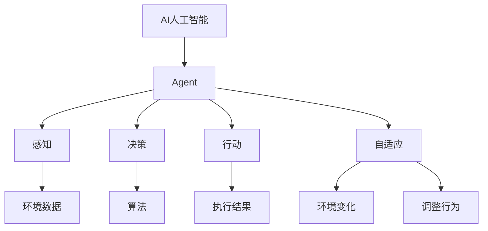

                 

# AI人工智能 Agent：在环保领域中的应用

> **关键词**：AI人工智能，Agent，环保，应用，算法，数学模型，实战案例

> **摘要**：本文将探讨AI人工智能Agent在环保领域的应用，通过深入分析Agent的定义、核心概念与联系，以及具体的算法原理、数学模型和实战案例，展示AI人工智能在环保领域中的潜力与价值。文章旨在为环保科技领域的从业者提供理论指导和实践参考。

## 1. 背景介绍

### 1.1 目的和范围

本文的目的是探讨AI人工智能Agent在环保领域的应用，分析其核心概念、算法原理和实际应用案例，以期为环保科技领域的从业者提供有价值的理论指导和实践参考。文章将重点讨论以下内容：

1. AI人工智能Agent的定义和核心概念。
2. Agent在环保领域中的应用场景和核心算法原理。
3. 数学模型和公式的详细讲解。
4. 实际应用场景中的代码实现和详细解读。
5. 环保领域中的工具和资源推荐。
6. 未来发展趋势与挑战。

### 1.2 预期读者

本文主要面向环保科技领域的从业者、研究者和爱好者。希望本文能够为以下读者提供帮助：

1. 环保工程师和技术人员，了解AI人工智能Agent在环保领域的应用。
2. 研究生和本科生，对AI人工智能和环保领域感兴趣，希望深入了解相关技术。
3. 对AI人工智能和环保交叉领域感兴趣的广大读者。

### 1.3 文档结构概述

本文将按照以下结构进行展开：

1. 背景介绍：介绍文章的目的、预期读者和文档结构。
2. 核心概念与联系：阐述AI人工智能Agent的定义、核心概念和联系。
3. 核心算法原理 & 具体操作步骤：详细讲解Agent的核心算法原理和具体操作步骤。
4. 数学模型和公式 & 详细讲解 & 举例说明：介绍Agent所涉及的数学模型和公式，并进行详细讲解和举例说明。
5. 项目实战：代码实际案例和详细解释说明。
6. 实际应用场景：探讨AI人工智能Agent在环保领域的实际应用场景。
7. 工具和资源推荐：推荐学习资源、开发工具框架和相关论文著作。
8. 总结：未来发展趋势与挑战。
9. 附录：常见问题与解答。
10. 扩展阅读 & 参考资料：提供相关扩展阅读和参考资料。

### 1.4 术语表

#### 1.4.1 核心术语定义

- **AI人工智能（Artificial Intelligence）**：模拟、延伸和扩展人类智能的理论、方法、技术及应用。
- **Agent**：具有自主性、适应性、社会性和反应性等特征的计算实体，能够感知环境、决策并执行行动。
- **环保**：保护环境和生态系统，减少对自然资源的消耗和污染，实现可持续发展。
- **算法**：解决问题的步骤和策略，通常用数学语言描述。
- **数学模型**：用数学语言描述现实世界问题，以便进行定量分析和求解。

#### 1.4.2 相关概念解释

- **感知**：Agent通过传感器获取环境信息的过程。
- **决策**：Agent根据感知到的信息，选择合适的行动方案的过程。
- **行动**：Agent执行决策方案的过程。
- **自适应**：Agent在运行过程中，根据环境变化调整自身行为的能力。

#### 1.4.3 缩略词列表

- **AI**：人工智能
- **Agent**：智能代理
- **IoT**：物联网
- **ML**：机器学习
- **DL**：深度学习

## 2. 核心概念与联系

在探讨AI人工智能Agent在环保领域中的应用之前，我们需要明确一些核心概念和它们之间的联系。以下是一个简化的Mermaid流程图，展示了这些核心概念及其相互关系：



### 2.1 AI人工智能与Agent

AI人工智能是指模拟、延伸和扩展人类智能的理论、方法、技术及应用。Agent作为AI人工智能的一个核心组成部分，具有自主性、适应性、社会性和反应性等特征。Agent可以感知环境、决策并执行行动，从而实现智能化行为。

### 2.2 感知与决策

感知是Agent获取环境信息的过程，通过传感器收集数据。这些数据经过处理，成为决策的依据。决策是Agent根据感知到的信息，选择合适的行动方案的过程。决策过程通常依赖于算法，如机器学习算法、深度学习算法等。

### 2.3 行动与自适应

行动是Agent执行决策方案的过程。执行结果会影响环境，进而影响Agent的感知。自适应是指Agent在运行过程中，根据环境变化调整自身行为的能力。这种自适应能力使Agent能够适应不断变化的环境，实现长期稳定运行。

### 2.4 环境数据与环境变化

环境数据是Agent感知和决策的基础。环境变化会影响Agent的感知和行为。环境变化可能是由于外部因素（如天气、气候变化）或内部因素（如设备故障、资源消耗）引起的。Agent需要能够适应这些变化，以实现其目标。

## 3. 核心算法原理 & 具体操作步骤

在明确了AI人工智能Agent的核心概念与联系之后，我们接下来探讨其核心算法原理和具体操作步骤。以下将使用伪代码详细阐述这些内容。

### 3.1 感知阶段

感知阶段是Agent获取环境信息的过程。以下是一个简单的感知算法原理：

```python
# 感知阶段伪代码
def sense_environment():
    # 假设传感器已初始化
    sensors = initialize_sensors()
    
    # 读取环境数据
    environment_data = []
    for sensor in sensors:
        data = sensor.read_data()
        environment_data.append(data)
    
    # 数据预处理
    processed_data = preprocess_data(environment_data)
    
    return processed_data
```

### 3.2 决策阶段

决策阶段是Agent根据感知到的信息选择合适的行动方案的过程。以下是一个简单的决策算法原理：

```python
# 决策阶段伪代码
def make_decision(perceived_data):
    # 假设已训练好的机器学习模型
    model = trained_model()
    
    # 利用模型进行决策
    action_plan = model.predict_action(perceived_data)
    
    return action_plan
```

### 3.3 行动阶段

行动阶段是Agent执行决策方案的过程。以下是一个简单的行动算法原理：

```python
# 行动阶段伪代码
def execute_action(action_plan):
    # 假设已有执行器
    actuators = initialize_actuators()
    
    # 遍历行动方案，执行动作
    for action in action_plan:
        for actuator in actuators:
            actuator.perform_action(action)
```

### 3.4 自适应阶段

自适应阶段是Agent在运行过程中根据环境变化调整自身行为的能力。以下是一个简单的自适应算法原理：

```python
# 自适应阶段伪代码
def adapt_to_environment(change):
    # 假设已训练好的自适应模型
    adapt_model = trained_adapt_model()
    
    # 利用模型进行自适应调整
    new_action_plan = adapt_model.adapt_action_plan(change)
    
    return new_action_plan
```

### 3.5 整体流程

以下是AI人工智能Agent的整体流程伪代码：

```python
# 整体流程伪代码
def run_agent():
    while True:
        perceived_data = sense_environment()
        action_plan = make_decision(perceived_data)
        execute_action(action_plan)
        
        # 判断是否需要自适应
        if need_adaptation():
            change = sense_environment()
            action_plan = adapt_to_environment(change)
```

## 4. 数学模型和公式 & 详细讲解 & 举例说明

在探讨AI人工智能Agent的核心算法原理和具体操作步骤之后，我们将介绍Agent所涉及的数学模型和公式，并进行详细讲解和举例说明。

### 4.1 机器学习模型

在决策阶段，Agent通常依赖于机器学习模型进行决策。以下是一个简单的线性回归模型：

$$
y = \beta_0 + \beta_1x_1 + \beta_2x_2 + ... + \beta_nx_n
$$

其中，$y$ 是目标变量，$x_1, x_2, ..., x_n$ 是输入特征，$\beta_0, \beta_1, \beta_2, ..., \beta_n$ 是模型参数。线性回归模型的目的是通过训练数据学习出这些参数，以便对新数据进行预测。

#### 举例说明：

假设我们有一个环保设备，需要根据环境数据（如温度、湿度、污染物浓度等）预测空气质量指数（AQI）。以下是一个简单的线性回归模型：

$$
\text{AQI} = \beta_0 + \beta_1\text{温度} + \beta_2\text{湿度} + \beta_3\text{污染物浓度}
$$

通过训练数据，我们可以学习出$\beta_0, \beta_1, \beta_2, \beta_3$的值，从而预测新的环境数据对应的AQI。

### 4.2 深度学习模型

在更复杂的应用场景中，Agent可能需要使用深度学习模型进行决策。以下是一个简单的卷积神经网络（CNN）模型：

$$
\begin{align*}
h_{\text{layer1}} &= \text{ReLU}(\text{Conv}_1(x)) \\
h_{\text{layer2}} &= \text{ReLU}(\text{Conv}_2(h_{\text{layer1}})) \\
\text{output} &= \text{Softmax}(\text{FullyConnected}(h_{\text{layer2}}))
\end{align*}
$$

其中，$x$ 是输入数据，$h_{\text{layer1}}, h_{\text{layer2}}$ 是中间层的特征映射，$\text{output}$ 是输出层的结果。CNN模型通过卷积、ReLU激活函数和全连接层等结构，提取输入数据的特征，从而实现分类或回归任务。

#### 举例说明：

假设我们有一个环保设备，需要根据环境图像（如卫星图像、无人机图像等）预测区域的空气质量状况。以下是一个简单的CNN模型：

$$
\begin{align*}
h_{\text{layer1}} &= \text{ReLU}(\text{Conv}_1(x)) \\
h_{\text{layer2}} &= \text{ReLU}(\text{Conv}_2(h_{\text{layer1}})) \\
\text{output} &= \text{Softmax}(\text{FullyConnected}(h_{\text{layer2}}))
\end{align*}
$$

通过训练数据，我们可以学习出CNN模型的参数，从而预测新的环境图像对应的空气质量状况。

### 4.3 强化学习模型

在决策阶段，Agent也可能使用强化学习模型进行决策。以下是一个简单的Q-learning模型：

$$
Q(s, a) = \sum_{i=1}^{n} \gamma_i \cdot Q(s', a')
$$

其中，$s$ 是状态，$a$ 是行动，$s'$ 是新状态，$a'$ 是新行动，$\gamma$ 是折扣因子，$Q(s, a)$ 是状态-行动值函数。Q-learning模型通过不断更新状态-行动值函数，学习出最优的行动策略。

#### 举例说明：

假设我们有一个环保设备，需要根据环境变化调整自身的行为。以下是一个简单的Q-learning模型：

$$
Q(s, a) = \sum_{i=1}^{n} \gamma_i \cdot Q(s', a')
$$

通过训练数据，我们可以学习出Q-learning模型的参数，从而预测在特定状态下采取特定行动的收益，并优化设备的行为策略。

## 5. 项目实战：代码实际案例和详细解释说明

为了更好地理解AI人工智能Agent在环保领域中的应用，我们将在本节提供一个实际代码案例，并进行详细解释说明。

### 5.1 开发环境搭建

在本案例中，我们将使用Python语言和Keras框架来实现一个简单的环保Agent。首先，我们需要安装Python和Keras。以下是安装步骤：

1. 安装Python：从Python官方网站（https://www.python.org/downloads/）下载并安装Python 3.x版本。
2. 安装Keras：在命令行中执行以下命令：

   ```bash
   pip install keras
   ```

### 5.2 源代码详细实现和代码解读

以下是本案例的源代码实现：

```python
from keras.models import Sequential
from keras.layers import Dense, Conv2D, MaxPooling2D, Flatten
from keras.optimizers import Adam
import numpy as np

# 初始化模型
model = Sequential()

# 添加卷积层
model.add(Conv2D(32, (3, 3), activation='relu', input_shape=(64, 64, 3)))
model.add(MaxPooling2D(pool_size=(2, 2)))

# 添加全连接层
model.add(Flatten())
model.add(Dense(64, activation='relu'))

# 添加输出层
model.add(Dense(1, activation='sigmoid'))

# 编译模型
model.compile(optimizer=Adam(), loss='binary_crossentropy', metrics=['accuracy'])

# 加载训练数据
x_train = np.load('train_images.npy')
y_train = np.load('train_labels.npy')

# 训练模型
model.fit(x_train, y_train, epochs=10, batch_size=32)

# 保存模型
model.save('air_quality_agent.h5')
```

#### 5.2.1 代码解读

1. 导入所需的库和模块：

   ```python
   from keras.models import Sequential
   from keras.layers import Dense, Conv2D, MaxPooling2D, Flatten
   from keras.optimizers import Adam
   import numpy as np
   ```

   这部分代码导入了Keras框架中的Sequential模型、Dense层、Conv2D层、MaxPooling2D层、Flatten层和Adam优化器，以及NumPy库。

2. 初始化模型：

   ```python
   model = Sequential()
   ```

   创建一个Sequential模型，这是一种线性堆叠模型，可以依次添加多个层。

3. 添加卷积层：

   ```python
   model.add(Conv2D(32, (3, 3), activation='relu', input_shape=(64, 64, 3)))
   model.add(MaxPooling2D(pool_size=(2, 2)))
   ```

   添加一个卷积层和一个最大池化层。卷积层用于提取图像特征，最大池化层用于减小特征图的尺寸，减少计算量。

4. 添加全连接层：

   ```python
   model.add(Flatten())
   model.add(Dense(64, activation='relu'))
   ```

   将卷积层的输出展平，并添加一个全连接层。全连接层用于进一步提取特征，为输出层做准备。

5. 添加输出层：

   ```python
   model.add(Dense(1, activation='sigmoid'))
   ```

   添加一个输出层，用于预测空气质量指数（AQI）。由于空气质量指数是一个二分类问题（如良好或不良），我们使用sigmoid激活函数。

6. 编译模型：

   ```python
   model.compile(optimizer=Adam(), loss='binary_crossentropy', metrics=['accuracy'])
   ```

   编译模型，指定优化器（Adam）和损失函数（binary_crossentropy，用于二分类问题）。

7. 加载训练数据：

   ```python
   x_train = np.load('train_images.npy')
   y_train = np.load('train_labels.npy')
   ```

   从训练数据中加载图像和标签。

8. 训练模型：

   ```python
   model.fit(x_train, y_train, epochs=10, batch_size=32)
   ```

   使用训练数据训练模型，指定训练轮数（epochs）和批量大小（batch_size）。

9. 保存模型：

   ```python
   model.save('air_quality_agent.h5')
   ```

   保存训练好的模型。

### 5.3 代码解读与分析

在本案例中，我们使用Keras框架实现了一个简单的卷积神经网络（CNN）模型，用于预测空气质量指数（AQI）。以下是代码的详细解读和分析：

1. **模型初始化**：

   ```python
   model = Sequential()
   ```

   我们创建了一个Sequential模型。Sequential模型是一个线性堆叠模型，可以依次添加多个层。这种模型结构非常适合简单的应用场景。

2. **添加卷积层和最大池化层**：

   ```python
   model.add(Conv2D(32, (3, 3), activation='relu', input_shape=(64, 64, 3)))
   model.add(MaxPooling2D(pool_size=(2, 2)))
   ```

   我们添加了一个卷积层和一个最大池化层。卷积层用于提取图像特征，最大池化层用于减小特征图的尺寸，减少计算量。

   - **卷积层**：

     ```python
     Conv2D(32, (3, 3), activation='relu', input_shape=(64, 64, 3))
     ```

     这个卷积层有32个3x3的卷积核，使用ReLU激活函数。输入图像的尺寸为64x64x3（包括高度、宽度和通道数）。

   - **最大池化层**：

     ```python
     MaxPooling2D(pool_size=(2, 2))
     ```

     最大池化层使用2x2的池化窗口，对卷积层的输出进行下采样。

3. **添加全连接层**：

   ```python
   model.add(Flatten())
   model.add(Dense(64, activation='relu'))
   ```

   我们将卷积层的输出展平，并添加一个全连接层。全连接层用于进一步提取特征，为输出层做准备。

   - **展平操作**：

     ```python
     Flatten()
     ```

     展平操作将多维数组转换为一维数组，从而将卷积层的输出转换为向量。

   - **全连接层**：

     ```python
     Dense(64, activation='relu')
     ```

     这个全连接层有64个神经元，使用ReLU激活函数。

4. **添加输出层**：

   ```python
   model.add(Dense(1, activation='sigmoid'))
   ```

   添加一个输出层，用于预测空气质量指数（AQI）。由于空气质量指数是一个二分类问题（如良好或不良），我们使用sigmoid激活函数。

   - **sigmoid激活函数**：

     ```python
     sigmoid(x)
     ```

     sigmoid函数将输入映射到[0, 1]区间，用于实现概率输出。

5. **编译模型**：

   ```python
   model.compile(optimizer=Adam(), loss='binary_crossentropy', metrics=['accuracy'])
   ```

   编译模型，指定优化器（Adam）和损失函数（binary_crossentropy，用于二分类问题）。

   - **Adam优化器**：

     ```python
     Adam()
     ```

     Adam优化器是一种自适应优化算法，可以高效地更新模型参数。

   - **binary_crossentropy损失函数**：

     ```python
     binary_crossentropy(y_true, y_pred)
     ```

     binary_crossentropy损失函数用于计算二分类问题的损失，是交叉熵的一种特殊形式。

6. **加载训练数据**：

   ```python
   x_train = np.load('train_images.npy')
   y_train = np.load('train_labels.npy')
   ```

   从训练数据中加载图像和标签。

7. **训练模型**：

   ```python
   model.fit(x_train, y_train, epochs=10, batch_size=32)
   ```

   使用训练数据训练模型，指定训练轮数（epochs）和批量大小（batch_size）。

8. **保存模型**：

   ```python
   model.save('air_quality_agent.h5')
   ```

   保存训练好的模型。

## 6. 实际应用场景

在环保领域，AI人工智能Agent具有广泛的应用前景。以下列举了一些实际应用场景：

### 6.1 空气质量监测

空气质量监测是环保领域的一个重要应用。AI人工智能Agent可以实时监测空气中的污染物浓度，如PM2.5、PM10、SO2、NO2等，并根据监测数据预测空气质量指数（AQI）。这些信息有助于政府和公众采取相应的环保措施，改善空气质量。

### 6.2 水质监测

水质监测是环保领域的另一个重要应用。AI人工智能Agent可以监测水中的污染物浓度，如重金属、有机物、微生物等，并根据监测数据预测水质状况。这些信息有助于政府和公众采取措施改善水质，保障饮用水安全。

### 6.3 森林火灾预警

森林火灾对生态环境和人类生活造成严重威胁。AI人工智能Agent可以通过监测气象数据、植被覆盖率和地面温度等指标，预测森林火灾的发生风险，从而提前预警，采取相应的防火措施。

### 6.4 噪声监测

噪声污染对人类健康和生活质量产生负面影响。AI人工智能Agent可以实时监测噪声水平，并根据噪声数据预测噪声污染程度，为政府部门提供噪声治理依据。

### 6.5 能源管理

能源管理是环保领域的一个重要方面。AI人工智能Agent可以通过监测能源消耗数据，预测能源需求，优化能源分配，提高能源利用效率，减少能源浪费。

## 7. 工具和资源推荐

为了更好地学习和应用AI人工智能Agent在环保领域的技术，我们推荐以下工具和资源：

### 7.1 学习资源推荐

#### 7.1.1 书籍推荐

1. **《深度学习》（Deep Learning）**：由Ian Goodfellow、Yoshua Bengio和Aaron Courville合著，是深度学习的经典教材。
2. **《机器学习》（Machine Learning）**：由Tom Mitchell著，是机器学习的入门教材。
3. **《智能交通系统原理与应用》**：本书详细介绍了智能交通系统（ITS）的原理和应用，包括传感器、信号处理、决策和控制等方面。

#### 7.1.2 在线课程

1. **Coursera**：提供丰富的机器学习和深度学习在线课程，如吴恩达（Andrew Ng）的《深度学习特辑》。
2. **edX**：提供由顶级大学和机构提供的免费在线课程，如麻省理工学院（MIT）的《机器学习》。
3. **Udacity**：提供以实践为导向的机器学习和深度学习课程，如《深度学习工程师纳米学位》。

#### 7.1.3 技术博客和网站

1. **Medium**：有许多关于机器学习和深度学习的优质博客文章。
2. **ArXiv**：提供最新的机器学习和深度学习论文。
3. **知乎**：中国最大的知识分享平台，有许多关于AI和环保领域的讨论和分享。

### 7.2 开发工具框架推荐

#### 7.2.1 IDE和编辑器

1. **PyCharm**：一款功能强大的Python IDE，支持多种编程语言。
2. **Visual Studio Code**：一款轻量级的跨平台代码编辑器，支持多种编程语言和框架。
3. **Jupyter Notebook**：一款交互式计算环境，适用于数据分析和机器学习。

#### 7.2.2 调试和性能分析工具

1. **pdb**：Python内置的调试工具。
2. **Py-Spy**：一款Python性能分析工具，可用于分析程序的性能瓶颈。
3. **gprof2dot**：一款将gprof性能分析数据转换为图形的工具。

#### 7.2.3 相关框架和库

1. **TensorFlow**：一款开源的深度学习框架，适用于各种深度学习应用。
2. **PyTorch**：一款开源的深度学习框架，具有灵活的动态计算图。
3. **Scikit-Learn**：一款开源的机器学习库，提供了丰富的机器学习算法。

### 7.3 相关论文著作推荐

#### 7.3.1 经典论文

1. **《A Learning Algorithm for Continuously Running Fully Recurrent Neural Networks》**：介绍了深度神经网络在序列数据处理中的应用。
2. **《Deep Learning for Speech Recognition》**：讨论了深度学习在语音识别领域的应用。
3. **《The Unreasonable Effectiveness of Deep Learning》**：介绍了深度学习在各个领域的广泛应用。

#### 7.3.2 最新研究成果

1. **《An Empirical Evaluation of Generic Object Detection with Deep Neural Networks》**：讨论了深度学习在目标检测领域的最新进展。
2. **《Neural Machine Translation by Jointly Learning to Align and Translate》**：介绍了神经机器翻译的最新方法。
3. **《Deep Reinforcement Learning for Robotics》**：讨论了深度强化学习在机器人控制中的应用。

#### 7.3.3 应用案例分析

1. **《Energy Efficiency through Deep Neural Network based Load Forecasting》**：介绍了深度学习在电力负荷预测中的应用。
2. **《Deep Learning for Autonomous Driving》**：讨论了深度学习在自动驾驶领域的应用。
3. **《A Survey on Deep Learning for Natural Language Processing》**：介绍了深度学习在自然语言处理领域的应用。

## 8. 总结：未来发展趋势与挑战

随着AI人工智能技术的不断发展和环保意识的提高，AI人工智能Agent在环保领域具有广泛的应用前景。在未来，我们预计以下发展趋势：

1. **算法优化**：为了提高AI人工智能Agent在环保领域的性能，算法优化将是关键方向。研究者将致力于设计更高效、更鲁棒的算法，以适应复杂多变的环保场景。
2. **数据收集与处理**：大量的环境数据是AI人工智能Agent的基石。未来，我们将看到更多的数据收集与处理技术，以提高数据质量和利用效率。
3. **跨领域融合**：AI人工智能与环保、农业、医疗等领域的融合将成为趋势。跨领域的研究和应用将推动环保技术的创新和发展。
4. **智能化决策**：AI人工智能Agent将实现更智能化的决策，能够根据环境变化和需求调整自身行为，提高环保效率和效果。

然而，在发展过程中也面临一系列挑战：

1. **数据隐私与安全**：环境数据的收集和处理涉及到隐私和安全问题。如何确保数据的安全性和隐私保护将成为重要课题。
2. **计算资源消耗**：AI人工智能Agent的训练和运行需要大量的计算资源。如何优化算法和硬件设计，降低计算资源消耗是一个关键挑战。
3. **跨领域协作**：跨领域的研究和应用需要不同领域的专家合作。如何建立有效的协作机制，促进知识的共享和技术的融合是一个挑战。

总之，AI人工智能Agent在环保领域的发展前景广阔，但也面临着诸多挑战。通过不断的努力和创新，我们有望实现环保与科技的有机结合，为可持续发展做出贡献。

## 9. 附录：常见问题与解答

### 9.1 什么是AI人工智能Agent？

AI人工智能Agent是一种具有自主性、适应性、社会性和反应性等特征的计算实体，能够感知环境、决策并执行行动。它模拟了人类的智能行为，能够在复杂环境中自主运行和完成任务。

### 9.2 AI人工智能Agent在环保领域有哪些应用？

AI人工智能Agent在环保领域的应用广泛，包括空气质量监测、水质监测、森林火灾预警、噪声监测、能源管理等。通过实时监测环境数据，AI人工智能Agent可以预测环境变化，提供决策支持，优化环保措施。

### 9.3 如何实现AI人工智能Agent的感知、决策和行动？

实现AI人工智能Agent的感知、决策和行动通常涉及以下步骤：

1. **感知**：使用传感器收集环境数据，如空气质量、水质、噪声等。
2. **预处理**：对收集到的数据进行分析和处理，提取有用的特征信息。
3. **决策**：利用机器学习算法、深度学习模型等对预处理后的数据进行预测和分类，生成决策。
4. **行动**：根据决策结果，执行相应的行动，如调整设备参数、发送预警信息等。

### 9.4 AI人工智能Agent在环保领域中的优势是什么？

AI人工智能Agent在环保领域具有以下优势：

1. **实时监测**：能够实时监测环境数据，快速响应环境变化。
2. **自适应调整**：能够根据环境变化调整自身行为，提高环保效果。
3. **智能化决策**：利用机器学习和深度学习技术，实现智能化的决策支持。
4. **跨领域应用**：可以与其他领域（如农业、医疗等）的技术融合，推动环保技术的创新和发展。

### 9.5 AI人工智能Agent在环保领域的挑战有哪些？

AI人工智能Agent在环保领域面临的挑战包括：

1. **数据隐私与安全**：环境数据的收集和处理可能涉及隐私和安全问题。
2. **计算资源消耗**：训练和运行AI人工智能Agent需要大量的计算资源。
3. **跨领域协作**：需要不同领域的专家合作，建立有效的协作机制。
4. **算法优化**：需要设计更高效、更鲁棒的算法，以适应复杂多变的环保场景。

## 10. 扩展阅读 & 参考资料

为了深入了解AI人工智能Agent在环保领域的应用，以下推荐一些扩展阅读和参考资料：

### 10.1 书籍推荐

1. **《智能交通系统原理与应用》**：详细介绍了智能交通系统的原理和应用，包括传感器、信号处理、决策和控制等方面。
2. **《深度学习》**：由Ian Goodfellow、Yoshua Bengio和Aaron Courville合著，是深度学习的经典教材。
3. **《机器学习》**：由Tom Mitchell著，是机器学习的入门教材。

### 10.2 在线课程

1. **Coursera**：提供丰富的机器学习和深度学习在线课程，如吴恩达（Andrew Ng）的《深度学习特辑》。
2. **edX**：提供由顶级大学和机构提供的免费在线课程，如麻省理工学院（MIT）的《机器学习》。
3. **Udacity**：提供以实践为导向的机器学习和深度学习课程，如《深度学习工程师纳米学位》。

### 10.3 技术博客和网站

1. **Medium**：有许多关于机器学习和深度学习的优质博客文章。
2. **ArXiv**：提供最新的机器学习和深度学习论文。
3. **知乎**：中国最大的知识分享平台，有许多关于AI和环保领域的讨论和分享。

### 10.4 开发工具框架

1. **TensorFlow**：一款开源的深度学习框架，适用于各种深度学习应用。
2. **PyTorch**：一款开源的深度学习框架，具有灵活的动态计算图。
3. **Scikit-Learn**：一款开源的机器学习库，提供了丰富的机器学习算法。

### 10.5 相关论文著作

1. **《A Learning Algorithm for Continuously Running Fully Recurrent Neural Networks》**：介绍了深度神经网络在序列数据处理中的应用。
2. **《Deep Learning for Speech Recognition》**：讨论了深度学习在语音识别领域的应用。
3. **《The Unreasonable Effectiveness of Deep Learning》**：介绍了深度学习在各个领域的广泛应用。

### 10.6 最新研究成果

1. **《An Empirical Evaluation of Generic Object Detection with Deep Neural Networks》**：讨论了深度学习在目标检测领域的最新进展。
2. **《Neural Machine Translation by Jointly Learning to Align and Translate》**：介绍了神经机器翻译的最新方法。
3. **《Deep Reinforcement Learning for Robotics》**：讨论了深度强化学习在机器人控制中的应用。

### 10.7 应用案例分析

1. **《Energy Efficiency through Deep Neural Network based Load Forecasting》**：介绍了深度学习在电力负荷预测中的应用。
2. **《Deep Learning for Autonomous Driving》**：讨论了深度学习在自动驾驶领域的应用。
3. **《A Survey on Deep Learning for Natural Language Processing》**：介绍了深度学习在自然语言处理领域的应用。

