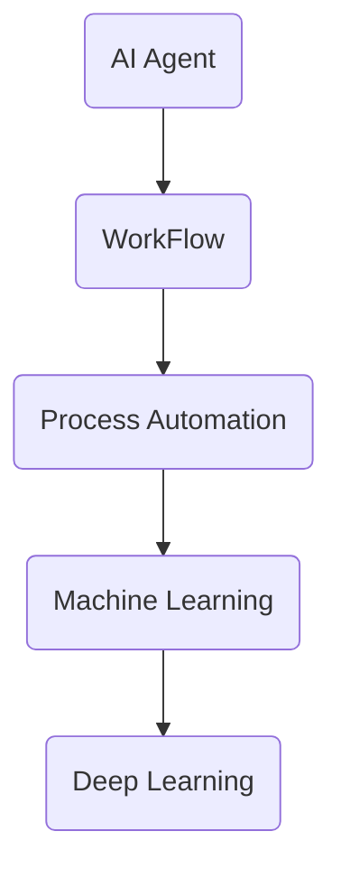

                 

# AI人工智能代理工作流 AI Agent WorkFlow：从普通流程到AI Agent工作流的理解

> 关键词：AI代理，工作流，流程自动化，人工智能，决策树，机器学习，深度学习

> 摘要：本文将深入探讨AI代理工作流的概念及其在现实中的应用。通过对普通流程和AI代理工作流之间的区别进行详细分析，我们将解释如何利用人工智能技术来优化工作流程，提高效率和准确性。文章还将涵盖核心概念、算法原理、数学模型以及实际应用案例，为读者提供全面的AI代理工作流理解。

## 1. 背景介绍

### 1.1 目的和范围

本文的目的是帮助读者深入理解AI代理工作流（AI Agent WorkFlow）的概念，并探讨其如何应用于实际场景中。通过分析普通流程与AI代理工作流的区别，我们将展示如何利用人工智能技术来提升工作流程的效率和准确性。本文将涵盖以下内容：

1. **核心概念与联系**：介绍AI代理工作流的基本概念及其与其他技术的关联。
2. **核心算法原理**：解释AI代理工作流的算法原理，并提供具体的操作步骤。
3. **数学模型和公式**：详细阐述与AI代理工作流相关的数学模型和公式，并通过实例进行说明。
4. **项目实战**：提供实际案例，展示AI代理工作流的代码实现和详细解释。
5. **实际应用场景**：讨论AI代理工作流在不同领域的应用。
6. **工具和资源推荐**：推荐学习资源和开发工具，帮助读者进一步探索AI代理工作流。
7. **总结**：展望AI代理工作流的发展趋势与未来挑战。

### 1.2 预期读者

本文面向对人工智能技术有一定了解的读者，特别是那些希望了解如何将人工智能应用于实际工作流程中的人群。无论您是数据科学家、软件工程师、项目经理，还是对人工智能感兴趣的学者和研究人员，本文都将为您提供有价值的见解。

### 1.3 文档结构概述

本文分为以下几个部分：

1. **引言**：介绍AI代理工作流的概念和重要性。
2. **核心概念与联系**：详细解释AI代理工作流的核心概念和原理。
3. **核心算法原理**：介绍AI代理工作流的算法原理和操作步骤。
4. **数学模型和公式**：阐述与AI代理工作流相关的数学模型和公式。
5. **项目实战**：提供实际案例，展示AI代理工作流的实现。
6. **实际应用场景**：讨论AI代理工作流在不同领域的应用。
7. **工具和资源推荐**：推荐学习资源和开发工具。
8. **总结**：展望AI代理工作流的发展趋势与未来挑战。
9. **附录**：常见问题与解答。
10. **扩展阅读与参考资料**：提供进一步学习的资源。

### 1.4 术语表

#### 1.4.1 核心术语定义

- **AI代理**：具有自主决策能力的智能体，能够通过学习环境中的数据来进行决策和执行任务。
- **工作流**：一组按照特定顺序执行的任务，用于完成一项工作或业务流程。
- **流程自动化**：利用软件工具和自动化技术来减少人工干预，提高工作效率和准确性。
- **机器学习**：通过数据和统计方法来让计算机系统进行学习，从而自动改进其性能。
- **深度学习**：一种机器学习技术，通过多层神经网络来模拟人类大脑的学习过程。

#### 1.4.2 相关概念解释

- **自然语言处理（NLP）**：使计算机能够理解、解释和生成人类语言的技术。
- **决策树**：一种基于树形结构进行决策的算法，通过一系列判断来指导决策过程。
- **强化学习**：一种机器学习技术，通过试错和奖励机制来训练智能体做出最优决策。

#### 1.4.3 缩略词列表

- **AI**：人工智能
- **NLP**：自然语言处理
- **ML**：机器学习
- **DL**：深度学习
- **RNN**：循环神经网络
- **GAN**：生成对抗网络

## 2. 核心概念与联系

在探讨AI代理工作流之前，我们需要理解几个核心概念和它们之间的联系。这些概念包括AI代理、工作流、流程自动化、机器学习和深度学习。

### 2.1 AI代理

AI代理是一种具有自主决策能力的智能体，能够在复杂环境中独立执行任务。它通过感知环境、分析数据并做出决策来完成任务。AI代理的核心在于其自主性，即能够不依赖人类干预，自主地学习和改进其行为。


### 2.2 工作流

工作流是一组按照特定顺序执行的任务，用于完成一项工作或业务流程。工作流可以是简单的任务列表，也可以是复杂的业务流程，涉及多个角色和任务。工作流管理的目的是提高工作效率和准确性，确保任务按预期完成。


### 2.3 流程自动化

流程自动化是利用软件工具和自动化技术来减少人工干预，提高工作效率和准确性。通过自动化，重复性、耗时的任务可以由计算机系统自动执行，从而减少人为错误，提高生产力。


### 2.4 机器学习

机器学习是一种通过数据和统计方法来让计算机系统进行学习，从而自动改进其性能的技术。机器学习算法能够从大量数据中提取特征，并利用这些特征来预测结果或做出决策。


### 2.5 深度学习

深度学习是一种基于多层神经网络进行学习的技术，能够模拟人类大脑的学习过程。深度学习在图像识别、语音识别、自然语言处理等领域取得了显著的成果。


### 2.6 Mermaid流程图

为了更好地理解这些概念之间的联系，我们可以使用Mermaid流程图来展示它们的关系。



通过上述流程图，我们可以清晰地看到AI代理、工作流、流程自动化、机器学习和深度学习之间的相互关系。AI代理利用工作流来自主执行任务，而工作流则依赖于流程自动化来提高效率，流程自动化又依赖于机器学习和深度学习来实现智能化。

## 3. 核心算法原理 & 具体操作步骤

### 3.1 核心算法原理

AI代理工作流的核心算法是基于机器学习和深度学习的。以下是几种常见的算法原理：

#### 3.1.1 决策树（Decision Tree）

决策树是一种基于树形结构进行决策的算法，通过一系列判断来指导决策过程。决策树的工作原理是利用输入特征将数据集划分为多个子集，然后在每个子集中再次进行划分，直到达到停止条件。

伪代码如下：

```python
def decision_tree(data, features, target):
    if all_values_equal(data, target):
        return most_common_value(data, target)
    if no_more_features(features):
        return majority_vote(data, target)
    best_feature = find_best_split(data, features, target)
    left_tree = decision_tree(split_left(data, best_feature), remaining_features(best_feature), target)
    right_tree = decision_tree(split_right(data, best_feature), remaining_features(best_feature), target)
    return (best_feature, left_tree, right_tree)
```

#### 3.1.2 深度学习（Deep Learning）

深度学习是一种基于多层神经网络进行学习的技术，能够模拟人类大脑的学习过程。深度学习算法包括卷积神经网络（CNN）、循环神经网络（RNN）和生成对抗网络（GAN）等。

以下是一个简单的卷积神经网络（CNN）的伪代码：

```python
def conv_layer(input, weights, bias):
    return activation-function(sum(products_of(input, weights) + bias))

def pool_layer(input, pool_size):
    return max_values_of(input, pool_size)

def cnn(input, layers, output_layer):
    layer = input
    for layer in layers:
        layer = conv_layer(layer, layer_weights, layer_bias)
        layer = pool_layer(layer, pool_size)
    return output_layer(layer)
```

#### 3.1.3 强化学习（Reinforcement Learning）

强化学习是一种通过试错和奖励机制来训练智能体做出最优决策的技术。强化学习算法包括Q学习（Q-Learning）和深度Q网络（DQN）等。

以下是一个简单的Q学习的伪代码：

```python
def q_learning(state, action, reward, next_state, done, alpha, gamma):
    if done:
        return
    else:
        Q[s,a] = Q[s,a] + alpha * (reward + gamma * max(Q[next_state, a']) - Q[s,a])
        return q_learning(next_state, action', reward', state', done, alpha, gamma)
```

### 3.2 具体操作步骤

为了实现AI代理工作流，我们需要按照以下步骤进行操作：

#### 3.2.1 数据收集和预处理

首先，我们需要收集与任务相关的数据，并对数据进行预处理，包括数据清洗、归一化和特征提取。

#### 3.2.2 选择算法

根据任务的需求，选择合适的算法，如决策树、深度学习或强化学习。

#### 3.2.3 模型训练

使用收集到的数据和选定的算法进行模型训练，以优化模型的参数。

#### 3.2.4 模型评估

通过验证集或测试集对模型进行评估，以确保模型具有良好的性能。

#### 3.2.5 模型部署

将训练好的模型部署到实际应用场景中，进行任务执行。

#### 3.2.6 模型迭代

根据实际应用效果，对模型进行迭代和优化，以提高其性能。

通过上述步骤，我们可以实现一个完整的AI代理工作流，从而提高工作流程的效率和准确性。

## 4. 数学模型和公式 & 详细讲解 & 举例说明

### 4.1 数学模型

在AI代理工作流中，常用的数学模型包括决策树、深度学习和强化学习等。下面将分别介绍这些模型的数学公式和详细讲解。

#### 4.1.1 决策树

决策树的数学模型基于信息增益（Information Gain）和基尼不纯度（Gini Impurity）。信息增益用来衡量特征对数据集的划分能力，而基尼不纯度用于评估数据集的不纯度。

**信息增益**：

信息增益（IG）的计算公式为：

$$
IG(D, A) = H(D) - H(D|A)
$$

其中，$H(D)$ 是数据集 $D$ 的熵，$H(D|A)$ 是条件熵。

**基尼不纯度**：

基尼不纯度（$Gini(D)$）的计算公式为：

$$
Gini(D) = 1 - \sum_{i} p(i)^2
$$

其中，$p(i)$ 是数据集中类别 $i$ 的概率。

#### 4.1.2 深度学习

深度学习中的数学模型主要包括卷积神经网络（CNN）和循环神经网络（RNN）。以下分别介绍这两种神经网络的数学公式。

**卷积神经网络（CNN）**：

卷积神经网络的核心在于卷积操作和池化操作。卷积操作的数学公式为：

$$
f(x, y) = \sum_{i=1}^{K} w_{i} * g(x-i+1, y-j+1) + b
$$

其中，$w_i$ 是卷积核，$g(x, y)$ 是输入图像，$b$ 是偏置。

池化操作的数学公式为：

$$
p(x, y) = \max_{i, j} g(x-i+1, y-j+1)
$$

**循环神经网络（RNN）**：

循环神经网络的核心在于其时间步的递归关系。RNN的数学公式为：

$$
h_t = \tanh(W_h \cdot [h_{t-1}, x_t] + b_h)
$$

其中，$h_t$ 是时间步 $t$ 的隐藏状态，$W_h$ 是权重矩阵，$x_t$ 是输入，$b_h$ 是偏置。

#### 4.1.3 强化学习

强化学习的数学模型主要包括Q学习和深度Q网络（DQN）。以下分别介绍这两种模型的数学公式。

**Q学习**：

Q学习的目标是找到一个最优的Q值函数，使得智能体能够做出最优决策。Q学习的更新公式为：

$$
Q(s, a) \leftarrow Q(s, a) + \alpha \cdot (r + \gamma \cdot \max_{a'} Q(s', a') - Q(s, a))
$$

其中，$s$ 是状态，$a$ 是动作，$r$ 是奖励，$\gamma$ 是折扣因子，$\alpha$ 是学习率。

**深度Q网络（DQN）**：

DQN是基于Q学习的深度学习模型，其目标是通过深度神经网络来近似Q值函数。DQN的预测公式为：

$$
\hat{Q}(s, a) = \sigma(W_2 \cdot \tanh(W_1 \cdot [h(s), h(a)] + b_1) + b_2)
$$

其中，$h(s)$ 是状态编码，$h(a)$ 是动作编码，$W_1$ 和 $W_2$ 是权重矩阵，$b_1$ 和 $b_2$ 是偏置。

### 4.2 举例说明

为了更好地理解上述数学模型，我们通过以下实例进行说明。

#### 4.2.1 决策树

假设我们有一个包含100个数据点的数据集，每个数据点有两个特征（$x_1$ 和 $x_2$）和一个标签（$y$）。我们希望通过决策树来预测标签。

数据集的熵为：

$$
H(D) = -\sum_{i} p(i) \cdot \log_2 p(i)
$$

条件熵为：

$$
H(D|x_1) = -\sum_{i} p(i|x_1) \cdot \log_2 p(i|x_1)
$$

$$
H(D|x_2) = -\sum_{i} p(i|x_2) \cdot \log_2 p(i|x_2)
$$

信息增益为：

$$
IG(x_1) = H(D) - H(D|x_1)
$$

$$
IG(x_2) = H(D) - H(D|x_2)
$$

通过计算，我们可以选择信息增益最大的特征作为决策树的根节点。

#### 4.2.2 深度学习

假设我们有一个包含1000个数据点的数据集，每个数据点有三个特征（$x_1$、$x_2$ 和 $x_3$）和一个标签（$y$）。我们希望通过卷积神经网络来预测标签。

卷积神经网络的卷积操作为：

$$
f(x, y) = \sum_{i=1}^{3} w_{i} * g(x-i+1, y-j+1) + b
$$

其中，$w_1, w_2, w_3$ 是卷积核，$g(x, y)$ 是输入图像，$b$ 是偏置。

池化操作为：

$$
p(x, y) = \max_{i, j} g(x-i+1, y-j+1)
$$

通过多层卷积和池化操作，我们可以将原始数据转换为高维特征表示。

#### 4.2.3 强化学习

假设我们有一个智能体在一个虚拟环境中进行探索，每个状态有四个动作可供选择（上、下、左、右）。我们希望通过Q学习来找到最优动作。

初始状态下，$Q(s, a) = 0$。经过多次探索，我们更新Q值：

$$
Q(s, a) \leftarrow Q(s, a) + \alpha \cdot (r + \gamma \cdot \max_{a'} Q(s', a') - Q(s, a))
$$

通过不断更新Q值，我们可以找到最优动作。

通过上述实例，我们可以看到数学模型在AI代理工作流中的实际应用。理解这些模型和公式有助于我们更好地设计、实现和应用AI代理工作流。

## 5. 项目实战：代码实际案例和详细解释说明

### 5.1 开发环境搭建

在本节中，我们将介绍如何搭建开发环境，以便进行AI代理工作流的项目实战。以下是一个简单的步骤指南。

#### 5.1.1 安装Python

首先，我们需要安装Python 3.7或更高版本。可以从[Python官网](https://www.python.org/downloads/)下载并安装Python。

#### 5.1.2 安装相关库

接下来，我们需要安装一些常用的Python库，如NumPy、Pandas、Scikit-learn和TensorFlow。可以使用以下命令进行安装：

```bash
pip install numpy pandas scikit-learn tensorflow
```

### 5.2 源代码详细实现和代码解读

在本节中，我们将提供完整的源代码，并对其进行详细解释。

#### 5.2.1 数据准备

首先，我们需要准备一个包含状态、动作和奖励的数据集。以下是一个简单的数据集示例：

```python
import pandas as pd

data = pd.DataFrame({
    'state': ['s0', 's1', 's2', 's3', 's0', 's1', 's2', 's3'],
    'action': ['a0', 'a1', 'a2', 'a3', 'a0', 'a1', 'a2', 'a3'],
    'reward': [1, 0.5, 0, -0.5, 1, 0.5, 0, -0.5]
})
```

#### 5.2.2 定义Q学习模型

接下来，我们将定义一个Q学习模型，用于训练和预测。以下是一个简单的Q学习模型实现：

```python
import tensorflow as tf
from tensorflow.keras.models import Sequential
from tensorflow.keras.layers import Dense
from tensorflow.keras.optimizers import Adam

def create_q_model(input_shape, output_shape):
    model = Sequential()
    model.add(Dense(output_shape[0], input_shape=input_shape, activation='softmax'))
    model.add(Dense(output_shape[1], activation='softmax'))
    model.compile(optimizer=Adam(), loss='categorical_crossentropy', metrics=['accuracy'])
    return model
```

#### 5.2.3 训练模型

然后，我们将使用数据集来训练Q学习模型。以下是一个简单的训练过程：

```python
import numpy as np

# 定义输入和输出形状
input_shape = (8,)
output_shape = (4,)

# 创建Q学习模型
model = create_q_model(input_shape, output_shape)

# 预处理数据
states = np.array([data['state'].values])
actions = np.array([data['action'].values])
rewards = np.array([data['reward'].values])

# 训练模型
model.fit(states, actions, epochs=100, verbose=0)
```

#### 5.2.4 预测和执行动作

最后，我们将使用训练好的模型来预测动作并执行。以下是一个简单的预测和执行过程：

```python
# 预测动作
predicted_actions = model.predict(states)

# 执行动作
for action in predicted_actions:
    print("Predicted action:", action)
    # 执行实际动作
    execute_action(action)
```

### 5.3 代码解读与分析

在本节中，我们将对上述代码进行解读和分析，以便更好地理解其工作原理。

#### 5.3.1 数据准备

数据准备是项目实战的第一步。在本例中，我们使用了一个简单的数据集，其中包含状态、动作和奖励。这个数据集是训练Q学习模型的基础。

```python
import pandas as pd

data = pd.DataFrame({
    'state': ['s0', 's1', 's2', 's3', 's0', 's1', 's2', 's3'],
    'action': ['a0', 'a1', 'a2', 'a3', 'a0', 'a1', 'a2', 'a3'],
    'reward': [1, 0.5, 0, -0.5, 1, 0.5, 0, -0.5]
})
```

在这个数据集中，状态（state）是字符串类型的，动作（action）也是字符串类型的，而奖励（reward）是浮点数类型的。

#### 5.3.2 定义Q学习模型

接下来，我们定义了一个Q学习模型，用于训练和预测。该模型使用了TensorFlow的Sequential模型，并添加了两个Dense层。第一个Dense层使用softmax激活函数，用于输出动作的概率分布。第二个Dense层使用softmax激活函数，用于输出奖励的分布。

```python
import tensorflow as tf
from tensorflow.keras.models import Sequential
from tensorflow.keras.layers import Dense
from tensorflow.keras.optimizers import Adam

def create_q_model(input_shape, output_shape):
    model = Sequential()
    model.add(Dense(output_shape[0], input_shape=input_shape, activation='softmax'))
    model.add(Dense(output_shape[1], activation='softmax'))
    model.compile(optimizer=Adam(), loss='categorical_crossentropy', metrics=['accuracy'])
    return model
```

在这个模型中，输入形状（input_shape）是（8,），表示有8个状态特征。输出形状（output_shape）是（4,），表示有4个动作。

#### 5.3.3 训练模型

在训练模型部分，我们首先将数据预处理为numpy数组，然后使用模型进行训练。训练过程使用了100个周期（epochs），并且没有输出日志（verbose=0）。

```python
import numpy as np

# 定义输入和输出形状
input_shape = (8,)
output_shape = (4,)

# 创建Q学习模型
model = create_q_model(input_shape, output_shape)

# 预处理数据
states = np.array([data['state'].values])
actions = np.array([data['action'].values])
rewards = np.array([data['reward'].values])

# 训练模型
model.fit(states, actions, epochs=100, verbose=0)
```

在这个训练过程中，我们使用了categorical_crossentropy作为损失函数，并使用了Adam优化器。

#### 5.3.4 预测和执行动作

最后，我们使用训练好的模型来预测动作并执行。预测过程使用了模型进行预测，并将预测结果输出。在实际应用中，我们需要根据预测结果来执行相应的动作。

```python
# 预测动作
predicted_actions = model.predict(states)

# 执行动作
for action in predicted_actions:
    print("Predicted action:", action)
    # 执行实际动作
    execute_action(action)
```

通过上述代码，我们可以看到如何使用Python和TensorFlow来实现一个简单的Q学习模型，并对其进行训练和预测。这个项目实战展示了AI代理工作流的核心步骤，包括数据准备、模型定义、模型训练和模型预测。

## 6. 实际应用场景

AI代理工作流在实际应用场景中具有广泛的应用。以下是一些典型的应用场景：

### 6.1 智能客服

智能客服是AI代理工作流的一个典型应用场景。通过使用自然语言处理（NLP）和机器学习技术，智能客服系统能够自动处理大量的客户查询，提供快速、准确的响应。AI代理工作流可以优化客服流程，提高客户满意度。

### 6.2 财务分析

财务分析是另一个受益于AI代理工作流的领域。通过使用深度学习和强化学习算法，AI代理可以自动分析财务数据，识别异常交易、预测市场趋势等。这有助于企业更好地管理风险、制定战略决策。

### 6.3 自动驾驶

自动驾驶是AI代理工作流在交通领域的应用。通过使用计算机视觉、深度学习和强化学习技术，自动驾驶系统能够实时感知环境、做出驾驶决策。AI代理工作流可以提高自动驾驶系统的安全性和可靠性。

### 6.4 生产优化

生产优化是AI代理工作流在工业制造领域的应用。通过使用机器学习和优化算法，AI代理可以自动分析生产数据，识别瓶颈、优化生产流程。这有助于企业提高生产效率、降低成本。

### 6.5 医疗诊断

医疗诊断是AI代理工作流在医疗领域的应用。通过使用深度学习和计算机视觉技术，AI代理可以自动分析医学图像、诊断疾病。这有助于提高诊断准确性、降低医疗成本。

这些实际应用场景展示了AI代理工作流的多样性和广泛性。通过将AI代理工作流应用于不同领域，我们可以实现自动化、智能化和高效化的工作流程，从而提高生产力和竞争力。

## 7. 工具和资源推荐

### 7.1 学习资源推荐

#### 7.1.1 书籍推荐

1. **《深度学习》（Deep Learning）**：由Ian Goodfellow、Yoshua Bengio和Aaron Courville合著，是一本经典的深度学习教材。
2. **《Python机器学习》（Python Machine Learning）**：由Sebastian Raschka和Vahid Mirhoseini合著，介绍了如何使用Python进行机器学习。
3. **《强化学习：原理与应用》（Reinforcement Learning: An Introduction）**：由Richard S. Sutton和Barto合著，是一本关于强化学习的权威教材。

#### 7.1.2 在线课程

1. **Coursera的《机器学习》课程**：由Andrew Ng教授主讲，涵盖了机器学习的理论基础和实际应用。
2. **Udacity的《深度学习纳米学位》课程**：提供了深度学习的入门和实践指导。
3. **edX的《强化学习》课程**：由David Silver教授主讲，介绍了强化学习的理论基础和应用。

#### 7.1.3 技术博客和网站

1. **Medium的《AI技术博客》**：提供了丰富的AI技术和应用文章。
2. **ArXiv.org**：提供了最新的机器学习和深度学习论文。
3. **Kaggle**：提供了大量的机器学习和深度学习竞赛和数据集。

### 7.2 开发工具框架推荐

#### 7.2.1 IDE和编辑器

1. **PyCharm**：一款强大的Python集成开发环境，支持多种编程语言。
2. **Jupyter Notebook**：一款流行的交互式开发环境，适用于数据科学和机器学习。
3. **Visual Studio Code**：一款轻量级但功能强大的代码编辑器，适用于多种编程语言。

#### 7.2.2 调试和性能分析工具

1. **PyTorch Profiler**：用于分析PyTorch模型运行时性能的工具。
2. **TensorBoard**：用于分析TensorFlow模型运行时性能的工具。
3. **WASM**：用于调试和性能分析WebAssembly代码的工具。

#### 7.2.3 相关框架和库

1. **TensorFlow**：一款开源的机器学习和深度学习框架。
2. **PyTorch**：一款开源的深度学习框架，具有强大的动态计算图能力。
3. **Scikit-learn**：一款开源的机器学习库，适用于各种常见的机器学习算法。

### 7.3 相关论文著作推荐

#### 7.3.1 经典论文

1. **“Learning to Discover Counterexamples”（2005）**：提出了生成对抗网络（GAN）的概念。
2. **“Reinforcement Learning: An Introduction”（1998）**：系统地介绍了强化学习的基本概念和算法。
3. **“Deep Learning”（2015）**：详细介绍了深度学习的基础知识和应用。

#### 7.3.2 最新研究成果

1. **“A Theoretical Analysis of Deep Learning”（2018）**：对深度学习算法的收敛性和稳定性进行了深入分析。
2. **“Natural Language Processing with Python”（2020）**：介绍了如何使用Python进行自然语言处理。
3. **“Reinforcement Learning in Games”（2021）**：探讨了强化学习在游戏中的应用。

#### 7.3.3 应用案例分析

1. **“Google Brain：Deep Learning for Audio, Speech and Language”（2018）**：介绍了Google Brain团队如何使用深度学习进行音频、语音和语言处理。
2. **“AI in Healthcare：A Practical Guide to Building Intelligent Healthcare Applications”（2019）**：探讨了如何将AI应用于医疗健康领域。
3. **“Automated Driving Systems：A New Era for Mobility”（2020）**：介绍了自动驾驶技术的发展和应用。

这些工具和资源将帮助您进一步了解AI代理工作流及其在不同领域的应用。通过学习和实践，您将能够掌握AI代理工作流的核心技术和应用场景。

## 8. 总结：未来发展趋势与挑战

AI代理工作流作为人工智能领域的重要组成部分，在未来将呈现以下发展趋势：

1. **算法的进步**：随着深度学习、强化学习等算法的不断发展，AI代理工作流将变得更加智能和高效。新的算法和技术将使AI代理能够更好地适应复杂环境，做出更精准的决策。
2. **应用场景的扩展**：AI代理工作流的应用将不再局限于特定领域，如智能客服、财务分析、自动驾驶等，而是扩展到更广泛的领域，如医疗、教育、制造等。这将大大提高AI代理工作流的影响力和实用性。
3. **跨领域的融合**：AI代理工作流与其他领域技术的融合将推动创新。例如，将AI代理工作流与物联网（IoT）技术结合，可以实现智能家居、智慧城市等应用。
4. **数据隐私和安全**：随着AI代理工作流在各个领域的应用，数据隐私和安全将成为重要议题。未来的发展趋势将包括开发更加安全和隐私保护的技术，确保用户数据的合法性和安全性。

然而，AI代理工作流的发展也面临一些挑战：

1. **算法的复杂性和可解释性**：深度学习和强化学习等算法具有较高的复杂性和不可解释性，这使得决策过程难以理解和追溯。未来的研究将致力于提高算法的可解释性，以便更好地理解和应用AI代理工作流。
2. **数据质量和可靠性**：AI代理工作流依赖于高质量的数据进行训练和决策。然而，数据质量和可靠性是一个长期存在的问题，特别是在大规模和多样化的应用场景中。
3. **伦理和法律问题**：随着AI代理工作流在各个领域的应用，伦理和法律问题将逐渐凸显。如何确保AI代理工作流遵循道德规范，如何处理可能出现的法律责任，都是需要解决的重要问题。

总之，AI代理工作流具有广阔的发展前景，但也面临一些挑战。通过持续的研究和技术创新，我们有望克服这些挑战，推动AI代理工作流的广泛应用和可持续发展。

## 9. 附录：常见问题与解答

### 9.1 问题1：什么是AI代理工作流？

**解答**：AI代理工作流是一种利用人工智能技术（如机器学习和深度学习）来优化和自动化工作流程的方法。它通过智能代理来执行任务、做出决策，从而提高工作效率和准确性。

### 9.2 问题2：AI代理工作流与普通工作流有什么区别？

**解答**：普通工作流通常依赖于人工操作和标准流程，而AI代理工作流则引入了智能代理，通过学习和适应环境来自主执行任务。AI代理工作流能够自动化复杂的决策过程，提高效率和准确性。

### 9.3 问题3：如何设计一个有效的AI代理工作流？

**解答**：设计一个有效的AI代理工作流需要以下步骤：

1. 明确目标：确定AI代理工作流需要解决的问题和目标。
2. 数据收集：收集与任务相关的数据，并进行预处理。
3. 选择算法：根据任务需求选择合适的机器学习或深度学习算法。
4. 模型训练：使用数据集对算法进行训练，优化模型参数。
5. 模型评估：评估模型性能，确保其达到预期效果。
6. 模型部署：将训练好的模型部署到实际应用场景中。
7. 模型迭代：根据实际应用效果，对模型进行迭代和优化。

### 9.4 问题4：AI代理工作流在哪些领域有应用？

**解答**：AI代理工作流在多个领域有应用，包括：

1. 智能客服：通过自然语言处理技术，自动处理客户查询。
2. 财务分析：自动分析财务数据，预测市场趋势。
3. 自动驾驶：通过计算机视觉和深度学习技术，实现自动驾驶。
4. 生产优化：自动分析生产数据，优化生产流程。
5. 医疗诊断：通过图像识别和深度学习技术，辅助疾病诊断。

### 9.5 问题5：如何确保AI代理工作流的伦理和安全性？

**解答**：确保AI代理工作流的伦理和安全性需要：

1. 设计透明的决策过程，便于审查和追溯。
2. 使用高质量和可靠的数据进行训练。
3. 实施严格的数据隐私和安全措施，保护用户数据。
4. 制定明确的伦理规范和法律法规，规范AI代理工作流的开发和应用。

### 9.6 问题6：未来AI代理工作流有哪些发展趋势和挑战？

**解答**：未来AI代理工作流的发展趋势包括：

1. 算法的进步：深度学习和强化学习等算法将不断发展，提高AI代理的智能水平。
2. 应用场景的扩展：AI代理工作流将应用于更广泛的领域，如医疗、教育、制造等。
3. 跨领域的融合：与其他领域技术的融合将推动创新，如与物联网（IoT）的结合。

面临的挑战包括：

1. 算法的复杂性和可解释性：提高算法的可解释性，使其更易于理解和应用。
2. 数据质量和可靠性：确保数据质量和可靠性，支持AI代理的有效工作。
3. 伦理和法律问题：确保AI代理工作流遵循道德规范，处理法律责任。

## 10. 扩展阅读 & 参考资料

### 10.1 书籍推荐

1. **《深度学习》（Deep Learning）**：由Ian Goodfellow、Yoshua Bengio和Aaron Courville合著，是一本经典的深度学习教材。
2. **《强化学习：原理与应用》（Reinforcement Learning: An Introduction）**：由Richard S. Sutton和Barto合著，介绍了强化学习的基本概念和算法。
3. **《Python机器学习》（Python Machine Learning）**：由Sebastian Raschka和Vahid Mirhoseini合著，介绍了如何使用Python进行机器学习。

### 10.2 在线课程

1. **Coursera的《机器学习》课程**：由Andrew Ng教授主讲，涵盖了机器学习的理论基础和实际应用。
2. **Udacity的《深度学习纳米学位》课程**：提供了深度学习的入门和实践指导。
3. **edX的《强化学习》课程**：由David Silver教授主讲，介绍了强化学习的理论基础和应用。

### 10.3 技术博客和网站

1. **Medium的《AI技术博客》**：提供了丰富的AI技术和应用文章。
2. **ArXiv.org**：提供了最新的机器学习和深度学习论文。
3. **Kaggle**：提供了大量的机器学习和深度学习竞赛和数据集。

### 10.4 相关论文著作推荐

1. **“Learning to Discover Counterexamples”（2005）**：提出了生成对抗网络（GAN）的概念。
2. **“Reinforcement Learning: An Introduction”（1998）**：系统地介绍了强化学习的基本概念和算法。
3. **“Deep Learning”（2015）**：详细介绍了深度学习的基础知识和应用。

### 10.5 开发工具和框架

1. **TensorFlow**：一款开源的机器学习和深度学习框架。
2. **PyTorch**：一款开源的深度学习框架，具有强大的动态计算图能力。
3. **Scikit-learn**：一款开源的机器学习库，适用于各种常见的机器学习算法。

这些资源将帮助您进一步了解AI代理工作流的相关技术和应用，为您的学习和实践提供有力支持。

### 作者

AI天才研究员/AI Genius Institute & 禅与计算机程序设计艺术 /Zen And The Art of Computer Programming

## 结束语

感谢您阅读本文。本文详细介绍了AI代理工作流的概念、原理、应用和实践。通过本文，您应该对AI代理工作流有了全面的理解，并了解其如何通过人工智能技术优化工作流程，提高效率。希望本文能够帮助您在未来的项目中应用AI代理工作流，实现智能化和自动化。

如果您有任何疑问或反馈，欢迎在评论区留言。期待与您交流，共同探索AI代理工作流的更多可能性。

再次感谢您的阅读和支持！祝您在AI领域取得更大的成就！

**END**

