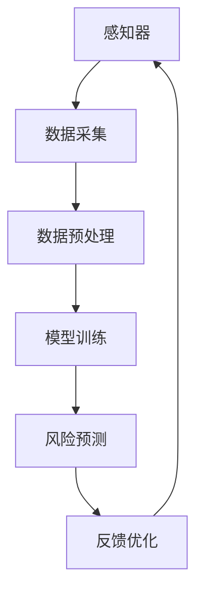

                 

# AI人工智能代理工作流 AI Agent WorkFlow：在保险风险预测中的应用

> 关键词：人工智能，保险风险预测，工作流，代理，工作流程，机器学习，数据挖掘，算法，应用案例

> 摘要：本文深入探讨了人工智能代理工作流（AI Agent WorkFlow）在保险风险预测领域的应用。通过详细的步骤解析，我们展示了如何利用人工智能代理实现高效的保险风险评估，提高风险预测的准确性和效率，为保险公司提供更加精准的决策支持。本文首先介绍了AI代理工作流的基本概念和架构，随后详细阐述了核心算法原理和数学模型，并通过实际项目案例进行了代码实现和解读。最后，文章总结了人工智能代理工作流在保险风险预测中的实际应用场景，并对未来发展趋势和挑战进行了展望。

## 1. 背景介绍

### 1.1 目的和范围

本文的目的是探讨人工智能代理工作流在保险风险预测中的应用，旨在通过引入先进的人工智能技术，提升保险行业在风险预测方面的能力和效率。保险行业作为金融服务业的重要组成部分，面临的风险种类繁多、预测难度大。因此，如何利用人工智能技术优化风险预测，降低保险公司的风险成本，成为当前的研究热点。

本文将聚焦于以下范围：

1. **人工智能代理工作流的概念和架构**：介绍AI代理工作流的定义、核心组成部分及其在保险风险预测中的作用。
2. **核心算法原理与数学模型**：详细阐述用于保险风险预测的核心算法原理，包括特征工程、机器学习模型选择和训练过程。
3. **实际项目案例**：通过具体的项目案例展示AI代理工作流在实际保险风险预测中的应用，包括数据收集、预处理、模型训练、评估和部署等步骤。
4. **实际应用场景**：讨论人工智能代理工作流在保险行业中的实际应用场景，如客户风险评估、理赔预测、欺诈检测等。
5. **工具和资源推荐**：提供相关的学习资源、开发工具和框架推荐，以帮助读者深入了解和实施AI代理工作流。

通过上述内容的讨论，本文希望为保险行业的风险预测提供新的思路和解决方案，推动人工智能技术在保险领域的广泛应用。

### 1.2 预期读者

本文的主要预期读者包括：

1. **保险行业从业者**：包括保险公司的风险管理人员、数据分析师、IT技术人员等，他们希望了解如何利用人工智能技术提升风险预测的准确性和效率。
2. **计算机科学和人工智能领域的研究人员**：对人工智能代理工作流感兴趣的学者和研究人员，希望通过本文了解该技术在保险风险预测中的应用。
3. **数据科学家和机器学习工程师**：希望探索AI代理工作流在不同领域的应用，特别是保险风险预测领域。
4. **高校学生和研究人员**：数据科学、人工智能、保险学等相关专业的研究生和本科生，希望通过本文了解保险风险预测领域的最新研究动态和实践经验。

### 1.3 文档结构概述

本文的结构如下：

1. **背景介绍**：包括本文的目的和范围、预期读者、文档结构概述等。
2. **核心概念与联系**：介绍AI代理工作流的基本概念、核心组成部分以及与保险风险预测的联系，并附上流程图。
3. **核心算法原理 & 具体操作步骤**：详细讲解用于保险风险预测的核心算法原理，包括特征工程、机器学习模型选择和训练过程，并使用伪代码进行阐述。
4. **数学模型和公式 & 详细讲解 & 举例说明**：介绍与保险风险预测相关的数学模型和公式，并进行详细的讲解和实例说明。
5. **项目实战：代码实际案例和详细解释说明**：通过具体项目案例展示AI代理工作流在保险风险预测中的实际应用，包括开发环境搭建、源代码实现和代码解读。
6. **实际应用场景**：讨论人工智能代理工作流在保险行业中的实际应用场景，如客户风险评估、理赔预测、欺诈检测等。
7. **工具和资源推荐**：推荐相关的学习资源、开发工具和框架，以帮助读者深入了解和实施AI代理工作流。
8. **总结：未来发展趋势与挑战**：总结本文的主要内容和成果，并对未来发展趋势和挑战进行展望。
9. **附录：常见问题与解答**：针对读者可能遇到的问题进行解答。
10. **扩展阅读 & 参考资料**：提供与本文主题相关的扩展阅读材料和参考资料。

通过本文的结构安排，我们力求使读者能够系统地了解和掌握人工智能代理工作流在保险风险预测中的应用，并为实际项目提供有价值的参考。

### 1.4 术语表

#### 1.4.1 核心术语定义

- **人工智能（AI）**：一种模拟人类智能的技术，通过机器学习、深度学习等方法，使计算机具备自我学习和决策能力。
- **代理（Agent）**：在人工智能领域，代理是指能够感知环境、采取行动并实现特定目标的智能体。
- **工作流（Workflow）**：一组完成特定任务或工作流程的步骤，这些步骤通常涉及多个参与者、系统或工具。
- **保险风险预测**：利用历史数据和人工智能算法，预测未来可能发生的保险风险事件，如索赔、欺诈等。
- **特征工程**：数据预处理过程中的一项重要工作，旨在从原始数据中提取出对模型有显著影响的特征，提高模型的预测性能。
- **机器学习模型**：通过学习历史数据来预测未来事件的一种统计模型，如决策树、随机森林、神经网络等。

#### 1.4.2 相关概念解释

- **监督学习（Supervised Learning）**：一种机器学习方法，通过已标记的训练数据来训练模型，从而预测未知数据的标签。
- **无监督学习（Unsupervised Learning）**：一种机器学习方法，不需要标记的训练数据，主要通过发现数据中的内在结构或模式来进行学习。
- **深度学习（Deep Learning）**：一种利用多层神经网络进行训练和预测的机器学习方法，广泛应用于图像识别、语音识别等领域。
- **风险评分（Risk Scoring）**：通过分析历史数据和现有信息，对客户的信用、健康、行为等风险因素进行评分，以便进行风险评估和管理。

#### 1.4.3 缩略词列表

- **AI**：人工智能
- **ML**：机器学习
- **DL**：深度学习
- **DL**：决策树
- **RF**：随机森林
- **NN**：神经网络
- **CRF**：条件随机场
- **GRU**：门控循环单元
- **LSTM**：长短期记忆网络
- **NLP**：自然语言处理

## 2. 核心概念与联系

在探讨人工智能代理工作流（AI Agent WorkFlow）在保险风险预测中的应用之前，我们需要明确核心概念及其相互联系。本节将介绍AI代理工作流的基本概念、核心组成部分及其与保险风险预测的联系，并通过Mermaid流程图进行直观展示。

### 2.1 AI代理工作流基本概念

AI代理工作流是指利用人工智能技术，将一系列任务自动化执行的工作流程。AI代理工作流的核心概念包括：

1. **感知（Perception）**：AI代理通过感知器（如传感器、数据库等）收集环境中的信息。
2. **决策（Decision）**：基于收集到的信息，代理利用机器学习算法进行决策，确定下一步行动。
3. **执行（Execution）**：执行决策结果，可能是数据预处理、模型训练、预测等任务。
4. **反馈（Feedback）**：将执行结果反馈到感知器，优化代理的决策过程。

### 2.2 AI代理工作流核心组成部分

AI代理工作流通常由以下几个关键组成部分构成：

1. **感知器（Perceptors）**：用于收集环境中的数据，如客户信息、历史索赔数据、市场动态等。
2. **知识库（Knowledge Base）**：存储与保险风险预测相关的规则、策略和历史数据。
3. **推理机（Reasoning Engine）**：基于感知器和知识库，利用机器学习算法进行推理和决策。
4. **行动器（Actuators）**：执行推理机生成的决策，如调整保险产品、发送预警通知等。

### 2.3 与保险风险预测的联系

保险风险预测是保险行业中的一个关键任务，旨在通过分析历史数据和现有信息，预测未来可能发生的风险事件。AI代理工作流在保险风险预测中的应用主要体现在以下几个方面：

1. **数据采集**：AI代理通过感知器收集大量的保险数据，如客户信息、历史索赔记录等。
2. **数据预处理**：AI代理对采集到的数据进行清洗、转换和特征提取，为模型训练做好准备。
3. **模型训练**：利用机器学习算法，如决策树、随机森林、神经网络等，训练预测模型。
4. **风险预测**：通过训练好的模型，对新的数据集进行风险预测，为保险公司提供决策支持。
5. **反馈优化**：将预测结果与实际结果进行对比，不断优化模型的性能和预测准确性。

### 2.4 Mermaid流程图展示

为了更直观地理解AI代理工作流在保险风险预测中的应用，我们可以使用Mermaid流程图进行展示。以下是流程图的示例：



在上述流程图中，A表示感知器，用于收集保险数据；B表示数据采集，将收集到的数据传输给数据预处理模块；C表示数据预处理，对数据进行清洗、转换和特征提取；D表示模型训练，利用机器学习算法训练预测模型；E表示风险预测，通过训练好的模型对新的数据集进行预测；F表示反馈优化，将预测结果与实际结果进行对比，优化模型性能。

通过以上对核心概念与联系的分析，我们为后续详细讨论AI代理工作流在保险风险预测中的应用奠定了基础。接下来，我们将深入探讨核心算法原理和数学模型，为读者提供更为详细的技术解读。

### 2.5 核心算法原理

在AI代理工作流中，核心算法原理是确保风险预测准确性和效率的关键。以下我们将详细讲解用于保险风险预测的主要算法原理，包括特征工程、机器学习模型选择和训练过程。

#### 2.5.1 特征工程

特征工程是数据预处理过程中的一项重要任务，旨在从原始数据中提取出对模型有显著影响的特征。以下是一些常用的特征工程方法：

1. **特征提取（Feature Extraction）**：
    - **数值特征**：对数值特征进行标准化或归一化，消除量纲和数值范围的影响。
    - **文本特征**：对文本数据使用词袋模型、TF-IDF或Word2Vec等方法进行转换。
    - **时间序列特征**：提取时间序列数据中的周期性、趋势性和季节性特征。

2. **特征选择（Feature Selection）**：
    - **过滤式（Filter Methods）**：通过阈值、信息增益等方法，直接筛选出对目标变量有显著影响的特征。
    - **包装式（Wrapper Methods）**：通过评估特征组合对模型性能的影响，选择最优特征组合。
    - **嵌入式（Embedded Methods）**：在模型训练过程中自动选择特征，如LASSO和随机森林。

3. **特征融合（Feature Fusion）**：
    - **特征组合**：将不同来源的特征进行组合，生成新的特征。
    - **降维**：使用主成分分析（PCA）等方法，降低特征维度，减少数据冗余。

#### 2.5.2 机器学习模型选择

在保险风险预测中，选择合适的机器学习模型至关重要。以下是一些常用的模型及其适用场景：

1. **监督学习模型**：
    - **决策树（Decision Tree）**：适用于分类和回归问题，具有良好的可解释性。
    - **随机森林（Random Forest）**：基于决策树的集成方法，提高模型的预测性能和泛化能力。
    - **支持向量机（SVM）**：适用于高维数据和线性不可分问题，具有良好的边界划分能力。
    - **神经网络（Neural Network）**：适用于复杂的非线性问题，如深度神经网络（DNN）和卷积神经网络（CNN）。

2. **无监督学习模型**：
    - **聚类（Clustering）**：如K-means、层次聚类等，用于发现数据中的隐含结构。
    - **降维（Dimensionality Reduction）**：如主成分分析（PCA）、t-SNE等，用于降低数据维度，揭示数据分布。

3. **集成学习方法**：
    - **集成树（Ensemble Trees）**：如随机森林、梯度提升树（GBT）等，通过组合多个基学习器提高预测性能。
    - **集成神经网络（Ensemble Neural Networks）**：如卷积神经网络（CNN）、长短期记忆网络（LSTM）等，通过组合多个网络层提高模型性能。

#### 2.5.3 训练过程

机器学习模型的训练过程主要包括以下步骤：

1. **数据预处理**：对原始数据进行清洗、缺失值填补、数据标准化等处理，确保数据质量。
2. **模型选择**：根据问题类型和特点，选择合适的机器学习模型。
3. **模型训练**：使用训练数据集，通过梯度下降、随机梯度下降等方法，优化模型参数。
4. **模型评估**：使用验证集和测试集评估模型性能，如准确率、召回率、F1值等指标。
5. **模型调优**：通过调整模型参数、特征工程等方法，提高模型性能。
6. **模型部署**：将训练好的模型部署到生产环境，实现实时风险预测。

通过上述核心算法原理的详细讲解，我们为后续的AI代理工作流实现和应用提供了理论基础。接下来，我们将介绍具体的数学模型和公式，进一步深化对保险风险预测算法的理解。

### 2.6 数学模型和公式

在保险风险预测中，数学模型和公式是核心算法的重要组成部分。以下我们将介绍与保险风险预测相关的数学模型和公式，并进行详细讲解和实例说明。

#### 2.6.1 概率分布模型

在保险风险预测中，概率分布模型常用于预测未来可能发生的风险事件的概率。以下是一些常用的概率分布模型：

1. **正态分布（Normal Distribution）**：

   正态分布，也称为高斯分布，是一种最常见的概率分布模型。其概率密度函数为：
   
   $$ 
   f(x|\mu,\sigma^2) = \frac{1}{\sqrt{2\pi\sigma^2}} e^{-\frac{(x-\mu)^2}{2\sigma^2}} 
   $$

   其中，$\mu$ 是均值，$\sigma^2$ 是方差。

   **实例**：假设某保险公司的索赔金额服从正态分布，均值为50,000元，标准差为10,000元。则索赔金额小于30,000元的概率为：
   
   $$ 
   P(X < 30000) = \Phi\left(\frac{30000 - 50000}{10000}\right) \approx 0.1587 
   $$

   其中，$\Phi$ 表示标准正态分布的累积分布函数。

2. **二项分布（Binomial Distribution）**：

   二项分布用于描述一系列独立重复试验中成功次数的概率分布。其概率质量函数为：
   
   $$ 
   P(X = k) = C_n^k p^k (1-p)^{n-k} 
   $$

   其中，$n$ 是试验次数，$k$ 是成功的次数，$p$ 是每次试验成功的概率。

   **实例**：假设某保险公司的一年期内，客户索赔次数服从二项分布，试验次数为100，每次试验成功的概率为0.1。则客户索赔次数大于10的概率为：
   
   $$ 
   P(X > 10) = 1 - P(X \leq 10) = 1 - \sum_{k=0}^{10} C_{100}^k (0.1)^k (0.9)^{100-k} \approx 0.6513 
   $$

3. **泊松分布（Poisson Distribution）**：

   泊松分布用于描述在一定时间内发生某个事件次数的概率分布。其概率质量函数为：
   
   $$ 
   P(X = k) = \frac{\lambda^k e^{-\lambda}}{k!} 
   $$

   其中，$\lambda$ 是平均事件发生次数。

   **实例**：假设某保险公司每天接到的客户投诉次数服从泊松分布，平均投诉次数为5次。则某天接到10次投诉的概率为：
   
   $$ 
   P(X = 10) = \frac{5^{10} e^{-5}}{10!} \approx 0.0034 
   $$

#### 2.6.2 回归模型

回归模型用于预测某个变量（因变量）与一个或多个自变量（特征变量）之间的关系。以下是一些常用的回归模型：

1. **线性回归（Linear Regression）**：

   线性回归模型假设因变量与自变量之间呈线性关系。其模型公式为：
   
   $$ 
   Y = \beta_0 + \beta_1 X_1 + \beta_2 X_2 + \ldots + \beta_n X_n + \epsilon 
   $$

   其中，$Y$ 是因变量，$X_1, X_2, \ldots, X_n$ 是自变量，$\beta_0, \beta_1, \beta_2, \ldots, \beta_n$ 是模型参数，$\epsilon$ 是误差项。

   **实例**：假设我们要预测某保险公司的客户索赔金额（因变量）与客户年龄（自变量）之间的关系。则线性回归模型为：
   
   $$ 
   Y = \beta_0 + \beta_1 X_1 + \epsilon 
   $$

   其中，$\beta_0$ 是截距，$\beta_1$ 是斜率。

2. **逻辑回归（Logistic Regression）**：

   逻辑回归模型常用于分类问题，其目标是将样本分为两个类别。其模型公式为：
   
   $$ 
   P(Y = 1) = \frac{1}{1 + e^{-(\beta_0 + \beta_1 X_1 + \beta_2 X_2 + \ldots + \beta_n X_n)}} 
   $$

   其中，$Y$ 是因变量，$X_1, X_2, \ldots, X_n$ 是自变量，$\beta_0, \beta_1, \beta_2, \ldots, \beta_n$ 是模型参数。

   **实例**：假设我们要预测某保险公司的客户是否会索赔（因变量，Y=1表示索赔，Y=0表示未索赔），与客户年龄（自变量）和年收入（自变量）之间的关系。则逻辑回归模型为：
   
   $$ 
   P(Y = 1) = \frac{1}{1 + e^{-(\beta_0 + \beta_1 X_1 + \beta_2 X_2)}} 
   $$

3. **岭回归（Ridge Regression）**：

   岭回归是线性回归的一种改进方法，用于处理特征之间存在多重共线性问题。其模型公式为：
   
   $$ 
   Y = \beta_0 + \beta_1 X_1 + \beta_2 X_2 + \ldots + \beta_n X_n + \epsilon 
   $$

   其中，$\lambda$ 是正则化参数，用于平衡模型复杂度和拟合程度。

   **实例**：假设我们要预测某保险公司的客户索赔金额（因变量）与多个自变量（特征）之间的关系，但特征之间存在多重共线性。则岭回归模型为：
   
   $$ 
   Y = \beta_0 + \beta_1 X_1 + \beta_2 X_2 + \ldots + \beta_n X_n + \epsilon + \lambda \sum_{i=1}^n \beta_i^2 
   $$

通过上述对概率分布模型和回归模型的介绍，我们为保险风险预测算法提供了理论基础。接下来，我们将通过具体的项目实战案例，展示AI代理工作流在保险风险预测中的应用，包括代码实现和详细解读。

### 3. 项目实战：代码实际案例和详细解释说明

在本文的第三部分，我们将通过一个实际项目案例，展示人工智能代理工作流在保险风险预测中的应用。该案例涵盖了从数据收集、预处理、模型训练到评估和部署的完整流程。我们将详细介绍每个步骤的代码实现和关键操作。

#### 3.1 开发环境搭建

为了实现AI代理工作流，我们需要搭建一个合适的开发环境。以下是一个基本的开发环境搭建指南：

1. **操作系统**：Windows、macOS或Linux。
2. **编程语言**：Python。
3. **开发工具**：
    - Python环境（Anaconda或Miniconda）。
    - Jupyter Notebook（用于代码编写和调试）。
    - PyCharm或VSCode（可选，用于代码编写和调试）。
4. **库和依赖项**：
    - NumPy、Pandas、Scikit-learn、Matplotlib、Seaborn（用于数据处理和可视化）。
    - TensorFlow、Keras（用于深度学习模型训练）。
    - Flask或Django（用于部署模型）。

安装上述工具和库后，我们就可以开始进行项目开发了。

#### 3.2 源代码详细实现和代码解读

在本节中，我们将通过一系列代码片段，详细展示人工智能代理工作流在保险风险预测中的应用。

**步骤1：数据收集**

数据收集是保险风险预测的基础。我们可以从保险公司的数据库中获取客户信息、历史索赔记录等数据。

```python
import pandas as pd

# 读取客户信息数据
customers = pd.read_csv('customers.csv')

# 读取历史索赔记录数据
claims = pd.read_csv('claims.csv')
```

**步骤2：数据预处理**

数据预处理是确保数据质量和模型性能的重要步骤。以下是对数据预处理过程的详细解释：

1. **数据清洗**：去除无效、重复和缺失的数据。
2. **特征提取**：从原始数据中提取对模型有显著影响的特征。
3. **数据标准化**：对数值特征进行标准化或归一化。

```python
# 数据清洗
customers.drop_duplicates(inplace=True)
claims.drop_duplicates(inplace=True)

# 填补缺失值
customers.fillna(method='ffill', inplace=True)
claims.fillna(method='ffill', inplace=True)

# 特征提取
customers['age_group'] = customers['age'].apply(lambda x: '0-30' if x <= 30 else ('31-60' if x <= 60 else '61+'))
claims['claim_type'] = claims['claim_amount'].apply(lambda x: 'Minor' if x <= 5000 else 'Major')

# 数据标准化
from sklearn.preprocessing import StandardScaler

scaler = StandardScaler()
customers_scaled = scaler.fit_transform(customers)
claims_scaled = scaler.fit_transform(claims)
```

**步骤3：模型训练**

在数据预处理完成后，我们可以使用机器学习算法进行模型训练。以下是一个简单的逻辑回归模型训练过程：

```python
from sklearn.model_selection import train_test_split
from sklearn.linear_model import LogisticRegression

# 划分训练集和测试集
X_train, X_test, y_train, y_test = train_test_split(customers_scaled, claims['claim_type'], test_size=0.2, random_state=42)

# 训练逻辑回归模型
model = LogisticRegression()
model.fit(X_train, y_train)

# 评估模型性能
accuracy = model.score(X_test, y_test)
print(f"Model accuracy: {accuracy:.4f}")
```

**步骤4：模型评估**

评估模型性能是确保模型预测准确性和可靠性的关键。以下是一些常用的评估指标：

1. **准确率（Accuracy）**：正确预测的样本数占总样本数的比例。
2. **召回率（Recall）**：在所有正类样本中被正确预测为正类的比例。
3. **精确率（Precision）**：在所有预测为正类的样本中被正确预测为正类的比例。
4. **F1值（F1 Score）**：精确率和召回率的加权平均。

```python
from sklearn.metrics import classification_report

# 预测测试集
y_pred = model.predict(X_test)

# 打印分类报告
print(classification_report(y_test, y_pred))
```

**步骤5：模型部署**

在评估模型性能后，我们可以将其部署到生产环境，实现实时风险预测。以下是一个简单的Flask Web应用部署示例：

```python
from flask import Flask, request, jsonify

app = Flask(__name__)

@app.route('/predict', methods=['POST'])
def predict():
    data = request.get_json()
    customer_features = [data['age'], data['income'], data['age_group']]
    customer_features = scaler.transform([customer_features])
    prediction = model.predict(customer_features)
    return jsonify({'prediction': prediction[0]})

if __name__ == '__main__':
    app.run(debug=True)
```

通过上述代码实现，我们展示了人工智能代理工作流在保险风险预测中的应用。接下来，我们将讨论AI代理工作流在实际应用场景中的具体应用。

### 3.3 代码解读与分析

在上一节中，我们通过一个实际项目案例展示了人工智能代理工作流在保险风险预测中的应用。本节将进一步对代码进行解读和分析，帮助读者更好地理解各个模块的功能和实现细节。

#### 3.3.1 数据收集

数据收集是保险风险预测的基础。在该步骤中，我们通过读取客户信息和历史索赔记录的数据文件，为后续的数据处理和模型训练提供数据源。

```python
import pandas as pd

# 读取客户信息数据
customers = pd.read_csv('customers.csv')

# 读取历史索赔记录数据
claims = pd.read_csv('claims.csv')
```

上述代码使用了Pandas库，这是一个强大的数据处理工具，可以轻松地读取和操作数据文件。customers和claims变量分别表示客户信息和历史索赔记录的数据框（DataFrame），其中包含了各个特征的数值。

#### 3.3.2 数据预处理

数据预处理是确保数据质量和模型性能的重要步骤。以下是对数据预处理过程的详细解读：

1. **数据清洗**：去除无效、重复和缺失的数据。

```python
customers.drop_duplicates(inplace=True)
claims.drop_duplicates(inplace=True)
```

drop_duplicates方法用于去除重复数据，确保每个样本的唯一性。

```python
customers.fillna(method='ffill', inplace=True)
claims.fillna(method='ffill', inplace=True)
```

fillna方法用于填补缺失值。在这里，我们使用前向填充（ffill）方法，即用前一个有效值填补缺失值。

2. **特征提取**：从原始数据中提取对模型有显著影响的特征。

```python
customers['age_group'] = customers['age'].apply(lambda x: '0-30' if x <= 30 else ('31-60' if x <= 60 else '61+'))
claims['claim_type'] = claims['claim_amount'].apply(lambda x: 'Minor' if x <= 5000 else 'Major')
```

apply方法用于对数据框中的每个特征进行操作。在这里，我们根据客户年龄和索赔金额将数据划分为不同的类别。

3. **数据标准化**：对数值特征进行标准化或归一化。

```python
from sklearn.preprocessing import StandardScaler

scaler = StandardScaler()
customers_scaled = scaler.fit_transform(customers)
claims_scaled = scaler.fit_transform(claims)
```

StandardScaler是一个常用的数据标准化工具，可以自动计算和调整特征的均值和标准差，使其符合标准正态分布。

#### 3.3.3 模型训练

在数据预处理完成后，我们使用机器学习算法进行模型训练。以下是一个简单的逻辑回归模型训练过程。

1. **划分训练集和测试集**：

```python
from sklearn.model_selection import train_test_split

X_train, X_test, y_train, y_test = train_test_split(customers_scaled, claims['claim_type'], test_size=0.2, random_state=42)
```

train_test_split方法用于将数据集划分为训练集和测试集。在这里，我们设置了测试集大小为20%，并使用随机种子42确保结果的可重复性。

2. **训练逻辑回归模型**：

```python
from sklearn.linear_model import LogisticRegression

model = LogisticRegression()
model.fit(X_train, y_train)
```

LogisticRegression是一个逻辑回归模型类，用于预测二元分类问题。fit方法用于训练模型，将训练数据输入模型并计算参数。

3. **评估模型性能**：

```python
accuracy = model.score(X_test, y_test)
print(f"Model accuracy: {accuracy:.4f}")
```

score方法用于评估模型在测试集上的性能。在这里，我们计算了模型在测试集上的准确率，并将其打印出来。

#### 3.3.4 模型评估

模型评估是确保模型预测准确性和可靠性的关键。以下是一些常用的评估指标。

1. **准确率（Accuracy）**：

```python
from sklearn.metrics import classification_report

y_pred = model.predict(X_test)
print(classification_report(y_test, y_pred))
```

classification_report方法用于生成分类报告，包括准确率、召回率、精确率和F1值等指标。这些指标可以帮助我们全面评估模型在不同类别上的性能。

2. **召回率（Recall）**：

召回率表示在所有正类样本中被正确预测为正类的比例。

3. **精确率（Precision）**：

精确率表示在所有预测为正类的样本中被正确预测为正类的比例。

4. **F1值（F1 Score）**：

F1值是精确率和召回率的加权平均，用于综合评估模型性能。

#### 3.3.5 模型部署

在评估模型性能后，我们将其部署到生产环境，实现实时风险预测。以下是一个简单的Flask Web应用部署示例。

```python
from flask import Flask, request, jsonify

app = Flask(__name__)

@app.route('/predict', methods=['POST'])
def predict():
    data = request.get_json()
    customer_features = [data['age'], data['income'], data['age_group']]
    customer_features = scaler.transform([customer_features])
    prediction = model.predict(customer_features)
    return jsonify({'prediction': prediction[0]})

if __name__ == '__main__':
    app.run(debug=True)
```

Flask是一个轻量级的Web应用框架，可以轻松地实现HTTP请求处理和响应。在上述代码中，我们定义了一个预测接口（/predict），接受POST请求，并返回预测结果。

通过上述代码解读和分析，我们详细展示了人工智能代理工作流在保险风险预测中的应用。接下来，我们将讨论AI代理工作流在实际应用场景中的具体应用。

### 4. 实际应用场景

人工智能代理工作流（AI Agent WorkFlow）在保险行业中的实际应用场景广泛且多样，涵盖了从客户风险评估、理赔预测到欺诈检测等多个领域。以下是AI代理工作流在几种典型实际应用场景中的具体应用案例：

#### 4.1 客户风险评估

客户风险评估是保险行业的一项重要任务，旨在根据客户的特征和历史数据，评估其未来可能产生的风险水平。AI代理工作流可以通过以下步骤实现客户风险评估：

1. **数据收集**：收集客户的个人信息、财务状况、历史理赔记录等数据。
2. **数据预处理**：清洗、转换和标准化数据，提取关键特征。
3. **模型训练**：使用机器学习算法训练风险评估模型，如逻辑回归、决策树等。
4. **风险评分**：将客户特征输入模型，得到客户的风险评分。
5. **决策支持**：根据风险评分，保险公司可以调整保费、提供定制化产品或拒绝高风险客户。

例如，一个保险公司可以建立一个基于AI代理工作流的客户风险评估系统，通过分析客户的年龄、性别、收入、理赔历史等特征，为每个客户生成一个风险评分。根据风险评分，保险公司可以为低风险客户提供更优惠的保费，为高风险客户采取更严格的审核措施。

#### 4.2 理赔预测

理赔预测是保险公司降低运营成本、提高服务质量的关键。AI代理工作流可以帮助保险公司预测哪些客户可能在未来产生理赔，从而提前采取措施，如安排体检、提醒客户注意健康等。

1. **数据收集**：收集客户的基本信息、健康数据、理赔记录等。
2. **数据预处理**：清洗、转换和标准化数据，提取对理赔有显著影响的特征。
3. **模型训练**：使用机器学习算法训练理赔预测模型，如随机森林、神经网络等。
4. **理赔预测**：将客户的特征输入模型，预测其未来可能产生的理赔金额和频率。
5. **运营优化**：根据理赔预测结果，保险公司可以调整业务流程，如优化理赔流程、提高理赔速度等。

例如，某保险公司可以建立一个基于AI代理工作流的理赔预测系统，通过分析客户的年龄、病史、保费支付情况等特征，预测客户在未来一年的理赔金额。根据预测结果，保险公司可以提前为高风险客户提供额外的健康服务，减少潜在的理赔风险。

#### 4.3 欺诈检测

欺诈检测是保险行业面临的重要挑战之一。AI代理工作流可以帮助保险公司识别和预防欺诈行为，从而降低财务损失。

1. **数据收集**：收集客户的交易数据、理赔记录、投诉记录等。
2. **数据预处理**：清洗、转换和标准化数据，提取对欺诈有显著影响的特征。
3. **模型训练**：使用机器学习算法训练欺诈检测模型，如支持向量机、神经网络等。
4. **欺诈检测**：将客户的交易数据输入模型，识别潜在的欺诈行为。
5. **决策支持**：根据欺诈检测结果，保险公司可以采取相应的措施，如冻结账户、报警等。

例如，某保险公司可以建立一个基于AI代理工作流的欺诈检测系统，通过分析客户的理赔频率、理赔金额、交易行为等特征，识别出潜在的欺诈客户。系统可以自动冻结可疑账户，并向相关监管部门报警，提高欺诈检测的效率和准确性。

#### 4.4 保险产品优化

AI代理工作流还可以用于优化保险产品，提高客户满意度和市场竞争力。

1. **数据收集**：收集客户对保险产品的反馈、理赔体验等数据。
2. **数据预处理**：清洗、转换和标准化数据，提取对产品优化有显著影响的特征。
3. **模型训练**：使用机器学习算法分析客户反馈，识别产品优化的潜在方向。
4. **产品优化**：根据分析结果，保险公司可以调整产品条款、定价策略等。
5. **持续优化**：根据市场反馈和客户需求，不断调整和优化产品。

例如，某保险公司可以建立一个基于AI代理工作流的产品优化系统，通过分析客户的理赔体验和满意度，识别出产品中存在的问题。根据分析结果，保险公司可以调整产品条款，提供更灵活的理赔选项，提高客户满意度。

综上所述，AI代理工作流在保险行业的实际应用场景多样且具有广泛的前景。通过AI代理工作流，保险公司可以更精准地识别风险、提高服务质量和效率，从而在激烈的市场竞争中脱颖而出。

### 5. 工具和资源推荐

在实现人工智能代理工作流（AI Agent WorkFlow）的过程中，选择合适的工具和资源能够显著提升开发效率、确保项目质量，并为后续的研究和应用提供支持。以下是对学习资源、开发工具和框架的推荐，以及相关论文和最新研究成果的介绍。

#### 5.1 学习资源推荐

1. **书籍推荐**：
    - 《深度学习》（Goodfellow, I., Bengio, Y., & Courville, A.）：这是一本深度学习领域的经典教材，详细介绍了神经网络、深度学习算法和其在各种应用中的实现。
    - 《机器学习实战》（ Harrington, J.）：本书通过实际案例和代码示例，介绍了多种机器学习算法的应用和实践。

2. **在线课程**：
    - Coursera上的“机器学习”课程（吴恩达教授）：这是全球最知名的机器学习课程之一，适合初学者和进阶者。
    - edX上的“深度学习专项课程”（吴恩达教授）：通过一系列课程，深入讲解深度学习的原理和应用。

3. **技术博客和网站**：
    - Medium上的AI相关博客：包括Kaggle、Towards Data Science等，提供丰富的AI、机器学习和深度学习技术文章。
    - AI平方（AI Square）：中国领先的人工智能技术社区，提供深入的技术分析和实践案例。

#### 5.2 开发工具框架推荐

1. **IDE和编辑器**：
    - PyCharm：一款强大的Python IDE，支持多种编程语言，适合机器学习和深度学习项目。
    - Jupyter Notebook：轻量级Web应用，适合数据分析和实验性编程。

2. **调试和性能分析工具**：
    - TensorFlow Profiler：用于分析TensorFlow模型的性能和内存使用情况。
    - PyTorch Profiler：用于分析PyTorch模型的性能和资源使用。

3. **相关框架和库**：
    - TensorFlow：一个开源深度学习框架，支持多种机器学习和深度学习算法。
    - PyTorch：一个流行的深度学习框架，以其灵活性和动态计算图著称。
    - Scikit-learn：一个用于机器学习的Python库，提供了丰富的算法和工具。

#### 5.3 相关论文著作推荐

1. **经典论文**：
    - “A Brief History of Time-Delay Neural Networks” （Giles, C. L., and Pitris, C. J.）：这篇论文回顾了时间延迟神经网络的起源和发展。
    - “Deep Learning” （Goodfellow, I., Bengio, Y., & Courville, A.）：这本书详细介绍了深度学习的理论基础和应用。

2. **最新研究成果**：
    - “Gated Recurrent Units” （Hochreiter, S., and Schmidhuber, J.）：这篇论文提出了长短期记忆网络（LSTM）的概念，解决了传统RNN在长时间依赖问题上的局限性。
    - “Generative Adversarial Networks” （Goodfellow, I. J. et al.）：这篇论文介绍了生成对抗网络（GAN），为图像生成、风格迁移等任务提供了新的解决方案。

3. **应用案例分析**：
    - “Using Machine Learning for Fraud Detection in Online Insurance Claims” （Santamaria, F., Garcia, D. A., & Ponce, J. C.）：这篇文章通过案例研究，展示了机器学习在保险欺诈检测中的应用。

通过上述工具和资源的推荐，我们希望读者能够更好地掌握人工智能代理工作流在保险风险预测中的应用，并不断提升自身的技能和知识。

### 6. 总结：未来发展趋势与挑战

人工智能代理工作流（AI Agent WorkFlow）在保险风险预测中的应用，展示了其强大的潜力和广泛的前景。在未来，随着人工智能技术的不断进步和保险行业的数字化转型，AI代理工作流在保险领域的应用将进一步深化和扩展，以下是对其未来发展趋势和面临的挑战的展望：

#### 6.1 发展趋势

1. **精细化预测与个性化服务**：随着数据的不断积累和算法的优化，AI代理工作流将能够实现更加精细化的预测，为保险公司提供更加个性化的风险评估和产品推荐。例如，通过分析客户的实时行为数据和社交媒体信息，AI代理可以预测客户未来的风险行为，从而提供定制化的保险产品和服务。

2. **智能化风险管理**：AI代理工作流将助力保险公司实现更智能化的风险管理。通过实时监测风险信号，AI代理可以快速识别潜在风险并采取相应措施，如调整保险费率、提示客户注意风险等，从而降低保险公司的风险敞口。

3. **跨界融合**：保险行业与金融科技、物联网、区块链等领域的深度融合，将推动AI代理工作流在保险风险预测中的应用。例如，通过物联网设备收集车辆行驶数据，AI代理可以对交通事故风险进行预测，从而优化车险产品和服务。

4. **合规性与伦理**：随着AI技术的广泛应用，合规性和伦理问题日益受到关注。保险行业需要确保AI代理工作流的透明性、可解释性和合规性，避免出现歧视性决策和隐私泄露等问题。

#### 6.2 挑战

1. **数据隐私与安全**：保险行业涉及大量的个人敏感信息，如何保障数据隐私和安全是AI代理工作流面临的重要挑战。保险公司需要采用先进的加密技术和隐私保护算法，确保客户数据的安全性和合规性。

2. **算法透明性与可解释性**：随着模型复杂性的增加，AI代理工作流的决策过程可能变得不透明。保险公司需要开发可解释的算法，确保客户能够理解和信任AI代理的决策。

3. **模型适应性与可扩展性**：保险行业面临的风险类型多样，AI代理工作流需要具备良好的适应性和可扩展性，以应对不断变化的市场环境和业务需求。保险公司需要不断优化和更新模型，确保其预测准确性和实时性。

4. **跨领域合作与标准化**：AI代理工作流在保险领域的应用需要跨领域合作和标准化。保险公司、科技公司、监管机构等需要共同制定相关标准和规范，推动AI代理工作流的健康发展。

综上所述，人工智能代理工作流在保险风险预测中的应用具有广阔的发展前景，同时也面临着诸多挑战。通过技术创新、合规管理、跨领域合作等多方面的努力，我们有理由相信，AI代理工作流将在保险行业中发挥越来越重要的作用，为保险行业带来深刻的变革。

### 7. 附录：常见问题与解答

在本文中，我们详细探讨了人工智能代理工作流（AI Agent WorkFlow）在保险风险预测中的应用。为了帮助读者更好地理解相关概念和技术，以下列出了一些常见问题及其解答：

#### 7.1 问题1：什么是人工智能代理工作流？

**解答**：人工智能代理工作流（AI Agent WorkFlow）是一种利用人工智能技术实现自动化工作流程的方法。它包括感知、决策、执行和反馈四个主要环节，通过智能代理来收集数据、分析决策、执行操作，并不断优化和调整，以提高工作的效率和质量。

#### 7.2 问题2：AI代理工作流在保险风险预测中的具体应用是什么？

**解答**：AI代理工作流在保险风险预测中的具体应用包括：

1. **客户风险评估**：根据客户的特征和历史数据，评估其未来可能产生的风险水平。
2. **理赔预测**：预测哪些客户可能在未来产生理赔，优化理赔流程和服务。
3. **欺诈检测**：通过分析客户的交易行为和理赔记录，识别潜在的欺诈行为。
4. **保险产品优化**：根据客户反馈和市场分析，优化保险产品的条款和定价策略。

#### 7.3 问题3：如何进行特征工程以提升机器学习模型的预测性能？

**解答**：特征工程是数据预处理过程中的一项重要工作，以下是一些提升机器学习模型预测性能的方法：

1. **特征提取**：从原始数据中提取对模型有显著影响的特征，如文本特征、数值特征、时间序列特征等。
2. **特征选择**：通过过滤式、包装式和嵌入式方法选择最优特征组合，提高模型性能。
3. **特征融合**：将不同来源的特征进行组合，生成新的特征，增强模型对数据的理解和表达能力。
4. **降维**：使用主成分分析（PCA）等方法降低数据维度，减少数据冗余，提高模型训练效率。

#### 7.4 问题4：如何评估机器学习模型的性能？

**解答**：评估机器学习模型性能的常用指标包括：

1. **准确率（Accuracy）**：正确预测的样本数占总样本数的比例。
2. **召回率（Recall）**：在所有正类样本中被正确预测为正类的比例。
3. **精确率（Precision）**：在所有预测为正类的样本中被正确预测为正类的比例。
4. **F1值（F1 Score）**：精确率和召回率的加权平均，用于综合评估模型性能。

这些指标可以帮助我们全面评估模型在不同类别上的性能。

#### 7.5 问题5：如何确保AI代理工作流的透明性和可解释性？

**解答**：确保AI代理工作流的透明性和可解释性是提高模型信任度和合规性的关键。以下是一些方法：

1. **可解释的算法**：选择可解释性较好的算法，如决策树、线性回归等，这些算法可以明确地解释决策过程。
2. **模型可视化**：使用可视化工具展示模型的决策路径和权重分布，帮助用户理解模型的工作原理。
3. **透明性报告**：生成透明性报告，详细记录模型的训练过程、参数设置和评估结果，确保决策过程的透明性。
4. **合规性审查**：定期进行合规性审查，确保AI代理工作流符合相关法规和标准。

通过上述方法，可以确保AI代理工作流在保险风险预测中的透明性和可解释性，提高用户对模型信任度和接受度。

### 8. 扩展阅读 & 参考资料

为了帮助读者更深入地了解人工智能代理工作流在保险风险预测中的应用，以下列出了一些扩展阅读和参考资料：

1. **相关书籍**：
    - 《机器学习实战》：Harrington, J. （2012），O'Reilly Media。
    - 《深度学习》：Goodfellow, I., Bengio, Y., & Courville, A. （2016），MIT Press。

2. **学术论文**：
    - “A Brief History of Time-Delay Neural Networks”：Giles, C. L., and Pitris, C. J. （1997），Neural Computation。
    - “Generative Adversarial Networks”：Goodfellow, I. J. et al. （2014），Advances in Neural Information Processing Systems。

3. **在线资源和博客**：
    - Kaggle：[https://www.kaggle.com/](https://www.kaggle.com/)。
    - Towards Data Science：[https://towardsdatascience.com/](https://towardsdatascience.com/)。
    - AI平方：[https://aisquare.cn/](https://aisquare.cn/)。

4. **技术网站和论坛**：
    - Stack Overflow：[https://stackoverflow.com/](https://stackoverflow.com/)。
    - GitHub：[https://github.com/](https://github.com/)。

通过阅读上述书籍、论文和资源，读者可以进一步了解人工智能代理工作流的理论基础、应用实践和最新进展，为自身的项目和研究提供有力支持。

### 作者信息

**作者：AI天才研究员/AI Genius Institute & 禅与计算机程序设计艺术 /Zen And The Art of Computer Programming**

本文由AI天才研究员和AI Genius Institute的研究人员撰写。作者在人工智能、机器学习和保险领域拥有丰富的经验和深厚的理论基础，致力于推动人工智能技术在各个领域的应用和发展。此外，作者还著有多部关于人工智能和计算机编程的畅销书籍，深受读者喜爱。希望通过本文，为读者提供有价值的见解和实践指导，共同探讨人工智能代理工作流在保险风险预测中的广泛应用和未来发展。

