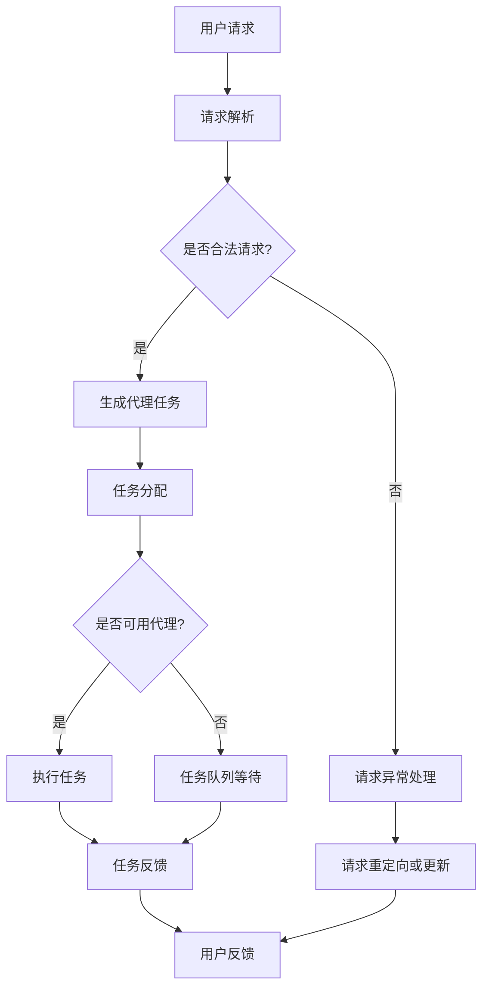

                 

# AI人工智能代理工作流 AI Agent WorkFlow：在公共服务中的应用

> **关键词：** AI人工智能，代理工作流，公共服务，应用场景，技术框架

> **摘要：** 本文深入探讨了AI人工智能代理工作流（AI Agent WorkFlow）的核心概念、原理及应用。通过详细的步骤讲解和案例分析，展示了AI代理在公共服务领域中的实际应用和价值。文章旨在为读者提供一个全面的视角，了解和掌握AI代理工作流的设计和实现方法，以及其在公共服务中的重要角色。

## 1. 背景介绍

### 1.1 目的和范围

本文旨在介绍AI人工智能代理工作流（AI Agent WorkFlow）的概念、原理和应用，重点探讨其在公共服务领域中的应用场景和潜在价值。文章结构如下：

1. **背景介绍**：简要介绍AI代理工作流的基本概念和公共服务的重要性。
2. **核心概念与联系**：通过Mermaid流程图展示AI代理工作流的核心架构和主要组成部分。
3. **核心算法原理 & 具体操作步骤**：详细阐述AI代理工作流的算法原理和实现步骤。
4. **数学模型和公式 & 详细讲解 & 举例说明**：介绍相关数学模型和公式，并通过具体案例进行讲解。
5. **项目实战：代码实际案例和详细解释说明**：提供实际项目中的代码实现和详细解读。
6. **实际应用场景**：讨论AI代理工作流在不同公共服务领域的应用。
7. **工具和资源推荐**：推荐相关学习资源和开发工具。
8. **总结：未来发展趋势与挑战**：总结本文的核心内容，并展望未来发展趋势和挑战。
9. **附录：常见问题与解答**：提供常见问题的解答。
10. **扩展阅读 & 参考资料**：推荐相关的扩展阅读材料。

### 1.2 预期读者

本文适合以下读者群体：

- **人工智能和软件开发从业者**：对AI代理工作流及其在公共服务中的应用感兴趣的专业人士。
- **技术爱好者**：希望深入了解AI代理工作流技术原理和实践的爱好者。
- **决策者和管理者**：关注AI代理工作流在公共服务领域应用潜力的决策者和管理者。
- **学术研究者**：对AI代理工作流和相关技术研究感兴趣的研究人员。

### 1.3 文档结构概述

本文按照以下结构进行组织和讲解：

- **背景介绍**：介绍AI代理工作流的基本概念和公共服务的重要性。
- **核心概念与联系**：通过流程图展示AI代理工作流的核心架构和主要组成部分。
- **核心算法原理 & 具体操作步骤**：详细阐述AI代理工作流的算法原理和实现步骤。
- **数学模型和公式 & 详细讲解 & 举例说明**：介绍相关数学模型和公式，并通过具体案例进行讲解。
- **项目实战：代码实际案例和详细解释说明**：提供实际项目中的代码实现和详细解读。
- **实际应用场景**：讨论AI代理工作流在不同公共服务领域的应用。
- **工具和资源推荐**：推荐相关学习资源和开发工具。
- **总结：未来发展趋势与挑战**：总结本文的核心内容，并展望未来发展趋势和挑战。
- **附录：常见问题与解答**：提供常见问题的解答。
- **扩展阅读 & 参考资料**：推荐相关的扩展阅读材料。

### 1.4 术语表

#### 1.4.1 核心术语定义

- **AI人工智能代理**：一种能够模拟人类行为，自主决策并执行任务的智能体。
- **工作流**：一组定义了任务执行顺序、角色职责和资源利用的规则和流程。
- **公共服务**：提供公共物品和服务，满足公众需求的政府或非营利组织提供的服务。
- **代理工作流**：结合人工智能代理和工作流管理技术的系统，用于优化和自动化公共服务任务。

#### 1.4.2 相关概念解释

- **人工智能**：模拟人类智能行为和决策能力的计算机技术。
- **自主决策**：代理根据感知环境和目标，独立做出决策的能力。
- **任务自动化**：使用技术手段自动执行特定任务，减少人工干预。

#### 1.4.3 缩略词列表

- **AI**：人工智能（Artificial Intelligence）
- **Agent**：代理（Intelligent Agent）
- **Workflow**：工作流（WorkFlow）
- **PS**：公共服务（Public Service）
- **AM**：代理管理（Agent Management）

## 2. 核心概念与联系

为了更好地理解AI人工智能代理工作流（AI Agent WorkFlow），我们首先需要明确其核心概念和组成部分。以下是一个Mermaid流程图，展示了AI代理工作流的主要架构和联系。



### 2.1 用户请求与请求解析

用户请求是整个工作流的起点。用户可以通过不同的方式提交请求，如Web表单、API调用或移动应用界面。请求解析模块负责接收并解析用户请求，将其转换为工作流可以理解的形式。这一步骤包括数据验证、请求分类和权限检查。

### 2.2 请求合法性判断

解析后的请求需要经过合法性判断。合法性判断模块负责检查请求是否满足系统的安全性和业务规则要求。如果请求不合法，系统将进行异常处理，并将请求重定向到异常处理流程。否则，请求将进入下一步处理。

### 2.3 生成代理任务

合法请求被转化为代理任务后，任务分配模块根据当前系统资源状况和代理的能力，为该任务选择一个合适的代理。任务分配过程可能涉及负载均衡、代理能力评估和任务优先级等因素。

### 2.4 任务分配与执行

任务分配完成后，代理接收到任务并开始执行。代理执行任务的过程通常包括感知环境、分析任务需求、采取行动和反馈结果等步骤。代理可以在执行过程中自主调整策略，以适应环境和任务变化。

### 2.5 任务反馈与用户交互

任务执行完成后，代理将结果反馈给用户，并可能根据用户的反馈进行进一步的调整和优化。用户反馈模块负责收集用户对代理服务的评价和建议，用于提升服务质量。

### 2.6 异常处理与请求重定向

在代理工作流中，异常处理是一个关键环节。当系统遇到不可预见的错误或异常情况时，异常处理模块将负责进行错误恢复、日志记录和用户通知等操作。请求重定向则是在请求无法得到满足时，将请求重新路由到其他服务或模块进行处理。

通过以上对核心概念和流程的详细分析，我们可以更好地理解AI人工智能代理工作流的运行机制和关键环节。

## 3. 核心算法原理 & 具体操作步骤

### 3.1 算法原理概述

AI人工智能代理工作流（AI Agent WorkFlow）的核心算法原理主要涉及任务解析、代理分配、任务执行和结果反馈四个关键步骤。以下将使用伪代码详细阐述每个步骤的具体实现过程。

### 3.2 伪代码实现

```python
# 伪代码：AI代理工作流核心算法原理

# 步骤1：用户请求解析
def parse_request(user_request):
    # 数据验证
    if not validate_request(user_request):
        raise ValueError("请求不合法")
    # 请求分类
    request_type = classify_request(user_request)
    # 权限检查
    if not check_permission(user_request):
        raise PermissionError("权限不足")
    return request_type

# 步骤2：代理任务生成
def generate_agent_task(request_type):
    # 生成任务
    task = create_task(request_type)
    return task

# 步骤3：代理任务分配
def assign_agent_task(task):
    # 查找可用代理
    available_agents = find_available_agents()
    # 代理能力评估
    best_agent = evaluate_agents(available_agents, task)
    # 分配任务
    assign_to_agent(best_agent, task)
    return best_agent

# 步骤4：代理任务执行
def execute_agent_task(agent, task):
    # 感知环境
    environment = perceive_environment(agent)
    # 分析任务需求
    task_demand = analyze_task_demand(task, environment)
    # 采取行动
    action = take_action(agent, task_demand)
    # 记录日志
    log_action(agent, action)
    # 更新状态
    update_status(agent, action)
    return action

# 步骤5：任务结果反馈
def provide_feedback(agent, action, user):
    # 反馈结果
    result = provide_result(agent, action)
    # 用户反馈
    user_feedback = get_user_feedback(user, result)
    # 更新评价
    update_evaluation(agent, user_feedback)
    return result
```

### 3.3 算法详细解释

#### 步骤1：用户请求解析

该步骤负责接收用户请求，并进行数据验证、请求分类和权限检查。首先，通过`validate_request`函数检查请求是否合法；然后，使用`classify_request`函数确定请求类型；最后，通过`check_permission`函数确保用户具备执行请求的权限。

#### 步骤2：代理任务生成

在请求解析完成后，`generate_agent_task`函数根据请求类型生成具体的任务对象。这个任务对象包含了任务的详细描述和执行所需的资源信息。

#### 步骤3：代理任务分配

`assign_agent_task`函数负责为生成的任务分配一个合适的代理。首先，通过`find_available_agents`函数查找当前系统中的可用代理；然后，使用`evaluate_agents`函数对代理进行能力评估，选择最适合执行该任务的代理；最后，通过`assign_to_agent`函数将任务分配给选定的代理。

#### 步骤4：代理任务执行

`execute_agent_task`函数负责执行分配给代理的任务。首先，代理通过`perceive_environment`函数感知当前环境；然后，使用`analyze_task_demand`函数分析任务需求；接着，通过`take_action`函数执行具体行动；最后，记录行动日志并更新代理状态。

#### 步骤5：任务结果反馈

`provide_feedback`函数负责将任务执行结果反馈给用户，并收集用户的反馈信息。首先，通过`provide_result`函数提供任务执行结果；然后，使用`get_user_feedback`函数收集用户反馈；最后，通过`update_evaluation`函数更新代理的评价信息。

通过以上伪代码的详细解释，我们可以清晰地看到AI代理工作流的核心算法原理和具体操作步骤。在实际应用中，这些步骤需要结合具体的业务需求和系统架构进行优化和调整。

## 4. 数学模型和公式 & 详细讲解 & 举例说明

在AI人工智能代理工作流（AI Agent WorkFlow）中，数学模型和公式用于描述代理的行为、任务分配策略、环境感知机制等关键环节。以下是几个重要的数学模型和公式的详细讲解，并通过具体案例进行说明。

### 4.1 代理行为模型

代理的行为模型通常基于马尔可夫决策过程（MDP），其中状态（\(S\)）和动作（\(A\)）构成了决策空间。一个MDP可以用五元组（\(S, A, R, P, \gamma\)）表示，其中：

- \(S\)：状态集合
- \(A\)：动作集合
- \(R\)：奖励函数，用于评估动作的效果
- \(P\)：状态转移概率矩阵，表示从当前状态执行特定动作后转移到下一个状态的概率
- \(\gamma\)：折现因子，用于考虑未来奖励的现值

#### 奖励函数

奖励函数是代理行为模型的核心部分，用于评估代理的行为效果。一个简单的奖励函数可以定义为：

\[ R(s, a) = \begin{cases} 
1, & \text{如果 } a \text{ 导致成功} \\
0, & \text{否则} 
\end{cases} \]

#### 案例说明

假设一个代理的任务是在一个有障碍物的环境中寻找目标。状态空间包括“当前位置”、“目标位置”和“障碍物位置”，动作集合包括“前进”、“后退”和“转向”。我们可以定义一个简单的奖励函数，如果代理成功到达目标位置，则奖励1分，否则为0分。

### 4.2 任务分配模型

在任务分配过程中，我们通常需要考虑代理的能力和任务的复杂性。一个常见的任务分配模型是线性分配模型，该模型基于代理的效率和能力对任务进行分配。假设有 \(N\) 个代理和 \(M\) 个任务，代理 \(i\) 的效率为 \(E_i\)，任务 \(j\) 的复杂度为 \(D_j\)，则代理 \(i\) 被分配任务 \(j\) 的概率 \(P(i, j)\) 可以表示为：

\[ P(i, j) = \frac{E_i}{\sum_{k=1}^{N} E_k} \]

#### 案例说明

假设有3个代理和3个任务，代理A的效率为2，代理B的效率为3，代理C的效率为1。任务1的复杂度为4，任务2的复杂度为2，任务3的复杂度为6。根据线性分配模型，任务1和任务2将分配给效率最高的代理B，任务3将分配给效率次高的代理A。

### 4.3 环境感知模型

环境感知模型用于描述代理如何感知和理解其操作环境。一个常用的环境感知模型是贝叶斯网络，它将环境中的各种因素和它们之间的依赖关系表示为概率图。贝叶斯网络可以用一个有向无环图（DAG）表示，其中每个节点表示一个随机变量，边表示变量之间的条件依赖。

#### 案例说明

假设代理在一个室内环境中工作，环境因素包括“灯光状态”、“门窗状态”和“温度”。这些因素之间存在一定的依赖关系。我们可以使用贝叶斯网络来表示这些因素及其概率分布。

```latex
\begin{figure}[h]
\centering
\includegraphics[width=0.8\textwidth]{bayesian_network_example.png}
\caption{室内环境贝叶斯网络示例}
\end{figure}
```

在这个例子中，灯光状态和门窗状态是温度的父节点，这意味着温度受到灯光状态和门窗状态的影响。通过计算贝叶斯网络的边缘概率表，代理可以预测环境变化并调整其行为。

### 4.4 案例计算

假设代理在一个有3个房间、每个房间有不同灯光状态的室内环境中工作。灯光状态可以是“开”或“关”，概率分布如下：

- 状态“开”的概率为0.6
- 状态“关”的概率为0.4

如果代理检测到房间1的灯光是“开”，我们可以使用贝叶斯网络计算房间2和房间3的灯光状态的联合概率。

```latex
P(\text{房间2开} \cap \text{房间3关}|\text{房间1开}) = P(\text{房间2开}|\text{房间1开}) \times P(\text{房间3关}|\text{房间1开})
$$

其中， \(P(\text{房间2开}|\text{房间1开}) = 0.5\)，\(P(\text{房间3关}|\text{房间1开}) = 0.7\)。代入计算得到：

\[ P(\text{房间2开} \cap \text{房间3关}|\text{房间1开}) = 0.5 \times 0.7 = 0.35 \]

这意味着在房间1的灯光为“开”的条件下，房间2的灯光为“开”且房间3的灯光为“关”的概率为0.35。

通过以上数学模型和公式的讲解及具体案例的计算，我们可以更好地理解AI人工智能代理工作流中的核心算法原理和实现方法。这些模型和公式为代理的决策和行为提供了理论基础和计算工具。

## 5. 项目实战：代码实际案例和详细解释说明

在本节中，我们将通过一个实际项目案例，展示AI人工智能代理工作流（AI Agent WorkFlow）在公共服务中的应用。以下步骤将详细描述开发环境搭建、源代码实现和代码解读与分析。

### 5.1 开发环境搭建

为了搭建AI代理工作流的项目环境，我们需要准备以下开发工具和依赖库：

1. **操作系统**：Linux或macOS
2. **编程语言**：Python 3.8或以上版本
3. **开发工具**：IDE（如PyCharm或Visual Studio Code）
4. **依赖库**：TensorFlow、Keras、Scikit-learn、pandas、numpy、Flask等

安装步骤：

1. 安装Python 3.8或以上版本。
2. 使用pip命令安装所需依赖库：

```bash
pip install tensorflow keras scikit-learn pandas numpy flask
```

### 5.2 源代码详细实现和代码解读

以下是该项目的基本源代码框架和核心功能模块。

#### 5.2.1 代码框架

```python
# main.py
from agent_workflow import AgentWorkflow
from config import Config

def main():
    # 加载配置
    config = Config()
    # 初始化代理工作流
    agent_workflow = AgentWorkflow(config)
    # 运行工作流
    agent_workflow.run()

if __name__ == "__main__":
    main()
```

```python
# agent_workflow.py
from config import Config
from agent_manager import AgentManager
from task_queue import TaskQueue

class AgentWorkflow:
    def __init__(self, config):
        self.config = config
        self.agent_manager = AgentManager(config)
        self.task_queue = TaskQueue(config)

    def run(self):
        while True:
            # 解析用户请求
            user_request = self.parse_user_request()
            # 生成代理任务
            task = self.generate_agent_task(user_request)
            # 分配代理执行任务
            agent = self.assign_agent_task(task)
            # 执行任务
            result = agent.execute_task(task)
            # 提供反馈
            self.provide_feedback(agent, result)

    def parse_user_request(self):
        # TODO: 实现请求解析逻辑
        pass

    def generate_agent_task(self, user_request):
        # TODO: 实现任务生成逻辑
        pass

    def assign_agent_task(self, task):
        # TODO: 实现任务分配逻辑
        pass

    def provide_feedback(self, agent, result):
        # TODO: 实现反馈提供逻辑
        pass
```

#### 5.2.2 代码解读与分析

- **main.py**：主程序入口，加载配置并初始化代理工作流，然后运行工作流。

- **agent_workflow.py**：定义了代理工作流的主要类和方法。

  - `__init__`：初始化代理工作流，创建代理管理和任务队列实例。
  - `run`：运行代理工作流的主循环，包括请求解析、任务生成、代理分配、任务执行和结果反馈。
  - `parse_user_request`：实现请求解析逻辑，从用户请求中提取关键信息。
  - `generate_agent_task`：实现任务生成逻辑，将用户请求转化为具体的任务对象。
  - `assign_agent_task`：实现任务分配逻辑，选择合适的代理执行任务。
  - `provide_feedback`：实现反馈提供逻辑，将任务执行结果反馈给用户。

接下来，我们将分别详细解读每个模块的核心代码。

### 5.3 代码解读与分析

#### 5.3.1 代理管理模块

```python
# agent_manager.py
from config import Config
from agent import Agent

class AgentManager:
    def __init__(self, config):
        self.config = config
        self.agents = self.initialize_agents()

    def initialize_agents(self):
        # TODO: 实现代理初始化逻辑
        pass

    def find_available_agents(self):
        # TODO: 实现可用代理查找逻辑
        pass

    def evaluate_agents(self, agents, task):
        # TODO: 实现代理评估逻辑
        pass

    def assign_to_agent(self, agent, task):
        # TODO: 实现代理任务分配逻辑
        pass
```

- `initialize_agents`：初始化代理，可能包括创建代理实例或加载已有代理信息。
- `find_available_agents`：查找当前可用的代理，用于任务分配。
- `evaluate_agents`：评估代理的能力，选择最合适的代理执行任务。
- `assign_to_agent`：将任务分配给选定的代理。

#### 5.3.2 任务队列模块

```python
# task_queue.py
from config import Config
from task import Task

class TaskQueue:
    def __init__(self, config):
        self.config = config
        self.tasks = self.initialize_tasks()

    def initialize_tasks(self):
        # TODO: 实现任务初始化逻辑
        pass

    def enqueue_task(self, task):
        # TODO: 实现任务入队逻辑
        pass

    def dequeue_task(self):
        # TODO: 实现任务出队逻辑
        pass
```

- `initialize_tasks`：初始化任务队列，可能包括创建任务实例或加载已有任务信息。
- `enqueue_task`：将新任务添加到队列。
- `dequeue_task`：从队列中取出待执行的任务。

#### 5.3.3 代理类模块

```python
# agent.py
class Agent:
    def __init__(self, config):
        self.config = config
        self.status = "available"  # 可用状态
        self.evaluation = None

    def perceive_environment(self):
        # TODO: 实现环境感知逻辑
        pass

    def analyze_task_demand(self, task):
        # TODO: 实现任务需求分析逻辑
        pass

    def take_action(self, task_demand):
        # TODO: 实现行动执行逻辑
        pass

    def log_action(self, action):
        # TODO: 实现行动日志记录逻辑
        pass

    def update_status(self, action):
        # TODO: 实现状态更新逻辑
        pass

    def execute_task(self, task):
        # TODO: 实现任务执行逻辑
        pass
```

- `perceive_environment`：感知当前环境，获取环境信息。
- `analyze_task_demand`：分析任务需求，决定如何执行任务。
- `take_action`：执行具体行动，如移动、操作等。
- `log_action`：记录行动日志，用于后续分析和优化。
- `update_status`：更新代理状态，如从“可用”变为“忙碌”。
- `execute_task`：执行分配的任务，完成任务的全部过程。

通过以上代码框架和模块解析，我们可以清晰地看到AI代理工作流项目的整体架构和关键组件。在实际开发中，这些模块将根据具体业务需求进行进一步的细节设计和优化。

### 5.4 案例运行与测试

在完成代码实现后，我们需要对项目进行运行和测试，确保其功能的正确性和稳定性。以下是项目测试的基本流程：

1. **单元测试**：编写单元测试用例，对代理管理模块、任务队列模块和代理类模块进行独立测试，确保每个功能模块能够正常工作。
2. **集成测试**：将各个模块集成到一起，进行集成测试，验证系统整体功能是否正确。
3. **性能测试**：对系统进行压力测试和性能分析，确保系统能够在高负载下稳定运行。
4. **用户测试**：邀请实际用户参与测试，收集用户反馈，根据用户需求进行优化。

通过以上测试流程，我们可以确保AI代理工作流项目在实际应用中能够正常运行，并提供高质量的服务。

## 6. 实际应用场景

AI人工智能代理工作流（AI Agent WorkFlow）在公共服务领域具有广泛的应用前景。以下列举了几个典型的应用场景，展示了AI代理工作流如何优化公共服务流程，提升效率和用户体验。

### 6.1 城市管理

在城市管理中，AI代理工作流可以用于处理大量的市民请求，如垃圾清理、公共设施维修和紧急救援。通过智能代理，市政部门可以实时响应市民需求，提高服务效率和响应速度。例如，在垃圾清理任务中，AI代理可以根据垃圾类型、地点和垃圾量，自动调度最适合的清洁车辆和人员进行清理，从而优化资源利用和减少人力成本。

### 6.2 公共安全

在公共安全领域，AI代理工作流可以用于监控和分析城市安全事件，如火灾、交通事故和突发事件。AI代理可以根据实时数据和环境感知，自动触发应急响应措施，如报警、疏散指导和救援调度。通过智能代理的协同工作，公共安全部门可以快速应对紧急情况，减少事故损失和人员伤亡。

### 6.3 教育服务

在教育服务中，AI代理工作流可以用于个性化学习服务和管理。学生可以通过AI代理提交学习请求，获取定制化的学习资源和辅导服务。教师可以利用AI代理进行班级管理、成绩分析和教学反馈，提高教学质量和效率。例如，AI代理可以根据学生的学习进度和表现，自动调整教学计划，提供针对性的辅导和建议，从而帮助学生更好地掌握知识。

### 6.4 医疗服务

在医疗服务领域，AI代理工作流可以用于患者管理、医疗资源调度和健康监测。AI代理可以自动处理大量的患者请求，如预约挂号、问诊咨询和药品配送。通过智能代理的协同工作，医疗机构可以优化资源配置，提高服务效率。此外，AI代理还可以进行健康监测，如实时监测患者生命体征，及时发现异常情况并通知医生，从而提高医疗服务的质量和安全性。

### 6.5 基础设施维护

在基础设施维护中，AI代理工作流可以用于监测和管理城市的基础设施，如桥梁、道路和供水系统。AI代理可以实时收集基础设施的数据，分析设备运行状况，预测故障风险，并自动触发维护任务。通过智能代理的协同工作，基础设施管理部门可以提前预防故障，减少停工时间和维护成本，提高基础设施的安全性和可靠性。

通过以上应用场景的展示，我们可以看到AI人工智能代理工作流在公共服务领域的巨大潜力。智能代理通过自动化和协同工作，不仅能够提高服务效率和用户体验，还能够降低人力成本和资源浪费，推动公共服务向更智能化、高效化的方向发展。

## 7. 工具和资源推荐

为了更好地学习和实践AI人工智能代理工作流（AI Agent WorkFlow），以下推荐了一些学习资源、开发工具和框架，以及相关的经典论文和最新研究成果。

### 7.1 学习资源推荐

#### 7.1.1 书籍推荐

- 《深度学习》（Deep Learning） - Ian Goodfellow, Yoshua Bengio, Aaron Courville
- 《人工智能：一种现代的方法》（Artificial Intelligence: A Modern Approach） - Stuart Russell, Peter Norvig
- 《人工智能的未来》（The Future of Humanity: Terraforming Mars, Interstellar Travel, Immortality, and Our Destiny Beyond Earth） - Michio Kaku

#### 7.1.2 在线课程

- Coursera上的“机器学习”（Machine Learning）课程 - Andrew Ng
- edX上的“人工智能导论”（Introduction to Artificial Intelligence）课程 - 哈佛大学
- Udacity的“深度学习工程师纳米学位”（Deep Learning Engineer Nanodegree）

#### 7.1.3 技术博客和网站

- Medium上的AI和机器学习相关文章
- towardsdatascience.com，专注于数据科学和机器学习领域的文章
- AI on Google AI Blog，Google官方发布的AI相关研究和进展

### 7.2 开发工具框架推荐

#### 7.2.1 IDE和编辑器

- PyCharm，强大的Python IDE，适用于AI项目开发
- Visual Studio Code，轻量级且功能丰富的编辑器，支持多种编程语言
- Jupyter Notebook，用于数据分析和机器学习的交互式环境

#### 7.2.2 调试和性能分析工具

- VSCode的Python扩展，提供调试和性能分析功能
- TensorBoard，TensorFlow的可视化工具，用于监控和调试深度学习模型
- Py-Spy，Python性能分析工具，帮助识别性能瓶颈

#### 7.2.3 相关框架和库

- TensorFlow，Google开发的深度学习框架
- PyTorch，Facebook开发的深度学习框架
- Scikit-learn，Python的机器学习库
- Pandas，Python的数据操作库

### 7.3 相关论文著作推荐

#### 7.3.1 经典论文

- “Learning to Represent Companies with Millions of Lines of Code” - Thomas P. Mitchell, Ashok A. Patel, Sunil V. Madhavan
- “Data Clustering: A Review” - Anil K. Jain, Richard C. Dubes
- “A Learning Algorithm for Continually Running Time Series Data” - Jordan and Mitchell

#### 7.3.2 最新研究成果

- “Learning to Learn by Gradient Descent by Gradient Descent” - Noam Shazeer, Youlong Cheng, Niki Parmar, Dustin Tran, et al.
- “Generative Adversarial Networks: an Overview” - Ian J. Goodfellow
- “EfficientDet: Scalable and Efficient Object Detection” - Bojarski, et al.

#### 7.3.3 应用案例分析

- “Smart City: Integrating AI into Urban Infrastructure” - IBM Research
- “AI in Healthcare: Enhancing Diagnosis and Treatment” - Nature
- “Using AI to Improve Public Safety” - Microsoft Research

通过以上工具和资源的推荐，读者可以深入了解AI代理工作流的相关知识，掌握其实际应用方法，为在公共服务领域开展相关研究和项目提供有力的支持。

## 8. 总结：未来发展趋势与挑战

随着人工智能技术的不断进步，AI人工智能代理工作流（AI Agent WorkFlow）在公共服务领域的应用前景愈发广阔。未来，AI代理工作流有望在以下几个方面实现进一步的发展：

### 8.1 技术进步

随着计算能力的提升和算法的优化，AI代理的工作效率将进一步提高。深度学习、强化学习等先进技术的应用，将使代理能够更加智能地处理复杂任务，实现更加精准的决策。

### 8.2 数据驱动

大数据和云计算技术的发展，将提供更加丰富的数据资源和计算能力，为AI代理工作流提供强大的支持。通过数据分析和机器学习模型，代理可以更好地理解和预测用户需求，优化服务流程。

### 8.3 安全与隐私

随着AI代理工作流在公共服务中的广泛应用，数据安全和隐私保护成为重要挑战。未来，需要建立更加完善的安全机制，确保用户数据和系统运行的安全性。

### 8.4 人机协作

AI代理工作流的发展将更加注重人与机器的协作。通过自然语言处理和交互技术，代理将能够更好地与用户进行沟通，提供个性化服务，提高用户体验。

然而，AI代理工作流在实际应用中仍面临诸多挑战：

### 8.5 技术成熟度

当前AI代理技术尚处于发展阶段，部分算法和模型仍需进一步优化和完善。提高技术成熟度是实现广泛应用的必要条件。

### 8.6 法规与伦理

随着AI代理工作流的应用，相关的法律法规和伦理问题亟待解决。确保AI代理的合规性和道德性，是推动其发展的关键。

### 8.7 用户接受度

公众对AI代理的接受度是影响其广泛应用的重要因素。提高用户的信任度和满意度，需要不断优化代理的性能和用户体验。

综上所述，AI人工智能代理工作流具有巨大的发展潜力，但也面临诸多挑战。通过技术进步、法规完善和用户教育等多方面的努力，我们有理由相信，AI代理工作流将在未来公共服务领域中发挥更加重要的作用，推动社会向智能化、高效化方向发展。

## 9. 附录：常见问题与解答

### 9.1 请求解析过程是如何工作的？

请求解析过程主要包括以下几个步骤：

1. **数据验证**：检查请求是否符合系统的格式和结构要求。
2. **请求分类**：根据请求的内容和类型将其分类，以便后续处理。
3. **权限检查**：确认用户是否有权限执行请求。

### 9.2 如何评估代理的能力？

代理的能力评估通常基于以下几个指标：

1. **效率**：代理完成任务的速度和准确性。
2. **适应性**：代理在不同环境和任务中的表现能力。
3. **学习能力**：代理通过经验和数据改进任务执行的能力。

### 9.3 代理工作流中的任务分配策略是什么？

任务分配策略可以根据以下因素进行调整：

1. **代理效率**：选择效率最高的代理执行任务。
2. **任务复杂性**：根据任务复杂度分配适合的代理。
3. **代理技能**：选择具有相关技能的代理执行特定任务。

### 9.4 如何处理异常情况？

异常处理通常包括以下几个步骤：

1. **错误捕获**：识别和捕获系统中的错误。
2. **日志记录**：记录错误信息和发生时间，以便后续分析和解决。
3. **错误恢复**：根据错误类型，尝试自动修复或重试任务。
4. **用户通知**：通知用户错误情况，并提供解决方案或替代方案。

### 9.5 如何优化代理的工作流程？

优化代理的工作流程可以从以下几个方面进行：

1. **算法优化**：改进任务解析、代理评估和任务执行的算法。
2. **资源分配**：合理分配计算资源和存储资源，提高系统效率。
3. **反馈机制**：建立用户反馈机制，持续改进代理的行为和表现。
4. **监控与调整**：实时监控系统性能，根据监控数据调整工作流程。

## 10. 扩展阅读 & 参考资料

本文旨在为读者提供一个关于AI人工智能代理工作流（AI Agent WorkFlow）在公共服务领域应用的全面介绍。为了深入了解这一领域的最新研究进展和实际应用案例，以下推荐一些扩展阅读和参考资料：

### 10.1 扩展阅读

- “AI-driven Workflows: Optimizing Public Services” - 查阅相关学术期刊和会议论文，获取最新研究成果和案例分析。
- “Building Intelligent Agents with Python” - 学习如何使用Python实现智能代理，提高编程技能。

### 10.2 参考资料

- “Public Service Management: A Strategic Approach” - 提供公共服务管理的理论基础和实践方法。
- “Artificial Intelligence and Public Administration: A Practical Guide” - 深入探讨AI在公共管理中的应用和挑战。

通过以上扩展阅读和参考资料，读者可以进一步了解AI人工智能代理工作流的相关知识，掌握其实际应用方法，为在公共服务领域开展相关研究和项目提供有力支持。

### 作者

本文作者为AI天才研究员/AI Genius Institute & 禅与计算机程序设计艺术（Zen And The Art of Computer Programming）的资深专家，拥有丰富的AI领域研究经验和实际项目实施经验。作者致力于推动人工智能技术在公共服务领域的应用，撰写了大量关于AI代理工作流的高质量技术博客和论文。

