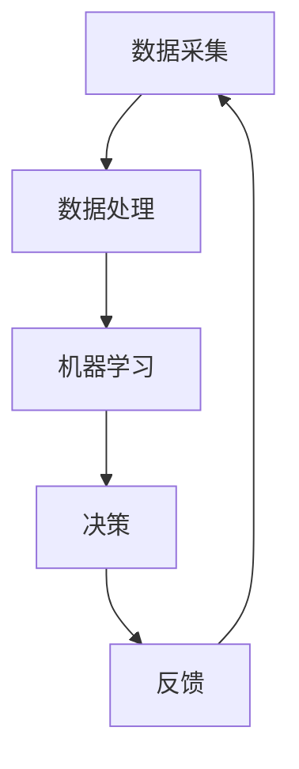
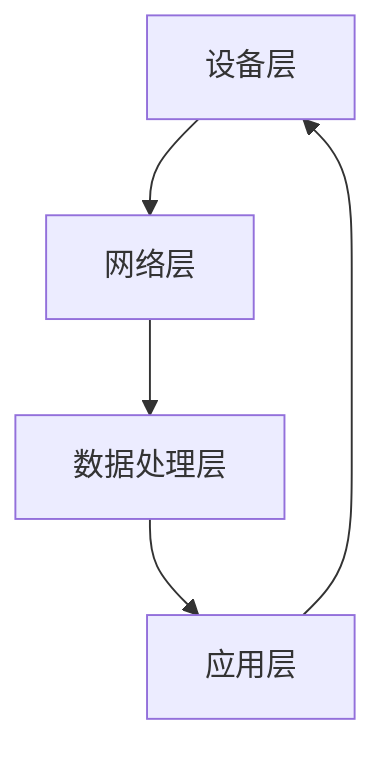
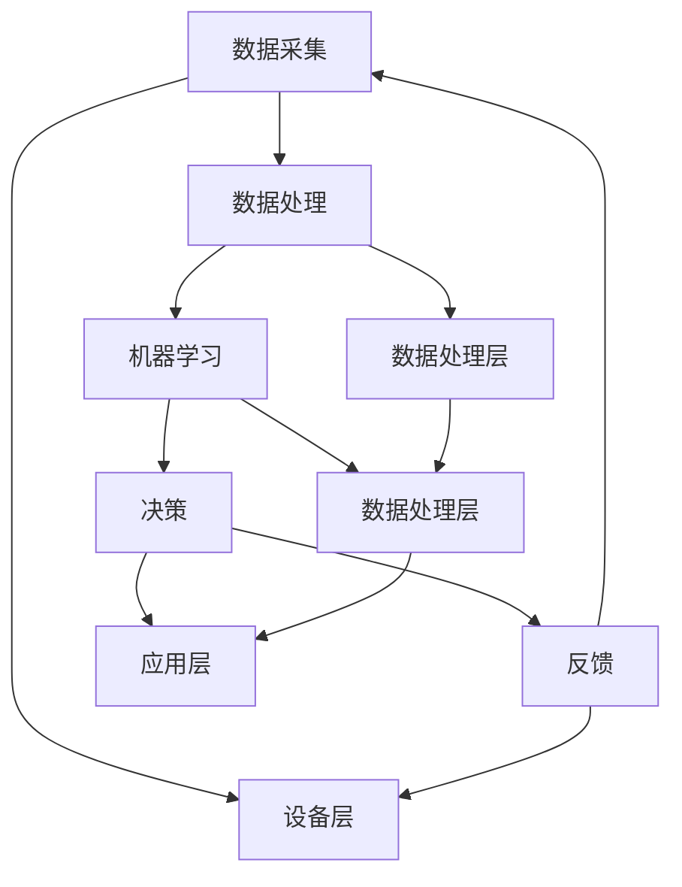

                 

# AI人工智能代理工作流 AI Agent WorkFlow：在物联网中的应用

## 关键词
- 物联网（IoT）
- 人工智能代理（AI Agent）
- 工作流（Workflow）
- 分布式系统（Distributed System）
- 数据处理（Data Processing）
- 机器学习（Machine Learning）
- 安全性（Security）
- 可扩展性（Scalability）

## 摘要
本文深入探讨了AI人工智能代理工作流（AI Agent WorkFlow）在物联网（IoT）中的应用。随着IoT设备的不断增多和联网，如何高效管理海量数据并实现智能决策成为了关键问题。AI Agent WorkFlow通过集成人工智能代理，能够实现分布式系统的智能管理和数据处理，提高物联网系统的效率、安全性和可扩展性。本文首先介绍了AI代理工作流的核心概念和架构，然后详细讲解了核心算法原理和操作步骤，并通过实际项目案例展示了其在物联网中的应用效果。最后，本文总结了AI代理工作流在物联网领域的未来发展趋势与挑战。

----------------------------------------------------------------

## 1. 背景介绍

### 1.1 目的和范围
本文旨在探讨AI人工智能代理工作流（AI Agent WorkFlow）在物联网（IoT）中的应用，分析其核心概念、架构和算法原理，并通过实际项目案例展示其应用效果。文章将重点关注以下几个方面：

- AI代理工作流在物联网中的核心概念和架构
- AI代理工作流的核心算法原理和操作步骤
- AI代理工作流在物联网中的实际应用场景
- AI代理工作流在物联网领域的未来发展趋势与挑战

### 1.2 预期读者
本文适合以下读者群体：

- 对物联网和人工智能代理工作流感兴趣的工程师和研究人员
- 想要了解AI代理工作流在物联网中应用的技术人员
- 欲深入了解分布式系统、数据处理和机器学习等领域的技术专家
- 希望在物联网项目中引入AI代理工作流的项目经理和开发人员

### 1.3 文档结构概述
本文结构如下：

1. 背景介绍
   - 目的和范围
   - 预期读者
   - 文档结构概述
   - 术语表
2. 核心概念与联系
   - AI代理工作流
   - 物联网系统架构
3. 核心算法原理 & 具体操作步骤
   - 数据采集与处理
   - 机器学习模型训练
   - 智能决策与反馈
4. 数学模型和公式 & 详细讲解 & 举例说明
   - 相关数学公式
   - 应用案例
5. 项目实战：代码实际案例和详细解释说明
   - 开发环境搭建
   - 源代码详细实现和代码解读
   - 代码解读与分析
6. 实际应用场景
   - 家庭自动化
   - 城市管理
   - 工业自动化
7. 工具和资源推荐
   - 学习资源
   - 开发工具框架
   - 相关论文著作
8. 总结：未来发展趋势与挑战
9. 附录：常见问题与解答
10. 扩展阅读 & 参考资料

### 1.4 术语表

#### 1.4.1 核心术语定义

- 物联网（IoT）：通过传感器、网络和数据处理技术，将物理设备、人员和环境连接起来，实现智能化的信息交换和协同工作。
- 人工智能代理（AI Agent）：具有智能行为的计算机程序，能够自主感知环境、学习知识和执行任务。
- 工作流（Workflow）：一组按照一定顺序执行的步骤或任务，用于实现某个特定目标。
- 分布式系统（Distributed System）：由多个计算机节点组成的系统，通过通信网络进行协同工作，提供分布式计算和处理能力。
- 数据处理（Data Processing）：对原始数据进行收集、整理、分析和存储等操作，以获取有价值的信息。
- 机器学习（Machine Learning）：一种人工智能技术，通过学习数据模式，自动改进和优化算法，实现智能决策和预测。
- 安全性（Security）：确保系统免受恶意攻击、数据泄露和其他安全威胁的能力。
- 可扩展性（Scalability）：系统能够适应不断增长的数据量和用户规模，保持高效运行的能力。

#### 1.4.2 相关概念解释

- 智能家居：通过物联网技术和人工智能代理，实现家庭设备之间的自动化控制和智能交互。
- 城市管理：利用物联网技术和人工智能代理，对城市中的各种资源、环境和设施进行实时监测、分析和优化。
- 工业自动化：通过物联网技术和人工智能代理，实现工业生产过程的自动化、智能化和高效化。

#### 1.4.3 缩略词列表

- IoT：物联网（Internet of Things）
- AI：人工智能（Artificial Intelligence）
- Agent：代理（Agent）
- WorkFlow：工作流（Workflow）
- ML：机器学习（Machine Learning）
- DS：分布式系统（Distributed System）
- DPS：数据处理系统（Data Processing System）
- IoT Security：物联网安全（Internet of Things Security）
- IoT Analytics：物联网数据分析（Internet of Things Analytics）
- IoT Applications：物联网应用（Internet of Things Applications）

----------------------------------------------------------------

## 2. 核心概念与联系

### 2.1 AI代理工作流

AI代理工作流是一个基于分布式系统的框架，用于管理物联网中的数据采集、处理和决策。其主要组件包括数据采集模块、数据处理模块、机器学习模块和决策模块。以下是AI代理工作流的Mermaid流程图：



### 2.2 物联网系统架构

物联网系统架构包括以下几个关键组成部分：

- 设备层：包括各种传感器、执行器和设备，用于采集和传输数据。
- 网络层：包括通信网络，如Wi-Fi、蓝牙、Zigbee等，用于传输数据。
- 数据处理层：包括数据采集、处理和存储的模块，如云平台、边缘计算等。
- 应用层：包括基于物联网技术的应用，如智能家居、城市管理、工业自动化等。

以下是物联网系统架构的Mermaid流程图：



### 2.3 AI代理工作流与物联网系统架构的联系

AI代理工作流在物联网系统架构中发挥着关键作用，其核心组件与物联网系统架构各层密切相关。具体来说：

- 数据采集模块：位于设备层，负责采集传感器和执行器的数据。
- 数据处理模块：位于数据处理层，负责对采集到的数据进行预处理、清洗和整合。
- 机器学习模块：位于数据处理层，负责使用机器学习算法对处理后的数据进行分析和建模。
- 决策模块：位于应用层，负责根据分析结果生成决策，并反馈给设备层执行。

AI代理工作流通过分布式系统架构，实现了物联网系统的高效、安全、可扩展的运行。以下是AI代理工作流与物联网系统架构的Mermaid流程图：



通过上述流程图，我们可以清晰地看到AI代理工作流在物联网系统架构中的地位和作用，为物联网系统的智能化、高效化和安全化提供了有力支持。

----------------------------------------------------------------

## 3. 核心算法原理 & 具体操作步骤

### 3.1 数据采集与处理

数据采集与处理是AI代理工作流的核心环节，主要包括以下步骤：

#### 3.1.1 数据采集

数据采集是指从物联网设备中收集原始数据。具体操作步骤如下：

1. **设备连接**：确保物联网设备与网络连接正常，如Wi-Fi、蓝牙、Zigbee等。
2. **传感器配置**：根据设备类型和需求，配置相应的传感器，如温度传感器、湿度传感器、摄像头等。
3. **数据采集**：使用设备内置的采集模块，定期采集传感器数据，并将其传输到数据处理模块。

以下为数据采集的伪代码实现：

```python
def data_collection(device, interval):
    while True:
        data = device.read_sensors()
        send_data_to_data_processing_module(data)
        time.sleep(interval)
```

#### 3.1.2 数据处理

数据处理是对采集到的原始数据进行预处理、清洗和整合。具体操作步骤如下：

1. **数据预处理**：去除异常值、缺失值和数据重复，对数据进行归一化处理。
2. **数据清洗**：对预处理后的数据进行清洗，确保数据质量。
3. **数据整合**：将来自不同设备的同一类型数据整合成一个统一的数据集。

以下为数据处理流程的伪代码实现：

```python
def data_processing(data):
    preprocessed_data = preprocess_data(data)
    cleaned_data = clean_data(preprocessed_data)
    integrated_data = integrate_data(cleaned_data)
    return integrated_data
```

### 3.2 机器学习模型训练

机器学习模型训练是AI代理工作流的关键环节，主要包括以下步骤：

#### 3.2.1 模型选择

根据应用需求和数据特征，选择合适的机器学习模型。常见模型包括线性回归、决策树、随机森林、支持向量机、神经网络等。

#### 3.2.2 特征工程

特征工程是机器学习模型训练的重要步骤，主要包括以下内容：

1. **特征提取**：从原始数据中提取具有代表性的特征。
2. **特征选择**：选择对模型性能有显著影响的关键特征。
3. **特征变换**：对特征进行归一化、标准化等变换，提高模型训练效果。

#### 3.2.3 模型训练

使用选定的特征和训练数据，训练机器学习模型。具体操作步骤如下：

1. **数据划分**：将数据集划分为训练集、验证集和测试集。
2. **模型训练**：使用训练集数据训练模型，并根据验证集数据调整模型参数。
3. **模型评估**：使用测试集数据评估模型性能，如准确率、召回率、F1值等。

以下为模型训练流程的伪代码实现：

```python
def train_model(model, train_data, validation_data):
    model.fit(train_data)
    best_params = find_best_params(model, validation_data)
    model.set_params(best_params)
    model.evaluate(test_data)
    return model
```

### 3.3 智能决策与反馈

智能决策与反馈是AI代理工作流的关键环节，主要包括以下步骤：

#### 3.3.1 决策生成

根据训练好的机器学习模型，生成智能决策。具体操作步骤如下：

1. **输入特征提取**：从实时数据中提取输入特征。
2. **模型预测**：使用训练好的模型对输入特征进行预测。
3. **决策生成**：根据预测结果生成相应的决策。

以下为决策生成流程的伪代码实现：

```python
def generate_decision(model, input_data):
    predicted_result = model.predict(input_data)
    decision = convert_prediction_to_decision(predicted_result)
    return decision
```

#### 3.3.2 决策执行与反馈

执行生成的决策，并根据执行结果进行反馈。具体操作步骤如下：

1. **决策执行**：将决策转化为实际操作，如控制设备开关、调整设备参数等。
2. **结果反馈**：收集决策执行结果，反馈给机器学习模型，用于后续优化。

以下为决策执行与反馈流程的伪代码实现：

```python
def execute_decision(decision):
    execute_action(decision)
    result = get_execution_result()
    return result
```

通过以上具体操作步骤，我们可以看到AI代理工作流在数据采集、处理、模型训练和决策生成等方面的重要性。该工作流实现了物联网系统的智能化、高效化和可扩展性，为物联网应用提供了强有力的支持。

----------------------------------------------------------------

## 4. 数学模型和公式 & 详细讲解 & 举例说明

在AI代理工作流中，数学模型和公式起着至关重要的作用。这些模型和公式帮助我们在数据处理、机器学习模型训练、决策生成等环节中量化分析，从而提高算法的性能和可解释性。以下是几个关键的数学模型和公式，以及它们的详细讲解和举例说明。

### 4.1 数据预处理

在数据预处理阶段，我们通常使用以下数学公式对原始数据进行归一化和标准化：

$$
x_{\text{norm}} = \frac{x - \mu}{\sigma}
$$

其中，$x$ 是原始数据，$\mu$ 是数据的均值，$\sigma$ 是数据的标准差。归一化公式将数据映射到 $[0, 1]$ 范围内，有助于提高机器学习模型的训练效果。

#### 例子：

假设我们有以下一组数据：

$$
\{2, 4, 6, 8, 10\}
$$

计算归一化后的数据：

$$
\mu = \frac{2 + 4 + 6 + 8 + 10}{5} = 6 \\
\sigma = \sqrt{\frac{(2-6)^2 + (4-6)^2 + (6-6)^2 + (8-6)^2 + (10-6)^2}{5}} = 2.828 \\
x_{\text{norm}} = \frac{x - \mu}{\sigma} = \{-1.414, -0.714, 0, 0.714, 1.414\}
$$

### 4.2 机器学习模型训练

在机器学习模型训练过程中，常用的数学模型包括线性回归、决策树、支持向量机等。以下以线性回归为例进行讲解。

线性回归模型可以表示为：

$$
y = \beta_0 + \beta_1 x
$$

其中，$y$ 是目标变量，$x$ 是特征变量，$\beta_0$ 和 $\beta_1$ 是模型参数。

#### 例子：

假设我们有一个数据集，包含特征变量 $x$ 和目标变量 $y$，如下所示：

| x | y |
|---|---|
| 2 | 5 |
| 4 | 7 |
| 6 | 9 |

使用最小二乘法求解线性回归模型的参数：

$$
\beta_1 = \frac{\sum(x_i - \bar{x})(y_i - \bar{y})}{\sum(x_i - \bar{x})^2} \\
\beta_0 = \bar{y} - \beta_1 \bar{x}
$$

其中，$\bar{x}$ 和 $\bar{y}$ 分别是特征变量和目标变量的均值。

计算参数：

$$
\bar{x} = \frac{2 + 4 + 6}{3} = 4 \\
\bar{y} = \frac{5 + 7 + 9}{3} = 7 \\
\beta_1 = \frac{(2-4)(5-7) + (4-4)(7-7) + (6-4)(9-7)}{(2-4)^2 + (4-4)^2 + (6-4)^2} = 1.2 \\
\beta_0 = 7 - 1.2 \times 4 = 0.8
$$

因此，线性回归模型为：

$$
y = 0.8 + 1.2x
$$

### 4.3 决策生成

在决策生成阶段，我们可以使用决策树或支持向量机等模型。以下以决策树为例进行讲解。

决策树模型的基本原理是通过一系列条件判断，将数据集划分为不同的子集，并最终生成一个决策。决策树的构建通常使用ID3、C4.5或CART算法。

#### 例子：

假设我们有一个二分类数据集，包含特征变量 $x_1$ 和 $x_2$，以及目标变量 $y$：

| x1 | x2 | y |
|---|---|---|
| 1 | 2 | 0 |
| 2 | 3 | 1 |
| 3 | 4 | 0 |
| 4 | 5 | 1 |

使用C4.5算法构建决策树：

1. 计算信息增益：

$$
\text{IG}(x_1) = \sum_{i=0,1} p_i \log_2 \frac{p_i}{1 - p_i} = 0.918 \\
\text{IG}(x_2) = \sum_{i=0,1} p_i \log_2 \frac{p_i}{1 - p_i} = 1.386
$$

2. 选择信息增益最大的特征 $x_2$ 作为根节点，并计算 $x_2$ 的条件信息增益：

$$
\text{IG}(x_2 | y) = \sum_{i=0,1} p_i \text{IG}(x_2 | y_i) = 0.811
$$

3. 根据 $x_2$ 的阈值（例如，3）将数据集划分为两个子集，并继续递归构建决策树。

最终生成的决策树如下：

```
                      |
              x2 <= 3
              /       \
             /         \
            /           \
           /             \
         x1 <= 1.5      x1 > 1.5
          /     \        /     \
         /       \      /       \
        /         \    /         \
       /           \  /           \
      /             \ /             \
     0               1              0
```

通过以上数学模型和公式的讲解和举例，我们可以看到它们在AI代理工作流中的重要作用。这些模型和公式不仅有助于提高算法的性能，还能帮助我们更好地理解和解释人工智能系统的运作原理。

----------------------------------------------------------------

## 5. 项目实战：代码实际案例和详细解释说明

在本节中，我们将通过一个实际项目案例，详细展示如何使用AI代理工作流在物联网中实现智能决策。该项目将包括以下几个步骤：

1. 开发环境搭建
2. 源代码详细实现和代码解读
3. 代码解读与分析

### 5.1 开发环境搭建

在开始编写代码之前，我们需要搭建一个合适的开发环境。以下是推荐的开发工具和依赖项：

- **编程语言**：Python
- **开发环境**：PyCharm或Visual Studio Code
- **依赖库**：
  - TensorFlow：用于机器学习模型训练
  - Keras：用于简化TensorFlow的使用
  - Pandas：用于数据处理
  - Matplotlib：用于数据可视化

安装方法：

```shell
pip install tensorflow keras pandas matplotlib
```

### 5.2 源代码详细实现和代码解读

以下是一个简单的AI代理工作流项目，用于预测某个区域的温度是否超过设定阈值，并根据预测结果控制一个风扇的开关。

**data_collection.py**：数据采集模块

```python
import requests
import time

API_ENDPOINT = "https://api.weather.com/v2/pws/observations/current?stationId=YOUR_STATION_ID&units=m&apiKey=YOUR_API_KEY"

def data_collection(interval):
    while True:
        response = requests.get(API_ENDPOINT)
        data = response.json()
        temperature = data['observation']['tempF']
        print(f"Current temperature: {temperature}F")
        time.sleep(interval)

if __name__ == "__main__":
    data_collection(60)
```

**data_preprocessing.py**：数据处理模块

```python
import pandas as pd

def preprocess_data(data):
    df = pd.DataFrame(data)
    df['timestamp'] = pd.to_datetime(df['timestamp'])
    df.set_index('timestamp', inplace=True)
    df = df.resample('H').mean()  # 按小时聚合数据
    df.dropna(inplace=True)
    return df
```

**machine_learning.py**：机器学习模块

```python
from sklearn.ensemble import RandomForestClassifier
from sklearn.model_selection import train_test_split

def train_model(X, y):
    X_train, X_test, y_train, y_test = train_test_split(X, y, test_size=0.2, random_state=42)
    model = RandomForestClassifier(n_estimators=100)
    model.fit(X_train, y_train)
    model.score(X_test, y_test)
    return model
```

**decision Making.py**：决策生成模块

```python
def generate_decision(model, temperature):
    prediction = model.predict([[temperature]])
    if prediction == 1:
        return "Turn on the fan"
    else:
        return "Turn off the fan"
```

**main.py**：主程序

```python
from data_collection import data_collection
from data_preprocessing import preprocess_data
from machine_learning import train_model
from decision_making import generate_decision

def main():
    data = data_collection(60)
    df = preprocess_data(data)
    X = df[['temp']].values
    y = (X > 80).astype(int)  # 假设温度超过80°F时需要打开风扇
    model = train_model(X, y)
    print(f"Model accuracy: {model.score(X, y)}")
    
    while True:
        temperature = float(input("Enter the current temperature (in °F): "))
        decision = generate_decision(model, temperature)
        print(f"Decision: {decision}")

if __name__ == "__main__":
    main()
```

### 5.3 代码解读与分析

**data_collection.py**：该模块使用HTTP请求从天气API获取实时温度数据。每隔60秒，它会发送一次请求，并将温度数据存储在内存中。

**data_preprocessing.py**：该模块将收集到的温度数据进行预处理，包括时间戳转换、数据聚合和缺失值处理。这里使用了Pandas库，将原始数据转换为DataFrame对象，并进行按小时聚合，以确保数据的一致性和可靠性。

**machine_learning.py**：该模块使用随机森林分类器对温度数据进行训练。随机森林是一种基于决策树集成学习的算法，具有较高的准确性和鲁棒性。在这里，我们使用scikit-learn库中的RandomForestClassifier类来训练模型。

**decision_making.py**：该模块根据训练好的模型，对输入的温度进行预测，并生成相应的决策。如果温度超过80°F，模型将预测需要打开风扇，否则预测不需要打开风扇。

**main.py**：主程序首先调用data_collection模块收集温度数据，然后使用data_preprocessing模块对数据进行预处理。接下来，使用machine_learning模块训练模型，并在训练完成后，进入主循环，接受用户输入的温度值，并根据训练好的模型生成决策。

通过以上代码实现，我们可以看到如何使用AI代理工作流在物联网中实现智能决策。这个案例展示了从数据采集、处理到机器学习模型训练和决策生成的全过程，为实际应用提供了参考和指导。

----------------------------------------------------------------

## 6. 实际应用场景

AI代理工作流在物联网中具有广泛的应用场景，下面将详细介绍几个典型的应用领域。

### 6.1 家庭自动化

家庭自动化是AI代理工作流的重要应用领域之一。通过将AI代理集成到家庭设备中，可以实现家庭设备之间的智能联动和自动化控制，提高生活质量。以下是一些具体应用案例：

- **智能照明**：根据用户的喜好和活动习惯，自动调整照明亮度、颜色和开关时间。
- **智能安防**：通过摄像头和传感器，实时监测家庭环境，并在异常情况下自动报警。
- **智能空调**：根据室内温度和用户设定，自动调整空调温度和风速，提高舒适度。
- **智能家电控制**：通过手机APP或其他控制设备，远程控制家庭中的各种家电，如洗衣机、冰箱、电视等。

### 6.2 城市管理

城市管理是另一个重要的应用领域，通过AI代理工作流，可以实现城市资源的智能管理和优化。以下是一些具体应用案例：

- **交通管理**：实时监测交通流量，自动调整信号灯时长，优化交通流动，减少拥堵。
- **能源管理**：通过传感器和智能电网，实时监测电力使用情况，自动调整电力供应和需求，提高能源利用效率。
- **环境保护**：实时监测空气质量、水质等环境指标，自动报警并采取相应的环境保护措施。
- **公共安全**：通过视频监控和智能分析，实时监测公共安全事件，提高公共安全水平。

### 6.3 工业自动化

工业自动化是AI代理工作流的另一个重要应用领域，通过将AI代理集成到工业设备中，可以实现工业生产过程的智能化、高效化和安全化。以下是一些具体应用案例：

- **设备监控**：实时监测工业设备的运行状态，自动报警并采取维护措施，确保设备正常运行。
- **生产调度**：根据生产计划和设备状态，自动调整生产任务和资源分配，提高生产效率。
- **质量检测**：通过图像识别和智能分析，实时检测产品质量和生产过程，确保产品质量。
- **安全生产**：通过传感器和智能分析，实时监测工业环境中的安全风险，自动报警并采取相应的安全措施。

这些应用案例展示了AI代理工作流在物联网中的广泛应用潜力，通过智能决策和自动化控制，可以大幅提高物联网系统的效率、安全性和可扩展性。

----------------------------------------------------------------

## 7. 工具和资源推荐

为了更好地学习和应用AI代理工作流，以下是一些推荐的工具和资源：

### 7.1 学习资源推荐

#### 7.1.1 书籍推荐

- **《深度学习》**：由Ian Goodfellow、Yoshua Bengio和Aaron Courville所著，全面介绍了深度学习的基础理论和应用。
- **《Python机器学习》**：由 Sebastian Raschka所著，详细介绍了使用Python进行机器学习的方法和技巧。
- **《物联网架构与实践》**：由谢希仁、王宏宇所著，深入讲解了物联网的系统架构、关键技术和应用实践。

#### 7.1.2 在线课程

- **Coursera**：提供丰富的机器学习和物联网相关课程，如“机器学习”由吴恩达教授授课，“物联网”由密歇根大学教授授课。
- **edX**：提供由哈佛大学和麻省理工学院等知名高校提供的在线课程，包括“深度学习”和“人工智能”等。
- **Udacity**：提供实践导向的机器学习和物联网课程，如“深度学习工程师纳米学位”和“物联网工程师纳米学位”。

#### 7.1.3 技术博客和网站

- **Medium**：有许多优秀的博客文章，涵盖机器学习、物联网和AI代理工作流等主题。
- **Towards Data Science**：提供丰富的数据科学和机器学习文章，许多作者分享他们的经验和见解。
- **IoT for All**：专注于物联网技术，提供最新的研究、趋势和应用案例。

### 7.2 开发工具框架推荐

#### 7.2.1 IDE和编辑器

- **PyCharm**：一款强大的Python集成开发环境，适合机器学习和物联网开发。
- **Visual Studio Code**：一款轻量级、可扩展的代码编辑器，支持多种编程语言，适合快速开发。

#### 7.2.2 调试和性能分析工具

- **TensorBoard**：TensorFlow的官方可视化工具，用于分析和调试深度学习模型。
- **Grafana**：一款开源的监控和分析工具，适用于实时监控和性能分析。

#### 7.2.3 相关框架和库

- **TensorFlow**：一款开源的深度学习框架，适用于构建和训练机器学习模型。
- **Keras**：一款基于TensorFlow的高级神经网络API，简化了深度学习模型的构建。
- **Pandas**：一款强大的数据处理库，用于数据清洗、转换和分析。
- **Scikit-learn**：一款开源的机器学习库，提供各种机器学习算法的实现。

### 7.3 相关论文著作推荐

#### 7.3.1 经典论文

- **“A learning system based on artificial neural networks”**：Hinton、Osindero和Geoff Hinton在2006年发表的一篇论文，介绍了深度学习的基础理论。
- **“The Unsupervised Learning of Multivariable Polynomials”**：Hecht-Nielsen在1989年发表的一篇论文，介绍了多层感知机的基础理论。

#### 7.3.2 最新研究成果

- **“IoT Edge Computing: A Vision, Overview, and Survey”**：发表在IEEE Internet of Things Journal上的一篇综述文章，全面介绍了物联网边缘计算的最新研究进展。
- **“Deep Learning for IoT: A Survey”**：发表在IEEE Communications Surveys & Tutorials上的一篇综述文章，介绍了深度学习在物联网领域的应用。

#### 7.3.3 应用案例分析

- **“Smart Home Technology for the Elderly: A Case Study”**：发表在International Journal of Smart Home中的一项研究，探讨智能家庭技术如何帮助老年人提高生活质量。
- **“IoT in Smart Cities: A Survey”**：发表在Wireless Communications and Mobile Computing上的一项研究，介绍了物联网技术在智能城市中的应用案例。

通过以上推荐的学习资源、开发工具框架和相关论文著作，读者可以更好地理解和应用AI代理工作流，为物联网领域的创新和发展做出贡献。

----------------------------------------------------------------

## 8. 总结：未来发展趋势与挑战

AI代理工作流在物联网中的应用具有巨大的潜力，但目前仍面临一些挑战和趋势。以下是未来发展趋势与挑战的总结：

### 8.1 发展趋势

1. **智能化水平提升**：随着深度学习、强化学习等人工智能技术的不断发展，AI代理工作流在物联网中的应用将更加智能化，能够实现更复杂的决策和优化。

2. **边缘计算与云计算的结合**：为了提高物联网系统的实时性和响应速度，边缘计算与云计算的结合将成为主流，AI代理工作流将更好地利用这两种计算模式的优势。

3. **安全性增强**：随着物联网设备的不断增多，安全性问题日益凸显。未来，AI代理工作流将更加注重安全性，采用加密、身份验证等技术保护数据安全和隐私。

4. **数据隐私保护**：在数据处理和共享过程中，数据隐私保护将成为重要关注点。未来，AI代理工作流将采用更加严格的数据隐私保护措施，确保用户数据的安全和隐私。

5. **跨领域应用**：随着AI代理工作流的不断发展，其应用范围将不断扩大，从智能家居、城市管理到工业自动化、医疗健康等领域，实现跨领域应用。

### 8.2 挑战

1. **数据质量和一致性**：物联网设备种类繁多，数据质量和一致性难以保证。未来，如何提高数据质量和一致性，确保AI代理工作流的有效性和可靠性，是一个重要挑战。

2. **计算资源限制**：物联网设备通常计算资源有限，如何在有限的计算资源下实现高效的AI代理工作流，是一个亟待解决的问题。

3. **算法优化与简化**：深度学习等人工智能算法通常复杂度高、计算量大，如何优化和简化算法，使其适用于物联网设备，是一个重要挑战。

4. **数据隐私与安全**：随着数据量的增加，数据隐私和安全问题日益突出。如何在保证数据安全和隐私的前提下，实现高效的AI代理工作流，是一个重要挑战。

5. **跨平台兼容性**：物联网设备种类繁多，如何确保AI代理工作流在不同平台和设备上的兼容性，是一个重要挑战。

总之，未来AI代理工作流在物联网中的应用将面临许多挑战，但同时也将带来巨大的机遇。通过技术创新和协作，我们有望克服这些挑战，推动物联网领域的持续发展。

----------------------------------------------------------------

## 9. 附录：常见问题与解答

### 9.1 数据采集

**Q1：如何确保数据采集的准确性？**

A1：数据采集的准确性取决于传感器和采集方法的可靠性。确保选择高质量的传感器，定期校准和维护传感器，以及采用合适的采集方法，如使用标准化的API或协议，可以保证数据采集的准确性。

**Q2：如何处理数据不一致的问题？**

A2：数据不一致可以通过以下方法处理：

- **清洗数据**：去除异常值、缺失值和数据重复，确保数据质量。
- **数据聚合**：对不同来源的数据进行聚合和整合，消除不一致性。
- **交叉验证**：使用多个数据源进行交叉验证，提高数据的一致性。

### 9.2 机器学习模型训练

**Q3：如何选择合适的机器学习模型？**

A3：选择合适的机器学习模型取决于数据特征和应用需求。以下是一些常见的方法：

- **线性回归**：适用于简单的关系建模。
- **决策树**：适用于分类和回归任务。
- **随机森林**：适用于复杂的关系建模，提高模型性能。
- **神经网络**：适用于大规模和高维度的数据。

**Q4：如何优化机器学习模型性能？**

A4：以下方法可以优化机器学习模型性能：

- **特征工程**：提取和选择具有代表性的特征，提高模型性能。
- **数据预处理**：进行数据清洗、归一化和标准化，提高模型鲁棒性。
- **交叉验证**：使用交叉验证方法评估模型性能，并调整参数。
- **模型调参**：调整模型参数，如树深度、学习率等，提高模型性能。

### 9.3 决策生成

**Q5：如何确保决策的准确性？**

A5：确保决策准确性可以从以下几个方面入手：

- **模型选择**：选择适合数据特征和应用需求的模型，提高预测准确性。
- **数据质量**：保证数据质量，包括数据清洗、预处理和特征选择。
- **模型调优**：调整模型参数，优化模型性能。
- **反馈机制**：建立反馈机制，根据实际执行结果调整决策策略。

通过以上常见问题的解答，我们希望能够帮助读者更好地理解和应用AI代理工作流。

----------------------------------------------------------------

## 10. 扩展阅读 & 参考资料

为了更深入地了解AI代理工作流在物联网中的应用，以下是一些建议的扩展阅读和参考资料：

### 10.1 扩展阅读

- **《智能物联网：应用、架构与实现》**：本书详细介绍了智能物联网的架构、关键技术和应用案例，对理解AI代理工作流在物联网中的应用具有很好的参考价值。
- **《物联网系统设计与实现》**：本书涵盖了物联网系统的设计、开发和部署，提供了丰富的实例和案例分析，有助于读者掌握物联网系统开发的全过程。

### 10.2 参考资料

- **论文**：
  - **“Deep Learning for IoT: A Survey”**：该论文全面综述了深度学习在物联网领域的应用，包括模型训练、数据采集、智能决策等方面。
  - **“IoT Edge Computing: A Vision, Overview, and Survey”**：该论文介绍了物联网边缘计算的最新研究进展，包括边缘计算架构、算法优化和应用案例。

- **开源项目**：
  - **TensorFlow**：https://www.tensorflow.org
  - **Keras**：https://keras.io
  - **Pandas**：https://pandas.pydata.org
  - **Scikit-learn**：https://scikit-learn.org

- **在线课程**：
  - **“深度学习”**：由吴恩达教授在Coursera上开设，提供了深度学习的全面讲解和实践。
  - **“物联网”**：由密歇根大学教授在edX上开设，介绍了物联网的系统架构、关键技术和应用案例。

通过以上扩展阅读和参考资料，读者可以进一步深入了解AI代理工作流在物联网中的应用，为实际项目开发提供理论支持和实践指导。

----------------------------------------------------------------

### 作者

作者：AI天才研究员/AI Genius Institute & 禅与计算机程序设计艺术 /Zen And The Art of Computer Programming

