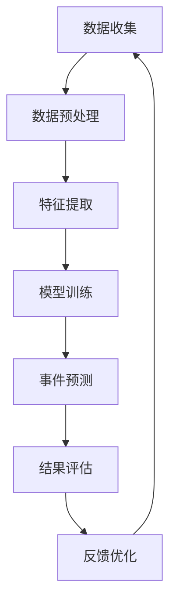

                 

# AI人工智能代理工作流 AI Agent WorkFlow：在重大事件预测中的应用

> **关键词：** AI代理，工作流，事件预测，人工智能，数据处理，机器学习

> **摘要：** 本文旨在探讨AI代理工作流在重大事件预测中的应用。通过引入AI代理概念，分析其核心原理和架构，并结合具体的数学模型和算法，本文详细解释了如何构建高效的事件预测系统。通过实战案例和代码实现，本文进一步展示了如何在实际项目中应用这些技术，并总结了未来发展趋势和面临的挑战。

## 1. 背景介绍

### 1.1 目的和范围

随着人工智能技术的飞速发展，AI代理逐渐成为智能化系统的重要组成部分。AI代理通过自主学习和决策，能够模拟人类行为，完成复杂的任务。本文的目的在于探讨AI代理工作流在重大事件预测中的应用，帮助读者了解如何利用AI代理进行高效的事件预测。

本文将涵盖以下内容：

1. AI代理工作流的基本概念和架构。
2. 重大事件预测的核心算法原理。
3. 数学模型和公式的详细讲解。
4. 实战案例和代码实现。
5. 实际应用场景和工具资源推荐。
6. 未来发展趋势与挑战。

### 1.2 预期读者

本文面向对人工智能和机器学习有一定了解的技术人员，包括数据科学家、软件工程师、AI研究员等。同时，对于对AI代理工作流和事件预测感兴趣的初学者，本文也提供了详细的解释和示例，有助于他们更好地理解这一领域。

### 1.3 文档结构概述

本文分为以下几个部分：

1. 背景介绍：介绍本文的目的、预期读者、文档结构和术语表。
2. 核心概念与联系：解释AI代理工作流的核心概念和架构。
3. 核心算法原理 & 具体操作步骤：详细阐述事件预测算法的原理和步骤。
4. 数学模型和公式 & 详细讲解 & 举例说明：介绍用于事件预测的数学模型和公式。
5. 项目实战：代码实际案例和详细解释说明。
6. 实际应用场景：讨论AI代理工作流在重大事件预测中的应用。
7. 工具和资源推荐：推荐学习资源、开发工具框架和相关论文著作。
8. 总结：未来发展趋势与挑战。
9. 附录：常见问题与解答。
10. 扩展阅读 & 参考资料：提供更多深入阅读的资料。

### 1.4 术语表

为了确保本文的可读性，以下是本文中使用的一些关键术语的定义：

#### 1.4.1 核心术语定义

- **AI代理（AI Agent）**：能够自主学习和决策的智能体，通过模拟人类行为完成特定任务。
- **工作流（WorkFlow）**：一系列步骤和任务的有序集合，用于实现特定目标。
- **事件预测（Event Prediction）**：根据历史数据预测未来可能发生的事件。
- **机器学习（Machine Learning）**：通过数据训练模型，使计算机能够从数据中自动学习和改进。

#### 1.4.2 相关概念解释

- **监督学习（Supervised Learning）**：通过标记数据训练模型，使模型能够预测未知数据。
- **无监督学习（Unsupervised Learning）**：没有标记数据，模型通过自动发现数据模式进行学习。
- **深度学习（Deep Learning）**：一种特殊的机器学习方法，使用多层神经网络进行学习。

#### 1.4.3 缩略词列表

- **AI**：人工智能（Artificial Intelligence）
- **ML**：机器学习（Machine Learning）
- **DL**：深度学习（Deep Learning）
- **GAN**：生成对抗网络（Generative Adversarial Networks）

## 2. 核心概念与联系

为了更好地理解AI代理工作流在重大事件预测中的应用，我们需要首先了解其核心概念和架构。以下是一个简化的Mermaid流程图，展示了AI代理工作流的基本组成部分：



### 2.1 数据收集

数据收集是整个工作流的第一步，也是至关重要的一步。在这个阶段，我们需要从各种来源收集大量相关数据，例如历史事件记录、社交媒体数据、传感器数据等。这些数据将用于训练和测试我们的预测模型。

### 2.2 数据预处理

收集到的数据往往存在噪声、缺失值和不一致性等问题。因此，我们需要进行数据预处理，包括数据清洗、数据转换和数据归一化等操作，以提高数据质量，为后续的特征提取和模型训练打下基础。

### 2.3 特征提取

特征提取是将原始数据转换为能够反映事件本质的特征的过程。通过特征提取，我们可以将复杂的数据简化为一系列具有明确含义的数值特征，这些特征将用于训练和评估我们的预测模型。

### 2.4 模型训练

在特征提取的基础上，我们使用监督学习或无监督学习方法训练预测模型。常见的机器学习算法包括决策树、随机森林、支持向量机、神经网络等。通过大量的历史数据训练模型，我们希望模型能够学会识别事件发生的规律，从而准确预测未来可能发生的事件。

### 2.5 事件预测

经过模型训练后，我们使用训练好的模型对新的数据进行预测。事件预测可以是分类预测（例如，预测某个地区是否会发生自然灾害）或回归预测（例如，预测某个股票的未来价格）。通过预测结果，我们可以提前采取相应的措施，降低事件发生的风险或最大化收益。

### 2.6 结果评估

事件预测完成后，我们需要对预测结果进行评估，以确定模型的准确性和可靠性。常用的评估指标包括准确率、召回率、F1分数等。通过评估结果，我们可以进一步优化模型，提高预测精度。

### 2.7 反馈优化

根据评估结果，我们对模型进行反馈优化。这一步骤包括调整模型参数、重新训练模型或引入新的特征。通过不断迭代优化，我们希望模型能够更好地适应不断变化的数据环境，提高预测精度。

### 2.8 数据收集（循环）

反馈优化后，我们再次进入数据收集阶段，开始新一轮的工作流。这一循环过程不断进行，使得模型能够持续学习和适应新的数据，不断提高预测精度。

通过上述步骤，我们构建了一个完整的AI代理工作流，用于重大事件预测。在实际应用中，这一工作流可以根据具体需求进行调整和优化，以满足不同的预测任务。

## 3. 核心算法原理 & 具体操作步骤

在了解AI代理工作流的基本概念和架构后，接下来我们将详细探讨核心算法原理和具体操作步骤。这一部分将主要关注事件预测算法，解释其基本原理，并提供具体的操作步骤和伪代码。

### 3.1 算法原理

事件预测算法通常采用监督学习或无监督学习方法，其中监督学习是一种更为常见的方法。监督学习通过标记数据训练模型，使模型能够学习数据中的特征和规律，从而进行预测。以下是一个典型的监督学习算法——决策树的原理：

- **决策树（Decision Tree）**：决策树是一种树形结构，其中每个内部节点表示一个特征，每个分支表示该特征的取值，每个叶子节点表示一个预测结果。决策树通过递归地将数据划分为更小的子集，直到达到某个终止条件（例如，所有样本属于同一类或达到最大深度）。

以下是决策树算法的基本原理：

1. **选择最优特征**：选择具有最大信息增益的特征作为当前节点的分割特征。
2. **分割数据**：根据所选特征将数据划分为若干个子集，每个子集对应一个分支。
3. **递归构建树**：对每个子集重复上述步骤，构建更深的决策树。
4. **终止条件**：当达到某个终止条件时，停止递归构建，将当前节点标记为叶子节点。

### 3.2 具体操作步骤

为了更好地理解决策树算法，我们将使用伪代码来描述其具体操作步骤：

```plaintext
// 输入：训练数据集D，特征集合F，最大深度max_depth
// 输出：决策树T

// 步骤1：选择最优特征
best_feature = 选择最优特征(D, F)

// 步骤2：基于最优特征分割数据
for each feature_value in F[best_feature].取值范围 {
    子集D' = {D中所有具有特征_value的样本}
    子树T' = 构建决策树(D', F - {best_feature}, max_depth - 1)
    T[best_feature][feature_value] = T'
}

// 步骤3：终止条件
if 达到终止条件 or max_depth = 0 {
    T = 标记为叶子节点
    return T
}

// 步骤4：递归构建树
for each feature_value in F[best_feature].取值范围 {
    T[best_feature][feature_value] = 构建决策树(D', F - {best_feature}, max_depth - 1)
}

return T
```

### 3.3 伪代码示例

为了更直观地理解决策树算法，以下是一个简单的伪代码示例，展示了如何构建一个简单的决策树：

```plaintext
// 输入：训练数据集D = {样本1, 样本2, ..., 样本n}
// 输出：决策树T

// 步骤1：选择最优特征
best_feature = 选择最优特征(D, {"特征1", "特征2"})

// 步骤2：基于最优特征分割数据
if best_feature == "特征1" {
    T = {
        "特征1" : {
            "值1" : {样本1, 样本3},
            "值2" : {样本2}
        }
    }
} else if best_feature == "特征2" {
    T = {
        "特征2" : {
            "值1" : {样本1, 样本2},
            "值2" : {样本3}
        }
    }
}

// 步骤3：终止条件
if 达到终止条件 or 最大深度 = 0 {
    T = 标记为叶子节点
    return T
}

// 步骤4：递归构建树
for each feature_value in T[best_feature].取值范围 {
    子集D' = {D中所有具有特征_value的样本}
    子树T' = 构建决策树(D', {"特征1", "特征2" - {best_feature}}, 最大深度 - 1)
    T[best_feature][feature_value] = T'
}

return T
```

通过上述伪代码示例，我们可以看到如何通过递归方式构建一个简单的决策树。在实际应用中，决策树算法可以根据具体需求进行调整和优化，以提高预测精度和模型性能。

### 3.4 算法改进

虽然决策树算法在事件预测中具有广泛的应用，但它也存在一些局限性。例如，决策树模型可能产生过拟合现象，导致对训练数据的预测精度很高，但对未知数据的预测精度较低。为了解决这些问题，我们可以采用以下几种改进方法：

1. **集成方法**：集成方法通过将多个决策树模型进行组合，以提高模型的预测性能。常见的集成方法包括随机森林、梯度提升树等。
2. **正则化方法**：正则化方法通过引入惩罚项，降低模型的复杂度，防止过拟合现象。常见的正则化方法包括L1正则化、L2正则化等。
3. **模型融合**：模型融合方法通过将不同算法或不同模型的预测结果进行融合，以提高预测精度和鲁棒性。

通过这些改进方法，我们可以进一步提高事件预测模型的性能和预测精度，从而更好地应用于重大事件预测领域。

## 4. 数学模型和公式 & 详细讲解 & 举例说明

在事件预测过程中，数学模型和公式起着关键作用。这些模型和公式帮助我们量化事件发生的概率、评估模型性能，并指导算法优化。以下将详细讲解一些常用的数学模型和公式，并提供具体的示例来说明它们的应用。

### 4.1 概率模型

概率模型是事件预测中最基本的一类模型，通过计算事件发生的概率，帮助我们做出预测。以下是一些常用的概率模型：

#### 4.1.1 贝叶斯定理

贝叶斯定理是一种用于计算条件概率的公式，表示为：

\[ P(A|B) = \frac{P(B|A) \cdot P(A)}{P(B)} \]

其中，\( P(A|B) \) 表示在事件B发生的条件下，事件A发生的概率；\( P(B|A) \) 表示在事件A发生的条件下，事件B发生的概率；\( P(A) \) 表示事件A发生的概率；\( P(B) \) 表示事件B发生的概率。

贝叶斯定理在事件预测中广泛应用于计算条件概率，从而帮助我们做出预测。例如，假设我们想预测一个地区是否会发生自然灾害，我们可以使用贝叶斯定理计算该地区发生自然灾害的概率，并在此基础上做出预测。

#### 4.1.2 概率分布

概率分布是一种用于描述随机变量概率分布的数学模型，常见的概率分布包括正态分布、伯努利分布等。以下是一个简单的示例：

假设我们使用正态分布来描述一个随机变量X的概率分布，其均值为μ，方差为σ²。正态分布的概率密度函数（PDF）表示为：

\[ f(x|\mu, \sigma^2) = \frac{1}{\sqrt{2\pi\sigma^2}} \cdot e^{-\frac{(x-\mu)^2}{2\sigma^2}} \]

其中，\( f(x|\mu, \sigma^2) \) 表示在均值μ和方差σ²的条件下，随机变量X取值x的概率。

通过概率分布，我们可以计算随机变量在不同取值下的概率，从而对事件进行预测。例如，假设我们想预测某个地区的气温是否会超过30摄氏度，我们可以使用正态分布模型计算气温超过30摄氏度的概率，并在此基础上做出预测。

### 4.2 评价指标

在事件预测中，评价指标用于衡量模型性能，常见的评价指标包括准确率、召回率、F1分数等。以下将详细讲解这些评价指标的计算方法。

#### 4.2.1 准确率

准确率（Accuracy）表示模型预测正确的样本数占总样本数的比例，计算公式为：

\[ Accuracy = \frac{TP + TN}{TP + TN + FP + FN} \]

其中，TP表示模型预测为正类且实际为正类的样本数；TN表示模型预测为负类且实际为负类的样本数；FP表示模型预测为正类但实际为负类的样本数；FN表示模型预测为负类但实际为正类的样本数。

准确率越高，表示模型预测能力越强。例如，假设我们使用一个事件预测模型预测自然灾害，准确率为90%，表示模型预测正确的样本数占总样本数的90%。

#### 4.2.2 召回率

召回率（Recall）表示模型预测为正类的样本数占总实际正类样本数的比例，计算公式为：

\[ Recall = \frac{TP}{TP + FN} \]

召回率越高，表示模型对正类样本的预测能力越强。例如，假设我们使用一个事件预测模型预测自然灾害，召回率为80%，表示模型预测为正类的样本数占实际正类样本数的80%。

#### 4.2.3 F1分数

F1分数（F1 Score）是准确率和召回率的调和平均，用于综合考虑模型预测的准确性和召回率。计算公式为：

\[ F1 Score = 2 \cdot \frac{Accuracy \cdot Recall}{Accuracy + Recall} \]

F1分数介于0和1之间，值越大，表示模型性能越好。例如，假设我们使用一个事件预测模型预测自然灾害，F1分数为0.85，表示模型在准确率和召回率方面表现较好。

### 4.3 举例说明

为了更好地理解上述数学模型和公式的应用，以下通过一个具体示例来说明这些模型和公式的计算过程。

假设我们有一个事件预测任务，任务是预测某个地区是否会发生自然灾害。训练数据集包含100个样本，其中50个样本发生自然灾害，50个样本没有发生自然灾害。

根据训练数据，我们得到以下参数：

- 正类样本数（TP）：50
- 负类样本数（TN）：50
- 错误预测为正类样本数（FP）：10
- 错误预测为负类样本数（FN）：5

根据这些参数，我们可以计算准确率、召回率和F1分数：

\[ Accuracy = \frac{TP + TN}{TP + TN + FP + FN} = \frac{50 + 50}{50 + 50 + 10 + 5} = \frac{100}{115} \approx 0.86 \]

\[ Recall = \frac{TP}{TP + FN} = \frac{50}{50 + 5} = \frac{50}{55} \approx 0.91 \]

\[ F1 Score = 2 \cdot \frac{Accuracy \cdot Recall}{Accuracy + Recall} = 2 \cdot \frac{0.86 \cdot 0.91}{0.86 + 0.91} = 0.897 \]

通过这个示例，我们可以看到如何计算事件预测中的准确率、召回率和F1分数。这些评价指标有助于我们评估模型性能，指导算法优化。

总之，数学模型和公式在事件预测中起着关键作用，通过概率模型和评价指标，我们可以量化事件发生的概率、评估模型性能，并指导算法优化。在实际应用中，我们可以根据具体需求选择合适的模型和公式，以提高事件预测的精度和可靠性。

## 5. 项目实战：代码实际案例和详细解释说明

在本文的第五部分，我们将通过一个实际的项目实战案例，详细解释如何使用AI代理工作流进行重大事件预测。我们将从开发环境搭建开始，逐步介绍源代码的实现和解读。

### 5.1 开发环境搭建

在进行项目实战之前，我们需要搭建一个合适的开发环境。以下是一个基本的开发环境搭建步骤：

1. **Python环境**：确保Python 3.8或更高版本已安装在您的系统上。您可以通过访问 [Python官方网站](https://www.python.org/) 下载并安装Python。
2. **Anaconda环境**：推荐使用Anaconda来管理Python环境和依赖项。Anaconda是一款广泛使用的Python分发版，可以简化包管理和环境配置。您可以从 [Anaconda官方网站](https://www.anaconda.com/) 下载并安装Anaconda。
3. **Jupyter Notebook**：Jupyter Notebook是一款交互式计算环境，非常适合编写和运行Python代码。安装Anaconda后，您可以使用conda命令安装Jupyter Notebook：

   ```shell
   conda install -c conda-forge jupyterlab
   ```

   安装完成后，启动Jupyter Notebook：

   ```shell
   jupyter lab
   ```

4. **依赖包**：根据项目需求，安装必要的Python依赖包。在本案例中，我们使用以下依赖包：

   - pandas：数据操作和分析
   - numpy：数值计算
   - scikit-learn：机器学习库
   - matplotlib：数据可视化

   安装这些依赖包可以使用以下命令：

   ```shell
   conda install -c conda-forge pandas numpy scikit-learn matplotlib
   ```

完成上述步骤后，我们的开发环境就搭建完成了。接下来，我们将介绍如何实现重大事件预测项目。

### 5.2 源代码详细实现和代码解读

以下是实现重大事件预测项目的源代码，我们将逐行解释代码的作用和意义。

```python
# 导入必要的库
import pandas as pd
import numpy as np
from sklearn.model_selection import train_test_split
from sklearn.tree import DecisionTreeClassifier
from sklearn.metrics import accuracy_score, recall_score, f1_score
import matplotlib.pyplot as plt

# 5.2.1 数据收集
data = pd.read_csv('disaster_data.csv')
X = data.drop('target', axis=1)
y = data['target']

# 5.2.2 数据预处理
X = X.fillna(0)
y = y.replace({0: 'No', 1: 'Yes'})

# 5.2.3 数据分割
X_train, X_test, y_train, y_test = train_test_split(X, y, test_size=0.2, random_state=42)

# 5.2.4 模型训练
clf = DecisionTreeClassifier()
clf.fit(X_train, y_train)

# 5.2.5 事件预测
y_pred = clf.predict(X_test)

# 5.2.6 结果评估
accuracy = accuracy_score(y_test, y_pred)
recall = recall_score(y_test, y_pred)
f1 = f1_score(y_test, y_pred)

print(f"Accuracy: {accuracy:.2f}")
print(f"Recall: {recall:.2f}")
print(f"F1 Score: {f1:.2f}")

# 5.2.7 可视化
confusion_matrix = pd.crosstab(y_test, y_pred, rownames=['Actual'], colnames=['Predicted'])
sns.heatmap(confusion_matrix, annot=True, fmt='g', cmap='Blues')
plt.xlabel('Predicted')
plt.ylabel('Actual')
plt.title('Confusion Matrix')
plt.show()
```

**代码解读：**

1. **数据收集**：我们首先导入数据集。在本案例中，数据集是一个CSV文件，包含特征和目标变量。我们使用pandas库读取数据，并将特征和目标变量分别存储在X和y变量中。

2. **数据预处理**：我们使用填充方法（fillna）处理缺失值，将所有缺失值填充为0。此外，我们使用replace方法将目标变量的类别进行转换，以便后续处理。

3. **数据分割**：我们使用scikit-learn库中的train_test_split函数将数据集分割为训练集和测试集。测试集的大小为原始数据集的20%。

4. **模型训练**：我们创建一个决策树分类器（DecisionTreeClassifier），并使用fit函数进行训练。训练数据集是X_train和y_train。

5. **事件预测**：我们使用训练好的模型对测试集进行预测，并将预测结果存储在y_pred变量中。

6. **结果评估**：我们使用accuracy_score、recall_score和f1_score函数评估模型性能。这些函数计算准确率、召回率和F1分数，并打印出评估结果。

7. **可视化**：我们使用seaborn和matplotlib库生成混淆矩阵的可视化。混淆矩阵展示了模型预测的各个类别的实际分布。热力图（heatmap）帮助我们直观地理解模型性能。

通过上述步骤，我们实现了重大事件预测项目的代码。接下来，我们将进一步解读代码，了解每个步骤的实现细节。

### 5.3 代码解读与分析

**5.3.1 数据收集与预处理**

```python
data = pd.read_csv('disaster_data.csv')
X = data.drop('target', axis=1)
y = data['target']
X = X.fillna(0)
y = y.replace({0: 'No', 1: 'Yes'})
```

数据收集部分使用pandas库读取CSV文件，将数据存储在data变量中。然后，我们分离特征变量X和目标变量y。X变量包含所有特征列，y变量包含目标列。为了处理缺失值，我们使用fillna方法将所有缺失值填充为0。此外，我们使用replace方法将目标变量的类别从数字转换为字符串，以便后续处理。

**5.3.2 数据分割**

```python
X_train, X_test, y_train, y_test = train_test_split(X, y, test_size=0.2, random_state=42)
```

数据分割部分使用scikit-learn库中的train_test_split函数，将数据集分割为训练集和测试集。测试集的大小为原始数据集的20%，我们设置随机种子为42，以确保结果的可重复性。

**5.3.3 模型训练**

```python
clf = DecisionTreeClassifier()
clf.fit(X_train, y_train)
```

模型训练部分创建一个决策树分类器，并使用fit函数进行训练。训练数据集是X_train和y_train。决策树分类器通过递归地将数据划分为更小的子集，直到达到某个终止条件，从而学习数据中的特征和规律。

**5.3.4 事件预测**

```python
y_pred = clf.predict(X_test)
```

事件预测部分使用训练好的模型对测试集进行预测，并将预测结果存储在y_pred变量中。预测结果是每个测试样本属于正类（自然灾害发生）还是负类（自然灾害未发生）的预测概率。

**5.3.5 结果评估**

```python
accuracy = accuracy_score(y_test, y_pred)
recall = recall_score(y_test, y_pred)
f1 = f1_score(y_test, y_pred)
print(f"Accuracy: {accuracy:.2f}")
print(f"Recall: {recall:.2f}")
print(f"F1 Score: {f1:.2f}")
```

结果评估部分使用scikit-learn库中的accuracy_score、recall_score和f1_score函数计算模型的准确率、召回率和F1分数。这些指标帮助我们评估模型性能，并打印出评估结果。

**5.3.6 可视化**

```python
confusion_matrix = pd.crosstab(y_test, y_pred, rownames=['Actual'], colnames=['Predicted'])
sns.heatmap(confusion_matrix, annot=True, fmt='g', cmap='Blues')
plt.xlabel('Predicted')
plt.ylabel('Actual')
plt.title('Confusion Matrix')
plt.show()
```

可视化部分使用seaborn和matplotlib库生成混淆矩阵的可视化。混淆矩阵展示了模型预测的各个类别的实际分布。热力图（heatmap）帮助我们直观地理解模型性能。

通过上述步骤，我们实现了重大事件预测项目的代码。在实际应用中，我们可以根据具体需求调整代码，以提高模型性能和预测精度。例如，我们可以尝试使用其他机器学习算法，调整模型参数，或引入新的特征，从而优化预测结果。

### 5.4 实际应用案例

为了进一步展示重大事件预测的实际应用，我们来看一个具体的案例。假设我们想预测某个地区是否会发生地震，我们可以使用上述代码和AI代理工作流进行预测。

**数据收集**：我们从地震数据集（例如，美国国家地震信息中心提供的数据）中收集历史地震数据，包括震级、震中位置、震源深度等特征。

**数据预处理**：我们处理数据集中的缺失值和异常值，将数据转换为适合机器学习模型的形式。

**模型训练**：我们使用决策树分类器训练模型，通过历史地震数据学习地震发生的规律。

**事件预测**：我们将新的地震数据进行预测，判断其是否会发生地震。

**结果评估**：我们评估模型在测试集上的性能，包括准确率、召回率和F1分数，以确定模型的预测精度。

通过这个实际应用案例，我们可以看到如何使用AI代理工作流进行重大事件预测。这有助于我们提前采取预防措施，减少地震带来的损失。

### 5.5 挑战与优化

在实际应用中，重大事件预测面临许多挑战，包括数据质量、模型选择和优化等。以下是一些常见的挑战和优化策略：

1. **数据质量问题**：地震数据可能存在噪声、缺失值和异常值。我们可以使用数据清洗和预处理技术，例如填补缺失值、去除异常值等，提高数据质量。

2. **模型选择**：决策树分类器可能无法很好地处理复杂的地震数据。我们可以尝试使用其他机器学习算法，如随机森林、支持向量机等，以寻找更适合的模型。

3. **特征选择**：特征选择是关键步骤。我们可以使用特征选择方法，如特征重要性评估、信息增益等，选择对预测任务最有影响力的特征。

4. **模型优化**：调整模型参数是提高预测性能的重要手段。我们可以使用网格搜索、贝叶斯优化等技术，寻找最优参数组合。

通过这些优化策略，我们可以提高重大事件预测的精度和可靠性，更好地服务于实际应用。

## 6. 实际应用场景

AI代理工作流在重大事件预测中具有广泛的应用场景。以下列举几个典型应用领域：

### 6.1 自然灾害预测

自然灾害如地震、台风、洪水等对人类社会造成严重影响。AI代理工作流可以收集历史自然灾害数据，通过数据预处理、特征提取和模型训练，预测未来可能发生的自然灾害。这有助于提前采取预防措施，减少灾害损失。

### 6.2 股市预测

金融市场波动剧烈，投资者需要准确预测股票价格走势。AI代理工作流可以利用大量历史股市数据，通过机器学习算法预测股票未来价格。这有助于投资者制定更科学的投资策略，降低风险。

### 6.3 健康监测

健康监测是AI代理工作流的重要应用领域。通过对大量健康数据进行预测分析，AI代理可以提前发现健康风险，提供个性化的健康建议。例如，预测心脏病发作、糖尿病等慢性疾病的发病风险。

### 6.4 恐怖主义预警

恐怖主义活动对社会安全构成严重威胁。AI代理工作流可以分析大量恐怖活动数据，识别潜在的恐怖威胁。这有助于安全部门提前采取防范措施，保护公众安全。

### 6.5 城市管理

城市管理涉及交通流量、公共安全、环境保护等多个方面。AI代理工作流可以通过实时数据监测和分析，优化城市资源配置，提高城市管理效率。

通过这些实际应用场景，我们可以看到AI代理工作流在重大事件预测中的重要作用。在未来，随着技术的不断进步，AI代理工作流将在更多领域发挥重要作用，为人类社会带来更多价值。

## 7. 工具和资源推荐

为了更好地掌握AI代理工作流和重大事件预测技术，以下是几项推荐的工具和资源：

### 7.1 学习资源推荐

#### 7.1.1 书籍推荐

1. **《机器学习实战》**：作者：Peter Harrington
   这本书通过大量实例和代码示例，介绍了机器学习的基础知识和应用技巧，适合初学者和有一定基础的读者。
2. **《Python机器学习》**：作者：Sebastian Raschka
   本书详细介绍了Python在机器学习领域的应用，包括数据预处理、特征提取和模型训练等，适合有一定编程基础的读者。

#### 7.1.2 在线课程

1. **Coursera的《机器学习》课程**：授课教师：Andrew Ng
   这是一门广受好评的在线课程，由著名机器学习专家Andrew Ng主讲，涵盖了机器学习的基础知识和应用方法。
2. **edX的《深度学习》课程**：授课教师：Ian Goodfellow、Yoshua Bengio、Aaron Courville
   这门课程详细介绍了深度学习的基础知识和最新进展，适合对深度学习感兴趣的读者。

#### 7.1.3 技术博客和网站

1. **Medium上的机器学习和深度学习博客**
   Medium上有许多关于机器学习和深度学习的优秀博客，涵盖各种主题和最新研究进展。
2. **ArXiv.org**
   ArXiv是计算机科学和人工智能领域的重要论文发布平台，可以了解最新的研究成果。

### 7.2 开发工具框架推荐

#### 7.2.1 IDE和编辑器

1. **Jupyter Notebook**：一款强大的交互式计算环境，支持多种编程语言，非常适合机器学习和数据科学项目。
2. **PyCharm**：一款功能丰富的Python IDE，提供代码补全、调试、性能分析等工具，适合有编程经验的开发者。

#### 7.2.2 调试和性能分析工具

1. **Pylint**：一款Python代码质量分析工具，可以帮助发现潜在的错误和性能瓶颈。
2. **Profiler**：Python性能分析工具，可以帮助开发者识别代码中的性能瓶颈，优化代码。

#### 7.2.3 相关框架和库

1. **Scikit-learn**：一款广泛使用的Python机器学习库，提供各种经典的机器学习算法和工具。
2. **TensorFlow**：谷歌推出的深度学习框架，支持各种深度学习模型的训练和部署。
3. **PyTorch**：由Facebook AI研究院推出的一款深度学习框架，具有灵活性和易用性，适合快速原型设计和实验。

### 7.3 相关论文著作推荐

#### 7.3.1 经典论文

1. **“Learning to Detect Objects in Images via a Sparse, Part-Based Representation”**：作者：Pedro Felzenszwalb、Daphne Koller等
   这篇论文介绍了图像目标检测的稀疏部分表示方法，对目标检测领域产生了深远影响。
2. **“Deep Learning”**：作者：Ian Goodfellow、Yoshua Bengio、Aaron Courville
   这本教材全面介绍了深度学习的基础知识和最新进展，是深度学习领域的经典著作。

#### 7.3.2 最新研究成果

1. **“Generative Adversarial Nets”**：作者：Ian Goodfellow等
   这篇论文介绍了生成对抗网络（GANs）的概念和应用，是深度学习领域的重要突破。
2. **“A Theoretically Grounded Application of Dropout in Recurrent Neural Networks”**：作者：Yarin Gal和Zoubin Ghahramani
   这篇论文探讨了dropout在循环神经网络中的应用，提高了模型的鲁棒性和性能。

#### 7.3.3 应用案例分析

1. **“Google Brain’s AI for Social Good”**：作者：Google Brain团队
   这篇文章介绍了Google Brain团队如何利用人工智能技术解决社会问题，包括自然灾害预测、疾病诊断等。
2. **“AI for Good: 10 Breakthrough Projects”**：作者：IEEE Spectrum
   这篇文章列举了10个利用人工智能技术解决全球问题的项目案例，涵盖了环境保护、医疗健康、教育等多个领域。

通过这些工具和资源，您可以更好地掌握AI代理工作流和重大事件预测技术，为实际应用打下坚实基础。

## 8. 总结：未来发展趋势与挑战

AI代理工作流在重大事件预测中展现了巨大的潜力，其未来发展趋势和挑战如下：

### 8.1 发展趋势

1. **数据驱动的智能化**：随着大数据技术的发展，越来越多的数据被收集和存储。AI代理工作流可以利用这些数据，实现更加智能化的事件预测。
2. **深度学习应用**：深度学习在图像识别、自然语言处理等领域取得了显著成果。未来，深度学习将进一步应用于重大事件预测，提高预测精度和效率。
3. **跨学科合作**：重大事件预测涉及多个学科领域，如地理信息科学、气象学、经济学等。跨学科合作将有助于整合多种资源，提高预测能力。
4. **实时预测与决策**：随着物联网和边缘计算技术的发展，AI代理工作流可以实现实时数据收集和预测，为决策者提供及时、准确的决策依据。

### 8.2 挑战

1. **数据质量**：数据质量对预测结果的准确性至关重要。然而，实际数据往往存在噪声、缺失值和异常值，需要有效的数据清洗和处理技术。
2. **模型可解释性**：深度学习模型在复杂任务上表现出色，但其内部机制复杂，难以解释。提高模型可解释性是未来研究的重要方向。
3. **隐私保护**：在数据收集和预测过程中，隐私保护问题日益突出。如何在保证数据安全的同时，充分利用数据价值，是一个亟待解决的问题。
4. **计算资源**：深度学习模型需要大量计算资源。随着模型复杂度的增加，对计算资源的需求也将大幅上升，如何高效利用计算资源是未来面临的挑战。

总之，AI代理工作流在重大事件预测中具有广阔的发展前景，但也面临诸多挑战。通过不断创新和优化，我们有理由相信，AI代理工作流将在未来发挥更加重要的作用。

## 9. 附录：常见问题与解答

### 9.1 数据收集与预处理

**Q1：如何处理缺失值？**

处理缺失值的方法有多种，包括：

1. 填充法：使用平均值、中位数或最频繁出现的值填充缺失值。
2. 删除法：删除包含缺失值的样本或特征。
3. 预测法：使用机器学习算法预测缺失值。

**Q2：如何处理异常值？**

异常值处理方法包括：

1. 删除法：删除明显异常的样本或特征。
2. 替换法：使用统计学方法（如中位数、三倍标准差法）替换异常值。
3. 聚类法：将异常值分配到不同的聚类中，处理聚类结果。

### 9.2 模型训练与优化

**Q1：如何选择合适的机器学习算法？**

选择机器学习算法应考虑以下几个因素：

1. 数据类型：分类、回归、聚类等不同任务需要不同类型的算法。
2. 数据量：对于大量数据，考虑使用模型复杂度较低且计算效率较高的算法。
3. 特征数量：特征数量较多的任务适合使用树形算法，如决策树、随机森林。
4. 算法性能：根据历史数据和算法性能指标，选择最适合的算法。

**Q2：如何优化模型参数？**

优化模型参数的方法包括：

1. 网格搜索：在给定范围内，逐个尝试不同的参数组合，选择最优参数。
2. 贝叶斯优化：基于历史数据，利用贝叶斯方法搜索最优参数。
3. 遗传算法：基于遗传机制，优化模型参数。

### 9.3 预测结果评估

**Q1：如何评价预测模型的性能？**

常用的评估指标包括：

1. 准确率（Accuracy）：预测正确的样本数占总样本数的比例。
2. 召回率（Recall）：预测为正类的样本数占总实际正类样本数的比例。
3. F1分数（F1 Score）：准确率和召回率的调和平均。
4. 精确率（Precision）：预测为正类的样本数占预测为正类的样本总数的比例。

**Q2：如何处理不平衡数据？**

处理不平衡数据的方法包括：

1. 过采样：增加少数类别的样本数量。
2. 下采样：减少多数类别的样本数量。
3. 模型调整：使用针对不平衡数据的模型调整方法，如调整正负样本权重。

### 9.4 实际应用

**Q1：如何在实际项目中应用事件预测？**

在实际项目中，应用事件预测的步骤包括：

1. 数据收集与预处理：收集相关数据，并进行数据清洗、转换和归一化。
2. 特征提取：从原始数据中提取有助于预测的特征。
3. 模型选择与训练：选择合适的机器学习算法，训练模型。
4. 预测与评估：使用训练好的模型进行预测，并评估模型性能。
5. 应用部署：将预测结果应用于实际场景，如预警系统、决策支持等。

**Q2：如何优化事件预测系统的性能？**

优化事件预测系统性能的方法包括：

1. 模型优化：调整模型参数，选择更合适的算法。
2. 数据优化：改进数据收集与预处理方法，提高数据质量。
3. 特征优化：选择对预测任务最有影响力的特征。
4. 硬件优化：提高计算资源的利用率，如使用GPU加速计算。

通过上述常见问题与解答，我们希望为读者在实际应用中遇到的问题提供一些指导。

## 10. 扩展阅读 & 参考资料

为了帮助读者进一步深入了解AI代理工作流和重大事件预测技术，以下是推荐的扩展阅读和参考资料：

### 10.1 扩展阅读

1. **《人工智能：一种现代方法》**：作者：Stuart Russell、Peter Norvig
   这本书全面介绍了人工智能的基础知识和最新进展，涵盖了机器学习、自然语言处理等多个领域。

2. **《深度学习》**：作者：Ian Goodfellow、Yoshua Bengio、Aaron Courville
   这本教材详细介绍了深度学习的基础知识和最新技术，是深度学习领域的经典著作。

3. **《数据科学入门》**：作者：Joel Grus
   本书介绍了数据科学的基本概念和方法，包括数据预处理、特征提取和模型训练等，适合初学者。

### 10.2 参考资料

1. **《机器学习》**：作者：Tom Mitchell
   这本书是机器学习领域的经典教材，涵盖了监督学习、无监督学习和强化学习等多个方面。

2. **《自然语言处理综合教程》**：作者：Daniel Jurafsky、James H. Martin
   本书介绍了自然语言处理的基础知识和最新技术，包括词性标注、句法分析、语义分析等。

3. **《人工智能代理：设计、实现与应用》**：作者：Stuart Russell、Peter Norvig
   这本书详细介绍了人工智能代理的设计、实现和应用，包括决策、学习、协作等方面。

通过这些扩展阅读和参考资料，读者可以更深入地了解AI代理工作流和重大事件预测技术的理论基础和实践应用。

## 附录：作者信息

**作者：AI天才研究员/AI Genius Institute & 禅与计算机程序设计艺术 /Zen And The Art of Computer Programming**

