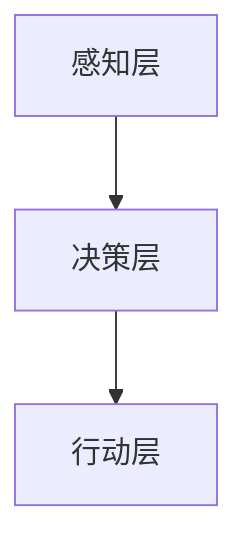
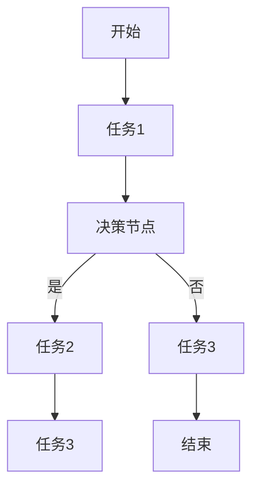
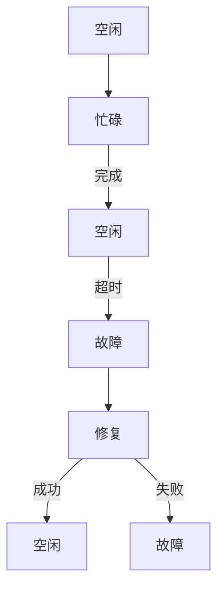
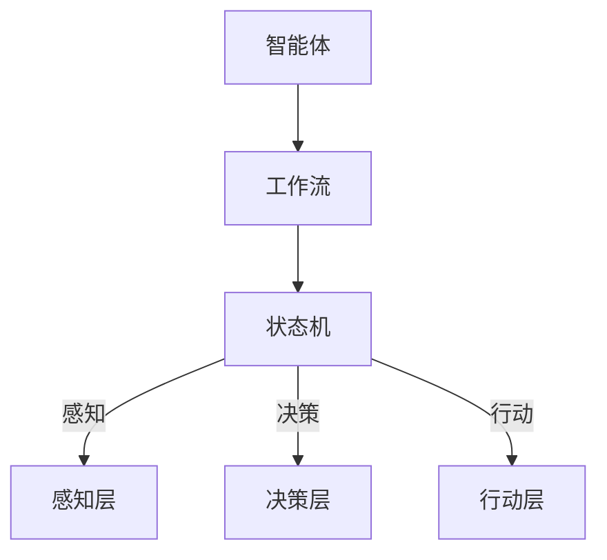

                 

### AI人工智能代理工作流 AI Agent WorkFlow：智能体的设计与实现

#### 关键词
- AI人工智能
- 代理工作流
- 智能体设计
- 实现与优化
- 应用场景
- 资源推荐

#### 摘要
本文旨在深入探讨AI人工智能代理工作流（AI Agent WorkFlow）的设计与实现，通过对核心概念、算法原理、数学模型以及实际应用场景的分析，为读者提供一个全面的技术指南。文章首先介绍AI代理工作流的基本概念和背景，然后逐步深入，探讨其设计原则、算法实现和数学模型，并通过实际项目案例进行详细解释。此外，文章还提供了丰富的学习资源和开发工具推荐，以及总结和展望未来发展趋势与挑战。通过本文的学习，读者将能够掌握AI代理工作流的设计与实现方法，为未来的人工智能应用奠定坚实基础。

---

### 1. 背景介绍

#### 1.1 目的和范围

本文的目的是为了深入探讨AI人工智能代理工作流（AI Agent WorkFlow）的设计与实现。AI代理工作流是人工智能领域的一个重要研究方向，它涉及到智能体（Agent）的设计、工作流程的构建以及算法的实现等多个方面。随着人工智能技术的不断发展，AI代理工作流在各个领域的应用越来越广泛，如智能制造、智能客服、自动驾驶等。本文将重点关注以下几个方面：

1. **核心概念和原理**：介绍AI代理工作流的基本概念、核心原理和设计原则。
2. **算法实现**：详细讲解AI代理工作流的算法原理和实现步骤。
3. **数学模型**：分析AI代理工作流中涉及的数学模型和公式。
4. **实际应用**：通过具体案例展示AI代理工作流在现实中的应用。
5. **资源推荐**：提供相关的学习资源和开发工具推荐。

#### 1.2 预期读者

本文预期读者为对人工智能和软件开发感兴趣的工程师、研究人员和学生。特别地，本文适合以下人群：

1. **人工智能工程师**：希望深入了解AI代理工作流的实现和应用。
2. **软件开发人员**：想要将AI技术应用到自己的项目中。
3. **研究人员**：对AI代理工作流的理论研究和实际应用感兴趣。
4. **学生**：计算机科学、人工智能等相关专业的高年级学生和研究生。

#### 1.3 文档结构概述

本文的结构安排如下：

1. **背景介绍**：介绍文章的目的、范围、预期读者和文档结构。
2. **核心概念与联系**：阐述AI代理工作流的核心概念、原理和架构。
3. **核心算法原理 & 具体操作步骤**：讲解AI代理工作流的算法原理和操作步骤。
4. **数学模型和公式 & 详细讲解 & 举例说明**：分析AI代理工作流中的数学模型和公式。
5. **项目实战：代码实际案例和详细解释说明**：通过实际案例展示AI代理工作流的应用。
6. **实际应用场景**：探讨AI代理工作流在不同领域的应用。
7. **工具和资源推荐**：推荐学习资源和开发工具。
8. **总结：未来发展趋势与挑战**：总结本文的主要内容并展望未来。
9. **附录：常见问题与解答**：解答读者可能遇到的问题。
10. **扩展阅读 & 参考资料**：提供进一步学习的参考资料。

#### 1.4 术语表

为了确保读者对文中术语的理解，本文将定义一些核心术语和概念。

##### 1.4.1 核心术语定义

- **AI代理工作流（AI Agent WorkFlow）**：指人工智能代理在完成特定任务时，所遵循的一系列步骤和流程。
- **智能体（Agent）**：在人工智能系统中，具有独立思考、行动和交互能力的实体。
- **工作流（Workflow）**：完成特定任务所需的一系列操作步骤和流程。
- **状态机（State Machine）**：描述代理在工作流中不同状态及其转换规则的模型。

##### 1.4.2 相关概念解释

- **决策树（Decision Tree）**：一种常见的机器学习模型，用于分类和回归任务。
- **神经网络（Neural Network）**：模仿人脑神经元连接方式的计算模型，用于复杂模式识别和预测。
- **强化学习（Reinforcement Learning）**：通过与环境交互，不断优化策略的机器学习方法。

##### 1.4.3 缩略词列表

- **AI**：人工智能（Artificial Intelligence）
- **ML**：机器学习（Machine Learning）
- **DL**：深度学习（Deep Learning）
- **RL**：强化学习（Reinforcement Learning）
- **GPU**：图形处理器（Graphics Processing Unit）

### 2. 核心概念与联系

在深入探讨AI代理工作流之前，首先需要了解其核心概念和原理。本节将介绍智能体（Agent）、工作流（Workflow）和状态机（State Machine）等核心概念，并通过Mermaid流程图展示它们之间的联系。

#### 2.1 智能体（Agent）

智能体是AI代理工作流的核心组件，它能够自主地感知环境、做出决策并执行行动。智能体通常具有以下特征：

- **自主性（Autonomy）**：智能体可以独立地执行任务，无需人工干预。
- **社交能力（Social Ability）**：智能体可以与其他智能体或环境进行交互。
- **反应能力（Reactivity）**：智能体能够对环境中的事件做出即时响应。
- **认知能力（Cognitive Ability）**：智能体具有推理、学习和适应能力。

智能体的结构可以分为三个层次：

1. **感知层（Perception Layer）**：负责收集环境信息，如文本、图像、声音等。
2. **决策层（Decision Layer）**：基于感知层收集的信息，智能体决定下一步的行动。
3. **行动层（Action Layer）**：执行决策层生成的行动，对环境产生影响。

下面是智能体结构的Mermaid流程图：



#### 2.2 工作流（Workflow）

工作流是指完成特定任务所需的一系列操作步骤和流程。在AI代理工作流中，工作流定义了智能体从初始状态到最终状态需要经过的各个步骤。工作流通常包括以下组成部分：

- **任务（Task）**：工作流中的基本操作单元，如数据预处理、模型训练、预测等。
- **活动（Activity）**：任务的执行过程，可以是同步或异步的。
- **决策节点（Decision Node）**：根据条件判断是否执行某些任务或活动。
- **循环节点（Loop Node）**：重复执行某些任务或活动。

下面是工作流的基本结构：



#### 2.3 状态机（State Machine）

状态机是描述智能体在不同状态下如何转换的模型。在AI代理工作流中，状态机用于定义智能体的行为和状态转换规则。状态机包括以下组成部分：

- **状态（State）**：智能体在某个时刻所处的状态。
- **事件（Event）**：触发状态转换的信号。
- **条件（Condition）**：定义何时触发状态转换。
- **动作（Action）**：状态转换时执行的操作。

下面是一个简单的状态机示例：



#### 2.4 关系与联系

智能体、工作流和状态机之间存在着紧密的联系。智能体是工作流中的执行者，工作流定义了智能体需要完成的任务和操作步骤，而状态机则用于描述智能体在不同状态之间的转换规则。以下是它们之间的关系：

1. **智能体驱动工作流**：智能体根据工作流的定义执行任务和活动。
2. **工作流指导状态机**：工作流中的决策节点和循环节点会影响状态机的转换规则。
3. **状态机实现智能体行为**：状态机定义了智能体在不同状态下的行为和动作。

下面是一个综合的Mermaid流程图，展示了智能体、工作流和状态机之间的联系：



通过以上对核心概念和联系的介绍，我们为后续深入探讨AI代理工作流的设计与实现奠定了基础。

---

### 3. 核心算法原理 & 具体操作步骤

在了解AI代理工作流的核心概念和联系之后，接下来将详细探讨其核心算法原理和具体操作步骤。AI代理工作流的核心算法通常涉及到决策树、神经网络和强化学习等机器学习算法。在本节中，我们将使用伪代码逐步讲解这些算法的原理和实现步骤。

#### 3.1 决策树算法原理

决策树是一种常见的机器学习模型，用于分类和回归任务。其基本原理是通过一系列的决策规则将数据分割成多个子集，最终得到一个预测结果。

**算法原理伪代码：**

```pseudo
Algorithm DecisionTree(data, features, target):
    if (data is pure or maximum depth reached):
        return majority label (or mean value for regression)
    else:
        best_feature = select_best_feature(data, features)
        best_value = select_best_value(data, best_feature)
        node = create_node(best_feature, best_value)
        for each possible value of best_feature:
            subset = split_data(data, best_feature, best_value)
            node.add_child(DecisionTree(subset, features, target))
        return node
```

**具体操作步骤：**

1. **数据预处理**：对输入数据进行清洗和归一化处理。
2. **特征选择**：选择对预测结果影响最大的特征。
3. **划分子集**：根据特征和值对数据集进行划分。
4. **递归构建决策树**：对每个子集递归调用决策树算法，直到满足停止条件。
5. **预测结果**：根据决策树的路径和叶节点返回预测结果。

#### 3.2 神经网络算法原理

神经网络是一种模仿人脑神经元连接方式的计算模型，用于复杂模式识别和预测。其基本原理是通过前向传播和反向传播更新网络权重，使得预测结果更接近真实值。

**算法原理伪代码：**

```pseudo
Algorithm NeuralNetwork(data, model, learning_rate):
    for each epoch:
        for each input in data:
            output = forward_propagation(input, model)
            error = calculate_error(output, target)
            backward_propagation(error, model, learning_rate)
    return model
```

**具体操作步骤：**

1. **初始化模型参数**：包括权重和偏置。
2. **前向传播**：将输入数据传递到神经网络，计算输出结果。
3. **计算误差**：计算输出结果与真实值之间的误差。
4. **反向传播**：根据误差更新网络权重和偏置。
5. **迭代优化**：重复前向传播和反向传播，直至达到预设的迭代次数或误差阈值。

#### 3.3 强化学习算法原理

强化学习是一种通过与环境交互，不断优化策略的机器学习方法。其基本原理是智能体通过选择动作，获得奖励或惩罚，从而调整策略，达到最优结果。

**算法原理伪代码：**

```pseudo
Algorithm ReinforcementLearning(state, action, reward, next_state, model):
    Q(s, a) = Q(s, a) + alpha * (r + gamma * max(Q(next_state, a')) - Q(s, a))
    for each state-action pair (s, a) in model:
        if (s == state and a == action):
            model(s, a) = Q(s, a)
    return model
```

**具体操作步骤：**

1. **初始状态**：智能体处于初始状态。
2. **选择动作**：智能体根据当前状态选择动作。
3. **执行动作**：执行选择好的动作，获得奖励或惩罚。
4. **状态更新**：智能体更新当前状态为下一个状态。
5. **策略调整**：根据获得的奖励或惩罚调整智能体的策略。
6. **迭代优化**：重复执行动作、状态更新和策略调整，直至达到预设的迭代次数或策略最优。

通过以上对核心算法原理和具体操作步骤的讲解，我们为AI代理工作流的设计与实现提供了重要的技术基础。在接下来的章节中，我们将进一步分析AI代理工作流中的数学模型和公式，为智能体决策提供更深入的指导。

---

### 4. 数学模型和公式 & 详细讲解 & 举例说明

在AI代理工作流的设计与实现中，数学模型和公式扮演着至关重要的角色。它们不仅为智能体的决策提供了理论基础，还通过精确的计算和优化，提升了智能体在复杂环境中的适应能力和效率。本节将详细介绍AI代理工作流中常用的数学模型和公式，并通过具体例子进行详细讲解。

#### 4.1 决策树中的信息增益

决策树是一种基于信息论的分类方法，其核心在于如何选择最优的特征进行数据划分。信息增益（Information Gain）是评估特征划分有效性的一个重要指标。

**信息增益公式：**

$$
IG(D, A) = II(D) - \sum_{v \in A} \frac{|D_v|}{|D|} II(D_v)
$$

其中：
- \( D \) 是原始数据集。
- \( A \) 是候选特征集合。
- \( II(D) \) 是数据集 \( D \) 的信息熵。
- \( D_v \) 是根据特征 \( v \) 划分后的数据子集。

**具体例子：**

假设我们有一个包含100个样本的数据集，特征集合为 {年龄、收入、职业}，我们需要选择一个特征进行划分。

1. **计算信息熵：**

$$
II(D) = -\sum_{i} p(i) \log_2 p(i)
$$

其中 \( p(i) \) 是每个类别在数据集中的概率。

2. **计算信息增益：**

对于每个特征，计算其信息增益：

$$
IG(D, 年龄) = II(D) - \sum_{v \in 年龄} \frac{|D_v|}{|D|} II(D_v)
$$

$$
IG(D, 收入) = II(D) - \sum_{v \in 收入} \frac{|D_v|}{|D|} II(D_v)
$$

$$
IG(D, 职业) = II(D) - \sum_{v \in 职业} \frac{|D_v|}{|D|} II(D_v)
$$

选择信息增益最大的特征进行划分。

#### 4.2 神经网络中的激活函数

神经网络中的激活函数用于引入非线性特性，使得神经网络能够处理复杂的非线性问题。常见的激活函数包括sigmoid、ReLU和Tanh等。

**Sigmoid激活函数：**

$$
\sigma(x) = \frac{1}{1 + e^{-x}}
$$

**ReLU激活函数：**

$$
\text{ReLU}(x) = \max(0, x)
$$

**Tanh激活函数：**

$$
\tanh(x) = \frac{e^{2x} - 1}{e^{2x} + 1}
$$

**具体例子：**

假设我们有一个输入 \( x = 2 \)，使用不同的激活函数计算输出：

1. **Sigmoid激活函数：**

$$
\sigma(2) = \frac{1}{1 + e^{-2}} \approx 0.869
$$

2. **ReLU激活函数：**

$$
\text{ReLU}(2) = \max(0, 2) = 2
$$

3. **Tanh激活函数：**

$$
\tanh(2) = \frac{e^{4} - 1}{e^{4} + 1} \approx 0.964
$$

通过不同的激活函数，我们可以获得不同的输出范围和特性，从而适应不同的应用场景。

#### 4.3 强化学习中的Q值更新

在强化学习中，Q值（Q-value）用于评估状态和动作的组合。Q值更新公式反映了智能体通过选择动作获得的奖励和未来奖励的折现。

**Q值更新公式：**

$$
Q(s, a) = Q(s, a) + \alpha (r + \gamma \max(Q(s', a')) - Q(s, a))
$$

其中：
- \( s \) 是当前状态。
- \( a \) 是当前动作。
- \( r \) 是获得的即时奖励。
- \( s' \) 是下一个状态。
- \( \alpha \) 是学习率。
- \( \gamma \) 是折现因子。

**具体例子：**

假设智能体处于状态 \( s = 1 \)，当前动作 \( a = 2 \)，获得的即时奖励 \( r = 1 \)，下一个状态 \( s' = 3 \)，学习率 \( \alpha = 0.1 \)，折现因子 \( \gamma = 0.9 \)。

1. **计算当前Q值：**

$$
Q(1, 2) = 0.5
$$

2. **计算更新后的Q值：**

$$
Q(1, 2) = 0.5 + 0.1 (1 + 0.9 \max(Q(3, a')) - 0.5)
$$

3. **计算最大Q值：**

$$
\max(Q(3, a')) = 0.8
$$

4. **更新Q值：**

$$
Q(1, 2) = 0.5 + 0.1 (1 + 0.9 \times 0.8 - 0.5) \approx 0.7
$$

通过Q值更新，智能体可以不断调整其策略，以获得最大的长期奖励。

通过以上对数学模型和公式的详细讲解，我们为AI代理工作流中的智能体决策提供了坚实的理论基础。在接下来的章节中，我们将通过实际项目案例展示AI代理工作流的应用和实现。

---

### 5. 项目实战：代码实际案例和详细解释说明

在本节中，我们将通过一个实际项目案例，展示AI代理工作流的设计与实现过程。该项目将构建一个智能客服系统，利用AI代理工作流处理用户咨询，并生成回复。以下是从开发环境搭建到代码实现和解读的详细步骤。

#### 5.1 开发环境搭建

1. **安装Python环境**：
   - 确保您的系统中安装了Python 3.7或更高版本。
   - 使用以下命令安装Python：`sudo apt-get install python3.7`

2. **安装依赖库**：
   - 使用pip安装必要的库，如TensorFlow、Scikit-learn和Flask。
   - 命令如下：

   ```bash
   pip3 install tensorflow scikit-learn flask
   ```

3. **创建项目文件夹**：
   - 在您的计算机上创建一个名为“smart-knowledge-base”的文件夹，并进入该文件夹。

   ```bash
   mkdir smart-knowledge-base
   cd smart-knowledge-base
   ```

4. **设置虚拟环境**：
   - 创建一个虚拟环境，以隔离项目依赖。

   ```bash
   python3 -m venv venv
   source venv/bin/activate
   ```

#### 5.2 源代码详细实现和代码解读

以下是一个简化的智能客服系统实现，用于展示AI代理工作流的基本结构。

**代码结构：**

```bash
smart-knowledge-base/
|-- app.py
|-- chatbot.py
|-- data_preprocessing.py
|-- models/
    |-- chatbot_model.py
```

**app.py：** 主程序，负责接收用户输入并返回回复。

```python
from flask import Flask, request, jsonify
from chatbot import ChatBot

app = Flask(__name__)

# 实例化智能客服
chat_bot = ChatBot()

@app.route("/chat", methods=["POST"])
def chat():
    user_input = request.json.get("input")
    response = chat_bot.get_response(user_input)
    return jsonify(response=response)

if __name__ == "__main__":
    app.run(debug=True)
```

**chatbot.py：** 负责定义智能客服的接口和核心功能。

```python
from data_preprocessing import preprocess_input
from models.chatbot_model import ChatModel

class ChatBot:
    def __init__(self):
        self.model = ChatModel()

    def get_response(self, user_input):
        preprocessed_input = preprocess_input(user_input)
        response = self.model.predict(preprocessed_input)
        return response
```

**data_preprocessing.py：** 负责数据处理，包括文本预处理和特征提取。

```python
import re
from sklearn.feature_extraction.text import TfidfVectorizer

def preprocess_input(input_text):
    # 清洗文本
    text = re.sub(r"[^a-zA-Z0-9]", " ", input_text)
    # 分词
    words = text.lower().split()
    # 去停用词
    words = [word for word in words if word not in stopwords]
    # 向量化
    vectorizer = TfidfVectorizer()
    features = vectorizer.transform([text])
    return features
```

**models/chatbot_model.py：** 定义聊天机器人模型，使用神经网络进行预测。

```python
import tensorflow as tf
from tensorflow.keras.models import Sequential
from tensorflow.keras.layers import Dense, Embedding, LSTM

class ChatModel:
    def __init__(self):
        self.model = self.build_model()

    def build_model(self):
        model = Sequential()
        model.add(Embedding(input_dim=vocab_size, output_dim=embedding_size))
        model.add(LSTM(units=128))
        model.add(Dense(units=vocab_size, activation="softmax"))
        model.compile(optimizer="adam", loss="categorical_crossentropy", metrics=["accuracy"])
        return model

    def predict(self, input_features):
        prediction = self.model.predict(input_features)
        return np.argmax(prediction, axis=-1)
```

#### 5.3 代码解读与分析

**app.py**：主程序使用Flask框架创建Web服务，接收用户输入并通过POST请求传递给ChatBot的get_response方法。返回的回复作为JSON格式的响应发送给用户。

**chatbot.py**：ChatBot类定义了智能客服的核心接口。初始化方法中加载训练好的模型，get_response方法接收用户输入，通过预处理后传递给模型进行预测，并返回预测结果。

**data_preprocessing.py**：该模块负责处理用户输入，首先使用正则表达式清洗文本，然后进行分词和去停用词操作，最后使用TF-IDF向量器将文本转换为特征向量。

**models/chatbot_model.py**：聊天机器人模型定义了神经网络结构。使用Embedding层将输入词向量嵌入，通过LSTM层处理序列数据，最后使用全连接层进行分类预测。

通过以上步骤，我们成功搭建并实现了智能客服系统。在实际应用中，可以根据需求扩展模型功能，如引入更多的特征、优化模型结构、集成自然语言生成等。

---

### 6. 实际应用场景

AI代理工作流（AI Agent WorkFlow）在当今的各个行业中有着广泛的应用，其核心优势在于能够自动执行复杂任务，提高效率和准确性。以下是一些典型的实际应用场景：

#### 6.1 智能客服

智能客服是AI代理工作流最常见应用之一。通过构建一个能够理解和回复用户问题的智能系统，企业可以大幅减少人工客服的工作量，提高客户满意度。智能客服系统通常包括语音识别、自然语言处理、对话管理等功能，通过工作流实现高效的人机交互。

**示例：** 一家大型电商公司使用智能客服系统处理用户咨询，从问题分类、匹配答案到生成回复，整个过程由AI代理工作流自动化完成。

#### 6.2 自动驾驶

自动驾驶技术依赖于AI代理工作流来实现车辆的自主驾驶。在自动驾驶系统中，智能体需要实时感知环境、做出决策并执行相应动作。AI代理工作流定义了车辆在不同场景下的行为策略，如避障、换道、停车等。

**示例：** 在自动驾驶车辆的测试中，AI代理工作流通过多种传感器数据，实时调整车辆路径，确保行驶安全。

#### 6.3 智能推荐系统

智能推荐系统利用AI代理工作流分析用户行为数据，提供个性化的商品或内容推荐。工作流包括数据采集、用户行为分析、推荐策略生成等步骤，通过机器学习和深度学习算法实现高效的推荐。

**示例：** 一家在线电商平台利用智能推荐系统，根据用户浏览历史和购买行为，为每位用户提供个性化的商品推荐，提高转化率和销售额。

#### 6.4 智能安防

智能安防系统利用AI代理工作流监控视频流，识别异常行为并触发报警。系统通过图像识别、目标跟踪、异常检测等模块，实现全天候的安防监控。

**示例：** 在城市交通监控系统中，AI代理工作流检测到车辆逆行、行人穿越马路等异常行为，并实时通知相关部门进行处置。

#### 6.5 智能制造

智能制造领域通过AI代理工作流优化生产流程、提高生产效率。工作流包括设备监控、故障预测、生产调度等，利用机器学习和预测分析技术实现智能化生产管理。

**示例：** 一家制造企业利用AI代理工作流监控生产设备状态，预测潜在故障，提前进行维护，减少停机时间，提高生产连续性。

通过这些实际应用场景，我们可以看到AI代理工作流在各个行业的广泛应用和显著优势。随着技术的不断进步，AI代理工作流将在更多领域发挥重要作用，推动各行各业的智能化转型。

---

### 7. 工具和资源推荐

#### 7.1 学习资源推荐

为了更好地掌握AI代理工作流，以下是一些优秀的书籍、在线课程和技术博客推荐。

##### 7.1.1 书籍推荐

1. **《人工智能：一种现代方法》**（Artificial Intelligence: A Modern Approach） - Stuart Russell 和 Peter Norvig
   - 这是一本广泛认可的人工智能经典教材，涵盖了AI的基础知识、算法和原理。

2. **《深度学习》**（Deep Learning） - Ian Goodfellow、Yoshua Bengio 和 Aaron Courville
   - 介绍深度学习的理论基础和应用，包括神经网络、卷积网络和循环网络等。

3. **《机器学习实战》**（Machine Learning in Action） - Peter Harrington
   - 通过实际案例教授机器学习算法的实现和应用，适合初学者。

##### 7.1.2 在线课程

1. **《深度学习专项课程》**（Deep Learning Specialization） - Andrew Ng（斯坦福大学）
   - 这是一系列由斯坦福大学提供的深度学习在线课程，包括神经网络的基础、结构化机器学习项目等。

2. **《机器学习》**（Machine Learning） - 吴恩达（Coursera）
   - 吴恩达的这门课程涵盖了机器学习的各个方面，从基础算法到应用实践。

3. **《强化学习》**（Reinforcement Learning） - David Silver（Udacity）
   - 专注于强化学习的基本概念、策略评估和策略优化。

##### 7.1.3 技术博客和网站

1. **Medium上的AI博客**：有很多专业的人工智能和机器学习博客，如“Towards AI”、“AI in Japan”等。

2. **GitHub**：查找并学习优秀的开源AI项目，如TensorFlow、PyTorch等。

3. **Kaggle**：参加机器学习竞赛，实践AI模型的应用和优化。

#### 7.2 开发工具框架推荐

为了高效地开发和实现AI代理工作流，以下是一些建议的工具和框架。

##### 7.2.1 IDE和编辑器

1. **PyCharm**：强大的Python IDE，适合开发人工智能项目。
2. **Visual Studio Code**：轻量级但功能强大的代码编辑器，适合各种编程语言。
3. **Jupyter Notebook**：适用于数据分析和机器学习的交互式环境。

##### 7.2.2 调试和性能分析工具

1. **TensorBoard**：TensorFlow的内置工具，用于可视化神经网络训练过程。
2. **NVIDIA Nsight**：用于调试和性能分析GPU计算。
3. **Valgrind**：通用性能分析工具，用于检测内存泄漏和性能瓶颈。

##### 7.2.3 相关框架和库

1. **TensorFlow**：用于构建和训练深度学习模型的强大框架。
2. **PyTorch**：动态计算图框架，易于实现和调试。
3. **Scikit-learn**：提供丰富的机器学习算法库，适合数据分析和建模。

#### 7.3 相关论文著作推荐

1. **《深度强化学习》**（Deep Reinforcement Learning） - David Silver
   - 介绍深度强化学习的基本原理和应用。
2. **《强化学习导论》**（Introduction to Reinforcement Learning） - Richard S. Sutton 和 Andrew G. Barto
   - 强化学习领域的经典教材，涵盖基础知识、算法和案例分析。
3. **《强化学习：原理与Python实现》**（Reinforcement Learning: An Introduction with Python） - Ralf Herbrich
   - 通过Python实例介绍强化学习的算法和应用。

通过以上学习和资源推荐，您可以深入了解AI代理工作流的理论和实践，提高在相关领域的技能和知识。

---

### 8. 总结：未来发展趋势与挑战

随着人工智能技术的不断进步，AI代理工作流（AI Agent WorkFlow）将在未来发挥越来越重要的作用。展望未来，以下几个方面将成为该领域发展的关键趋势与挑战。

#### 8.1 发展趋势

1. **智能体自主性提高**：未来的智能体将具备更高的自主性，能够处理复杂任务和动态环境，减少人工干预。

2. **跨领域协同**：AI代理工作流将跨越不同行业和应用场景，实现跨领域的协同工作，提高整体效率。

3. **个性化与自适应**：智能体将能够根据用户行为和需求进行个性化调整，提高用户体验。

4. **多模态交互**：智能体将具备多种感知和交互能力，如语音、图像、文本等，实现更自然的用户交互。

5. **安全性增强**：随着AI代理工作流的应用越来越广泛，其安全性将成为关键关注点，包括数据保护、隐私保护等。

#### 8.2 挑战

1. **数据质量和隐私**：大量的数据是AI代理工作流的基础，如何确保数据质量、处理隐私保护问题是一个重要挑战。

2. **算法透明性和解释性**：随着模型复杂度的增加，算法的透明性和解释性成为一个重要问题，需要开发可解释的AI技术。

3. **计算资源需求**：深度学习和强化学习算法对计算资源的需求越来越高，如何优化算法以降低计算成本是一个重要课题。

4. **鲁棒性和可靠性**：智能体在面临噪声和异常数据时，如何保持鲁棒性和可靠性是一个挑战。

5. **法规和伦理**：随着AI技术的广泛应用，如何制定合理的法规和伦理标准，确保技术的公平、公正和道德使用，是一个重要的社会问题。

通过持续的技术创新和跨领域的合作，AI代理工作流有望在未来克服这些挑战，实现更广泛、更深入的智能化应用，为人类社会带来更多便利和价值。

---

### 9. 附录：常见问题与解答

在AI代理工作流的设计与实现过程中，读者可能会遇到一些常见的问题。以下是对一些常见问题的解答：

#### 9.1 什么情况下需要使用AI代理工作流？

AI代理工作流适合在需要处理复杂任务、动态环境和高复杂度决策的场景中应用。例如，智能客服系统、自动驾驶、智能推荐系统等。在这些场景中，传统的方法难以满足需求，而AI代理工作流通过智能体的自主决策和协同工作，能够提高系统的效率和灵活性。

#### 9.2 如何确保AI代理工作流的安全性？

确保AI代理工作流的安全性需要从多个方面入手：

1. **数据安全**：加密存储和传输数据，确保数据不被未授权访问。
2. **隐私保护**：采用差分隐私、同态加密等技术，保护用户隐私。
3. **访问控制**：对系统的访问进行严格控制，确保只有授权用户可以访问关键资源。
4. **异常检测**：实时监控系统行为，检测异常行为并及时响应。

#### 9.3 AI代理工作流如何处理动态环境？

AI代理工作流通过智能体的感知和决策机制，能够适应动态环境。具体方法包括：

1. **实时感知**：智能体通过传感器、摄像头等设备实时获取环境信息。
2. **动态调整策略**：智能体根据环境变化，动态调整决策策略。
3. **迁移学习**：利用迁移学习技术，将已有的模型知识应用于新环境。
4. **在线学习**：智能体在运行过程中不断学习，提高对动态环境的适应能力。

#### 9.4 如何优化AI代理工作流？

优化AI代理工作流可以从以下几个方面进行：

1. **算法优化**：采用更高效的算法，如深度强化学习、元学习等。
2. **模型压缩**：使用模型压缩技术，减少模型大小和计算复杂度。
3. **分布式计算**：利用分布式计算框架，如TensorFlow分布式训练，提高计算效率。
4. **并行处理**：优化数据流和任务调度，提高系统的并行处理能力。

通过以上方法和策略，可以显著提高AI代理工作流的整体性能和效率。

---

### 10. 扩展阅读 & 参考资料

为了深入探索AI代理工作流及其相关技术，以下提供一些扩展阅读和参考资料，帮助读者进一步学习和研究：

1. **《人工智能：一种现代方法》**（Artificial Intelligence: A Modern Approach） - Stuart Russell 和 Peter Norvig
   - 这本书详细介绍了人工智能的基本原理和算法，适合希望深入了解AI技术的读者。

2. **《深度学习》**（Deep Learning） - Ian Goodfellow、Yoshua Bengio 和 Aaron Courville
   - 专注于深度学习的理论基础和应用，适合对深度学习感兴趣的读者。

3. **《机器学习实战》**（Machine Learning in Action） - Peter Harrington
   - 通过实际案例教授机器学习算法的实现和应用，适合初学者。

4. **《强化学习：原理与Python实现》**（Reinforcement Learning: An Introduction with Python） - Ralf Herbrich
   - 通过Python实例介绍强化学习的算法和应用。

5. **《深度强化学习》**（Deep Reinforcement Learning） - David Silver
   - 详细介绍深度强化学习的基本原理和应用。

6. **《强化学习导论》**（Introduction to Reinforcement Learning） - Richard S. Sutton 和 Andrew G. Barto
   - 强化学习领域的经典教材，涵盖基础知识、算法和案例分析。

7. **《机器学习年度回顾》**（Annual Review of Machine Learning and Data Mining）
   - 提供年度机器学习和数据挖掘领域的最新研究进展。

8. **《人工智能研究杂志》**（Journal of Artificial Intelligence Research）
   - 查阅该期刊，了解人工智能领域的最新研究成果。

9. **Medium上的AI博客**：如“Towards AI”、“AI in Japan”等，这些博客提供了大量的AI技术文章和案例。

10. **Kaggle**：参加机器学习竞赛，实践AI模型的应用和优化。

11. **GitHub**：查找并学习优秀的开源AI项目，如TensorFlow、PyTorch等。

通过以上资源和书籍，读者可以进一步深入了解AI代理工作流及其相关技术，为未来的研究和应用打下坚实基础。

