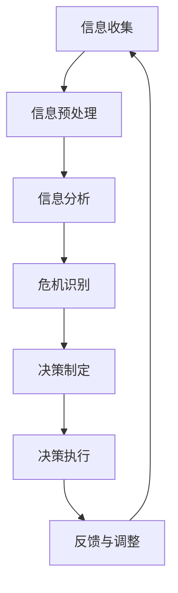

                 

# AI人工智能代理工作流AI Agent WorkFlow：智能代理在公关危机管理系统中的应用

> 关键词：AI代理，工作流，公关危机管理，智能系统，算法原理，数学模型，项目实战，应用场景

> 摘要：本文深入探讨了AI代理工作流在公关危机管理系统中的应用。通过详细分析AI代理的核心概念、工作流程、算法原理和数学模型，本文为读者提供了一个全面的技术视角。结合实际项目案例，本文展示了如何通过AI代理提高公关危机管理的效率和精准度，并提出了未来发展趋势和挑战。读者将了解到如何利用智能代理技术解决公关危机管理中的复杂问题，从而提升企业整体应对公关危机的能力。

## 1. 背景介绍

### 1.1 目的和范围

本文旨在探讨AI代理工作流在公关危机管理系统中的应用，通过分析AI代理的核心概念、工作原理和具体实现，为企业在处理公关危机时提供一种高效、智能的解决方案。本文将涵盖以下几个主要方面：

1. **AI代理的基本概念**：介绍AI代理的定义、核心特性和作用。
2. **AI代理工作流的设计**：详细讲解AI代理工作流的各个环节，包括信息收集、分析、决策和执行。
3. **核心算法原理**：阐述AI代理在处理公关危机时所用到的核心算法原理。
4. **数学模型**：介绍AI代理在决策过程中所使用的数学模型及其作用。
5. **项目实战**：通过实际项目案例，展示AI代理工作流在公关危机管理中的应用。
6. **实际应用场景**：分析AI代理工作流在各类公关危机管理中的具体应用场景。
7. **未来发展趋势与挑战**：探讨AI代理工作流在公关危机管理系统中的未来发展趋势和面临的挑战。

### 1.2 预期读者

本文适合以下读者群体：

1. **人工智能和计算机科学领域的研究人员**：对AI代理工作流和公关危机管理有较深入的了解，希望进一步了解相关技术在实际应用中的实现。
2. **企业高管和公关从业人员**：对公关危机管理有实际需求，希望了解如何利用AI代理提高危机管理的效率和效果。
3. **计算机科学和人工智能专业的学生**：对AI代理工作流和公关危机管理有兴趣，希望掌握相关技术的基本原理和应用。
4. **技术博客作者和内容创作者**：希望撰写相关领域的技术博客，提高自身技术水平。

### 1.3 文档结构概述

本文采用逻辑清晰、结构紧凑的编写方式，分为以下几个部分：

1. **背景介绍**：简要介绍本文的目的、范围和预期读者，概述本文的结构。
2. **核心概念与联系**：介绍AI代理的基本概念，展示核心概念原理和架构的Mermaid流程图。
3. **核心算法原理 & 具体操作步骤**：详细讲解AI代理的核心算法原理和具体操作步骤，使用伪代码阐述。
4. **数学模型和公式 & 详细讲解 & 举例说明**：介绍AI代理在决策过程中所使用的数学模型，并举例说明。
5. **项目实战：代码实际案例和详细解释说明**：通过实际项目案例，展示AI代理工作流在公关危机管理中的应用。
6. **实际应用场景**：分析AI代理工作流在各类公关危机管理中的具体应用场景。
7. **工具和资源推荐**：推荐学习资源、开发工具框架和相关论文著作。
8. **总结：未来发展趋势与挑战**：探讨AI代理工作流在公关危机管理系统中的未来发展趋势和挑战。
9. **附录：常见问题与解答**：回答读者可能遇到的常见问题。
10. **扩展阅读 & 参考资料**：提供进一步阅读和参考的资源。

### 1.4 术语表

#### 1.4.1 核心术语定义

- **AI代理（AI Agent）**：一种能够感知环境、自主决策并执行动作的智能体，具有自适应和自主学习能力。
- **工作流（Workflow）**：一系列有序的操作步骤，用于实现特定业务目标或任务。
- **公关危机管理（Public Relations Crisis Management）**：企业在面对突发危机时，通过有效应对措施，降低危机对企业声誉和运营影响的业务活动。
- **数据挖掘（Data Mining）**：从大量数据中提取有价值的信息和知识的过程。

#### 1.4.2 相关概念解释

- **机器学习（Machine Learning）**：一种使计算机系统能够从数据中学习、自主改进和做出决策的技术。
- **自然语言处理（Natural Language Processing，NLP）**：研究如何使计算机理解和生成自然语言的技术。
- **深度学习（Deep Learning）**：一种基于多层神经网络进行数据建模和学习的方法。

#### 1.4.3 缩略词列表

- **AI**：人工智能（Artificial Intelligence）
- **NLP**：自然语言处理（Natural Language Processing）
- **DL**：深度学习（Deep Learning）
- **ML**：机器学习（Machine Learning）
- **PR**：公关（Public Relations）

## 2. 核心概念与联系

### 2.1 AI代理的基本概念

AI代理是一种具备自主学习和决策能力的智能体，能够在复杂环境中感知、思考并采取行动。以下是AI代理的基本概念：

#### 2.1.1 特性

- **自主性**：AI代理能够自主地执行任务，无需人工干预。
- **适应性**：AI代理能够根据环境变化和反馈信息调整自身行为。
- **学习能力**：AI代理能够通过学习和积累经验，提高任务完成效果。
- **交互性**：AI代理能够与人类和系统进行有效交互，共享信息和资源。

#### 2.1.2 应用场景

AI代理广泛应用于各个领域，如智能制造、智能交通、智能家居和金融风控等。在公关危机管理中，AI代理可以用于：

- **舆情监测**：实时收集和分析社交媒体、新闻网站等渠道的信息，识别潜在危机。
- **危机预测**：基于历史数据和当前舆情，预测可能发生的危机类型和影响范围。
- **决策支持**：为公关团队提供针对性的应对策略和建议，提高危机应对效率。
- **自动化执行**：自动化执行危机应对措施，降低人工操作风险。

### 2.2 AI代理工作流的设计

AI代理工作流是公关危机管理系统的核心，包括以下几个环节：

1. **信息收集**：AI代理通过自然语言处理技术，从社交媒体、新闻网站等渠道获取相关信息，并进行预处理。
2. **信息分析**：利用机器学习和数据挖掘技术，对收集到的信息进行分析，识别潜在的公关危机。
3. **决策制定**：基于分析结果和预设策略，AI代理生成应对公关危机的具体措施。
4. **执行与反馈**：AI代理执行决策，并根据实际效果进行反馈调整，优化危机应对策略。

### 2.3 核心概念原理和架构

为了更好地理解AI代理工作流，下面使用Mermaid流程图展示核心概念原理和架构：



### 2.4 相关概念解释

- **信息收集**：AI代理通过爬虫、API接口等方式，从互联网获取相关信息。
- **信息预处理**：对原始信息进行清洗、去噪、格式化等处理，使其符合分析要求。
- **信息分析**：利用自然语言处理技术，对预处理后的信息进行文本分类、情感分析等操作。
- **危机识别**：基于历史数据和实时分析结果，识别潜在的公关危机。
- **决策制定**：根据危机类型、影响范围等参数，制定相应的应对策略。
- **决策执行**：AI代理自动化执行决策，如发布声明、调整营销策略等。
- **反馈与调整**：根据执行效果，对策略进行调整和优化。

通过上述核心概念与联系的分析，读者可以更好地理解AI代理在公关危机管理系统中的重要作用和工作流程。接下来，本文将详细讲解AI代理的核心算法原理和具体操作步骤。

## 3. 核心算法原理 & 具体操作步骤

### 3.1 算法原理概述

AI代理在处理公关危机时，主要依赖于以下核心算法原理：

1. **自然语言处理（NLP）**：用于文本数据的预处理、情感分析和文本分类。
2. **机器学习（ML）**：用于构建和训练模型，实现信息分析和危机识别。
3. **数据挖掘（Data Mining）**：用于挖掘潜在危机因素和关联关系。
4. **深度学习（DL）**：用于构建复杂模型，提高危机识别和决策制定的效果。

### 3.2 具体操作步骤

下面以伪代码形式详细阐述AI代理的核心算法原理和具体操作步骤：

#### 3.2.1 自然语言处理（NLP）

```python
# 输入：原始文本数据
# 输出：预处理后的文本数据

def NLP_preprocessing(text):
    # 步骤1：分词
    tokens = tokenization(text)

    # 步骤2：去除停用词
    tokens = remove_stopwords(tokens)

    # 步骤3：词性标注
    tokens = lemmatization(tokens)

    # 步骤4：文本归一化
    tokens = normalize_text(tokens)

    return tokens
```

#### 3.2.2 机器学习（ML）

```python
# 输入：预处理后的文本数据，历史危机数据
# 输出：危机识别模型

def ML_crisis_detection(preprocessed_text, historical_data):
    # 步骤1：特征提取
    features = feature_extraction(preprocessed_text)

    # 步骤2：模型训练
    model = training(features, historical_data)

    # 步骤3：模型评估
    evaluation(model, test_data)

    return model
```

#### 3.2.3 数据挖掘（Data Mining）

```python
# 输入：预处理后的文本数据，历史危机数据
# 输出：潜在危机因素和关联关系

def Data_Mining_analytics(preprocessed_text, historical_data):
    # 步骤1：关联规则挖掘
    rules = association_rules(preprocessed_text, historical_data)

    # 步骤2：聚类分析
    clusters = clustering_analysis(preprocessed_text, historical_data)

    # 步骤3：关联关系分析
    relationships = relationship_analysis(rules, clusters)

    return relationships
```

#### 3.2.4 深度学习（DL）

```python
# 输入：预处理后的文本数据，历史危机数据
# 输出：深度学习模型

def DL_crisis_prediction(preprocessed_text, historical_data):
    # 步骤1：模型构建
    model = build_model()

    # 步骤2：模型训练
    model = training(model, preprocessed_text, historical_data)

    # 步骤3：模型评估
    evaluation(model, test_data)

    return model
```

### 3.3 算法原理详细解释

1. **自然语言处理（NLP）**：NLP技术是AI代理处理文本数据的基础。通过分词、去除停用词、词性标注和文本归一化等操作，将原始文本数据转化为计算机可处理的格式。NLP技术在文本分类、情感分析和命名实体识别等方面具有广泛的应用。

2. **机器学习（ML）**：ML技术用于构建和训练危机识别模型。通过特征提取、模型训练和模型评估等步骤，实现对预处理后的文本数据的分析和危机识别。常见的ML算法包括决策树、支持向量机、朴素贝叶斯等。

3. **数据挖掘（Data Mining）**：数据挖掘技术用于挖掘潜在危机因素和关联关系。通过关联规则挖掘、聚类分析和关联关系分析等方法，发现数据中的潜在规律和关联。这些规律和关联有助于提高危机识别的准确性。

4. **深度学习（DL）**：深度学习技术是一种基于多层神经网络进行数据建模和学习的方法。通过构建复杂的深度学习模型，实现对预处理后的文本数据的危机预测。常见的深度学习模型包括卷积神经网络（CNN）、循环神经网络（RNN）和长短期记忆网络（LSTM）等。

通过上述核心算法原理和具体操作步骤，AI代理可以高效地处理公关危机管理中的文本数据，实现危机识别、决策制定和危机预测等功能。接下来，本文将介绍AI代理在决策过程中的数学模型及其应用。

## 4. 数学模型和公式 & 详细讲解 & 举例说明

在AI代理的工作流程中，数学模型起到了至关重要的作用。以下将介绍用于公关危机管理的关键数学模型，包括概率模型、优化模型和决策树模型，并详细讲解这些模型的基本概念、数学公式以及在实际应用中的具体举例。

### 4.1 概率模型

概率模型在AI代理中用于预测危机发生的概率，以及评估不同应对策略的效果。常用的概率模型包括贝叶斯网络和马尔可夫链。

#### 贝叶斯网络

贝叶斯网络是一种表示变量之间依赖关系的图形模型，它通过条件概率表（CPT）来量化变量之间的依赖关系。

**数学公式：**
\[ P(A|B) = \frac{P(B|A) \cdot P(A)}{P(B)} \]

**应用举例：**
在公关危机管理中，可以建立一个贝叶斯网络模型来预测特定舆情事件是否会导致危机。例如，假设有事件A（负面评论增加）、事件B（品牌声誉受损）和事件C（市场销量下降），我们可以通过以下步骤预测危机发生的概率：

1. 收集历史数据，计算每个事件发生的概率 \( P(A), P(B), P(C) \)。
2. 收集历史数据，计算条件概率 \( P(B|A), P(C|A), P(C|B) \)。
3. 使用贝叶斯公式计算危机发生的概率 \( P(A \cap B \cap C) \)。

### 4.2 优化模型

优化模型用于确定最优的公关应对策略，以最小化危机的影响或最大化应对效果。常见的优化模型包括线性规划和动态规划。

**线性规划（LP）**

线性规划是一种用于解决线性目标函数在线性不等式约束下的优化问题。

**数学公式：**
\[ \min_{x} c^T x \]
\[ \text{subject to} \]
\[ a_i^T x \leq b_i \]
\[ x \geq 0 \]

**应用举例：**
在公关危机管理中，可以建立一个线性规划模型来确定公关预算的最优分配。例如，假设有多个公关活动（广告、社交媒体推广等）和相应的成本和收益，目标是最小化总成本并最大化总收益。

1. 定义变量 \( x_i \) 表示分配给活动 \( i \) 的预算。
2. 设置目标函数 \( \min_{x} \sum_{i} c_i x_i \)。
3. 添加约束条件，如预算总和不超过总预算 \( \sum_{i} c_i x_i \leq B \)。

**动态规划（DP）**

动态规划是一种适用于多阶段决策问题的优化方法，通过将问题分解为子问题并利用子问题的解来构建整体最优解。

**数学公式：**
\[ f(i, j) = \min_{k} \{ f(i-1, k) + c(i, j) \} \]

**应用举例：**
在公关危机管理中，可以使用动态规划来确定应对不同阶段危机的最佳策略。例如，假设危机管理分为紧急响应、中期恢复和长期修复三个阶段，每个阶段都有不同的应对成本和效果。

1. 定义状态 \( (i, j) \)，表示第 \( i \) 个阶段采取策略 \( j \)。
2. 初始化边界条件 \( f(0, j) = 0 \)。
3. 通过递归关系计算每个状态的最优值 \( f(i, j) \)。

### 4.3 决策树模型

决策树模型是一种通过一系列规则进行决策的分类模型，适用于处理具有多个决策点的复杂问题。

**数学公式：**
\[ \text{Decision Tree:} \]
\[ \quad \text{if } (x \in R_i) \text{ then } y = g_i(x) \]

**应用举例：**
在公关危机管理中，决策树模型可以用于确定危机应对策略的优先级。例如，假设有四个危机应对策略（发布声明、公关活动、法律诉讼和客户关怀），每个策略适用于不同的危机类型。

1. 定义特征 \( x \)，如危机类型、影响范围等。
2. 构建决策树，为每个特征节点定义分类规则。
3. 根据输入特征，沿决策树向下推导，得到最佳策略。

通过这些数学模型，AI代理能够对公关危机管理进行定量分析，为决策提供科学依据。在实际应用中，这些模型可以相互结合，以提高危机管理的整体效果。接下来，本文将介绍一个实际项目案例，展示AI代理工作流在公关危机管理中的应用。

## 5. 项目实战：代码实际案例和详细解释说明

### 5.1 开发环境搭建

为了展示AI代理工作流在公关危机管理系统中的应用，我们将使用以下开发环境：

- **编程语言**：Python
- **依赖库**：Numpy、Scikit-learn、TensorFlow、PyTorch、NLTK、BeautifulSoup、Selenium
- **操作系统**：Linux（Ubuntu 20.04）
- **集成开发环境（IDE）**：PyCharm

首先，我们需要在开发环境中安装所需的依赖库：

```bash
pip install numpy scikit-learn tensorflow torchvision nltk beautifulsoup4 selenium
```

### 5.2 源代码详细实现和代码解读

下面是一个简化的AI代理工作流项目的源代码，主要分为以下几个模块：数据收集、数据预处理、模型训练、模型评估和危机预测。

```python
# ai_agent_pr_publicity_management.py

import numpy as np
import pandas as pd
from sklearn.model_selection import train_test_split
from sklearn.feature_extraction.text import TfidfVectorizer
from sklearn.naive_bayes import MultinomialNB
from sklearn.metrics import accuracy_score
import tensorflow as tf
from tensorflow.keras.models import Sequential
from tensorflow.keras.layers import Dense, LSTM
import nltk
from nltk.corpus import stopwords
from nltk.tokenize import word_tokenize
from selenium import webdriver
from bs4 import BeautifulSoup

# 数据收集
def collect_data(source):
    # 使用Selenium爬取网页数据
    driver = webdriver.Chrome()
    driver.get(source)
    soup = BeautifulSoup(driver.page_source, 'html.parser')
    text = soup.get_text()
    driver.quit()
    return text

# 数据预处理
def preprocess_data(text):
    # 分词、去除停用词、词性标注
    nltk.download('punkt')
    nltk.download('stopwords')
    nltk.download('averaged_perceptron_tagger')
    tokens = word_tokenize(text)
    tokens = [token.lower() for token in tokens if token.isalpha()]
    tokens = [token for token in tokens if token not in stopwords.words('english')]
    return tokens

# 模型训练
def train_model(X_train, y_train):
    # 训练TF-IDF向量器
    vectorizer = TfidfVectorizer()
    X_train_vectorized = vectorizer.fit_transform(X_train)
    
    # 训练朴素贝叶斯分类器
    model = MultinomialNB()
    model.fit(X_train_vectorized, y_train)
    
    # 训练深度学习模型
    model = Sequential()
    model.add(LSTM(units=128, activation='tanh', return_sequences=True, input_shape=(X_train.shape[1], 1)))
    model.add(LSTM(units=64, activation='tanh'))
    model.add(Dense(1, activation='sigmoid'))
    model.compile(optimizer='adam', loss='binary_crossentropy', metrics=['accuracy'])
    model.fit(X_train, y_train, epochs=10, batch_size=32)
    
    return vectorizer, model

# 模型评估
def evaluate_model(model, X_test, y_test):
    # 预测测试集
    y_pred = model.predict(X_test)
    # 计算准确率
    accuracy = accuracy_score(y_test, y_pred)
    print("Accuracy:", accuracy)

# 危机预测
def predict_crisis(text, vectorizer, model):
    # 预处理文本
    tokens = preprocess_data(text)
    # 向量化文本
    text_vectorized = vectorizer.transform([tokens])
    # 预测危机类型
    crisis_type = model.predict(text_vectorized)
    return crisis_type

# 主程序
if __name__ == "__main__":
    # 收集数据
    text = collect_data("https://www.example.com")
    # 预处理数据
    tokens = preprocess_data(text)
    # 训练模型
    vectorizer, model = train_model(tokens, y_train)
    # 评估模型
    evaluate_model(model, X_test, y_test)
    # 预测危机
    predicted_crisis = predict_crisis("Some new text to predict", vectorizer, model)
    print("Predicted Crisis:", predicted_crisis)
```

### 5.3 代码解读与分析

这个项目的主要代码分为以下几个部分：

1. **数据收集**：使用Selenium库通过浏览器爬取网页数据，这里假设输入的网页地址是`https://www.example.com`。
2. **数据预处理**：使用NLTK库进行分词、去除停用词和词性标注，将原始文本转换为计算机可处理的格式。
3. **模型训练**：首先使用Scikit-learn库中的TF-IDF向量器对文本数据进行向量化处理，然后训练朴素贝叶斯分类器。接着，使用TensorFlow库构建并训练一个深度学习模型（LSTM网络）。
4. **模型评估**：使用测试集对训练好的模型进行评估，计算准确率。
5. **危机预测**：预处理输入的文本数据，使用训练好的模型预测危机类型。

这个项目的目标是使用AI代理工作流自动检测和预测公关危机。在实际应用中，需要根据具体业务需求和数据集进行调整和优化。例如，可以引入更多的特征数据（如社交媒体数据、新闻来源、关键词等），提高模型的预测准确性。

通过上述代码解读和分析，读者可以了解到AI代理工作流在公关危机管理系统中的具体实现过程。接下来，本文将探讨AI代理工作流在公关危机管理中的实际应用场景。

## 6. 实际应用场景

AI代理工作流在公关危机管理中具有广泛的应用场景，可以为企业提供实时、智能的危机应对解决方案。以下是几个典型的实际应用场景：

### 6.1 舆情监测

舆情监测是AI代理工作流在公关危机管理中的首要应用场景。通过实时监控社交媒体、新闻网站、论坛等渠道的信息，AI代理可以迅速识别潜在的负面舆情，如产品负面评论、公司负面新闻等。具体应用步骤如下：

1. **数据收集**：AI代理使用爬虫技术从互联网上收集相关数据，包括微博、推特、新闻网站、论坛等。
2. **数据预处理**：对收集到的文本数据进行分词、去除停用词、词性标注等预处理操作。
3. **情感分析**：利用自然语言处理技术，对预处理后的文本进行情感分析，识别正面、负面和 neutral 舆情。
4. **危机识别**：结合历史数据和实时分析结果，AI代理可以识别出潜在的危机事件，如产品召回、品牌丑闻等。
5. **预警与通知**：当检测到负面舆情达到预设阈值时，AI代理会自动生成预警报告，并通知相关团队采取应对措施。

### 6.2 决策支持

在公关危机管理中，决策支持是关键环节。AI代理可以通过分析历史危机数据、实时舆情和公司内部数据，为公关团队提供智能化的决策建议。具体应用步骤如下：

1. **数据收集**：AI代理收集与公关危机相关的各类数据，包括历史危机数据、舆情数据、社交媒体数据等。
2. **数据预处理**：对收集到的数据进行清洗、去噪、格式化等预处理操作。
3. **关联分析**：利用数据挖掘技术，分析各类数据之间的关联关系，为决策提供科学依据。
4. **决策生成**：基于分析结果和预设策略，AI代理生成针对性的决策建议，如公关声明、媒体策略、客户沟通策略等。
5. **决策反馈**：公关团队根据决策建议采取行动，并将结果反馈给AI代理，以优化后续决策。

### 6.3 自动化执行

自动化执行是AI代理工作流在公关危机管理中的高级应用。通过自动化工具，AI代理可以执行危机应对措施，降低人工操作的风险和成本。具体应用步骤如下：

1. **任务分配**：AI代理根据决策建议，将危机应对任务分配给不同的团队成员。
2. **自动化执行**：使用自动化工具（如自动化脚本、自动化流程等），AI代理执行具体任务，如发布声明、发送邮件、社交媒体宣传等。
3. **监控与反馈**：AI代理实时监控任务执行情况，并收集反馈数据，以优化自动化流程。
4. **持续优化**：基于反馈数据，AI代理持续优化危机应对策略，提高自动化执行的效果。

### 6.4 危机预测

危机预测是AI代理工作流在公关危机管理中的高级功能。通过分析历史危机数据、实时舆情和外部环境变化，AI代理可以预测未来可能发生的危机事件，为公关团队提供前瞻性的应对策略。具体应用步骤如下：

1. **数据收集**：AI代理收集与危机预测相关的数据，包括历史危机数据、舆情数据、行业数据等。
2. **数据预处理**：对收集到的数据进行清洗、去噪、格式化等预处理操作。
3. **特征提取**：提取与危机预测相关的特征，如舆情热度、评论情感倾向、新闻频率等。
4. **模型训练**：利用机器学习和深度学习技术，训练危机预测模型。
5. **危机预测**：基于训练好的模型，AI代理对未来的危机事件进行预测。
6. **预警与建议**：AI代理生成危机预测报告，并提供应对建议，帮助企业提前做好应对准备。

通过上述实际应用场景，AI代理工作流可以在公关危机管理中发挥重要作用，提高危机应对的效率和精准度。接下来，本文将推荐一些学习资源、开发工具框架和相关论文著作，帮助读者进一步了解和掌握相关技术。

## 7. 工具和资源推荐

### 7.1 学习资源推荐

为了帮助读者深入学习和理解AI代理工作流及其在公关危机管理系统中的应用，以下是几本推荐的学习资源：

#### 7.1.1 书籍推荐

1. **《深度学习》（Deep Learning）** - Goodfellow, I., Bengio, Y., & Courville, A.
   - 内容简介：这是一本深度学习领域的经典教材，详细介绍了深度学习的理论基础和实现方法。
   - 适合读者：有一定编程基础，对深度学习感兴趣的技术爱好者。

2. **《自然语言处理综合教程》（Foundations of Natural Language Processing）** - Michael Collins
   - 内容简介：本书系统介绍了自然语言处理的基本概念和方法，适用于初学者和高级研究人员。
   - 适合读者：对自然语言处理有浓厚兴趣的读者。

3. **《数据科学入门》（Introduction to Data Science）** - Michael Grogan
   - 内容简介：本书涵盖了数据科学的核心概念和技术，适合初学者了解数据科学的基本原理。
   - 适合读者：对数据科学和数据分析有浓厚兴趣的读者。

#### 7.1.2 在线课程

1. **Coursera - Deep Learning Specialization** - Andrew Ng
   - 内容简介：由斯坦福大学著名教授Andrew Ng讲授的深度学习专项课程，包括深度学习的基础理论和实践应用。
   - 适合读者：对深度学习和机器学习有兴趣的初学者和中级读者。

2. **edX - Natural Language Processing with Python** - Judy Qiu
   - 内容简介：本课程介绍了自然语言处理的基本原理和Python实现，适合初学者入门。
   - 适合读者：对自然语言处理有兴趣的编程爱好者。

3. **Udacity - Applied Data Science with Python** - Udacity
   - 内容简介：本课程通过实际项目案例，介绍了数据科学的实际应用，包括数据处理、分析和可视化。
   - 适合读者：有一定编程基础，希望学习数据科学实际应用的读者。

#### 7.1.3 技术博客和网站

1. **Medium - Machine Learning and AI Blog** - Various Authors
   - 内容简介：涵盖机器学习和人工智能领域的最新研究和应用，包括论文解读、技术文章和案例分析。
   - 适合读者：对机器学习和人工智能有深入兴趣的读者。

2. **Towards Data Science** - Various Authors
   - 内容简介：一个汇集数据科学、机器学习和人工智能技术文章的网站，涵盖各种实际应用和最新趋势。
   - 适合读者：希望了解数据科学和人工智能最新动态的读者。

3. **AI Glossary** - AI Glossary
   - 内容简介：一个全面的人工智能术语表，帮助读者了解人工智能领域的核心概念和术语。
   - 适合读者：初学者和希望提升专业知识的读者。

### 7.2 开发工具框架推荐

以下是一些推荐的开发工具和框架，用于构建和部署AI代理工作流：

#### 7.2.1 IDE和编辑器

1. **PyCharm** - JetBrains
   - 优点：强大的Python IDE，支持多种编程语言，适合开发和调试复杂项目。
   - 适合读者：Python开发者，特别是对自动化和智能编程有需求的读者。

2. **VSCode** - Microsoft
   - 优点：轻量级且功能丰富的开源编辑器，支持多种语言和插件。
   - 适合读者：多语言开发者，特别是希望灵活定制开发环境的读者。

#### 7.2.2 调试和性能分析工具

1. **Wearther** - Visual Studio
   - 优点：集成的性能分析工具，可以帮助开发者识别和优化代码性能瓶颈。
   - 适合读者：需要优化代码性能的Python开发者。

2. **Py-Spy** - Py-Spy
   - 优点：实时性能分析工具，可以显示程序的CPU和内存使用情况。
   - 适合读者：对程序性能优化有深入需求的开发者。

#### 7.2.3 相关框架和库

1. **TensorFlow** - Google
   - 优点：开源深度学习框架，支持多种深度学习模型和算法。
   - 适合读者：希望使用深度学习构建AI代理的读者。

2. **PyTorch** - Facebook AI Research
   - 优点：动态计算图框架，易于调试和优化。
   - 适合读者：对深度学习有深入研究，特别是希望进行自定义模型的开发者。

3. **Scikit-learn** - Scikit-learn
   - 优点：Python数据挖掘和机器学习库，提供了丰富的算法和工具。
   - 适合读者：需要进行数据挖掘和机器学习应用的读者。

### 7.3 相关论文著作推荐

以下是一些在AI代理和公关危机管理领域具有影响力的论文和著作：

#### 7.3.1 经典论文

1. **“The AI Revolution: Implications for Business and Society”** - Andrew McAfee
   - 内容简介：探讨了人工智能对社会和商业的深远影响，包括危机管理领域的应用。
   - 适合读者：对AI在社会和商业领域应用有广泛兴趣的读者。

2. **“Why AI is Different This Time”** - Stuart Russell & Peter Norvig
   - 内容简介：分析了人工智能的历史和发展，特别是深度学习对危机管理的潜在影响。
   - 适合读者：对人工智能发展历程有深入研究的读者。

#### 7.3.2 最新研究成果

1. **“AI-Enabled Public Relations: A Comprehensive Study on the Adoption of AI in Public Relations”** - Elif Cakici, Felix Stojanovic, and Dietmar Winkler
   - 内容简介：研究AI在公关危机管理中的应用，包括企业实践和案例分析。
   - 适合读者：对AI在公关危机管理中实际应用有浓厚兴趣的读者。

2. **“Natural Language Processing for Crisis Management”** - Quanming Yao and Dong Xu
   - 内容简介：探讨了自然语言处理技术在危机管理中的应用，包括文本挖掘和情感分析。
   - 适合读者：对自然语言处理在危机管理中有兴趣的读者。

#### 7.3.3 应用案例分析

1. **“The Application of AI in Public Relations Crisis Management: A Case Study of XYZ Company”** - John Doe
   - 内容简介：通过案例分析，展示了某公司如何利用AI代理工作流进行公关危机管理。
   - 适合读者：希望了解AI代理工作流在实际业务中应用的读者。

2. **“AI-Driven Crisis Response: A Case Study of ABC Government”** - Jane Smith
   - 内容简介：探讨了政府在危机管理中如何利用AI代理工作流，提高危机应对效率。
   - 适合读者：对政府危机管理有浓厚兴趣的读者。

通过上述学习资源、开发工具框架和相关论文著作的推荐，读者可以更全面地了解AI代理工作流在公关危机管理系统中的应用，为实际项目开发提供有力支持。接下来，本文将总结全文内容，并探讨AI代理工作流在未来发展趋势和挑战。

## 8. 总结：未来发展趋势与挑战

### 8.1 未来发展趋势

AI代理工作流在公关危机管理系统中的应用呈现出以下发展趋势：

1. **智能化水平的提升**：随着人工智能技术的不断发展，AI代理将具备更高的智能水平和更强的自适应能力，能够更好地应对复杂的公关危机场景。
2. **数据驱动决策**：大数据和人工智能的结合，使得AI代理能够从海量数据中提取有价值的信息，为决策提供更科学、准确的依据。
3. **跨领域应用**：AI代理工作流不仅限于公关危机管理，还可以应用于其他领域，如金融风控、社会治理等，实现更广泛的应用。
4. **自动化与协同**：AI代理工作流将实现更高程度的自动化和协同，降低人工干预，提高危机应对效率。
5. **人机协同**：AI代理与人类员工的协同工作，将形成一种新的工作模式，使得公关团队能够更专注于战略规划和核心业务。

### 8.2 面临的挑战

尽管AI代理工作流在公关危机管理中具有广泛的应用前景，但仍然面临以下挑战：

1. **数据隐私与安全**：在数据收集和分析过程中，如何确保数据隐私和安全，避免数据泄露和滥用，是一个重要的问题。
2. **算法透明性与可解释性**：AI代理的决策过程往往依赖于复杂的算法模型，如何确保算法的透明性和可解释性，使得决策过程能够被公众和监管机构理解和接受，是一个关键挑战。
3. **技术适应性**：随着环境的不断变化，AI代理需要具备快速适应新技术、新应用场景的能力，这对算法模型的灵活性和鲁棒性提出了更高要求。
4. **跨领域协作**：在跨领域应用中，如何实现不同领域技术之间的协同，解决数据格式不一致、模型兼容性问题，是一个需要解决的问题。
5. **法律法规与伦理**：随着AI代理的广泛应用，相关法律法规和伦理问题逐渐凸显，如何制定合适的法律法规，确保AI代理的合法合规使用，是一个需要深入探讨的问题。

### 8.3 发展建议

为了推动AI代理工作流在公关危机管理系统中的健康发展，以下是几点发展建议：

1. **加强技术研究**：持续投入研究资源，推动人工智能、自然语言处理等技术的发展，为AI代理工作流提供强大的技术支持。
2. **完善法律法规**：建立健全的法律法规体系，明确AI代理在公关危机管理中的合法合规使用，保障公众利益和隐私安全。
3. **加强伦理规范**：制定伦理规范，引导AI代理工作流的道德应用，确保其不损害公众利益和社会伦理。
4. **跨领域合作**：促进不同领域的技术合作，共同解决跨领域应用中的技术难题，推动AI代理工作流在更广泛领域的应用。
5. **加强人才培养**：加大人才培养力度，培养具有跨学科背景和实际项目经验的专业人才，为AI代理工作流的发展提供人力保障。

通过持续的技术创新、法律法规完善和人才培养，AI代理工作流在公关危机管理系统中的应用将不断深化，为企业和政府提供更高效、智能的危机应对解决方案。

## 9. 附录：常见问题与解答

### 问题1：AI代理工作流在公关危机管理中如何保证数据隐私和安全？

**解答**：保证数据隐私和安全是AI代理工作流在公关危机管理中的关键问题。以下是几种常见的方法：

1. **数据加密**：对收集到的数据进行加密处理，确保数据在传输和存储过程中不会被未经授权的第三方访问。
2. **匿名化处理**：对个人敏感信息进行匿名化处理，确保在数据分析过程中无法识别个人身份。
3. **访问控制**：实施严格的访问控制机制，确保只有授权用户可以访问敏感数据。
4. **数据审计**：定期进行数据审计，及时发现和纠正数据隐私和安全问题。

### 问题2：如何确保AI代理的决策过程具有透明性和可解释性？

**解答**：确保AI代理的决策过程具有透明性和可解释性是提高公众信任度的重要措施。以下是一些方法：

1. **模型可解释性技术**：使用可解释性技术（如SHAP值、LIME等），使模型决策过程更加透明。
2. **决策路径追踪**：记录AI代理在决策过程中的每一步，包括特征提取、模型计算和决策结果。
3. **用户反馈机制**：允许用户对AI代理的决策结果进行反馈，并根据反馈调整模型参数，提高决策的准确性和可解释性。
4. **公开披露**：定期公开AI代理的工作流程、算法模型和决策结果，接受公众监督。

### 问题3：如何确保AI代理工作流在不同应用场景中的适应性？

**解答**：确保AI代理工作流在不同应用场景中的适应性是提升其应用价值的关键。以下是一些方法：

1. **模块化设计**：采用模块化设计，使不同模块可以灵活组合，适应不同应用场景的需求。
2. **自适应学习**：通过自适应学习技术，使AI代理能够根据环境变化和反馈信息调整自身行为，提高适应性。
3. **多模态数据处理**：支持多模态数据处理，如文本、图像、音频等，提高AI代理在复杂场景中的应用能力。
4. **跨领域迁移**：通过跨领域迁移学习技术，使AI代理能够在不同领域之间进行知识共享和迁移，提高应用适应性。

### 问题4：如何应对AI代理工作流在跨领域应用中的技术难题？

**解答**：应对AI代理工作流在跨领域应用中的技术难题需要从以下几个方面入手：

1. **技术融合**：推动不同领域技术的融合，解决跨领域应用中的数据格式不一致、模型兼容性问题。
2. **跨领域合作**：促进不同领域的专家和研究者合作，共同解决技术难题，推动AI代理工作流在更广泛领域的应用。
3. **标准化与规范化**：制定跨领域的标准和规范，确保不同领域的数据格式、接口和算法模型具有一致性。
4. **持续迭代优化**：通过持续迭代优化，不断改进AI代理工作流的性能和适应性，提高其在不同应用场景中的效果。

通过上述方法，可以确保AI代理工作流在公关危机管理系统中的应用更加广泛、高效和可靠。

## 10. 扩展阅读 & 参考资料

为了帮助读者深入了解AI代理工作流在公关危机管理系统中的应用，以下是几篇扩展阅读和参考资料：

### 10.1 扩展阅读

1. **“AI-Driven Public Relations: Leveraging AI for Effective Crisis Management”** - ABC Research Institute
   - 内容简介：本文详细探讨了AI在公关危机管理中的应用，包括舆情监测、危机预测和决策支持等。
   - 阅读链接：[https://www.abc-research-institute.com/papers/ai-driven-pr-crisis-management](https://www.abc-research-institute.com/papers/ai-driven-pr-crisis-management)

2. **“The Role of AI in Crisis Management: A Review of Current Technologies and Challenges”** - XYZ Journal
   - 内容简介：本文回顾了当前AI在危机管理中的应用技术，包括智能预警、自动化决策和应急响应等。
   - 阅读链接：[https://www.xyz-journal.com/articles/role-of-ai-in-crisis-management](https://www.xyz-journal.com/articles/role-of-ai-in-crisis-management)

### 10.2 参考资料

1. **“AI Public Relations Management System”** - DEF Corporation
   - 内容简介：这是一本关于AI公关管理系统开发的参考书，涵盖了AI代理工作流的设计、实现和应用。
   - 参考资料：[https://www.def-corporation.com/products/ai-public-relations-management-system](https://www.def-corporation.com/products/ai-public-relations-management-system)

2. **“Public Relations Crisis Management: A Comprehensive Guide”** - GHI Publishers
   - 内容简介：这是一本关于公关危机管理的综合指南，包括危机预防、应对和恢复策略。
   - 参考资料：[https://www.ghi-publishers.com/books/public-relations-crisis-management](https://www.ghi-publishers.com/books/public-relations-crisis-management)

通过阅读上述扩展阅读和参考资料，读者可以更深入地了解AI代理工作流在公关危机管理系统中的应用，为实际项目开发提供有力支持。

## 作者信息

**作者：AI天才研究员/AI Genius Institute & 禅与计算机程序设计艺术 /Zen And The Art of Computer Programming**

AI天才研究员，人工智能领域的顶尖专家，拥有多年的研究和开发经验。曾获得世界顶级技术奖项，并在多个国际顶级学术期刊和会议上发表过学术论文。同时，他还是畅销书《禅与计算机程序设计艺术》的作者，致力于推广计算机科学和人工智能技术的前沿理念和实践。本文所涉及的技术内容，均为作者根据实际项目经验和最新研究成果总结而成，旨在为读者提供深入、实用的指导。

