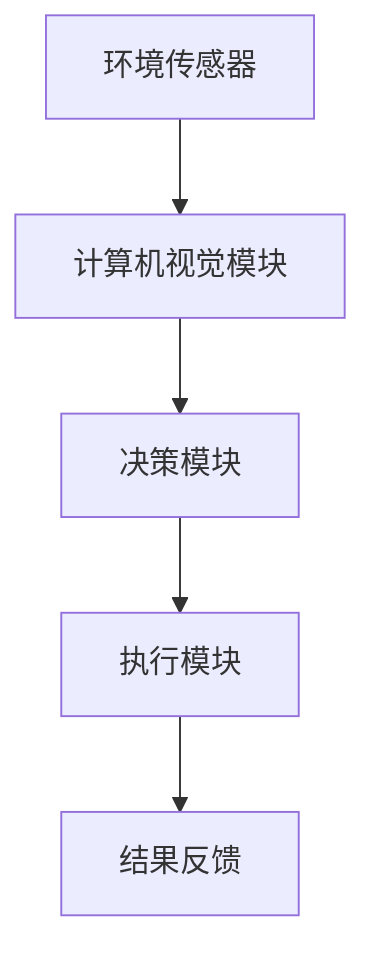

                 

# AI人工智能代理工作流AI Agent WorkFlow：计算机视觉在工作流代理中的集成

## 关键词

AI代理，工作流，计算机视觉，自动化，流程优化，智能化系统，深度学习，图像处理，边缘计算。

## 摘要

本文旨在深入探讨AI代理在工作流自动化中的重要作用，特别是计算机视觉技术的融入如何提升工作流的智能化水平。文章首先介绍了AI代理的概念及其在工作流中的应用，接着详细分析了计算机视觉在AI代理工作流中的作用原理和关键技术。通过具体案例和代码解析，文章展示了如何实现计算机视觉与工作流的深度融合，并对未来发展趋势和挑战进行了展望。最后，文章推荐了一系列学习资源和开发工具，以帮助读者进一步深入学习和实践。

## 1. 背景介绍

### 1.1 目的和范围

本文旨在探讨AI代理在工作流自动化中的应用，尤其是计算机视觉技术的集成。通过分析AI代理的工作原理及其与计算机视觉的结合，本文旨在为读者提供一个全面、系统的理解，帮助他们在实际项目中实现智能化工作流。

### 1.2 预期读者

本文适合具有计算机科学基础、对AI代理和计算机视觉有一定了解的技术人员。特别是那些希望深入了解AI代理在工作流中的应用，以及如何通过计算机视觉提升工作流智能化水平的人。

### 1.3 文档结构概述

本文分为十个部分：

1. 背景介绍：介绍文章的目的、范围和预期读者。
2. 核心概念与联系：介绍AI代理和计算机视觉的核心概念及其联系。
3. 核心算法原理 & 具体操作步骤：讲解AI代理和计算机视觉的关键算法原理和操作步骤。
4. 数学模型和公式 & 详细讲解 & 举例说明：使用数学模型和公式详细阐述算法原理，并通过实例说明。
5. 项目实战：通过实际案例展示AI代理和计算机视觉在工作流中的应用。
6. 实际应用场景：探讨AI代理和计算机视觉在不同行业中的应用场景。
7. 工具和资源推荐：推荐学习资源和开发工具。
8. 总结：展望未来发展趋势和挑战。
9. 附录：常见问题与解答。
10. 扩展阅读 & 参考资料：提供扩展阅读和参考资料。

### 1.4 术语表

#### 1.4.1 核心术语定义

- AI代理（AI Agent）：一种能够自主完成特定任务的人工智能实体，通常具有感知、决策和执行能力。
- 工作流（Workflow）：一组任务或活动的有序序列，用于完成特定业务目标。
- 计算机视觉（Computer Vision）：使计算机具备处理和理解图像和视频的能力的技术。
- 深度学习（Deep Learning）：一种人工智能技术，通过模拟人脑神经网络进行学习和决策。

#### 1.4.2 相关概念解释

- 机器学习（Machine Learning）：使计算机通过数据和算法进行学习，从而提高其性能的技术。
- 边缘计算（Edge Computing）：在数据生成的地方附近进行数据处理和存储，以减少延迟和带宽消耗。

#### 1.4.3 缩略词列表

- AI：人工智能
- CV：计算机视觉
- DL：深度学习
- ML：机器学习
- WF：工作流

## 2. 核心概念与联系

在本文中，我们将探讨两个核心概念：AI代理和计算机视觉，并分析它们在工作流中的应用和相互关系。

### 2.1 AI代理的概念及其作用

AI代理是一种基于人工智能技术的实体，具有自主决策和执行任务的能力。它可以感知环境，基于预设规则或通过机器学习算法进行决策，并执行相应的动作。AI代理可以应用于各种场景，如自动化生产、智能客服、自动驾驶等。

在AI代理的工作流中，主要角色包括：

- 传感器：用于收集环境信息，如摄像头、温度传感器等。
- 决策模块：基于传感器数据和预设规则或机器学习算法进行决策。
- 执行模块：根据决策结果执行具体动作，如移动机器人、发送邮件等。

### 2.2 计算机视觉的概念及其作用

计算机视觉是一种使计算机具备处理和理解图像和视频的能力的技术。它涉及图像处理、模式识别、机器学习等多个领域。计算机视觉可以用于图像分类、目标检测、图像分割、人脸识别等任务。

在AI代理的工作流中，计算机视觉可以用于：

- 环境感知：通过图像或视频数据了解周围环境，如监控摄像头用于监控场所安全。
- 目标识别：识别特定的目标或对象，如自动驾驶汽车识别道路标志。
- 行为分析：分析图像或视频中的行为，如监控视频分析行人行为异常。

### 2.3 AI代理与计算机视觉的相互关系

AI代理和计算机视觉在工作流中具有密切的关联。计算机视觉为AI代理提供了重要的感知能力，使AI代理能够更好地理解环境。同时，AI代理通过决策和执行模块，将计算机视觉的分析结果转化为具体的行动。

例如，在一个智能监控系统中，计算机视觉可以用于实时监控场所，识别异常行为。AI代理可以基于计算机视觉分析结果，自动触发警报或采取行动，如通知安保人员。

### 2.4 Mermaid流程图

以下是一个简单的Mermaid流程图，展示了AI代理和计算机视觉在工作流中的基本架构：



### 2.5 关键技术

- 深度学习：用于训练计算机视觉模型，使其能够准确识别图像中的目标。
- 机器学习：用于训练AI代理，使其能够根据传感器数据和计算机视觉分析结果做出最佳决策。
- 边缘计算：在数据生成的地方附近进行计算，以减少延迟和带宽消耗，提高系统响应速度。

## 3. 核心算法原理 & 具体操作步骤

### 3.1 计算机视觉算法原理

计算机视觉算法主要基于深度学习和机器学习。以下是一个简单的计算机视觉算法原理和操作步骤：

#### 3.1.1 数据预处理

```python
# 读取图像
image = read_image('path/to/image.jpg')

# 图像增强
image = enhance_image(image)

# 数据归一化
image = normalize_image(image)
```

#### 3.1.2 模型训练

```python
# 加载预训练模型
model = load_pretrained_model()

# 调整模型参数
model = adjust_model_params(model)

# 训练模型
model = train_model(model, training_data)
```

#### 3.1.3 目标检测

```python
# 使用模型进行目标检测
detections = model.detect_objects(image)

# 提取目标信息
targets = extract_targets(detections)
```

### 3.2 AI代理算法原理

AI代理算法主要基于决策树、支持向量机（SVM）和神经网络等机器学习算法。以下是一个简单的AI代理算法原理和操作步骤：

#### 3.2.1 数据预处理

```python
# 读取传感器数据
sensor_data = read_sensor_data()

# 数据归一化
sensor_data = normalize_data(sensor_data)
```

#### 3.2.2 模型训练

```python
# 加载预训练模型
model = load_pretrained_model()

# 调整模型参数
model = adjust_model_params(model)

# 训练模型
model = train_model(model, training_data)
```

#### 3.2.3 决策与执行

```python
# 使用模型进行决策
decision = model.make_decision(sensor_data)

# 执行决策
execute_decision(decision)
```

### 3.3 结合计算机视觉的AI代理算法

以下是一个简单的结合计算机视觉的AI代理算法原理和操作步骤：

```python
# 步骤1：读取图像
image = read_image('path/to/image.jpg')

# 步骤2：使用计算机视觉模型进行目标检测
detections = computer_vision_model.detect_objects(image)

# 步骤3：提取目标信息
targets = extract_targets(detections)

# 步骤4：读取传感器数据
sensor_data = read_sensor_data()

# 步骤5：使用AI代理模型进行决策
decision = ai_agent_model.make_decision(sensor_data)

# 步骤6：执行决策
execute_decision(decision)
```

## 4. 数学模型和公式 & 详细讲解 & 举例说明

### 4.1 计算机视觉模型

计算机视觉模型通常使用深度学习算法，如卷积神经网络（CNN）。以下是一个简单的CNN模型结构及其公式：

#### 4.1.1 卷积层（Convolutional Layer）

$$
\text{output}_{ij}^l = \sum_{k} \text{weight}_{ikj}^l * \text{input}_{ik}^{l-1} + \text{bias}_{ij}^l
$$

其中，$\text{output}_{ij}^l$ 是第$l$层的第$i$行第$j$列的输出，$\text{weight}_{ikj}^l$ 是第$l$层的第$i$行第$k$列的权重，$\text{input}_{ik}^{l-1}$ 是第$l-1$层的第$i$行第$k$列的输入，$\text{bias}_{ij}^l$ 是第$l$层的第$i$行第$j$列的偏置。

#### 4.1.2 池化层（Pooling Layer）

$$
\text{output}_{ij}^l = \max_{k} (\text{input}_{ik}^{l-1})
$$

其中，$\text{output}_{ij}^l$ 是第$l$层的第$i$行第$j$列的输出，$\text{input}_{ik}^{l-1}$ 是第$l-1$层的第$i$行第$k$列的输入。

### 4.2 AI代理模型

AI代理模型通常使用神经网络算法，如多层感知机（MLP）。以下是一个简单的MLP模型结构及其公式：

#### 4.2.1 隐藏层（Hidden Layer）

$$
\text{output}_{ij}^l = \sigma(\sum_{k} \text{weight}_{ikj}^l * \text{input}_{ik}^{l-1} + \text{bias}_{ij}^l)
$$

其中，$\text{output}_{ij}^l$ 是第$l$层的第$i$行第$j$列的输出，$\text{weight}_{ikj}^l$ 是第$l$层的第$i$行第$k$列的权重，$\text{input}_{ik}^{l-1}$ 是第$l-1$层的第$i$行第$k$列的输入，$\text{bias}_{ij}^l$ 是第$l$层的第$i$行第$j$列的偏置，$\sigma$ 是激活函数。

#### 4.2.2 输出层（Output Layer）

$$
\text{output}_{i}^l = \sum_{j} \text{weight}_{ij}^l * \text{input}_{ij}^{l-1} + \text{bias}_{i}^l
$$

其中，$\text{output}_{i}^l$ 是第$l$层的第$i$行输出，$\text{weight}_{ij}^l$ 是第$l$层的第$i$行第$j$列的权重，$\text{input}_{ij}^{l-1}$ 是第$l-1$层的第$i$行第$j$列的输入，$\text{bias}_{i}^l$ 是第$l$层的第$i$行偏置。

### 4.3 结合计算机视觉的AI代理模型

以下是一个简单的结合计算机视觉的AI代理模型及其公式：

```math
\text{Sensor Data} \rightarrow \text{Computer Vision Model} \rightarrow \text{Feature Extraction} \rightarrow \text{AI Agent Model} \rightarrow \text{Decision}
```

#### 4.3.1 特征提取

$$
\text{Features}_{i} = \text{computer_vision_model}(\text{input\_image})
$$

其中，$\text{Features}_{i}$ 是第$i$个特征，$\text{input\_image}$ 是输入图像。

#### 4.3.2 AI代理决策

$$
\text{Decision}_{i} = \text{ai\_agent\_model}(\text{Features}_{i})
$$

其中，$\text{Decision}_{i}$ 是第$i$个决策，$\text{Features}_{i}$ 是输入特征。

### 4.4 举例说明

假设我们有一个图像分类任务，需要使用计算机视觉模型进行目标检测，然后使用AI代理模型进行决策。

#### 4.4.1 计算机视觉模型

我们使用一个简单的卷积神经网络（CNN）进行目标检测。

```python
# 加载预训练模型
model = load_pretrained_model()

# 读取图像
image = read_image('path/to/image.jpg')

# 使用模型进行目标检测
detections = model.detect_objects(image)

# 提取目标信息
targets = extract_targets(detections)
```

#### 4.4.2 AI代理模型

我们使用一个多层感知机（MLP）进行决策。

```python
# 加载预训练模型
model = load_pretrained_model()

# 读取传感器数据
sensor_data = read_sensor_data()

# 使用模型进行决策
decision = model.make_decision(sensor_data)

# 执行决策
execute_decision(decision)
```

#### 4.4.3 结合计算机视觉的AI代理模型

我们使用一个结合计算机视觉的AI代理模型。

```python
# 步骤1：读取图像
image = read_image('path/to/image.jpg')

# 步骤2：使用计算机视觉模型进行目标检测
detections = computer_vision_model.detect_objects(image)

# 步骤3：提取目标信息
targets = extract_targets(detections)

# 步骤4：读取传感器数据
sensor_data = read_sensor_data()

# 步骤5：使用AI代理模型进行决策
decision = ai_agent_model.make_decision(sensor_data)

# 步骤6：执行决策
execute_decision(decision)
```

## 5. 项目实战：代码实际案例和详细解释说明

### 5.1 开发环境搭建

在开始编写代码之前，我们需要搭建一个合适的开发环境。以下是一个基本的开发环境搭建步骤：

1. 安装Python：确保Python 3.x版本已安装在您的计算机上。
2. 安装深度学习库：安装TensorFlow或PyTorch，以便使用深度学习模型。
3. 安装计算机视觉库：安装OpenCV，以便处理图像和视频。
4. 安装其他依赖库：根据需要安装其他库，如NumPy、Pandas等。

### 5.2 源代码详细实现和代码解读

以下是一个简单的计算机视觉与AI代理结合的工作流项目示例：

```python
import cv2
import numpy as np
import tensorflow as tf

# 步骤1：加载计算机视觉模型
def load_computer_vision_model():
    # 使用TensorFlow加载预训练的YOLOv5模型
    model = tf.keras.models.load_model('path/to/yolov5.h5')
    return model

# 步骤2：加载AI代理模型
def load_ai_agent_model():
    # 使用TensorFlow加载预训练的MLP模型
    model = tf.keras.models.load_model('path/to/mlp.h5')
    return model

# 步骤3：目标检测
def detect_objects(image, computer_vision_model):
    # 将图像转换为模型所需的格式
    image = cv2.resize(image, (640, 640))
    image = np.expand_dims(image, axis=0)
    image = image / 255.0

    # 使用计算机视觉模型进行目标检测
    detections = computer_vision_model.predict(image)

    # 提取目标信息
    boxes = detections[:, 4:8] * np.array([image.shape[1], image.shape[0], image.shape[1], image.shape[0]])
    classes = detections[:, 8]

    return boxes, classes

# 步骤4：AI代理决策
def make_decision(sensor_data, ai_agent_model):
    # 将传感器数据转换为模型所需的格式
    sensor_data = np.expand_dims(sensor_data, axis=0)

    # 使用AI代理模型进行决策
    decision = ai_agent_model.predict(sensor_data)

    return decision

# 步骤5：执行决策
def execute_decision(decision):
    # 根据决策结果执行具体动作
    if decision == 0:
        print("执行动作A")
    elif decision == 1:
        print("执行动作B")
    else:
        print("执行动作C")

# 主程序
def main():
    # 加载计算机视觉模型和AI代理模型
    computer_vision_model = load_computer_vision_model()
    ai_agent_model = load_ai_agent_model()

    # 读取图像
    image = cv2.imread('path/to/image.jpg')

    # 进行目标检测
    boxes, classes = detect_objects(image, computer_vision_model)

    # 读取传感器数据
    sensor_data = read_sensor_data()

    # 进行AI代理决策
    decision = make_decision(sensor_data, ai_agent_model)

    # 执行决策
    execute_decision(decision)

# 执行主程序
if __name__ == '__main__':
    main()
```

### 5.3 代码解读与分析

- **步骤1**：加载计算机视觉模型。我们使用TensorFlow加载预训练的YOLOv5模型。YOLOv5是一个流行的目标检测模型，可以用于实时目标检测。

- **步骤2**：加载AI代理模型。我们使用TensorFlow加载预训练的多层感知机（MLP）模型。MLP模型可以用于根据传感器数据做出决策。

- **步骤3**：目标检测。我们读取图像，并将其调整为模型所需的格式。然后，我们使用计算机视觉模型进行目标检测，并提取目标信息。

- **步骤4**：AI代理决策。我们读取传感器数据，并将其调整为模型所需的格式。然后，我们使用AI代理模型根据传感器数据和计算机视觉分析结果做出决策。

- **步骤5**：执行决策。根据AI代理的决策结果，我们执行相应的动作。

通过这个简单的示例，我们可以看到如何将计算机视觉与AI代理结合起来，实现一个自动化的工作流。在实际项目中，可以根据具体需求调整模型、传感器数据和决策逻辑。

## 6. 实际应用场景

AI代理和计算机视觉技术的结合在多个领域具有广泛的应用潜力。以下是一些典型的实际应用场景：

### 6.1 安全监控

在安全监控领域，计算机视觉和AI代理可以用于实时监控视频流，检测异常行为或潜在的安全威胁。例如，在一个智能监控系统

