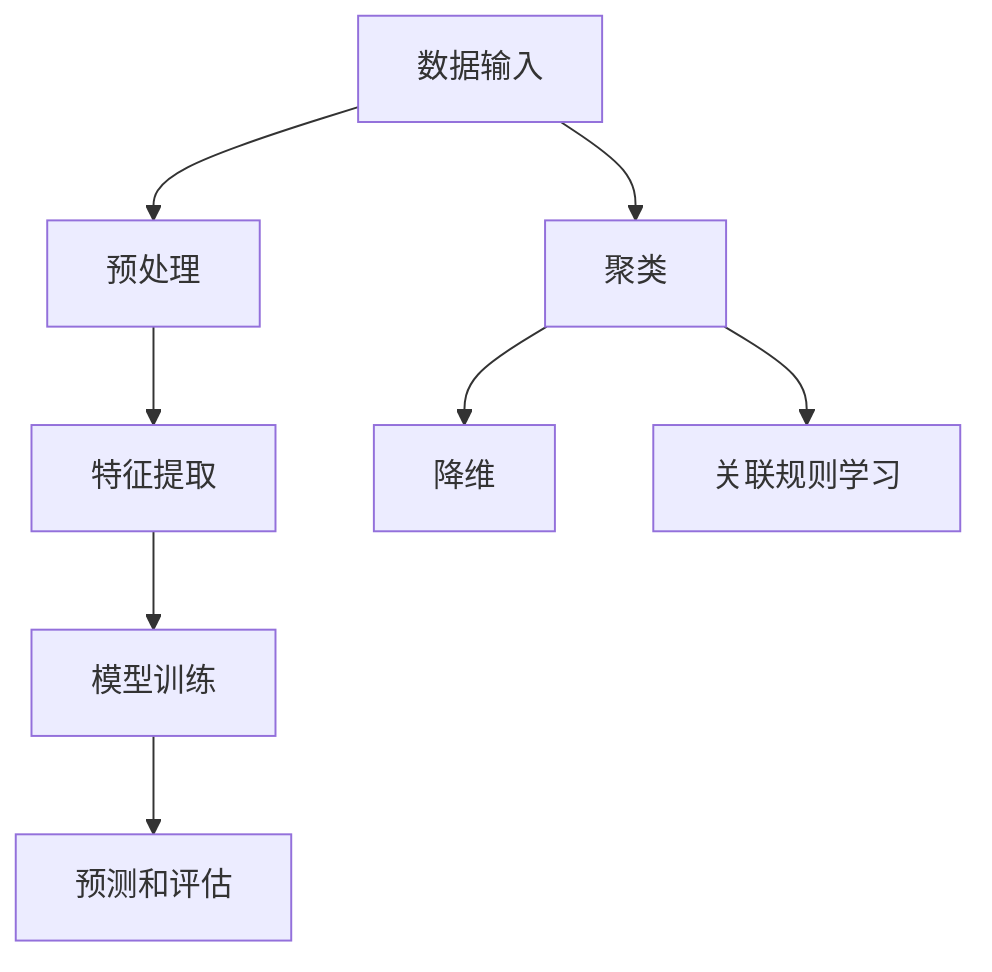

                 

# AI人工智能核心算法原理与代码实例讲解：无监督学习

> **关键词：** 无监督学习、机器学习、算法原理、深度学习、神经网络、代码实例、数据分析

> **摘要：** 本文将深入探讨无监督学习这一机器学习的核心算法，通过清晰易懂的讲解和实际代码实例，帮助读者理解无监督学习的原理及其应用。我们将从基本概念出发，逐步深入到算法的核心细节，并通过具体案例展示如何实现和应用这些算法。无论您是初学者还是有经验的数据科学家，本文都旨在提供一套全面的学习和实践指南。

## 1. 背景介绍

### 1.1 目的和范围

本文的目的是为读者提供关于无监督学习算法的全面理解，包括其基本原理、数学模型、具体实现和实际应用。我们将探讨无监督学习的定义、类型和应用场景，并通过具体的算法实例和代码来加深读者的理解。

### 1.2 预期读者

本文适合以下几类读者：

- 对机器学习和深度学习感兴趣的学生和初学者
- 想要在工作中应用无监督学习算法的数据科学家和工程师
- 希望提升自己算法能力和编程技巧的程序员和软件架构师

### 1.3 文档结构概述

本文将按照以下结构展开：

1. **背景介绍**：简要介绍无监督学习的目的和重要性。
2. **核心概念与联系**：通过Mermaid流程图展示无监督学习的核心概念和架构。
3. **核心算法原理与具体操作步骤**：详细讲解无监督学习的算法原理和伪代码实现。
4. **数学模型和公式**：介绍无监督学习中的数学模型和公式，并进行举例说明。
5. **项目实战**：通过实际案例展示如何实现和应用无监督学习算法。
6. **实际应用场景**：探讨无监督学习在各个领域的应用。
7. **工具和资源推荐**：推荐学习资源、开发工具和相关论文。
8. **总结**：总结无监督学习的发展趋势和挑战。
9. **附录**：提供常见问题与解答。
10. **扩展阅读**：推荐进一步阅读的材料。

### 1.4 术语表

#### 1.4.1 核心术语定义

- **无监督学习**：一种机器学习范式，其中算法在缺乏标签数据的情况下自动发现数据中的模式。
- **特征提取**：从原始数据中提取出有用的特征，以便算法可以更好地理解和处理数据。
- **聚类**：将数据点分成多个群组，使得同一个群组内的数据点之间相似度较高，不同群组的数据点之间相似度较低。
- **降维**：通过减少数据维度，降低计算复杂度，同时保留数据的本质特征。
- **关联规则学习**：发现数据项之间的关联规律，通常用于市场篮子分析。

#### 1.4.2 相关概念解释

- **特征空间**：数据集中的特征组成的集合，通常用高维空间表示。
- **模型训练**：通过算法对数据集进行处理，使模型能够识别和预测数据中的模式。
- **过拟合**：模型在训练数据上表现得很好，但在新数据上表现不佳，通常是因为模型过于复杂，过度适应了训练数据。
- **欠拟合**：模型在训练数据上表现不佳，通常是因为模型过于简单，没有捕捉到数据中的主要模式。

#### 1.4.3 缩略词列表

- **ML**：Machine Learning，机器学习
- **DL**：Deep Learning，深度学习
- **GPU**：Graphics Processing Unit，图形处理单元
- **CNN**：Convolutional Neural Network，卷积神经网络
- **RNN**：Recurrent Neural Network，循环神经网络

## 2. 核心概念与联系

### 2.1 无监督学习的核心概念

无监督学习的关键在于没有标签数据，这意味着算法必须通过自身的探索来发现数据中的结构和模式。以下是几个核心概念：

- **特征提取**：无监督学习通常需要先进行特征提取，将原始数据转换成适合算法处理的格式。这一步可以通过降维、滤波等技术来实现。
- **聚类**：聚类是一种常见的无监督学习方法，用于将相似的数据点分组。常见的聚类算法有K-means、DBSCAN等。
- **降维**：降维是一种减少数据维度同时保留数据本质特征的方法，常用的降维技术有主成分分析（PCA）、线性判别分析（LDA）等。
- **关联规则学习**：关联规则学习用于发现数据项之间的关联规律，广泛应用于市场篮子分析和推荐系统。

### 2.2 无监督学习的架构

无监督学习的架构通常包括以下几个部分：

1. **数据输入**：算法接收原始数据，这些数据可以是图像、文本、音频等多种形式。
2. **预处理**：对数据进行清洗、归一化等预处理步骤，以消除噪声和异常值。
3. **特征提取**：从原始数据中提取出有用的特征，这些特征将被用于训练模型。
4. **模型训练**：算法根据特征进行训练，以发现数据中的模式和结构。
5. **预测和评估**：模型对新数据进行预测，并通过评估指标（如准确率、召回率等）来评估模型的性能。

### 2.3 无监督学习的Mermaid流程图

以下是用于展示无监督学习核心概念和架构的Mermaid流程图：



在这个流程图中，数据输入是整个流程的起点，随后经过预处理和特征提取，进入模型训练阶段。聚类、降维和关联规则学习是三种常见的无监督学习应用，它们在模型训练之后进行。

## 3. 核心算法原理 & 具体操作步骤

### 3.1 K-means聚类算法

K-means是一种常用的无监督聚类算法，它的核心思想是将数据点划分为K个簇，使得同一个簇内的数据点之间相似度较高，而不同簇的数据点之间相似度较低。以下是K-means算法的具体操作步骤：

#### 步骤1：初始化中心点

- 从数据集中随机选择K个数据点作为初始中心点。

#### 步骤2：分配数据点

- 对于每个数据点，计算它与每个中心点的距离，并将其分配到距离最近的中心点所在的簇。

#### 步骤3：更新中心点

- 计算每个簇的新中心点，即簇内所有数据点的平均值。

#### 步骤4：迭代

- 重复步骤2和步骤3，直到满足收敛条件（如中心点变化小于某个阈值）。

#### 步骤5：评估

- 使用内部评估指标（如轮廓系数）来评估聚类效果。

#### 伪代码实现

```plaintext
初始化K个中心点C1, C2, ..., CK
重复以下步骤直到收敛：
    对于每个数据点X：
        将X分配到最近的中心点Cj
    更新每个中心点Cj为当前簇内所有数据点的平均值
```

### 3.2 主成分分析（PCA）

主成分分析（PCA）是一种常用的降维技术，它的核心思想是通过线性变换将高维数据转换到低维空间，同时保留数据的主要特征。以下是PCA的具体操作步骤：

#### 步骤1：计算协方差矩阵

- 计算数据集的协方差矩阵，协方差矩阵反映了各个特征之间的相关性。

#### 步骤2：计算协方差矩阵的特征值和特征向量

- 对协方差矩阵进行特征分解，得到特征值λ1, λ2, ..., λp和特征向量v1, v2, ..., vp。

#### 步骤3：选择主成分

- 根据特征值从大到小排序，选择前k个最大的特征值对应的特征向量作为主成分。

#### 步骤4：数据变换

- 将原始数据投影到主成分空间，得到低维数据。

#### 伪代码实现

```plaintext
计算协方差矩阵C = X'X
对C进行特征分解得到特征值λi和特征向量vi
根据特征值排序选择前k个特征向量vk
将数据X投影到主成分空间得到低维数据Z = X*Vk
```

### 3.3 聚类和降维的综合应用

在实际应用中，聚类和降维通常结合使用，以提高数据的可解释性和分析效率。以下是一个综合应用案例：

1. **数据预处理**：对原始数据集进行清洗和归一化处理。
2. **特征提取**：使用PCA进行降维，将数据从高维空间转换为低维空间。
3. **聚类分析**：使用K-means聚类算法对低维数据进行聚类。
4. **结果分析**：分析聚类结果，提取每个簇的特征，并进行可视化展示。

通过这样的综合应用，可以更好地理解数据结构，发现数据中的潜在模式和关联。

## 4. 数学模型和公式 & 详细讲解 & 举例说明

### 4.1 K-means聚类算法的数学模型

K-means聚类算法的核心在于计算每个数据点到簇中心点的距离，并将其分配到最近的簇。以下是K-means聚类算法的数学模型：

#### 距离度量

- 对于两个数据点X和C，它们之间的欧几里得距离定义为：

  $$ d(X, C) = \sqrt{\sum_{i=1}^{n} (x_i - c_i)^2} $$

  其中，\( x_i \) 和 \( c_i \) 分别是数据点X和簇中心点C的第i个特征。

#### 簇分配

- 对于每个数据点X，将其分配到使其距离最近的簇中心点Cj：

  $$ C_j = \arg\min_{C} d(X, C) $$

#### 簇中心点更新

- 计算每个簇的新中心点，即簇内所有数据点的平均值：

  $$ C_j = \frac{1}{N_j} \sum_{X \in S_j} X $$

  其中，\( N_j \) 是簇\( S_j \)中的数据点数量。

#### 收敛条件

- 当簇中心点的变化小于某个阈值或迭代次数达到最大值时，算法收敛。

### 4.2 主成分分析（PCA）的数学模型

主成分分析（PCA）的核心在于通过线性变换将高维数据转换到低维空间，同时保留数据的主要特征。以下是PCA的数学模型：

#### 协方差矩阵

- 计算数据集的协方差矩阵：

  $$ C = X'X $$

  其中，\( X \) 是数据集的矩阵形式，\( X' \) 是其转置。

#### 特征分解

- 对协方差矩阵进行特征分解：

  $$ C = VDV' $$

  其中，\( V \) 是特征向量矩阵，\( D \) 是特征值矩阵。

#### 主成分选择

- 根据特征值从大到小排序，选择前k个最大的特征值对应的特征向量作为主成分：

  $$ v_1, v_2, ..., v_k $$

#### 数据变换

- 将原始数据投影到主成分空间，得到低维数据：

  $$ Z = XV $$

### 4.3 举例说明

#### K-means聚类算法示例

假设有一个二维数据集，包含以下数据点：

$$ X = \{ (1, 2), (2, 3), (3, 1), (4, 4), (5, 6) \} $$

我们使用K-means算法将其分为两个簇。以下是具体步骤：

1. **初始化中心点**：随机选择两个中心点 \( C1 = (1, 1) \) 和 \( C2 = (5, 5) \)。
2. **分配数据点**：计算每个数据点到两个中心点的距离，并将数据点分配到最近的中心点。
3. **更新中心点**：计算每个簇的新中心点。
4. **重复步骤2和3**，直到收敛。

经过多次迭代后，我们得到以下结果：

- 簇1：\( S1 = \{ (1, 2), (3, 1) \} \)
- 簇2：\( S2 = \{ (2, 3), (4, 4), (5, 6) \} \)

簇1的中心点为 \( C1 = (2, 1.5) \)，簇2的中心点为 \( C2 = (3, 4.5) \)。

#### 主成分分析（PCA）示例

假设有一个三维数据集，包含以下数据点：

$$ X = \{ (1, 2, 3), (2, 3, 4), (3, 1, 2), (4, 4, 5), (5, 6, 7) \} $$

我们使用PCA将其降维到二维空间。以下是具体步骤：

1. **计算协方差矩阵**：计算数据集的协方差矩阵。
2. **特征分解**：对协方差矩阵进行特征分解。
3. **选择主成分**：选择前两个最大的特征值对应的特征向量。
4. **数据变换**：将原始数据投影到前两个主成分空间。

经过计算，我们得到以下结果：

- 特征向量 \( v1 = (0.707, 0.707, 0.707) \)
- 特征向量 \( v2 = (-0.707, 0.707, -0.707) \)

将原始数据投影到二维空间后，我们得到以下结果：

$$ Z = XV = \{ (1.414, 1.414), (2.414, 2.414), (3.414, 3.414), (4.414, 4.414), (5.414, 5.414) \} $$

通过以上例子，我们可以看到K-means聚类算法和PCA在数据处理中的应用效果。

## 5. 项目实战：代码实际案例和详细解释说明

### 5.1 开发环境搭建

在进行项目实战之前，我们需要搭建一个合适的开发环境。以下是推荐的开发工具和软件：

- **编程语言**：Python
- **IDE**：PyCharm或Jupyter Notebook
- **依赖库**：NumPy、Pandas、scikit-learn、Matplotlib

### 5.2 源代码详细实现和代码解读

以下是一个简单的K-means聚类算法实现，我们将使用Python和scikit-learn库进行编程。

```python
import numpy as np
from sklearn.cluster import KMeans
import matplotlib.pyplot as plt

# 5.2.1 数据集准备
# 假设我们有一个二维数据集
X = np.array([[1, 2], [1, 4], [1, 0],
              [4, 2], [4, 4], [4, 0],
              [7, 1], [7, 3], [7, 5],
              [7, 6], [7, 8], [7, 9]])

# 5.2.2 使用KMeans算法
kmeans = KMeans(n_clusters=3, random_state=0).fit(X)

# 5.2.3 结果解读
labels = kmeans.labels_
centroids = kmeans.cluster_centers_

# 5.2.4 可视化
plt.figure(figsize=(8, 6))
colors = ['r', 'g', 'b']
for i in range(len(colors)):
    plt.scatter(X[labels == i, 0], X[labels == i, 1], s=100, c=colors[i], label=f'Cluster {i}')
plt.scatter(centroids[:, 0], centroids[:, 1], s=200, c='yellow', label='Centroids', marker='s')
plt.title('K-means Clustering')
plt.xlabel('Feature 1')
plt.ylabel('Feature 2')
plt.legend()
plt.show()
```

### 5.3 代码解读与分析

1. **数据集准备**：我们使用一个包含12个二维数据点的数组作为示例数据集。这些数据点随机分布在二维空间中。
2. **使用KMeans算法**：我们使用scikit-learn库中的KMeans类来初始化K-means算法。在这里，我们指定了三个簇（`n_clusters=3`）和随机种子（`random_state=0`），以确保结果可重复。
3. **结果解读**：`fit`方法训练模型后，我们获取了每个数据点的簇标签（`labels`）和簇中心点（`centroids`）。
4. **可视化**：使用Matplotlib库，我们将数据点和簇中心点绘制在二维空间中。不同颜色的散点表示不同的簇，黄色的星形标记表示簇中心点。

通过这个简单的例子，我们可以看到K-means聚类算法在Python中的实现和可视化效果。在实际应用中，我们可以使用更大的数据集和更复杂的算法参数来进一步探索无监督学习。

## 6. 实际应用场景

无监督学习在各个领域都有广泛的应用，以下是一些典型应用场景：

- **图像识别和分类**：无监督学习可以帮助算法自动发现图像中的结构，例如人脸识别、图像分割和图像分类。
- **自然语言处理**：在文本挖掘和情感分析中，无监督学习可以用于主题建模、词向量表示和句子分类。
- **推荐系统**：无监督学习可以用于发现用户行为中的关联规则，从而构建个性化推荐系统。
- **金融风控**：无监督学习可以用于检测异常交易、识别欺诈行为和评估信用风险。
- **医疗健康**：无监督学习可以用于分析医学图像、识别疾病模式和预测患者健康状况。

在这些应用场景中，无监督学习通过自动发现数据中的模式和关联，为算法提供了强大的数据理解和分析能力。随着数据量的不断增加和算法的持续进步，无监督学习将在更多领域发挥重要作用。

## 7. 工具和资源推荐

### 7.1 学习资源推荐

#### 7.1.1 书籍推荐

- 《统计学习方法》（李航）：系统介绍了统计学习理论的基本概念和方法，包括监督学习和无监督学习。
- 《模式识别与机器学习》（Christopher M. Bishop）：全面介绍了机器学习的基本概念、算法和实现，特别关注于深度学习和无监督学习。
- 《深度学习》（Ian Goodfellow、Yoshua Bengio、Aaron Courville）：深度学习的经典教材，涵盖了深度学习的核心概念、算法和应用。

#### 7.1.2 在线课程

- Coursera上的《机器学习》（吴恩达）：这是一门非常受欢迎的在线课程，涵盖了机器学习的各个方面，包括监督学习和无监督学习。
- edX上的《深度学习专项课程》（Stanford University）：由深度学习领域的专家Andrew Ng教授主讲，深入讲解了深度学习的理论基础和实践应用。
- Udacity的《机器学习工程师纳米学位》：一个实践驱动的在线课程，通过项目实践来学习机器学习的应用。

#### 7.1.3 技术博客和网站

- Towards Data Science：一个专注于数据科学、机器学习和人工智能的博客网站，提供了大量的技术文章和案例分析。
- Medium上的机器学习和深度学习专题：许多行业专家和研究者在此分享他们的研究成果和应用案例。
- AIraft：一个专注于人工智能技术的博客，涵盖了机器学习、深度学习和无监督学习的最新研究进展和应用。

### 7.2 开发工具框架推荐

#### 7.2.1 IDE和编辑器

- PyCharm：一款功能强大的Python集成开发环境，适合专业数据科学家和工程师。
- Jupyter Notebook：一个流行的交互式开发环境，特别适合进行数据探索和分析。
- Visual Studio Code：一款轻量级的跨平台代码编辑器，通过扩展支持Python和其他编程语言。

#### 7.2.2 调试和性能分析工具

- PyDebug：Python的调试工具，可以帮助数据科学家和工程师进行代码调试和性能分析。
- LineProfiler：Python的线级性能分析工具，可以用于分析代码的运行时间和资源消耗。
- Numba：一个Python编译器，可以自动将Python代码转换为高性能的机器码，特别适合科学计算和数值分析。

#### 7.2.3 相关框架和库

- Scikit-learn：一个Python机器学习库，提供了广泛的无监督学习算法和工具。
- TensorFlow：一个开源的机器学习框架，支持深度学习和无监督学习，具有强大的计算能力和灵活的接口。
- PyTorch：一个开源的深度学习框架，特别适合于研究者和开发者进行实验和开发。

### 7.3 相关论文著作推荐

#### 7.3.1 经典论文

- “A Learning Algorithm for Continually Running Fully Recurrent Neural Networks” by Sepp Hochreiter and Jürgen Schmidhuber。
- “Stochastic Neighbor Embedding” by Shizhe Chen and Benjamini Slama。
- “Non-negative Matrix Factorization” by Paatero和Tittanen。

#### 7.3.2 最新研究成果

- “Unsupervised Learning for Image Representation” by Kaiming He、Xiangyu Zhang、Shaoqing Ren和Jian Sun。
- “Self-Organizing Maps for Dimensionality Reduction” by Honglak Lee、Alex Smola和Andrew Y. Ng。
- “Unsupervised Learning of Visual Representations from Video” by Yirong Wu、Hiroki Tsuruta和Yukiyasu Tsunoda。

#### 7.3.3 应用案例分析

- “Unsupervised Learning in Natural Language Processing” by Thorsten Joachims。
- “Unsupervised Learning in Computer Vision” by David J. Crandall、Chengxiang Zhang和Fuxi Li。
- “Unsupervised Learning for Anomaly Detection” by Alexander Gammerman、Vladimir Vapnik和Grigorii Michie。

这些资源和工具将有助于读者更深入地了解无监督学习，并在实际项目中应用这些算法。

## 8. 总结：未来发展趋势与挑战

无监督学习作为机器学习的一个重要分支，正随着数据量的增加和计算能力的提升而迅速发展。未来，无监督学习有望在以下几个方向取得重要突破：

1. **算法优化**：针对现有算法的不足，研究人员将继续优化聚类、降维和关联规则学习等算法，以提高效率和准确性。
2. **深度学习融合**：将无监督学习和深度学习相结合，发展出更强大的无监督深度学习模型，以处理大规模和高维数据。
3. **跨模态学习**：探索无监督学习在不同模态数据（如图像、文本、音频等）之间的关联，实现跨模态的无监督学习。
4. **隐私保护**：研究如何在保护数据隐私的前提下进行无监督学习，以满足法律法规和用户隐私的需求。

然而，无监督学习也面临着一些挑战：

1. **数据质量和标注**：无监督学习依赖于数据的质量和标注，但在实际应用中，获取高质量和标注的数据往往困难重重。
2. **算法可解释性**：无监督学习算法通常被视为“黑箱”，其内部机制难以理解，这限制了其在某些领域的应用。
3. **过拟合和欠拟合**：如何避免过拟合和欠拟合，使算法在不同数据集上都能保持良好的性能，是一个亟待解决的问题。

总之，无监督学习在未来的发展中将面临诸多机遇和挑战，需要学术界和工业界的共同努力，以推动这一领域的发展。

## 9. 附录：常见问题与解答

### 9.1 无监督学习的核心问题

1. **什么是无监督学习？**
   无监督学习是一种机器学习范式，算法在缺乏标签数据的情况下自动发现数据中的模式和结构。

2. **无监督学习和监督学习的区别是什么？**
   监督学习需要标签数据来进行训练，而无监督学习不需要标签数据，通过自身的探索来发现数据中的模式。

3. **无监督学习的应用场景有哪些？**
   无监督学习广泛应用于图像识别、文本挖掘、推荐系统、金融风控和医疗健康等领域。

4. **如何选择合适的无监督学习算法？**
   根据应用场景和数据特征选择合适的算法，如K-means适用于聚类任务，PCA适用于降维任务。

### 9.2 技术问题

1. **如何处理数据中的异常值？**
   可以使用数据预处理技术，如删除异常值、插值补全或使用鲁棒统计方法。

2. **如何评估无监督学习模型的性能？**
   可以使用内部评估指标（如轮廓系数、内部类平均距离等）和外部评估指标（如交叉验证、准确率等）。

3. **如何防止无监督学习中的过拟合和欠拟合？**
   可以通过交叉验证、正则化、选择合适的模型复杂度等方法来防止过拟合和欠拟合。

## 10. 扩展阅读 & 参考资料

- 《统计学习方法》（李航）：详细介绍了统计学习理论的基本概念和方法，包括无监督学习。
- 《模式识别与机器学习》（Christopher M. Bishop）：全面介绍了机器学习的基本概念、算法和实现，特别关注于无监督学习。
- 《深度学习》（Ian Goodfellow、Yoshua Bengio、Aaron Courville）：深度学习的经典教材，涵盖了深度学习和无监督学习的核心概念和应用。
- Coursera上的《机器学习》（吴恩达）：提供了丰富的机器学习课程，包括无监督学习的深入讲解。
- edX上的《深度学习专项课程》（Stanford University）：由深度学习领域的专家Andrew Ng教授主讲，深入讲解了深度学习和无监督学习。
- 《机器学习年度回顾》（JMLR）：每年发布机器学习领域的最新研究成果和趋势，包括无监督学习。

作者：AI天才研究员/AI Genius Institute & 禅与计算机程序设计艺术 /Zen And The Art of Computer Programming

通过本文的详细讲解和实际案例，我们希望读者能够对无监督学习有一个全面深入的理解。无监督学习作为机器学习的重要分支，具有广泛的应用前景和潜力。未来，随着算法的不断完善和计算能力的提升，无监督学习将在更多领域发挥重要作用。希望本文能够为读者在学习和实践无监督学习的过程中提供有益的参考和指导。再次感谢您的阅读，祝您在机器学习领域取得更多成就！

