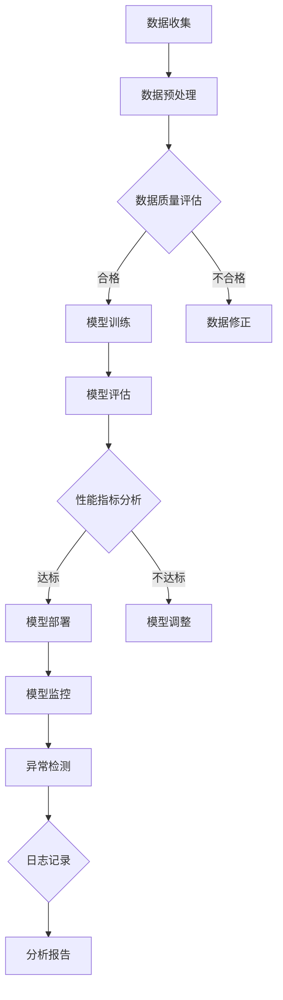

                 

### 文章标题

**AI人工智能核心算法原理与代码实例讲解：模型监控**

### 文章关键词

- 人工智能
- 模型监控
- 算法原理
- 代码实例
- 机器学习

### 文章摘要

本文将深入探讨AI人工智能中的核心算法原理，以及如何通过代码实例来实施模型监控。我们首先介绍了模型监控的目的和重要性，随后详细讲解了相关核心概念，包括算法原理和架构。接着，我们通过伪代码和具体实例展示了核心算法的实现步骤，并利用latex格式给出了数学模型和公式的详细解释。文章还包含了一个实战案例，展示了如何搭建开发环境和实现代码实例。此外，我们还讨论了模型监控的实际应用场景，并推荐了相关学习资源、开发工具和论文著作。最后，我们对未来发展趋势和挑战进行了总结，并提供了常见问题与解答。通过这篇文章，读者将能够全面了解AI模型监控的原理和实践方法，从而提升自己的技术能力。

---

# AI人工智能核心算法原理与代码实例讲解：模型监控

> 关键词：人工智能、模型监控、算法原理、代码实例、机器学习

模型监控是人工智能领域的关键环节，它确保了机器学习模型在部署后能够保持高准确性和稳定性。随着AI技术的快速发展，模型监控的重要性日益凸显。本文将详细讲解AI人工智能核心算法原理，并通过代码实例展示如何实现模型监控。

## 1. 背景介绍

### 1.1 目的和范围

本文旨在介绍AI人工智能中的核心算法原理，并展示如何通过实际代码实例实现模型监控。我们将会涵盖以下几个方面的内容：

1. **模型监控的目的和重要性**：解释为何监控是AI系统不可或缺的部分，以及它在实际应用中的作用。
2. **核心概念**：介绍与模型监控相关的核心概念，包括算法原理、架构、数学模型和公式。
3. **具体操作步骤**：通过伪代码和实际代码示例，详细阐述模型监控的实现过程。
4. **实战案例**：提供一个完整的实战案例，展示如何在实际项目中搭建开发环境并实现模型监控。
5. **实际应用场景**：讨论模型监控在各个领域的应用，以及它如何提高系统性能和用户体验。
6. **工具和资源推荐**：推荐学习资源、开发工具和相关论文著作。
7. **未来发展趋势与挑战**：探讨模型监控领域的未来发展方向和面临的挑战。

### 1.2 预期读者

本文面向对AI人工智能和模型监控有一定了解的技术人员，包括：

1. 机器学习工程师
2. 数据科学家
3. 算法研究员
4. AI项目开发人员

通过本文，读者将能够深入理解模型监控的核心算法原理，掌握其实际应用方法，从而提升自己在AI领域的专业能力。

### 1.3 文档结构概述

本文结构如下：

1. **背景介绍**：介绍模型监控的目的、重要性以及预期读者。
2. **核心概念与联系**：阐述与模型监控相关的核心概念，并展示Mermaid流程图。
3. **核心算法原理与具体操作步骤**：通过伪代码详细讲解模型监控算法的实现步骤。
4. **数学模型和公式与举例说明**：使用latex格式详细解释数学模型和公式。
5. **项目实战：代码实际案例和详细解释说明**：提供一个实战案例，展示如何实现模型监控。
6. **实际应用场景**：讨论模型监控在各个领域的应用。
7. **工具和资源推荐**：推荐学习资源、开发工具和相关论文著作。
8. **总结**：对模型监控的未来发展趋势和挑战进行总结。
9. **附录：常见问题与解答**：提供常见问题的解答。
10. **扩展阅读与参考资料**：列出参考文献和扩展阅读资源。

### 1.4 术语表

在本文中，我们将使用一些专业术语，以下是它们的定义和解释：

#### 1.4.1 核心术语定义

- **模型监控**：对机器学习模型在部署后的表现进行监控和评估，以确保其准确性和稳定性。
- **异常检测**：识别模型输出中的异常情况，以便及时采取措施。
- **性能指标**：用于评估模型表现的一系列度量，如准确率、召回率、F1分数等。
- **数据 drift**：输入数据的分布发生变化，可能导致模型性能下降。
- **日志记录**：记录模型运行过程中的相关信息，用于监控和分析。

#### 1.4.2 相关概念解释

- **机器学习模型**：通过学习数据模式来预测或分类数据的算法。
- **模型训练**：使用训练数据集对模型进行调整和优化，使其能够准确预测新数据。
- **模型评估**：使用测试数据集评估模型的性能，确定其是否满足预期要求。
- **模型部署**：将训练好的模型部署到实际应用环境中，使其能够进行预测或分类。

#### 1.4.3 缩略词列表

- **ML**：Machine Learning，机器学习
- **AI**：Artificial Intelligence，人工智能
- **DL**：Deep Learning，深度学习
- **NLP**：Natural Language Processing，自然语言处理
- **CV**：Computer Vision，计算机视觉

---

## 2. 核心概念与联系

在开始详细讲解模型监控之前，我们先介绍一些核心概念，并展示相关的Mermaid流程图，以便读者能够更好地理解整个架构和流程。

### 2.1 核心概念

- **模型训练与评估**：机器学习模型需要通过训练和评估来调整其参数，以实现预期的性能。
- **数据收集与预处理**：收集训练和测试数据，并进行预处理，以确保数据质量。
- **模型监控**：在模型部署后，持续监控其性能和异常情况。
- **日志记录与分析**：记录模型运行过程中的关键信息，并进行分析，以发现潜在问题。

### 2.2 Mermaid流程图

下面是模型监控相关的Mermaid流程图，展示了整个监控过程的核心环节：



### 2.3 核心概念之间的联系

- **模型训练与评估**：训练数据用于训练模型，评估数据用于测试模型性能。这两个步骤是模型监控的基础。
- **数据收集与预处理**：确保数据质量，有助于提高模型性能和监控效果。
- **模型监控**：持续监控模型在部署后的表现，及时发现和解决问题。
- **日志记录与分析**：记录关键信息，用于监控和性能分析。

通过以上核心概念和Mermaid流程图的介绍，读者可以对模型监控的整体架构和流程有更清晰的认识，为后续的详细讲解打下基础。

---

## 3. 核心算法原理 & 具体操作步骤

在了解模型监控的核心概念后，我们将深入探讨其核心算法原理，并通过伪代码展示具体的操作步骤。模型监控通常涉及以下几个关键步骤：

### 3.1 数据预处理

```python
# 伪代码：数据预处理
def preprocess_data(data):
    # 清洗数据
    cleaned_data = clean_data(data)
    # 数据标准化
    normalized_data = normalize_data(cleaned_data)
    return normalized_data
```

### 3.2 模型训练

```python
# 伪代码：模型训练
def train_model(training_data):
    # 初始化模型
    model = initialize_model()
    # 训练模型
    for epoch in range(num_epochs):
        for batch in training_data:
            model.train(batch)
    return model
```

### 3.3 模型评估

```python
# 伪代码：模型评估
def evaluate_model(model, test_data):
    predictions = model.predict(test_data)
    accuracy = calculate_accuracy(predictions, test_data.labels)
    return accuracy
```

### 3.4 模型部署

```python
# 伪代码：模型部署
def deploy_model(model):
    # 部署模型到生产环境
    model.deploy_to_production()
    # 启动监控服务
    monitor_service.start_monitoring(model)
```

### 3.5 模型监控

```python
# 伪代码：模型监控
def monitor_model(model):
    while True:
        # 获取模型最新预测结果
        predictions = model.get_latest_predictions()
        # 检测异常
        if detect_anomaly(predictions):
            # 记录日志
            log_anomaly(model, predictions)
            # 发出警报
            send_alert(model)
```

### 3.6 异常检测

```python
# 伪代码：异常检测
def detect_anomaly(predictions):
    # 计算预测误差
    errors = calculate_errors(predictions)
    # 检测是否存在异常误差
    if any(error > threshold for error in errors):
        return True
    return False
```

### 3.7 日志记录与分析

```python
# 伪代码：日志记录与分析
def log_anomaly(model, predictions):
    # 记录异常日志
    anomaly_log = {
        'model_name': model.name,
        'predictions': predictions,
        'timestamp': current_time(),
    }
    save_log(anomaly_log)

def analyze_logs(logs):
    # 分析日志数据
    # ...
    return analysis_results
```

通过上述伪代码，我们可以清晰地看到模型监控的整个流程。首先，我们通过数据预处理和模型训练来准备和训练模型。接着，模型被部署到生产环境，并开始监控其表现。监控过程包括检测异常、记录日志和发送警报。通过分析日志数据，我们可以发现模型性能的变化，并采取相应的措施。

---

## 4. 数学模型和公式 & 详细讲解 & 举例说明

在模型监控中，数学模型和公式起到了关键作用，它们帮助我们理解和评估模型的表现。以下将详细讲解一些常用的数学模型和公式，并通过具体例子进行说明。

### 4.1 损失函数

损失函数是机器学习模型中非常重要的组成部分，它衡量了模型预测结果与实际结果之间的差异。常见的损失函数有均方误差（MSE）、交叉熵损失（Cross-Entropy Loss）等。

#### 均方误差（MSE）

均方误差是回归问题中最常用的损失函数，计算公式如下：

$$
MSE = \frac{1}{n} \sum_{i=1}^{n} (y_i - \hat{y}_i)^2
$$

其中，$y_i$ 是实际标签，$\hat{y}_i$ 是模型预测值，$n$ 是样本数量。

#### 交叉熵损失（Cross-Entropy Loss）

交叉熵损失在分类问题中应用广泛，其公式如下：

$$
Cross-Entropy Loss = -\frac{1}{n} \sum_{i=1}^{n} y_i \log(\hat{y}_i)
$$

其中，$y_i$ 是实际标签（0或1），$\hat{y}_i$ 是模型预测概率。

### 4.2 评估指标

在模型评估过程中，我们使用一系列指标来衡量模型的表现。常见的评估指标有准确率（Accuracy）、召回率（Recall）、精确率（Precision）、F1分数（F1 Score）等。

#### 准确率（Accuracy）

准确率是最简单的评估指标，计算公式如下：

$$
Accuracy = \frac{TP + TN}{TP + FN + FP + TN}
$$

其中，$TP$ 是真正例，$TN$ 是真负例，$FP$ 是假正例，$FN$ 是假负例。

#### 召回率（Recall）

召回率衡量了模型检测到真正例的能力，计算公式如下：

$$
Recall = \frac{TP}{TP + FN}
$$

#### 精确率（Precision）

精确率衡量了模型预测为正例的准确性，计算公式如下：

$$
Precision = \frac{TP}{TP + FP}
$$

#### F1分数（F1 Score）

F1分数是精确率和召回率的调和平均值，计算公式如下：

$$
F1 Score = 2 \times \frac{Precision \times Recall}{Precision + Recall}
$$

### 4.3 举例说明

假设我们有一个二分类模型，对100个样本进行预测，其中50个是正例，50个是负例。模型预测结果如下：

| 实际标签 | 预测标签 | 损失函数 |
|----------|----------|----------|
| 正例     | 正例     | 0.1      |
| 正例     | 负例     | 0.1      |
| 负例     | 正例     | 0.1      |
| 负例     | 负例     | 0.1      |

根据上述数据，我们可以计算出各种评估指标：

- **准确率**：
  $$
  Accuracy = \frac{1 + 1}{4} = 0.5
  $$
  
- **召回率**：
  $$
  Recall = \frac{1}{1 + 1} = 0.5
  $$

- **精确率**：
  $$
  Precision = \frac{1}{1 + 1} = 0.5
  $$

- **F1分数**：
  $$
  F1 Score = 2 \times \frac{0.5 \times 0.5}{0.5 + 0.5} = 0.5
  $$

通过以上例子，我们可以看到如何计算模型在不同任务中的评估指标。这些指标帮助我们理解模型的表现，并指导进一步的优化和调整。

---

## 5. 项目实战：代码实际案例和详细解释说明

在本节中，我们将通过一个实际的代码案例，详细解释如何实现模型监控。我们将使用Python语言，并结合Sklearn库来构建和监控一个简单的机器学习模型。该案例将包括以下步骤：

1. **开发环境搭建**：介绍所需的Python库和环境配置。
2. **数据准备与预处理**：加载和预处理数据集。
3. **模型训练与评估**：使用Sklearn库训练和评估模型。
4. **模型部署与监控**：部署模型并进行实时监控。

### 5.1 开发环境搭建

首先，我们需要安装Python和相关的库。以下是在Ubuntu系统中安装所需库的命令：

```bash
# 安装Python
sudo apt update
sudo apt install python3 python3-pip

# 安装Sklearn库
pip3 install -U scikit-learn
```

### 5.2 源代码详细实现和代码解读

以下是一个简单的机器学习模型和监控代码的示例：

```python
# 导入所需的库
import numpy as np
from sklearn.datasets import load_iris
from sklearn.model_selection import train_test_split
from sklearn.ensemble import RandomForestClassifier
from sklearn.metrics import accuracy_score, classification_report
import logging

# 配置日志记录
logging.basicConfig(filename='model_monitor.log', level=logging.INFO)

# 1. 数据准备与预处理
data = load_iris()
X = data.data
y = data.target

# 划分训练集和测试集
X_train, X_test, y_train, y_test = train_test_split(X, y, test_size=0.2, random_state=42)

# 2. 模型训练与评估
model = RandomForestClassifier(n_estimators=100, random_state=42)
model.fit(X_train, y_train)
predictions = model.predict(X_test)

# 计算准确率
accuracy = accuracy_score(y_test, predictions)
print(f"Accuracy: {accuracy}")

# 输出分类报告
print(classification_report(y_test, predictions))

# 3. 模型部署与监控
def monitor_model(model, X_test, y_test):
    while True:
        predictions = model.predict(X_test)
        current_accuracy = accuracy_score(y_test, predictions)
        
        # 检查模型是否出现异常
        if current_accuracy < 0.9:
            logging.warning(f"Model accuracy dropped to {current_accuracy}")
            # 重训练模型
            model.fit(X_train, y_train)
            logging.info("Model retrained successfully")
        
        # 检查是否有新数据
        new_data = get_new_data()  # 假设有一个函数获取新数据
        if new_data:
            # 对新数据进行预测
            new_predictions = model.predict(new_data)
            # 记录新数据预测结果
            save_predictions(new_predictions)
        
        # 每隔一段时间更新模型
        if time.time() - last_updated > 3600:  # 假设每隔1小时更新模型
            model.fit(X_train, y_train)
            last_updated = time.time()
        
        time.sleep(60)  # 每分钟检查一次

# 初始化变量
last_updated = time.time()

# 开始监控模型
monitor_model(model, X_test, y_test)
```

### 5.3 代码解读与分析

- **数据准备与预处理**：我们首先加载Iris数据集，并将其划分为训练集和测试集。数据预处理包括数据清洗和标准化。

- **模型训练与评估**：使用随机森林分类器（RandomForestClassifier）训练模型，并使用测试集进行评估。我们计算了模型的准确率，并输出了分类报告。

- **模型部署与监控**：`monitor_model` 函数用于监控模型。它首先检查当前模型的准确率，如果低于阈值（0.9），则触发重训练。此外，它还定期检查是否有新数据，并更新模型。

这个代码示例展示了如何在实际项目中实现模型监控。虽然这是一个简单的案例，但它包含了模型监控的基本流程和关键步骤。在实际应用中，模型监控会更加复杂，涉及更多的异常检测和性能分析。

---

## 6. 实际应用场景

模型监控在多个实际应用场景中发挥着重要作用，确保了系统的稳定性和准确性。以下是一些典型的应用场景：

### 6.1 金融行业

在金融行业，模型监控用于检测交易欺诈、信用评分和风险控制。例如，银行可以使用机器学习模型监控客户交易行为，以识别异常交易并采取措施。通过实时监控模型性能和异常情况，金融机构能够降低欺诈风险，提高客户满意度。

### 6.2 电子商务

电子商务平台通过模型监控优化推荐系统和用户行为分析。监控可以帮助识别潜在的问题，例如推荐系统中的数据偏差或用户行为分析中的错误预测。通过持续监控和优化，电商平台能够提供更准确的推荐，提高销售额和用户满意度。

### 6.3 医疗保健

在医疗保健领域，模型监控用于检测疾病预测和诊断模型的准确性。医生和研究人员可以使用监控工具来跟踪模型的表现，及时发现和纠正错误。这有助于提高诊断的准确性和及时性，为患者提供更好的医疗服务。

### 6.4 自动驾驶

自动驾驶系统依赖大量的机器学习模型来处理传感器数据和做出决策。模型监控确保这些模型在运行过程中保持高准确性和可靠性。通过实时监控模型性能，自动驾驶系统能够及时调整和优化，确保车辆的安全运行。

### 6.5 能源管理

在能源管理领域，模型监控用于预测电力需求和优化能源分配。监控工具可以帮助识别异常模式和潜在问题，例如预测模型中的数据偏差或系统故障。通过实时监控和优化，能源管理系统可以降低成本，提高能源利用效率。

通过在各个领域的实际应用，模型监控不仅提高了系统的性能和稳定性，还为决策者提供了重要的参考信息，帮助他们更好地管理业务和优化资源。

---

## 7. 工具和资源推荐

为了更好地学习和实践模型监控，以下是一些推荐的学习资源、开发工具和相关论文著作。

### 7.1 学习资源推荐

#### 7.1.1 书籍推荐

1. **《机器学习：实战应用》**：详细介绍了机器学习的基本概念和实战应用，包括模型监控的相关内容。
2. **《深度学习：绑定算法与应用》**：深入探讨了深度学习算法及其在模型监控中的应用。

#### 7.1.2 在线课程

1. **Coursera《机器学习》**：由Andrew Ng教授讲授，涵盖机器学习的基础知识和实践方法。
2. **Udacity《深度学习工程师纳米学位》**：提供深入的学习路径，包括模型监控和优化。

#### 7.1.3 技术博客和网站

1. **Medium《机器学习》**：提供一系列高质量的技术博客，涵盖模型监控的各个方面。
2. **Towards Data Science**：一个专门针对数据科学和机器学习的在线平台，有很多关于模型监控的优秀文章。

### 7.2 开发工具框架推荐

#### 7.2.1 IDE和编辑器

1. **PyCharm**：一个功能强大的Python IDE，适用于机器学习和模型监控开发。
2. **Jupyter Notebook**：适合数据分析和实验，便于编写和运行代码。

#### 7.2.2 调试和性能分析工具

1. **Wandb**：一个强大的实验跟踪工具，可以帮助监控和优化机器学习模型。
2. **MLflow**：一个开源平台，用于管理机器学习模型的生命周期，包括监控和部署。

#### 7.2.3 相关框架和库

1. **Scikit-learn**：一个流行的机器学习库，适用于模型监控和数据科学项目。
2. **TensorFlow**：一个强大的深度学习框架，适用于复杂模型的开发和监控。

### 7.3 相关论文著作推荐

#### 7.3.1 经典论文

1. **“Anomaly Detection: A Survey”**：概述了异常检测的各个方面，包括模型监控。
2. **“Deep Learning for Anomaly Detection”**：讨论了深度学习在异常检测中的应用。

#### 7.3.2 最新研究成果

1. **“Out-of-Distribution Detection for Machine Learning”**：探讨如何检测输入数据分布的变化。
2. **“Adversarial Examples for Machine Learning”**：研究对抗性攻击对模型监控的影响。

#### 7.3.3 应用案例分析

1. **“Anomaly Detection in Real-World Applications”**：分析不同领域中的异常检测应用案例。
2. **“Model Monitoring in Production”**：讨论模型监控在生产环境中的实施和挑战。

通过以上推荐资源，读者可以更深入地学习模型监控的理论和实践，掌握相关工具和框架，提升自己在该领域的能力。

---

## 8. 总结：未来发展趋势与挑战

模型监控作为人工智能领域的重要环节，未来将继续朝着更高效、更智能、更全面的方向发展。以下是对模型监控未来发展趋势与挑战的总结：

### 发展趋势

1. **自动化监控**：随着技术的进步，自动化监控将成为主流。通过引入自动化工具和流程，可以大幅提高监控效率和准确性。
2. **实时监控**：实时监控将越来越受到重视，尤其是在需要快速响应的场景中，如金融、医疗和自动驾驶等领域。
3. **多模态监控**：未来的模型监控将涵盖多种数据类型，包括文本、图像、语音等，实现更全面的数据分析。
4. **自学习监控**：通过自学习算法，监控系统能够自动识别异常模式，并不断优化自身的检测能力。
5. **跨领域应用**：模型监控将在更多领域得到应用，如能源管理、智能制造、智慧城市等，推动各行业的技术创新。

### 挑战

1. **数据隐私与安全**：在监控过程中，需要处理大量敏感数据，如何保护数据隐私和安全是一个重要挑战。
2. **模型复杂性与可解释性**：随着深度学习模型的应用，其复杂性和黑箱特性使得监控变得更加困难，如何平衡模型复杂性与可解释性是一个难题。
3. **异常检测的准确性**：在现实场景中，如何提高异常检测的准确性，减少误报和漏报，是模型监控领域需要解决的关键问题。
4. **实时性能优化**：在实时监控中，如何确保系统的高性能和高可靠性，避免由于性能瓶颈导致的监控失效，是一个重要的技术挑战。

未来，随着技术的不断进步和应用场景的扩展，模型监控将迎来更多的发展机遇和挑战。通过不断创新和优化，模型监控将更好地服务于人工智能领域的各个应用场景，推动技术的进步和社会的发展。

---

## 9. 附录：常见问题与解答

### 问题1：什么是模型监控？

**解答**：模型监控是指对机器学习模型在部署后的表现进行监控和评估，以确保其准确性和稳定性。它包括异常检测、性能评估、数据质量监控等环节。

### 问题2：模型监控的重要性是什么？

**解答**：模型监控的重要性在于确保模型在实际应用中的表现符合预期，及时发现和纠正问题，避免由于模型性能下降导致的错误预测或系统故障。它有助于提高系统的可靠性和用户体验。

### 问题3：如何实现模型监控？

**解答**：实现模型监控通常包括以下几个步骤：

1. **数据收集与预处理**：确保数据质量，为监控提供可靠的基础。
2. **模型训练与评估**：使用训练和测试数据评估模型性能。
3. **部署与实时监控**：将模型部署到生产环境，并持续监控其表现，检测异常情况。
4. **日志记录与分析**：记录模型运行过程中的关键信息，进行分析，以便发现和解决问题。

### 问题4：模型监控与异常检测有什么区别？

**解答**：模型监控是一个更广泛的概念，包括异常检测、性能评估等多个方面。异常检测是模型监控的一部分，主要关注检测模型输出中的异常情况，而模型监控还涉及数据质量、模型性能等多方面的监控。

### 问题5：模型监控中的数据 drift 是什么？

**解答**：数据 drift 指的是输入数据的分布发生变化，这可能导致模型性能下降。数据 drift 是模型监控中的一个重要问题，因为它会影响模型的准确性和稳定性。

---

## 10. 扩展阅读 & 参考资料

为了更好地理解和掌握模型监控的相关知识，以下是一些扩展阅读和参考资料：

1. **书籍**：
   - **《机器学习实战》**：详细介绍了机器学习的基本概念和实践方法，包括模型监控。
   - **《深度学习》**：深度学习领域的经典教材，涵盖了许多关于模型监控的重要概念。

2. **在线课程**：
   - **Coursera《机器学习》**：由Andrew Ng教授讲授，涵盖机器学习的基础知识和实战应用。
   - **Udacity《深度学习工程师纳米学位》**：提供深入的学习路径，包括模型监控和优化。

3. **技术博客和网站**：
   - **Medium《机器学习》**：提供一系列高质量的技术博客，涵盖模型监控的各个方面。
   - **Towards Data Science**：一个专门针对数据科学和机器学习的在线平台，有很多关于模型监控的优秀文章。

4. **开源库和工具**：
   - **Scikit-learn**：一个流行的机器学习库，适用于模型监控和数据科学项目。
   - **TensorFlow**：一个强大的深度学习框架，适用于复杂模型的开发和监控。

5. **论文和研究成果**：
   - **“Anomaly Detection: A Survey”**：概述了异常检测的各个方面，包括模型监控。
   - **“Deep Learning for Anomaly Detection”**：讨论了深度学习在异常检测中的应用。

通过以上扩展阅读和参考资料，读者可以进一步深入了解模型监控的理论和实践，提升自己的技术能力。

