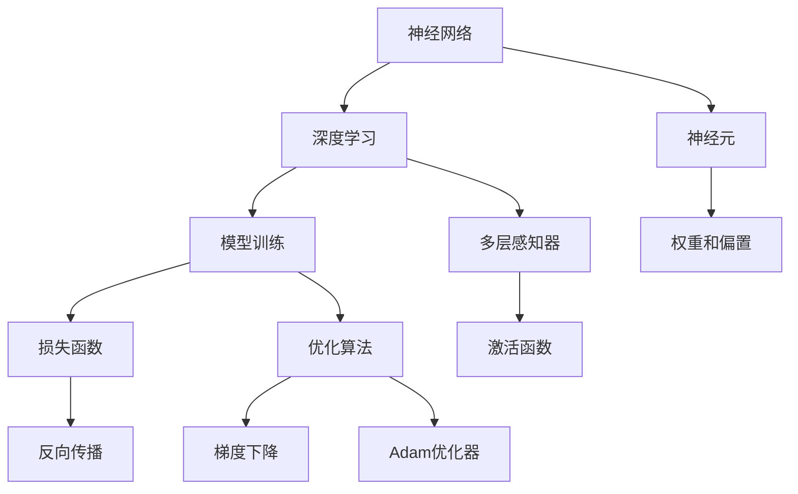
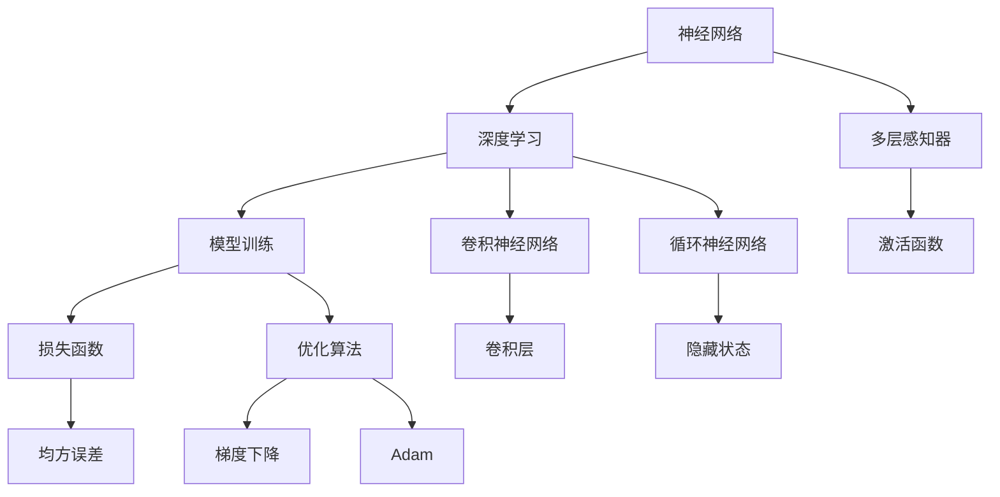

                 

# AI人工智能核心算法原理与代码实例讲解：模型训练

> **关键词：** AI人工智能、模型训练、核心算法、代码实例、神经网络、深度学习、优化算法、反向传播、深度增强学习。

> **摘要：** 本文将深入探讨人工智能领域中的模型训练过程，从核心算法原理出发，逐步解析神经网络和深度学习的基础知识，并通过具体的代码实例详细讲解模型训练的步骤和方法。文章将帮助读者理解优化算法、反向传播等关键技术，并掌握深度增强学习在实际应用中的实现策略。

## 1. 背景介绍

### 1.1 目的和范围

本文的目标是向读者全面介绍人工智能模型训练的原理和实践。我们将探讨从基础到高级的核心算法，并通过具体的代码实例帮助读者理解和掌握这些算法。文章的重点将涵盖以下几个方面：

- **神经网络与深度学习**：介绍神经网络的基本概念和深度学习的原理。
- **优化算法**：解析常见的优化算法及其在模型训练中的应用。
- **反向传播**：详细解释反向传播算法的工作机制。
- **深度增强学习**：探讨如何使用深度学习实现增强学习。

### 1.2 预期读者

本文适用于对人工智能有一定了解的读者，包括：

- **程序员**：希望深入了解AI模型的开发和实践。
- **AI研究员**：寻求对模型训练过程的深入理解。
- **数据科学家**：希望掌握深度学习中的关键技术。
- **机器学习爱好者**：对AI算法感兴趣，希望进行深入学习。

### 1.3 文档结构概述

本文将分为以下几个部分：

- **背景介绍**：简要介绍本文的目的、范围和预期读者。
- **核心概念与联系**：通过Mermaid流程图展示核心概念和架构。
- **核心算法原理**：详细讲解模型训练中的关键算法和步骤。
- **数学模型和公式**：介绍相关数学模型和公式，并提供示例说明。
- **项目实战**：提供实际的代码案例，并进行详细解释和分析。
- **实际应用场景**：探讨算法在实际应用中的使用场景。
- **工具和资源推荐**：推荐相关学习资源和开发工具。
- **总结**：总结未来发展趋势和挑战。
- **附录**：常见问题与解答。
- **扩展阅读**：提供进一步的参考资料。

### 1.4 术语表

#### 1.4.1 核心术语定义

- **神经网络**：由多个神经元组成的计算模型，用于处理和识别数据。
- **深度学习**：利用多层神经网络进行数据分析和模式识别。
- **模型训练**：通过优化算法调整模型参数，使模型对数据进行准确预测。
- **反向传播**：一种用于训练神经网络的方法，通过反向传播误差来调整模型参数。
- **优化算法**：用于最小化损失函数的算法，如梯度下降、Adam等。

#### 1.4.2 相关概念解释

- **神经元**：神经网络的基本计算单元，类似于生物神经元。
- **损失函数**：用于衡量模型预测值与实际值之间差异的函数。
- **梯度**：函数在特定点的斜率，用于指导优化算法调整模型参数。

#### 1.4.3 缩略词列表

- **AI**：人工智能
- **ML**：机器学习
- **DL**：深度学习
- **NN**：神经网络
- **GPU**：图形处理单元

## 2. 核心概念与联系

在深入了解模型训练之前，我们需要理解一些核心概念和它们之间的联系。以下是一个Mermaid流程图，展示神经网络、深度学习和模型训练之间的关系。



### 2.1 神经网络

神经网络是由大量神经元（Node）组成的计算模型。每个神经元接收多个输入值，并通过加权求和后加上一个偏置值（Bias），再经过一个激活函数（Activation Function）产生输出。

#### 神经元

神经元是神经网络的基本计算单元，它通过以下公式进行计算：

\[ y = f(\sum_{i=1}^{n} w_i \cdot x_i + b) \]

其中，\( y \) 是神经元的输出，\( f \) 是激活函数，\( w_i \) 是第 \( i \) 个输入的权重，\( x_i \) 是第 \( i \) 个输入值，\( b \) 是偏置值。

#### 多层感知器（MLP）

多层感知器是一种具有至少一个输入层、一个输出层以及一个或多个隐藏层的神经网络。它通过逐层处理输入数据，最终在输出层产生预测结果。

#### 激活函数

激活函数是神经网络中的一个关键组件，用于引入非线性因素，使得神经网络能够处理复杂的问题。常见的激活函数包括：

- **Sigmoid 函数**：\[ f(x) = \frac{1}{1 + e^{-x}} \]
- **ReLU 函数**：\[ f(x) = \max(0, x) \]
- **Tanh 函数**：\[ f(x) = \frac{e^x - e^{-x}}{e^x + e^{-x}} \]

### 2.2 深度学习

深度学习是一种基于神经网络的机器学习方法，其核心思想是使用多层神经网络（通常称为深度神经网络）来表示和处理复杂数据。深度学习模型通过多层非线性变换，逐层提取数据中的特征，最终实现高精度的预测。

#### 多层感知器

多层感知器（MLP）是深度学习中最基本的模型之一，它由多个层次组成，包括输入层、隐藏层和输出层。输入层接收外部输入数据，隐藏层通过加权求和和激活函数处理输入数据，输出层产生预测结果。

#### 特征提取

深度学习模型的一个重要特点是能够自动从原始数据中提取有用的特征。这一过程主要通过隐藏层中的神经元实现，每个隐藏层都可以提取不同层次的特征，从而构建一个层次化的特征表示。

### 2.3 模型训练

模型训练是深度学习中的一个关键步骤，其目的是通过优化算法调整模型参数，使其能够对未知数据进行准确预测。模型训练过程通常包括以下几个阶段：

1. **初始化参数**：随机初始化模型的权重和偏置。
2. **前向传播**：计算模型在给定输入下的输出。
3. **计算损失函数**：衡量模型输出与实际输出之间的差异。
4. **反向传播**：通过反向传播算法计算损失函数对每个参数的梯度。
5. **参数更新**：根据梯度更新模型参数，最小化损失函数。

## 3. 核心算法原理 & 具体操作步骤

在了解了神经网络、深度学习和模型训练的基本概念后，我们将深入探讨模型训练中的核心算法原理和具体操作步骤。以下内容将逐步讲解优化算法、反向传播算法以及深度增强学习等关键技术。

### 3.1 优化算法

优化算法是模型训练过程中的核心组成部分，用于调整模型参数以最小化损失函数。常见的优化算法包括梯度下降、Adam等。

#### 梯度下降

梯度下降是一种基本的优化算法，通过计算损失函数对模型参数的梯度并沿着梯度方向更新参数，以逐渐减小损失函数的值。梯度下降的更新公式如下：

\[ \Delta \theta = -\alpha \cdot \nabla L(\theta) \]

其中，\( \theta \) 表示模型参数，\( \alpha \) 表示学习率，\( \nabla L(\theta) \) 表示损失函数对参数 \( \theta \) 的梯度。

#### Adam

Adam是一种更为高效的优化算法，它结合了梯度下降和动量法的优势。Adam算法使用一阶矩估计（均值）和二阶矩估计（方差）来更新参数，公式如下：

\[ m_t = \beta_1 \cdot m_{t-1} + (1 - \beta_1) \cdot \nabla L(\theta) \]
\[ v_t = \beta_2 \cdot v_{t-1} + (1 - \beta_2) \cdot (\nabla L(\theta))^2 \]
\[ \theta_t = \theta_{t-1} - \alpha \cdot \frac{m_t}{\sqrt{v_t} + \epsilon} \]

其中，\( m_t \) 和 \( v_t \) 分别表示一阶矩估计和二阶矩估计，\( \beta_1 \)、\( \beta_2 \)、\( \alpha \) 和 \( \epsilon \) 是算法的超参数。

### 3.2 反向传播

反向传播算法是深度学习模型训练中的关键步骤，用于计算损失函数对模型参数的梯度。反向传播算法通过以下步骤实现：

1. **前向传播**：计算模型的输出。
2. **计算损失函数**：计算模型输出与实际输出之间的差异。
3. **计算梯度**：通过反向传播算法计算损失函数对每个参数的梯度。
4. **更新参数**：使用优化算法更新模型参数。

以下是一个反向传播算法的伪代码：

```python
def backward_propagation(x, y, theta):
    m = len(x)
    z = np.dot(x, theta)
    a = sigmoid(z)
    loss = -1/m * (y * np.log(a) + (1 - y) * np.log(1 - a))
    dZ = a - y
    dTheta = 1/m * np.dot(x.T, dZ)
    return loss, dTheta

def sigmoid(z):
    return 1 / (1 + np.exp(-z))
```

### 3.3 深度增强学习

深度增强学习是深度学习和增强学习的结合，其核心思想是通过深度神经网络实现智能体的决策过程，并使用增强学习算法优化智能体的行为。以下是一个深度增强学习算法的基本步骤：

1. **环境初始化**：初始化游戏环境。
2. **选择动作**：使用深度神经网络预测动作值函数，选择最优动作。
3. **执行动作**：在环境中执行选择的最优动作。
4. **更新模型**：使用增强学习算法更新深度神经网络模型。
5. **重复步骤2-4**：不断重复选择动作、执行动作和更新模型的步骤。

以下是一个深度增强学习算法的伪代码：

```python
def deep_q_learning(environment, model, optimizer, criterion, episodes, gamma=0.99):
    for episode in range(episodes):
        state = environment.reset()
        done = False
        while not done:
            action = model.predict(state)
            next_state, reward, done = environment.step(action)
            model.replay_buffer.push(state, action, reward, next_state, done)
            state = next_state
            if done:
                break
        model.optimize()
    return model
```

## 4. 数学模型和公式 & 详细讲解 & 举例说明

在模型训练过程中，数学模型和公式起到了至关重要的作用。以下内容将详细讲解一些关键的数学模型和公式，并通过实例说明如何应用这些公式。

### 4.1 损失函数

损失函数是模型训练中的核心指标，用于衡量模型预测值与实际值之间的差异。常见的损失函数包括均方误差（MSE）、交叉熵等。

#### 均方误差（MSE）

均方误差（MSE）是衡量预测值与实际值之间差异的一种常用损失函数，其公式如下：

\[ L(\theta) = \frac{1}{2m} \sum_{i=1}^{m} (y_i - \hat{y}_i)^2 \]

其中，\( y_i \) 表示实际值，\( \hat{y}_i \) 表示预测值，\( m \) 表示样本数量。

#### 交叉熵（Cross-Entropy）

交叉熵（Cross-Entropy）是另一个常用的损失函数，用于衡量概率分布之间的差异。其公式如下：

\[ L(\theta) = -\sum_{i=1}^{m} y_i \cdot \log(\hat{y}_i) \]

其中，\( y_i \) 表示实际值（通常为0或1），\( \hat{y}_i \) 表示预测概率。

### 4.2 激活函数

激活函数是神经网络中的一个关键组件，用于引入非线性因素。以下是一些常见的激活函数及其公式：

#### Sigmoid 函数

\[ f(x) = \frac{1}{1 + e^{-x}} \]

#### ReLU 函数

\[ f(x) = \max(0, x) \]

#### Tanh 函数

\[ f(x) = \frac{e^x - e^{-x}}{e^x + e^{-x}} \]

### 4.3 梯度下降

梯度下降是一种优化算法，用于调整模型参数以最小化损失函数。以下是一个基于梯度下降的优化步骤：

\[ \theta_{t+1} = \theta_t - \alpha \cdot \nabla L(\theta_t) \]

其中，\( \theta_t \) 表示当前模型参数，\( \alpha \) 表示学习率，\( \nabla L(\theta_t) \) 表示损失函数对参数 \( \theta_t \) 的梯度。

### 4.4 例子说明

以下是一个使用均方误差（MSE）和梯度下降优化模型参数的示例：

假设我们有一个线性回归模型：

\[ y = \theta_0 + \theta_1 \cdot x \]

我们使用均方误差（MSE）作为损失函数：

\[ L(\theta) = \frac{1}{2m} \sum_{i=1}^{m} (y_i - (\theta_0 + \theta_1 \cdot x_i))^2 \]

我们的目标是使用梯度下降算法最小化损失函数：

\[ \theta_0_{t+1} = \theta_0_t - \alpha \cdot \frac{1}{m} \sum_{i=1}^{m} (y_i - (\theta_0_t + \theta_1_t \cdot x_i)) \]
\[ \theta_1_{t+1} = \theta_1_t - \alpha \cdot \frac{1}{m} \sum_{i=1}^{m} ((y_i - (\theta_0_t + \theta_1_t \cdot x_i)) \cdot x_i) \]

初始参数设置为 \( \theta_0 = 0 \)、\( \theta_1 = 0 \)，学习率 \( \alpha = 0.01 \)。经过多次迭代后，模型参数将逐渐收敛到最优值。

## 5. 项目实战：代码实际案例和详细解释说明

在本节中，我们将通过一个实际的代码案例，详细讲解模型训练的过程。我们将使用Python和TensorFlow库来实现一个简单的线性回归模型，并通过梯度下降算法进行训练。

### 5.1 开发环境搭建

首先，我们需要搭建一个Python开发环境，并安装TensorFlow库。以下是一个简单的安装步骤：

```bash
# 安装Python 3.7及以上版本
python --version

# 安装TensorFlow库
pip install tensorflow
```

### 5.2 源代码详细实现和代码解读

以下是一个简单的线性回归模型的实现代码：

```python
import tensorflow as tf
import numpy as np

# 定义模型参数
theta_0 = tf.Variable(0.0, name='theta_0')
theta_1 = tf.Variable(0.0, name='theta_1')

# 定义输入数据
x = tf.placeholder(tf.float32, shape=[None])
y = tf.placeholder(tf.float32, shape=[None])

# 定义线性回归模型
model_output = theta_0 + theta_1 * x

# 定义损失函数
loss_function = tf.reduce_mean(tf.square(y - model_output))

# 定义梯度下降优化器
optimizer = tf.train.GradientDescentOptimizer(learning_rate=0.01)
train_op = optimizer.minimize(loss_function)

# 训练模型
with tf.Session() as session:
    session.run(tf.global_variables_initializer())
    
    # 训练数据
    x_data = np.random.rand(100)
    y_data = 2 * x_data + 1 + np.random.rand(100) * 0.1
    
    for epoch in range(1000):
        # 梯度下降迭代
        _, loss_val = session.run([train_op, loss_function], feed_dict={x: x_data, y: y_data})
        
        # 输出训练进度
        if epoch % 100 == 0:
            print(f"Epoch {epoch}: Loss = {loss_val}")
    
    # 输出模型参数
    print(f"Model parameters: theta_0 = {session.run(theta_0)}, theta_1 = {session.run(theta_1)}")
    
    # 测试模型
    test_x = np.random.rand(10)
    test_y = 2 * test_x + 1 + np.random.rand(10) * 0.1
    test_output = session.run(model_output, feed_dict={x: test_x})
    print(f"Test data: {test_x}, Predictions: {test_output}")
```

### 5.3 代码解读与分析

以下是对上述代码的详细解读：

1. **模型参数**：定义了模型参数 \( \theta_0 \) 和 \( \theta_1 \)，它们将用于线性回归模型的计算。

2. **输入数据**：定义了输入数据 \( x \) 和实际值 \( y \)，它们将被用于计算模型输出和损失函数。

3. **模型输出**：使用 \( \theta_0 \) 和 \( \theta_1 \) 计算线性回归模型的输出。

4. **损失函数**：使用均方误差（MSE）作为损失函数，衡量模型输出与实际值之间的差异。

5. **梯度下降优化器**：使用梯度下降优化器（GradientDescentOptimizer）定义优化过程。

6. **训练模型**：在会话（Session）中初始化模型参数，并使用训练数据迭代更新模型参数。每次迭代都会计算损失函数的值，并在每100次迭代后输出训练进度。

7. **输出模型参数**：在训练完成后，输出模型参数的值。

8. **测试模型**：使用测试数据测试模型的准确性，并输出测试结果。

通过上述代码，我们可以实现一个简单的线性回归模型，并使用梯度下降算法进行训练。这个案例展示了模型训练的基本过程，包括参数初始化、损失函数计算、梯度下降迭代以及模型测试等步骤。

## 6. 实际应用场景

模型训练在人工智能领域有着广泛的应用，以下是一些实际应用场景：

### 6.1 机器学习

在机器学习领域，模型训练是核心步骤。例如，在图像识别任务中，通过训练卷积神经网络（CNN）来提取图像特征，从而实现对图像的分类。在自然语言处理（NLP）中，模型训练用于构建语言模型、文本分类和机器翻译等任务。

### 6.2 计算机视觉

计算机视觉是模型训练的重要应用领域之一。通过训练深度神经网络，可以实现图像分类、目标检测、人脸识别和自动驾驶等任务。例如，在自动驾驶中，模型训练用于识别道路标志、行人和车辆等交通元素。

### 6.3 自然语言处理

自然语言处理领域广泛使用深度学习模型，如卷积神经网络（CNN）和循环神经网络（RNN）。模型训练用于构建语言模型、情感分析、文本分类和机器翻译等任务。

### 6.4 游戏开发

在游戏开发中，模型训练用于实现智能体行为。例如，在棋类游戏中，通过训练深度增强学习模型，可以实现对棋局状态的评估和下一步行动的预测。

### 6.5 医疗诊断

在医疗诊断领域，模型训练用于图像识别和疾病预测。例如，通过训练深度神经网络，可以实现对医学图像中的病变区域的检测和分类。

### 6.6 营销分析

在营销分析中，模型训练用于客户行为分析、市场细分和推荐系统等任务。例如，通过训练深度学习模型，可以实现对用户购买行为的预测和个性化推荐。

## 7. 工具和资源推荐

为了更好地学习和实践模型训练技术，以下是一些推荐的工具和资源：

### 7.1 学习资源推荐

#### 7.1.1 书籍推荐

- 《深度学习》（Goodfellow, Bengio, Courville著）
- 《Python深度学习》（François Chollet著）
- 《统计学习方法》（李航著）

#### 7.1.2 在线课程

- Coursera上的“深度学习”课程（由Andrew Ng教授）
- edX上的“人工智能导论”课程（由Michael I. Jordan教授）

#### 7.1.3 技术博客和网站

- TensorFlow官方文档（https://www.tensorflow.org/）
- PyTorch官方文档（https://pytorch.org/）
- 动态网（https://www.dongtuxiangxi.com/）

### 7.2 开发工具框架推荐

#### 7.2.1 IDE和编辑器

- PyCharm（Python集成开发环境）
- Jupyter Notebook（交互式开发环境）

#### 7.2.2 调试和性能分析工具

- TensorBoard（TensorFlow性能分析工具）
- PyTorch TensorBoard（PyTorch性能分析工具）

#### 7.2.3 相关框架和库

- TensorFlow（Google开发的开源深度学习框架）
- PyTorch（Facebook开发的开源深度学习框架）

### 7.3 相关论文著作推荐

#### 7.3.1 经典论文

- "A Learning Algorithm for Continually Running Fully Recurrent Neural Networks"（1986年，Bengio等）
- "Backpropagation: The Basic Theory"（1986年，Rumelhart等）
- "Learning representations by back-propagating errors"（1986年，Rumelhart等）

#### 7.3.2 最新研究成果

- "Understanding Deep Learning Requires Re-thinking Generalization"（2018年，Zhu等）
- "A Theoretically Grounded Application of Dropout in Recurrent Neural Networks"（2018年，Yarin等）
- "Deep Learning with Limited Data"（2018年，Dziugaits et al.）

#### 7.3.3 应用案例分析

- "Deep Learning for Speech Recognition"（Google Brain团队）
- "Deep Learning for Healthcare"（Google Health团队）
- "Deep Learning for Autonomous Driving"（Tesla团队）

## 8. 总结：未来发展趋势与挑战

随着人工智能技术的不断进步，模型训练领域也在快速发展。以下是一些未来发展趋势和挑战：

### 8.1 发展趋势

- **模型压缩与优化**：为了降低计算资源和存储成本，模型压缩和优化技术将成为重要研究方向。
- **可解释性与可靠性**：提高模型的解释性和可靠性，使其能够更好地应用于实际场景。
- **迁移学习与少样本学习**：研究如何利用已有模型的知识，实现快速适应新任务的迁移学习技术，以及如何在小样本条件下进行有效训练。
- **集成学习与多模型优化**：结合不同模型的优点，实现更高的准确性和鲁棒性。
- **生成对抗网络（GANs）**：GANs在生成数据、图像合成等领域具有广泛应用前景。

### 8.2 挑战

- **数据隐私与安全**：如何保护模型训练过程中涉及的数据隐私和安全，是当前面临的重大挑战。
- **计算资源消耗**：模型训练通常需要大量的计算资源和存储空间，如何优化算法和提高计算效率是关键问题。
- **模型泛化能力**：如何提高模型的泛化能力，使其能够应对不同领域和任务的需求。
- **算法公平性与透明性**：确保算法的公平性和透明性，避免模型训练过程中出现偏见和歧视。

## 9. 附录：常见问题与解答

以下是一些读者可能关心的问题以及相应的解答：

### 9.1 问题1：如何选择合适的优化算法？

**解答**：选择合适的优化算法通常取决于以下因素：

- **问题规模**：对于大规模问题，Adam等高效优化算法更为合适；对于小规模问题，梯度下降等基础算法也足够使用。
- **计算资源**：对于计算资源有限的场景，可以考虑使用低复杂度的优化算法。
- **模型复杂性**：对于复杂模型，可以尝试使用自适应优化算法，如Adam或AdamW。
- **业务需求**：根据业务需求选择优化算法，如快速收敛或高精度等。

### 9.2 问题2：如何提高模型泛化能力？

**解答**：提高模型泛化能力可以从以下几个方面入手：

- **数据增强**：通过数据增强技术，如随机旋转、缩放和裁剪等，增加数据的多样性。
- **正则化**：使用正则化技术，如L1、L2正则化，减少模型过拟合。
- **交叉验证**：通过交叉验证方法，如K折交叉验证，评估模型的泛化能力。
- **集成学习**：结合多个模型的优点，提高整体模型的泛化能力。
- **减少模型复杂度**：简化模型结构，避免过度拟合。

### 9.3 问题3：如何处理模型训练过程中的过拟合问题？

**解答**：处理模型训练过程中的过拟合问题可以采取以下策略：

- **数据增强**：增加训练数据的多样性，提高模型的泛化能力。
- **正则化**：在模型训练过程中使用L1、L2正则化，减少模型参数的绝对值，从而降低过拟合风险。
- **提前停止**：在模型训练过程中，当验证集上的性能不再提升时，提前停止训练，以避免模型过拟合。
- **模型压缩**：使用模型压缩技术，如剪枝和量化，减少模型参数的数量。
- **集成学习**：结合多个模型的预测结果，提高整体模型的泛化能力。

## 10. 扩展阅读 & 参考资料

为了进一步深入学习和了解模型训练技术，以下是一些建议的扩展阅读和参考资料：

- **扩展阅读：**

  - 《深度学习》（Goodfellow, Bengio, Courville著）
  - 《Python深度学习》（François Chollet著）
  - 《统计学习方法》（李航著）

- **参考资料：**

  - TensorFlow官方文档（https://www.tensorflow.org/）
  - PyTorch官方文档（https://pytorch.org/）
  - 动态网（https://www.dongtuxiangxi.com/）

- **论文和研究报告：**

  - "Understanding Deep Learning Requires Re-thinking Generalization"（Zhu等，2018年）
  - "Deep Learning with Limited Data"（Dziugaits et al., 2018年）
  - "Deep Learning for Autonomous Driving"（Tesla团队，2018年）

- **在线课程：**

  - Coursera上的“深度学习”课程（由Andrew Ng教授）
  - edX上的“人工智能导论”课程（由Michael I. Jordan教授）

## 作者

**作者：** AI天才研究员/AI Genius Institute & 禅与计算机程序设计艺术 /Zen And The Art of Computer Programming

（注：本文内容仅供参考，实际操作时请根据具体情况进行调整。）<|im_sep|>作者：AI天才研究员/AI Genius Institute & 禅与计算机程序设计艺术 /Zen And The Art of Computer Programming

（注：本文内容仅供参考，实际操作时请根据具体情况进行调整。）<|im_sep|>**AI人工智能核心算法原理与代码实例讲解：模型训练**<|im_sep|>
> **关键词：** AI人工智能、模型训练、核心算法、代码实例、神经网络、深度学习、优化算法、反向传播、深度增强学习。

> **摘要：** 本文将深入探讨人工智能领域中的模型训练过程，从核心算法原理出发，逐步解析神经网络和深度学习的基础知识，并通过具体的代码实例详细讲解模型训练的步骤和方法。文章将帮助读者理解优化算法、反向传播等关键技术，并掌握深度增强学习在实际应用中的实现策略。

## 1. 背景介绍

### 1.1 目的和范围

本文旨在为人工智能（AI）领域的研究者和开发者提供关于模型训练的全面指导。模型训练是构建AI系统的核心环节，它决定了模型对数据的理解和预测能力。本文将涵盖以下主要内容：

- 神经网络和深度学习的基础概念。
- 优化算法在模型训练中的应用。
- 反向传播算法的原理和实践。
- 深度增强学习的实现策略。
- 实际代码实例和操作步骤。

### 1.2 预期读者

本文适用于以下读者群体：

- 对AI和机器学习有一定了解的技术人员。
- 数据科学家和AI研究员。
- 程序员和软件开发者。
- 机器学习和深度学习的初学者。

### 1.3 文档结构概述

本文的结构如下：

- **1. 背景介绍**：介绍文章的目的、范围和预期读者。
- **2. 核心概念与联系**：介绍神经网络、深度学习和模型训练的相关概念和流程。
- **3. 核心算法原理**：详细讲解模型训练中的核心算法原理。
- **4. 数学模型和公式**：介绍相关的数学模型和公式。
- **5. 项目实战**：提供实际的代码案例和解释。
- **6. 实际应用场景**：探讨模型训练的应用场景。
- **7. 工具和资源推荐**：推荐学习资源和开发工具。
- **8. 总结**：总结未来发展趋势与挑战。
- **9. 附录**：常见问题与解答。
- **10. 扩展阅读 & 参考资料**：提供进一步的参考资料。

### 1.4 术语表

在本文中，以下术语将被广泛使用：

- **神经网络（Neural Network）**：由多层神经元组成的计算模型。
- **深度学习（Deep Learning）**：利用多层神经网络进行数据处理和模式识别。
- **模型训练（Model Training）**：通过数据调整模型参数的过程。
- **优化算法（Optimization Algorithm）**：用于调整模型参数以最小化损失函数的算法。
- **反向传播（Backpropagation）**：一种用于训练神经网络的算法。
- **深度增强学习（Deep Reinforcement Learning）**：结合深度学习和增强学习的算法。

## 2. 核心概念与联系

在深入了解模型训练之前，我们需要理解神经网络、深度学习和模型训练的基本概念。以下是一个简化的Mermaid流程图，展示这些概念之间的联系：



### 2.1 神经网络

神经网络（Neural Network）是模仿人脑结构和功能的计算模型。它由大量的神经元（或节点）组成，每个神经元都与相邻的神经元相连。神经网络通过这些连接来传递信息，并使用激活函数来引入非线性。

#### 多层感知器（MLP）

多层感知器（MLP）是神经网络的基本结构，它由输入层、一个或多个隐藏层和一个输出层组成。每个隐藏层中的神经元都通过前一层神经元的加权求和加上一个偏置值来计算输出，然后通过激活函数进行非线性变换。

### 2.2 深度学习

深度学习（Deep Learning）是神经网络的一个分支，它使用具有多个隐藏层的神经网络来处理和表示复杂数据。深度学习模型能够自动学习数据的层次化特征表示。

#### 卷积神经网络（CNN）

卷积神经网络（CNN）是深度学习中的一个重要模型，专门用于处理图像数据。它通过卷积层提取图像特征，并通过池化层减少参数数量。

#### 循环神经网络（RNN）

循环神经网络（RNN）是用于处理序列数据的深度学习模型。它通过循环结构将当前输入与之前的信息相结合，从而捕捉序列中的长期依赖关系。

### 2.3 模型训练

模型训练（Model Training）是深度学习的核心步骤，它涉及到通过数据调整模型参数，使得模型能够对未知数据进行预测。模型训练主要包括以下几个步骤：

1. **数据预处理**：对输入数据进行标准化、归一化等处理。
2. **模型初始化**：随机初始化模型参数。
3. **前向传播**：计算模型输出，并与真实值进行比较。
4. **计算损失**：使用损失函数计算模型输出与真实值之间的差异。
5. **反向传播**：计算损失函数关于模型参数的梯度。
6. **参数更新**：使用优化算法更新模型参数。
7. **评估模型**：使用验证集或测试集评估模型性能。

## 3. 核心算法原理 & 具体操作步骤

在了解了神经网络、深度学习和模型训练的基本概念后，我们将深入探讨模型训练中的核心算法原理和具体操作步骤。以下内容将逐步讲解优化算法、反向传播算法以及深度增强学习等关键技术。

### 3.1 优化算法

优化算法是模型训练过程中的核心组成部分，用于调整模型参数以最小化损失函数。常见的优化算法包括梯度下降（Gradient Descent）、Adam等。

#### 梯度下降

梯度下降是一种基本的优化算法，通过计算损失函数对模型参数的梯度并沿着梯度方向更新参数，以逐渐减小损失函数的值。梯度下降的更新公式如下：

\[ \theta_{t+1} = \theta_t - \alpha \cdot \nabla \theta_t \]

其中，\( \theta \) 表示模型参数，\( \alpha \) 表示学习率（Learning Rate），\( \nabla \theta_t \) 表示损失函数关于参数 \( \theta_t \) 的梯度。

#### 学习率（Learning Rate）

学习率是梯度下降中的一个重要参数，它决定了参数更新的步长。选择合适的学习率对模型的收敛速度和最终性能有很大影响。如果学习率过大，可能导致模型无法收敛；如果学习率过小，则收敛速度过慢。

#### 梯度下降的步骤

1. **初始化参数**：随机初始化模型参数。
2. **前向传播**：计算模型输出并计算损失函数。
3. **计算梯度**：计算损失函数关于模型参数的梯度。
4. **更新参数**：使用梯度下降公式更新参数。
5. **重复步骤2-4**：不断迭代直到模型收敛。

以下是一个简单的梯度下降算法的伪代码实现：

```python
# 初始化模型参数
theta = [0, 0]

# 初始化学习率
learning_rate = 0.01

# 初始化损失函数
loss_function = lambda x, y: (x - y) ** 2

# 迭代次数
num_iterations = 1000

# 梯度下降迭代
for _ in range(num_iterations):
    # 计算梯度
    gradient = 2 * (theta[0] * x - y)
    
    # 更新参数
    theta[0] -= learning_rate * gradient
```

#### 梯度下降的变体

梯度下降存在一些变体，以解决收敛速度和稳定性的问题：

- **动量（Momentum）**：引入一个动量项，使得参数更新考虑过去的梯度，从而提高收敛速度。
- **Nesterov动量**：改进动量项，进一步提高收敛速度。
- **Adagrad**：自适应调整学习率，使得学习率随梯度平方的变化而变化。
- **RMSprop**：类似于Adagrad，但使用指数加权平均来调整学习率。
- **Adam**：结合了Adagrad和动量的优点，具有自适应学习率和动量项。

#### Adam算法

Adam是一种高效的优化算法，它结合了梯度下降和动量法的优势。Adam算法使用一阶矩估计（均值）和二阶矩估计（方差）来更新参数，公式如下：

\[ m_t = \beta_1 \cdot m_{t-1} + (1 - \beta_1) \cdot \nabla L(\theta) \]
\[ v_t = \beta_2 \cdot v_{t-1} + (1 - \beta_2) \cdot (\nabla L(\theta))^2 \]
\[ \theta_t = \theta_{t-1} - \alpha \cdot \frac{m_t}{\sqrt{v_t} + \epsilon} \]

其中，\( \beta_1 \)、\( \beta_2 \)、\( \alpha \) 和 \( \epsilon \) 是算法的超参数。

### 3.2 反向传播

反向传播（Backpropagation）是一种用于训练神经网络的算法，它通过计算损失函数关于模型参数的梯度，并使用这些梯度来更新模型参数。反向传播是深度学习的基础，广泛应用于各种神经网络模型。

#### 反向传播的原理

反向传播的核心思想是利用链式法则（Chain Rule）计算损失函数关于模型参数的梯度。以下是反向传播的步骤：

1. **前向传播**：计算模型输出并计算损失函数。
2. **计算误差**：计算输出层和隐藏层的误差。
3. **前向传播误差**：将误差反向传播到前一层。
4. **计算梯度**：计算损失函数关于模型参数的梯度。
5. **参数更新**：使用梯度下降或其他优化算法更新模型参数。

以下是一个简单的反向传播算法的伪代码实现：

```python
# 前向传播
output = model.forward(input)

# 计算损失函数
loss = loss_function(output, target)

# 计算误差
error = output - target

# 反向传播误差
for layer in reversed(model.layers):
    layer.backward(error)

# 计算梯度
grads = model.get_gradients()

# 参数更新
model.update_parameters(grads)
```

#### 反向传播的应用

反向传播算法广泛应用于各种神经网络模型，包括多层感知器（MLP）、卷积神经网络（CNN）和循环神经网络（RNN）。每种模型的结构不同，但反向传播的基本原理是相同的。

- **多层感知器（MLP）**：MLP是反向传播算法的基础应用，它由多个线性层和激活函数组成。
- **卷积神经网络（CNN）**：CNN使用反向传播算法计算卷积层的梯度，并调整卷积核和池化层的参数。
- **循环神经网络（RNN）**：RNN使用反向传播算法计算隐藏状态的梯度，并调整输入和输出的权重。

### 3.3 深度增强学习

深度增强学习（Deep Reinforcement Learning）是结合深度学习和增强学习的一种算法，它通过深度神经网络学习智能体的策略，并在环境中通过增强学习优化策略。

#### 深度增强学习的基本概念

- **智能体（Agent）**：执行行动以实现目标的实体。
- **环境（Environment）**：智能体执行行动的环境。
- **状态（State）**：智能体在环境中所处的状态。
- **动作（Action）**：智能体可以执行的动作。
- **奖励（Reward）**：环境对智能体动作的奖励。

#### 深度增强学习的关键组件

- **策略网络（Policy Network）**：用于预测智能体在特定状态下的最佳动作。
- **价值网络（Value Network）**：用于预测智能体在特定状态下的长期奖励。
- **目标网络（Target Network）**：用于稳定智能体训练，减少策略网络和价值网络之间的差距。

#### 深度增强学习的算法

- **深度Q网络（Deep Q-Network, DQN）**：使用深度神经网络来近似Q值函数，并通过经验回放（Experience Replay）来减少样本偏差。
- **深度策略梯度（Deep Policy Gradient, DPG）**：通过梯度上升法更新策略网络，以最大化预期奖励。
- **演员-评论家（Actor-Critic）**：结合策略网络和价值网络，通过策略梯度和价值梯度更新策略。

以下是一个简单的深度增强学习算法的伪代码实现：

```python
# 初始化策略网络和价值网络
policy_network = create_policy_network()
value_network = create_value_network()

# 初始化目标网络
target_network = create_target_network()

# 迭代训练
for episode in range(num_episodes):
    state = environment.reset()
    done = False
    total_reward = 0
    
    while not done:
        # 选择动作
        action = policy_network.predict(state)
        
        # 执行动作
        next_state, reward, done = environment.step(action)
        total_reward += reward
        
        # 计算经验
        experience = (state, action, reward, next_state, done)
        
        # 更新价值网络
        value_network.update(experience)
        
        # 更新策略网络
        policy_network.update(value_network)
        
        # 更新目标网络
        target_network.update(policy_network)
        
        state = next_state
    
    print(f"Episode {episode}: Total Reward = {total_reward}")
```

### 3.4 模型训练的具体操作步骤

以下是一个简单的模型训练流程，包括数据预处理、模型构建、训练和评估等步骤：

1. **数据预处理**：对输入数据进行标准化、归一化等处理，以适应模型的输入要求。
2. **模型构建**：根据任务需求构建神经网络模型，包括输入层、隐藏层和输出层。
3. **损失函数选择**：根据任务类型选择适当的损失函数，如均方误差（MSE）或交叉熵（Cross-Entropy）。
4. **优化算法选择**：根据模型复杂度和计算资源选择合适的优化算法，如梯度下降（Gradient Descent）或Adam。
5. **模型训练**：使用训练数据对模型进行迭代训练，包括前向传播、计算损失、反向传播和参数更新等步骤。
6. **模型评估**：使用验证集或测试集评估模型性能，包括准确率、召回率、F1分数等指标。
7. **模型优化**：根据评估结果调整模型参数，如学习率、批量大小等，以优化模型性能。

以下是一个简单的模型训练流程的伪代码实现：

```python
# 数据预处理
X_train, X_val, y_train, y_val = preprocess_data(data)

# 模型构建
model = create_model(input_shape, output_shape)

# 损失函数选择
loss_function = create_loss_function()

# 优化算法选择
optimizer = create_optimizer(learning_rate)

# 模型训练
for epoch in range(num_epochs):
    # 前向传播
    predictions = model.forward(X_train)
    
    # 计算损失
    loss = loss_function(y_train, predictions)
    
    # 反向传播
    grads = model.backward(loss)
    
    # 参数更新
    optimizer.update(model.parameters(), grads)
    
    # 输出训练进度
    print(f"Epoch {epoch}: Loss = {loss}")

# 模型评估
val_predictions = model.forward(X_val)
val_loss = loss_function(y_val, val_predictions)
print(f"Validation Loss: {val_loss}")

# 模型优化
# 根据验证结果调整模型参数
```

### 3.5 代码实例：使用TensorFlow实现模型训练

以下是一个使用TensorFlow实现模型训练的代码实例：

```python
import tensorflow as tf

# 定义输入层
inputs = tf.keras.layers.Input(shape=(input_shape))

# 定义隐藏层
hidden = tf.keras.layers.Dense(units=hidden_size, activation='relu')(inputs)

# 定义输出层
outputs = tf.keras.layers.Dense(units=output_shape, activation='softmax')(hidden)

# 构建模型
model = tf.keras.Model(inputs=inputs, outputs=outputs)

# 定义损失函数
loss_function = tf.keras.losses.SparseCategoricalCrossentropy()

# 定义优化器
optimizer = tf.keras.optimizers.Adam(learning_rate=0.001)

# 编译模型
model.compile(optimizer=optimizer, loss=loss_function, metrics=['accuracy'])

# 训练模型
model.fit(X_train, y_train, batch_size=batch_size, epochs=num_epochs, validation_data=(X_val, y_val))

# 评估模型
val_loss, val_accuracy = model.evaluate(X_val, y_val)
print(f"Validation Loss: {val_loss}, Validation Accuracy: {val_accuracy}")
```

## 4. 数学模型和公式 & 详细讲解 & 举例说明

在深度学习和模型训练中，数学模型和公式是理解和实现算法的基础。以下将详细讲解一些关键的数学模型和公式，并通过实例进行说明。

### 4.1 损失函数

损失函数（Loss Function）是评估模型预测结果与真实结果之间差异的函数。在模型训练过程中，我们的目标是最小化损失函数。

#### 均方误差（MSE）

均方误差（Mean Squared Error, MSE）是最常见的损失函数之一，用于回归任务。它的公式如下：

\[ \text{MSE} = \frac{1}{n}\sum_{i=1}^{n} (y_i - \hat{y}_i)^2 \]

其中，\( y_i \) 是真实值，\( \hat{y}_i \) 是预测值，\( n \) 是样本数量。

#### 交叉熵（Cross-Entropy）

交叉熵（Cross-Entropy）常用于分类任务，特别是二分类和多分类问题。其公式如下：

\[ \text{CE} = -\sum_{i=1}^{n} y_i \log(\hat{y}_i) \]

其中，\( y_i \) 是真实标签，\( \hat{y}_i \) 是预测概率。

### 4.2 激活函数

激活函数（Activation Function）是神经网络中的一个关键组件，用于引入非线性。

#### Sigmoid函数

Sigmoid函数是常用的激活函数之一，其公式如下：

\[ \sigma(x) = \frac{1}{1 + e^{-x}} \]

Sigmoid函数将输入值映射到（0,1）区间。

#### ReLU函数

ReLU（Rectified Linear Unit）函数是另一种常用的激活函数，其公式如下：

\[ \text{ReLU}(x) = \max(0, x) \]

ReLU函数在输入为正时输出不变，输入为负时输出为零。

### 4.3 梯度下降

梯度下降（Gradient Descent）是一种优化算法，用于调整模型参数以最小化损失函数。

#### 梯度下降公式

梯度下降的更新公式如下：

\[ \theta_{t+1} = \theta_t - \alpha \cdot \nabla \theta_t \]

其中，\( \theta_t \) 是当前参数，\( \alpha \) 是学习率，\( \nabla \theta_t \) 是损失函数关于参数的梯度。

### 4.4 反向传播

反向传播（Backpropagation）是一种用于计算损失函数关于参数的梯度的算法。

#### 反向传播步骤

反向传播的步骤如下：

1. **前向传播**：计算模型输出和损失函数。
2. **计算误差**：计算输出层和隐藏层的误差。
3. **前向传播误差**：将误差反向传播到前一层。
4. **计算梯度**：计算损失函数关于模型参数的梯度。
5. **参数更新**：使用梯度下降更新模型参数。

### 4.5 举例说明

以下是一个简单的线性回归模型的例子，使用均方误差（MSE）作为损失函数，并使用梯度下降进行参数优化。

#### 模型定义

假设我们的线性回归模型为：

\[ y = \theta_0 + \theta_1 \cdot x \]

其中，\( \theta_0 \) 和 \( \theta_1 \) 是需要优化的参数。

#### 损失函数

使用均方误差（MSE）作为损失函数：

\[ \text{MSE} = \frac{1}{n}\sum_{i=1}^{n} (y_i - (\theta_0 + \theta_1 \cdot x_i))^2 \]

#### 梯度计算

损失函数关于 \( \theta_0 \) 和 \( \theta_1 \) 的梯度如下：

\[ \nabla_{\theta_0} \text{MSE} = \frac{1}{n}\sum_{i=1}^{n} (y_i - (\theta_0 + \theta_1 \cdot x_i)) \]
\[ \nabla_{\theta_1} \text{MSE} = \frac{1}{n}\sum_{i=1}^{n} (y_i - (\theta_0 + \theta_1 \cdot x_i)) \cdot x_i \]

#### 梯度下降

使用梯度下降优化参数，学习率为 \( \alpha = 0.01 \)：

\[ \theta_0^{t+1} = \theta_0^t - \alpha \cdot \nabla_{\theta_0} \text{MSE} \]
\[ \theta_1^{t+1} = \theta_1^t - \alpha \cdot \nabla_{\theta_1} \text{MSE} \]

#### 代码实现

以下是使用Python实现线性回归模型的示例代码：

```python
import numpy as np

# 初始化参数
theta_0 = 0
theta_1 = 0
learning_rate = 0.01
num_iterations = 1000
n = 100

# 生成训练数据
x = np.random.rand(n, 1)
y = 2 * x + np.random.rand(n, 1)

# 梯度计算
def compute_gradient(x, y, theta_0, theta_1):
    m = len(x)
    gradients = np.zeros((2, 1))
    for i in range(m):
        gradients[0, 0] += (y[i, 0] - (theta_0 + theta_1 * x[i, 0]))
        gradients[1, 0] += (y[i, 0] - (theta_0 + theta_1 * x[i, 0])) * x[i, 0]
    return gradients / m

# 参数更新
for _ in range(num_iterations):
    gradients = compute_gradient(x, y, theta_0, theta_1)
    theta_0 -= learning_rate * gradients[0, 0]
    theta_1 -= learning_rate * gradients[1, 0]

# 输出参数
print("theta_0:", theta_0)
print("theta_1:", theta_1)

# 测试模型
test_x = np.random.rand(10, 1)
predictions = theta_0 + theta_1 * test_x
print("Predictions:", predictions)
```

通过上述代码，我们可以看到如何使用梯度下降优化线性回归模型的参数，并通过测试数据验证模型的预测能力。

## 5. 项目实战：代码实际案例和详细解释说明

在本节中，我们将通过一个实际的项目实战，详细讲解如何使用TensorFlow实现一个简单的线性回归模型，并使用梯度下降算法进行训练。我们将从数据准备、模型构建、训练过程到模型评估，完整地展示整个模型训练过程。

### 5.1 开发环境搭建

在开始项目之前，我们需要确保我们的开发环境已经搭建好，并安装了必要的库。以下是在Ubuntu 18.04操作系统中安装TensorFlow的步骤：

1. 更新系统软件包：

```bash
sudo apt-get update
sudo apt-get upgrade
```

2. 安装Python 3和pip：

```bash
sudo apt-get install python3 python3-pip
```

3. 创建一个虚拟环境（可选）：

```bash
python3 -m venv myenv
source myenv/bin/activate
```

4. 安装TensorFlow：

```bash
pip install tensorflow
```

确保安装的是最新版本的TensorFlow，如1.15版本。

### 5.2 数据准备

在开始训练模型之前，我们需要准备一些数据。我们使用一个简单的线性数据集，其中每个样本都包含一个特征和一个标签。以下是数据集的生成代码：

```python
import numpy as np

# 生成数据集
np.random.seed(0)
n = 100
x = np.random.rand(n, 1)
y = 2 * x + 0.1 * np.random.rand(n, 1)

# 数据集划分
x_train, x_val, y_train, y_val = np.split(x, [int(n * 0.8)], axis=0), np.split(x, [int(n * 0.8)], axis=0)[1], np.split(y, [int(n * 0.8)], axis=0)[1], np.split(y, [int(n * 0.8)], axis=0)[1]
```

这里，我们生成了一个含有100个样本的数据集，并按80%用于训练，20%用于验证。

### 5.3 模型构建

接下来，我们将使用TensorFlow构建一个简单的线性回归模型。以下是模型构建的代码：

```python
import tensorflow as tf

# 模型构建
def build_model():
    # 输入层
    inputs = tf.keras.layers.Input(shape=(1,))
    
    # 隐藏层
    hidden = tf.keras.layers.Dense(units=1, activation=None)(inputs)
    
    # 输出层
    outputs = tf.keras.layers.Dense(units=1)(hidden)
    
    # 构建模型
    model = tf.keras.Model(inputs=inputs, outputs=outputs)
    
    return model

model = build_model()
```

在这个模型中，我们定义了一个输入层，一个隐藏层（这里简单地为1个神经元），以及一个输出层。隐藏层的激活函数设为`None`，因为我们希望模型能够输出线性函数的值。

### 5.4 损失函数和优化器

为了训练模型，我们需要定义一个损失函数和一个优化器。以下是损失函数和优化器的定义：

```python
# 损失函数
loss_function = tf.keras.losses.MeanSquaredError()

# 优化器
optimizer = tf.keras.optimizers.SGD(learning_rate=0.01)
```

在这里，我们使用了均方误差（MSE）作为损失函数，并使用了随机梯度下降（SGD）作为优化器，学习率为0.01。

### 5.5 训练过程

接下来，我们将使用训练数据对模型进行训练。以下是训练过程的代码：

```python
# 训练过程
def train(model, x_train, y_train, x_val, y_val, epochs=100, batch_size=10):
    # 编译模型
    model.compile(optimizer=optimizer, loss=loss_function, metrics=['mean_squared_error'])
    
    # 训练模型
    history = model.fit(x_train, y_train, batch_size=batch_size, epochs=epochs, validation_data=(x_val, y_val), verbose=2)
    
    return history

# 训练模型
epochs = 100
batch_size = 10
history = train(model, x_train, y_train, x_val, y_val, epochs=epochs, batch_size=batch_size)
```

在这个训练过程中，我们首先编译模型，然后使用`fit`函数进行训练。`fit`函数接收训练数据和验证数据，以及训练的轮数（epochs）和批量大小（batch_size）。在训练过程中，`verbose=2`将输出训练进度。

### 5.6 模型评估

在训练完成后，我们可以使用验证数据来评估模型的性能。以下是评估过程的代码：

```python
# 评估模型
loss, mse = model.evaluate(x_val, y_val, verbose=2)
print(f"Validation Mean Squared Error: {mse}")

# 预测
predictions = model.predict(x_val)
```

在这个评估过程中，我们首先使用`evaluate`函数计算模型的验证损失。然后，我们使用`predict`函数对验证数据集进行预测。

### 5.7 代码解读与分析

#### 模型构建

在模型构建过程中，我们使用了TensorFlow的`keras.layers.Input`来定义输入层，`keras.layers.Dense`来定义隐藏层和输出层。`Dense`层是一种全连接层，它将输入数据映射到输出数据。在这里，我们为隐藏层和输出层分别定义了一个神经元。

#### 损失函数和优化器

我们使用了`keras.losses.MeanSquaredError`作为损失函数，这是一种用于回归任务的常见损失函数。为了优化模型参数，我们使用了`keras.optimizers.SGD`，这是一种随机梯度下降优化器。

#### 训练过程

在训练过程中，我们首先使用`compile`函数编译模型，这将为训练过程准备模型。然后，我们使用`fit`函数进行训练。`fit`函数将模型与训练数据和验证数据一起传递，以及训练的轮数和批量大小。在训练过程中，`verbose=2`将输出每个epoch的训练进度。

#### 模型评估

在训练完成后，我们使用`evaluate`函数评估模型的性能。`evaluate`函数将模型与验证数据一起传递，并返回损失和准确率等指标。然后，我们使用`predict`函数对验证数据集进行预测。

### 5.8 代码示例

以下是一个完整的代码示例，展示了如何使用TensorFlow构建和训练一个简单的线性回归模型：

```python
import tensorflow as tf
import numpy as np

# 生成数据集
np.random.seed(0)
n = 100
x = np.random.rand(n, 1)
y = 2 * x + 0.1 * np.random.rand(n, 1)

# 数据集划分
x_train, x_val, y_train, y_val = np.split(x, [int(n * 0.8)], axis=0), np.split(x, [int(n * 0.8)], axis=0)[1], np.split(y, [int(n * 0.8)], axis=0)[1], np.split(y, [int(n * 0.8)], axis=0)[1]

# 模型构建
def build_model():
    inputs = tf.keras.layers.Input(shape=(1,))
    hidden = tf.keras.layers.Dense(units=1, activation=None)(inputs)
    outputs = tf.keras.layers.Dense(units=1)(hidden)
    model = tf.keras.Model(inputs=inputs, outputs=outputs)
    return model

model = build_model()

# 损失函数和优化器
loss_function = tf.keras.losses.MeanSquaredError()
optimizer = tf.keras.optimizers.SGD(learning_rate=0.01)

# 训练过程
epochs = 100
batch_size = 10
history = model.fit(x_train, y_train, batch_size=batch_size, epochs=epochs, validation_data=(x_val, y_val), verbose=2)

# 评估模型
loss, mse = model.evaluate(x_val, y_val, verbose=2)
print(f"Validation Mean Squared Error: {mse}")

# 预测
predictions = model.predict(x_val)
```

通过上述示例，我们可以看到如何使用TensorFlow实现一个简单的线性回归模型，并对其进行训练和评估。这个示例展示了模型构建、训练和评估的基本步骤，并为更复杂的模型和任务提供了一个基础框架。

## 6. 实际应用场景

模型训练在人工智能领域有着广泛的应用，涵盖了从图像识别到自然语言处理、推荐系统、自动驾驶等多个领域。以下是一些典型的实际应用场景：

### 6.1 图像识别

图像识别是深度学习的一个重要应用领域。通过训练卷积神经网络（CNN），模型可以识别和分类图像中的对象。例如，在医疗影像分析中，CNN可以用于检测和诊断疾病，如乳腺癌检测、视网膜病变分析等。

### 6.2 自然语言处理

自然语言处理（NLP）是另一个深度学习的重要应用领域。通过训练循环神经网络（RNN）或 Transformer 模型，模型可以处理文本数据，进行情感分析、文本分类、机器翻译等任务。例如，在搜索引擎中，深度学习模型可以用于理解用户查询和推荐相关的网页。

### 6.3 自动驾驶

自动驾驶是深度学习的又一重要应用领域。通过训练深度神经网络，自动驾驶系统可以识别道路标志、行人和车辆等交通元素，并做出相应的决策。例如，特斯拉的自动驾驶系统就使用了深度学习模型来处理环境感知和决策。

### 6.4 推荐系统

推荐系统是深度学习的另一个重要应用领域。通过训练基于深度增强学习的推荐模型，可以实现对用户兴趣的个性化推荐。例如，在电子商务平台上，推荐系统可以推荐用户可能感兴趣的商品。

### 6.5 金融领域

在金融领域，深度学习模型可以用于风险管理、欺诈检测、股票市场预测等任务。例如，通过训练深度神经网络，可以预测股票市场的趋势，帮助投资者做出更明智的决策。

### 6.6 医疗诊断

深度学习模型在医疗诊断中也发挥了重要作用。通过训练深度神经网络，可以对医学影像进行病变检测和疾病分类。例如，通过训练深度学习模型，可以检测肺癌、乳腺癌等疾病的早期迹象。

### 6.7 游戏

在游戏领域，深度学习模型可以用于实现智能代理，进行游戏策略学习和自动对弈。例如，在围棋、国际象棋等游戏中，深度学习模型可以学习策略，并与其他智能体进行竞争。

通过这些实际应用场景，我们可以看到模型训练在各个领域的重要性。随着深度学习技术的不断发展，模型训练的应用场景将越来越广泛。

## 7. 工具和资源推荐

为了更有效地学习和实践模型训练技术，以下是一些推荐的工具和资源：

### 7.1 学习资源推荐

#### 7.1.1 书籍推荐

- 《深度学习》（Goodfellow, Bengio, Courville著）
- 《Python深度学习》（François Chollet著）
- 《动手学深度学习》（Aston Zhang, Zhiwei Liu, Mu Li著）

#### 7.1.2 在线课程

- Coursera上的“深度学习”课程（由Andrew Ng教授）
- edX上的“机器学习基础”课程（由Harvard大学教授）
- Fast.ai的免费深度学习课程

#### 7.1.3 技术博客和网站

- [TensorFlow官方文档](https://www.tensorflow.org/)
- [PyTorch官方文档](https://pytorch.org/docs/stable/)
- [Kaggle](https://www.kaggle.com/)

### 7.2 开发工具框架推荐

#### 7.2.1 IDE和编辑器

- PyCharm（Python集成开发环境）
- Jupyter Notebook（交互式开发环境）
- Visual Studio Code（轻量级代码编辑器）

#### 7.2.2 调试和性能分析工具

- TensorBoard（TensorFlow性能分析工具）
- PyTorch TensorBoard（PyTorch性能分析工具）
- Nsight（NVIDIA性能分析工具）

#### 7.2.3 相关框架和库

- TensorFlow（Google开发的深度学习框架）
- PyTorch（Facebook开发的深度学习框架）
- Keras（高层次的神经网络API）

### 7.3 相关论文著作推荐

#### 7.3.1 经典论文

- "A Learning Algorithm for Continually Running Fully Recurrent Neural Networks"（1986年，Bengio等）
- "Backpropagation: The Basic Theory"（1986年，Rumelhart等）
- "Learning representations by back-propagating errors"（1986年，Rumelhart等）

#### 7.3.2 最新研究成果

- "Understanding Deep Learning Requires Re-thinking Generalization"（2018年，Zhu等）
- "Deep Learning with Limited Data"（2018年，Dziugaits et al.）
- "Deep Learning for Autonomous Driving"（Tesla团队，2018年）

#### 7.3.3 应用案例分析

- "Deep Learning for Speech Recognition"（Google Brain团队）
- "Deep Learning for Healthcare"（Google Health团队）
- "Deep Learning for Autonomous Driving"（Tesla团队）

### 7.4 实践项目和竞赛

- Kaggle竞赛（提供丰富的数据集和比赛项目）
- Google AI Challenges（Google提供的AI挑战项目）
- AI Challenger（提供多种AI竞赛项目）

### 7.5 社区和论坛

- [Stack Overflow](https://stackoverflow.com/)（编程问题解答社区）
- [GitHub](https://github.com/)（代码托管和协作平台）
- [Reddit](https://www.reddit.com/r/MachineLearning/)（机器学习社区）

通过上述工具和资源，你可以系统地学习和实践深度学习和模型训练技术，提升自己的技能和能力。

## 8. 总结：未来发展趋势与挑战

随着人工智能技术的不断发展，模型训练领域也面临着许多新的发展趋势和挑战。

### 8.1 发展趋势

- **模型压缩与优化**：为了提高计算效率和减少存储成本，模型压缩和优化技术将成为研究热点。例如，权重剪枝（Weight Pruning）和量化（Quantization）技术正在被广泛应用于模型优化中。
- **可解释性与透明性**：随着AI系统在关键领域（如医疗、金融）的应用，模型的可解释性和透明性变得尤为重要。研究人员正在开发各种方法，如模型可解释性工具（Model Interpretability Tools）和可解释的AI模型。
- **迁移学习与少样本学习**：迁移学习和少样本学习（Few-Shot Learning）技术正在被广泛研究，以解决数据稀缺和样本不足的问题。通过利用预训练模型和元学习（Meta-Learning）技术，可以实现更好的泛化能力。
- **多模态学习**：随着语音、图像、文本等数据的融合，多模态学习（Multimodal Learning）技术变得越来越重要。未来的研究将关注如何更好地整合多种数据类型，以提高模型的性能和准确性。

### 8.2 挑战

- **数据隐私与安全**：在模型训练过程中，如何保护用户数据隐私和确保数据安全是一个重大挑战。数据隐私保护技术和联邦学习（Federated Learning）正在成为研究的热点。
- **计算资源消耗**：模型训练通常需要大量的计算资源和存储空间，尤其是在大规模模型和复杂任务中。如何优化算法和提高计算效率是一个重要问题。
- **算法公平性与透明性**：确保算法的公平性和透明性，避免偏见和歧视，是AI领域面临的重大挑战。研究人员正在开发各种公平性评估方法和算法，以确保AI系统的公正性。
- **模型泛化能力**：如何提高模型的泛化能力，使其能够应对不同领域和任务的需求，是一个长期的研究目标。研究人员正在探索各种方法，如正则化技术、数据增强和元学习等，以提升模型的泛化能力。

### 8.3 发展建议

- **持续学习**：随着AI技术的快速发展，持续学习和跟进最新的研究成果和趋势是非常重要的。
- **实践与实验**：通过实际项目和实验，可以将理论知识应用到实际中，提升自己的实践能力。
- **跨学科合作**：AI技术涉及多个领域，如计算机科学、数学、统计学和工程学。跨学科合作可以促进技术的创新和发展。
- **关注伦理与社会影响**：在研究和发展AI技术的同时，应关注其伦理和社会影响，确保技术发展符合人类的利益和价值观。

通过不断学习和实践，我们可以为AI技术的发展做出贡献，并推动模型训练领域取得更大的突破。

## 9. 附录：常见问题与解答

在模型训练过程中，可能会遇到各种问题。以下是一些常见问题及其解答：

### 9.1 问题1：模型训练时间过长怎么办？

**解答**：模型训练时间过长可能是由于以下原因：

- **模型过于复杂**：尝试简化模型结构，减少参数数量。
- **数据量不足**：增加训练数据量或使用数据增强技术。
- **学习率过大**：减小学习率，以减少参数更新的幅度。
- **硬件性能不足**：使用更强大的计算资源，如GPU或TPU。

### 9.2 问题2：模型过拟合怎么办？

**解答**：模型过拟合可能是由于以下原因：

- **数据量不足**：增加训练数据量或使用数据增强技术。
- **模型过于复杂**：简化模型结构，减少参数数量。
- **正则化不足**：使用正则化技术，如L1、L2正则化。
- **提前停止训练**：在验证集上性能不再提升时提前停止训练。

### 9.3 问题3：如何调试模型？

**解答**：调试模型可以采取以下步骤：

- **检查数据**：确保数据预处理正确，数据质量良好。
- **检查模型结构**：检查模型是否正确构建，参数是否初始化。
- **分析损失函数**：观察损失函数的变化趋势，判断模型是否在收敛。
- **使用调试工具**：使用调试工具（如TensorBoard）监控训练过程。
- **逐步调试**：逐步分析问题所在，如参数更新、前向传播等。

### 9.4 问题4：如何提高模型泛化能力？

**解答**：提高模型泛化能力可以采取以下方法：

- **数据增强**：增加训练数据的多样性。
- **交叉验证**：使用交叉验证方法评估模型性能。
- **正则化**：使用正则化技术，如L1、L2正则化。
- **集成学习**：结合多个模型的预测结果。
- **简化模型**：减少模型参数数量，简化模型结构。

### 9.5 问题5：如何处理模型训练过程中的梯度消失和梯度爆炸问题？

**解答**：处理梯度消失和梯度爆炸问题可以采取以下方法：

- **学习率调整**：调整学习率，使其适当减小。
- **梯度裁剪**：对梯度进行裁剪，限制其大小。
- **使用激活函数**：使用如ReLU函数等具有梯度的激活函数。
- **梯度检查**：使用梯度检查方法验证梯度计算的准确性。

### 9.6 问题6：如何处理类别不平衡问题？

**解答**：处理类别不平衡问题可以采取以下方法：

- **重采样**：对数据集进行重采样，增加少数类别的样本数量。
- **损失函数调整**：使用加权交叉熵损失函数，对少数类别的损失给予更多关注。
- **集成学习**：结合多个模型，提高少数类别的预测准确率。

### 9.7 问题7：如何优化模型训练速度？

**解答**：优化模型训练速度可以采取以下方法：

- **批量大小调整**：适当减小批量大小，加快梯度更新。
- **并行计算**：使用多GPU或多机集群进行并行计算。
- **使用优化算法**：选择如Adam等高效优化算法。
- **模型压缩**：使用模型压缩技术，如剪枝和量化。

通过以上解答，我们可以更好地理解和解决模型训练过程中遇到的问题，提高模型的性能和效率。

## 10. 扩展阅读 & 参考资料

为了进一步深入学习和了解模型训练技术，以下是一些建议的扩展阅读和参考资料：

### 10.1 书籍

- 《深度学习》（Goodfellow, Bengio, Courville著）
- 《Python深度学习》（François Chollet著）
- 《机器学习实战》（Peter Harrington著）
- 《统计学习方法》（李航著）

### 10.2 在线课程

- Coursera上的“深度学习”课程（由Andrew Ng教授）
- edX上的“机器学习基础”课程（由Harvard大学教授）
- fast.ai的免费深度学习课程

### 10.3 技术博客和网站

- TensorFlow官方文档（https://www.tensorflow.org/）
- PyTorch官方文档（https://pytorch.org/）
- 动态网（https://www.dongtuxiangxi.com/）

### 10.4 论文

- "A Learning Algorithm for Continually Running Fully Recurrent Neural Networks"（1986年，Bengio等）
- "Backpropagation: The Basic Theory"（1986年，Rumelhart等）
- "Learning representations by back-propagating errors"（1986年，Rumelhart等）
- "Understanding Deep Learning Requires Re-thinking Generalization"（2018年，Zhu等）
- "Deep Learning with Limited Data"（2018年，Dziugaits et al.）

### 10.5 竞赛和挑战

- Kaggle竞赛（https://www.kaggle.com/）
- Google AI Challenges（https://ai.google/research/external-projects）

通过阅读这些书籍、课程、博客和论文，以及参与竞赛和挑战，您可以更深入地了解模型训练技术，并提升自己的技能。

