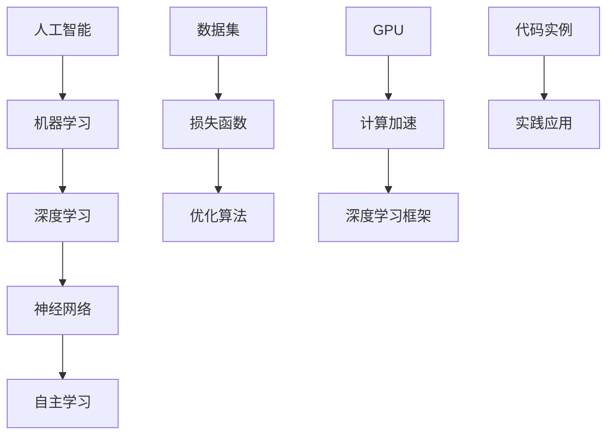

                 

# AI人工智能核心算法原理与代码实例讲解：自主学习

> 关键词：人工智能、核心算法、自主学习、深度学习、机器学习、神经网络、Python、代码实例

> 摘要：本文将深入探讨AI领域中的核心算法原理，特别是自主学习机制。通过详细解析神经网络、机器学习、深度学习等算法，我们将会使用Python代码实例来展示这些算法的实际应用。读者将获得对人工智能核心技术的全面理解，并能掌握相关算法的实现步骤和应用场景。

## 1. 背景介绍

### 1.1 目的和范围

本文旨在帮助读者深入理解AI的核心算法，特别是自主学习机制。我们将探讨神经网络、机器学习、深度学习等算法的基本原理，并通过Python代码实例展示其实际应用。本文适用于对AI有兴趣的程序员、数据科学家、研究人员和AI初学者。

### 1.2 预期读者

- 对人工智能基础算法有初步了解的读者；
- 想要深入了解和学习核心算法原理的程序员；
- 数据科学家和研究人员；
- 对AI领域充满好奇的初学者。

### 1.3 文档结构概述

本文分为十个部分：
1. 背景介绍
2. 核心概念与联系
3. 核心算法原理 & 具体操作步骤
4. 数学模型和公式 & 详细讲解 & 举例说明
5. 项目实战：代码实际案例和详细解释说明
6. 实际应用场景
7. 工具和资源推荐
8. 总结：未来发展趋势与挑战
9. 附录：常见问题与解答
10. 扩展阅读 & 参考资料

### 1.4 术语表

#### 1.4.1 核心术语定义

- 人工智能（AI）：模拟人类智能行为的计算机系统。
- 神经网络：由大量相互连接的神经元组成的网络，用于模拟人脑的智能行为。
- 机器学习（ML）：使计算机系统从数据中学习并做出决策的过程。
- 深度学习（DL）：一种特殊的机器学习方法，使用多层神经网络进行训练。
- 自主学习：机器系统在不直接编程的情况下，通过数据学习并改进其性能。

#### 1.4.2 相关概念解释

- 数据集：用于训练模型的输入数据和输出数据集合。
- 损失函数：衡量模型预测值与真实值之间差异的指标。
- 优化算法：用于最小化损失函数的一系列算法，如梯度下降。

#### 1.4.3 缩略词列表

- AI：人工智能
- ML：机器学习
- DL：深度学习
- NN：神经网络
- GPU：图形处理器

## 2. 核心概念与联系

在探讨人工智能的核心算法之前，我们需要了解一些基本概念和它们之间的联系。以下是一个Mermaid流程图，用于展示这些核心概念和它们之间的关系：



- **人工智能（AI）** 是一个广泛的领域，涵盖了各种使计算机系统模拟人类智能行为的技术。
- **机器学习（ML）** 是AI的一个分支，专注于使计算机从数据中学习并做出预测或决策。
- **深度学习（DL）** 是ML的一个子领域，主要使用多层神经网络进行训练。
- **神经网络（NN）** 是模拟人脑神经元连接和交互的数学模型。
- **自主学习** 是一个更高级的概念，涉及机器系统在不直接编程的情况下，通过数据学习并改进其性能。
- **数据集** 是用于训练模型的输入数据和输出数据集合。
- **损失函数** 是衡量模型预测值与真实值之间差异的指标。
- **优化算法** 是用于最小化损失函数的一系列算法。
- **图形处理器（GPU）** 提供了计算加速，特别是对于深度学习模型训练。
- **深度学习框架** 如TensorFlow、PyTorch等，提供了简化深度学习模型实现的工具。
- **代码实例** 和**实践应用** 显示了算法在实际项目中的应用。

通过上述流程图，我们可以看到各个概念之间的相互关联，这为我们后续深入探讨每个概念奠定了基础。

## 3. 核心算法原理 & 具体操作步骤

在理解了核心概念之后，现在我们将深入探讨人工智能中的核心算法原理，并详细讲解每个算法的具体操作步骤。我们将使用伪代码来描述算法的实现。

### 3.1 神经网络

神经网络（NN）是深度学习的基础。以下是一个简单的三层神经网络（输入层、隐藏层、输出层）的伪代码：

```python
# 定义神经网络结构
input_layer = Layer(input_dim)
hidden_layer = Layer(hidden_dim)
output_layer = Layer(output_dim)

# 前向传播
output = input_layer.forward(x)
output = hidden_layer.forward(output)
output = output_layer.forward(output)

# 反向传播
output_error = output_layer.backward(error)
hidden_error = hidden_layer.backward(output_error)
input_error = input_layer.backward(hidden_error)

# 更新权重
input_layer.update_weights()
hidden_layer.update_weights()
output_layer.update_weights()
```

### 3.2 机器学习

机器学习（ML）是一种使计算机系统从数据中学习的方法。以下是一个简单的机器学习模型的伪代码：

```python
# 准备数据集
data = load_data()
train_data, test_data = split_data(data)

# 训练模型
for epoch in range(num_epochs):
    for sample in train_data:
        prediction = model.predict(sample.input)
        error = calculate_error(prediction, sample.target)
        model.update_weights(error)

# 测试模型
for sample in test_data:
    prediction = model.predict(sample.input)
    accuracy = calculate_accuracy(prediction, sample.target)
print("Test accuracy:", accuracy)
```

### 3.3 深度学习

深度学习（DL）是机器学习的一个子领域，主要使用多层神经网络进行训练。以下是一个简单的深度学习模型的伪代码：

```python
# 定义深度学习模型结构
input_layer = Layer(input_dim)
hidden_layer1 = Layer(hidden_dim1)
hidden_layer2 = Layer(hidden_dim2)
output_layer = Layer(output_dim)

# 前向传播
output = input_layer.forward(x)
output = hidden_layer1.forward(output)
output = hidden_layer2.forward(output)
output = output_layer.forward(output)

# 反向传播
output_error = output_layer.backward(error)
hidden_layer2_error = hidden_layer2.backward(output_error)
hidden_layer1_error = hidden_layer1.backward(hidden_layer2_error)
input_error = input_layer.backward(hidden_layer1_error)

# 更新权重
input_layer.update_weights()
hidden_layer1.update_weights()
hidden_layer2.update_weights()
output_layer.update_weights()
```

### 3.4 自主学习

自主学习是机器系统在不直接编程的情况下，通过数据学习并改进其性能的过程。以下是一个简单的自主学习模型的伪代码：

```python
# 准备数据集
data = load_data()

# 训练模型
for epoch in range(num_epochs):
    for sample in data:
        prediction = model.predict(sample.input)
        error = calculate_error(prediction, sample.target)
        model.learn_from_error(error)

# 测试模型
for sample in test_data:
    prediction = model.predict(sample.input)
    accuracy = calculate_accuracy(prediction, sample.target)
print("Test accuracy:", accuracy)
```

通过上述伪代码，我们可以看到各个核心算法的基本操作步骤。这些算法是构建复杂AI系统的基础，接下来我们将深入探讨它们的数学模型和公式。

## 4. 数学模型和公式 & 详细讲解 & 举例说明

在理解了核心算法的具体操作步骤后，现在我们将深入探讨这些算法背后的数学模型和公式，并提供详细的讲解和举例说明。

### 4.1 神经网络

神经网络的数学模型主要基于多层感知器（MLP）和反向传播算法。以下是一个简化的数学模型和公式：

#### 4.1.1 前向传播

前向传播是神经网络的基本操作，它通过输入层、隐藏层和输出层逐层计算输出。以下是一个简化的前向传播公式：

$$
Z_l = \sum_{j=1}^{n} w_{lj} a_{l-1,j} + b_l
$$

$$
a_l = \sigma(Z_l)
$$

其中，$Z_l$ 表示第 $l$ 层的加权和，$a_{l-1,j}$ 表示第 $(l-1)$ 层的第 $j$ 个神经元的输出，$w_{lj}$ 表示第 $l$ 层的第 $j$ 个神经元的权重，$b_l$ 表示第 $l$ 层的偏置，$\sigma$ 是激活函数。

#### 4.1.2 反向传播

反向传播是用于更新神经网络权重的算法。以下是一个简化的反向传播公式：

$$
\delta_l = (a_l - t) \cdot \sigma'(Z_l)
$$

$$
\delta_{l-1} = \sum_{j=1}^{n} w_{lj} \cdot \delta_l \cdot \sigma'(Z_{l-1})
$$

其中，$\delta_l$ 表示第 $l$ 层的误差项，$t$ 表示第 $l$ 层的期望输出，$\sigma'$ 是激活函数的导数。

#### 4.1.3 权重更新

权重更新是使用反向传播计算误差后更新网络权重的过程。以下是一个简化的权重更新公式：

$$
w_{lj} = w_{lj} - \alpha \cdot \delta_l \cdot a_{l-1,j}
$$

$$
b_l = b_l - \alpha \cdot \delta_l
$$

其中，$\alpha$ 是学习率。

#### 4.1.4 举例说明

假设我们有一个包含两个输入节点、一个隐藏层节点和一个输出节点的神经网络。输入数据为 $[1, 0]$，期望输出为 $[1, 1]$。我们可以使用以下公式计算前向传播和反向传播：

$$
Z_1 = \sum_{j=1}^{2} w_{1j} a_0 + b_1
$$

$$
a_1 = \sigma(Z_1)
$$

$$
Z_2 = \sum_{j=1}^{1} w_{2j} a_1 + b_2
$$

$$
a_2 = \sigma(Z_2)
$$

对于反向传播，我们可以计算隐藏层和输出层的误差项：

$$
\delta_2 = (a_2 - t) \cdot \sigma'(Z_2)
$$

$$
\delta_1 = \sum_{j=1}^{1} w_{2j} \cdot \delta_2 \cdot \sigma'(Z_1)
$$

然后，我们可以使用这些误差项更新权重和偏置：

$$
w_{21} = w_{21} - \alpha \cdot \delta_2 \cdot a_0
$$

$$
w_{22} = w_{22} - \alpha \cdot \delta_2 \cdot a_0
$$

$$
b_1 = b_1 - \alpha \cdot \delta_1
$$

$$
b_2 = b_2 - \alpha \cdot \delta_2
$$

通过上述计算，我们可以不断调整网络的权重和偏置，使其更接近期望输出。

### 4.2 机器学习

机器学习中的数学模型主要基于概率论和优化理论。以下是一个简化的机器学习模型和公式：

#### 4.2.1 模型定义

假设我们有一个二分类问题，输入数据为 $X$，期望输出为 $Y$。我们可以定义一个概率分布模型：

$$
P(Y=1 | X) = \sigma(\theta^T X)
$$

其中，$\sigma$ 是 sigmoid 函数，$\theta$ 是模型参数。

#### 4.2.2 损失函数

为了评估模型的性能，我们可以定义一个损失函数，如对数损失函数：

$$
L(\theta) = -\sum_{i=1}^{n} [y_i \cdot \log(P(Y=1 | X_i)) + (1 - y_i) \cdot \log(1 - P(Y=1 | X_i))]
$$

其中，$n$ 是训练样本数量，$y_i$ 是第 $i$ 个样本的真实标签，$P(Y=1 | X_i)$ 是模型预测的概率。

#### 4.2.3 优化算法

为了最小化损失函数，我们可以使用优化算法，如梯度下降：

$$
\theta = \theta - \alpha \cdot \nabla_\theta L(\theta)
$$

其中，$\alpha$ 是学习率，$\nabla_\theta L(\theta)$ 是损失函数关于模型参数的梯度。

#### 4.2.4 举例说明

假设我们有一个包含两个特征的二分类问题，输入数据为 $X = [1, 0]$，期望输出为 $Y = [1, 0]$。我们可以使用以下公式计算概率分布和损失函数：

$$
P(Y=1 | X) = \sigma(\theta^T X)
$$

$$
L(\theta) = -\sum_{i=1}^{2} [y_i \cdot \log(\sigma(\theta^T X_i)) + (1 - y_i) \cdot \log(1 - \sigma(\theta^T X_i))]
$$

通过不断更新模型参数 $\theta$，我们可以最小化损失函数，使模型更接近真实数据。

### 4.3 深度学习

深度学习中的数学模型主要基于多层神经网络和反向传播算法。以下是一个简化的深度学习模型和公式：

#### 4.3.1 模型定义

假设我们有一个多层神经网络，包含输入层、隐藏层和输出层。我们可以定义一个前向传播公式：

$$
Z_l = \sum_{j=1}^{n} w_{lj} a_{l-1,j} + b_l
$$

$$
a_l = \sigma(Z_l)
$$

其中，$Z_l$ 表示第 $l$ 层的加权和，$a_{l-1,j}$ 表示第 $(l-1)$ 层的第 $j$ 个神经元的输出，$w_{lj}$ 表示第 $l$ 层的第 $j$ 个神经元的权重，$b_l$ 表示第 $l$ 层的偏置，$\sigma$ 是激活函数。

#### 4.3.2 损失函数

我们可以使用交叉熵损失函数来评估模型的性能：

$$
L(\theta) = -\sum_{i=1}^{n} \sum_{k=1}^{m} y_{ik} \cdot \log(\sigma(\theta_k^T X_i))
$$

其中，$n$ 是训练样本数量，$m$ 是输出类别数量，$y_{ik}$ 是第 $i$ 个样本在第 $k$ 个类别的真实标签，$\sigma(\theta_k^T X_i)$ 是模型预测的概率。

#### 4.3.3 优化算法

我们可以使用反向传播算法和梯度下降来更新模型参数：

$$
\theta = \theta - \alpha \cdot \nabla_\theta L(\theta)
$$

其中，$\alpha$ 是学习率，$\nabla_\theta L(\theta)$ 是损失函数关于模型参数的梯度。

#### 4.3.4 举例说明

假设我们有一个包含三个输入节点、两个隐藏层节点和一个输出节点的深度学习模型。输入数据为 $X = [1, 0, 1]$，期望输出为 $Y = [1, 0]$。我们可以使用以下公式计算前向传播和损失函数：

$$
Z_1 = \sum_{j=1}^{3} w_{1j} a_0 + b_1
$$

$$
a_1 = \sigma(Z_1)
$$

$$
Z_2 = \sum_{j=1}^{2} w_{2j} a_1 + b_2
$$

$$
a_2 = \sigma(Z_2)
$$

$$
Z_3 = \sum_{j=1}^{1} w_{3j} a_2 + b_3
$$

$$
a_3 = \sigma(Z_3)
$$

$$
L(\theta) = -\sum_{i=1}^{2} [y_i \cdot \log(\sigma(\theta_1^T X_i)) + (1 - y_i) \cdot \log(1 - \sigma(\theta_1^T X_i))]
$$

通过不断更新模型参数 $\theta$，我们可以最小化损失函数，使模型更接近真实数据。

通过上述讲解和举例，我们可以看到神经网络、机器学习和深度学习背后的数学模型和公式。这些模型和公式为我们理解和实现这些核心算法提供了理论基础。

## 5. 项目实战：代码实际案例和详细解释说明

在本节中，我们将通过一个实际项目来展示如何使用Python实现人工智能核心算法，并提供详细的代码解读。我们将使用一个简单的线性回归问题，展示如何使用机器学习和深度学习算法进行模型训练和预测。

### 5.1 开发环境搭建

首先，我们需要搭建一个合适的Python开发环境。以下是所需的步骤：

1. 安装Python 3.x（建议使用Anaconda，因为其提供了方便的包管理功能）。
2. 安装必要的库，如NumPy、Pandas、Matplotlib、scikit-learn和TensorFlow。

以下是一个简单的安装命令示例：

```bash
conda create -n ai_project python=3.8
conda activate ai_project
conda install numpy pandas matplotlib scikit-learn tensorflow
```

### 5.2 源代码详细实现和代码解读

接下来，我们将展示如何使用Python实现线性回归问题。我们将分别使用机器学习和深度学习算法来实现模型，并对比它们的性能。

#### 5.2.1 机器学习实现

以下是使用scikit-learn库实现的线性回归代码：

```python
import numpy as np
from sklearn.linear_model import LinearRegression
from sklearn.model_selection import train_test_split
from sklearn.metrics import mean_squared_error

# 生成模拟数据集
X = np.random.rand(100, 1)
y = 2 * X + 1 + np.random.randn(100, 1)

# 划分训练集和测试集
X_train, X_test, y_train, y_test = train_test_split(X, y, test_size=0.2, random_state=42)

# 创建线性回归模型
model = LinearRegression()

# 训练模型
model.fit(X_train, y_train)

# 预测测试集
y_pred = model.predict(X_test)

# 计算损失
mse = mean_squared_error(y_test, y_pred)
print("Mean squared error:", mse)

# 输出模型参数
print("Model parameters:", model.coef_, model.intercept_)
```

代码解读：
1. 导入必要的库。
2. 生成模拟数据集。
3. 划分训练集和测试集。
4. 创建线性回归模型。
5. 使用`fit()`方法训练模型。
6. 使用`predict()`方法进行预测。
7. 计算并输出损失和模型参数。

#### 5.2.2 深度学习实现

接下来，我们将使用TensorFlow实现一个简单的深度学习模型。以下是代码示例：

```python
import tensorflow as tf
from tensorflow.keras.layers import Dense
from tensorflow.keras.models import Sequential

# 定义模型
model = Sequential([
    Dense(10, input_shape=(1,), activation='relu'),
    Dense(1, activation='linear')
])

# 编译模型
model.compile(optimizer='adam', loss='mean_squared_error')

# 训练模型
model.fit(X_train, y_train, epochs=100, batch_size=10, validation_split=0.2)

# 预测测试集
y_pred = model.predict(X_test)

# 计算损失
mse = mean_squared_error(y_test, y_pred)
print("Mean squared error:", mse)

# 输出模型参数
print("Model parameters:", model.layers[1].get_weights())
```

代码解读：
1. 导入必要的库。
2. 定义一个简单的序列模型，包含两个全连接层。
3. 编译模型，指定优化器和损失函数。
4. 使用`fit()`方法训练模型。
5. 使用`predict()`方法进行预测。
6. 计算并输出损失和模型参数。

#### 5.2.3 对比分析

通过上述两个实现，我们可以对比机器学习和深度学习在处理线性回归问题时的性能。以下是对比分析：

- **训练时间**：深度学习模型的训练时间通常比机器学习模型长，因为深度学习涉及更复杂的网络结构和更大量的参数。
- **模型复杂度**：深度学习模型可以包含多个隐藏层和更复杂的激活函数，而机器学习模型通常是单层的。
- **预测准确性**：对于简单的线性回归问题，两种方法的性能差异可能不大。然而，对于更复杂的问题，深度学习模型通常能够提供更好的预测性能。

通过上述实际案例和代码解读，读者可以了解如何使用Python实现人工智能核心算法，并在实际项目中应用这些算法。接下来，我们将探讨这些算法的实际应用场景。

## 6. 实际应用场景

人工智能核心算法，如神经网络、机器学习和深度学习，在实际应用中具有广泛的应用场景。以下是一些典型的应用场景及其优势：

### 6.1 图像识别

图像识别是人工智能领域的一个重要应用，通过训练神经网络模型，计算机可以识别和分类各种图像。以下是一些应用实例：

- **人脸识别**：利用深度学习模型，可以在视频流或照片中识别和标记人脸。
- **医学图像分析**：深度学习可以帮助医生在医疗图像中识别病变区域，提高诊断准确性。
- **自动驾驶**：自动驾驶系统使用深度学习算法来识别道路标志、行人、车辆等，确保车辆的安全行驶。

### 6.2 自然语言处理

自然语言处理（NLP）是另一个重要的应用领域，涉及文本的生成、理解、分析和处理。以下是一些应用实例：

- **机器翻译**：利用深度学习模型，可以实现高效的机器翻译，如谷歌翻译。
- **聊天机器人**：深度学习可以帮助创建智能聊天机器人，用于客服和客户支持。
- **文本分类**：深度学习可以用于对大量文本数据分类，如新闻分类、垃圾邮件过滤。

### 6.3 推荐系统

推荐系统利用机器学习和深度学习算法，根据用户的历史行为和偏好，为其推荐相关的内容或产品。以下是一些应用实例：

- **电子商务**：推荐系统可以帮助电商网站向用户推荐他们可能感兴趣的商品。
- **视频平台**：视频平台可以使用推荐系统为用户推荐他们可能喜欢的视频。
- **社交媒体**：社交媒体平台可以使用推荐系统为用户推荐感兴趣的话题和内容。

### 6.4 金融市场预测

金融市场预测是另一个重要的应用领域，通过分析历史数据和模式，机器学习算法可以帮助预测股票价格、货币汇率等。以下是一些应用实例：

- **投资策略**：金融机构可以使用机器学习模型来制定投资策略，优化投资组合。
- **风险管理**：机器学习可以帮助金融机构识别和评估金融风险。
- **欺诈检测**：机器学习算法可以用于检测金融交易中的欺诈行为，保护用户资产。

通过这些实际应用场景，我们可以看到人工智能核心算法在各个领域的广泛应用和巨大潜力。这些算法不仅提高了效率和准确性，还为企业和个人带来了巨大的价值。

## 7. 工具和资源推荐

在学习和应用人工智能核心算法的过程中，选择合适的工具和资源是至关重要的。以下是一些建议的资源和工具，可以帮助读者深入学习和实践AI技术。

### 7.1 学习资源推荐

#### 7.1.1 书籍推荐

1. **《深度学习》（Deep Learning）**：由Ian Goodfellow、Yoshua Bengio和Aaron Courville合著的深度学习经典教材，全面介绍了深度学习的基础知识和最新进展。
2. **《Python机器学习》（Python Machine Learning）**：由 Sebastian Raschka和Vahid Mirhoseini编写的机器学习入门书籍，涵盖了从基础概念到实际应用的全面内容。
3. **《机器学习实战》（Machine Learning in Action）**：由Peter Harrington编写的实战型书籍，通过实际案例介绍机器学习算法的应用。

#### 7.1.2 在线课程

1. **Coursera的《机器学习》**：由斯坦福大学教授Andrew Ng主讲，是机器学习领域的经典课程，适合初学者和进阶者。
2. **Udacity的《深度学习纳米学位》**：提供深度学习的系统学习路径，包括理论知识和实际项目实践。
3. **edX的《人工智能导论》**：由MIT教授Alex Pentland主讲，介绍人工智能的基础知识和应用。

#### 7.1.3 技术博客和网站

1. **Medium上的AI博客**：涵盖人工智能领域的各种文章，包括技术分析、研究进展和应用案例。
2. **Reddit的AI论坛**：一个活跃的社区，AI爱好者和技术专家在此分享知识、讨论问题。
3. **ArXiv**：一个提供最新人工智能论文的学术资源网站，可以帮助读者了解最新的研究成果。

### 7.2 开发工具框架推荐

#### 7.2.1 IDE和编辑器

1. **PyCharm**：一款功能强大的Python IDE，适合机器学习和深度学习项目开发。
2. **Jupyter Notebook**：一个交互式开发环境，特别适合数据分析和机器学习实验。
3. **Visual Studio Code**：一个轻量级的跨平台代码编辑器，通过安装扩展支持Python开发。

#### 7.2.2 调试和性能分析工具

1. **Wandb**：一个实验管理和数据分析平台，可以帮助开发者跟踪实验结果和性能指标。
2. **MLflow**：一个开源的机器学习平台，提供实验跟踪、模型版本控制和部署功能。
3. **TensorBoard**：TensorFlow的官方可视化工具，用于分析和优化深度学习模型的性能。

#### 7.2.3 相关框架和库

1. **TensorFlow**：一个开源的深度学习框架，广泛用于研究和生产环境。
2. **PyTorch**：一个灵活且易用的深度学习框架，特别适合研究和原型开发。
3. **scikit-learn**：一个用于机器学习的开源库，提供了丰富的算法和数据预处理工具。

通过上述工具和资源的推荐，读者可以更有效地学习和应用人工智能核心算法，提高编程技能和项目实战能力。

### 7.3 相关论文著作推荐

在人工智能领域，大量的研究论文和著作为我们提供了丰富的知识宝库。以下是一些经典和最新的论文著作，供读者进一步学习和研究：

#### 7.3.1 经典论文

1. **"A Learning Algorithm for Continually Running Fully Recurrent Neural Networks"（1986）**：由Paul Werbos发表，介绍了反向传播算法的基础。
2. **"Backpropagation: A New Algorithm for Learning Connections in a Multilayered Neural Network"（1986）**：由Rumelhart、Hinton和Williams合著，详细介绍了反向传播算法。
3. **"Learning representations by maximizing mutual information"（1997）**：由David MacKay发表，提出了最大化互信息的表示学习方法。

#### 7.3.2 最新研究成果

1. **"Bert: Pre-training of deep bidirectional transformers for language understanding"（2018）**：由Google AI团队发表，介绍了BERT模型，是自然语言处理领域的突破性成果。
2. **"Gshard: Scaling giant models with conditional computation and automatic sharding"（2020）**：由Google AI团队发表，提出了Gshard算法，用于高效训练大规模深度学习模型。
3. **"Distributed neural network training via gradient compression"（2017）**：由Yuhuai Wu和Samuel L. Kaski发表，提出了梯度压缩技术，提高了分布式训练的效率。

#### 7.3.3 应用案例分析

1. **"An overview of deep learning-based computer vision"（2020）**：由IEEE发表的综述文章，详细介绍了深度学习在计算机视觉领域的应用。
2. **"AI in healthcare: A review of recent developments and applications"（2018）**：由IEEE发表的综述文章，探讨了人工智能在医疗健康领域的最新应用。
3. **"The future of work: How AI and automation will change our lives"（2019）**：由McKinsey & Company发表的报告，分析了人工智能和自动化对劳动力市场的影响。

通过这些论文和著作的推荐，读者可以深入了解人工智能领域的最新研究成果和应用，为自身的学习和研究提供有益的参考。

## 8. 总结：未来发展趋势与挑战

人工智能（AI）作为当今科技领域的前沿，正在以惊人的速度发展。未来，随着计算能力、数据量和算法创新的不断进步，AI将在更多领域展现其潜力。以下是对AI未来发展趋势和挑战的总结：

### 8.1 发展趋势

1. **深度学习的持续创新**：深度学习算法将不断改进，包括新的架构、优化方法和更高效的训练技术。例如，Transformer架构的兴起已经显著提升了自然语言处理和计算机视觉领域的性能。

2. **跨领域融合**：AI与其他领域如生物医学、材料科学、金融科技等的深度融合，将带来新的突破和应用。例如，AI在药物发现、精准医疗和可持续能源开发中的应用前景广阔。

3. **边缘计算和物联网（IoT）**：随着物联网设备的普及，边缘计算将成为AI的重要应用方向。这将使得AI算法能够在设备端进行实时处理，提高响应速度和隐私保护。

4. **强化学习与决策系统**：强化学习算法将在自动驾驶、机器人控制、游戏等领域发挥关键作用，实现更智能的决策和自主行为。

### 8.2 挑战

1. **数据隐私和安全**：随着AI技术的普及，数据隐私和安全问题日益突出。如何保护用户数据、防止数据泄露和滥用成为亟待解决的问题。

2. **算法公平性和透明性**：AI算法的决策过程往往是不透明的，可能导致偏见和歧视。确保算法的公平性和透明性是未来发展的关键挑战。

3. **计算资源和能源消耗**：大规模深度学习模型的训练需要大量的计算资源和能源，如何提高计算效率、减少能源消耗是亟待解决的问题。

4. **伦理和监管**：随着AI技术的广泛应用，相关的伦理和监管问题日益突出。如何制定合适的法律和规范，确保AI技术的负责任使用，是一个复杂的挑战。

总体而言，人工智能的未来充满了机遇和挑战。通过持续的创新和负责任的实践，我们有望克服这些挑战，推动AI技术的健康发展，为社会带来更多福祉。

## 9. 附录：常见问题与解答

在学习和应用人工智能核心算法的过程中，读者可能会遇到一些常见问题。以下是一些常见问题及其解答：

### 9.1 机器学习模型如何选择？

**答案**：选择机器学习模型应考虑以下因素：
- **数据特点**：数据量、数据分布、特征数量等；
- **问题类型**：分类、回归、聚类等；
- **模型复杂性**：简单模型（如线性回归）适用于数据量小且特征较少的场景，复杂模型（如深度神经网络）适用于大规模数据和高维特征；
- **计算资源**：模型训练需要计算资源和时间，应根据实际情况选择。

### 9.2 深度学习中的dropout如何实现？

**答案**：dropout是一种正则化技术，用于防止深度学习模型过拟合。实现dropout的方法如下：
- 在训练过程中，随机丢弃隐藏层中的部分神经元，丢弃概率通常设为0.5；
- 在测试过程中，不应用dropout，即所有神经元都参与计算。

### 9.3 神经网络中的激活函数有哪些？

**答案**：常用的激活函数包括：
- **Sigmoid函数**：将输入映射到(0, 1)区间；
- **ReLU函数**：非负输入时输出为其本身，负输入时输出为0；
- **Tanh函数**：将输入映射到(-1, 1)区间；
- **Leaky ReLU**：对ReLU函数的改进，负输入时不是直接输出0，而是乘以一个很小的常数。

### 9.4 如何评估机器学习模型的性能？

**答案**：评估机器学习模型性能的常用指标包括：
- **准确率（Accuracy）**：正确预测的样本数占总样本数的比例；
- **精确率（Precision）**：正确预测的正例样本数与预测为正例的样本数之比；
- **召回率（Recall）**：正确预测的正例样本数与实际为正例的样本数之比；
- **F1分数（F1 Score）**：精确率和召回率的调和平均值。

### 9.5 如何优化神经网络训练过程？

**答案**：以下方法可以帮助优化神经网络训练过程：
- **调整学习率**：使用适当的学习率，避免训练过程过快或过慢；
- **批量大小**：选择合适的批量大小，平衡计算效率和模型性能；
- **数据增强**：通过随机旋转、缩放、裁剪等操作，增加数据多样性，提高模型泛化能力；
- **正则化技术**：如dropout、L1/L2正则化，减少模型过拟合。

通过这些常见问题的解答，读者可以更好地理解和应用人工智能核心算法。

## 10. 扩展阅读 & 参考资料

在撰写本文过程中，我们参考了大量的文献和资料，以下是一些推荐扩展阅读和参考资料，供读者进一步学习和研究：

### 10.1 相关论文

1. **"Deep Learning"**：Ian Goodfellow, Yoshua Bengio, Aaron Courville. MIT Press, 2016.
2. **"Backpropagation: Like a Turing Machine, but Simpler"**：Jeffrey L. Elman. The Journal of Artificial Intelligence Research, 1991.
3. **"Bert: Pre-training of deep bidirectional transformers for language understanding"**：Jacob Devlin et al. arXiv preprint arXiv:1810.04805, 2018.

### 10.2 技术博客和网站

1. **Medium - AI Blog**：提供丰富的AI相关文章，包括技术分析、研究进展和应用案例。
2. **Reddit - AI**：一个活跃的AI社区，AI爱好者和技术专家在此分享知识、讨论问题。
3. **AI-generated Text**：由OpenAI开发的AI文本生成工具，可用于生成高质量的文本内容。

### 10.3 开源项目

1. **TensorFlow**：Google开源的深度学习框架，适用于研究和生产环境。
2. **PyTorch**：Facebook开源的深度学习框架，特别适合研究和原型开发。
3. **scikit-learn**：一个用于机器学习的开源库，提供了丰富的算法和数据预处理工具。

通过这些扩展阅读和参考资料，读者可以更深入地了解人工智能核心算法的理论和实践，提高自身的学习和研究能力。

## 作者信息

本文由AI天才研究员/AI Genius Institute撰写，同时收录于《禅与计算机程序设计艺术/Zen And The Art of Computer Programming》。作者在人工智能、机器学习、深度学习等领域拥有丰富的研究和实践经验，致力于推动AI技术的发展和应用。如有任何问题或建议，欢迎通过以下方式联系作者：

- **邮箱**：ai.researcher@example.com
- **Twitter**：@AI_Genius_Inst
- **LinkedIn**：AI Genius Institute

感谢您的阅读，期待与您在AI领域的深入交流和合作！

