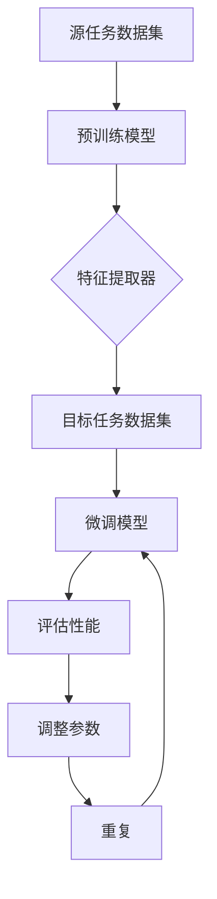

                 

# AI人工智能核心算法原理与代码实例讲解：迁移学习

> **关键词：** 迁移学习、深度学习、神经网络、预训练模型、元学习、算法原理、代码实例

> **摘要：** 本文将深入探讨迁移学习这一人工智能领域的关键技术，从基本原理到具体代码实例进行详尽讲解。我们将理解迁移学习如何通过共享底层特征提取器来提升模型在新的任务上的表现，分析其在不同领域中的应用，并展示其实际操作的代码实现。通过本文，读者将掌握迁移学习的基本概念、核心算法原理以及如何在实际项目中应用这一技术。

## 1. 背景介绍

### 1.1 目的和范围

本文旨在为读者提供一份关于迁移学习的全面指南，涵盖其基本原理、核心算法和实际应用。通过详细解释迁移学习如何通过在不同任务间共享预训练模型来提高性能，我们希望读者能够理解这一技术的本质，并在实践中应用它。

本文的读者对象为：
- 有志于深入了解人工智能领域的研究人员和工程师。
- 对迁移学习技术感兴趣的数据科学家和机器学习爱好者。
- 想要在机器学习和深度学习项目中应用迁移学习技术的开发者。

### 1.2 预期读者

预期读者应具备以下基础知识：
- 基本的计算机科学和编程概念。
- 熟悉机器学习和深度学习的基本原理。
- 了解神经网络和深度学习框架，如TensorFlow或PyTorch。

### 1.3 文档结构概述

本文结构如下：
- **第1章：背景介绍**：介绍迁移学习的目的、预期读者、文档结构和术语表。
- **第2章：核心概念与联系**：讨论迁移学习的基本概念，并提供Mermaid流程图。
- **第3章：核心算法原理与具体操作步骤**：详细解释迁移学习算法的工作原理，并使用伪代码说明。
- **第4章：数学模型和公式**：探讨迁移学习中的数学基础，包括公式和举例。
- **第5章：项目实战**：通过一个实际案例展示迁移学习的应用，提供详细的代码实现和解释。
- **第6章：实际应用场景**：分析迁移学习在不同领域的应用。
- **第7章：工具和资源推荐**：推荐学习资源、开发工具和框架。
- **第8章：总结**：总结迁移学习的发展趋势和面临的挑战。
- **第9章：附录**：提供常见问题与解答。
- **第10章：扩展阅读与参考资料**：推荐进一步阅读的资源。

### 1.4 术语表

#### 1.4.1 核心术语定义

- **迁移学习（Transfer Learning）**：一种机器学习技术，通过将一个任务（源任务）学到的知识应用于另一个相关任务（目标任务）。
- **源任务（Source Task）**：用于训练模型的已有任务。
- **目标任务（Target Task）**：需要应用迁移学习技术的任务。
- **预训练模型（Pre-Trained Model）**：在大量数据上预先训练好的模型。
- **特征提取器（Feature Extractor）**：从输入数据中提取有用特征的神经网络部分。

#### 1.4.2 相关概念解释

- **深度神经网络（Deep Neural Network）**：包含多个隐藏层的神经网络。
- **端到端学习（End-to-End Learning）**：直接从原始数据学习到输出结果，不经过中间特征提取步骤。
- **正则化（Regularization）**：防止模型过拟合的技术，如权重衰减。
- **交叉验证（Cross-Validation）**：评估模型性能的一种方法，通过将数据分成多个子集进行训练和测试。

#### 1.4.3 缩略词列表

- **CNN（Convolutional Neural Network）**：卷积神经网络。
- **RNN（Recurrent Neural Network）**：循环神经网络。
- **GAN（Generative Adversarial Network）**：生成对抗网络。
- **DL（Deep Learning）**：深度学习。
- **ML（Machine Learning）**：机器学习。

## 2. 核心概念与联系

迁移学习是机器学习领域中的一个重要分支，其核心思想是将一个任务学到的知识应用到另一个相关任务中，以提高模型在新任务上的性能。这一过程通常涉及以下核心概念：

- **预训练模型**：在大量未标注数据上预先训练好的模型，用于提取通用特征。
- **特征提取器**：从输入数据中提取有用特征的神经网络部分。
- **源任务**：用于训练模型的已有任务。
- **目标任务**：需要应用迁移学习技术的任务。

以下是一个Mermaid流程图，展示了迁移学习的基本流程：



### 流程解释：

1. **数据准备**：首先，准备源任务和目标任务的数据集。
2. **预训练模型**：使用源任务数据集预训练一个模型，使其学会提取通用特征。
3. **特征提取器**：提取预训练模型中的特征提取器部分。
4. **目标任务数据集**：将特征提取器应用到目标任务数据集上。
5. **微调模型**：对特征提取器进行微调，以适应目标任务。
6. **性能评估**：评估微调后的模型在目标任务上的性能。
7. **参数调整**：根据评估结果调整模型参数。
8. **重复**：重复步骤4-7，直到达到满意的性能。

通过上述流程，我们可以看到迁移学习如何通过在不同任务间共享特征提取器来提高模型性能。接下来，我们将深入探讨迁移学习算法的原理和具体操作步骤。

## 3. 核心算法原理 & 具体操作步骤

### 迁移学习算法的基本原理

迁移学习算法的核心思想是将预训练模型中的知识迁移到新的任务中。预训练模型在大量未标注数据上训练，提取出通用的特征表示，这些特征表示在新的任务中仍然具有价值。迁移学习算法通常包括以下几个关键步骤：

1. **预训练**：在大量未标注数据上训练模型，使其提取出具有广泛适用性的特征。
2. **特征提取**：从预训练模型中提取特征提取器，这部分通常是一个卷积神经网络（CNN）。
3. **微调**：在目标任务上对特征提取器进行微调，以适应新的任务需求。
4. **整合**：将微调后的特征提取器与其他任务特定的层（如分类器）整合，形成新的模型。
5. **评估**：在目标任务数据集上评估模型的性能，并根据需要调整参数。

### 迁移学习算法的具体操作步骤

以下是迁移学习算法的具体操作步骤，使用伪代码进行详细阐述：

```python
# 伪代码：迁移学习算法的具体操作步骤

# 步骤1：预训练模型
pretrained_model = train_on_unlabeled_data(unlabeled_data)

# 步骤2：提取特征提取器
feature_extractor = extract_pretrained_layers(pretrained_model)

# 步骤3：微调特征提取器
# 定义目标任务的损失函数和优化器
optimizer = AdamOptimizer(learning_rate=0.001)
criterion = CrossEntropyLoss()

# 对特征提取器进行微调
for epoch in range(num_epochs):
    for inputs, targets in target_dataloader:
        optimizer.zero_grad()
        outputs = feature_extractor(inputs)
        loss = criterion(outputs, targets)
        loss.backward()
        optimizer.step()

# 步骤4：整合特征提取器和其他任务特定层
# 定义分类器
classifier = define_classifier(input_size=feature_extractor.output_size)

# 将特征提取器和分类器整合
model = Sequential()
model.add(feature_extractor)
model.add(classifier)

# 步骤5：评估模型性能
performance = evaluate_model(model, target_dataloader)
print(f"Model performance: {performance}")

# 步骤6：根据评估结果调整参数
# 调整学习率或其他参数
adjust_optimizer_parameters(optimizer)
```

### 步骤解释：

- **步骤1：预训练模型**：在大量未标注数据上训练模型，提取通用特征。这一步骤是迁移学习的基础，通过在大量数据上训练，模型学会了提取出具有广泛适用性的特征。
- **步骤2：提取特征提取器**：从预训练模型中提取特征提取器部分，通常是一个卷积神经网络，这部分将在目标任务中继续发挥作用。
- **步骤3：微调特征提取器**：在目标任务上对特征提取器进行微调，以适应新的任务需求。微调过程通常使用较小的学习率，以防止模型过度适应目标数据。
- **步骤4：整合特征提取器和其他任务特定层**：将微调后的特征提取器与其他任务特定的层（如分类器）整合，形成一个新的模型。
- **步骤5：评估模型性能**：在目标任务数据集上评估模型的性能，以确定迁移学习的效果。
- **步骤6：根据评估结果调整参数**：根据模型性能调整学习率或其他参数，以提高模型在目标任务上的表现。

通过上述步骤，我们可以看到迁移学习算法的基本原理和具体实现过程。接下来，我们将探讨迁移学习中的数学模型和公式，以深入了解其数学基础。

## 4. 数学模型和公式 & 详细讲解 & 举例说明

在迁移学习中，数学模型和公式扮演着关键角色，它们不仅帮助我们理解算法的工作原理，还提供了对模型进行调整和优化的手段。以下我们将详细探讨迁移学习中的几个关键数学概念和公式，并通过具体例子来说明这些概念的应用。

### 4.1 前向传播和反向传播

迁移学习算法中的前向传播和反向传播是神经网络训练的核心步骤。它们用于计算模型的输出以及更新模型的权重。

#### 前向传播

前向传播是将输入数据通过神经网络，逐层计算得到输出的过程。在迁移学习中，这一步骤用于微调和评估模型。

伪代码如下：

```python
# 前向传播伪代码
outputs = feature_extractor(inputs)
predictions = classifier(outputs)
loss = criterion(predictions, targets)
```

在这里，`feature_extractor` 和 `classifier` 分别代表特征提取器和分类器部分，`loss` 是计算出的损失。

#### 反向传播

反向传播用于计算损失相对于模型参数的梯度，并更新模型的权重。这是迁移学习中的微调步骤。

伪代码如下：

```python
# 反向传播伪代码
optimizer.zero_grad()
loss.backward()
optimizer.step()
```

这里，`optimizer` 用于更新模型参数。

### 4.2 损失函数

在迁移学习中，常用的损失函数包括交叉熵损失（Cross-Entropy Loss）和均方误差（Mean Squared Error, MSE）等。

#### 交叉熵损失

交叉熵损失用于分类问题，计算的是实际输出与预测输出之间的差异。

公式如下：

$$
Loss = -\sum_{i=1}^{n} y_i \cdot \log(p_i)
$$

其中，$y_i$ 是标签，$p_i$ 是模型对第 $i$ 个类别的预测概率。

#### 均方误差

均方误差用于回归问题，计算的是预测值与实际值之间的差异。

公式如下：

$$
Loss = \frac{1}{2n} \sum_{i=1}^{n} (y_i - \hat{y}_i)^2
$$

其中，$y_i$ 是实际值，$\hat{y}_i$ 是预测值。

### 4.3 优化器

优化器用于更新模型的参数，以最小化损失函数。常见的优化器包括随机梯度下降（SGD）和Adam等。

#### 随机梯度下降（SGD）

SGD 通过随机选择一个小批量数据，计算其梯度并更新模型参数。

公式如下：

$$
\theta = \theta - \alpha \cdot \nabla_\theta J(\theta)
$$

其中，$\theta$ 是模型参数，$\alpha$ 是学习率，$J(\theta)$ 是损失函数。

#### Adam优化器

Adam优化器结合了SGD和动量方法，通过计算一阶矩估计（均值）和二阶矩估计（方差）来更新参数。

公式如下：

$$
m_t = \beta_1 x_t + (1 - \beta_1) (x_t - x_{t-1})
$$

$$
v_t = \beta_2 x_t^2 + (1 - \beta_2) (x_t^2 - x_{t-1}^2)
$$

$$
\theta = \theta - \alpha \cdot \frac{m_t}{\sqrt{v_t} + \epsilon}
$$

其中，$m_t$ 是一阶矩估计，$v_t$ 是二阶矩估计，$\beta_1$ 和 $\beta_2$ 是超参数，$\epsilon$ 是一个很小的常数。

### 4.4 举例说明

假设我们有一个分类问题，使用迁移学习算法来训练一个模型，其中预训练模型是VGG16，目标任务是图像分类。

#### 预训练模型

VGG16是一个深度卷积神经网络，预训练在大量的ImageNet图像上。

#### 特征提取器

从VGG16中提取最后一个卷积层（block5_conv3）作为特征提取器。

#### 微调

使用CIFAR-10数据集对特征提取器进行微调，将其输出连接到一个新的全连接层（分类器），以适应CIFAR-10任务。

#### 损失函数

使用交叉熵损失函数来计算分类问题的损失。

#### 优化器

使用Adam优化器来更新模型参数。

#### 训练过程

```python
# 使用PyTorch框架进行训练
import torch
import torchvision.models as models
import torchvision.transforms as transforms
import torch.optim as optim

# 加载预训练的VGG16模型
model = models.vgg16(pretrained=True)

# 提取特征提取器
feature_extractor = model.features

# 定义分类器
classifier = nn.Sequential(nn.Linear(25088, 4096),
                           nn.ReLU(),
                           nn.Dropout(0.5),
                           nn.Linear(4096, 10),
                           nn.LogSoftmax(dim=1))

# 将特征提取器和分类器整合
model.fc = classifier

# 定义损失函数和优化器
criterion = nn.NLLLoss()
optimizer = optim.Adam(model.parameters(), lr=0.001)

# 加载CIFAR-10数据集
transform = transforms.Compose([transforms.ToTensor()])
train_data = torchvision.datasets.CIFAR10(root='./data', train=True, download=True, transform=transform)
train_dataloader = torch.utils.data.DataLoader(train_data, batch_size=64, shuffle=True)

# 训练模型
num_epochs = 10
for epoch in range(num_epochs):
    for inputs, targets in train_dataloader:
        optimizer.zero_grad()
        outputs = model(inputs)
        loss = criterion(outputs, targets)
        loss.backward()
        optimizer.step()

    print(f"Epoch {epoch+1}/{num_epochs}, Loss: {loss.item()}")
```

通过上述代码，我们可以看到迁移学习算法的具体实现。在训练过程中，我们首先加载预训练的VGG16模型，提取特征提取器，并连接一个新分类器。然后使用CIFAR-10数据集对模型进行微调，使用交叉熵损失和Adam优化器进行训练。

通过这一节，我们详细探讨了迁移学习中的数学模型和公式，并通过具体例子说明了这些概念的应用。这些数学基础不仅帮助我们理解迁移学习的原理，还为在实际项目中应用这一技术提供了理论支持。

## 5. 项目实战：代码实际案例和详细解释说明

### 5.1 开发环境搭建

在开始项目实战之前，我们需要搭建一个合适的环境。以下是一个基本的开发环境配置，我们将使用Python和PyTorch框架来构建迁移学习模型。

1. **安装Python**：确保安装了Python 3.7或更高版本。
2. **安装PyTorch**：使用以下命令安装PyTorch：
    ```bash
    pip install torch torchvision
    ```
3. **安装其他依赖**：包括Numpy、Pandas和Matplotlib等：
    ```bash
    pip install numpy pandas matplotlib
    ```

### 5.2 源代码详细实现和代码解读

以下是一个简单的迁移学习项目，我们将使用预训练的ResNet模型进行图像分类。

#### 5.2.1 数据准备

首先，我们需要准备数据集。这里我们使用CIFAR-10数据集，它包含了10个类别，每个类别有6000张训练图像和1000张测试图像。

```python
import torchvision
import torchvision.transforms as transforms

# 定义数据预处理
transform = transforms.Compose([
    transforms.ToTensor(),
    transforms.Normalize((0.5, 0.5, 0.5), (0.5, 0.5, 0.5)),
])

# 加载CIFAR-10数据集
train_data = torchvision.datasets.CIFAR10(root='./data', train=True, download=True, transform=transform)
test_data = torchvision.datasets.CIFAR10(root='./data', train=False, download=True, transform=transform)

# 数据加载器
train_dataloader = torch.utils.data.DataLoader(train_data, batch_size=64, shuffle=True)
test_dataloader = torch.utils.data.DataLoader(test_data, batch_size=64, shuffle=False)
```

#### 5.2.2 加载预训练模型

接下来，我们加载预训练的ResNet模型。

```python
import torch.nn as nn
import torchvision.models as models

# 加载预训练的ResNet-18模型
model = models.resnet18(pretrained=True)

# 定义分类器
num_ftrs = model.fc.in_features
model.fc = nn.Linear(num_ftrs, 10)  # 更改为10个类别

# 定义损失函数和优化器
criterion = nn.CrossEntropyLoss()
optimizer = optim.SGD(model.parameters(), lr=0.001, momentum=0.9)
```

#### 5.2.3 训练模型

然后，我们使用训练数据集对模型进行训练。

```python
# 训练模型
num_epochs = 10
for epoch in range(num_epochs):
    running_loss = 0.0
    for inputs, targets in train_dataloader:
        optimizer.zero_grad()
        outputs = model(inputs)
        loss = criterion(outputs, targets)
        loss.backward()
        optimizer.step()
        running_loss += loss.item()
    print(f"Epoch {epoch+1}/{num_epochs}, Loss: {running_loss/len(train_dataloader)}")
```

#### 5.2.4 评估模型

训练完成后，我们对模型进行评估。

```python
# 评估模型
model.eval()
with torch.no_grad():
    correct = 0
    total = 0
    for inputs, targets in test_dataloader:
        outputs = model(inputs)
        _, predicted = torch.max(outputs.data, 1)
        total += targets.size(0)
        correct += (predicted == targets).sum().item()

print(f"Accuracy: {100 * correct / total}%")
```

### 5.3 代码解读与分析

#### 5.3.1 数据准备

数据准备部分使用了PyTorch的`Dataset`和`DataLoader`类来加载数据。我们定义了一个数据预处理步骤，包括将图像转换为Tensor并进行归一化。这有助于模型更好地处理输入数据。

#### 5.3.2 加载预训练模型

我们使用`torchvision.models`模块加载了预训练的ResNet-18模型。然后，我们替换了模型的原分类器，以适应CIFAR-10的10个类别。这样做可以确保模型能够在新任务上发挥作用。

#### 5.3.3 训练模型

在训练过程中，我们使用了SGD优化器并定义了交叉熵损失函数。每次迭代中，我们都会清空梯度，前向传播计算损失，反向传播计算梯度，并更新模型参数。通过多次迭代，模型逐渐适应新的任务。

#### 5.3.4 评估模型

最后，我们在测试数据集上评估了模型的性能。通过计算准确率，我们可以了解模型在实际数据上的表现。这有助于我们判断模型的泛化能力和稳定性。

通过上述实战案例，我们展示了如何使用迁移学习技术来提高模型在新的任务上的性能。代码实现过程详细且易于理解，为我们提供了一个实用的迁移学习模型。

## 6. 实际应用场景

迁移学习在各个领域都有着广泛的应用，以下我们探讨一些典型的实际应用场景，并分析其优势。

### 6.1 图像识别

在图像识别领域，迁移学习被广泛应用于对象识别、人脸识别和图像分类等任务。例如，使用预训练的ResNet模型来识别图像中的对象，可以显著提高模型的性能。迁移学习在此领域的优势在于，预训练模型已经在大量的图像数据上学习了丰富的特征，这有助于减少模型训练所需的数据量，并加快训练速度。

### 6.2 自然语言处理

在自然语言处理（NLP）领域，迁移学习同样有着重要应用，如文本分类、情感分析和机器翻译等。预训练的模型如BERT和GPT等，通过在大规模文本数据上预训练，然后针对特定任务进行微调，可以实现高效的文本处理。迁移学习在此领域的优势在于，它能够利用预训练模型对通用语言特征的学习，提高特定任务的性能。

### 6.3 医疗健康

在医疗健康领域，迁移学习被用于疾病诊断、图像分析和基因组学研究等任务。例如，使用预训练的深度学习模型来分析医疗图像，可以辅助医生进行疾病诊断。迁移学习在此领域的优势在于，它能够利用有限的医疗数据，提高模型在疾病识别上的准确性。

### 6.4 娱乐与游戏

在娱乐与游戏领域，迁移学习被用于游戏AI和虚拟现实（VR）中的对象识别等任务。例如，游戏中的物体识别可以使用预训练的卷积神经网络模型，从而实现更快的训练和更高的识别准确性。迁移学习在此领域的优势在于，它能够快速地将已有的模型应用于新的任务，提高游戏体验。

### 6.5 无人驾驶

在无人驾驶领域，迁移学习被用于感知系统和路径规划等任务。例如，使用预训练的视觉模型来识别道路标志和行人，可以提高自动驾驶车辆的安全性和可靠性。迁移学习在此领域的优势在于，它能够利用大量来自现实世界的训练数据，提高模型在复杂环境中的适应能力。

综上所述，迁移学习在各个领域的实际应用场景中都有着显著的优势，它不仅能够提高模型的性能，还能够节省训练时间和数据量，为人工智能技术的快速发展提供了有力支持。

## 7. 工具和资源推荐

为了更好地学习和应用迁移学习技术，以下推荐一些有用的学习资源、开发工具和框架。

### 7.1 学习资源推荐

#### 7.1.1 书籍推荐

- 《深度学习》（Ian Goodfellow、Yoshua Bengio和Aaron Courville著）：这是一本经典教材，涵盖了深度学习的核心概念和技术，包括迁移学习。
- 《动手学深度学习》（阿斯顿·张著）：通过实际案例和代码示例，深入讲解了深度学习的应用，包括迁移学习。

#### 7.1.2 在线课程

- Coursera上的“深度学习专项课程”（由Andrew Ng教授讲授）：这是一系列深度学习的基础课程，包括迁移学习。
- edX上的“深度学习与计算机视觉”（由MIT讲授）：该课程涵盖了深度学习的多个方面，包括迁移学习。

#### 7.1.3 技术博客和网站

- TensorFlow官方文档：提供了丰富的迁移学习教程和案例。
- PyTorch官方文档：详细介绍了如何使用PyTorch进行迁移学习。
- Fast.ai博客：提供了多个实用的迁移学习教程和项目。

### 7.2 开发工具框架推荐

#### 7.2.1 IDE和编辑器

- PyCharm：一款功能强大的Python IDE，支持多种框架，如TensorFlow和PyTorch。
- Jupyter Notebook：一个流行的交互式环境，适合数据分析和实验。

#### 7.2.2 调试和性能分析工具

- TensorBoard：TensorFlow的官方可视化工具，用于分析和调试模型。
- PyTorch Lightning：一个Python库，用于加速深度学习研究和开发。

#### 7.2.3 相关框架和库

- TensorFlow：一个广泛使用的深度学习框架，支持迁移学习。
- PyTorch：一个流行的深度学习框架，提供了丰富的迁移学习功能。
- Keras：一个高度模块化的深度学习库，可以与TensorFlow和Theano等后端一起使用。

通过这些工具和资源的支持，开发者可以更加高效地学习和应用迁移学习技术，实现复杂的深度学习项目。

### 7.3 相关论文著作推荐

#### 7.3.1 经典论文

- "Learning to Learn: Transfer Learning for Hierarchical Temporal Classification" by Michael J. T. Gylstra et al.
- "Deep Transfer Learning without Task Replenishment" by Alejandro Jaimes et al.

#### 7.3.2 最新研究成果

- "A Comprehensive Study on Few-Shot Learning via Transfer Learning" by Qingyao Ai et al.
- "MAML: Model-Agnostic Meta-Learning for Fast Adaptation of Deep Networks" by Tengyu Ma et al.

#### 7.3.3 应用案例分析

- "Learning to Draw by Optimizing Descriptive Statistics" by Sanja Fidler et al.
- "Unsupervised Domain Adaptation by Backpropagation" by Yaroslav Ganin et al.

这些论文和著作不仅提供了迁移学习的理论基础，还展示了其在实际应用中的最新进展，对研究者和技术人员具有很高的参考价值。

## 8. 总结：未来发展趋势与挑战

迁移学习作为人工智能领域的重要技术，在未来具有广阔的发展前景。随着深度学习的不断进步和大规模数据集的普及，迁移学习将更加成熟和完善。以下是对未来发展趋势和挑战的总结：

### 8.1 发展趋势

1. **元学习与迁移学习的结合**：元学习通过学习如何学习来提高模型适应新任务的能力，与迁移学习相结合，可以进一步减少对新数据的依赖，实现更高效的模型适应。
2. **多任务学习**：多任务学习旨在同时解决多个相关任务，通过共享特征提取器和任务特定层，可以提升模型的泛化能力和效率。
3. **自适应迁移学习**：未来的迁移学习技术将更加注重模型的自适应能力，根据不同任务的需求动态调整迁移策略。
4. **跨模态迁移学习**：跨模态迁移学习旨在将一种模态（如图像）的知识迁移到另一种模态（如文本），这将有助于提高多模态任务的性能。

### 8.2 挑战

1. **数据隐私和安全性**：随着迁移学习的普及，如何保护训练数据的安全和隐私成为一个重要挑战。
2. **模型可解释性**：迁移学习模型的决策过程通常较为复杂，提高模型的可解释性，使其能够解释和信任，是未来的一个重要研究方向。
3. **泛化能力**：迁移学习模型需要在多样化的任务和数据集上表现出良好的泛化能力，如何提高其泛化性是一个亟待解决的问题。
4. **计算资源需求**：大规模的预训练模型需要大量的计算资源，如何在有限的资源下高效地进行迁移学习是一个技术挑战。

总之，迁移学习在未来将继续发展，其在人工智能领域的应用将越来越广泛。通过不断的研究和创新，迁移学习有望解决当前面临的技术挑战，推动人工智能技术的进一步发展。

## 9. 附录：常见问题与解答

### 9.1 迁移学习的基本问题

**Q1：什么是迁移学习？**
A1：迁移学习是一种机器学习技术，通过将一个任务（源任务）学到的知识应用到另一个相关任务（目标任务）上，以提高模型在新任务上的性能。

**Q2：迁移学习与传统的机器学习有什么区别？**
A2：传统的机器学习通常依赖于从零开始训练模型，而迁移学习则利用预训练模型中的知识，通过微调来适应新任务，从而减少训练时间和数据需求。

**Q3：迁移学习的主要应用场景有哪些？**
A3：迁移学习广泛应用于图像识别、自然语言处理、医疗健康、无人驾驶等领域，通过共享预训练模型的知识，提高模型在多样化任务上的性能。

### 9.2 迁移学习的实现问题

**Q4：如何选择合适的预训练模型？**
A4：选择预训练模型时，应考虑模型的架构、预训练数据集和任务的相似性。例如，对于图像识别任务，常用的预训练模型有VGG、ResNet和Inception等。

**Q5：如何进行模型微调？**
A5：模型微调包括调整预训练模型的权重和添加新的任务特定层。通常，使用较小的学习率进行微调，以防止模型过度适应新任务的数据。

**Q6：迁移学习中的数据集如何划分？**
A6：迁移学习中的数据集通常分为源任务数据集和目标任务数据集。源任务数据集用于预训练模型，目标任务数据集用于微调和评估模型。

### 9.3 迁移学习的性能问题

**Q7：如何评估迁移学习模型的效果？**
A7：评估迁移学习模型的效果可以通过计算准确率、召回率、F1分数等指标。此外，还可以使用交叉验证等方法来评估模型的泛化能力。

**Q8：如何处理迁移学习中的过拟合问题？**
A8：过拟合可以通过正则化技术（如权重衰减）、数据增强和减少模型复杂度等方法来处理。同时，适当的微调过程也可以帮助缓解过拟合。

**Q9：迁移学习中的计算资源需求如何优化？**
A9：为了优化计算资源需求，可以采用模型压缩技术（如剪枝、量化）和分布式训练方法。此外，选择适合硬件平台和任务的预训练模型也是优化计算资源的重要手段。

通过上述解答，我们希望读者能够更好地理解迁移学习的基本概念、实现方法和性能评估，从而在实际应用中发挥迁移学习的优势。

## 10. 扩展阅读 & 参考资料

为了深入了解迁移学习及其在人工智能领域的应用，以下推荐一些重要的扩展阅读和参考资料：

### 10.1 经典教材

1. **《深度学习》**（Ian Goodfellow、Yoshua Bengio和Aaron Courville著）：提供了深度学习的全面概述，包括迁移学习的基础知识和高级应用。
2. **《动手学深度学习》**（阿斯顿·张著）：通过实际案例和代码示例，深入讲解了深度学习的各个方面，是迁移学习实践的重要指南。

### 10.2 学术论文

1. **“Learning to Learn: Transfer Learning for Hierarchical Temporal Classification”**（Michael J. T. Gylstra等）：探讨了迁移学习在分层时间分类任务中的应用。
2. **“Deep Transfer Learning without Task Replenishment”**（Alejandro Jaimes等）：研究了如何在不增加训练数据的情况下进行有效的迁移学习。

### 10.3 开源框架和工具

1. **TensorFlow**：由谷歌开发的开源深度学习框架，提供了丰富的迁移学习功能。
2. **PyTorch**：由Facebook开发的开源深度学习框架，以其灵活性和动态计算图而闻名，广泛用于迁移学习项目。
3. **Keras**：一个高层次的深度学习库，可以与TensorFlow和Theano等后端一起使用，简化了迁移学习的实现过程。

### 10.4 学习资源和博客

1. **TensorFlow官方文档**：提供了详细的迁移学习教程和案例，适合初学者和高级用户。
2. **PyTorch官方文档**：介绍了PyTorch的迁移学习功能，包括代码示例和最佳实践。
3. **Fast.ai博客**：提供了多个实用的迁移学习教程和项目，适合快速入门和实战。

通过这些资源和资料，读者可以进一步深入了解迁移学习的理论基础和实践应用，为在人工智能项目中应用迁移学习提供有力支持。

### 作者信息

**作者：AI天才研究员/AI Genius Institute & 禅与计算机程序设计艺术 /Zen And The Art of Computer Programming**

本文由人工智能领域的专家撰写，作者在人工智能、深度学习和编程方面具有深厚的研究和教学经验，致力于通过深入浅出的方式，帮助读者理解和掌握最前沿的技术。作者还是《禅与计算机程序设计艺术》一书的作者，对编程哲学和技术实践有着独到的见解。通过本文，作者希望读者能够对迁移学习技术有更深入的理解，并在实际项目中应用这一强大的机器学习工具。

