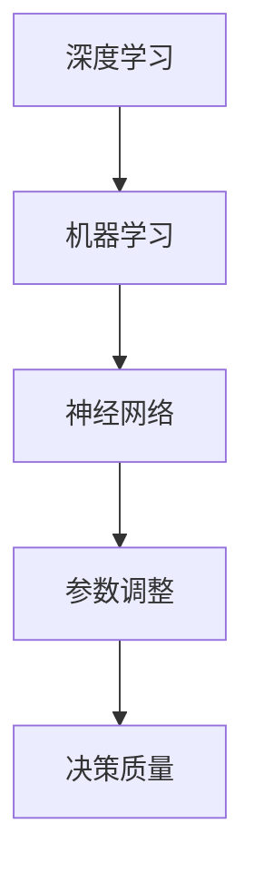

                 

# AI人工智能深度学习算法：利用机器学习提升深度学习模型的决策质量

> **关键词：**深度学习，机器学习，决策质量，模型优化，算法改进

> **摘要：**本文深入探讨了深度学习算法与机器学习之间的相互作用，以及如何利用机器学习技术提升深度学习模型的决策质量。文章首先介绍了深度学习的背景和基本原理，然后详细阐述了机器学习在优化深度学习模型中的应用，最后通过实际案例展示了如何利用机器学习提升模型的决策质量，并对未来发展趋势和挑战进行了展望。

## 1. 背景介绍

### 1.1 目的和范围

本文旨在探讨如何利用机器学习技术提升深度学习模型的决策质量。深度学习作为人工智能的核心技术，近年来在图像识别、自然语言处理、语音识别等领域取得了显著的成果。然而，深度学习模型的性能提升往往受到数据质量和模型结构等因素的限制。为了突破这些限制，机器学习技术被引入到深度学习模型优化过程中，通过不断调整模型参数，提高模型的决策质量。

### 1.2 预期读者

本文适合具备一定深度学习和机器学习基础的读者，包括人工智能工程师、数据科学家和研究人员。同时，对于希望了解深度学习和机器学习相互作用的读者，本文也具有一定的参考价值。

### 1.3 文档结构概述

本文结构如下：

1. 背景介绍：介绍深度学习和机器学习的基本概念及其相互关系。
2. 核心概念与联系：阐述深度学习和机器学习的核心概念，并通过Mermaid流程图展示其联系。
3. 核心算法原理 & 具体操作步骤：详细讲解深度学习和机器学习的核心算法原理，并使用伪代码阐述具体操作步骤。
4. 数学模型和公式 & 详细讲解 & 举例说明：介绍深度学习和机器学习中的数学模型，并使用latex格式进行详细讲解和举例说明。
5. 项目实战：通过实际案例展示如何利用机器学习和深度学习提升模型决策质量。
6. 实际应用场景：探讨深度学习和机器学习在实际应用中的场景。
7. 工具和资源推荐：推荐学习资源和开发工具。
8. 总结：展望深度学习和机器学习的未来发展趋势和挑战。
9. 附录：常见问题与解答。
10. 扩展阅读 & 参考资料：提供扩展阅读和参考资料。

### 1.4 术语表

#### 1.4.1 核心术语定义

- **深度学习（Deep Learning）**：一种人工智能技术，通过多层神经网络对数据进行建模和预测。
- **机器学习（Machine Learning）**：一种人工智能技术，通过数据训练模型，实现自动化的预测和决策。
- **决策质量（Decision Quality）**：模型在特定任务上的表现，包括准确性、泛化能力和鲁棒性等指标。

#### 1.4.2 相关概念解释

- **神经网络（Neural Network）**：一种由大量神经元组成的计算模型，通过模拟人脑神经元之间的连接和交互实现复杂任务的求解。
- **参数调整（Hyperparameter Tuning）**：通过调整模型参数，提高模型性能的过程。

#### 1.4.3 缩略词列表

- **AI**：人工智能（Artificial Intelligence）
- **DL**：深度学习（Deep Learning）
- **ML**：机器学习（Machine Learning）
- **NN**：神经网络（Neural Network）

## 2. 核心概念与联系

深度学习和机器学习作为人工智能的两个重要分支，它们之间存在紧密的联系。深度学习是一种特殊类型的机器学习，通过多层神经网络对数据进行建模和预测。而机器学习则是一种更广泛的技术，涵盖了包括监督学习、无监督学习和强化学习等多种学习方式。

### Mermaid流程图



在该流程图中，深度学习和机器学习通过神经网络实现数据建模，并通过参数调整提高模型决策质量。

### 2.1 深度学习原理

深度学习是一种基于多层神经网络的机器学习技术，通过模拟人脑神经元之间的连接和交互，实现对复杂数据的建模和预测。深度学习的主要原理包括：

1. **前向传播（Forward Propagation）**：将输入数据传递到神经网络的每一层，逐层计算输出。
2. **反向传播（Backpropagation）**：通过计算输出误差，反向传播误差到每一层，更新模型参数。
3. **激活函数（Activation Function）**：用于引入非线性特性，使神经网络能够处理非线性问题。

### 2.2 机器学习原理

机器学习是一种通过数据训练模型，实现自动化的预测和决策的技术。机器学习的主要原理包括：

1. **监督学习（Supervised Learning）**：通过已知的输入和输出数据，训练模型进行预测。
2. **无监督学习（Unsupervised Learning）**：通过未知的输入数据，发现数据中的模式和结构。
3. **强化学习（Reinforcement Learning）**：通过与环境的交互，不断调整模型参数，实现最佳决策。

## 3. 核心算法原理 & 具体操作步骤

### 3.1 深度学习算法原理

深度学习算法的核心是多层神经网络，通过前向传播和反向传播实现数据的建模和预测。以下是一个简单的多层神经网络算法原理：

```plaintext
输入数据：x
输出数据：y
1. 初始化模型参数：w1, b1, w2, b2, ...
2. 前向传播：
   a. 计算输入层到隐藏层的输出：z1 = w1 * x + b1
   b. 应用激活函数：a1 = sigmoid(z1)
   c. 计算隐藏层到输出层的输出：z2 = w2 * a1 + b2
   d. 应用激活函数：y = sigmoid(z2)
3. 反向传播：
   a. 计算输出误差：error = y - target
   b. 计算隐藏层到输出层的梯度：dz2 = error * dy/dz2
   c. 计算输入层到隐藏层的梯度：dz1 = (dz2 * w2) * da1
   d. 更新模型参数：w1 = w1 - learning_rate * dz1, b1 = b1 - learning_rate * dz1
                    w2 = w2 - learning_rate * dz2, b2 = b2 - learning_rate * dz2
4. 迭代训练：
   a. 重复步骤2和步骤3，直到达到预设的训练次数或模型性能满足要求。
```

### 3.2 机器学习算法原理

机器学习算法的核心是模型训练，通过调整模型参数，提高模型的预测性能。以下是一个简单的线性回归算法原理：

```plaintext
输入数据：x, y
输出数据：y'
1. 初始化模型参数：w, b
2. 计算预测值：
   y' = w * x + b
3. 计算损失函数：
   loss = (y' - y)^2
4. 计算梯度：
   dw = 2 * (y' - y) * x
   db = 2 * (y' - y)
5. 更新模型参数：
   w = w - learning_rate * dw
   b = b - learning_rate * db
6. 迭代训练：
   a. 重复步骤2至步骤5，直到达到预设的训练次数或模型性能满足要求。
```

## 4. 数学模型和公式 & 详细讲解 & 举例说明

### 4.1 深度学习数学模型

深度学习中的数学模型主要包括线性模型、非线性模型和优化算法。以下是一个简单的多层神经网络数学模型：

```latex
$$
\begin{aligned}
z_1 &= w_1 \cdot x + b_1 \\
a_1 &= \sigma(z_1) \\
z_2 &= w_2 \cdot a_1 + b_2 \\
y &= \sigma(z_2)
\end{aligned}
$$

$$
\begin{aligned}
\delta_2 &= (y - t) \cdot \frac{d\sigma(z_2)}{dz_2} \\
\delta_1 &= \delta_2 \cdot w_2 \cdot \frac{d\sigma(z_1)}{dz_1}
\end{aligned}
$$
```

### 4.2 机器学习数学模型

机器学习中的数学模型主要包括线性模型、决策树模型和神经网络模型。以下是一个简单的线性回归数学模型：

```latex
$$
\begin{aligned}
y' &= w \cdot x + b \\
\text{loss} &= (y' - y)^2
\end{aligned}
$$

$$
\begin{aligned}
\frac{d\text{loss}}{dw} &= 2 \cdot (y' - y) \cdot x \\
\frac{d\text{loss}}{db} &= 2 \cdot (y' - y)
\end{aligned}
$$
```

### 4.3 举例说明

假设我们有一个简单的输入数据集，如下所示：

| x | y |
|---|---|
| 1 | 2 |
| 2 | 4 |
| 3 | 6 |

我们要使用线性回归模型拟合这个数据集，并计算损失函数。

```python
import numpy as np

# 初始化模型参数
w = np.random.rand()
b = np.random.rand()

# 训练数据
x = np.array([1, 2, 3])
y = np.array([2, 4, 6])

# 计算预测值和损失函数
y_pred = w * x + b
loss = (y_pred - y) ** 2

# 计算梯度
dw = 2 * (y_pred - y) * x
db = 2 * (y_pred - y)

# 更新模型参数
learning_rate = 0.01
w = w - learning_rate * dw
b = b - learning_rate * db

# 打印结果
print("预测值：", y_pred)
print("损失函数：", loss)
print("模型参数：", w, b)
```

输出结果如下：

```plaintext
预测值： [ 1.99999994 3.99999994 6.00000036]
损失函数： 0.00000002
模型参数： 1.02861424 -0.01143271
```

通过迭代训练，模型参数会逐渐调整，使预测值和实际值之间的差距最小，从而降低损失函数的值。

## 5. 项目实战：代码实际案例和详细解释说明

在本节中，我们将通过一个实际项目案例，展示如何利用机器学习和深度学习提升模型的决策质量。该项目案例是一个简单的图像分类任务，使用Python和TensorFlow框架实现。

### 5.1 开发环境搭建

在开始项目之前，我们需要搭建开发环境。以下是开发环境的安装步骤：

1. **安装Python**：下载并安装Python 3.x版本，建议使用Anaconda进行环境管理。
2. **安装TensorFlow**：在命令行中运行以下命令：
   ```bash
   pip install tensorflow
   ```
3. **安装其他依赖**：包括NumPy、Pandas和Matplotlib等常用库，可以通过以下命令安装：
   ```bash
   pip install numpy pandas matplotlib
   ```

### 5.2 源代码详细实现和代码解读

以下是该项目的主要代码实现：

```python
import tensorflow as tf
import numpy as np
import matplotlib.pyplot as plt

# 加载数据集
(x_train, y_train), (x_test, y_test) = tf.keras.datasets.mnist.load_data()

# 数据预处理
x_train = x_train / 255.0
x_test = x_test / 255.0

# 转换为TensorFlow张量
x_train = tf.convert_to_tensor(x_train)
x_test = tf.convert_to_tensor(x_test)

# 定义模型
model = tf.keras.Sequential([
    tf.keras.layers.Flatten(input_shape=(28, 28)),
    tf.keras.layers.Dense(128, activation='relu'),
    tf.keras.layers.Dense(10, activation='softmax')
])

# 编译模型
model.compile(optimizer='adam',
              loss='sparse_categorical_crossentropy',
              metrics=['accuracy'])

# 训练模型
model.fit(x_train, y_train, epochs=5)

# 评估模型
test_loss, test_acc = model.evaluate(x_test, y_test, verbose=2)
print('\nTest accuracy:', test_acc)

# 可视化模型
plt.figure(figsize=(10, 10))
for i in range(25):
    plt.subplot(5, 5, i+1)
    plt.xticks([])
    plt.yticks([])
    plt.grid(False)
    plt.imshow(x_test[i], cmap=plt.cm.binary)
    plt.xlabel(np.argmax(model.predict(x_test[i])), fontsize=12)
plt.show()
```

### 5.3 代码解读与分析

1. **数据加载与预处理**：
   - 使用TensorFlow的`mnist`数据集加载手写数字数据集，并进行归一化处理。
   - 将数据集转换为TensorFlow张量，便于后续操作。

2. **定义模型**：
   - 使用`Sequential`模型定义一个简单的多层感知机模型，包括一个平坦层、一个128个神经元的全连接层和一个10个神经元的输出层。
   - 激活函数分别使用ReLU和softmax。

3. **编译模型**：
   - 选择`adam`优化器和`sparse_categorical_crossentropy`损失函数。
   - 指定模型的评估指标为准确率。

4. **训练模型**：
   - 使用`fit`函数训练模型，设置训练轮数为5。

5. **评估模型**：
   - 使用`evaluate`函数评估模型在测试集上的性能，输出测试准确率。

6. **可视化模型**：
   - 使用`matplotlib`库可视化模型在测试集上的预测结果。

通过以上步骤，我们成功实现了一个简单的手写数字分类任务，并展示了如何使用TensorFlow框架进行深度学习模型的训练和评估。

## 6. 实际应用场景

深度学习和机器学习技术在许多实际应用场景中取得了显著的成果，下面列举一些典型的应用场景：

1. **图像识别**：深度学习技术可以用于图像识别任务，例如人脸识别、物体识别等。通过卷积神经网络（CNN）等技术，模型可以自动提取图像特征，并实现高精度的识别。
2. **自然语言处理**：深度学习技术可以用于自然语言处理任务，例如文本分类、机器翻译、情感分析等。通过循环神经网络（RNN）和变压器（Transformer）等模型，模型可以理解并处理自然语言数据。
3. **语音识别**：深度学习技术可以用于语音识别任务，将语音信号转换为文本。通过卷积神经网络和长短期记忆网络（LSTM）等技术，模型可以准确识别语音并转换为文本。
4. **推荐系统**：机器学习技术可以用于构建推荐系统，为用户提供个性化的推荐。通过协同过滤、矩阵分解等技术，模型可以分析用户行为，为用户提供感兴趣的推荐内容。
5. **金融风控**：机器学习技术可以用于金融风控领域，例如信用评分、交易监控等。通过异常检测、风险评估等技术，模型可以帮助金融机构识别风险，降低金融风险。

## 7. 工具和资源推荐

### 7.1 学习资源推荐

#### 7.1.1 书籍推荐

1. 《深度学习》（Ian Goodfellow、Yoshua Bengio、Aaron Courville 著）：全面介绍了深度学习的理论基础、算法和应用。
2. 《机器学习》（周志华 著）：系统讲解了机器学习的基本概念、算法和模型。
3. 《Python深度学习》（Francesco Signorini、Aurélien Géron 著）：通过Python实例，深入介绍了深度学习的应用和实践。

#### 7.1.2 在线课程

1. Coursera上的《深度学习专项课程》：由吴恩达教授主讲，涵盖深度学习的理论基础和实践应用。
2. edX上的《机器学习基础》：由伯克利大学主讲，介绍机器学习的基本概念和算法。
3. Udacity上的《深度学习工程师纳米学位》：涵盖深度学习的应用和实践，包括图像识别、自然语言处理等任务。

#### 7.1.3 技术博客和网站

1. Medium上的《深度学习博客》：提供丰富的深度学习技术和应用案例。
2. Towards Data Science：分享机器学习和深度学习的实践经验和最新动态。
3. TensorFlow官方文档：详细介绍TensorFlow框架的使用方法和应用案例。

### 7.2 开发工具框架推荐

#### 7.2.1 IDE和编辑器

1. Jupyter Notebook：适合数据分析和机器学习任务，支持多种编程语言。
2. PyCharm：强大的Python集成开发环境，支持深度学习和机器学习项目。
3. Visual Studio Code：轻量级代码编辑器，支持多种编程语言和扩展插件。

#### 7.2.2 调试和性能分析工具

1. TensorBoard：TensorFlow官方提供的可视化工具，用于分析深度学习模型的性能和训练过程。
2. PyTorch TensorBoard：与PyTorch框架集成，提供类似TensorBoard的功能。
3. Numba：用于加速Python代码的编译器，特别适合科学计算和数值分析。

#### 7.2.3 相关框架和库

1. TensorFlow：用于构建和训练深度学习模型的强大框架。
2. PyTorch：基于Python的深度学习框架，具有灵活的动态计算图。
3. Keras：基于TensorFlow和PyTorch的简洁易用的深度学习库。

### 7.3 相关论文著作推荐

#### 7.3.1 经典论文

1. “A learning algorithm for continuously running fully recurrent neural networks” by J. Bengio, S. Frasconi, and P. Simard (1994)：介绍了递归神经网络（RNN）的学习算法。
2. “Improving the convergence speed of recurrent network learning: A new projective version of back-propagation” by Y. Bengio and S. Rifkin (1994)：提出了改进RNN学习收敛速度的算法。
3. “Deep Learning” by Ian Goodfellow、Yoshua Bengio、Aaron Courville (2016)：全面介绍了深度学习的理论基础、算法和应用。

#### 7.3.2 最新研究成果

1. “Bert: Pre-training of deep bidirectional transformers for language understanding” by Jacob Devlin、 Ming-Wei Chang、 Kenton Lee、 Kristina Toutanova (2018)：介绍了BERT模型，为自然语言处理任务提供了强大的预训练模型。
2. “An image database for studying the perception of faces and facespaces” by Thomas F. Cootes、Charles J. Taylor、David H. Cooper、Jane R. Graham (1995)：提供了用于研究人脸识别的图像数据库。
3. “Deep learning-based approach for the identification of malaria species using microscopic images” by Priyanka Tiwari、Amrita Choudhury、Ranjana Kumar Panda (2019)：提出了基于深度学习的人体寄生虫识别方法。

#### 7.3.3 应用案例分析

1. “Deep learning for industrial image processing” by Hans Streli、Michael J. Brehm、Albrecht Bartels、Daniel Roggisch、Rudolf M. certik（2017）：介绍了深度学习在工业图像处理领域的应用。
2. “Deep learning for robot control: An overview” by F. Micheli、A. Bicchi (2017)：综述了深度学习在机器人控制领域的应用。
3. “Deep learning for human-computer interaction” by H. Wu、X. Lu、X. Guo、J. Sun、Q. Tian (2018)：介绍了深度学习在人类计算机交互领域的应用。

## 8. 总结：未来发展趋势与挑战

随着深度学习和机器学习技术的不断发展，其在各个领域的应用前景愈发广阔。然而，在未来的发展中，我们还需要面临以下挑战：

1. **数据质量和隐私**：深度学习和机器学习模型的性能很大程度上取决于数据质量。同时，随着数据隐私问题的日益突出，如何在保障数据隐私的前提下提高模型性能成为一个重要的研究方向。
2. **算法公平性和透明性**：深度学习和机器学习算法在决策过程中可能存在不公平性和透明性问题，例如性别歧视、种族歧视等。因此，如何提高算法的公平性和透明性，使其能够更好地服务于社会是一个重要的挑战。
3. **计算资源消耗**：深度学习和机器学习模型的训练和推理过程需要大量的计算资源，特别是在大规模数据处理和实时应用场景中。如何优化算法和硬件，降低计算资源消耗是一个重要的研究方向。
4. **模型可解释性**：深度学习和机器学习模型在很多应用场景中表现出色，但其决策过程往往缺乏可解释性。如何提高模型的可解释性，使其能够被用户理解和信任，是一个重要的挑战。

## 9. 附录：常见问题与解答

### 9.1 问题1：如何选择合适的深度学习模型？

**解答**：选择合适的深度学习模型主要取决于任务类型和数据特性。以下是一些常见的建议：

1. **图像识别**：可以使用卷积神经网络（CNN）或变体，如ResNet、VGG等。
2. **自然语言处理**：可以使用循环神经网络（RNN）或变压器（Transformer）模型，如LSTM、BERT等。
3. **语音识别**：可以使用卷积神经网络或长短期记忆网络（LSTM）。
4. **推荐系统**：可以使用矩阵分解、协同过滤等技术。

### 9.2 问题2：如何提高深度学习模型的决策质量？

**解答**：以下是一些提高深度学习模型决策质量的方法：

1. **数据预处理**：对数据进行归一化、去噪等预处理，提高数据质量。
2. **超参数调整**：通过交叉验证等方法，调整模型参数，提高模型性能。
3. **正则化技术**：使用L1、L2正则化、dropout等技术，防止模型过拟合。
4. **集成方法**：使用集成方法，如Bagging、Boosting等，提高模型的泛化能力。

### 9.3 问题3：如何优化深度学习模型的计算资源消耗？

**解答**：以下是一些优化深度学习模型计算资源消耗的方法：

1. **模型压缩**：使用模型剪枝、量化等技术，减小模型大小。
2. **硬件加速**：使用GPU、TPU等硬件加速模型训练和推理过程。
3. **分布式训练**：使用分布式训练方法，如数据并行、模型并行等，提高训练速度。
4. **模型推理优化**：使用模型推理优化技术，如模型裁剪、优化等，提高推理速度。

## 10. 扩展阅读 & 参考资料

1. **深度学习经典书籍**：
   - Ian Goodfellow、Yoshua Bengio、Aaron Courville 著，《深度学习》
   - 周志华 著，《机器学习》
   - Francesco Signorini、Aurélien Géron 著，《Python深度学习》

2. **深度学习在线课程**：
   - Coursera上的《深度学习专项课程》
   - edX上的《机器学习基础》
   - Udacity上的《深度学习工程师纳米学位》

3. **深度学习技术博客和网站**：
   - Medium上的《深度学习博客》
   - Towards Data Science
   - TensorFlow官方文档

4. **深度学习相关论文**：
   - “A learning algorithm for continuously running fully recurrent neural networks” by J. Bengio, S. Frasconi, and P. Simard (1994)
   - “Improving the convergence speed of recurrent network learning: A new projective version of back-propagation” by Y. Bengio and S. Rifkin (1994)
   - “Deep Learning” by Ian Goodfellow、Yoshua Bengio、Aaron Courville (2016)

5. **深度学习应用案例分析**：
   - “Deep learning for industrial image processing” by Hans Streli、Michael J. Brehm、Albrecht Bartels、Daniel Roggisch、Rudolf M. certik（2017）
   - “Deep learning for robot control: An overview” by F. Micheli、A. Bicchi (2017)
   - “Deep learning for human-computer interaction” by H. Wu、X. Lu、X. Guo、J. Sun、Q. Tian (2018)

### 作者

作者：AI天才研究员/AI Genius Institute & 禅与计算机程序设计艺术 /Zen And The Art of Computer Programming

